# 【斯坦福大学】CS221 人工智能原理与技术 · 2019秋（完结·中英字幕·人工校对中) - P16：Lecture 16 Logic 1 - Propositional Logic - 鬼谷良师 - BV16E411J7AQ

 All right， let's get started。

 So today's lecture is going to be on logic。 To motivate things。

 I want to start with a hopefully easy question。 So if x1 plus x2 is 10 and x1 minus x2 is 4。

 what is x1？ Someone shout out the answer once you hear it out。 7。 So how did you get 7？ Yeah。

 you do the algebra thing that you learned a while ago。 So what's the point of this？

 So notice that this is a factor graph。 We have two variables。

 They're connected by two constraints or factors。 And you could， in principle。

 go and use backtracking search to try different values of x1 and x2。

 until you eventually arrive at the right answer。 But clearly。

 this is not really an efficient way to do it。 And somehow， in this problem。

 there's extra structure that we can leverage to arrive at the answer in a much， much easier way。

 And this is going to be the poster child of what we're going to explore today。

 And on next Monday's lecture， how you can do logical inference to arrive at answers much faster than you might have otherwise。

 So we've arrived at the end of the class。 And I want to just reflect a little bit on what we've learned。

 And maybe this will be also a good review for the exam。 So in this class。

 we've both did everything on the modeling inference learning paradigm。

 And the picture you should have in your head is this。 Abstractly， we take some data。

 we perform some learning on it， and we produce a model。 And using that model。

 we can perform inference， which looks like taking in a question and returning an answer。

 So what does this look like for all the different types of instantiations we've looked at？

 So for search problems， the model is a search problem。 And the inference asks the question。

 what is the minimum cost path？ In MDPs and games， we ask the question。

 what is the maximum value policy？ In CSPs， we ask the question。

 what is the maximum weight assignment？ And in Bayesian networks。

 we can answer probabilistic inference queries of the form。

 What is the probability of some query variables conditioned on some evidence variables？

 And for each of these cases， we looked at the modeling， we looked at the inference algorithms， and。

 then we looked at different types of learning procedures， going backwards， maximum likelihood。

 We looked at various reinforcement learning algorithms。

 we looked at structured perceptron and so on。 And hopefully。

 this kind of sums up the kind of the world view that CS student one is trying to impart。

 Is that there are these different components。 And depending on what kind of modeling you choose。

 you have different types of algorithms and， learning algorithms。

 inference algorithms and learning algorithms that emerge。 Okay。

 so we looked at several modeling paradigms， roughly broken into three categories。

 The first is state based models， search problems， MDPs and games。 And here。

 the way you think about modeling is in terms of states。

 And as nodes in a graph and actions that take you between different states。

 which incur either a cost or give you some sort of reward。

 And your goal is just to find paths or contingent paths or policies in these graphs。

 Then we shifted gears to talk about variable based models。

 where instead we think about variables and factors that constrain or。

 these variables to take on certain types of values。 So in today's lecture。

 I'm going to talk about logical based models。 So we're going to look at propositional logic and。

 first order logic， which are two different types of logical languages or models。

 And we're going to instead think about logical formulas and inference rules。

 Which is going to be another way of kind of thinking about modeling the world。 Historically。

 logic was actually the dominant paradigm in AI before the 1990s。

 So it might be hard to kind of believe now， but， just imagine the amount of excitement that is going into deep learning today。

 This equal amount of excitement was going into logical based methods in。

 AI in the 80s and before that too。 But there were kind of two problems with logic。

 One is that logic was deterministic， so， it didn't handle uncertainty very well。

 And that's why probabilistic inference and， other methods were developed to address this。

 And it was also rule based， which didn't allow you to naturally ingest。

 a large amount of data to guide behavior。 And the emergence of machine learning has addressed this。

 But one strength that kind of has been left on the table is the expressiveness。

 And I kind of emphasize that logic， as you will see。

 gives you the ability to express very complicated things in， a very succinct way。

 And that is kind of the main point of logic， which I really want everyone to kind of appreciate。

 And hopefully this will become clear through examples。 As I'm motivated on the first day of class。

 the reason one good way to think about why we might want logic is。

 imagine you want to lie on the beach， and， you want your assistant to be able to do things for you。

 But hopefully it's more like data from Star Trek rather than Siri。 You want to take an assistant。

 you want to be able to at least tell， that information and ask questions， and。

 have these questions actually be answered in response to。

 reflect the information that you've told me。 So just kind of a brief refresher on the first day of class。

 I showed you this demo where you can talk to the system。 And say things and ask questions。

 so a small example is， let's say all students like CS221， it's great， it teaches important things。

 And Alice does not like CS221， and then you can ask， is Alice a student。

 and the answer should be no， because it kind of kind of reason about this。

 And just to dive under the hood a little bit， inside it has some sort of knowledge base that contains the information that it has。

 We'll come back to this in a second。 Okay， so this assistant needs to be able to digest heterogeneous information。

 in the form of natural language， other lenses。 And it has to reason deeply with that information。

 so， it can't just do super visual pattern matching。

 So I've kind of suggested natural language as an interface to this。

 And natural language is very powerful because I can stand up here and。

 use natural language to give a lecture， and hopefully you guys can understand at least some of it。

 But let's go with natural language for now。 So here's an example of how you can draw inferences using natural language。

 Okay， so a dime is better than a nickel。 A nickel is better than a penny。

 so therefore a dime is better than a penny。 Okay， so this seems like pretty sound reasoning。

 So what about this example？ A penny is better than nothing。 Nothing is better than world peace。

 Therefore a penny is better than world peace， right？ Okay， so something clearly went wrong here。

 And this is because natural language is kind of slippery。 It's not very precise。

 which makes it very easy to make these mistakes。 But if we step back and think about what is the role of natural language。

 it's really language itself is an mechanism for expression。 So there are many types of languages。

 There's natural languages。 There's programming languages， which all of you are familiar with。

 But we're going to talk about a different type of language called logical languages。

 Like programming languages， they're going to be formal。

 So we're going to be absolutely clear what we mean。

 but when we have a statement in a logical language。 But like natural language。

 it's going to be declarative。 And this might be a little bit harder to appreciate right now， but。

 it means that there's kind of a more of a one to one isomorphism between。

 logical languages and natural languages as a compared to programming languages and natural language。

 Okay， so in a logical language， we want to have two properties。 First。

 the logical language should be rich enough to represent knowledge about the world。 And secondly。

 it's not sufficient just to represent the knowledge because。

 a hard drive can represent the knowledge， but， you have to be able to use that knowledge in a way to reason with it。

 A logic contains three ingredients， which I'll go through in subsequent slides。

 There's a syntax which defines what kind of expressions are valid or， grammatical in this language。

 There's semantics which is for each expression or formula， what does it mean？

 And mean means is actually mean something very precise， which I'll come back to。

 And then inference rules allow you to take various formulas and， do kind of operations on them。

 Just like in the beginning when we have the algebra problem， you can add equations。

 you can move things to different sides。 You can perform these rules which are syntactic manipulations on these formulas or。

 expressions that preserve some sort of semantics。 Okay。

 so just to talk about syntax versus semantics a little bit。

 because I think this might be a slightly subtle point， which hopefully。

 will be clear with this example。 So syntax refers to what are the valid expressions in this language。

 And semantics is about what these expressions mean。

 So here's an example of two expressions which have different syntax。

 Two plus three is not the same thing as three plus two， but， they have the same semantics。

 both of them mean the number five。 Here's a case where we have two expressions with the same syntax。

 three divided by two， but they have different semantics depending on which language you're in。

 So in order to define a language precisely， you not only have to specify the syntax but also the semantics。

 Because just by looking at this syntax， you don't actually know what its meaning is unless I tell you。

 There's a bunch of different logics。 The ones highlighted in bold are the ones I'm going to actually talk about in this class。

 So today's lecture is going to be on propositional logic。

 And then in the next lecture I'm going to look at for sort of logic。 As with most models in general。

 there's going to be a trade-off between the expressivity and the computational efficiency。

 So as I go down this list to first order logic and beyond。

 I'm going to be able to express more and more things using the language。

 But it's going to be harder to do computation in that language。 Okay。

 so this is the kind of a key diagram to having your head while I go through syntax。

 semantics and inference rules。 So for every， I'm going to do this for propositional logic and then in a Mondays lecture。

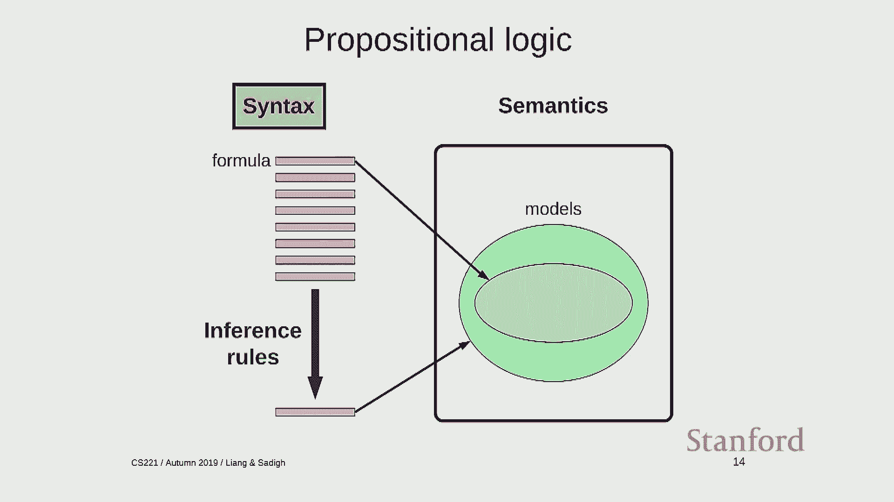

 I'm going to do it for first order logic。 So just to get this on the board， we have syntax。

 hope we have semantics。 And then we have inference rules。 Let's just write it there。

 So this lecture is going to have a lot of definitions and concepts in them。

 just to give you a warning。 There's a lot of kind of ideas here。

 They're all very kind of simple by themselves and they kind of piece together。

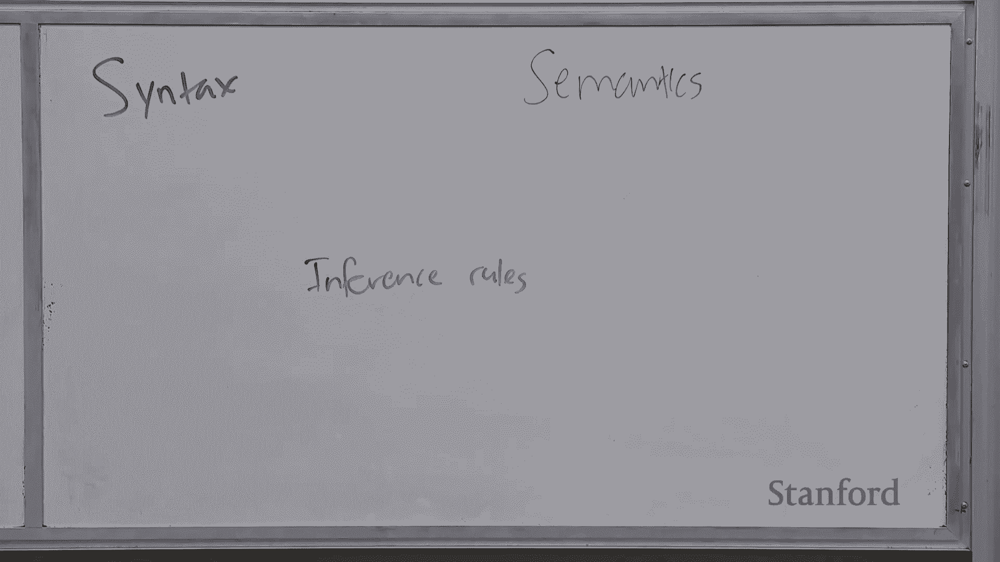

 but there's just going to kind of be a barrage of terms。

 And I'll try to write them on the board so that you can kind of remember them。

 So in order to define a logic called language， I need to specify what are the formulas。

 So one maybe other comment about logic is that some of you probably taken CS103 or。

 an equivalent class where you've been exposed to propositional logic。

 What I'm going to do here is kind of a much more methodological and rigorous treatment of it。

 I want to distinguish the difference between being able to do logic yourself。

 Like if I gave you some logical expression， you can manipulate it。

 That's different than talking about a general set of algorithms that can， operate on logic itself。

 Right， so remember in AI， we're not interested in you guys doing logic because， that's just I。

 that's intelligence。 But we're interested in developing general principles or。

 general algorithms that can actually do the work for you。 Okay， just like in the Bayesian networks。

 it's very fine， well that you guys can manipulate and calculate conditional marginal probability。

 yourself。 But the whole point is we devise algorithms like Gibbs sampling and。

 variable elimination that can work on any Bayesian network。 Just want to get that out there。 Okay。

 so let's begin。 This is going to be building from the ground up。 So first of all。

 there are in propositional logic， there are a set of propositional symbols。

 These are typically going to be uppercase letters or even words。 And these are the atomic formulas。

 These are formulas that can't be any smaller。 There's going to be logical connectives such as not and。

 or implication and bidirectional implication。 And then the set of formulas are built up recursively。

 So if F and G are formulas， then I can， these are also formulas。 I can have not F。

 I can have F and G， F or G， F implies G and， F bidirectional implication G or equivalent to G。 Okay。

 so key， ideas here are we have。

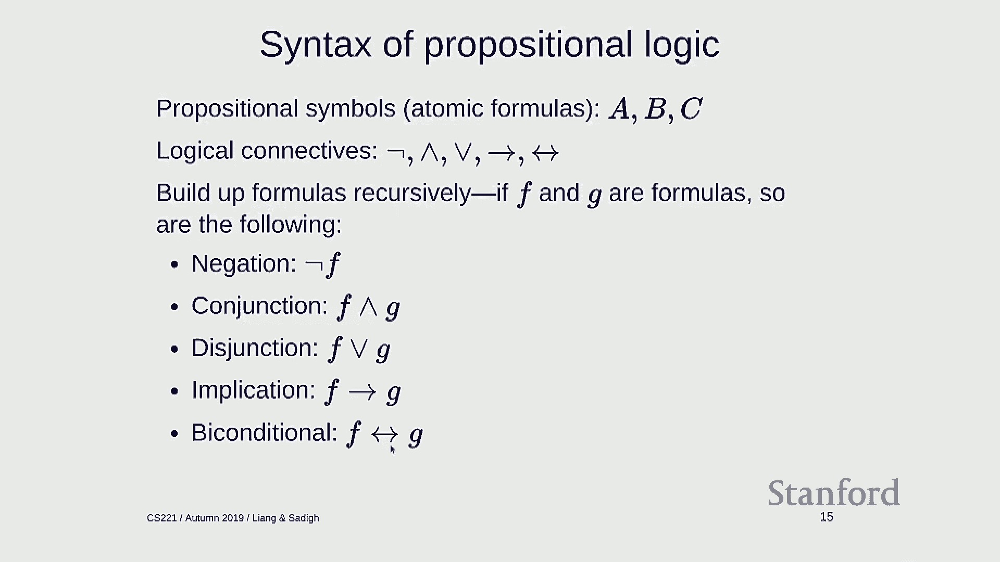

 propositional symbols。 I'm going to move it down so that we get a round-up of space。

 So these are things like A， that gives rise to formulas in general。 Which is going to be denoted F。

 And so here are some examples。

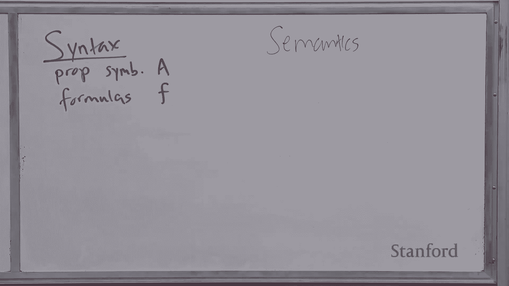

 So A is a formula。 Okay， it's in particular it's an atomic formula， which is a propositional symbol。

 Not A is a formula， not B implies C is a formula。 This is a formula。 This is a formula。

 Double negation is fine。 This is not a formula because there's no connective between A and not B。

 This is also not a formula because what the heck is plus？ It's not a connective。

 So I think in thinking about logic， you really have to divorce yourself。

 from the common sense that you all come with in interpreting these symbols。 Right。

 not is just a symbol or is just a symbol。 And they don't have any semantics。 In fact。

 I can go and define some semantics which would be completely different than， what you imagine。

 it would be a valid logical system。 These are just symbols。

 Now all I'm here defining is what symbols are valid and。

 what symbols are not valid slash grammatical。 Okay？

 Any questions about the syntax of propositional logic？

 So the syntax gives you the set of formulas or， basically statements you can make。

 So you can think about as this is our language。 If we could only speak in propositional logic。

 I could say A or not B or A or A implies C and， that's all I would be able to say。

 And of course now I have to tell you what do these things mean。 Okay。

 and this is the realm of semantics。 So semantics， there's going to be a number of definitions。

 So first is a model。 So this is really unfortunate and confusing terminology， but。

 this is standard in the logical literature， so I'm just going to use it。

 So a model which is different from our general notion of a model。 For example， hit a mark up model。

 for example， a model here in propositional， logic just refers to an assignment of truth values to propositional symbols。

 Okay？ So if you have three propositional symbols， then there are a possible models。 A is one。

 B is zero， C is zero， for example。 So these are just complete assignments that we saw from factor graphs。

 but， now in this new kind of language。 Okay， so that's the first concept。

 In the first of the logic models are going to be more complicated， but。

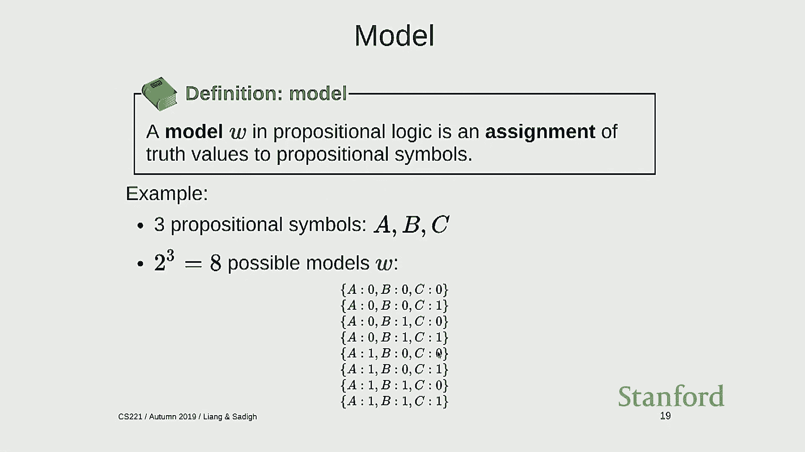

 for now think about them as complete assignments。

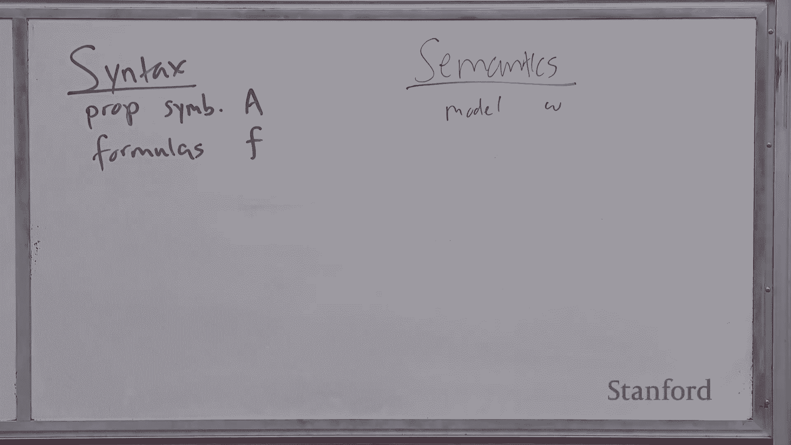

 And I'm using W because sometimes you also call them worlds。

 Because a complete assignment slash a model is both to represent the state of。

 the world at any one particular point。 Yeah？ >> And if only be there true or false， zero or one。

 does that like the domain， I guess？ >> Yeah， so the question is。

 can each propositional symbol either be true or， false， and logic as I'm presenting it， yes。

 only true or false or zero or one。 Okay， so these are models。

 And next is a key thing that actually defines the semantics， which is the interpretation function。

 So the interpretation function takes a formula and a model and returns true。

 if that formula is true in this model and false， otherwise。 Okay？

 So I can make the interpretation function whatever I want。 And that just gives me the semantics。

 So when I talk about what are the semantics， it's the interpretation function。 Function， I， F， F， D。

 So the way to think about this is I'm going to represent formulas as these， horizontal bars。 Okay。

 so this is， think about this as a thing you say。 It sits outside the reality in some sense。

 And then this box I'm going to draw on the space of all possible models。

 So think about this is a space of situations that we could be in the world。

 And a point here corresponds to a particular model。

 So the interpretation function takes one formula， takes a model and， says。

 is this statement true if the world looked like this？ Okay？

 So just to ground this out a little bit more， I'm going to define this for propositional logic。

 again recursively。 So for propositional symbols， P。

 I'm just going to interpret that propositional symbol as a look up in the model。 Right。

 so if I'm asking， hey， it's true， why go to my model， and， I see， well。

 does it say it's true or false？ Okay？ That's a base case。 So recursively。

 I can define the interpretation of any formula in terms of， its sub formulas。

 And the way I do this is suppose I have two formulas， F and G， and， they're interpreted in some way。

 Okay？ And now I take a formula， let's say， F and G。 Okay。

 so what is the interpretation of F and G in W？ Well， it's given by this truth table。

 So if F is zero and G is interpreted to be zero， then F and G is also interpreted to be zero。 And 0。

 1 maps to 0， 1， 0 maps to 0， and 1， 1 maps to 1。 So you can verify that this is kind of your intuitive notion of what。

 and， should be。 Right？ Or is one if at least one of F and G are one。

 Implication is one if F is zero or G is one。 In bidirectional implication。

 just means that if F and G evaluate to the same thing。

 not F is clearly just the negation of whatever the interpretation of F is。 Okay。

 so this slide gives you the full semantics of propositional logic。

 There's nothing more to propositional logic， and， at least the definition of what it is aside from this。

 Let me go through an example and then I'll maybe take questions。 So let's look at this formula。

 not A and B， bidirectional implication C。 And this model， A is 1， B is 1， C is 0。

 How do I interpret this formula against this model？ Well。

 I look at the tree which breaks down the formula。 So if I look at the leaves， let's start bottom up。

 So the interpretation of A against W is just 1。 Because for propositional symbols。

 I just look up what A is and A is 1 here。 The interpretation of not A is 0。

 because if I look back at this table， if this evaluates to 1， then this evaluates to 0。

 I'm just looking based on the table。 B is 1 just by table lookup。

 And then not A and B is 0 because I just take these two values and， I add them together。

 C is 0 by table lookup。 And then bidirectional implication is interpreted as 1 here because 0 is equal to 0。

 Yeah， question？ >> The interpretation function is user defined in this case。

 You're not learning how to accomplish a logic， just like if you're in propositional logic。

 then they have two tables。 >> Yeah， so the question is interpretation functions as user defined。

 It is just written down。 This is it。 There's no learning。 It's just these are， this is what you get。

 It's not user defined in a sense that not everyone's going to go define their own， truth tables。

 Some logicians came up with this and that's what it is。

 But you could define your own logics and it's kind of a fun thing to try doing。 Okay。

 any other questions about interpretation functions and models？

 So now we're kind of connecting syntax and semantics， right？

 So interpretation function binds what are formulas which are in syntax。

 land to a notion of models which are in semantics。 So a lot of logic is very。

 it might seem a little bit pedantic， but it's just because we're trying to be very rigorous in a way that doesn't。

 need to appeal to your common sense intuitions about what these formulas mean。 Okay， any questions？

 All right。 So， so why we have the interpretation function and defines everything。

 it's really going to be useful to think about formulas in a slightly different way。

 So we're going to think about a formula as representing。

 the set of all models for which interpretation is true。 Okay， so m of f。

 which is this is the set of models。 Now that f is true on that model。 Okay， so pictorially。

 this is a f that you say， l loud。 And what you mean by this is simply this subset of models which this f is true。

 Okay， so if I make a statement here， what I'm really saying is that I think。

 we're in one of these models and not in one of these other models。 So that's a kind of important。

 I think intuition to have。 The meaning of a formula is carving out a space of possible situations that you can't be。

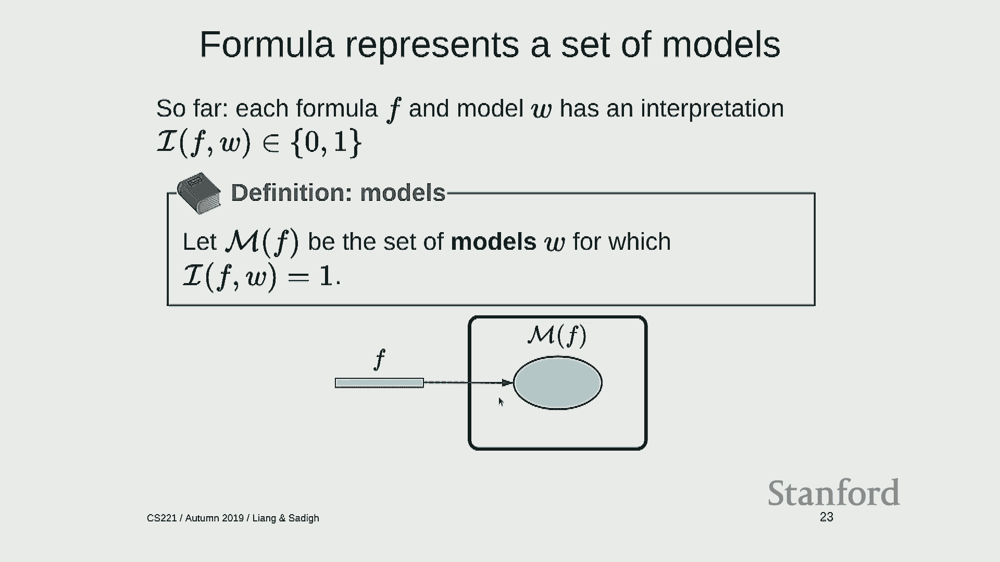

 I say there's a water bottle on the table。 What I'm really saying is that I'm really out all the possible worlds we could be in。

 where there is no water table bottle on the table。 Okay。

 So models m of f is going to be a subset of all of the possible models in the world。

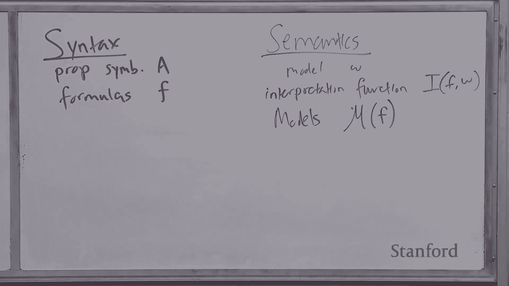

 Okay， so here's an example。 So if I say it's either raining or wet， rain or wet。

 then the set of models can be， represented by this subset of this 2x2。 Okay。

 so over here I have rain， over here I have wet。 So this corresponds to no rain。

 but it's white outside。 This corresponds to its raining， but it's not white outside。

 And the set of models f is this red region which are these three possible models。 Okay。

 so I'm going to use this kind of pictorial depiction throughout this lecture。

 So hopefully this makes sense。 So one key idea here。

 remember I said that logic allows you to express very。

 complicated and large things by using very small means。

 So here I have a very small formula that's able to represent a set of models and。

 that set of models could be exponentially large。 And much of the power of logic allow it comes from the ability to do stuff like that。

 Okay， so here's yet another definition。 This one's not somehow such a new definition。

 sorry a new concept， but it's kind of just trying to give us a little bit more。

 intuition for what these formulas and models are doing。 So knowledge base is just a set of formulas。

 And think about this is the set of facts you know about the world。

 So this is what you have in your head。 And in general it's going to be just a set of formulas。

 And now the key thing is I need to connect this with semantics。

 So I'm going to define the set of models denoted by a knowledge base。

 to be the intersection of all the models denoted by the formulas。

 So in this case if I have rain or snow being this green ellipse and， traffic being this red ellipse。

 then the model is denoted by the knowledge base。 It's just the intersection。 Okay。

 so you can think about knowledge is how fine grain we've kind of zoomed。

 in on where we are in the world， right？ So initially you don't know anything。

 We say anything is possible all two to the and models are possible。

 And as you add formulas into your knowledge base， the set of possible worlds that you think might exist or。

 possible is going to shrink。 And we'll see that in a second。 Okay。

 so here's an example of a knowledge base。 If so， I have rain that corresponds to this set of models。

 Rain implies wet corresponds to this set of models。

 And if I look at the models of this knowledge base。

 it's just going to be the intersection which is this red square down there。 Okay。

 any questions about knowledge bases， models， interpretation functions so far？ All right。

 so as I've alluded to earlier， knowledge base is the thing you're having ahead。

 And as you go through life， you're going to add more formulas to your knowledge base。

 You're going to learn more things。 So your knowledge base just gets a union with whatever formula you have。

 And over time， the set of models is going to shrink because you're just taking， an intersection。

 And one question is， how much is this shrinking？ Okay。

 so here there's a bunch of different cases to contemplate。 The first case is entailment。

 So suppose this is your knowledge base so far。 And then someone tells you the formula that corresponds to this set here。

 Okay， so in this case， intuitively， F doesn't add any information or new constraints that was known before。

 In particular， if you take the intersection of these two。

 you end up with exactly the same set of models you had before， so you didn't learn anything。

 And this is called entailment。 So there's kind of three notions here。 There's entailment。

 which is written this way with two horizontal bars。

 Which means that the set of models of F is at least as。

 large as the set of models in KV or in another one， so it's a super set。 Okay， so for example。

 rain and snow。 If you already knew it was rain and snow and someone tells you， "It's snowing。

" then you say， "Well， duh， I didn't learn anything。"， A second case is contradiction。

 So if you believe the world to be in here somewhere， and someone told you， "It's actually out here。

" then your brain explodes。 Right？ So this is where the set of models of the knowledge base and。

 the set of models denoted by the formula is empty。 So this doesn't make sense。 Okay。

 so that's a contradiction。

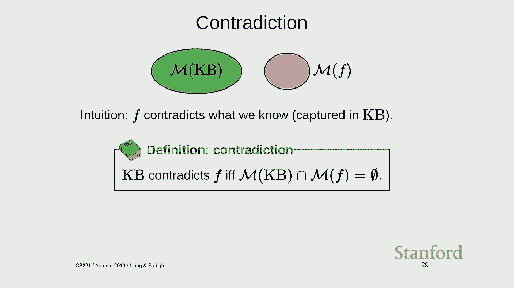

 Okay， so if you knew it was rain and snowing and someone says。

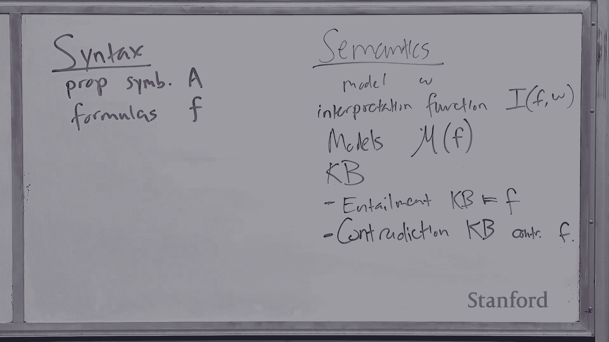

 "It's actually not snowing，" then you would be like， "No， that can't be lighted。"， Okay。

 so the third case is basically everything else。 It's contingency where F adds a non-trivial amount of。

 information to a knowledge base。 So the new set of models， the intersection here is neither empty。

 nor is it the original knowledge base。 Okay？ One thing to kind of not get confused by is if the set of models。

 were actually strictly inside the knowledge base， that would also be your， contingency。 Right。

 because when you intersect it， it's neither empty nor the original。 Okay。

 so if you knew it was raining and someone said， "Oh， it's also snowing too，" then you're like， "Oh。

 cool， I learned something。"， Okay， so there's a relationship between contradiction and entailment。

 So contradiction says that the knowledge base and F have zero intersection。 In entailment。

 this is equivalent to the knowledge base in tailing not F。 Okay。

 so there's a simple proposition that says， KB contradicts F if an F， KB entails not F。 Okay。

 so the picture you should have in here is like not F is all the models， which are not in this。

 And you think about kind of wrapping that around it looks like this。 All right。

 So with these three notions， entailment， contradiction， and contingency。

 which are relationships between a knowledge base and a new formula。

 we can now go back to our kind of virtual assistant example and think about how to。

 implement these operations。 So if I have a knowledge base and I tell the virtual assistant of a particular formula。

 F， there are three possible abilities which correspond to different appropriate， responses。

 So if I say it's raining， then if it's in entailment， then I say I already knew that。

 because I didn't learn anything new。 If it's a contradiction。

 then I should say I don't believe that because it's not， consistent with my knowledge so far。

 And otherwise， you learn something new。 There's also the ask operation which if you're asking a question。

 again， the same three entailment， contradiction， and contingency can hold。

 But now the responses should be answers to this question。 So if it's entailment， then I say yes。

 And this is a strong yes。 And it's not like probably yes。 This is definitely yes。

 If it's a contradiction， then I say no。 Again， it's a strong no。 It's impossible。

 And then in the other case， it's just contingent which you say I don't know。

 So the answer to a yes or no question， there's three responses not two。 Okay。

 Any questions about this？ Okay。 How many of you are following along？ It's fine。 Okay。 Good。

 All right。 So this is a little bit of a digression and it's going to connect to Bayesian networks。

 So you might be thinking in your head， well， we kind of did something like this already， right？

 In Bayesian networks， we had these complete assignments and we actually defined joint distributions。

 over a complete assignments。 And now what we're talking about is not distributions but sets of assignments or models。

 And so we can actually think about the relation between a knowledge base and an F also having。

 an analog in a Bayesian network land given by this formula。 So remember。

 a knowledge base is a set of models or possible worlds。 So in the probabilistic terms。

 it's an event。 And that event has some probability。 So that's a denominator here。

 And when you look at F and the KB and you intersect them， you get some other event which。

 is a subset of that and you can ask for the probability mass of that， intersective event。

 That's enumerated here。 And if you divide those， that actually just gives you the probability of a formula given。

 the knowledge base。 Okay。 So this is actually a pretty nice and direct probabilistic generalization of propositional。

 logic。 Yeah？ >> You have all the variables required for that formula already exist in your set of worlds。

 In this scenario， there's APC。 If we were asking something about D。

 it would still be an "I don't know" because we don't， have that information。 >> Yeah。

 So the question is this only works when restricted to the set of predefined propositional symbols。

 And you ask about D， then yeah， you would say "I don't know。"， In fact。

 when you define propositional logic， you have to pre-specify the set of symbols。

 that you're dealing with in general。 Yeah？ >> On the other hand。

 doing the example that we did earlier， like， reigning wasn't in the。

 set of examples or things that our Asian knew about before we started training。

 So is that something we'll get to later？ >> Yeah， so the question is in the -- in practice。

 you could imagine giving an agent， like， it， is raining or it's snowing or sleeting and having novel concepts。

 It is true that you can build systems and the system I'm showing you has that capability。

 And this is -- it will be clear how we do that when we talk about inference rules because。

 that allows you to operate directly on the syntax。

 Here I'm talking about semantics where you essentially -- just for convenience。 I mean。

 you can be smarter， but we're just defining the world。 Yeah。 >> [inaudible]， >> Yeah。

 So in this formula， why is this union not intersection？ So I'm unioning the KB with a formula。

 which is equivalent to intersecting the models of， the KB with the models of the formula。 Okay。

 So this is a number between zero and one。 And this reduces actually to the logical case if this probability of zero。

 that means there's， a contradiction， right， because this intersection is going to be probably zero。

 And if it's one， that means it's entailment。 And the cool thing is that instead of just saying。

 "I don't know，" you can actually give， a probabilistic estimate of like， "Well， I don't know。

 but it's probably like 90 percent。"， So we're not going to talk -- this is all I'm going to say about probabilistic extensions。

 to logic， but there are a bunch of other things that you can do that kind of marry the expressive。

 power of logic with some of the more advanced capabilities handling uncertainty of probabilities。

 Yeah。 >> Are you assuming that we had the probability distribution？ >> Yeah。 To do this。

 you were assuming that we actually have the joint distribution I have。

 And a separate problem is of course learning this。 So for logic， I'm only talking about inference。

 I'm not going to talk about learning。 So there are ways to actually infer logical expression。 Okay。

 So back from the digression， now no probabilities anymore。 We're just going to talk about logic。

 There's another concept which is really useful called satisfiability。

 And this is going to allow us to implement entailment and contradiction and contingency。

 using kind of one primitive。 And the definition is a knowledge base is satisfiable if the set of models is not empty。

 Okay。 So it's not self-contradictory in other words。

 So now we can reduce ask and tell to satisfiability。 Okay。 Remember。

 ask and tell have three possible outcomes。 If I ask a satisfiable question。

 how many possible outcomes are there？ Two。 So how am I going to make this work？

 I have to probably call satisfiable twice。 Okay。 So let's start with asking if knowledge base union not F is satisfiable or not。

 Okay。 So if the answer is no， what can I include？ So remember， the answer is no。

 So it's not satisfiable， which means that KB contradicts not F。

 And what is that equivalent to saying？ Sorry？ Yeah。 So it's not F。 So it's， which one of these is。

 should it be entailment， contradiction or contingency？ Yeah。

 So I'm interested in relation between KB and F。 I'm asking the question about KB union not F。 Yeah。

 Is take F is already a KD that we try to add in F。

 It's a contradiction that you're going to have M of F。 Yeah， yeah。 So exactly。

 So this should be an entailment。 Relation between KB and F。 Remember。

 KB entails F is equivalent to KB contradicting not F。 Okay。 Okay。 So what about if it's yes。

 then I can ask another question is KB union F satisfiable or， not？ So the answer is no。

 then what should I say？ It should be a contradiction because， I mean。

 this literally says KB contradict F。 And then finally， if it's yes， then it's contingency。 Okay。

 So this is a way in which you can reduce answering ask and tell， which is basically about assessing。

 entailment， contradiction or contingency to just to， and most to satisfiability calls。

 So why are we reducing things to satisfiability？ So propositional logics checking satisfiability is just the classical SAT problem is actually。

 a special case of solving constraint satisfaction problems。

 And the mapping here is we just call propositional symbols variables formulas constraints。

 And we get an assignment here and we call that a model。 So in this case。

 if we have a knowledge base like this， then there are three variables， A， B， and C。

 and we define this CSP。 And then we can， if we find a satisfying assignment。

 then we return satisfiable。 If we can't find one， then we return on SAT。 Okay。

 So this is called model checking。 It's called model checking because we're checking whether a model exists or is true。

 So you， model checking takes a knowledge base and outputs whether there's a satisfying model。

 There are a bunch of algorithms here which are very popular。

 There's something called DPL named after four people。

 And this is essentially backtracking search plus a pruning that takes into account the。

 structure of your CSPs which are propositional logic formulas。

 And there's something called walk-side which is you can think about the closest analog that。

 we've seen is Gibbs sampling which is a randomized local search。 Okay。 So at this point。

 you really can have all the ingredients you need to do inference in propositional， logic。

 So I define what propositional logic symbols are or formulas are。

 I define the semantics and I've told you even how to solve entailment and contradiction。

 and contingency queries by reducing the satisfiability which is actually something we've already seen。

 coincidentally。 So that should be it。 But now coming back to the original motivation of X1 plus X2 equals 10 and how we were able。

 to perform that logical query much faster， we can ask the question now can we exploit。

 that the factors are formulas rather than arbitrary functions。

 And this is where inference rules is going to come into play。

 So I'll try to explain this figure a little bit since it was probably pretty mysterious。

 from the beginning。 So I have a bunch of formulas。 This is my knowledge base over time。

 I recruit formulas。 And these formulas carve out a set of models in semantics land。

 And this formula here， if it's a superset， that means it's entailed by these formulas。 Right。

 So I know that this is true given my knowledge which means that this is kind of a logical。

 consequence of what I know。 Okay。 So so far what we've talked about is taking formulas and doing everything over in semantics。

 land。 What I'm going to talk about now is inference rules that are going to allow us to directly。

 operate on the syntax and hopefully get some result that way。 Okay。

 So here is an example of making an inference。 So if I say it is raining and I tell you if it's raining it's wet。

 rain implies wet， then， what should you be able to conclude？ It's wet。 Right。

 So I'm going to write this inference rule this way with this kind of fraction looking。

 like thing where there's a set of premises which is a set of formulas which I know to。

 be true and if those things are true then I can derive a conclusion which is another， formula。

 This is an instance of a general rule called modus ponens。

 This says for any propositional symbols p and q if I have p and p implies q in my knowledge。

 base then I can that entails a cube。 Okay。 So let's talk about inference rules。

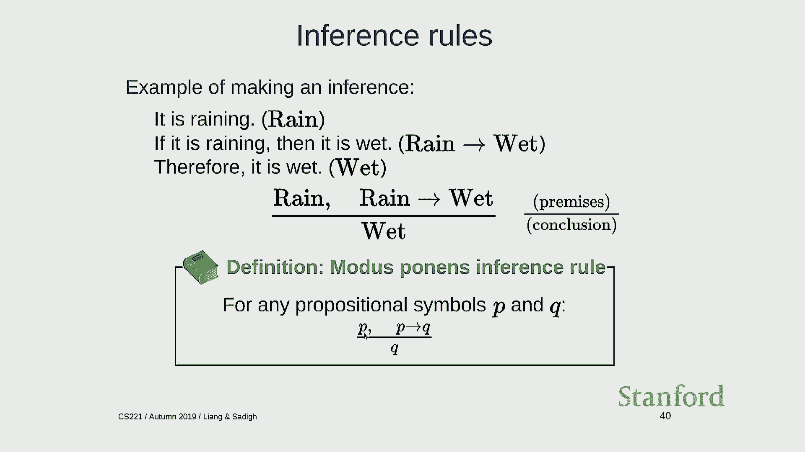

 Actually let me do it over here。 It's going to run out of space otherwise。 Okay。

 So modus ponens is the first thing we're going to talk about。

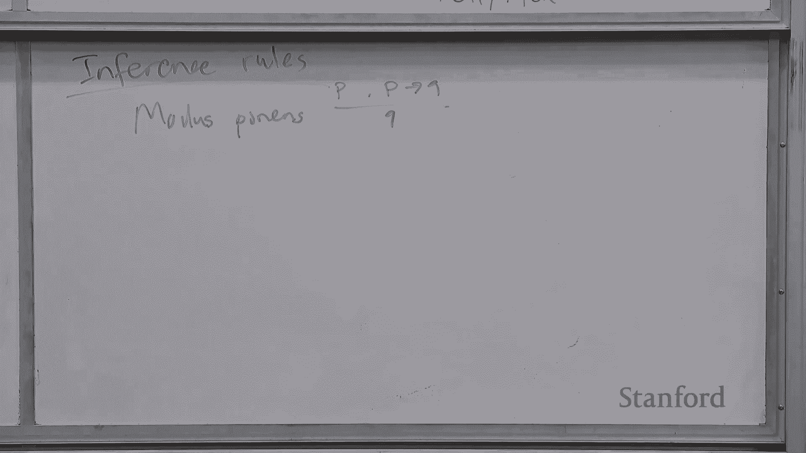

 So notice here that if I could do these type of images it's much less work。

 Because it's very localized。 All I have to do is look at these three formulas。

 I don't have to care about all the other formulas or propositional symbols that exist。

 And going back to this question over here about oh how do I， what happens if I have new。

 concepts that occur？ Well you can just treat everything as it's just a new symbol。

 It's not necessarily a fixed set of symbols that you're working with at any given time。

 Okay so this is the example of the inference rule。

 In general the idea of the inference rule is that you have rules that say if I see f1。

 through fk which are formulas then I can add g。 And the key idea as I mentioned before is that in these inference rules operate directly。

 on the syntax and not on the semantics。 So given a bunch of inference rules I have this kind of meta algorithm that can do logical。

 inference as follows。 So I have a set of inference rules and I'm just going to repeat until there's no changes。

 to a knowledge base。 I choose a set of formulas from the knowledge base。

 If I find a matching rule inside rules that exist then I simply add g to a knowledge base。

 So what the other definition I'm going to make is this idea of derives and proves。

 So inference rule derives， proves。

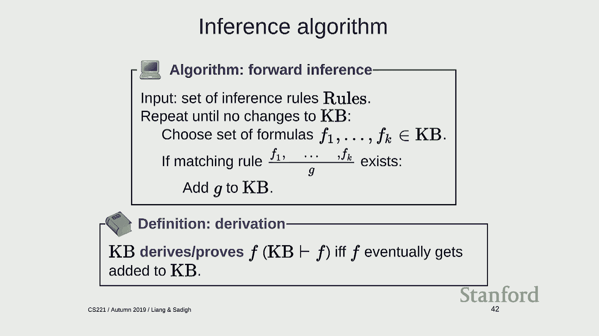

 So I'm going to write kb and now with a single horizontal line to mean that from this knowledge。

 base given a set of inference rules I can produce f via the rules。

 This is in contrast to entailment which is defined by the relationship between the models。

 of kb and the models of f。 Now this is just a function of mechanically applying a set of rules。

 So that's a very very important distinction。 And if you think about it why is it called proof？

 So whenever you do a mathematical proof or some sort of logical argument you're in some sense。

 just doing logical inference where you have some premises and then you can apply some， rule。

 For example you can add， multiply both sides of the equation by two。

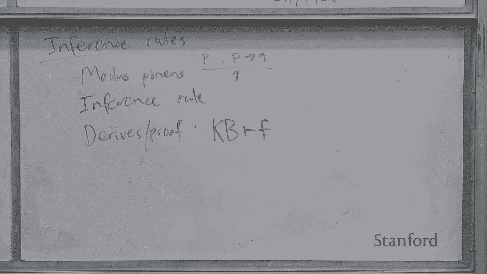

 That's a rule。 You can apply it and you get some other equation which you hope is true as well。

 Okay， so here's an example。 Maybe just for fun I'll do it over here。

 So I can say it is raining and if I dump that gives me my knowledge base it has rain。

 If it is raining it is wet。 So if I dump then I have this is the same as rain implies wet。 Okay。

 just in case you're rusty on your propositional logic。

 If I have p implies q that's the same as not p or q。

 And notice that I have also wet appearing in my knowledge base because in the background。

 it's basically running forward inference to try to derive as many conclusions as I can。

 And if I say if it is wet it is slippery。 And now I have wet implies slippery and now I also derive slippery。

 I also derive rain implies slippery which is actually as you'll see not the arrival。

 wall from modus ponens。 So behind the scenes is actually a much more fancy inference。

 The idea here is that you have your knowledge base you can pick up rain and rain implies。

 wet and then you can add wet and you pick up wet wet implies slippery and then you can。

 add slippery。 And with modus ponens you can't actually derive some things。

 You can't derive not wet which is probably good because it's not true。

 And you can also can't derive rain implies slippery which is true but modus ponens is。

 not powerful enough to derive it。 So the burning question you should have in your head is I talked about there's two relations。

 between a knowledge base Kb and a formula F。 There is entailment relation。

 And this is really what you want because this is semantic。 You care about meaning。

 And you also have this of Kb derives F which is a syntactic relationship。

 So what's the connection here？ In general there's no connection but there's kind of these concepts that will help us think。

 about the connection。 So the semantics these are things which are when you look at semantics you should think。

 about the models implied by the formulas。 And syntax is just some set of rules that someone made up。

 So how do these relate？ So to understand this imagine you have a glass and this glass is what's inside the glass。

 is a formula。 And in particular it's the formulas which are true。

 So this glass is all formulas such that this formula is entailed by the knowledge base。

 So soundness is a property of a set of rules and it says if I apply these rules until the。

 end of time do I stay within the glass？ Am I always going to generate formulas which are inside the glass which are semantically。

 valid or entailed？ So soundness is good。 Completeness says the other direction which says that I am going to generate all the formulas。

 which are true or entailed。 Am I generating extra stuff but at least I will cover everything that's why it means。

 to be complete。 So the model you should have in your head is you want the truth。

 the whole truth and， nothing but the truth。 Soundness is really about nothing but the truth and completeness is about the whole truth。

 Ideally you would want both。 Sometimes you can't have both so you have to pick your battles。

 But generally you want soundness。 You can maybe live without completeness but if you're unsound that means you're just going。

 to generate erroneous conclusions which is bad。 Whereas if you're incomplete then maybe you just kept for certain notions but at least。

 the things that you do infer you know are actually true。 Okay so how do we check soundness？

 So is modus ponent sound？ So remember there's kind of a rigorous way to do this and the rigorous way is to look。

 at two formulas， rain implies wet and then look at their models。

 So rain corresponds to these set of models here。 Rain implies wet corresponds to this set and when I intersect them that's the set of models。

 which are conveyed by the knowledge base which is this corner here。

 And I have to check whether that is a subset of the models of wet and wet is over here。

 So this 1-1 corner is a subset of 1-1 and 0-1 so this rule is sound。

 Remember this why is a subset the thing I want to check？

 Because that's just the definition of entailment。 So let's do another example。

 So if someone said it was wet and you know that rain implies wet can you infer rain？

 Well let's just double check this。 So again what are the models of wet？ They're here。

 When the models of rain implies wet they're here and I intersect them I get these two over。

 here in dark red and then is that a subset of models of rain？ Nope so this is on sound。

 So in general soundness is actually a fairly easy condition to check especially in propositional。

 logic but in higher order logic it's not as bad。 So now completeness is kind of a different story which I'm not going to have time to really。

 do full justice in this class but here's an example showing modus opponents is incomplete。

 So for propositional logic。 So here we have the knowledge base rain or snow implies wet and is this entailed wet？

 So it's raining and if I know it's raining or snowing then it should be wet。 Maybe you say yes。

 it should be entailed。 But what does modus opponents do？

 Well all the rules look like this so clearly you can't actually arrive at this with modus。

 opponents because modus opponents can't reason about or disjunction。

 I guess it's not possible for it to be not wet given rain。

 Because you already know that it's raining so you should say that it's wet。

 So this is incomplete so we can be sad about this。 There are two ways you can go to fix this。

 The first way is we say okay okay propositional logic was too fancy。 Question？ Yeah。

 For the notation it says kb equals rain then comma rain or snow yield。

 Is it implying any type of assignment to rain there？ So the knowledge base is a set of formulas。

 So in this particular formula is rain and remember the models of the knowledge base is。

 where the formulas are true。 So yes in this case it does commit to rain being one。

 When models of kb only include the models where rain is one。 Otherwise this formula would be false。

 Yeah。 All the ability of a model as it way back before the。

 How can we have a probability of a model？ So remember that a model is where they go。

 So remember a model here is just an assignment to a set of propositional symbols or variables。

 So when we talk about Bayesian networks we're defining a distribution over assignments to。

 all the variables。 So here what I'm saying is I assume there is some distribution over complete assignments。

 to random variables and I can use that to compute probabilistic queries of a formula given。

 knowledge base。 My answer your question？ They can't be in the same knowledge base。

 If you have two models that are formulas that contradict then this intersection is going。

 to be zero。 So there is exist a set of models。 So let me do it this way。

 So imagine you have these two variables rain and wet。

 A Bayesian network might assign a probability point one point。

 So some distribution over these states。 And if I have rain that corresponds to these models。

 So I can write the probability of rain is 0。2 plus 0。5。 So 0。7。

 And if I have the probability of wet given rain this is going to be the probability of。

 the conjunction of these which is going to be wet and rain which is here。 It is going to be 0。

5 divided by the probability of rain which is 0。7。 Does that help？ Okay。 Oops。 Okay。 So。 Okay。

 So modus ponens is sound but it is not complete。 So there are two things we can do about this。

 We can either say propositional logic is too fancy。

 Let's just restrict it so that modus ponens becomes complete with respect to a restricted。

 set of formulas。 Or we can use more powerful infants rules。

 So today we are going to restrict propositional logic to make it complete。

 And then next time we are going to show how a resolution which is even more powerful。

 infants rule can be used to make any arbitrary inferences。

 And this is what is powering the system that I showed you。 Okay。 So a few more definitions。

 So we are going to define oppositional logic with horn clauses。 Okay。

 So a definite clause is a propositional formula of the following form。

 So you have some propositional symbols all conjoined together。 And the， formula says if p1 to p， k。

 hold them， q also holds。 So here are some examples。 Rain and snow implies traffic。

 Traffic can be as possible。 This is a valid propositional logic formula but it is not a valid definite clause。

 Here is also another example。 Rain and snow implies traffic or peaceful。 Okay。

 So this is not allowed because only thing allowed on the right hand side of the implication。

 is a single propositional symbol and there are two things over here。

 So a horn clause is a definite clause or a goal clause which might seem a little bit， mysterious。

 But it is defined as something that p1 to p， k implies false。

 And the way to think about this is the negation of a conjunction of things。 Right。

 Because remember p implies q is not p or q。 So this would be not p or true which is not p。

 In this case。 Okay。 So， now we have these horn clauses。

 Now remember the inference rule modus ponens。 We are going to slightly generalize this to include not just p implies q but p1 to p。

 k， implies q。 So you get to match on premises which include formulas which are atomic propositional symbols。

 and a rule that looks like this and you can derive or prove a q from that。 Okay。 So as an example。

 wet and weekday。 If you see wet， weekday， wet and weekday implies traffic， those three formulas。

 then， you can， you're able to add traffic。 Okay。 So， so here's the claim。

 So modus ponens is complete with respect to horn clauses for propositional logic。 So in other words。

 what this means is that suppose that the knowledge base contains only。

 horn clauses and that p is some entailed propositional symbol。 By the entailed propositional symbol。

 I mean like KB actually entails p symmatically。 Then apply modus ponens will derive p。

 Means that the two relations are equivalent and you can celebrate because you have both。

 soundness and completeness。 Okay。 So just a quick example of this。

 So here imagine is your knowledge base and you're asking the question of is there traffic？

 And remember because this is a set of only horn clauses and we're using modus ponens which。

 is complete。 That means entailment is the same as being able to derive it using these rules。

 this particular， rule。 And you would do it in a following way。 So rain implies wet gives you wet。

 wet weekday， wet and weekday implies traffic gives you， traffic and then you're done。 Yeah。

 >> [INAUDIBLE]， >> Like rain and weekday， why are those horn clauses？

 >> The question is why are rain and weekday horn clauses？

 So if you look at the definition of horn clauses， there are definite clauses。

 If you look at the definite， they should have definite clauses。

 They look like this and k can be zero here which means that there's kind of like nothing， there。

 That makes sense。 It's a little bit of a look。 I'm using this notation to exploit this corner case that if you have the n of zero things。

 then that's just true。 Or you can just say by definition。

 definite clauses contain probabilistic symbols。 That would do too。 Okay。

 so let me try to give you some intuition why modus ponens and horn clauses。

 So the way you can think about modus ponens is that it only works with positive information。

 in some sense。 There's no branching either or。 It's like every time you see this。

 you just definitively declare Q to be true。 So in your knowledge base。

 you're just going to build up all these positive symbols that， you know are going to be true。

 And the only way you can add a new probabilistic symbol ever is by matching a set of other things。

 which you definitely know to be true and some rule that tells you Q should be true and then。

 you make Q true， add Q to your knowledge base as well。

 The problem with probabilistic or more general clauses is if you look at this， rain and。

 snow implies traffic or peaceful。 You can't just write down traffic or peaceful or both of them。

 You have to reason about， well， it could be either one and that is outside the scope of。

 what modus ponens can do。 Yeah。 And peaceful。 Now we can say like okay。

 those two are true so both have to be true。 Yeah， good questions。

 What if it happens if it were traffic and peaceful？

 So this is an interesting case where technically it's not a definite clause but it essentially， is。

 So there's a few subtleties here。 So if you have A implies B and C， you can rewrite that。

 This is exactly the same as having two formulas A implies B and A implies C and these are。

 definite clauses。 Just like technically if I gave you A what about A not A or B。

 it's not a definite clause， by the definition but you can rewrite that as A implies B。

 So there is slight kind of， you can extend this to say not only definite clauses but all。

 things which are morally one clauses where you can do a little bit of rewriting and then。

 you get a whole clause and then you can do your inference。

 So resolution is this inference rule that we'll look at next time that allows us to deal with。

 these disjunctions。 Okay， so to wrap up， so today we talked about logic。 So logic has three pieces。

 We introduced the syntax for proposition logic， yeah， proposition symbols which you string。

 together into formulas。 Over in syntax land， these are given meaning by talking about， you know。

 semantics and， we introduced an idea of a model which is a particular configuration of a world that you。

 can be in。 A formula denotes a set of models which are true under that formula。

 This is given by the interpretation function。 Then we looked at entailment。

 contradiction and contingency which are relations between。

 a knowledge base and a new formula that you might pick up。 You can either do satisfiability check。

 a model checking which tests for satisfiability， to solve that or you can actually do things in syntax land by just operating directly on。

 inference rules。 So that's all I have for today and I'll see you next Monday。 Bye。 [BLANK_AUDIO]。

 [ Silence ]。