# 【斯坦福大学】CS221 人工智能原理与技术 · 2019秋（完结·中英字幕·人工校对中) - P18：Lecture 18 Deep Learning - 鬼谷良师 - BV16E411J7AQ

 Okay， so let's begin。

 First of all， I want to say congratulations。 You all survived the exam。 Well。

 you don't have your grades back， but you completed it。 So yeah， I just want to say。

 so we're going to have the grades back as soon as we can。 The CAs are all busy grading。

 and we're actually going to cancel offsars today so we can focus。

 on getting those grades back too quickly。 After this， the course definitely goes downhill。

 so you guys can kind of like take a break。 So after the exam。

 there's pretty much just two things left， so there's the project。 So the final presentation。

 the poster session for the project is going to be， I believe， the Tuesday after vacation。

 It's like a big auditorium hall。 There's going to be a lot of people from industry and academia。

 It's really exciting to have so many smart people showing off their hard work。

 And then you have the last P-set， which is Logic。 Yeah。 Oh， Monday。 Okay， yeah。

 So right after you get back from vacation is that poster session。

 And then on Thursday is the last P-set is due Logic。 So Logic is。

 so this is not like my official opinion， but I think Logic， when I took the。

 class was easier than the others， it doesn't take as much time， so you guys are definitely。

 past the hardest point in this class。 Yeah， I think that's the general opinion。 Yeah。

 But that being said， I wouldn't wait until the last minute。 Still start early。 And。 Okay， so then。

 yeah， so Piazza and Office Hours will be your best friend。 Yeah。 Okay， so but today though。

 we're talking about this fun， advanced， ish topic， which is deep， learning。

 I say ish because I think a lot of you are probably working on deep learning or I've heard。

 of it already。 Because a lot of you have it in your projects and today we're just kind of do a very。

 very， high level， broad pass of a lot of different subjects within deep learning。

 Hopefully get you excited， give you kind of like a shallow understanding of a lot of different。

 topics so that if you want to take follow up classes like 224N or 229 even， then you'll。

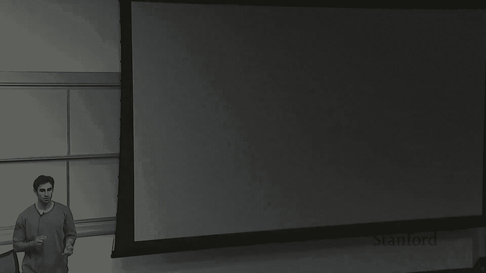

 be armed with some kind of background knowledge。 Okay。

 So first we're going to talk about the history。 So deep learning， you've probably heard of it。

 It's really big， especially in the last five， ten years， but it's actually been around。

 for a long time。 So even back to the 40s， there's this era where people are trying to build more computational。

 neuroscience models。 They noticed that they knew back then that there's neurons in the brain and they're arranged。

 in these networks。 And they know that intelligence arises from these small parts。

 And so they really wanted to model that。 The first people to really do this were McCulloch and Pitts。

 So Pitts was actually a logician and they were concerned with making these kind of like。

 logical circuits out of a network like topology。 Like what kind of logical expressions can we implement with a network？

 Back then this was all just a mathematical model。 There was no back propagation。

 There were no parameters。 There was no inference。 It was just trying to write about， I guess like。

 theorems and proofs about what kind of。

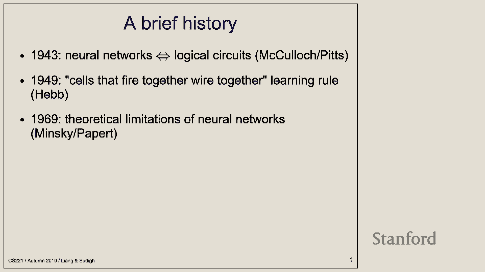

 problems these structures can solve。 And then Hebb came along about ten years later and started moving things in the direction。

 of， I guess， like， training these networks。 He noticed that if two cells are firing a lot together。

 then they should have some kind， of connection that is strong。 This was inspired by observations。

 There's actually no formal math theory backing this。

 A lot of it was just very smart people making conjecture。

 And then it wasn't until the '60s that -- so neural networks was， I guess you could say。

 maybe in the mainstream， like a lot of people were thinking about it and excited about it。

 until 1969 when McKinsey and Pepper released this very famous book called "Piseptrons，"。

 which was this big fat book of proofs。 And they were basically talking about the -- they proved a bunch of theorems that were。

 about the limits of very shallow neural networks。 So for example， early， I think， very。

 very early in this class， we talked about the XOR。

 example where if you have two classes and they're arranged in this configuration， then there's。

 no linear classification boundary that you can use to separate them and classify them， correctly。

 And so McKinsey and Pepper and their book "Piseptrons，" they came up with a lot of these， I guess。

 you could say， like counter examples， like that。 A lot of theorems that really proved that these thin neural networks couldn't really do a。

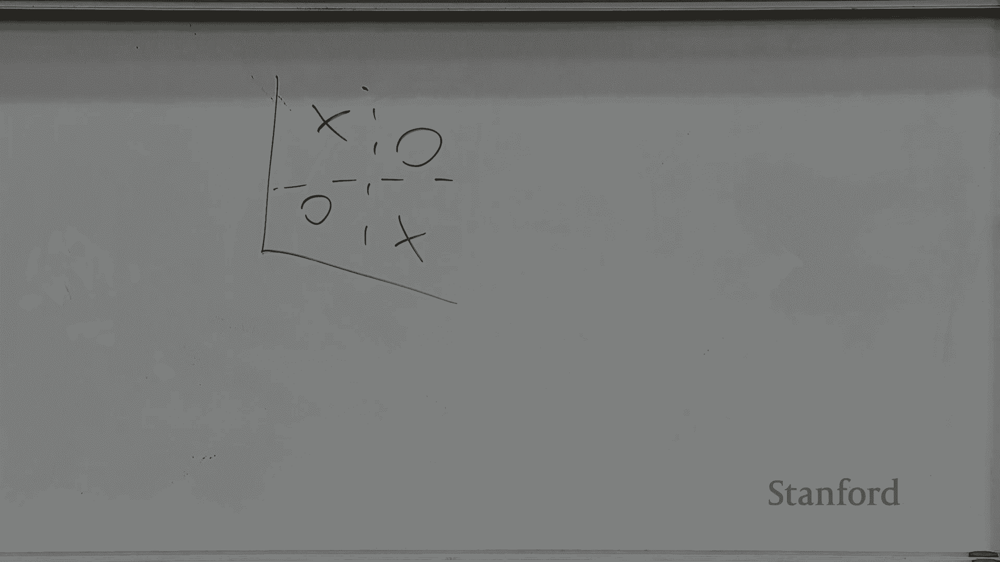

 lot。 And at the time it was a little bit of a killing blow to neural network research。

 So mainstream AI became much more logical and neural networks were pushed very much into， I guess。

 a minority group。 So there's all these people thinking about and working on it。

 but the mainstream AI went， definitely towards kind of the symbolic logic-based methods that Percy's been talking about the。

 last couple of weeks。 But like I said， there's still these people in the background working on it。

 So for example， in 1974， Rubo C came up with this idea of back propagation that we learned。

 about using the chain rule to automatically update weights in order to improve predictions。

 And then later on-- so Hinton and Rummelhart and Williams， they kind of-- I guess you could。

 say they popularized this。 So they definitely-- I guess you could say rediscovered， Rubos' findings。

 And they really said， oh， hey， everybody， you can use back propagation。

 And it's mathematically felt well， kind of like well-founded way of training these like。

 deep neural networks。 And then in the '80s-- so today we're going to talk about two types of neural networks。

 convolutional neural networks and recurrent neural networks。

 And the convolutional networks trace back to the '80s。

 So there's this neo-cognitron that was invented by Japanese Fukushima。

 And it kind of laid out the architecture for a CNN， but there was no way of training it。

 And in the actual paper， they used hand-tuned weights。 They were like， oh， hey。

 there's this architecture you can use。 And basically。

 we just like by travel and error came up with these numbers to plug in it and， look at how it works。

 Now it just seems like insane。 But back then， that was this-- there were no ways of training these things until Likun。

 came about 10 years later。 And so he applied those ideas of back propagation to CNNs。

 And Likun actually came up with a-- so there's the Likun net， which was a very famous check。

 reading system。 And it was one of the first industrial large scale applications of deep learning。

 So whenever you write a check and have your bank read it， almost all the time， there's。

 a machine learning model that reads that check for you。

 And those check reading systems are some of the oldest machine learning models that have。

 been used at scale。 And then later-- so we're currently on networks， came in the '90s。

 So Elamin kind of proposed it。 And then there's this problem with training that we'll talk about later called exploding。

 or vanishing gradients。 And then， Horr-Rader and Schum-Britter， about 10 years later， came up with。

 I guess you could， say， maybe it solved to some extent those issues with a long short term memory network。

 and LSTM。 And we'll talk about that later。 And then-- but I guess you could still say that known networks were kind of in the minority。

 So in the '80s， you used a lot of rule-based AI。 In the '90s。

 people were all about support vector machines and inventing new kernels。 If you remember。

 support vector machine is basically just like a-- it's a linear classifier。

 with the hinge loss and a kernel is a way of projecting data into kind of like a nonlinear。

 subspace。 But in the 2000s， people finally started making progress。 So Hinton had this cool idea of。

 hey， we can train these deep networks one layer at a time。

 So we'll pre-train one layer and then we'll pre-train a second layer and stack that on， third layer。

 stack that on。 And you can build up these successive representations。

 And then deep learning kind of became a thing。

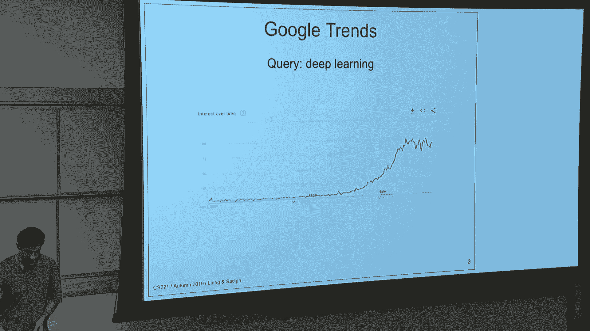

 So this looks like maybe three， four years ago， really started taking off。 And ever since then。

 it's really been in the mainstream。 And you can-- as kind of proof evidence towards its mainstreamness。

 you can look at all of， these applications。 So speech recognition。 For about almost a decade。

 this performance in speech recognition， city of the recognizers。

 were using a hidden Markov model based-- that was the heart of these algorithms。 And for 10 years。

 performance just stagnated。 And then all of a sudden。

 neural networks came around and dropped that performance。

 And what's really no surprising is that all of the big-- so IBM， Google， Microsoft， they。

 all switched over from these classical speech recognizers into fully end-to-end neural network。

 based recognizers very quickly in a matter of years。

 And when these large companies are operating at scale and they've dozens， maybe hundreds。

 of people have tuned these systems very intricately。

 And for them to so quickly and so radically shift the core technology behind this product。

 really speaks to its power。 Same thing with object recognition。

 So there's this ImageNet competition， which goes on every year that says basically like。

 how well can you say what's in a picture。 And the first-- and so for years。

 people use these handcrafted features。 And all of a sudden。

 Alex Net was proposed and it almost got half the error of the next。

 best submission for this competition。 And then ever since then。

 people have been using neural networks。 And now， if you want to do computer vision。

 you kind of have to use these CNNs。 It's just a default。 If you walk into a conference。

 every single poster is going to have a CNN in it。 Same thing with Go。

 So Google DeepMind had a CNN based algorithm that they trained with reinforcement learning。

 and it beat the world champion in this very difficult game。 And then in 2017， it did even better。

 It didn't even need real data。 It just did self play。 And machine translation。

 So Google Translate for almost a decade had been working on building a very， very advanced。

 and very well performing classical machine translation system。 And then all of a sudden。

 the first machine translation system was proposed in 2014-2015。 And then about a year later。

 they threw away almost a decade of work on this system and。

 transferred entirely to a completely new algorithm， which again speaks to its power。 So but what is。

 I guess， deep learning？ Like， why is this thing so powerful？ Why is it so good？ And I think。

 so broadly speaking， it's a way of learning， of taking data， you can slurp。

 up any kind of data you want。 Like a sequence， a picture， even vectors， or even like a game like Go。

 And you can turn it into a vector。 And this vector is going to be a dense representation of whatever information is captured by that。

 data。 And this is very powerful because these vectors are compositional。

 And you can use these components， these modules of your deep learning system， kind of like。

 Lego blocks， you can， you know， concatenate vectors and add them together and use this。

 to modify you。 And just the compositionality makes it very flexible。 Okay。

 so today we're going to talk about feed-for-all networks， convolutional networks。

 which work on images， or I guess just anything with repeated kind of like structural information。

 in it。 We're current line networks， which operate over sequences。 And then if we have time。

 we'll get to some unsupervised learning topics。 Okay， so first for feed-forward networks。

 So in the very beginning of this class， we talked about linear predictors。 Linear predictor。

 if you remember， is basically you define like a vector W， that's your weights。

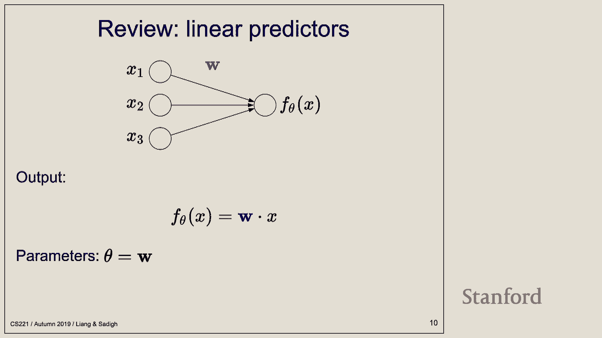

 and then you hit it with some input and you dot them together and that just gives you， your output。

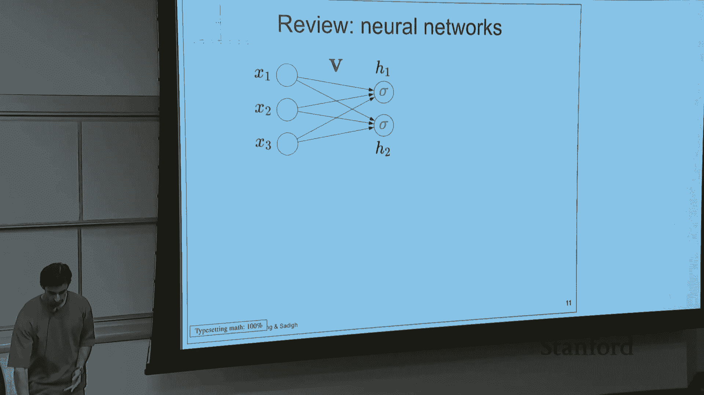

 And neural networks， we define very similarly。 So you can think of each of these hidden units as the result of a linear predictor in a way。

 So working backwards， so you have that you define a vector W and you hit it with some。

 activation function， with some activation like inputs， some hidden inputs， and you dot that。

 with your hidden and you get your output。 And then you arrive with you if you're hidden by defining a vector and hitting it with inputs。

 So you use your inputs to compute hidden numbers and then you use your hidden numbers to compute。

 your final output。 So in a way， you're kind of like stacking linear predictors。 Like each number。

 so each one， each two， and f of theta are all the product。

 I guess you could say they're all the result of like a little mini linear predictor。

 They're all kind of like roped together。

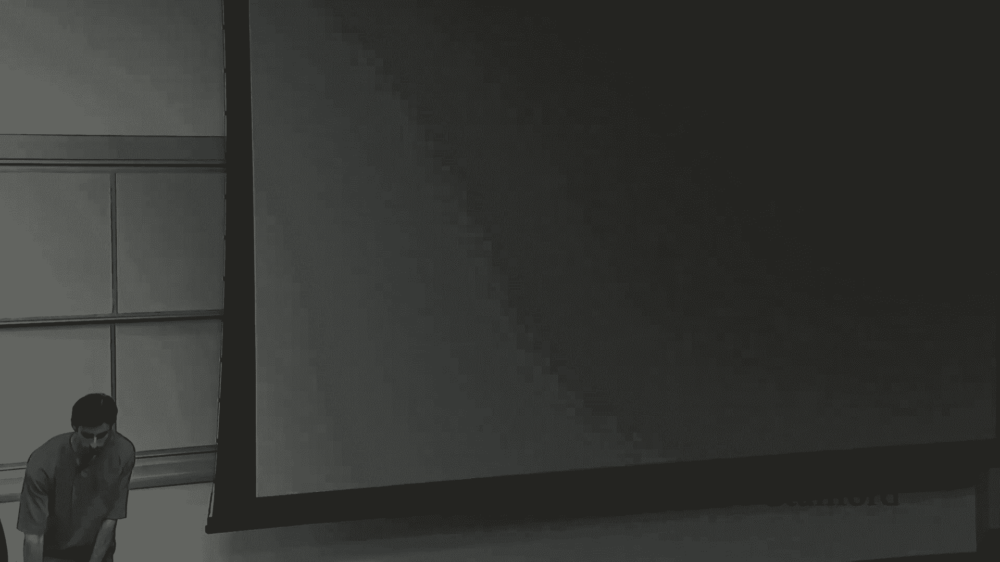

 So just to visualize this， if we want to go deeper， you just rinse and repeat。

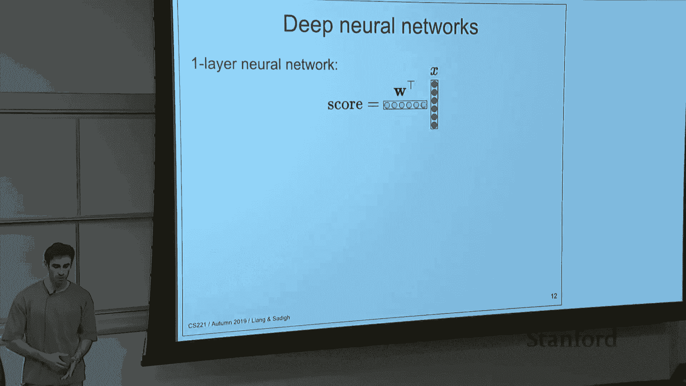

 So this is， you could say this is a one layer neural network。

 It's what we were talking about before with linear predictor。 You just。

 you have your vector weights and you apply it to your inputs。 For a two layer。

 you apply instead of a vector to your inputs， you apply a matrix to your， inputs。

 which gives you a new vector。 And then you dot this intermediate vector。

 this hidden vector with another set of weights。 And that gives you your final output。

 And then you can just rinse and repeat。 So you pass through a vector。

 you pass through a matrix to get a new vector。 You pass that through another matrix to get a new vector。

 And then you finally at the very end， dot it with a vector to get a single number。

 So just a word about depth， that's one of the reasons why these things are really powerful。

 So there's a lot of interpretations for why depth is helpful and why kind of like stacking。

 these matrices works well。 One way to think about it is that it learns representations of the input which are hierarchical。

 So H is going to be some kind of representation of X。

 H prime is going to be a slightly higher level representation of X。 So for example。

 in a lot of image processing systems， H could represent like the edges in， a picture。

 H prime would represent like corners。 H double prime could represent like small like fingers or something。

 H triple prime would be the whole hand。 So it's successfully。

 I guess you could say like higher level representations of what's， in the data you're giving it。

 Another way to think about it is each layer is kind of like a step in processing。

 And you could think of it maybe like a for loop where it's like the more iterations you， have。

 the more steps you have， the more depth you have， the more processing you're able to。

 perform on the input。 And then last， the deeper the network is。

 the more kinds of functions it can represent。 And so there's flexibility in that as well。

 But in general， there isn't really a good formal understanding of why depth is helpful。

 And I think a lot of deep learning is there's definitely a gap between the theory and the， practice。

 So yeah， so this I guess just goes to show why depth is helpful。 So if you input pixels。

 maybe your first layer is giving you edge detection and your。

 second layer is giving you little eyes or noses or ears。

 And then your third layer and above is giving you whole objects。 Yeah， so just to summarize。

 so we have these deep neural networks and they learn hierarchical， representations of the data。

 Sessally， I guess you could say it's like gaining altitude in its perspective。

 You can train them the same way that we learned how to train our linear classifiers， just。

 with gradient descent。 So you have your loss function。

 you take the derivative with respect to your loss， and。

 then you propagate the gradients to step in the direction that you think would be helpful。

 And this optimization problem is difficult。 So it's non-linear and non-convex。 But in general。

 we found that if you throw a lot of data at it， a lot of compute at it， then somehow you manage。

 Okay， so it seems like the slides are a little out of order。

 But basically just to review how you train these things， in general， it's the same as。

 a linear predictor。 You define a loss function。 So for example， this is squared loss。 We'd say。

 I'm going to take the difference between my true output and my predicted output， and square that。

 And then the idea is to minimize this。 And the way you do that is you sample data points from your training data。

 and you take， the derivative of your parameters with respect to this。

 with respect to your loss function， and then you move in the opposite direction of that gradient。

 which would hopefully move， you down on the error surface。

 So the problem is a non-convex optimization problem。 So for example， linear classifier。

 because it's linear， it'll just look like a bowl。 Whereas these things。

 you have these non-linear activation functions， and you end up with a。

 very messy looking error surface。 And before the 2000s。

 that was the number one thing that was holding back neural networks。

 is that they were difficult to get working。 It was hard to train。

 And so basically the thing that's changed is one way faster computers。

 We have GPUs which can paralyze operations， especially those big matrix multiplications。

 And then there's a lot more data。 That's not entirely true。

 So there's also a lot of other tricks that we found out recently。 So for example。

 if you have lots of hidden units， then that can be helpful。 Because it gives more flexibility。

 you could say， in the optimization。 Like if you have， if you over-provision。

 if your model has two more capacity than it， needs。

 then you can be more flexible with the kind of functions that you can learn。

 So we have better optimizers。 So whereas SGD will make it'll take。

 it'll step in the same direction by the same amount， every time。

 we have these newer optimizers like autograded atom that decide how far to。

 move in a direction once you've decided the direction。 We have dropout。

 which is where you noise the outputs of each hidden unit。

 And that makes the model more robust to its own errors and it guards against overfitting。

 There's better initialization strategies。 So there's things like， save your initialization。

 And there's things like pre-training the model on a related data set before moving on to the。

 data you actually care about。 And then there's tricks like batch norm。

 which is where you ensure that the inputs to your， neural network units are normally distributed。

 They have mean zero， standard deviation one。 And what that does is it allows you to basically take bigger step sizes。

 Yeah， and the takeaway here is that， but in general， the optimization problem and the。

 model architecture you define are very tightly cuffled。

 And it's kind of a black magic to get that right balance that you need。

 And we're still not very good at it。 So we're going to talk about convolutional neural networks now。

 And so these operate over images。 The motivation is that， okay， so we have a picture here， right？

 And we want to do some kind of machine learning processing on it。

 We have all the tools that we need to do that。 You could say， okay， each picture。

 each pixel is an element in a big long vector。 And then I'm just going to throw that at a matrix。

 But the thing is， is that that doesn't really take advantage of the fact that there's spatial。

 structure in this picture。 So this pixel is going to be more similar to this pixel than this pixel down here。

 But if you pass this entire thing through a matrix， then every pixel is going to be treated。

 uniquely and differently。 And so we want to leverage that spatial structure。 And the idea。

 the core idea is with convolutions。 So convolutions， you have this thing called a filter。

 which is some collection of parameters。 And what you do is you run your filter over the input in order to produce each output element。

 So for example， this filter， when applied to this upper left corner， produces this upper。

 left corner of the output。 And an application of a filter works kind of like a dot product。

 where you multiply all， the numbers and then you add up the molar。

 And so how you produce these outputs is you take your filter and you basically just slide。

 it around in the input in order to get your output at the next layer。 So yeah。

 so this example is a little more concrete。 So here。

 so whereas this was a two dimensional convolution， because we had a two dimensional。

 filter and we were sliding around in both dimensions， this is one dimensional。

 We have a one dimensional filter and we slide it horizontally across。 So for example。

 at the very left， we apply it。 So one times zero is zero。

 Zero times one is one and negative one times two is negative two。

 So negative two goes in the output。 And then we do the similar thing here。

 So we would dot product this filter with these three numbers in order to arrive at two。

 One of the advantages of this is that whereas A， so if you had， so if you had， let's say。

 you had like four inputs， so this is your hidden layer。

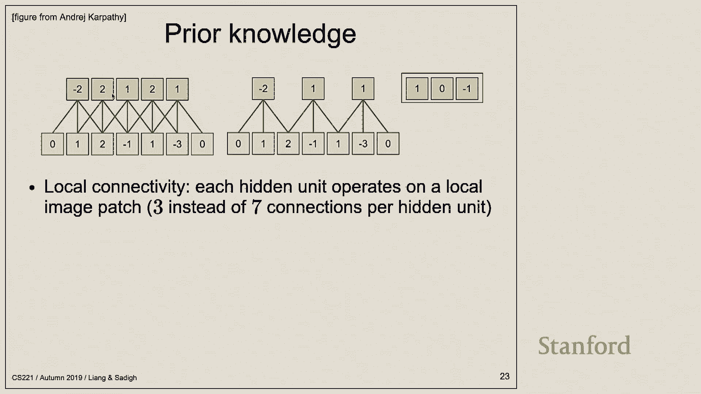

 So H one， H two， H three， and H four。 And then you had four inputs， X one， X two， X three。

 and X four。 If you did a regular fully connected matrix layer， then every one of these is going to。

 be connected to every one of these。 And your parameters。

 you're going to end up with a four by four matrix。 One one， W one two， W one three， W one four。

 and W， W， W。 This is what your matrix is going to look like。

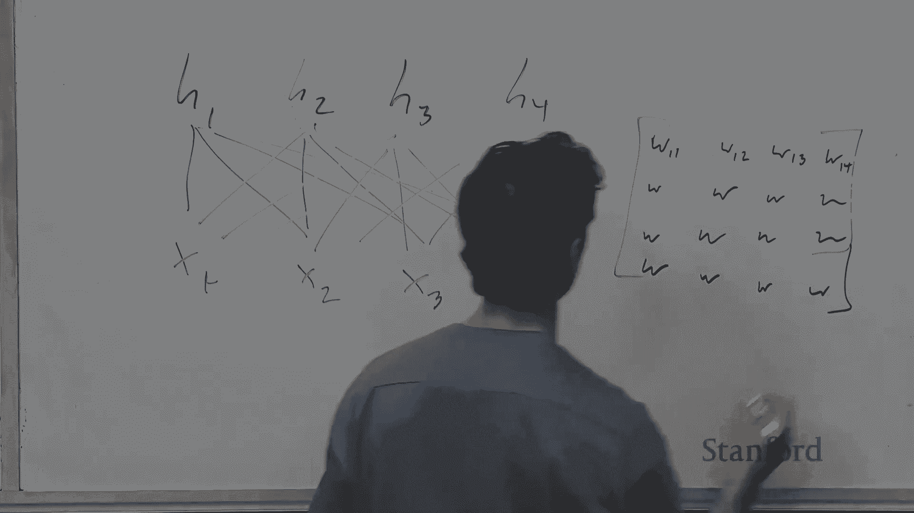

 If this is your W， because you need a new， you need a weight for every one of those connections。

 Whereas if you're doing convolutions， it's much more efficient because there's this idea。

 of local connectivity。 So you have your one， H two， H three， H four， X one， X two。

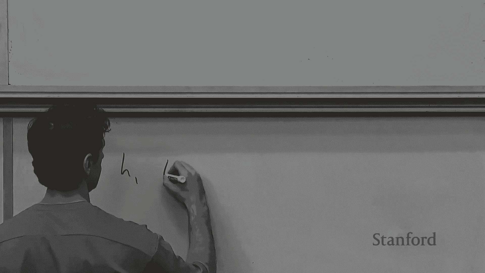

 Each hidden layer is only connected to what's called its receptive field， which is the inputs。

 that the filter would be applied to。 And in this case。

 we would only have three weights because we just have this sliding window。

 and you apply it at each step。 So A， it gives you local connectivity。

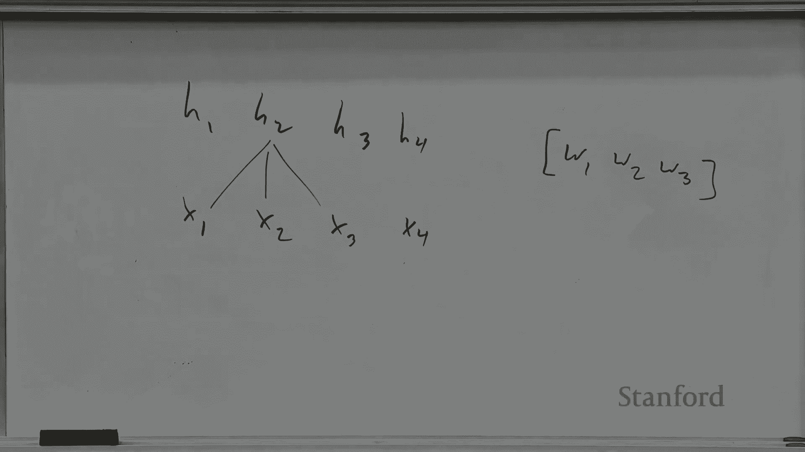

 B， it's much more efficient in terms of parameters。

 We're sharing the same parameters at different places in the input。

 And it gives you this cool intuition of sliding around in the input。 So it's like。

 I have my filter of three things。 And it gives you this good intuition of。

 let's say this is negative one， this is a hundred， this is one， and this is three， then what this。

 you can interpret this as my filter really， likes whatever pattern is going on in these three inputs。

 And it doesn't like so much all the other patterns that it's picking up on。 And so， yeah。

 you have this nice interpretation for the filters。 In general， what this looks like is。

 so in practice， instead of one dimensional two dimensional， they're very high dimensional volumes。

 And so your filter is going to be a cube in the input space。

 And you're sliding it around and applying it at every place it can fit in this input。

 And then the reason why the output is also a volume is because you have multiple filters。

 So over here， for example， this blue filter is when you slide it around in the input， it's。

 going to give you this plane of outputs。 But then you have a second filter， this green filter。

 that you can also slide around the， input。 And that's going to give you a second dimension to your hidden states。

 So Andrei Caparti has this nice demo where basically we have， so we have a three dimensional。

 input and we have two filters which are like， you can think of as little cubes and it's sliding。

 these cubes around the input。 And every application gives you one output in this three dimensional output volume。

 So this is the same picture as before， where you're sliding around cubes in order to fill， in。

 you could say， like， layers of the output。 But around cubes to fill in these layers of the output。

 Another thing people do is max pooling。 So remember that interpretation of a filter as a。

 as like a pattern detector？ What this is saying is you take a region in your input。

 so you run your filters of the， input， get your， well， like。

 preliminary output and then you look at regions in the output。

 and take the maximum activation and carry that on to successive layers。

 And the intuition there is that instead of， that you're looking， you're searching for a。

 pattern in a region of the input。 And it's also helpful because remember at the end of the day。

 we want to do classification， or regression or something。

 We want to get this thing down to like a very small number of numbers。

 And if we have this huge high dimensional volume， then any way we can reduce its size is good。

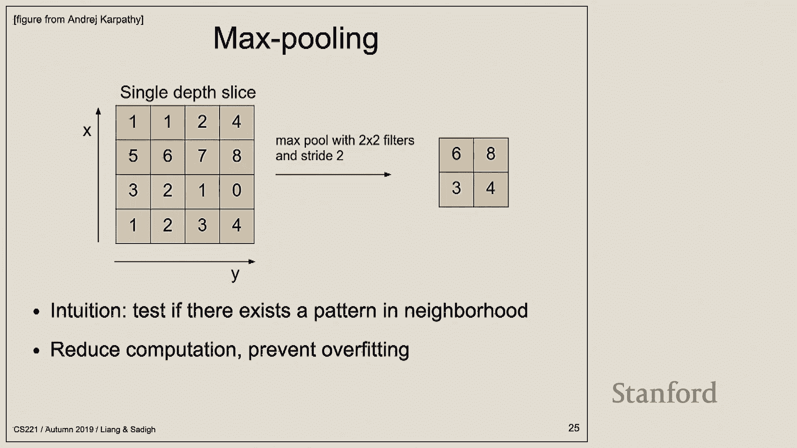

 So this is an example of how these things work is， is it's， they're pretty straightforward。

 basically。 So you， you just have your compositional layers， you stack them all up。

 Everyone wants to know I have some pooling and you go down and down in dimensionality until。

 you eventually get down to a， like a distribution over possible labels。

 And this ties into what I was saying before about that Lego block analogy because this。

 this entire network is built up of one， two， three， four different Lego blocks in a way。

 And it's basically just stacking them on top of each other and composing them up in order。

 to get a image classifier。

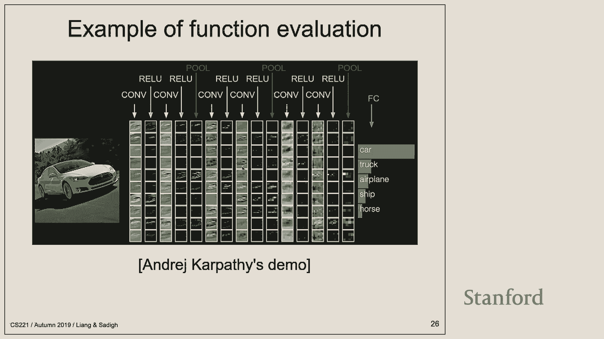

 So I'm going to talk about three case studies of CNN architectures。 So the first one is Alex net。

 So this was that one that did really well in the image net competition and really brought。

 CNNs to the mainstream for computer vision。 Basically it was just a really big neural network。

 One trick they did was they use values instead of， so the sigmoid that we've learned about。

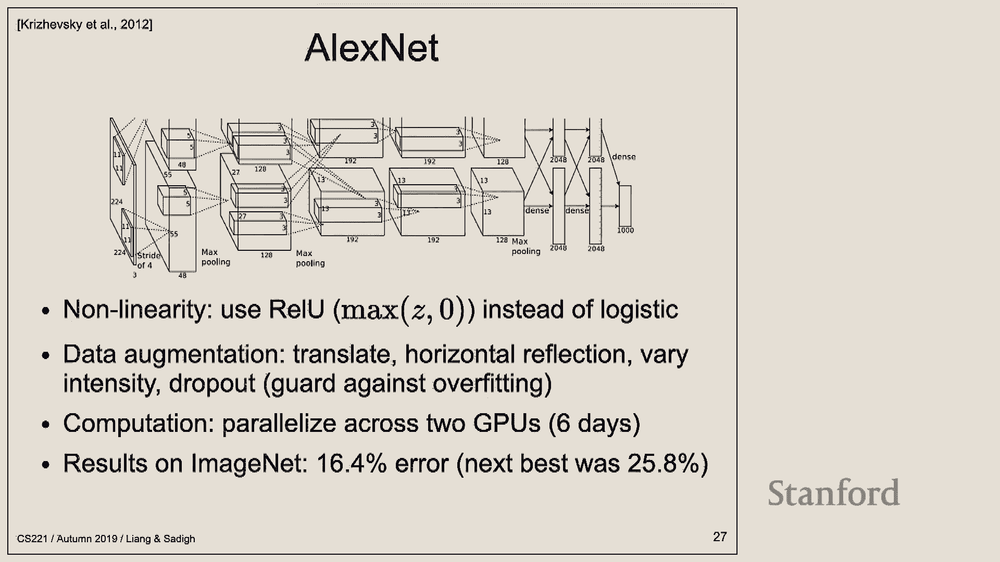

 I think we've， the sigmoid that we've learned about this is an activation function and it's。

 going to look something like this。 And what they did was instead they use the review。

 which looks a little more like that。 And then we learned in practice it turns out to be a little easier to train and use。

 The next one is Vijiginet， which did an image net a couple years later。

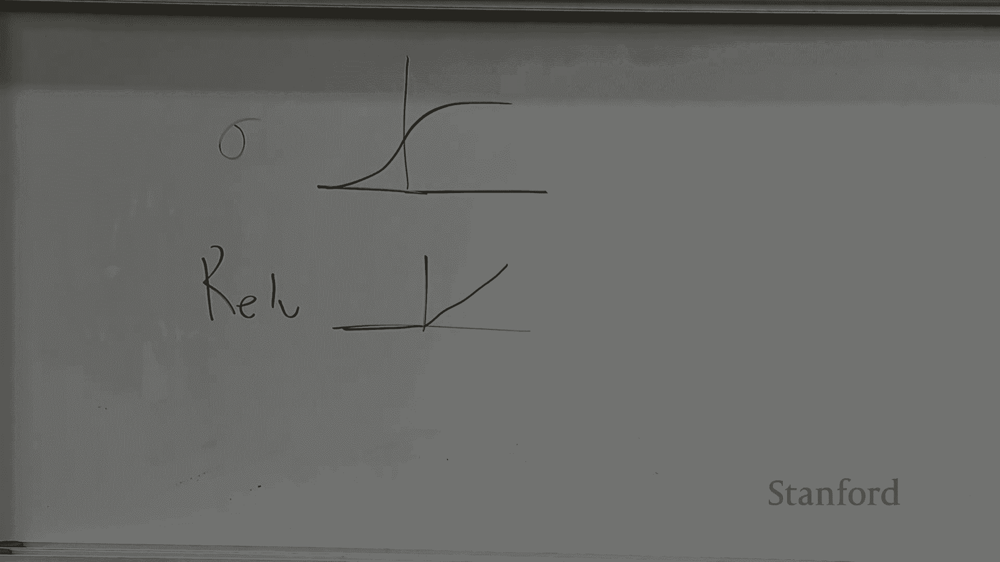

 Basically it's very similar。 It's just a CNN。 I think the thing to note about this one is that it's very uniform。

 So it was 16 layers and there's nothing fancy in it。

 It was just a bunch of these Lego blocks stacked up。

 The entire network is pretty much like you just by looking at this picture you could probably。

 re implement their network。 Something else to note about it is it started this trend of deeper of kind of like tall and。

 skinny networks。 So you notice that there's a lot of layers but each layer is very thin。

 And residual networks or resonance kind of takes that to the n's degree。

 So the idea with resonant is so most of the time you take your input you pass it through。

 matrix to get an output。 If you add in your input again then that is very helpful because it makes it easy for。

 the model to learn the identity function。 And so you can give the model the capacity for like a hundred layers。

 But if you add in these residual connections which is what you call it when you basically。

 just like add in X then it allows the model to skip a layer if it decides that that's。

 what's best for itself。 You just set W to zero。 So it also helps with training back propagation if you take the derivative of the loss with。

 respect to your input that derivative is just going to be one for this part of the sum。

 And so it gives in a way you can think of it as it gives the error signal kind of like。

 a highway through the network and it allows the gradients to propagate much deeper into。

 these large known networks。 And so ResNet got a 3。6% error on ImageNet。

 If you remember the AlexNet it blew everyone out of the water and it got like 15%。

 I think this is much better than human performance and it will come up later when we talk about。

 this idea of like residual connections will come up later when we talk about recurrent neural。

 networks。 So just to summarize convolutional neural networks are often applied in image classification。

 The key idea is that you have these filters which you are sliding around in the input and。

 that lets you one have it does kind of this like idea of local connectivity so a space。

 in the output only depends on a small patch of the input instead of the entire input。

 And then second the parameters are shared。 Depth has turned out to really matter for these networks and I think to this day it's。

 like people it's like every day it's just a deeper network that's coming out and people。

 haven't really found a bound to depth I guess。 >> The best way to design one of these networks is it trial and error on what that could be。

 trying to get out of some results or is there any intuition as to how many layers what the。

 layer should be and so forth。 >> Yeah so the question was how to design these things since this it seems so arbitrary。

 and yeah it is really arbitrary。 I think so there's a few different ways so first you start with something okay so first。

 you would start with something that sounds reasonable and then you would do some kind。

 of like a grid search or you would do now there is a literature on meta learning which。

 is where you have a model decide what your model looks like but in most cases you just。

 kind of like hand to net you're like oh if I add a layer does it go up or down。

 Second you look at the literature and say okay someone else solved a similar problem。

 to me and they used network x， y， and z so I'm going to start with that and then start。

 fiddling from there。 And then third is to literally take that network that's been pre-trained on a task and。

 then apply it to yours。 We'll talk about it later but pre-training networks and applying that to your task has。

 shown to be very helpful。 Okay so now we're going to talk about recurrent neural networks。

 The idea here is that you're modeling sequences of input。

 This could be things like text or sentences。 It could also be things like time series data or financial data。

 And recurrent neural network is something where the input it feeds its past inputs into itself。

 so it has time dependencies。 So for example we have this very simple recurrent neural network here。

 It is a function with one matrix and it takes as arguments a past hidden state and a current。

 input and then it predicts the next hidden state。 So this is what it looks like if you were to write an encode or something。

 This is what the actual network looks like。 So there's an input and you feed that into your function as well as your current state。

 and it just kind of loops on itself。 And most of the time people talk about this third perspective which is taking kind of。

 this network and kind of unraveling it across time。 I guess you could say unfolding it across time。

 Where every time step you have an input and you have a state and then you have your function。

 which carries you to your next state。 Yeah。 It's curious because it's different from having your original weight and updating that weight。

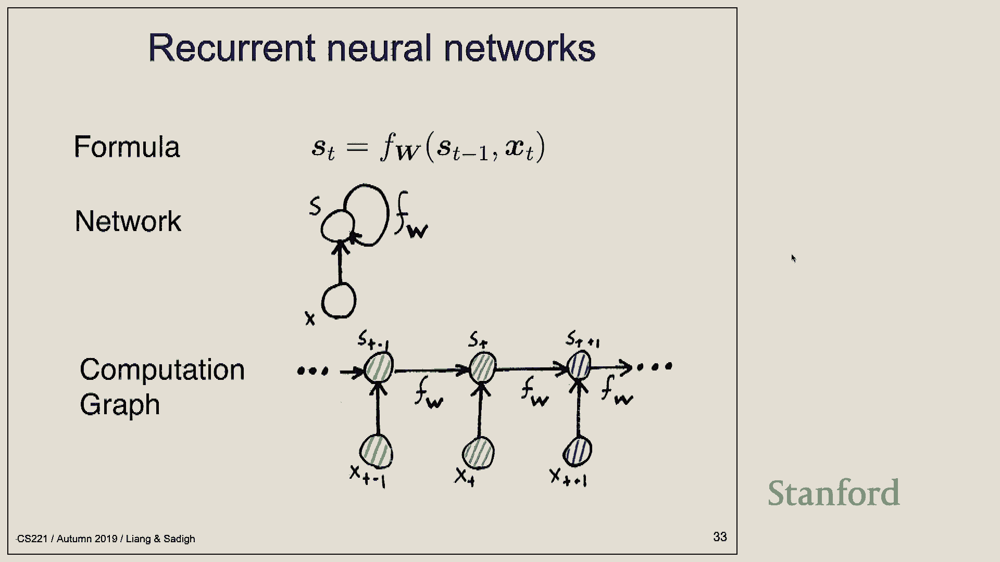

 because it sounds like that's a similar energy。 Here you have the previous state。 Yeah。

 But how is it compared to our machine learning classifier is where we have the previous weight。

 and we just updating the previous weight。 Oh， I see。

 The question was what's the difference between this and the setting before when we had when。

 we were like stochastic gradient descent where we were updating our weights sequentially。 Yeah。

 So that is an interesting question。 So the difference is that before for SGD that was for sequential in the training whereas。

 this is sequential in the inference。 So each so you do you feed in 10 inputs let's say 10 times that inputs and then after all。

 that time then you back propagate once for all those time steps。 So to make that more clear。

 So for SGD it's like you have X one Y one X two Y two and you use this to update W right。

 So you update W and then you update W and yeah that's that's an interesting observation。

 that there's this kind of like time dependency。 But there's no time within the data itself for for the current setting it's it's more like。

 this it's like if I wish markers better。 So it's more like this it's more like you have X one one X one two X one three and Y and。

 then X two one X two two and X two three and Y。 And then you use this to update W。

 And in this setting when we talk about time or temporal like when we talk about a sequence。

 we're talking about a sequence here in the data。 Not necessarily in the learning。 Yeah。

 Okay so to make this is a more concrete example we're going to talk about a neural network。

 language model。 So this is a model that is in charge of sucking in a sentence and predicting what is the most。

 likely word that would come next in the sentence。 So we're so each input we call X and our hidden states we call H's。

 And the way this works is we have some function that takes X one and encodes it into our。

 hidden state。 And then we have a second function that takes the hidden state and decodes it into the next。

 input。 We continue by taking both the next both X two our next input and each one our previous。

 hidden state and then we use that to create a new hidden encoding。

 And then we take that new hidden coding and decode it into our next input。

 And we just rinse and repeat each time we take the current input and the previous hidden。

 state to first create an encoding。 And then second predict our next input。

 So there's those two steps。 The cool thing about this to note is that this now we're building up vectors these HIs and。

 that's exactly what we're looking for。 It's a vector that in some way captures the meaning or a summary of all the X all the inputs。

 that we fed up until that time step。 So now we have a vector which compresses all those inputs into one vector。

 So to make this very concrete one way you could build this thing is by basically each。

 of these arrows you stick a matrix in there。 So our encode function would take the input the X t and multiply it by a matrix in order。

 to get a vector。 And then it would take the previous hidden state H t minus one and multiply that by a。

 different matrix to get a new vector。 And you add those vectors and that gives you a vector which is your new hidden state。

 And your decode is the same thing。 You take your hidden state pass it through a matrix to get a vector and then send that。

 through a softmax to turn the vector of logits into a distribution of probabilities。

 In general though there's this problem with current neural networks。

 So if there is a short dependency which means the input and the output。

 If an output depends on a recent input then the path through this network is very short， right。

 So it's easy for the gradients to reach where it needs to reach in order to train the network。

 properly。 But if there's a very long dependency then the gradients have a had they have difficulty。

 getting all the way through。 So if you remember we talked about gradient descent as a credit assignment problem where。

 the gradient is in some ways like saying how much。

 Okay so if I change the if I change this input by a small if I perturbed by a small amount。

 how much would the output change。 That's in what sense that what the gradient is saying。

 But if the input and output are super far away from each other then it's very difficult to。

 compute how small perturbations the input would affect your output。

 And the reason for that we won't get into it so much but basically if you want to compute。

 the gradient then what you have to do is you have to trace the entire path of that dependency。

 and you look at all the parts of derivatives along that path and you multiply them all， up。

 And so the problem is that if the path is very long then you're multiplying a lot of numbers。

 and so if your numbers are less than one then the product the over product is going to get。

 really small really fast right。 And if the numbers are bigger than one then that product is going to blow up really quickly。

 And so that is a problem because it means your gradients are going to be tiny and you。

 have no learning signal or they're going to be way too big and you're going to just。

 like shoot into some crazy direction that in practice will blow up your experience and。

 nothing will work。 So it's a problem。 So the good thing is that for the exploding gradient problem that's not so bad there's。

 a quick fix。 What people do is what they do is what's called clipping gradients。

 So you'll specify some norm。 You'll be like any gradient with a norm bigger than two I'm going to clamp off at two。

 So if your green is explode and they go to 10 million you're going to say okay that's。

 bigger than two so it wasn't 10 million it was actually two。

 But for the vanishing gradient problem there's this cool idea and the long short term memory。

 cell which is similar to a recurrent law that work but it has two hidden states。

 So this is kind of a wall of equations but I think the important thing to note is that。

 you're doing this is basically like your input in a way and this is kind of like your。

 previous hidden state and so what's going on here is you're doing an additive combination。

 you're taking your input and you're adding in your previous hidden state very similarly。

 to those residual connections in the resnet。 And so this because you're adding in your previous state it's kind of like adding in。

 your previous input I guess you could say and it gives the gradients kind of like a highway。

 to very easily go back in time。 There's another perspective on this so this picture the notation is different but I think。

 the thing to note here is that this so those are you could say are hidden states in this。

 network or I guess so in LTM so you could I guess you could say that there's two hidden。

 states that's what people say。 So you have one hidden state which is your HT and that's the state that you exposed to。

 the world。 If you said my LTM is going to have the same API as my RNN then this would be like the equivalent。

 of that hidden state that we had for the RNN。 But then you also have this internal hidden state the C state that you never exposed to。

 the world。 And so in this picture the sorry the notation is a little confusing but the O in this picture。

 corresponds to the H in the previous picture so this is the hidden state that you're exposing。

 to the world and then the S corresponds to C so this is your internal hidden state。

 And the thing to note about this picture is that S is just zipping around on what's called。

 the constant error carousel and it's always internal and it's zipping around this thing， in a loop。

 And so what it ends up doing in practice is it ends up like that it's a vector and it。

 contains very long term information that's useful for the network over many many time steps。

 So if you if you poke around at individual dimensions of that state then you and then。

 you can find these long term things being learned。

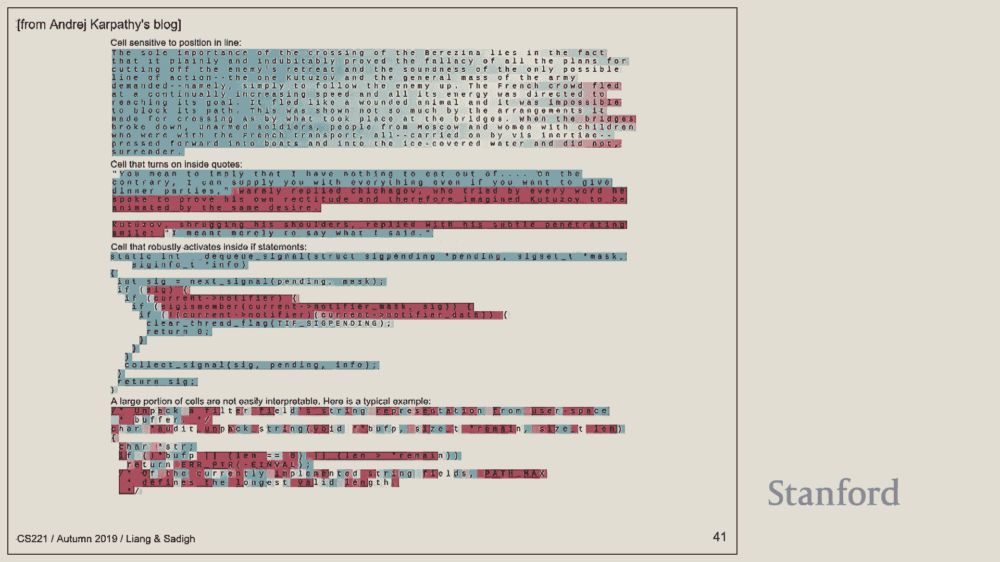

 So for example Andrei Kravth has a great blog post you find networks that you find units。

 that track the length of the sentence you find units that track syntactic cues like quotes。

 or brackets。 But in general you find a lot of things that are just not easily interpretable。

 So one last cool idea that people have used with these recurrent networks is sequence to。

 sequence models like machine translation which is where you have two sequences you have an。

 input sequence and an output sequence and you want to suck in your input sequence and then。

 spit out your output sequence。 And you do this with what's called an encoder decoder paradigm。

 You encode your sequence by giving it to your RNN and that gives you a one vector which。

 is encoding or compression of that input and then you decode your sequence by spitting。

 out your outputs just like we were talking about before with the language model。

 And more recently there's these attention based models which are very helpful in the。

 case where there's long sequences。 So if you look back here X1， X2。

 X3 are all getting compressed into a single vector。

 So if you have a really long paragraph maybe it's hard to shove that into your 200 dimensional。

 vector。 It's hard to capture the depth of all that language with just a bunch of numbers。

 And so the idea behind attention is to look back。 So the way attention works is at a very high level is so if you have your inputs we have。

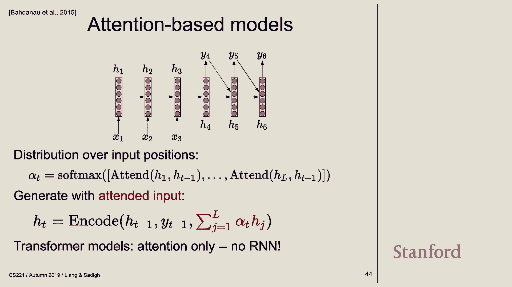

 X1， X2 and X3 and we run our RNN over these inputs and so we have three hidden state vectors， H1。

 H2 and H3 and now we're decoding and so we have our RNN decoder that has some hidden。

 state we'll call it S1。 What happens is you compare your current hidden state with all of the states in your。

 encoder and you compute a number that says how much do I like this state。

 So maybe it really likes this number and it's not too happy about this vector and it doesn't。

 like this vector。 What it does is it uses these scores to turn them into a distribution。

 A probability distribution that again says how much do I as S1 like each of these vectors。

 And then what you do is you compute a weighted average of these hidden vectors where the。

 weights come from this distribution。 And what this does is it serves two purposes。

 So first and there's another way of kind of writing this down on the slides。

 But I think this serves two purposes。 So first of all it gives you some interpretation。

 So every time step you can see what parts of the input is it focusing on。

 What parts of the inputs have a lot of probability mass on them。

 And then second what it lets you do is it lets you it kind of releases the model from。

 the pressure of having to put the entire input sequence into a single vector。

 Now what it can do is it can dynamically go back and retrieve the information it needs。

 And then more recently there is what's called transformer models which are which do away。

 entirely with the RNN aspect。 It's just a tension。

 And with a transformer you have your hidden states。

 And instead of instead of having some kind of decoder hidden state that you're comparing。

 to the others what you're doing is you just you select each hidden state and you compare。

 H1 to all the other H's including itself。 To get a number of how much H1 likes those other H's。

 And then you compute your weighted average of all of these hidden states。

 And that becomes your next layer。 So I would recommend taking 224N if you're interested in this topic。

 Transformers are very cool and they've recently become I guess you could say like the new， LSTM。

 So from these attention distributions you get cool interpretable maps like in translation。

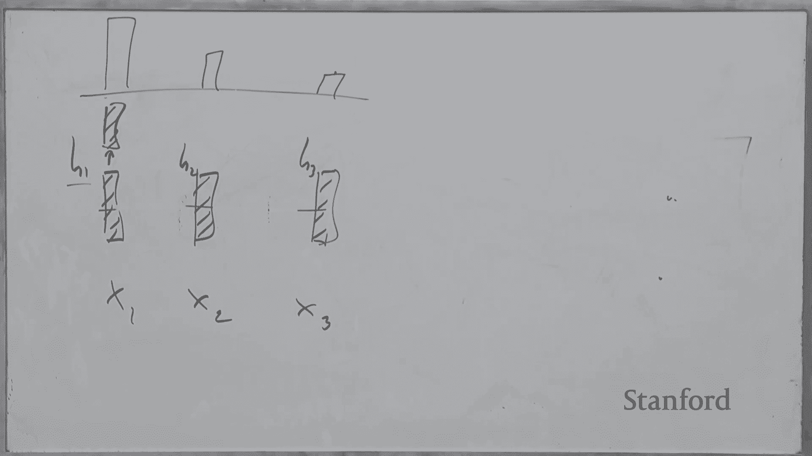

 So this is an attention distribution and it points at words that are corresponded。

 So like economic corresponds to economic and you can see that in the distribution。

 They also do this in computer vision。 You can highlight areas of a picture。 Yeah。

 so just to summarize so we're currently on X you can throw a sequence at them and they'll。

 give you a vector。 There's this intuition that they are processing input sequentially kind of like a for loop。

 But they have a problem with training where the gradients either blow up or they shrink， very small。

 So LSTMs are one way of mitigating this problem but they're not perfect。

 They still have to shove information into one vector。

 And so the way people get around this is with attention based models where you dynamically。

 go back into your input and retrieve the information you need as you need it。

 So now we're going to talk about unsupervised learning。

 So like I said before neural networks we got them to work well recently and a lot of that。

 is just because they need a lot of data。 But if you're a smaller lab or if you don't have enough money to basically pay for a data。

 set or even if it's a hard problem that just there isn't a lot of data for。

 There's a lot of cases where there isn't enough data to train these very very large models。

 with millions and billions of parameters。 But on the other hand there's tons of unlabeled data laying around。

 You can download the whole internet if you want。 And there's kind of this real inspiration from us as human beings。

 We are never given labeled data sets of what foods are edible and what foods are not edible。

 You absorb experiences from the world and you use that to inform your future experiences。

 and you're able to kind of like reason about it and make decisions。

 So I'm going to turn off my okay。 So yeah， so the first I guess thing that we're going to get into is autocoders。

 So the idea behind autocoders is that if you have some information and you try to learn。

 a compressed representation of that information that allows you to reconstruct it， then presumably。

 you've done something useful。 So in neural network speak the way that works is you give it some kind of a vector and you。

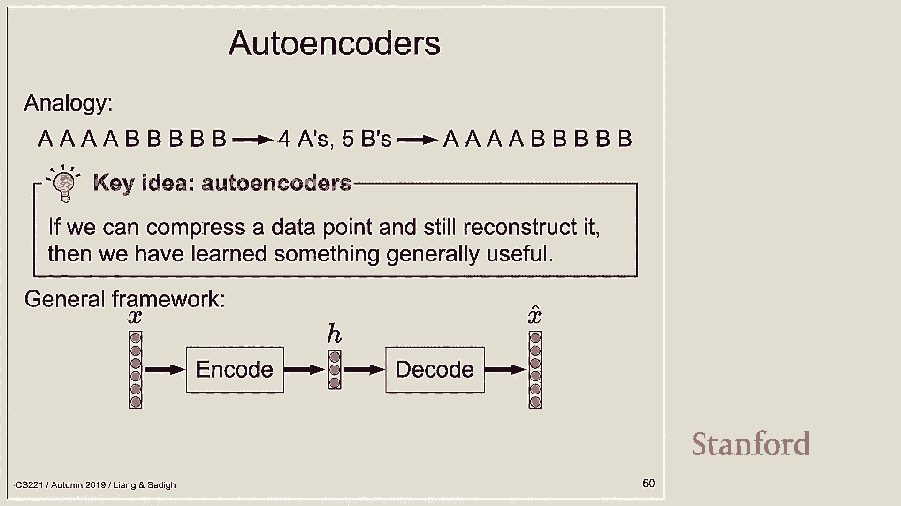

 pass that through an encoder which gives you a hidden vector and then you pass that hidden。

 vector through a decoder which you use to reconstruct your input。

 And the implicit loss in most cases is you want to take the difference。

 Basically you want your reconstructed input and the original input to be very similar。

 So just to motivate this， this isn't deep learning but principal component analysis could。

 be viewed as one of these encoder decoders。 The idea behind physical analysis is you want to come up with a matrix U which is a。

 vector that can be used to both encode and decode a vector。

 So you multiply x by U to give you a hidden vector or a new representation of your data。

 but then if you transpose U and multiply it by your hidden vector then that should give。

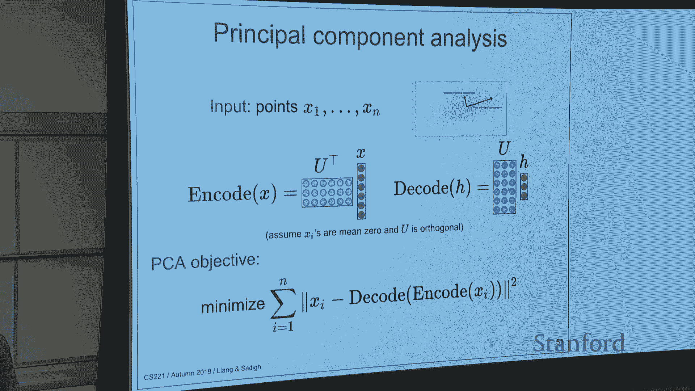

 you something as close as possible to your original data。 So but there's a problem。

 So if we have a hidden vector with a bunch of units then it's not going to learn anything。

 It's just going to learn how to copy inputs into outputs。

 And so a lot of research on auto encoding and this kind of unsupervised learning is about。

 how to control the complexity and make the model robust enough to generate useful representations。

 instead of just copying。 So the first pass at that can be using one new transformations。

 So you would do something like the logistic or the sigmoid loss and that means that the。

 problem can't be solved anymore by just copying into the output and so you're going to have。

 to actually learn something useful。 Another way of doing it is by corrupting the input so you have your input and you noise。

 it。 Maybe you drop out some numbers from it。 Maybe you perturb some numbers of it。 Maybe you add in。

 maybe you draw from like a Gaussian and add that to your input。 And then you pass that through。

 So yeah so you could drop so if your vector is one， two， three， four you could drop out。

 one and four and just set them to zero or you could slightly perturb these numbers so that。

 they're close to their original but different， not the exact same。

 And then the idea is that after you pass this encoded input through both your， after you。

 pass this corrupted input through both your encoder and decoder then the output， the eventual。

 x hat should be very close to your original uncorrupted input。 Yeah。

 So another is a variational encoder which has a cool kind of probabilistic interpretation。

 So you could think of it as kind of a Beijing network。

 I think maybe this is more useful to look at so you have an encoder and a decoder and。

 they are both modeling I guess probability distributions。

 So what this is saying is I want to encode x into a distribution over h's and you learn。

 a function which is in charge of doing that。 And then you want to specify some conditions。

 First you say okay I want to make x recoverable from my h distribution and then second this。

 is a term that kind of it prevents h from being degenerate。

 So maybe a good way of thinking about this is instead of so a traditional autoencoder would。

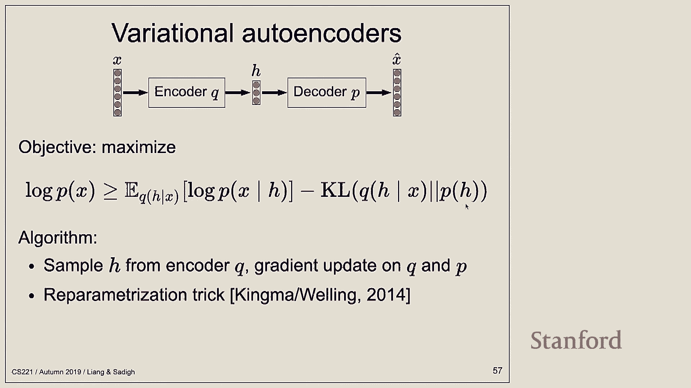

 take my input and it would map it， it would send it through some kind of encoder and map。

 it into a hidden vector send that through a decoder and that would reconstruct my input。

 Whereas a variational autoencoder is going to take my input and it's going to map that。

 into a distribution over possible h's。 And then what I'm going to do is I'm going to sample from this distribution pass that。

 through my decoder and produce my reconstructed input。

 And the nice thing about this is that since this is a distribution instead of a vector。

 you've imposed some structure on the space。 So points that are close together in this space should map to similar x-hats。

 And then similarly as you move through this space you should be able to gradually transition。

 from one I guess reconstructed input to a second。 So for example there's this cool experience in computer vision where they'll say up here。

 this is going to give me like a chair or something and then down here is going to give。

 me like a table and then if I move from one to the other then and you constantly decode。

 then it'll like gradually morph into the table。 It's really cool。

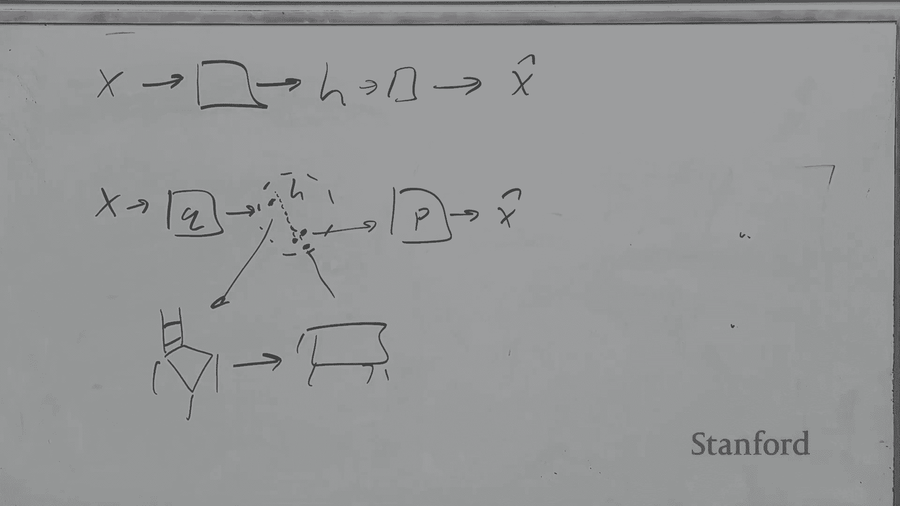

 And then so then the last method of unsupervised learning that we're going to talk about is。

 motivated by this task。 So there's this data set called squad which is about 100。

000 examples where each example， consists of a paragraph and then a bunch of questions like multiple choice questions。

 based on that paragraph。 So the problem here is that there's only 100，000 examples。

 And really the intelligence that this task is trying to get at is just can you read a。

 text and understand it which is more general and is captured by more data than just these。

 hundred thousand。 In particular it's captured by just all the text that you could possibly read。

 So there's billions of words on Wikipedia and Google you could just call the web and。

 download it and if somehow you could leverage that maybe that would be helpful for your。

 reading comprehension。 And that is just a perfect case of this setting where we have tons of unlabeled data。

 very， small amount of labeled data。 So recently the NLP community has come up with this idea called BERT。

 Well there's actually not just BERT but there's a lot of people who are doing similar things。

 but BERT is the example we're talking about。 With BERT what you do is you take a sentence and then you mask out some of the tokens in。

 the input and then you train a model to fill in those tokens and they actually train the。

 model on a bunch of things so they train it on token filling and then they also would。

 glue two sentences together and ask the model are these sentences like would they be adjacent。

 in the text or not？ Like do they make sense together or not？

 But the idea is basically like have give a bunch of unlabeled text to a model which is。

 just going to kind of like manipulate that data in order to learn structure from it without。

 any explicit purpose other than just learning the structure。

 And they trained it on a bunch of data for a long time and then what you can do is once。

 BERT is actually a big so we talked about transformers before and BERT is like a big transformer so。

 they train this thing on a ton of unstructured text on just this word filling task for a。

 long time and then what they did was they took their pre-trained BERT and they took the。

 and they started feeding it questions from squad so they took questions and then they。

 would glue on to it the paragraph the context that they used to answer the question and。

 then they would take whatever vectors are coming out of BERT and they would pass that。

 through a single matrix which basically predicts the answer for that squad question。

 And it did really well so this picture is right when BERT was released and these are。

 all of these state of the art models for squad and BERT not only beat all the other models。

 by a large margin but also beat human performance。

 And I guess the intuition behind BERT was that by doing these seemingly trivial tasks。

 like word filling and next sentence prediction what you end up learning is you end up learning。

 the vectors that are coming out of this are vectors that say what is the meaning of a， word。

 What is the meaning of a word in this context？ What is the meaning of this sentence？

 And that meaning isn't operationalized towards solving any task in particular。

 It's just like in a very general sense like what is I'm going to imbue this model with。

 an understanding of language and then once I have an understanding language I'm going。

 to then apply it to my very targeted downstream task。

 And that is kind of the principle behind unsupervised learning。

 So you kind of like make up these almost trivial prediction tasks just to manipulate。

 data and learn structure from it。 Understand language。 Understand what a picture is。

 And then what you do is then you fine tune it on the very small amount of label data that， you have。

 And that's kind of what the current state of the art is in a lot of fields is basically。

 just doing more and more unsupervised pre-training with bigger models and bigger data。

 And the field really hasn't found like a limit to this yet。

 And it will be interesting to see how far it goes。 So I'm going to skip those slides。

 But just to kind of wrap things up。 Recently I guess the biggest things that people have gotten to get neural networks working。

 is one better optimization algorithms。 So we have these adaptive algorithms that are not as I would say like obtuse as SGD。

 It doesn't have to move in this by the same amount every time。

 You have a lot of tricks like fine tuning， unsupervised learning， clipping the gradients， bash norm。

 We have better hardware。 We have better data。 And that allows us to experiment more and train larger models faster。

 Yeah， we wait a long time。 But I think maybe one of the problems with the field is that the theory is in a lot of。

 ways lacking。 And we don't know exactly why neural networks work well and why they're able to learn good。

 functions despite having a very difficult optimization surface。 Yeah， so just to summarize。

 we talked about a lot of different building blocks。

 We talked about how to leverage spatial structure with convolutional neural networks。

 We talked about how to feed sequences into recurrent neural networks and transformers and， LSTMs。

 We talked about the sequence of sequence paradigm for machine translation and unsupervised learning。

 methods that help you kind of like jumpstart your downstream applications。

 And I think the big takeaway here is that in some ways the big advantage of a neural network。

 is that they are compositional。 So it's like Legos。

 They take an input and they turn it into a vector。 And then once you have a vector。

 you can start combining these things in very flexible， ways。

 And so in a lot of ways designing these things is a lot like putting together Lego set。

 You have your building blocks in LSTM， attention and coding， and you can decide how to， it's， like。

 oh， I want to run this LSTM here and this LSTM here。

 And then I want this one to attend over this one。 And then I'm going to concatenate the result with the output of this CNN。

 And because of， because I guess you could say like the magic about propagation， you can。

 combine these things。 And I think even more generally it allows you as a programmer to instead of make a program。

 for solving a problem。 It allows you to make this scaffolding that allows a computer to teach itself how to solve。

 the problem。 So instead of defining the function you want the software to learn。

 you define a very broad， family of functions that the software is allowed to learn。

 And then you let it go and run off and find the best match within that。 Yeah。

 so those were all the things we're talking about today。

 But I hope you all have a good Thanksgiving break。 [BLANK_AUDIO]。

