# 【斯坦福大学】CS221 人工智能原理与技术 · 2019秋（完结·中英字幕·人工校对中) - P9：Lecture 9（给我讲故事看已校对） Game Playing 1 - Minimax Alpha-beta Pruning - 鬼谷良师 - BV16E411J7AQ

 All right， let's start， guys。

 Okay， so a few announcements before we start。 So if you need to ae accommodations。

 please let us know if you， Haven't done that already。

 So you need to let us know by October 31st because we need to， Figure out the alternate exam date。

 So we'll get back to you about the exact details around the， Alternate exam date。

 but let us know by October 31st。 Project proposals are also due this Thursday， so do talk to the。

 TAs， you talk to us， come to office hours。 Okay？ All right， so today we want to talk about games。

 So we have started talking about this idea of state-based， Models。

 like the fact that you want to have state as a way of。

 Representing everything about everything that we need to plan， For the future。

 We talked about search problems already。 We have talked about MDPs where we have a setting where we。

 Are playing against the nature and the nature can play like， Probabilistically and based on that。

 we need to respond。 And today we want to talk about games。

 So the setup is we have two players playing against each， Other。

 So we're not necessarily playing against nature， which can act， Probabilistically。

 We're actually playing against another intelligent agent that's。

 Deciding for his own or her own good。 So that's kind of the main idea of games。 All right。

 so let's start with an example。 So this is actually an example that we are going to use。

 Throughout the lecture。 All right， so the example is we have three buckets。 We have A， B， and C。

 And then you're choosing one of these three， Buckets。 And then I choose a number from the bucket。

 And the question is， well， your goal here is to maximize the。

 Chosen number and the question is which bucket would you use？ Okay。

 so how many of you would choose bucket A？ No one trusts me， okay？ Right， so much more so good。

 How many of you choose B？ Okay， so a number of people don't trust me。 How many of you choose B？

 Okay， so there's a number of people there。 So how are you making that decision？

 So the way you're making this decision is if you choose A。

 You're basically assuming that I'm not playing like trying， I'm not trying to get you。

 I might actually give you 50。 And if I give you 50， that would be awesome。

 And you have this very large value that you're trying to maximize。

 If you think I'm going to act adversarially and go against you and。

 then try to minimize your number， then you're going to choose bucket B。 Right。

 because worst case scenario， I'll choose the lowest number of the， bucket。 And in bucket B。

 the lowest number is one， which is better than minus 50， and minus five。

 So if you're assuming I'm trying to minimize your good， then you're going to choose bucket B。

 And then if you have no idea how I'm playing and then you're just。

 assuming maybe I'm acting at a stochastically and maybe I'm like。

 flipping a coin and then based on that， deciding like what number to give you。

 you might choose C because in expectation C is not bad。

 Like if you just average out these numbers and then pick the average values， from A， B， C。

 A and B and C。 The average value for A is zero， for B it's two and then for C is five。

 So if I'm playing stochastically， you might say， well。

 I'm probably going to give you something around five。 So you would pick C。 Okay。

 So today we want to talk about these different policies that we might。

 choose in these settings and how we should model our opponent and how we。

 formalize these problems at game problems。 So this is an example that we just started。 Okay。

 so the plan is to formalize games， talk about how we compute values in， the setting of games。

 So we're going to talk about expecting max and minimax。 And then towards the end of the lecture。

 we're going to talk about how to make， it faster。 So we're going to talk about evaluation functions as a way of making things。

 faster， which is using domain knowledge to define evaluation functions over notes。

 We're also going to talk about alphabetoprooning， which is a more general way。

 of pruning your tree and making things faster。 Okay？ All right， so that's the plan for today。 Okay。

 so we just defined a scheme and the way to go about this game is to create。

 something that's called a game tree。 A game tree is very similar to a search tree。

 So this might remind you of search tree where we talked about it like two weeks， ago， right？ So。

 so the idea is we have this game tree where we have notes in this tree， and each。

 note is a decision point of a player。 And we have different players here， right？

 Like I was playing or you were playing， like we have two different people like playing， here。

 So these decision notes could be for what one of the players， not both of them。

 And then each root to leaf path is going to be a possible outcome of the game。 Okay？

 So like it could be that I'm choosing minus 50， and then your decision was to pick bucket， A。

 so that path is going to give us one possible outcome of how things can go。

 So that is what the tree is basically representing here。 Okay？

 So the notes in the first level are the decisions that I was making， and then the first， note。

 the root note， are the decisions that you were making in this setting。

 So if we were to formalize this a little bit more， we're going to formalize this problem。

 as a two player zero sum game。 Okay？ So in this class， at least like today。

 we're going to talk about two player games where we， have an agent and we have an opponent。

 And then we are going to talk about policies and values， and for all of those things， think。

 of yourself as being the agent。 So you're playing for the agent， you're optimizing for the agent。

 opponent is this， opponent that's playing against you。 Okay？ So we're also going to， like today。

 we're going to talk about games that are turn taking， settings。

 So we're going to talk about things like chess。 We're not talking about things like rock paper scissors。

 We'll talk about that actually next time， then we have simultaneous games where you're。

 playing simultaneously。 Today， we are talking about turn taking settings。

 Two player turn taking settings。 Full observability， we see everything。

 We're not talking about games like poker where you don't necessarily see， like you have partial。

 observation， you don't necessarily see the hand of your opponent。 Full observation， two player。

 and also zero sum games。 And what zero sum means is if I'm winning and if I'm getting like $10 from winning。

 then， my opponent is losing $10。 So the total utility is going to be equal to zero。

 If I win some amount， my opponent is losing the same amount。 Okay？ All right。

 So what are the things that we need when we define games？ So we need to know the players。

 We have the agent。 We have the opponent。 In addition to that， we need to define a bunch of things。

 This should remind you of the search lecture or the MDP lecture。 So we might have a start state。

 That's a start。 We have actions， which is a function of state。

 which gives us the possible actions from， a state S similar to before。

 You have a successor function similar to search problems。

 So a successor function takes a state and action and it tells us what's the resulting state。

 you're going to end up at。 And you have an is end function which checks if you're in an end state or not。

 And the thing that's different here， there are two things that are different here。

 The other thing that is this utility function。 And the utility function basically gives us the agent's utility at the end state。

 So one thing to notice here is that the utility only comes at an end state。

 So after you finish the game， I've played my chess and I won chess now and this is， this chess game。

 And then I get my utility。 As I'm making moves through my chess game， I'm not getting any utilities。

 You only get the utility at an end state。 And the way we are defining the utility is we are defining it for the agent because again。

 we are playing from perspective of the agent。 So what would be the utility of the opponent？

 Minus that， right？ So negation of that would be the utility of opponent。 Okay。

 I've heard about partially observable Markov decision process。 Is this like kind of what it is？

 Is this off the E？ Okay， so the question is， is this partially observable Markov decision process？

 This is not a partially observable Markov decision processes。 There are classes that talk about。

 there's this decision under uncertainty。 Michael Kochen。

 their first class that actually teaches that。 So you should take classes on that。

 This is not partially observable Markov decision process。 This is fully observable。

 You have two players playing against each other。 So very different setup。 >> [INAUDIBLE]。

 >> So the question is， are there any randomness here？

 And so far I haven't discussed any randomness yet。

 Later in the lecture I'll talk actually about the case where there might be a new。

 nature in the middle that acts randomly and then how we go about it。

 But so far two players playing against each other。 Okay。 All right。

 And then the other thing that we need to define when we are defining a game is the， player。

 So player is a function of state and basically tells us who is in control。 Like who is playing now。

 So in the game of chess， like whose turn is it now？

 And that is a function that you are going to define when we are formally， defining a game。 Okay。

 All right。 So let's look at an example。 So we have a game of chess。 Players are white and black。

 Let's say you are playing for white so the agent is white， the opponent is black。

 And then the state S can represent the position of all pieces and whose turn it， is。

 So that is going to what the state is representing。

 So whose players turn it is and then the position of all pieces。

 So actions would be all the legal chess moves that player S can take。

 And then is end basically checks if the state is checkmate or draw。 That is what is check。 Okay。

 So then what would the utility be？ The utility will be if you are only going to get it when you win or when you。

 lose or if there is a draw。 So the way we are defining it is it is going to be let's say plus infinity if。

 white wins because the agent is white and it is going to be zero if there is a。

 draw and then it is going to be minus infinity if black wins。 Okay。 Yeah。

 So that was all the things that we would need to define。 Yes。

 >> Why do we have whose turn it is in the state？ So that is one way of actually extracting the player function。

 So the way you can define the player function is a player is a function of state。

 So the state already needs to encode whose turn it is so you can kind of extract out， the player。

 >> So you said the utility will be negative for the agent。

 Is that assuming that they are taking the same actions？ >> No。 So this is turn taking。

 So I take an action and then the opponent takes an action and the agent， takes an action。

 A opponent takes an action and at the very end of the game then you get the。

 utility and then the opponent gets negative of that utility。

 But the actions could be very different。 Policies could be very different。

 And we will talk about how to come up with that。 >> So why is the condition like very equivalent？

 >> Because what if like for wins you get plus infinity but like a black， wins。

 If black wins you get negative。 But like what if like when you lose you just get zero。

 >> You don't have a zero sum game。 We will talk about that next lecture actually a little bit。

 So I am talking about zero sum games here because the algorithms you are talking about are。

 for zero sum games。 We are going to talk about mini max type policies。

 Minimizing and the agent is maximizing。 So I will get back to that if I haven't answered that。

 Like we can talk about it after the class。 But also next lecture we will talk about more variations of games。

 But for now I am assuming a bunch of simplifying assumptions about this game。 >> Sorry。

 so just to make sure the assumption is that if white wins， but if black wins， black gets zero。

 that is not considered as a black。 >> Yeah， so utilities need to add up to zero。

 If white wins maybe white gets ten but black gets minus ten。 So they need to add up to zero。

 >> All right， so and then kind of the characteristics of games that we have already discussed are two。

 main things。 One is that all utilities are at the end state。

 So throughout this path you are not getting any utilities as opposed to like things like。

 MDPs where we were getting rewards like throughout the path。

 But here like the utility only comes in at the very end at the end state。

 And then the other thing about it is that different players are in control at different， states。

 right？ Like if you are in state you might not be able to control things。 It might control things。

 It might be a opponent's turn and you might not be able to do anything。 Okay。

 so those are kind of the two main characteristics of games。 All right。

 so let's look at a game that you're going to play。 All right， so the game is a half in game。

 So we start with the number N and then the players take turn and they can do two things。

 They can either subtract one， they can decor them an N or they can replace N with N over two。

 So they can divide or subtract。 Okay， and the player that's left with zero is going to win。 Okay。

 so that is the setup。 Does that， does that go follow that？

 So let's try to formalize the game and then after that you want to figure out what is a good。

 policy to do it。

 So right now let's just try to formalize this。 Just say like what all the different things for the model are。

 So let's just have a new file。 We are going to define this game so it's a half in game。 Okay。

 so let's get this。 All right， so we're initializing with N so we're starting with some number N。

 So what is our state where our state is going to encode whose player turn it is and that number N。

 Okay， so we have a player， let's say our players are either plus one or minus one。

 That's how I'm defining like whose player it is。 So the start state。

 let's say player plus one place with N。 So that is plus one and N and then we need to define is N。

 Okay， so what should is N check？ Well we take the state。

 we decouple it into player and number and if the number is equal to zero then。

 then that is when the game ends。 That's our ending condition。 Okay， how about utility？

 Well we get the utility at an N state so again I take a state， I decouple it into player and number。

 I make sure that we are in an N state so we search that number is equal to zero because that kind of defines。

 if you're in an N state or not。 And then the utility I'm going to get。

 if I'm winning I'm going to get infinity， if I'm not winning I'm going to get minus infinity。

 and the way I'm defining that here is by just doing player times infinity。 Because player。

 I'm the agent， I'm the player plus one。 The opponent is player minus one， that's how。

 like if minus one is winning I'm going to get minus infinity。 Okay。

 the actions that we can do is we can subtract one or we can divide， divide by two。

 I mean subtract and divide， our domain actions。 And player。

 this player function again takes a state， I'm going to decouple this state into player and number。

 and just return the player， that's how I know whose player's turn is。

 And then we need to define the successor function。

 the successor function takes a state and an action。

 and tells us what state you're going to end up at。 So again a state。

 I'm going to decouple that into a player and a number and then the actions I can take are two things。

 I can either subtract one or I can divide by two。 So if I'm subtracting then I'm going to return a new state which is minus player because now it's minus one's turn。

 or plus one's like it's minus whoever turn it is now。 And then I'm going to do number minus one。

 If the action is divide we are going to return the new player which is minus player and then number divided by two。

 Okay， that is it。 So we just defined this game。 Alright， so that was my game。

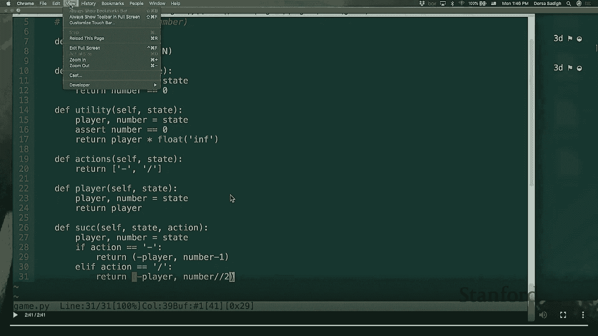

 We're going to play this game in a little bit。 But let's quickly before playing it let's talk about what is the solution to a game。

 Like what are we trying to do in a game。 So if you remember MDPs the solution to a game was a policy。

 So a policy was a function of state。 It would return the action that you need to take in that state。

 So similar to MDPs here we have policies。 But the thing is I have two players so policy should depend on the player too。

 So I have pi of p which is the policy of player p and I can define it similar to before。

 It can be a policy as a function of a state and it can return just an action。

 And this would be a deterministic policy。 Like deterministically if I'm in a state the policy is going to tell me what action to take。

 Okay， we can also define stochastic policies。 So what stochastic policies would do is they would take a state and action and then they would return a number between zero to one which is the probability of taking that action。

 So policy pi of a state and action basically will return the probability of player p taking action A in state S。

 So if you remember the bucket example like maybe half the time I would pick the number on the right and half the time I would pick the number on the left。

 That would be a stochastic policy。 I'm not deterministically telling you what the action is。

 I'm coming up with the stochastic way of telling you like what policy I'm following。 Okay。

 so we have deterministic policies stochastic policies like in our game we could follow either one of them。

 I don't want stochastic policy as opposed to deterministic policy。

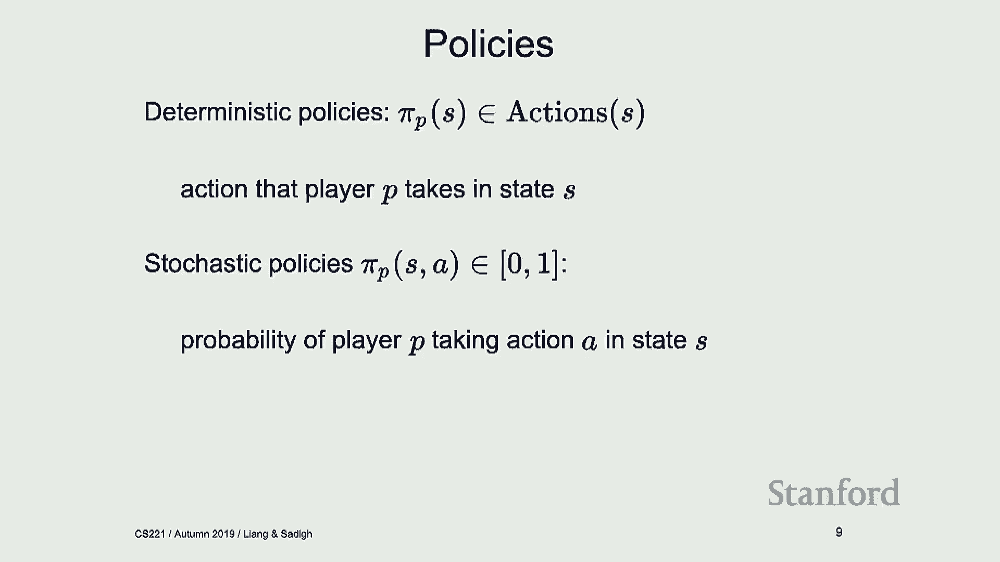

 Can you speak up？ No。 Under what case would you want a stochastic policy versus a deterministic policy？

 So under what case do you want a stochastic policy versus a deterministic policy？ Again。

 we'll cover that a little bit more next time depending on what games you are in。

 Like we have some properties of when stochastic policies are giving us some properties when deterministic policies are giving us some other properties。

 Right now we're just defining them as things that could exist and we could think our opponent is acting deterministically if we know exactly what they're doing。

 Sometimes I have no idea。 Maybe like I've learned it somehow and I have some random nester and then I'm going to use some stochastic policy for how my opponent is going to play against me。

 But we are going to talk about what we get out of stochastic versus deterministic policies a little bit more next time。

 Okay。 All right。 So， okay。 So now let's， okay。 So now that we know that it's a policy that we want to get。

 let's try to， let's try to write up a policy for this game。

 And then I'm going to define a human policy。 And then what I mean by that is this is going to come from a human。

 That means one of you guys or two of you guys。 So。

 so I need two volunteers for this but let's quickly actually write this up。

 So what is a human policy？ It's just going to get the input from the keyboard。

 So what I'm going to type up here is get the action from the keyboard so get the input from the keyboard and that is going to be the action that you are picking。

 Remember the actions are either divide or subtract。 So， subtract one。

 And if action is valid then return that action。 That sounds like a good， good policy。 Okay。

 So that is a human policy。 So now what I want to do is I want to have like this game that actually playing against each other。

 So I want to have policies for my agent。 My agent is plus one。 That's going to be a human policy。

 And for my opponent， I'm going to say my opponent is also a human policy。

 So I just want two humans to play against each other。 Okay。 And the game is。

 let's say we are starting with 15。 So our number that we are starting with is 15。 Okay。 All right。

 So that looks right to me。 So how do we ensure that we are progressing in the game？

 So if you are in an end state， if you are not in an end state， you want to progress。

 So let's print a bunch of things here。 Let's print our state。 Okay。

 Let's get the player out of the state because again the state encodes the player。

 Let's get the policy because we have defined these policies for both of the players so we can get the policy for whoever is playing right now。

 And then the action comes from the policy in that state。

 And then the new state we are going to end up at is just a successor of the current state and action。

 So I'm just progressing。 So this while loop here just figures out what state we are in。

 what policy are we following and where are we going to end up at。 And that's the successor function。

 Okay。 And at the very end I'm just going to print out the utility。

 So that's either plus infinity or minus infinity。 And that sounds good。

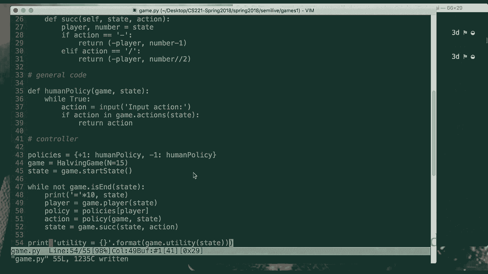

 So， all right。 So let's actually， all right。 So who wants to play this？ Okay。 That's one person。

 You're the agent。 You're the one opponent。 Oh， it's three people。 I think you were first。

 White jerk。 Yeah。 Okay。 So you're minus one。 All right。 So let's play this game。

 Is this large enough？ Yeah。 All right。 So player one， player plus one。 We are at number 15。

 Do you want to？ And decrement。 Okay。 So minus one。 So we are player minus one。 We are at 14。

 What do you want to do？ Divide。 Divide。 Okay。 You have a policy that you already know。

 I don't imagine。 Minus one。 Divide。 Divide。 Divide。 Yeah。 I don't。 Yeah。 So， yeah。

 So you kind of get the point。 Right。 So， wait。 Did I make you lose now？ Sorry。 My bad。

 But you get the utility at the end and then basically you kind of can see this interface。 Actually。

 does any -- oh， I don't know。 We don't have that much。 I'm always going to try another pair。

 But the code is online。 If you want to play with it， just play with it。

 You will have one other version playing with an automated policy later。 All right。 So。 All right。

 So。

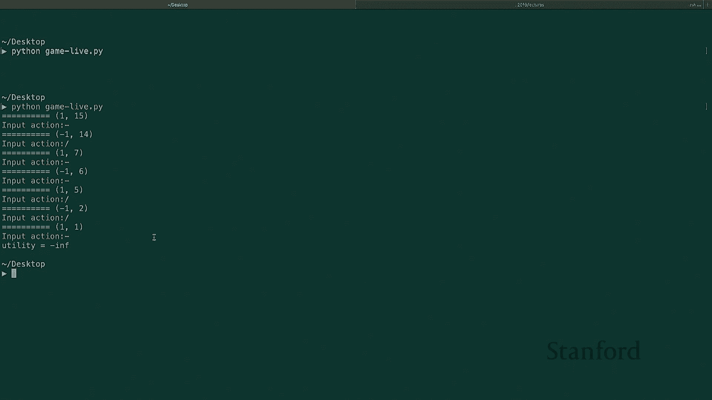

 Okay。 So we are back here。 Let me close this。 All right。

 So we just saw how we can give some human policies and human policies playing against each other。

 And again， the policy， you give it a state of action， it gives you a probability。

 Or you give it a state and it gives you an action。

 So deterministic policy is just an instance of a stochastic policy。 Right。

 So if you have deterministic policy， you can kind of treat it as a stochastic policy where。

 with probability one， you are picking an action。 All right。

 So now we want to talk about how we evaluate a game。

 So let's say that someone comes in and gives me the policy of an agent and an opponent。

 And I just want to know how good that was。 And again， if you remember the MDP lecture。

 we started the policy evaluation。 So in the MDP lecture。

 we started with this idea of someone gives me the policy。 We just want to evaluate how good that is。

 And we are kind of doing an analogous to exactly that。

 Someone comes in and tells me that my agent is going to pick bucket A。

 That is what my agent is going to just do all the time。 And someone comes in and says， well。

 my opponent is going to access stochastically and with， probability one half。

 give me one of those numbers。 Okay。 So these are the two policies that we are going to have。

 So the question is how good is this？ So going back to the tree， the game tree。

 what is really happening is my agent is going， to pick this one， right？

 Because it's going to pick bucket A。 So with probability one， we are going to end up here。

 With probability zero， we end up in any of these other buckets。

 And then my opponent is going to stochastically pick either minus 50 or 50。 Okay。

 So if my opponent is picking minus 50 or 50， then the value of this node is just the。

 expectation of that， right？ It's just going to be zero。 So 50% of the times it's minus 50。

 50% of the times it's 50， then the value of this node is zero。 And then if my agent is picking A。

 then the value of this node is going to be zero。 Okay。

 So you kind of can see how the value is going to propagate up from the utility。

 So we have the utilities at the leaf nodes， but we could actually compute a value for。

 each one of these nodes if I know what the policies are。 If I know who is following what policy。

 I can actually compute these values and， go up the tree。 Okay。 So in this case。

 I can say a value of the start state if I'm evaluating this。

 particular policy is going to be equal to zero。 Okay。 All right。 So someone gave me the policy。

 I evaluated the value of the start state。 So in general， like as I was just saying earlier。

 this is similar to policy evaluation。 This is similar to the case that someone gives me the policies and。

 I'll evaluate how good the situation is。 And you can write a recurrence to actually compute that。

 So I'm going to write the recurrence here maybe。 So you want to compute this value and this value is evaluating a given policy and。

 it's a function of state。 But what is that going to be equal to？

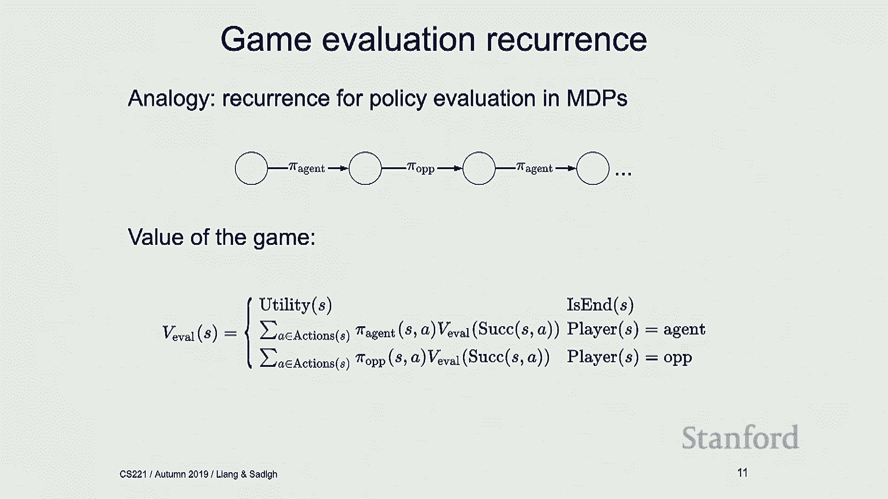

 It's going to be equal to utility of S if you're in an end state。

 So it's utility of S if we are already in an end state。 Otherwise。

 I have access to the policy of my opponent and policy of my agent。

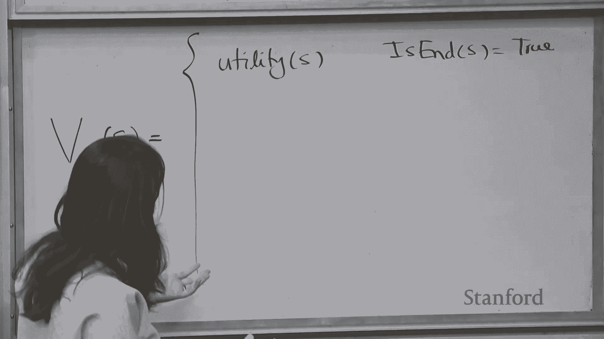

 So I can just do an expected sum over all possible actions of S。

 Let's say that if player S is agent， I'm looking at policy of agent。

 Say it's a CASTI policy times V of eval of the successor state。 And this is if my player is agent。

 So if is player， I'm just going to write is player of S is equal to agent。

 What happens if my player is opponent？ I'm going to do the same thing。 I'm just evaluating。

 I have access to the policy of the opponent。 I'm again just doing going to do a sum over all possible actions。

 Of a policy of the opponent， this is given to me， someone gave this to me。

 Of state in action times value of the successor state。

 And this is the case that my player is the opponent。

 So this is the recurrence that we're going to just write。 And it's kind of intuitive。 Again。

 we have seen this in three search， like you start with the utilities at the leaf nodes。

 and you just push that back up based on what your policies are。

 And what your policies are telling you， like which side， like which edges of the tree you're taking。

 But what probability？ Okay， does this make sense？ All right。 Okay， so that was evaluating the game。

 But what if now I want to solve what the agent should do？ Like I'm the agent。 I care about doing。

 like figuring out what my pie agent is。 I don't know what my pie agent is。

 I need to figure out what sort of policy I should be following。

 And that kind of takes us to this idea of ExpectiMax。

 which is basically the idea of if I'm in a scenario， where I know what my opponent does。

 so I'm still assuming I know what my opponent does。

 What would be the best thing that I should be doing as an agent？ Okay。

 what would be the best thing I should do？ Like if you knew， like in the bucket example。

 I was trying， I was acting probabilistically， what would you do？

 Maybe the action that gives you the maximum value。

 So you pick the action that gives you the maximum value because you're trying to maximize your own value。

 So then if that is the case， then this recurrence needs to change， right？ This recurrence。

 the way it changes is I'm going to call this new value。

 So I'm going to just do everything on top of this。 I'm not rewriting it。

 I'm going to call this value， value of ExpectiMax policy。 Okay， so this value。

 I'm not evaluating anything anymore。 I want to actually figure out what my agent should do。

 so I'm going to call it ExpectiMax。 And if I know a policy of my opponent。

 I'm not changing anything here because I know the policy of my opponent。

 I'm just going to compute this， but now I want to figure out what the agent should do and what should the agent do。

 Well， the agent should do the thing that maximizes this value。

 So I'm going to erase this sum with the policy because I don't have that policy。

 And the agent should do the thing that maximizes this value over all possible actions。

 So this should remind you of value iteration。 So if you remember。

 value iteration in the MDP lecture， like we're evaluating things， right？

 We were trying to maximize our value。 And that's kind of like analogous to what we are doing here。

 We're trying to figure out what should be the policy that the agent should take that maximizes the value。

 under the scenario that I know what the opponent does。

 So I still kind of know what the opponent does。 So going back to this example。

 so let's say I know my opponent is acting stochastically。 What should I do？

 So if my opponent is acting stochastically with probability one-half。

 then the values of each one of these buckets are going to be zero， two and five。

 And I'm trying to maximize my own value， so I'm going to pick the one that gives me five。

 And that's shown with this upward triangle I'm trying to maximize。

 So I'm going to pick bucket C because I'm trying to maximize under this knowledge that the other agent is stochastically acting。

 And then we're calling this the value of expecting max policy and the value of expecting max policy from the start state is equal to five。

 Because that's the value that I think I'm going to get。 Question back there。 [ Inaudible ]， Yes。

 this is assuming I know my opponent's policy。 And then I'm maximizing my own value knowing that my opponent is following this policy and what the opponent would do in expectation。

 Okay。 All right， so this is the recurrence that we would get。

 We would just update the recurrence so if the agent is playing then we maximize the value of expecting max。

 Okay。 All right。 So， okay， in general I don't know the policy of my opponent， right？

 So in general like I know what gives me this pile up。 So if that is the case then what should we do？

 So one thing that we could do is we could assume worst case。

 So one thing that we could do is we could be like oh the opponent is trying to get me in and they're going to play the worst case scenario and they're trying to minimize my value。

 And that's a fair thing to do。 And we're going to talk about if that is always the best thing we can do or not a little bit later in the lecture。

 But for now like we could assume that if I know nothing about my opponent I can just assume my opponent is acting adversarially against me。

 So and that kind of introduces this idea of mini max as opposed to expecting max that we just talked about。

 So what would mini max？ So in the case of a mini max policy what I'm assuming is I am this agent trying to maximize my own value。

 And then I'm assuming my opponent is acting adversarially so my opponent is really trying to minimize my value。

 And then what that means is from this bucket I'm going to get minus 50 from this one I'm going to get one。

 From this one I'm going to get minus five。 And under that assumption well I'm going to pick the second bucket because that gives me the highest value。

 So that is a mini max policy。 So how would I change my recurrence if I were to play mini max？

 Oh I'm going to call it V of， let's look at the V of mini max of a state。

 Well the recurrence is going to be over mini max， V of mini max so let me change that。

 If the agent is playing the agent is still trying to maximize the value so that is all good。

 What if the opponent is playing？ The opponent is going to minimize right so I don't have access to pile up。

 So what I'm going to do is I'm going to remove this and say well the opponent is going to take an action that minimizes the value of the successor of SNA。

 And this is how you would compute the value of a mini max policy。 So that is a good question。

 So what happens if the adversarial agent is not always adversarial？

 So in that case you have another stochastic policy that kind of defines what the opponent is doing。

 And if you have access to that you can do something similar to expect the max。

 If you don't have access to that maybe you would want to act worst case and assume that they are always trying to minimize。

 But that's some prior knowledge that allows you to act better or maybe evaluate the value better for every state。

 So we'll talk about evaluation functions a little bit in the lecture and maybe that can inform your evaluation function。

 So here the value of minimax from the start state is going to be one。 Does everyone see that？

 So I'm assuming my opponent is acting adversarially so we have minus 51 and minus 5。

 If I'm maximizing then the best thing I can get is one。 And that's how we compute V of minimax。

 And then there is really no analogy to this in MDP setting because in MDP setting we don't really have this game。

 We don't really have this opponent that's playing against us。

 And what happens is that this is the recurrence that we are going to get which is what we already have on the board。

 Right？ Okay， so what would the policy be？ So the policy is just going to be the argmax of this V of minimax。

 So if you want to know what the policy of your agent should be that's pi max。

 It's the argmax of V of minimax over successor of that state。

 And if you want to know what's the policy of your opponent that state S should be。

 well that's argmin of V of minimax which is intuitive。

 So then that way you can actually figure out what the action should be。 What the policy。

 what the actual action should be。 Okay？ All right， so let's go back to this example。

 this half-in-game。 So what we want to do is we want to actually code up what a minimax policy would do in this setting。

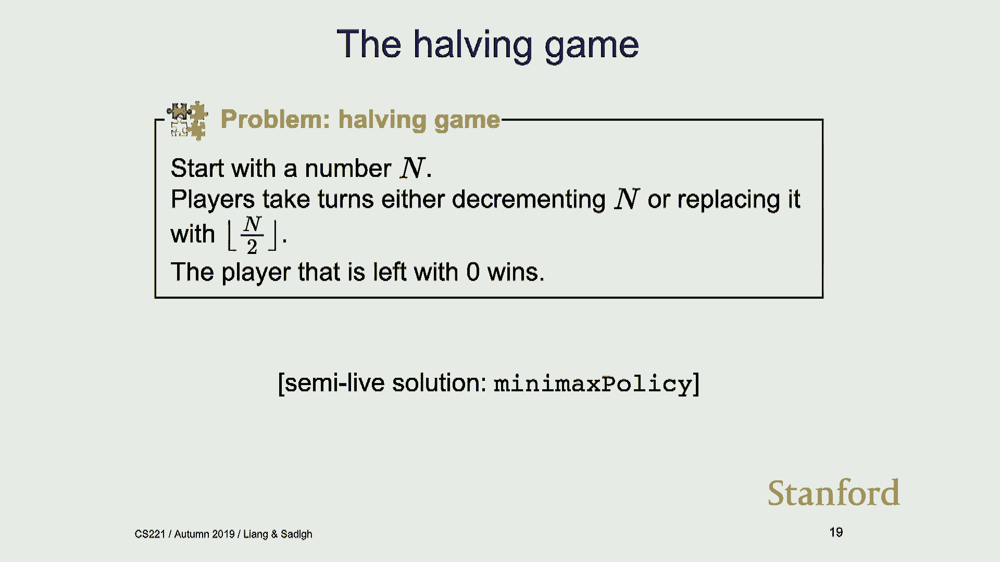

 And maybe we can play with a minimax policy after that。 Okay。 So what would a minimax policy do？

 So it's a policy so it's going to be a function of state。 So let's give it state。

 And you're going to just write this recursion that we have on the board。

 So we're recursing over the state。 If you're in an end state then what are we returning？

 Just the utility。 Okay？ So we're returning the utility of that state and there's no actions。

 And then if you're not in an end state then you're either maximizing or minimizing over a set of choices。

 So let's actually like create those choices so that you can just call max and min on them。

 So the choices， we're going to iterate over all actions that we have。

 And what is that going to be exactly？ That's going to be doing a recursion over the successor state。

 So we're going to recurse over the successor state。 So recurse over a game。

successor of state in action。 And I'm going to return the action here too because I just want to get the policy later。

 And the successor， this recurse function returns a state in action so I just want to get the state from the first one。

 And the action for the second one。 Okay， so if player is plus one that's the agent。

 the agent should maximize the choices。 And if player is minus one then that's the opponent。

 The opponent should try to minimize over these choices。

 And that's pretty much like this recursion that we have on the board。

 And that's our recurse function。 Okay。 Okay， so we're going to recurse over our state and that gives us a value and it also gives us an action。

 So let's just print things out so we can refer to them。

 So min max gives us an action and it tells us this is the value that you can get。 Alright。

 And then it's a policy so let's just return the action。 Okay。

 so now what I'm going to do is I'm going to say plus one agent is still a human policy and then it's playing against a minimax policy。

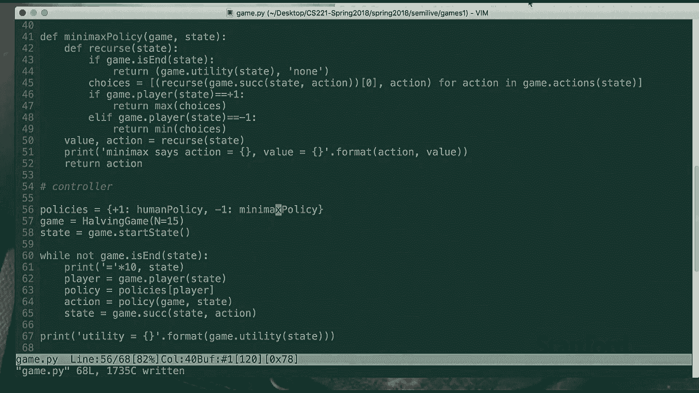

 So， alright， so let's who wants to play with this？

 It's a little scarier to play with the minimax policy。 Okay。 Alright， so let's do this。 Python。

 Alright， so you are the agent。 So you're player one。 You're starting from 15。

 What do you want to do？ Happen。 Okay， so you just lost the game。 So why do I know you lost the game？

 Well， now it's player minus one playing。 So we're at seven and minimax policy took action minus and says action minus and it also takes action minus so we are at six。

 And then the value of the game is minus infinity。 So you're playing with the minimax policy。

 You're already getting minus infinity。 So you just lost the game。 Anyone want to try this again？

 You want to try again？ So you can win。 So you can win。 So value is infinity right now。

 And then the minimax policy also did a minus so we are at 13 right now。 So you're at 13。

 You just lost the game again。 So minus infinity is actually you need to like alternate between them。

 I think that is the best part of policy。

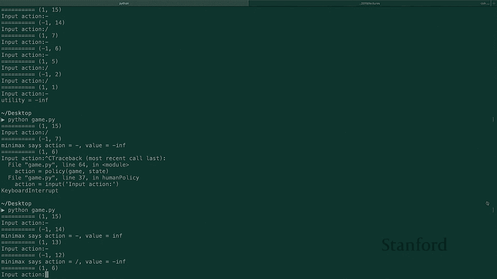

 But play with this kind of get a sense of how this runs。

 The code is online so just feel free to play with it and figure out what is the best policy to use。

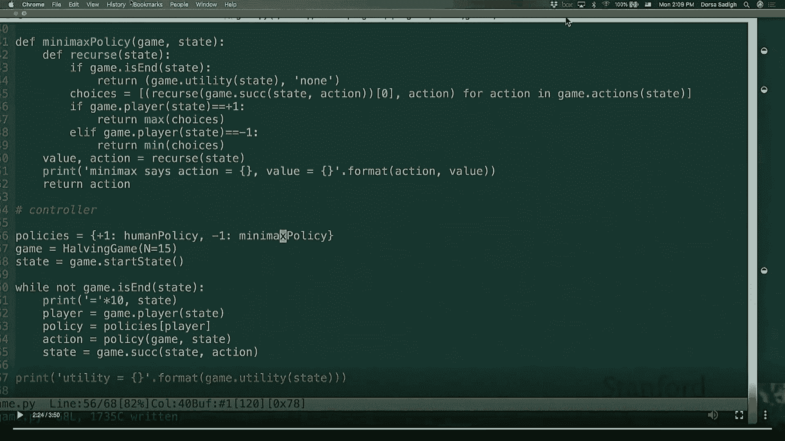

 All right。 Okay， so that was the minimax policy。 And then this is kind of the recurrence that we get for a minimax policy。

 Now what I want to do is I want to spend a little bit of time talking about some properties of this minimax policy。

 And then we've talked about two types of policies so far。

 We've talked about expecting max which is basically saying I as an agent， I'm trying to maximize。

 but I know what my opponent is going to do。 So I'm going to assume my opponent does whatever and I'm going to maximize based on that。

 So for example， I am following and I'm going to refer that to as pie of expecting max which means that the agent。

 everything in red is for the agent。 Everything in blue is for the opponent。

 So I'm going to say the agent is following this policy which says I'm going to maximize assuming my opponent is doing whatever。

 And here I'm calling pie seven as like some opponent policy。

 It could be like anything but pie seven。 So let's say that opponent is playing pie seven。

 I'm going to maximize based on that and the value we just talked about is the value of expecting max。

 The other value we just talked about is the value of minimax which says I am the agent。

 I'm going to maximize assuming the opponent is going to minimize and then the opponent actually is going to minimize and is going to follow pie min。

 So these are the two values we have talked about so far。

 I want to talk a little bit about the properties of this but before that let me。

 Is there a way to kind of like mix it together？ We would say like just heighten like the probability of piping the minimum for like in expect max。

 The probability distribution over like the actions right so then like why don't we just take the action that like。

 minimize this whatever our reward is and give it like higher weight。 And expect max。 Um。

 I didn't fully follow what policy you're trying to actually call。

 Is it are you coming up with a new policy that you're saying would be a better policy to。

 To be between like expecting max and minimax in something so this might。

 This this table might try address that because it's it's considering four different cases。

 It's actually not considering the two cases so this might actually refer to what you're what you're proposing。

 So let's actually go through this first and then maybe like if it doesn't answer that so。

 All right so so I want to talk about the setting so this table。

 It's actually not that confusing but it can get confusing so do pay attention to this part。 Um。

 All right so。 Do I want to maybe maybe I'll write over there so I'm going to use。 Red for agent。

 Where's my blue on the floor。 Left my right。 Okay all right。 Okay and then I'm going to use。

 I'm going to use blue for the opponent policy。 So so then for agent we're going to have。 Pi max。

 Right agent could play pie max what does that mean again I'm going to maximize assuming you're going to minimize。

 An agent could play pie expecting max。 Maybe with policy seven I'm going to put seven here which means I'm going to maximize assuming you're going to follow this pie seven。

 So this is a thing that the agent can do。 Okay。 And then there are things that my opponent can do。

 I'm going to write that here。 My opponent can actually follow pie min which is I'm just going to minimize。

 Or my opponent could follow some other policy pie seven。

 Let's say pie seven in the bucket example right now is just acting as stochastically so half the time pick one number half the time pick another number。

 Okay so so that is what we have。 So I'm going to draw my actually my tree so we can go over examples of that too。

 So this was the bucket example。 We started at minus 50 and 50 in bucket A。

 One and three in bucket B。 Minus five and 15 in bucket C。

 Okay so this was my bucket example I'm actually going to talk about that。

 So all right so I'm going to talk about a bunch of properties of me。 V of pie max and pie min。

 Which is what we have been referring to as the mini max value。

 Okay so I want to talk about this a little bit。 Okay so the first property that we can have is that V of pie max and pie min。

 It is actually let me go back to the next slide。 It is going to be an upper bound of any other value of any other policy。

 Pie of I'm going to just write pie of expecting max for any other policy for the agent。

 Assuming that my opponent is playing as a minimizer。 Okay so so what I'm writing。

 Is the value is going to be an upper bound of any other value if my agent decides to do anything else。

 Under the assumption that my opponent is a minimizer。 So my opponent is really trying to get me。

 If my opponent is really trying to get me then the best thing I can do is to maximize。

 Okay so that's kind of intuitive。 That's an upper bound。 Let's look at that example。

 So what is pie of V of pie max and pie min。 So we just talked about that。

 So if this guy is a minimizer we're going to get minus 50 here。 One here， minus five here。

 If this guy is a maximizer what is the value I'm going to get。

 Get one right I'm going to go down here and then I'm going to get one。

 So V of pie max and pie min is just equal to one。 That is this value that is just equal to one。

 Okay what is this saying is that this is going to be greater than maybe the setting where。

 my opponent， sorry my agent is following the expected max and my opponent is still doing， pie min。

 So what would this correspond to？ What would this value correspond to？

 So this is a value which says well I'm going to take an action assuming my opponent is。

 acting as stochastically。 If my opponent is acting stochastically I'm going to get zero here。

 I'm going to get two here。 I'm going to get five here。

 If I'm assuming that and I'm trying to maximize my own， my own value which route to， I go。

 I'm going to go with this route。 But it turns out that my opponent was not doing that。

 My opponent was actually a minimizer。 So if my opponent was actually a minimizer and I went this route。

 my opponent is going， to give me minus five。 So the value I'm going to end up getting is minus five。

 So this is equal to minus five。 This is equal to minus five。

 So far I've shown that this guy is greater than this guy。 So that's the first property。

 First property is if my opponent is terrible and is trying to get me best thing I can do。

 is to maximize。 I shouldn't do anything else。 The second property is that this v of pi max。

 again the same v of pi max and pi min is now， lower bound of a setting where your agent is maximizing assuming your opponent is minimizing。

 But your opponent was actually not minimizing。 Your opponent was following pi seven。

 So what this says is if you're trying to maximize assuming your agent， your opponent。

 is always minimizing， then you're doing， you'll come up with a lower bound and if your。

 opponent ends up doing something else you can always just do better than this lower bound。

 So what is this v equal to？ Well we just showed that is that is one， that is this value。

 What does this correspond to？ So this is value of pi max。

 which is I'm going to assume you're trying to get me。

 If I'm going to assume you're trying to get me， I'm going to go down this route because。

 that is the thing that gives me the highest value。 But you're not trying to get me。

 you're following pi seven。 So if you're following pi seven。

 you're just going to give me half the time one， half the。

 time three and that actually corresponds to two and I'm going to get value two instead。

 of value one。 So this is actually equal to two in this case。

 And this corresponds to this value in the table， which is again the agent is following a。

 maximizer assuming the opponent is a minimizer， opponent was not a minimizer， opponent was。

 just following pi seven。 And this is just equal to two。 Okay？ So far。

 the things I've shown are actually very intuitive。 They seem a little complicated。

 but they're very intuitive。 What I've shown is that this value of minimax， it's an upper bound。

 If you're assuming our opponent is a terrible opponent， like it's going to be an upper。

 bound because the best thing I can do is maximize。

 I've also shown it's a lower bound if my opponent is not as bad。 So that's what I've shown so far。

 Question？ >> So here the opponent's policy is completely into the agent。 >> Yeah， so here。

 because the agent actually doesn't see the opponent or the opponent does， right？

 Even in the expect the max case， it thinks the opponent is going to follow pi seven， but。

 maybe the opponent follows pi seven， maybe not， right？

 So like when we talk about expect the max and minimax， it's always the case that the。

 opponent doesn't actually see what the opponent does。 But the opponent can think。

 the agent can think what the opponent does。 And I'm going to talk about one more property。

 And this last property basically says， if you know something， actually it goes back。

 to your question， if you know something about your opponent， right？

 If you know something about your opponent， then you shouldn't do the minimax policy。

 You should actually do the thing that has some knowledge of what your opponent does。

 So that basically says this v pi max and some pi of opponent。 You know something about pi opponent。

 You know that opponent is playing pi seven。 That is going to be less than or equal to the case where you are following v pi of。

 expect the max of seven。 And the opponent actually follows pi seven。 Okay。

 so what does this last inequality saying？ Well， it is saying that the case where you're trying to maximize and you think your opponent。

 is minimizing， but your opponent is actually not minimizing。

 The value of that is going to be less than the case where you're maximizing under some。

 knowledge of your opponent's policy and your opponent's policy actually ended up doing that。 Okay。

 so the first term is always the agent。 The second term is always the opponent， right？

 So this value we have already computed that。 That's equal to two。 This value。

 what is this value saying？ It is saying you are going to maximize。

 assuming your opponent is the cast。 So if I'm assuming my opponent is the cast。

 then I'm assuming that this is zero。 This is two。 This is five， right？ I'm trying to maximize。

 So which one am I going to go？ I should go this route because that gives me five。

 So this is the agent thinking the opponent is going to be a stochastic。

 Thinking is going to get five。 And it gets here and the opponent actually ends up following pi seven。

 which is a stochastic thing。 So we are actually going to get five。 So this guy is equal to five。

 And this is the last inequality that we have， which is we have pi expecting max of seven。

 and pi of seven is greater than or equal to v of pi max and pi seven。

 We just showed this is equal to five for this example。 Yeah？ All right。 Question？ [ Inaudible ]。

 So if you know something about the stochasticity that's an all right。 Like here。

 I knew that the opponent was following the stochastic policy of one half one half。

 I might have known that the opponent is following a deterministic policy and always is picking the left one。

 So I could have like followed like a same expecting max policy under that knowledge。

 It could be anything else。 But the whole idea of expecting max is I have some knowledge of what the policy of the opponent is。

 It could be a stochastic policy。 It could be a deterministic policy。 Under that。

 how would I maximize？ Does that mean that like transitively that the bottom right is greater than the bottom left always？

 Yeah。 So the question is do we have？ Yeah。 So we have like this inequality。 So transitively。

 this guy is always greater than this guy。 And that kind of makes sense。 Like you're saying。

 like if you're following expecting max， yeah， so this last one kind of makes sense。

 It's basically saying if you're following expecting max and you know something about your opponent。

 and your opponent actually ended up doing that， well。

 your value should be greater than pretty much anything。

 Because you knew something about the opponent， you played knowing that， having that knowledge。 Yes？

 Yeah。 So you know something about the opponent？ Is that just knowing that it acts stochastic or you know what it's going to take？

 So it's knowing what they're going to take， right？ Like here I knew what the opponent。

 I knew that half the time they're going to take this one。

 half the time they were going to take the other one。 And then I used that knowledge， right？ Yeah。

 So you know exactly what the next thing is。 Is the expect the max policy given that your opponent is following your master policy？

 Given that， given that your opponent is following pi min， is it to do an axi-mizing？

 So the expect the max policy is this policy when here we have a sum。

 The expect the max policy assumes your opponent is following pi opponent。

 and assumes that it has access to pi opponent， so it ends up doing this sum over here。 Yeah。

 so if pi opponent is pi min， oh， if pi， oh， actually we're saying。

 So you're saying if pi opponent is actually pi min。

 then do they end up being equal to each other in some sense？ Yeah。 Yeah， I guess so。 Yeah。

 so if you know that your， it becomes minimax， right？ If you know your opponent is following， as。

 as I can answer minimizer， we just like call that minimax。 All right。

 so I'm going to move ahead a little bit。 All right， so。

 and then this is like what we have already talked about。 Okay。

 so a few other things about modifying this game。 So we have， okay。

 so we have talked about this game。 We have talked about properties of this game。

 There's a simple modification one can do which is bring nature in。

 So there were the question earlier， which was like， is there any chance here？ And then yeah。

 you can like actually bring chance inside here。 So。

 so let's say that you have the same game as before， you're choosing one of the three bins。

 And then after choosing one of the three bins， you can flip a coin。 And if head scums。

 then you can move one bin to the left with wrap around。

 So what this means is 50% of the time tail scums， you're not changing anything。

 You have this set up 50% of the time you get heads。 And then in those settings。

 you're just going to pick like a neighboring bin as opposed to your agenda bin。 Okay， so， so there。

 we're adding this notion of chance here and， and it's kind of acting as a new player。 So。

 so it's not actually the making things that much more complicated。 So。

 so what happens is in some sense we have a policy of， of coin， which is nature here， right？

 And policy of coin is half the time I get zero， I don't change anything。

 Half the time I just get the neighboring bin as opposed to my main bin。

 And then I get this new tree where， where I have like a whole new level for what。

 where the chance plays。 So we have， now we have max notes， we have min notes。

 We also have these chance notes here。 And the chance notes again。

 like sometimes they take me to the original bucket， and then 50% of the times they。

 they take me to a neighboring bucket。 Okay， but， but the whole story like stays the same。

 like nothing changes。 You can， you can still compute value functions。

 you can still push the value functions further up。 It's the same sort of recurrence。

 Nothing fundamental changes。 Just， it just feels like there are three things playing now。 Okay。

 So then this is actually called expect the mini max。 So a value of expect the mini max here。

 in this case， for example， is minus two。 Because there is a min note for the opponent。

 there's an expectation note for what nature does， and then there is a max note for what the agent should do。

 That's why it's called expect the mini max。 And then you can actually compute the same value。

 So the way the game is working out， so there's like two players， I pick a bin， then you flip a coin。

 and then shift it left or not shift it left。 And then I get to pick the number。 Yes。 Well。

 you got you， the opponent。 The opponent is。 Yeah， yeah， yeah。 So。

 so there's still two players and then the third coin thing。 Yes。 Agent。 Alright， so， so yeah。

 so the way to formalize this is you have players， so you have an agent， you have an opponent。

 now you have coin。 And then the recurrence changes a little bit， I guess。 So。

 so what happens is the recurrence that we have had for mini max was just the max and min。

 and it would just return us the utility if you're in an end function， and in an end state。 Now。

 if it is the coin's term， we just do a sum over an expected sum of the policy of the coin。

 which is what we would do in expecting mini max。 But we just have like a new term for when coin plays。

 So， so everything here kind of follows naturally in terms of what we were expecting。 Okay。 Alright。

 so the summary so far is what we've been talking about max notes。

 We've been talking about chance notes， like what if we have a coin there。

 and then also these min notes。 And， and basically we've been talking about composing these sort of notes together and creating like a mini max game or。

 or an expecting max game。 And then value function is you just do the usual recurrence that we have been doing in this class from the expected utility to。

 from the utility to come up with this expected utility value for all the notes that we have。 So。

 there might be other other scenarios that you might want to think about。 For example。

 for your projects or like in general， there are other variations of games that you might want to think about。

 So， what if like the case that you're playing with multiple opponents？

 Like so far we've talked about like a two player setting where we have one opponent and one agent。

 but what if you have multiple opponents？ Like you can think about how the tree changes in those settings。

 Or for example， like the taking turns aspects of it， like is it some。

 if the game is simultaneous versus your turn taking。

 Or like you can imagine settings where you have some actions that allow you to have an extra turn。

 So， so you have two turns and then the next person takes turn。 So。

 you should think about some of these， some of them come up in the homework。 So。

 think about variations of games in general。 They're kind of fun。 So。

 to talk a little bit about the computation aspects of this。 So， this is pretty bad。

 I should talk about a game tree， which is similar to tree search。 So。

 we are taking its research approach。 If you remember tree search， like the algorithms we were using。

 like if you have branching factor of B and some depth of D。

 then in terms of time it's exponential in order of B to the 2D in this case。

 I'm using D for the number of， how do I say this？ So， so it's 2D because the play。

 the agent plays and then the opponent plays。 So， that's how I'm counting it。 So， every， every 2D。

 like we have 2D plays but D， depth。 Does that make sense？ All right。 And then in terms of space。

 it's order of D。 In terms of time， it's exponential。 That's pretty bad。 So。

 for a game of like chess， for example， the branching factor is around 35。 Depth is around 50。 So。

 if you compute B to the 2D， then it goes in the order of like number of atoms and universe。

 That's not doable。 We should， we are not able to use any of these methods。 So。

 how do we make things faster？ So， we should be talking about how to make things faster。 So。

 there are two approaches that we are talking about in this class to make things faster。

 The first approach is using an evaluation function。 So， using an evaluation function。

 what we can do is we can use domain specific knowledge about the game。

 To define almost like features about the game in order to approximate like the value function at a particular state。

 So， I'm going to talk about that a little bit。 And then another approach is this approach。

 which is kind of simple and kind of nice， which is called alpha beta pruning。

 And the alpha beta pruning approach basically gets rid of part of the tree if it realizes you don't need to go down that tree。

 That part， that part of the subtree。 So， it's a pruning approach that doesn't explore all of the tree。

 only explores parts of the tree。 So， we're going to talk about both of them。 All right。

 so evaluation functions。 So， let's talk about that。 Okay。

 so the depth can be really like the breadth and depth of the game can be really large。

 That's not that great。 So， one approach to go about solving the problem is to kind of limit the depth。

 So， instead of like exploring everything in the tree。

 just limit the depth and get to that particular depth。 And then after that。

 when you get to that depth， just call an evaluation function。 So。

 if you were to like search the full tree， this was the recursion that we had。

 like we have talked about。 This was like if you're doing a minimax approach。

 this is the recursion that you got to do。 You got over all the states and actions and go over all of the tree。

 But if you're using a limited depth tree search approach。

 what you can do is you can basically have this depth D。 And then。

 decrement D every time you go over an agent and opponent， like every time you go down the tree。

 And at some points， D just becomes zero。 So， you get to some particular depth of the tree and when D becomes zero。

 you're going to call an evaluation function on the state study。 Okay？

 And this evaluation function is almost of the same form of like future costs when we were talking about search problems。

 Right？ So， if you knew exactly what it was that then you were done。

 but you don't know exactly what it is， because if you knew that you were to solve like the whole tree search problem。

 but in general you can have some sort of weak estimate of what the future cost would be。 So， yeah。

 So， an evaluation function， eval of S is a weak estimate of V minimax of S。 So。

 it's a weak estimate of your value function。 Okay？ All right。 So。

 an analogy of that is future cost in search problems。 So。

 how do we come up with an evaluation function？ So。

 we do it in a similar manner to head with it in the learning lecture where we're coming up with features and weights for those features。

 Right？ So， if I'm playing chess and like the way we play it， right？

 Like we think about a set of actions that we can take and where we end up at and based on where we end up at。

 then we kind of evaluate how good that board is。 Right？

 We have some notions of features and how good that board would be from that point on。

 and that allows us to evaluate what action to pick。 Right？

 Like when we play chess that's kind of what we do。

 We pick a couple of actions and we see how the board would look like after taking them。

 And evaluation function kind of does the same thing。

 It tries to figure out what are the things that we should care about in a specific game in this case in chess。

 and then tries to like give values to them。 So， it might be things like the number of pieces we have or mobility of those pieces or if our king is safe or if we have central control or not。

 So， for example， for the pieces what we can do is we can look at the difference between the number of pieces we have。

 between what we have and what our opponent has。 So。

 number of kings that I have versus number of opponents that I have， well。

 that seems really important， because if I don't have a king and an opponent has a king then I have lost a game。

 So， you might put like a really large weight for that and you might care about like differences between the number of pawns or number of queens and other types of pieces that you have on the board。

 So， that allows you to care about， to think about how good the board is or number of legal moves that you have and number of legal moves that your opponent has。

 And then that gives you some notion of like mobility of that state。 Alright， so。

 so summary so far is yeah， so this is pretty bad。 Order of B to the 2D is pretty bad。

 And then the evaluation function basically tries to estimate this V minimax using some domain knowledge。

 And unlike KSTOR we actually don't have like any guarantees in terms of like error from these sort of approximations。

 So， but it's an approximation。 People use it。 It's pretty good。

 We'll talk about it a little bit later next time when we think about like what sort of weights we should pick for each one of these features。

 So， you should think learning when you think about what are the weights we're using。 Alright， so。

 okay， so now I want to spend a bit of time on alpha beta pruning because this is， yeah， important。

 Okay， so alpha beta pruning。 Yeah， the concept of alpha beta pruning is also pretty simple。

 but I think it's one of those things that was， that's kind of that table。

 You should pay attention to kind of get what it is happening。 Alright， so。

 so let's say that you want to choose between some bucket A and bucket B。 Okay。

 and you want to choose the maximum value。 And then you know that the values of A fall into like three to five and the values of B fall into five to ten。

 So， they don't really have like any intersections between each other。 So， in that case。

 you don't really care about your， if you're picking a maximum， right。

 you shouldn't care about your bucket A or rest of your bucket A。 Right。

 because you already know that you're above five， you're happy with B， you shouldn't even look at A。

 So， so kind of the underlying concept of， of， um， alpha beta pruning is maintaining a lower bound and upper bound on values。

 And then if the intervals don't overlap， then basically dropping part of the subtree that you don't need to work on。

 Because， because there is， there is no overlap between them。 Okay。 So， here's an example。 So。

 let's say we have these back snopes and min notes and we are going to go down and see three。

 And then this is a min note， so， so we're going to get three here。 So。

 when I get to the max note here， right， I， what I。

 what I know is that the max note is going to get three or higher， right？ That， that， that's one。

 one thing that I would know without even looking at anything on the， on the other side。

 That even looking at the subtree on the left， I already know that this max note should get three or higher。

 Right？ Does everyone agree with that？ Okay。 So， so then when I go down to the。

 this min note and I see two here， right？ I know this is a min note。

 It's going to get a value that's less than or equal to two。

 Does not have any interval with greater than or equal to three。 So。

 I should not worry about that subtree。 Does everyone see that？ So， maybe like。

 let me draw that here。 So， that's kind of like the whole concept of what happens in alpha later pruning。

 So， I have this max note， this was three， this was what？ Five， I found that this guy is three。

 this is a max note。 Whatever it gets， it， it's going to be greater than or equal to three。

 Because it's already seen three， it's not going to get any value less than three。 Right？ So。

 so we know whatever value we're going to get at this max note is going to be three or higher。 Okay？

 So， then I'm going to go down here and then I see two here， right？ It's a min note。

 Whatever it gets is going to be less than or equal to two。 So。

 less than or equal to two is the value that's going to get popped up here。

 I already know less than or equal to two has no interval with three or greater。 So。

 I don't even need to worry about this。 Like， I can completely ignore this side of the tree。

 I don't need to know whatever is happening down here。 I don't even need to look at that。 Okay？

 Because， because I like this value should be greater than or less than or equal to eight。 Sorry。

 Okay。 So， it's a minimum， it's a minimum note， right？ So。

 it's going to be less than or equal to eight。 Yeah。 It's a min note。 So， I saw two。

 if I see ten here or twenty here， like I'm not going to pick that。 Like， it's two or a large。

 All right。 So， yeah。 So， if it is ten or a hundred or whatever sub-treat is there。

 like we are not going to look at that。 So， that is kind of the whole concept。 All right。 So， okay。

 Let me actually go to this slide。 I think this would be。 So。

 the key idea of alphabetical pruning is we are， like the optimal path is going to get。

 to some leaf note that has some utility。 And that utility is the thing that is going to be pushed up。

 Right？ Like， and the interesting thing is if you pick the optimal path， the value of the note on。

 that optimal path are all going to be equal to each other。 Right？ Like。

 it's basically the utility that you're going to get pushed up all the way to the top。 So。

 because of that， like we need to have like these， these， like we can't have settings。

 where we don't have any intersections between the intervals because we know if this were。

 to be the optimal path， the value on this note should have been the same as the value at， this note。

 the same as the value at this note and so on。 So， if they don't have any intervals。

 then no way that they would have the same value， and no way for that path to be the optimal path。

 Okay？ So， that's kind of the reason that it works。 Because the optimal path。

 you're going to have the same value throughout。 Okay？ So， how do we actually do this？ So。

 the way we do this is we're going to keep a lower bound on max notes。 So， I'm going to call that AS。

 Let me put this up here。

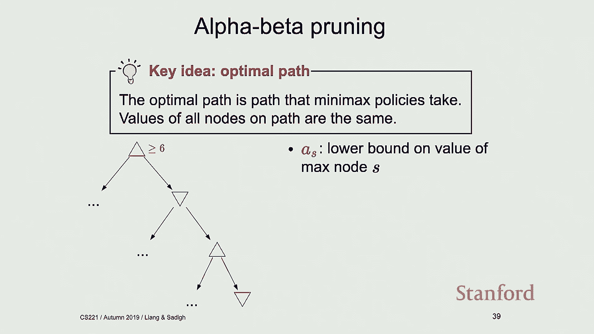

 So， we're going to have AS， which is a lower bound on max notes。 So。

 we're going to keep track of that。 We're also going to keep track of BS。

 which is an upper bound on min notes。 Okay？ And then， if they don't have any intervals。

 we just drop that sub tree。 If they have intervals， we just keep updating AS and BS。 Okay？ So。

 here's an example。 So， let's say that we start with this top note。 Somehow。

 we have found out that this top note should be greater than or equal to 6。

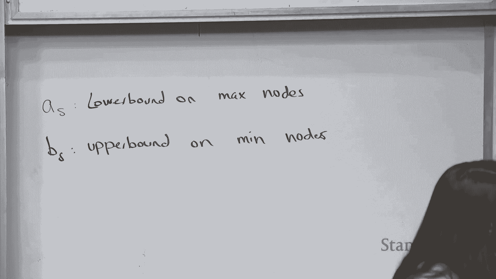

 Right？ Somehow， I know it should be greater than or equal to 6。 Okay？ So， that is my AS value。 So。

 my AS is equal to 6。 It is going to be a lower bound on my max note。 I know that the value。

 the optimal value is going to be something greater than or equal to 6。 Okay？ Then， somehow。

 we get to this min note and then we realize that this min note should be less than or equal to 8。

 So， we are here。 Let's say 8 is here。 We still have some interval。 We're all good。 Right？ So。

 BS is going to be equal to 8。 Right？ We have an upper bound on the min note and that tells us that upper bound is 8。

 So， the value， the optimal value， the value on the optimal path is going to be less than or equal to 8。

 Okay？ So far， so good。 Then， somehow， I found out that that one is greater than or equal to 3。

 Greater than or equal to 3 should be fine， right？ Greater than or equal to 3 is still greater than or equal to 6。

 My AS in this case， I'm going to call this S1， S2， I know AS3， is equal to 3。 Right？

 Because I know I need to be greater than or equal to 3， but like 6 already does the job。 Right？

 Like， I don't need to worry about that 3。 So， that's all good so far。 And then， for this last note。

 I am at this min note and I realize that BS4， I'm going to call it BS4。

 is equal to 5 and what this tells me is that your value should be less than 5。 And less than 5。

 so I'm going to update less than 8 to less than 5。 Yeah。 And now， I don't have any intervals。 So。

 what that tells me is that path is not going to be the optimal path。 Because there is no intervals。

 so we're not going to find this one number that is going to be the utility。

 And what that tells me is I can actually ignore that whole stop tree because that's not going to be my optimal path。

 I can get rid of it， I can ignore it。 Yes？ In order to tree， if the data is equal to optimal。

 like we already have something else that's the same thing。 Yeah。

 so we're ignoring 3 in a different way。 So， we're ignoring the value of 3 because this is already encoded here。

 but we're ignoring the sub tree of 5。 I'm not exploring it。

 I need to explore things after the 3 already because like with the 3。

 we already had an overlap with the beta。 So， you're looking at the B value。

 You're looking at the overlap between your upper bound of min node and lower bound of max nodes。 So。

 that interval is the interval you're making sure it still has values in it。 For example。

 if the 2 or 3 instead we just ignore that anyways because we already have something else that has that optimal。

 Yeah， yeah， so yeah， I think so。 So， if you already have like 3/2， is that what you're saying？ Yeah。

 so you want to have non-trivial intervals basically。 Yes， so like if it was the same value。

 you still don't have non-trivial intervals。 And yeah， question。 How we got 6 and 8 and 3？ Oh。

 this is an example that imagine somehow we got it。

 But we'll talk about some examples where we get them。 So。

 I'll talk about one more example where we actually like it。 But for now。

 just assume somehow we have found this。 Yes。 On the top example。

 I don't understand why 3 is an upper bound， but 2 is a lower bound。 So， the actual values。

 I'm not showing a full example here。 So， the actual values are coming from somewhere that I'm not talking about yet。

 But， oh， the one at the top。 Okay， oh， sorry。 Yeah。 So， the one at the top， right？ So。

 this is a min node。 Min node， this is a max node。 Right， so at my min node。

 I found out that minimum between 3 and 5 is 3。 Right？ So。

 max node is maximizing between 3 and a bunch of other things。 That's what it's supposed to do。

 Right？ So， maximizing between 3 and a bunch of other things， then it's at least going to be 3。

 It's not going to be 2。 There's no way for it to be 2。 Or it's not going to be 0。 Right？

 Because it's going to take maximum of 3 and something else。 So， that's why I'm saying， well。

 this value， whatever I'm going to get at this max node， is going to be greater than or equal to 3。

 Does that make sense？ So， now I come down here and I see， like， I see this 2。 This is a min node。

 So， the value here is going to be the minimum between 2 and whatever is down this tree。 Right？ So。

 it is going to be at least， I'm very bad with at least Senate votes。 It's going to be 2 or lower。

 Let me just use that。 So， what we are getting here is going to be 2 or lower。 Right？ So。

 I'm either going to get 2 or 1 or 0 or all that。 And that's the value that's going to be pushed up here。

 Right？ So， that's the value that's going to go down here。

 It's going to be the value that is 2 or lower。 So。

 if I'm maximizing between 3 and something that is 2 or lower， then 3 is enough。

 And I can kind of figure that out based on these intervals and don't look at this side of the tree。

 Like， once I've seen this too， I already see that there is no trivial interval between a value that's greater than 3。

 and a value that's less than 2。 So， I can just not worry about stuff down there。 Okay？ All right。

 So， one quick other implementation thing is we talked about these A's， A values and B values。

 You can keep track of only one value and that would be this alpha value and beta value。

 Where alpha value is just， I'm going to just write it here。 Alpha value。

 I'm going to write it right。 So， alpha of S is the max of A S for all these S primes that are less than S。

 Yeah。 So， what this basically says is remember， like when we saw 3， we said， well。

 that's already included。 Like， we already knew that。 That's kind of the same idea。 So。

 alpha of S is just going to be one value。 In this case， it's just going to be 6 because， like。

 when I see 3， like， I don't really hear about that 3。 Like， I already know I'm greater than 6。

 knowing that I'm greater than 3 is not adding anything。 So， we keep track of one value， alpha of S。

 In this case， alpha of S is just equal to 6。 And then， similar thing for beta。

 We are going to keep track of beta of S and beta of S is just minimum of B S's。 And then。

 what I'm writing here is just ordering up the notes that you have seen。 So， beta of S is 5。

 And then， you're looking at the intervals， like， alpha of S and above， and beta of S and below。

 And if those intervals don't have any trivial intersections， then you can。

 you can prune part of the tree。 So， this is more of an implementation thing。

 Instead of keeping track of all these A S's and B S's， just keep， like， one number。

 one alpha and one beta。 Okay。 All right。 Okay。 So， let's look at one other example。 So， all right。

 So， I'm going to just do this example real quick。 Okay。 So， we're going to start from some top note。

 We're going to go to this note。 This is a mid note between 9 and 7。 Between 9 and 7。 Right？ So。

 it's a mid note。 I'm going to get this guy 7。 I'm going to realize that this max note is going to be something that's at least 7。

 Right？ It's going to be something that's greater than or equal to 7。 So。

 my alpha of S is going to be 7 right now。 I know whatever value I'm going to get is going to be 7 or higher。

 Whatever value the start note is going to get， it's got to be 7 or higher。 Okay。 So。

 now I come down here。 I am at a mid note。 I see a 6 here。 Right？ I go here。 It's a mid note。 So。

 whatever we get here is going to be less than or equal to 6。 Right？ So。

 it's going to be 6 or something that is lower。 That tells me my beta of S is equal to 6。

 That tells me whatever I'm getting in that， mid note is going to be 6 and lower。

 That doesn't have any intersections with my alpha of S。 So， I can just not do anything about this。

 this branch。 Like， I don't need， like， I don't need to go over， like， you know， like。

 there are all these other things。 Like， I can kind of， like， ignore， like， this whole， batch。 Okay？

 All right。 So， now I go back up。 I go down here。 I'm at a mid note。 So。

 remember the way we were computing these， beta values？

 We're based on the nodes that we have seen previously。 So。

 I have a new beta now because I'm done with this branch。 Right？ So， I need to get here。 Here。

 I have a min between， what is it， 8？ Is it 8？ 8 and 3？ So， okay。 So， so， I see my。

 maybe let me just write 8。 I see my 8 here。 It's a mid note。

 so it's going to be less than or equal to 8。 So， my new beta value is going to be 8。

 My alpha is still 7 because that's for my top note。 So， it's 8 or lower。 We do have an interval。

 overlapping interval， 7 to 8。 Everything is good。 So。

 I actually need to go and see what this value is。 This value is 3。 So。

 I get 3 here or like it's exactly equal to 3。 So， that updates my beta from 8 to 3。 Well。

 I've already explored that part of the 3 anyways， but 3， you don't have an interval。

 If there were a bunch of things below this 3， like I， like， and I somehow， this， like。

 I wouldn't need to explore it， but we don't really have that。

 And then we just find that our optimal value is 7。 So， we just return 7。 Okay？

 And we didn't explore this giant middle part of the tree。 Okay， one more slide and then I'll。

 two more， two more quick。 One quick idea。 Okay， so， the， all right。

 so the order of things actually matters。 So， the only thing I want to mention about this idea of pruning is。

 is the order of things matter。 So， so when we looked at this example。

 remember we didn't explore anything about the 10， because we already knew that this value needs to be greater than or equal to 3。

 These are my buckets， right？ If I swap the buckets， like， if I just swap the order of buckets。

 I move the 210 buckets to this side， 35 bucket to the other side， I wouldn't be able to do that。

 I actually need to explore the whole tree。 Because my alpha and betas wouldn't have the same properties。

 So， the order that we are putting things on the tree actually matters and。

 and you should care about that。 So， worst case scenario， our ordering is terrible。

 so we need to actually go over the full tree。 That's order of B to the 2D。

 That's the worst case scenario。 There is this best ordering where you don't explore like half of it。

 So， so you can， like， if you had， if you， if you have a tree where you're。

 you can explore up to like depth 10， then with the best ordering you can actually explore up to depth like 20。

 So， so that's a huge improvement actually。 So best ordering is going to be order of B to the D。

 And then random ordering turns out to be pretty okay to。 So。

 random ordering would be order of B to the 2 times 3/4 times D。 So。

 even if you had the random ordering， it would be better than the worst case scenario。 And then。

 well， how do you figure out what is a good ordering？ Well， we can have this evaluation function。

 Remember， you're computing the evaluation function。 And， and what you can do is you can order your。

 so it's over max nodes。 You can order the successors by decreasing evaluation function。

 And then for mid notes， you can order the successors by increasing evaluation functions。

 That allows you to prove as much things as possible。 All right， so with that。

 I'll see you guys next lecture talking about T。 Learning。 Thank you。

