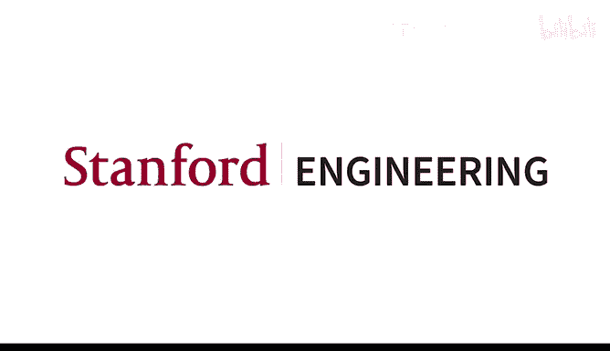
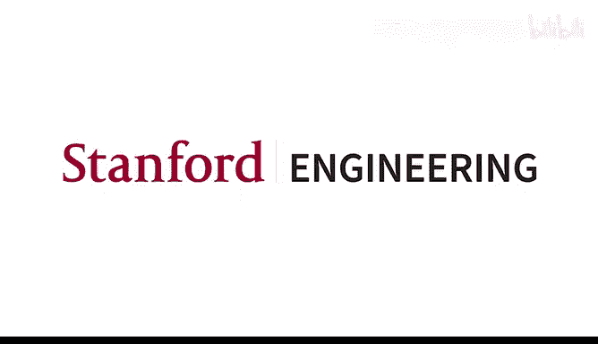

# 1：引言与词向量 🎓




在本节课中，我们将学习自然语言处理（NLP）的基本概念，并深入探讨如何通过深度学习技术，特别是词向量，来让计算机理解和表示词语的含义。我们将从课程介绍开始，逐步了解人类语言的特性，并重点学习一个经典且强大的词向量模型——Word2Vec。

## 课程介绍与概述 📋

这门课程旨在教授深度学习在自然语言处理领域的应用。课程内容将从基础概念开始，逐步深入到当前最先进的方法，如Transformer和大型语言模型。课程不仅关注技术实现，也探讨人类语言的结构及其复杂性，并最终指导大家构建实用的NLP系统。

课程评估包括四次作业和一个期末项目。作业旨在巩固理论知识并提升实践能力，而期末项目则提供了两种选择：一个带有详细指导的默认项目，或一个完全由学生自主设计的项目。

## 人类语言与词义 🗣️

人类语言不仅是交流的工具，也是高级思维和规划的脚手架。与我们的近亲（如黑猩猩）相比，语言是人类取得巨大成就的关键因素。它使我们能够跨越时空分享知识，从青铜时代发展到拥有智能手机的现代文明。

语言也是一个灵活的社会工具，充满了不精确性、细微差别和情感色彩。词语的含义并非一成不变，而是随着人类的使用而不断演变和创新，这种创新常常由年轻人推动。

## 深度学习与NLP的进展 🚀

在过去的十年里，深度学习极大地推动了NLP的发展。早期的突破出现在机器翻译领域，神经网络系统使得实时、高质量的翻译成为可能，极大地改变了跨语言交流的方式。

现代NLP系统已经能够理解问题并从文档中提取答案，而不仅仅是进行关键词匹配。这背后是复杂的神经网络在协同工作。自2019年以来，大型语言模型（如GPT-2）展示了生成流畅文本的强大能力，它们不仅能写出语法正确的句子，还能理解上下文并生成连贯的叙述。

如今，以ChatGPT为代表的多模态模型（或称“基础模型”）能够处理文本、图像等多种形式的信息，展现了人工智能在理解和生成内容方面的巨大潜力。

## 词义表示：从传统方法到词向量 🔤

传统上，词语的“意义”常被定义为符号（词语）与其所指代的事物或概念之间的对应关系，这被称为**指称语义**。在计算机中，早期常用“独热编码”来表示词语，即每个词对应一个很长的向量，其中只有一个位置是1，其余为0。例如：
```python
motel = [0, 0, 0, 1, 0, ..., 0]
hotel = [0, 0, 0, 0, 1, ..., 0]
```
这种方法的问题是，它无法表示词语之间的相似性。`motel`和`hotel`的向量点积为0，在数学上是正交的，没有关联。

另一种思路是**分布语义**，其核心思想是“一个词的意义由其上下文决定”。基于此，我们引入**词向量**（也称为词嵌入）的概念。每个词被表示为一个稠密的、相对较短的实数向量（例如300维）。语义相近的词，其向量在空间中的位置也更接近。

## Word2Vec 算法详解 🧠

Word2Vec是2013年提出的一种简单而高效的词向量学习算法。其核心思想是：利用大量文本数据，通过一个简单的预测任务来学习词向量。

### 基本思想

算法遍历文本中的每一个位置。在每个位置，我们有一个中心词（例如“into”）和其窗口内的上下文词（例如前后各两个词：“problems”、“turning”、“banking”、“crises”）。模型的目标是，根据中心词的向量，尽可能准确地预测其周围会出现哪些词。

### 目标函数

我们希望最大化整个语料库中所有上下文词出现的似然概率。为了方便优化，我们将其转化为最小化**平均负对数似然**。具体公式如下：
```
J(θ) = - (1/T) * Σ Σ log P(w_{t+j} | w_t; θ)
```
其中，`T`是文本总词数，求和遍历所有中心词位置`t`和其上下文窗口内的位置`j`。`θ`代表模型的所有参数，即每个词作为中心词和上下文词时的两种向量。

### 概率计算与Softmax

如何用词向量计算概率`P(w_o | w_c)`？我们使用两个词向量的点积来衡量其相似度，然后通过**Softmax**函数将其转化为概率分布：
```
P(w_o | w_c) = exp(u_o^T v_c) / Σ_{w=1}^{V} exp(u_w^T v_c)
```
这里，`v_c`是中心词`w_c`的向量，`u_o`是上下文词`w_o`的向量，`V`是词汇表大小。Softmax确保所有可能上下文词的概率之和为1，并放大了点积较大的词的概率。

### 优化与梯度下降

我们的目标是找到一组词向量参数`θ`，使得目标函数`J(θ)`最小化。这通过**梯度下降**实现。我们计算目标函数对所有参数的梯度（偏导数），然后沿着梯度反方向更新参数，逐步逼近最优解。

对于中心词向量`v_c`的梯度，经过推导可得到如下形式：
```
∂J / ∂v_c ≈ u_o - Σ_{x=1}^{V} P(w_x | w_c) * u_x
```
这个结果非常直观：梯度是**观察到的**上下文词向量`u_o`与**模型预测的**上下文词向量的加权平均之间的差值。当预测的分布与实际情况一致时，梯度为零，模型达到最优。

通过在整个语料库上反复进行这种预测和参数更新，模型最终能学习到蕴含丰富语义信息的词向量。

## 总结 📝



本节课我们一起探讨了NLP课程的概览、人类语言的特性以及深度学习在NLP中的革命性进展。我们重点学习了词向量的概念，它是对传统独热编码表示的重大改进，能够捕捉词语之间的语义相似性。最后，我们深入剖析了Word2Vec算法的原理，了解了它如何通过一个简单的上下文预测任务，利用梯度下降从大量文本中自动学习出有意义的词向量表示。词向量是现代深度学习NLP的基石，为后续学习更复杂的模型奠定了基础。