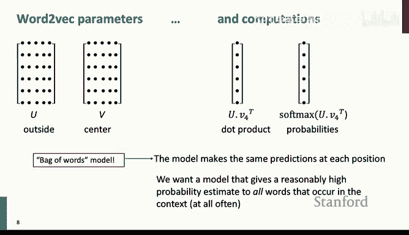
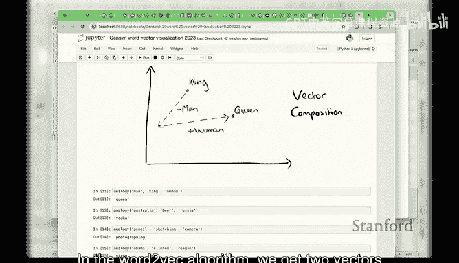
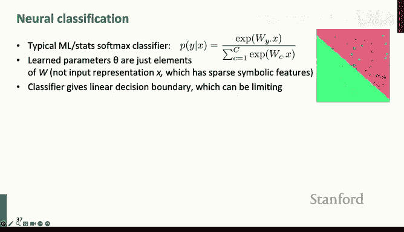

# 2：词向量与语言模型 🧠📚

在本节课中，我们将深入学习词向量的核心知识，并初步了解神经网络的基础。我们将从优化基础开始，深入探讨Word2Vec及其变体，然后介绍一些基于计数的替代方法。接着，我们将讨论词向量的评估、词义消歧问题，并最终引入神经网络分类器的概念，为后续课程打下基础。

## 课程组织与回顾 📅

上一讲我们介绍了词向量的基本概念和Word2Vec模型。我们有一个损失函数，需要通过计算其梯度来确定优化的方向。最简单的算法是梯度下降：计算梯度，然后沿着梯度的反方向（即下坡方向）前进一小步，不断重复此过程直至收敛。

然而，对于大规模数据，计算整个数据集的梯度非常耗时。因此，我们通常使用**随机梯度下降**。其核心思想是：每次只从数据中选取一小部分（例如16或32个数据项），基于这个子集计算梯度和损失函数。这个梯度虽然是对真实梯度的有噪声估计，但不仅计算速度快，而且这种噪声有时反而有助于神经网络跳出局部最优，找到更好的解。

## Word2Vec算法详解 🔍

Word2Vec的基本思想是：为每个词分配一个随机的向量表示，然后遍历语料库，根据当前的中心词预测其上下文词的概率。通过计算预测误差和梯度，我们不断更新词向量，使其能更好地预测上下文。

值得注意的是，词向量必须用**小的随机数**初始化。如果全部初始化为0，模型将无法学习，因为所有向量初始相同会导致错误的对称性。

在Word2Vec中，模型的参数就是这些词向量（包括中心词向量和上下文词向量，我们通常将它们视为独立的）。我们通过计算中心词向量与各个上下文词向量的点积，并利用softmax函数将其转化为概率分布，然后与真实的上下文词进行比较，从而得到误差。

这是一个典型的**词袋模型**：它不考虑句子的结构或词语的左右顺序，只是平等地预测中心词周围每个位置出现某个词的概率。

## 词向量的魔力与实践 ✨

尽管方法简单，但通过大量文本学习到的词向量能够捕捉丰富的语义信息。例如，我们可以使用`gensim`库加载预训练的词向量（如GloVe）进行探索：

*   **相似性查询**：查询与“USA”最相似的词，会得到“Canada”、“America”等。
*   **类比推理**：这是Word2Vec最著名的特性。例如，通过向量运算 `king - man + woman`，得到的结果向量最接近的词是“queen”。这展示了词向量空间中的线性关系，可以回答“男人之于国王，如同女人之于？”这类问题。
*   **文化知识**：模型甚至能捕捉文化知识，例如“Australia : beer :: France : ?”的答案是“champagne”。

## Word2Vec的变体与细节 ⚙️

原始的Word2Vec论文提出了两种模型：**Skip-gram**（用中心词预测上下文）和**连续词袋模型**（用上下文预测中心词）。Skip-gram更简单且效果很好。

在计算损失时，原始的**朴素softmax**需要对词汇表中的所有词进行计算，当词汇量很大时（例如40万），计算开销巨大。因此，人们提出了改进方法：

*   **负采样**：不再计算所有词的softmax，而是构建一个更简单的目标：让模型能够区分真实的上下文词（正样本）和随机采样的一些非上下文词（负样本）。目标函数变为最大化正样本的得分，同时最小化负样本的得分。这里使用**sigmoid（逻辑）函数**将得分转化为概率。
*   **采样分布**：选择负样本时，并非均匀随机，而是根据词的**一元分布**（即词频）进行采样，但通常会对词频取3/4次方，以适当提高低频词被采样的概率。

## 基于计数的替代方法：共现矩阵与GloVe 🔢

除了预测型方法，我们也可以直接从统计角度构建词向量。一个直观的想法是构建**词-词共现矩阵**：统计每个词在其上下文窗口中与其他词共同出现的次数。

然而，直接使用这个矩阵（维度为 `词汇量 × 词汇量`）作为词向量非常庞大且稀疏。因此，我们需要对其进行降维。常用方法是**奇异值分解**，它可以得到词的低维表示。早期的潜在语义分析就是基于此思想，但效果一般。

后来，研究者们改进了基于计数的方法，其中**GloVe**模型是一个重要代表。GloVe的核心思想是：**共现概率的比率可以编码语义成分**。例如，通过比较“ice”和“steam”分别与“solid”、“gas”的共现概率比值，可以捕捉到“固体/气体”这一语义维度。GloVe模型的目标是让两个词向量的点积尽可能接近它们共现概率的对数。

## 词向量的评估 📊

在自然语言处理中，评估方法分为两类：

1.  **内部评估**：针对特定子任务进行快速评估，有助于理解模型组件本身，但可能与最终任务目标不直接相关。对于词向量，常见的内部评估任务有：
    *   **词向量类比**：计算模型在类比任务上的准确率。
    *   **词相似度**：计算模型给出的词对相似度与人工评判的相似度之间的相关性。

2.  **外部评估**：在真实的下游任务（如命名实体识别、情感分析、机器翻译）中评估模型效果。这能直接反映模型的实用价值，但评估过程更复杂、更间接。例如，在命名实体识别任务中加入词向量特征，通常能显著提升系统性能。

## 词义与词向量 🎭

大多数词都有多个含义（例如，“bank”有“银行”和“河岸”之意）。如何处理多义词是词向量面临的一个挑战。

一种方法是进行**词义消歧**：根据上下文将词的每个出现实例聚类到不同的词义上，然后为每个词义学习独立的词向量。这种方法可行，但划分词义本身是主观且困难的。

实际上，更常见的做法是**只学习一个词向量**。这个向量是所有不同词义向量的加权平均（或称“叠加”）。这反映了语言学中的一个观点：词义并非离散的多个“义项”，而是一个在语义空间中的连续概率分布。有趣的是，借助**稀疏编码**理论，有时可以从这个单一向量中恢复出各个词义的分量。

## 神经网络分类器入门 🧮

现在，让我们开始接触神经网络分类器。以命名实体识别任务为例：我们需要根据词的上下文来判断其类别（如“地点”、“人名”或“非实体”）。

我们可以构建一个**窗口分类器**：取目标词及其前后若干个词构成一个窗口，将窗口中所有词的词向量拼接起来，输入到一个神经网络中进行分类。

一个简单的神经网络层可以表示为：
`h = f(Wx + b)`
其中，`x`是输入向量（如拼接的词向量），`W`是权重矩阵，`b`是偏置向量，`f`是一个非线性激活函数（如sigmoid函数）。通过一层或多层这样的变换，我们可以在网络末端连接一个线性分类器（如逻辑回归）来输出最终类别概率。

与传统的线性分类器（如逻辑回归、SVM）不同，神经网络**同时学习词的表征和分类器的参数**。这使得它在原始输入空间中可以表示非常复杂的非线性决策边界。

在实现时，我们通常使用**交叉熵损失**。在分类任务中，当真实标签是“one-hot”形式（即正确类别为1，其余为0）时，最小化交叉熵损失等价于最大化正确类别的对数似然（即最小化负对数似然）。

## 总结 🎯

本节课我们一起深入探讨了词向量。我们从Word2Vec的基本原理和优化方法出发，了解了其如何从大量文本中学习到蕴含丰富语义的词向量。我们还探讨了基于计数的GloVe模型，以及评估词向量的内部和外部方法。针对词的多义性，我们分析了离散词义表示与连续分布表示的优劣。最后，我们引入了神经网络分类器的基本概念，看到了如何将词向量应用于具体的分类任务，并初步了解了神经网络层的基本运算。下一周，我们将更深入地探讨神经网络的数学原理和应用。