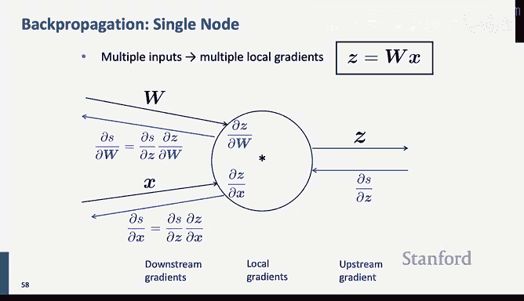

# 3：反向传播与神经网络 🧠

在本节课中，我们将要学习神经网络的核心计算原理：反向传播算法。我们将从数学基础开始，理解如何计算复杂函数的梯度，然后探讨如何高效地实现这些计算，从而让神经网络能够通过梯度下降进行学习。

---

## 1. 神经网络的基本结构与非线性激活函数

上一节我们介绍了神经网络的基本概念，本节中我们来看看其核心计算单元。

神经网络由多层“神经元”组成，每一层对输入进行线性变换（矩阵乘法与偏置加法），然后通过一个非线性激活函数。这种结构使得神经网络能够学习输入数据中复杂的中间表示，这些表示对于最终完成预测任务（如判断一个词是否为地点）是有用的。

激活函数至关重要，因为仅靠线性变换的堆叠无法增加网络的表示能力。历史上，人们使用过多种激活函数：

*   **阈值单元**：输出0或1，但缺乏梯度，不利于学习。
*   **Sigmoid / Tanh**：具有平滑的梯度，早期被广泛使用。Tanh本质上是缩放和平移后的Sigmoid：`tanh(x) = 2 * sigmoid(2x) - 1`。
*   **修正线性单元 (ReLU)**：公式为 `f(x) = max(0, x)`。它在正区间梯度恒为1，计算高效，但负区间梯度为0（“神经元死亡”）。
*   **Leaky ReLU / Parametric ReLU**：为了解决ReLU的“死亡”问题，在负区间引入一个小的、固定的或可学习的斜率。
*   **Swish / GELU**：近年来在Transformer模型中常用的复杂激活函数，它们在大部分区间近似线性，但在负区间有特殊的曲线形态。

---

## 2. 梯度下降与矩阵微积分基础 🧮

神经网络的训练依赖于梯度下降。我们需要计算损失函数 `J(θ)` 关于所有参数 `θ` 的梯度 `∇θ J(θ)`，然后沿负梯度方向更新参数。

对于多变量函数，我们使用矩阵微积分（本质上是单变量微积分在高维的推广）来计算梯度。

*   **标量对向量的梯度**：函数 `f: R^n → R` 的梯度是一个向量，包含对每个输入变量的偏导数：`∇x f = [∂f/∂x1, ∂f/∂x2, ..., ∂f/∂xn]^T`。
*   **向量对向量的梯度（雅可比矩阵）**：函数 `f: R^n → R^m` 的雅可比矩阵 `J` 是一个 `m×n` 矩阵，其中 `J[i,j] = ∂f_i/∂x_j`。神经网络的一层计算就对应这样一个函数。
*   **链式法则**：对于复合函数 `f(g(x))`，其导数为 `(∂f/∂g) * (∂g/∂x)`。在矩阵形式下，就是雅可比矩阵的乘积。

以下是几个关键运算的梯度示例：

*   **元素级激活函数**：若 `h = f(z)`，其中 `f` 逐元素作用，则 `∂h/∂z` 是一个对角矩阵，对角线元素为 `f'(z_i)`。
*   **线性层**：对于 `z = Wx + b`，有 `∂z/∂x = W^T`，`∂z/∂b = I`（单位矩阵）。
*   **点积**：对于 `s = u^T h`，有 `∂s/∂h = u^T`。

---

## 3. 手动推导一个简单网络的梯度 ✍️

让我们通过一个具体例子来实践。考虑一个用于中心词地点分类的简单网络：
1.  计算隐藏层：`z = Wx + b`
2.  应用激活函数：`h = f(z)`
3.  计算得分：`s = u^T h`

我们的目标是计算标量得分 `s` 对各个参数 `W, b, u` 和输入 `x` 的梯度。

**计算 ∂s/∂b**：
我们应用链式法则：`∂s/∂b = (∂s/∂h) * (∂h/∂z) * (∂z/∂b)`。
*   `∂s/∂h = u^T`
*   `∂h/∂z = diag(f'(z))` （对角矩阵）
*   `∂z/∂b = I`
因此，`∂s/∂b = u^T ○ f'(z)`，其中 `○` 表示逐元素乘法（Hadamard积）。在实践中，我们常遵循**形状约定**，使梯度与参数形状一致，所以 `∂s/∂b` 的结果就是向量 `δ = (u ○ f'(z))`。

**计算 ∂s/∂W**：
同样使用链式法则：`∂s/∂W = (∂s/∂h) * (∂h/∂z) * (∂z/∂W)`。
注意前两项 `(∂s/∂h)*(∂h/∂z)` 与计算 `∂s/∂b` 时相同，即上游梯度 `δ^T`。我们只需计算最后一项 `∂z/∂W`。根据形状约定，最终结果为：
`∂s/∂W = δ * x^T`
这是一个外积，其形状与权重矩阵 `W` 相同。

这个推导过程揭示了反向传播的核心思想：**共享计算**。上游梯度 `δ` 被计算一次，然后用于更新所有与该层相关的参数（`W` 和 `b`）。

---

## 4. 反向传播算法：计算图与自动微分 ⚙️

上一节我们手动推导了梯度，本节中我们来看看如何系统化、高效地完成这个过程，这就是反向传播算法。

我们可以将任何计算表示为**计算图**，其中节点是变量或运算，边表示数据流。例如，我们的网络可以表示为：`x → (Wx+b) → z → f(z) → h → (u^T h) → s`。

*   **前向传播**：按照图的拓扑顺序，从输入到输出计算每个节点的值。
*   **反向传播**：从输出开始，逆向计算梯度。
    *   每个节点接收来自其输出方向的**上游梯度**。
    *   节点根据其本地运算计算**局部梯度**（即该运算输出的雅可比矩阵）。
    *   节点将上游梯度与局部梯度相乘，得到传递给每个输入的**下游梯度**。
    *   如果一个节点有多个输出分支（如变量 `y` 被用于后续多个计算），则传递给该节点的梯度是来自所有下游分支梯度的**和**。

**关键规则示例**：
*   **加法节点**：梯度均匀分配。`c = a + b`，则 `∂L/∂a = ∂L/∂c`，`∂L/∂b = ∂L/∂c`。
*   **乘法节点**：梯度切换输入。`c = a * b`，则 `∂L/∂a = (∂L/∂c) * b`，`∂L/∂b = (∂L/∂c) * a`。
*   **Max节点**：梯度路由到最大值输入。`c = max(a, b)`，若 `a > b`，则 `∂L/∂a = ∂L/∂c`，`∂L/∂b = 0`。

通过这种方式，反向传播的复杂度与前向传播同阶，避免了重复计算，非常高效。现代深度学习框架（如PyTorch）的核心就是基于计算图的自动微分系统。

---

## 5. 实现细节与梯度检查 🔍

在框架中实现一个新层时，我们需要定义其前向和反向传播函数。

*   **前向函数**：接收输入，计算输出，并**缓存**中间结果（如输入值），供反向传播使用。
*   **反向函数**：接收上游梯度，利用缓存的前向值计算局部梯度，然后返回传递给每个输入的下游梯度。

为了确保反向传播实现的正确性，我们可以使用**梯度检查**。

梯度检查通过数值方法近似梯度：对于参数 `θ`，计算 `(J(θ+ε) - J(θ-ε)) / (2ε)`。这个数值梯度应该与我们反向传播计算出的解析梯度非常接近（例如，相对误差在 `1e-7` 量级）。虽然数值梯度计算缓慢，不适合训练，但它是验证代码正确性的强大工具。

---

## 总结

本节课中我们一起学习了神经网络训练的核心——反向传播。
1.  我们回顾了神经网络的层式结构和各种**非线性激活函数**的作用。
2.  我们建立了**矩阵微积分**的基础，理解了如何计算向量和矩阵函数的梯度。
3.  我们**手动推导**了一个简单神经网络中所有参数的梯度，并理解了**形状约定**和**计算共享**的重要性。
4.  我们引入了**计算图**模型，系统地阐述了**反向传播算法**，即通过链式法则和高效的共享计算，从输出到输入逆向传播梯度。
5.  最后，我们讨论了在框架中的**实现方式**以及使用**梯度检查**来验证正确性的实践方法。

理解这些原理不仅有助于你完成相关作业，更能让你在模型出现问题时（如梯度消失/爆炸）具备调试和思考的能力，而不仅仅是把神经网络当作一个黑箱魔法。