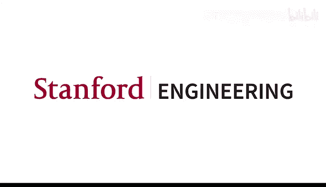
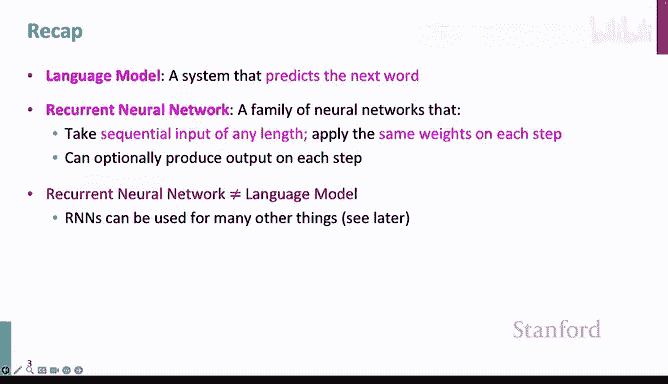
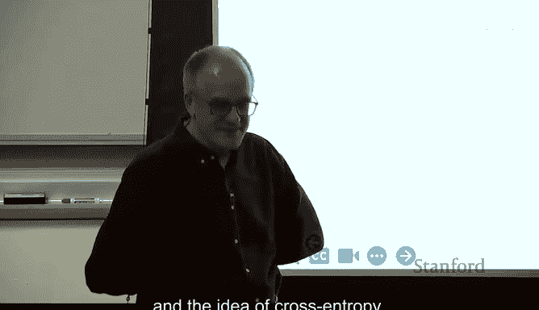
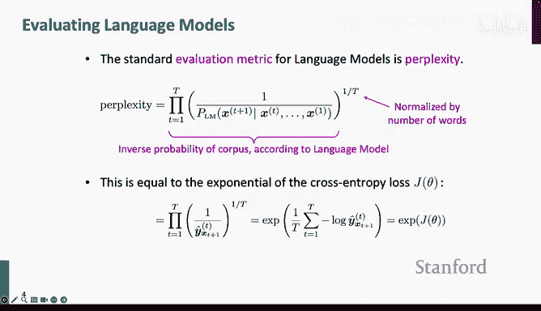
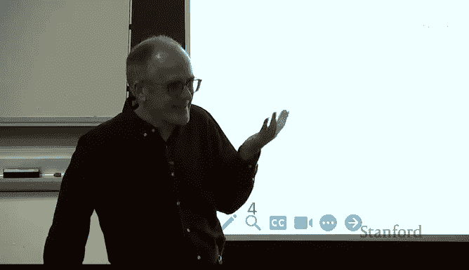
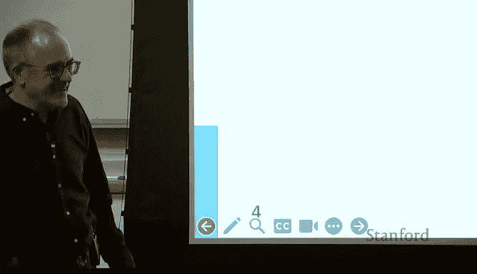
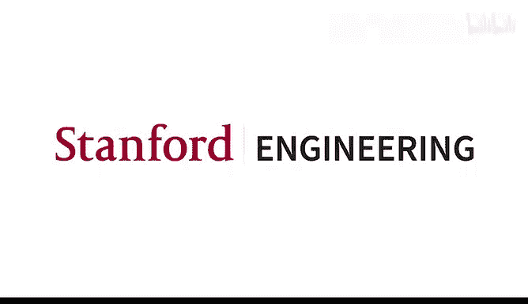

# 6：序列到序列模型 🧠➡️📝






在本节课中，我们将深入学习语言模型和循环神经网络（RNN），特别是介绍一种更高级的循环神经网络变体——长短期记忆网络（LSTM）。我们还将探讨如何将RNN应用于一个核心NLP任务：神经机器翻译。







---



## 语言模型评估与困惑度 📊

上一节我们介绍了语言模型，它是一种预测下一个单词的系统。本节中，我们来看看如何更严谨地评估语言模型。

标准评估方法是使用**困惑度**。语言模型为一段文本（通常是人类撰写的）分配一个概率分数。模型预测文本中连续单词的能力越强，其困惑度就越低，模型也就越好。

困惑度本质上是交叉熵损失的指数形式。其计算公式如下：

```
困惑度 = exp(交叉熵损失)
```

困惑度数值可以直观地理解为模型在每个时间步需要做出的“均匀选择”的数量。例如，困惑度为64意味着模型相当于在每一步掷一个64面的骰子来猜测正确单词。

以下是不同模型在语言建模任务上的困惑度进展：
*   **N-gram模型（使用Kneser-Ney平滑）**：困惑度约为67。
*   **早期RNN模型**：与最大熵模型结合后，困惑度可达51。
*   **LSTM模型**：显著提升，困惑度可降至43甚至30。

现代最先进的语言模型困惑度已降至个位数，表明其预测能力非常强大。

---

## RNN的挑战：梯度消失与爆炸 ⚠️

在训练RNN时，我们通过反向传播损失来更新参数。当沿着长序列反向传播时，我们需要连续乘以一系列偏导数（雅可比矩阵）。这会导致两个主要问题：

1.  **梯度消失**：当这些连续相乘的矩阵特征值小于1时，梯度会随着反向传播而指数级缩小，直至消失。这使得模型难以学习长距离的依赖关系。
2.  **梯度爆炸**：当特征值大于1时，梯度会指数级增长，导致参数更新过大，模型训练不稳定甚至崩溃。

梯度消失问题尤其严重，它限制了RNN的“有效记忆”长度。简单的RNN通常只能有效利用大约7个时间步之前的信息，这并不比传统的5-gram模型有显著优势。

**处理梯度爆炸**：一个简单而有效的技巧是**梯度裁剪**。其核心思想是，如果计算出的梯度范数超过一个阈值（例如5、10或20），就按比例缩小整个梯度向量，使其范数等于该阈值。

```
如果 ||g|| > 阈值:
    g = (阈值 / ||g||) * g
```

**处理梯度消失**：这需要更根本的架构改进，从而引出了LSTM。

---

## 长短期记忆网络（LSTM） 🧠

为了解决梯度消失和长期记忆问题，研究者提出了LSTM。其核心思想是引入一个**细胞状态** 作为“传送带”，专门用于长期保存信息，并通过**门控机制** 精细控制信息的流入、保留和流出。

LSTM在每一步计算三个门控向量（遗忘门 `f_t`、输入门 `i_t`、输出门 `o_t`），每个向量的值在0到1之间。以下是LSTM单元的核心计算公式：

```python
# 门控计算（共享相似结构）
f_t = σ(W_f * [h_{t-1}, x_t] + b_f)  # 遗忘门：决定从细胞状态中丢弃什么信息
i_t = σ(W_i * [h_{t-1}, x_t] + b_i)  # 输入门：决定哪些新信息存入细胞状态
o_t = σ(W_o * [h_{t-1}, x_t] + b_o)  # 输出门：决定基于细胞状态输出什么

# 候选细胞状态
~C_t = tanh(W_C * [h_{t-1}, x_t] + b_C)

# 更新细胞状态（关键步骤：加法取代乘法）
C_t = f_t ⊙ C_{t-1} + i_t ⊙ ~C_t

# 更新隐藏状态
h_t = o_t ⊙ tanh(C_t)
```

**LSTM的关键优势**在于细胞状态的更新公式中的**加法操作**。与简单RNN中连续的矩阵乘法不同，加法操作使得梯度可以更稳定地流动，有效缓解了梯度消失问题，让网络能够学习长距离依赖。

---

## RNN/LSTM的应用与变体 🔧

掌握了基础架构后，我们来看看RNN/LSTM在NLP中的多种应用及其常见变体。

**主要应用包括**：
*   **序列标注**：如词性标注、命名实体识别，为每个输入单词分配一个标签。
*   **句子编码**：用于情感分析等任务。可以取最后一个隐藏状态，或对所有隐藏状态进行池化（如平均或最大池化）作为句子表示。
*   **条件语言模型**：用于机器翻译、摘要生成、语音识别等。模型根据输入源（如另一种语言的句子）来生成目标文本。

**常见架构变体**：
*   **双向RNN/LSTM**：同时运行前向和后向RNN，并将每个时间步的两个隐藏状态连接起来。这为每个单词提供了包含左右上下文的表示，常用于编码器，但不用于文本生成。
*   **堆叠RNN/LSTM**：使用多个RNN层，深层网络可以学习更抽象的特征表示。在实践中，2到3层的堆叠LSTM很常见，并能带来性能提升。
*   **残差连接与高速网络**：受计算机视觉中ResNet的启发，在RNN层之间添加捷径连接，有助于缓解深度网络中的梯度消失问题。

---

## 神经机器翻译 🌐➡️🌐

机器翻译是NLP的核心任务之一。早期基于规则的尝试效果有限，后来统计机器翻译（SMT）取得了进展，但其系统复杂且由多个独立模块组成。

神经机器翻译（NMT）的革命性在于使用一个**单一的、端到端的神经网络**来完成翻译任务，通常采用**序列到序列** 架构。

**Seq2Seq模型核心**：
1.  **编码器**：通常是一个RNN（如LSTM），读取并编码整个源语言句子。其最终隐藏状态被视为整个句子的“语义摘要”。
2.  **解码器**：另一个RNN（如LSTM），以编码器的最终隐藏状态为初始条件，开始生成目标语言单词。它是一个**条件语言模型**，在每一步基于已生成的部分翻译和源句编码来预测下一个单词。

**训练过程**：使用平行语料库（源句-目标句对）。将源句输入编码器，解码器以编码器状态为起点，并尝试逐词预测真实的目标句。计算每个位置的预测损失，平均后通过反向传播同时更新编码器和解码器的所有权重，实现端到端训练。

神经机器翻译在2014年左右出现后，其翻译质量迅速超越耕耘了数十年的统计机器翻译系统，并在短短几年内被各大科技公司广泛部署，成为深度学习在NLP领域第一个重大成功案例。

---

## 总结 📚

本节课我们一起学习了以下核心内容：
*   **语言模型评估**：使用困惑度作为标准评估指标。
*   **RNN的局限性**：梯度消失和爆炸问题严重限制了简单RNN处理长序列依赖的能力。
*   **LSTM**：通过引入细胞状态和门控机制（遗忘门、输入门、输出门），利用加法操作稳定梯度流，显著提升了长期记忆和建模能力。
*   **RNN/LSTM的应用**：可用于序列标注、句子编码和作为条件语言模型。
*   **神经机器翻译**：采用编码器-解码器（Seq2Seq）框架，用一个端到端的神经网络实现了高质量的翻译，是深度学习在NLP中的里程碑式应用。



通过学习，你现在应该理解为何LSTM能有效解决传统RNN的长期依赖问题，并掌握序列到序列模型在机器翻译等任务上的基本原理。