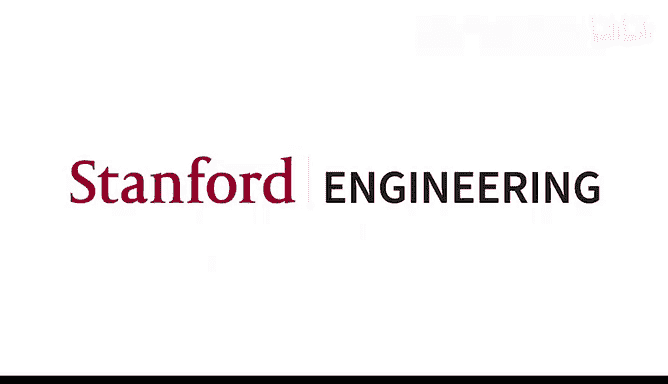

# 7：注意力机制与期末项目 🧠

在本节课中，我们将首先学习如何评估机器翻译的质量，然后深入探讨一个非常核心且强大的概念——注意力机制。注意力机制最初在机器翻译的背景下被提出，如今已成为神经网络，特别是Transformer架构中的基础组件。最后，我们将介绍本课程的期末项目安排。

## 机器翻译评估：BLEU分数 📊

上一讲我们介绍了基于多层LSTM的机器翻译系统。该系统将源语言句子编码，然后使用解码器逐词生成目标语言翻译。为了判断翻译质量的好坏，我们需要一个评估标准。

在机器翻译领域，人们提出了数百种自动评估方法。然而，至今最常用、最具影响力的指标是**BLEU**。在深度学习时代之前，评估翻译的唯一可靠方法是人工评判。虽然人工评估仍是黄金标准，但为了快速迭代和模型训练，我们需要自动化的评估方法。

BLEU的核心思想是：将机器翻译的输出与一个或多个人工翻译的参考译文进行比较。它通过计算机器翻译与参考译文之间重叠的**n-gram**（如1-gram, 2-gram, 3-gram, 4-gram）数量来打分。重叠越多，分数越高。

以下是BLEU评估的一个简单示例：
*   **参考译文1**: `the airport is on the west side of the city`
*   **参考译文2**: `the international airport is located west of the city`
*   **机器翻译**: `the airport is west of the city`

我们可以找到重叠的n-gram，如 `the airport`、`west of the city` 等。BLEU分数理论上在0到100之间，但几乎不可能达到100，因为翻译存在多种可能性。通常，分数达到20+意味着翻译基本可理解，达到30+或40+则表明翻译质量已经相当不错。

BLEU也存在一些缺陷，例如，好的翻译可能因为用词与参考译文不同而得分低，而差的翻译也可能因为偶然匹配到一些词而得分。此外，BLEU还包含一个针对过短翻译的惩罚项，以防止系统只翻译简单的部分。

## 注意力机制的引入 🔍

在上一讲介绍的编码器-解码器架构中，编码器需要将整个源句子的信息压缩到**最后一个隐藏状态向量**中，然后解码器仅基于这一个向量来生成整个翻译。对于长句子来说，这是一个信息瓶颈，显得不太合理。

人类翻译时，并不是一次性记住整个句子再翻译，而是在翻译每个词时，会**回看**源句子中相关的部分。注意力机制正是模拟了这一过程。

注意力机制的核心思想是：在解码器生成目标语言的每一个词时，都让它能够直接“查看”编码器在所有时间步的隐藏状态，并从中选取最相关的信息。

### 注意力机制的工作原理

以下是注意力机制的工作步骤图示与说明：

1.  **计算注意力分数**：在解码器的每个时间步 `t`，我们有一个解码器隐藏状态 `s_t`。我们将 `s_t` 与编码器的每一个隐藏状态 `h_1, h_2, ..., h_n` 进行比较，为每个编码器位置计算一个**注意力分数** `e_{t,i}`。这个分数表示在生成当前目标词时，源句子第 `i` 个词的重要性。
2.  **生成注意力分布**：将所有位置的注意力分数通过 **softmax** 函数进行归一化，得到一个概率分布 `α_t`。这个分布就是“注意力权重”，它告诉我们解码器应该“关注”源句子每个部分的程度。
    *   **公式**: `α_t = softmax(e_t)`
3.  **计算上下文向量**：使用注意力权重对编码器的所有隐藏状态进行加权求和，得到一个**上下文向量** `c_t`。这个向量融合了源句子中与当前生成词最相关的信息。
    *   **公式**: `c_t = Σ_i (α_{t,i} * h_i)`
4.  **生成输出**：将上下文向量 `c_t` 与解码器当前的隐藏状态 `s_t` 连接起来，形成一个更丰富的表示。然后将这个组合向量输入到一个前馈层和softmax层，以预测下一个要输出的词。

通过这种方式，模型在翻译“hit”时，可能会更多地关注源句中的“frappe”；在翻译“me”时，则会关注“moi”。这提供了很好的**可解释性**，我们可以通过可视化注意力权重来理解模型在翻译每个词时正在“看”源句子的哪个部分。

### 注意力分数的不同计算方式

上面提到，计算注意力分数 `e_{t,i}` 有多种方法：

*   **点积注意力**: `e_{t,i} = s_t^T * h_i`
    *   最简单直接，但要求 `s_t` 和 `h_i` 维度相同，且假设所有维度都同等重要地用于匹配。
*   **乘法注意力（双线性注意力）**: `e_{t,i} = s_t^T * W * h_i`
    *   引入一个可学习的权重矩阵 `W`，让模型学习如何更有效地匹配解码器和编码器的信息。参数较多。
*   **加性注意力**: `e_{t,i} = v^T * tanh(W_1 * h_i + W_2 * s_t)`
    *   使用一个小型神经网络来计算分数，更为灵活，但计算更复杂。
*   **缩放点积注意力（Transformer所用）**: `e_{t,i} = (W_q s_t)^T * (W_k h_i) / sqrt(d_k)`
    *   这是当前最主流的方法。先将查询（`s_t`）和键（`h_i`）通过不同的权重矩阵（`W_q`, `W_k`）投影到低维空间，再进行点积，并除以一个缩放因子以稳定训练。

注意力机制极大地提升了神经机器翻译的性能，解决了信息瓶颈和梯度消失问题，并因其可解释性而备受青睐。它现在已成为各种神经网络架构中的通用模块。

## 期末项目介绍 📝

课程成绩的49%来自于期末项目。项目有两种选择：**默认项目**或**自定义项目**。团队规模为1-3人。

### 项目选择

*   **默认项目**：围绕一个简化的BERT模型展开。你需要完成其实现，在情感分析任务上进行微调，并在此基础上进行扩展（例如，尝试对比学习、低秩适配等技术）。该项目提供明确指导和排行榜，适合缺乏研究经验或希望有清晰目标的同学。
*   **自定义项目**：你可以选择自己感兴趣的研究课题。项目必须**实质性地涉及自然语言和神经网络**。例如，可以研究多模态模型、大语言模型的上下文学习、模型可解释性分析等。这适合有明确想法、希望体验完整研究流程的同学。

### 项目流程与要求

1.  **项目提案**：需要提交一份最多4页的提案，其中必须包含：
    *   **研究论文评述**：对与你课题相关的一篇关键论文进行批判性总结（占大部分分数）。
    *   **项目计划**：清晰阐述你的目标、方法、将要使用的数据集、评估指标和基线模型。
    *   **伦理考量**：分析项目若部署到现实世界可能面临的伦理挑战及缓解措施。
2.  **项目中期检查**：用于确保项目进度正常，例如应已搭建好实验环境并可以运行基线模型。
3.  **最终提交**：提交项目代码和一份最多8页的**项目报告**。报告应像学术论文一样，包含摘要、引言、相关工作、方法、实验、结果分析和结论。评分将主要基于这份报告。

### 计算资源 💻

由于当前GPU资源紧张，课程提供的免费云计算资源有限。你需要发挥创造性来获取资源：
*   每位同学可获得$50的Google Cloud Platform（GCP）信用。
*   利用各大云平台（如Google Colab, Kaggle, AWS SageMaker Lab）的新用户免费额度。
*   考虑低成本GPU提供商（如Modal, Fast.ai）。
*   **Together AI** 为课程提供了$50的API额度，可用于访问各类大语言模型，适合进行大模型相关的实验项目。

### 项目构思建议

在构思自定义项目时，可以考虑以下方向：
*   **应用型**：针对某个具体任务（如信息抽取、文本生成）构建或微调模型。
*   **方法改进型**：提出或尝试一种新的神经网络技术或训练方法。
*   **大模型应用**：利用大语言模型的API进行上下文学习、智能体构建或程序生成。
*   **分析型**：分析模型的内部工作机制（可解释性）或其在某些语言现象上的行为。
*   **理论型**：对某些模型或算法的性质进行理论分析。

**关键建议**：无论选择哪种项目，确保有一个合适的**基线模型**进行比较，并规划好可行的**实验评估**。项目的价值在于你所做的**增量贡献**和**深入分析**。

## 总结 🎯

本节课我们一起学习了两个主要内容：
1.  **机器翻译的BLEU评估方法**：这是一种基于n-gram重叠的自动化评估指标，尽管不完美，但仍是领域标准。
2.  **注意力机制**：这是一个革命性的概念，它允许解码器在生成每个词时动态地关注源句子的不同部分，从而显著提升了序列到序列模型（如机器翻译）的性能，并解决了长序列信息压缩的瓶颈问题。我们了解了其工作原理、不同分数计算方式及其带来的优势。
3.  **期末项目安排**：我们详细介绍了课程期末项目的两种形式、具体要求、时间节点以及可用的计算资源，为同学们启动自己的研究项目提供了清晰的指引。

从下一讲开始，我们将进入Transformer架构的学习，而注意力机制正是其最核心的组成部分。

