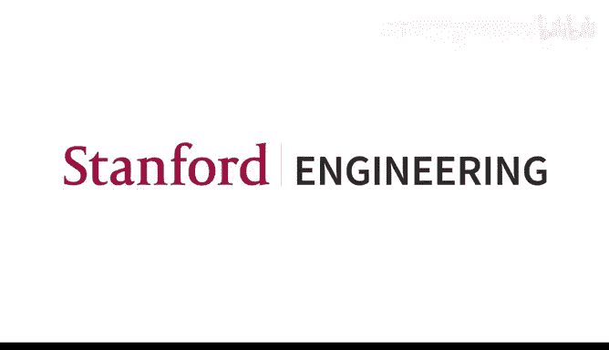
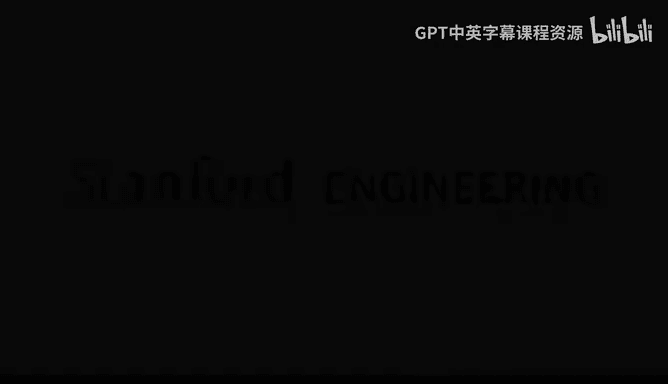

# 8：自注意力机制和Transformer模型 🎓





## 课程概述

在本节课中，我们将要学习自注意力机制和Transformer模型。这些概念是现代自然语言处理乃至更广泛人工智能领域大多数进展的基础，是一个非常有趣且重要的主题。

---

## 回顾：循环神经网络的局限性

上一节我们介绍了基于循环神经网络（RNN/LSTM）和注意力机制的经典架构。本节中，我们来看看这些架构存在的一些问题。

循环神经网络存在两个主要问题：

1.  **线性交互距离问题**：RNN按顺序（从左到右或从右到左）处理序列。虽然相邻词语（如“美味的披萨”）经常相互影响，但长距离依赖（如句子“那位去商店买了食材、喜欢大蒜的厨师……是……”中“厨师”和“是”的关系）需要信息经过许多时间步才能交互。梯度需要从“是”传播回“厨师”，这使得学习长距离依赖变得困难。LSTM在长距离梯度建模上比简单RNN更好，但并不完美。

2.  **顺序计算与并行化问题**：RNN的前向和反向传播具有 `O(序列长度)` 量级的不可并行化操作。要计算时间步 `t` 的隐藏状态，必须先计算时间步 `t-1` 的状态，依此类推。这形成了一个计算图，随着序列长度增长，无法并行化的操作数量也线性增长，无法充分利用GPU的并行计算能力。

---

## 自注意力机制：核心思想

如果不使用循环，那用什么？答案是注意力机制。

注意力机制将每个词的表示视为一个查询，用于访问并整合一组值中的信息。与RNN不同，自注意力机制允许序列中的每个词直接与所有其他词（包括距离很远的词）进行交互。

以下是自注意力机制的关键优势：
*   **解决线性交互距离**：无论词语相距多远，都可以通过注意力直接建立联系。
*   **解决并行化问题**：可以同时计算序列中所有词的注意力表示，因为计算一个词的注意力不需要依赖其他词的计算结果。

---

## 自注意力机制的数学描述

让我们更深入地探讨自注意力的数学原理。自注意力可以看作是在一个“键-值”存储中进行模糊查找。

*   **传统查找表**：给定一个查询，精确匹配一个键，返回对应的值。
    *   **公式**：`output = value[key == query]`
*   **注意力机制**：查询与所有键进行软匹配（计算相似度），然后对值进行加权求和。
    *   **公式**：
        1.  相似度得分：`e_ij = Query_i · Key_j`
        2.  注意力权重：`α_ij = softmax(e_ij)`
        3.  输出：`Output_i = Σ_j (α_ij * Value_j)`

具体计算步骤如下：

1.  我们有一个词序列 `w_1, ..., w_n`。
2.  通过嵌入矩阵 `E` 将每个词转换为词向量 `x_i ∈ R^d`。
3.  使用三个不同的可学习权重矩阵（`W_Q`, `W_K`, `W_V`）将每个词向量 `x_i` 分别转换为查询向量 `q_i`、键向量 `k_i` 和值向量 `v_i`。
    *   **代码描述**：
        ```python
        q_i = x_i @ W_Q  # 形状: (d,)
        k_i = x_i @ W_K  # 形状: (d,)
        v_i = x_i @ W_V  # 形状: (d,)
        ```
4.  对于序列中的每个位置 `i`，计算其查询 `q_i` 与所有位置 `j` 的键 `k_j` 的点积，得到相似度得分 `e_ij`。
5.  对 `e_i`（`i` 对所有 `j` 的得分）应用softmax函数，得到归一化的注意力权重 `α_ij`。
6.  输出 `o_i` 是所有权重 `α_ij` 与对应值向量 `v_j` 的加权和。

---

## 构建最小自注意力模块：需要解决的问题

基本的自注意力机制不能直接替代LSTM，我们需要解决几个问题才能将其作为基础构建模块。

### 1. 序列顺序问题

自注意力本身是对集合的操作，没有内置的词语位置信息。例如，句子“Zuko made his uncle”和“His uncle made Zuko”经过自注意力计算后会得到完全相同的表示，但这显然不对。

**解决方案：位置编码**
我们将每个序列位置（1, 2, 3, ...）也表示为一个 `d` 维向量 `p_i`，然后将其加到词嵌入 `x_i` 上。
*   **正弦位置编码**：使用不同频率的正弦和余弦函数生成位置向量，可能有助于外推到更长的序列。
*   **可学习位置编码**：直接学习一个位置嵌入矩阵 `P ∈ R^(d×N)`，其中 `N` 是最大序列长度。这种方法简单有效，但无法处理长度超过 `N` 的序列。

### 2. 非线性问题

基本的自注意力只是一系列线性操作（加权平均）。如果重复应用自注意力而不引入非线性，最终只是在反复平均值向量。

**解决方案：前馈网络**
在每个自注意力层之后，为每个位置的输出向量独立地应用一个前馈神经网络（通常是两层MLP，中间有非线性激活函数，如ReLU）。
*   **代码描述**：
    ```python
    # 假设 attention_output 形状为 (n, d)
    ff_output = gelu(attention_output @ W1 + b1) @ W2 + b2  # W1: (d, d_ff), W2: (d_ff, d)
    ```
这为模型提供了非线性变换能力，是“深度学习魔法”的关键部分。

### 3. 信息泄露问题（用于解码）

在诸如机器翻译或语言建模的任务中，在预测当前位置时，我们不能“偷看”未来的词。

**解决方案：掩码**
我们仍然计算所有词对之间的注意力得分 `e_ij`，但在计算softmax之前，将未来位置（`j > i`）的得分 `e_ij` 设置为一个极大的负数（如 `-1e9`）。这样，在softmax之后，未来位置的注意力权重就变成了0。
*   **代码描述**：
    ```python
    # 创建一个下三角矩阵（包含对角线）作为掩码
    mask = torch.tril(torch.ones(seq_len, seq_len))
    # 将未来位置的得分设置为负无穷
    scores = scores.masked_fill(mask == 0, float('-inf'))
    attention_weights = F.softmax(scores, dim=-1)
    ```

---

## Transformer架构详解 🏗️

上面介绍的是最小自注意力架构。在实践中，广泛使用的是Transformer架构，它引入了一些关键改进。

### 核心组件1：多头注意力

单一的注意力头可能难以同时捕捉词语间多种不同类型的关系。例如，在表示“学习”这个词时，我们可能想同时关注“斯坦福CS224N”（实体信息）和“我去……学习”（句法信息）。

**多头注意力**允许模型在不同的表示子空间中并行地关注序列的不同部分。
1.  将模型维度 `d` 划分为 `h` 个头，每个头的维度为 `d_h = d / h`。
2.  为每个头 `l` 使用独立的可学习投影矩阵 `W_Q^l`, `W_K^l`, `W_V^l`，将输入投影到 `d_h` 维。
3.  在每个头上独立地计算缩放点积注意力。
4.  将所有头的输出连接起来，最后通过一个线性层 `W_O` 进行混合。

*   **矩阵运算形式（高效实现）**：
    ```python
    # Q, K, V 形状: (batch, seq_len, d)
    batch, seq_len, d = Q.shape
    # 重塑为 (batch, seq_len, num_heads, d_k)
    Q = Q.view(batch, seq_len, num_heads, d_k).transpose(1, 2)
    K = K.view(batch, seq_len, num_heads, d_k).transpose(1, 2)
    V = V.view(batch, seq_len, num_heads, d_k).transpose(1, 2)
    # 计算注意力，然后重塑回来
    attn_output = scaled_dot_product_attention(Q, K, V, mask) # 形状: (batch, num_heads, seq_len, d_k)
    attn_output = attn_output.transpose(1, 2).contiguous().view(batch, seq_len, d)
    output = attn_output @ W_O
    ```

### 核心组件2：缩放点积注意力

当模型维度 `d` 较大时，查询和键的点积值可能变得很大，导致softmax函数的梯度很小。为了解决这个问题，在计算点积后，将得分除以 `sqrt(d_k)`（键向量的维度）。
*   **公式**：`e_ij = (q_i · k_j) / sqrt(d_k)`

### 核心组件3：残差连接与层归一化

这两个是帮助模型更快、更稳定训练的重要技巧。

*   **残差连接**：将子层（如自注意力层或前馈层）的输入直接加到其输出上。公式为：`LayerOutput(x) = Sublayer(x) + x`。这有助于缓解梯度消失问题，并使网络在初始化时接近恒等映射。
*   **层归一化**：对单个样本、单个时间步的特征向量进行标准化，使其均值为0，方差为1，然后应用可学习的缩放和偏移参数。
    *   **公式**：
        *   `μ = mean(x)`, `σ = std(x)`
        *   `LN(x) = γ * ( (x - μ) / sqrt(σ^2 + ε) ) + β`
    其中 `γ` 和 `β` 是可学习参数，`ε` 是一个小常数用于数值稳定性。

在Transformer图中，残差连接和层归一化通常被画在一起，称为“Add & Norm”模块。

---

## Transformer的三种架构

基于上述组件，我们可以构建三种主要的Transformer架构：

1.  **Transformer解码器**：用于语言建模等自回归任务。包含掩码多头自注意力层（防止看到未来信息），后接Add & Norm和前馈网络，重复多次形成多个块。
2.  **Transformer编码器**：用于需要双向上下文的任务（如句子分类）。与解码器几乎相同，但**不使用掩码**，允许每个词关注序列中的所有词。
3.  **Transformer编码器-解码器**：用于序列到序列任务（如机器翻译）。这是原始论文《Attention Is All You Need》中提出的架构。
    *   **编码器**：处理源语言序列（双向，无掩码）。
    *   **解码器**：生成目标语言序列（自回归，使用掩码自注意力）。解码器还有一个额外的**交叉注意力**层，其中查询来自解码器上一层的输出，而键和值来自编码器的最终输出。这允许解码器在生成每个词时关注源序列的相关部分。

---

## Transformer的影响与挑战

Transformer架构带来了革命性的影响：
*   **并行计算**：极大地提高了训练效率，能够利用更多数据和更强大的算力。
*   **预训练革命**：为BERT、GPT等大规模预训练模型奠定了基础，在几乎所有NLP基准测试上取得了突破性进展。

然而，Transformer也面临一些挑战：
*   **计算复杂度**：自注意力的计算复杂度是 `O(n^2)`，其中 `n` 是序列长度。这对于处理长文档或书籍是一大瓶颈（相比之下，RNN是 `O(n)`）。这是当前一个活跃的研究领域。
*   **位置表示**：绝对位置编码可能不是表示位置信息的最佳方式，对于长序列外推能力有限。
*   **结构探索**：尽管Transformer非常成功，但其架构仍有改进空间，例如前馈网络的设计、归一化方式等。

---

## 课程总结


本节课中我们一起学习了自注意力机制和Transformer模型的核心原理。我们从分析循环神经网络的局限性出发，引入了自注意力作为解决方案，并详细阐述了其数学形式。接着，我们探讨了构建实用自注意力模块需要解决的序列顺序、非线性和信息泄露问题。最后，我们深入剖析了Transformer架构的关键组件：多头注意力、缩放点积注意力、残差连接和层归一化，并介绍了编码器、解码器以及编码器-解码器三种架构形式。Transformer以其卓越的并行能力和表示能力，已成为现代自然语言处理的基石模型。