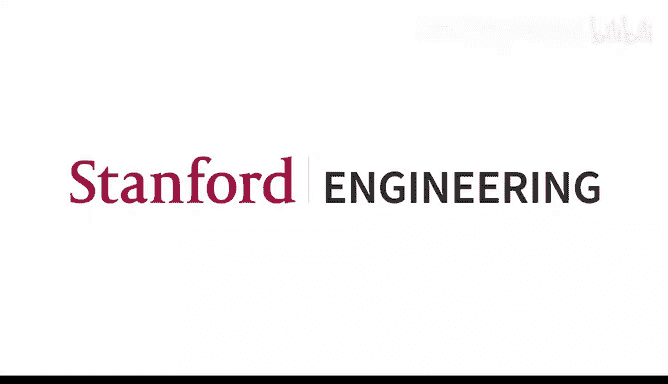

# 9：预训练 🚀

在本节课中，我们将要学习预训练（Pretraining）这一现代自然语言处理中的核心主题。我们将探讨如何通过大规模无标注文本数据来训练模型，使其学习到丰富的语言知识，并理解如何将这些知识应用到下游任务中。

***

## 1. 子词建模：超越有限词汇表

在之前的课程中，我们假设了一个有限的词汇表 `V`。然而，语言是动态的，新词不断涌现，并且许多语言具有复杂的形态变化。为了解决这个问题，我们引入了子词建模（Subword Modeling）。

子词建模的核心思想是：我们不试图定义所有可能的单词，而是将词汇表定义为包含单词的组成部分（子词）。这样，即使遇到未见过的单词，我们也可以将其拆分为已知的子词序列来表示。

以下是构建子词词汇表的基本算法：
1.  从所有单个字符开始。
2.  在数据集中找到最常相邻出现的字符对。
3.  将这个字符对作为一个新的“子词”单元加入词汇表。
4.  用这个新的子词单元替换数据中对应的字符对。
5.  重复步骤2-4，直到词汇表达到预定大小或满足其他停止条件。

通过这种方式，常见的单词（如“hat”）可能作为一个整体保留在词汇表中，而罕见或复杂的单词（如“tasty”或“transformerify”）则可能被拆分为多个子词（如 `T A A`、`A A A`、`S T Y`）。这比将所有未知词映射到同一个 `<UNK>` 标记要有效得多。

***

## 2. 从静态词向量到上下文表示

我们之前学习的 Word2Vec 等方法为每个词提供了一个静态的向量表示。然而，正如语言学家 J.R. Firth 所说：“一个词的完整意义总是依赖于语境的。” 同一个词在不同语境下可能有不同含义（例如，“record” 作为名词和动词）。

因此，我们需要能够根据上下文动态调整的词表示。这通过循环神经网络（RNN）或 Transformer 等架构来实现，它们能为序列中的每个词生成一个依赖于其上下文的向量表示。

***

## 3. 预训练范式：原理与优势

预训练-微调（Pretraining-Finetuning）范式是现代 NLP 的基石。其核心思想是：先在一个大规模无标注文本语料库上训练一个模型，学习通用的语言知识；然后，在一个特定任务（如情感分析）的较小标注数据集上对这个模型进行微调。

**预训练目标**通常是某种形式的**输入重建**。例如，我们可以随机遮盖（Mask）输入句子中的一些词，然后训练模型去预测这些被遮盖的词。为了完成这个看似简单的任务，模型必须学习语法、语义、常识推理甚至世界知识。

**为什么预训练有效？**
1.  **数据规模**：无标注文本数据（如互联网文本）的数量级远超特定任务的标注数据。
2.  **更好的参数初始化**：预训练得到的模型参数 `θ_hat` 已经编码了大量语言结构。微调过程从 `θ_hat` 开始进行梯度下降，更可能收敛到一个泛化能力强的解。
3.  **任务通用性**：语言建模等预训练任务比单一的下游任务（如电影评论分类）更能促使模型学习广泛、通用的语言模式。

***

## 4. 编码器预训练：BERT 与掩码语言建模

编码器（如 Transformer Encoder）可以同时看到输入序列的所有位置（双向上下文）。因此，我们不能直接用标准的下一个词预测（语言建模）来预训练它，因为任务会变得平凡（模型可以直接“偷看”答案）。

解决方案是**掩码语言建模（Masked Language Modeling， MLM）**，由 BERT 模型推广。其过程如下：
1.  随机选择输入序列中约15%的子词标记。
2.  对于这些被选中的标记：
    *   80%的概率替换为特殊的 `[MASK]` 标记。
    *   10%的概率替换为随机词。
    *   10%的概率保持不变。
3.  模型的任务是基于完整的上下文，预测这些位置原始的单词是什么。

**BERT 的输入表示**由三部分组成：
*   **词嵌入（Token Embeddings）**
*   **位置嵌入（Position Embeddings）**
*   **段落嵌入（Segment Embeddings）**：用于区分两个不同的文本片段（如一对句子）。

BERT 还使用了**下一句预测（Next Sentence Prediction， NSP）** 作为辅助任务，以学习句子间关系。但后续研究发现，仅使用 MLM 并延长训练上下文长度（如 RoBERTa 模型）通常效果更好。

**如何使用预训练的编码器？**
在预训练阶段，模型顶部有一个线性层用于词汇表预测。对于下游任务，我们移除这个顶层，并根据任务需求添加新的输出层。例如，对于句子分类，我们可以取 `[CLS]` 标记对应的输出向量，接一个分类器进行微调。

***

## 5. 编码器-解码器预训练：T5 与跨度损坏

编码器-解码器架构（如 Transformer）常用于序列到序列任务（如机器翻译、摘要）。其预训练需要同时考虑编码器的双向理解和解码器的生成能力。

一种有效的方法是**跨度损坏（Span Corruption）**，由 T5 模型使用。其过程如下：
1.  在输入文本中随机遮盖掉连续的多个词（一个“跨度”），并用特殊的掩码标记（如 `<X>`， `<Y>`）替换。
2.  编码器接收被损坏的文本。
3.  解码器的目标是按顺序生成被遮盖的原始跨度内容，目标序列形如：`<X> 被遮盖的词1 被遮盖的词2 <Y> 被遮盖的词3 ...`。

这种方法让模型学习在给定双向上下文的情况下，生成缺失的文本片段，非常适用于需要理解和生成的任务。

***

## 6. 解码器预训练：GPT 系列与上下文学习

解码器（如 Transformer Decoder）使用因果注意力掩码，只能看到当前及之前的词，天然适合标准的下一个词预测任务（语言建模）。因此，其预训练就是在大规模文本上进行语言建模。

从 GPT、GPT-2 到 GPT-3，模型规模和数据量急剧增长，带来了新的能力——**上下文学习（In-Context Learning）**。

**上下文学习**是指：仅通过向模型提供任务描述和少量示例（作为输入提示），而不更新其参数（即不进行微调），模型就能根据提示中的模式完成新任务。例如，给出几个“英文单词 -> 法文翻译”的例子，然后给出一个新的英文单词，模型可能输出正确的法文翻译。

这种能力在较小模型中不明显，但在像 GPT-3（1750亿参数）这样的大模型中**涌现**出来。它表明，大规模语言建模不仅学习了语言统计规律，还隐式地学习了如何根据指令和示例执行任务。

**思维链（Chain-of-Thought）提示**进一步提升了上下文学习的性能。其做法是：在提示的示例中，不仅给出问题和答案，还给出一步步的推理过程。当模型面对新问题时，它也会先生成推理步骤，再给出最终答案，这显著提高了复杂推理任务的准确性。

***

## 7. 模型缩放与更多思考

**缩放定律（Scaling Laws）**：研究表明，模型性能随着参数数量、训练数据量和计算量的增加而可预测地提升。但需要平衡三者，例如 Chinchilla 模型表明，在相同计算预算下，使用更多数据训练一个稍小的模型，可能比训练一个超大的模型更有效。

**预训练学到了什么？** 模型学到了广泛的知识：词汇、语法、事实、常识推理、情感，甚至编程模式。然而，它同样会学习并放大训练数据中存在的**社会偏见**（如种族、性别偏见）。

**高效微调（Parameter-Efficient Fine-Tuning）**：微调所有参数成本高昂。高效微调技术（如前缀微调、LoRA）通过只微调少量新增参数或低秩参数矩阵，在保持大部分预训练参数不变的情况下进行适配，取得了与全参数微调相近的效果，且更节省资源。

***

## 总结

本节课我们一起深入探讨了预训练技术。我们从**子词建模**解决了词汇表外词的问题开始，回顾了从静态词向量到**上下文表示**的演进。我们详细分析了**预训练-微调范式**的原理与巨大优势，并分别介绍了**编码器（BERT/MLM）**、**编码器-解码器（T5/跨度损坏）** 和**解码器（GPT/语言建模）** 这三类主流的预训练架构与方法。最后，我们探讨了**上下文学习**、**思维链**等大模型涌现能力，以及模型缩放、社会偏见和高效微调等重要议题。预训练是当今 NLP 发展的核心驱动力，理解其思想和技术是深入该领域的关键。