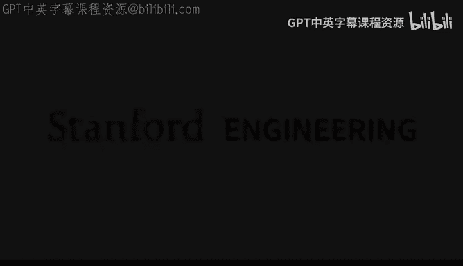
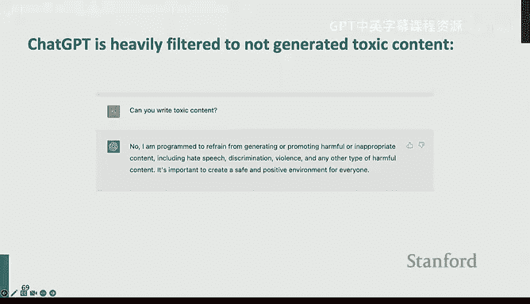

# 10：自然语言生成 🚀

大家好，我是Lisa，是NLP组的三年级博士生，导师是Percy和Tatsu。今天我将为大家讲解自然语言生成，这也是我的研究方向，因此我非常兴奋，并乐于在讲座期间和课后回答关于自然语言生成的任何问题。自然语言生成是一个非常激动人心且发展迅速的领域。今天我们将探讨自然语言生成的所有精彩内容。

在进入激动人心的部分之前，我需要做一些通知。首先，请务必在今天午夜之前注册AWS，这关系到你们的作业5以及最终项目。其次，项目提案将于下周二截止。作业4应该已经截止了，希望你们在机器翻译等任务中有所收获。作业5今天已经发布，截止日期是周五午夜。最后，我们将在本周五举办一个关于Hugging Face Transformer库的教程。如果你们的最终项目涉及实现Transformer或使用大语言模型，建议参加这个教程，它会非常有帮助。再次提醒，请记得注册AWS，这是最终硬性截止日期。

现在，让我们进入今天的主要话题——激动人心的自然语言生成内容。今天我们将讨论什么是自然语言生成，回顾一些模型，探讨如何从语言模型中解码以及如何训练语言模型，我们还将讨论评估方法。最后，我们将探讨当前自然语言生成系统的伦理和风险考量。这些自然语言生成技术非常令人兴奋，因为它们让我们更接近解释ChatGPT等流行模型的魔力。从实践角度看，如果你们的最终项目涉及文本生成，这些知识也会有所帮助。

## 什么是自然语言生成？🤔

自然语言生成是一个非常广泛的类别。人们通常将NLP分为自然语言理解和自然语言生成。理解部分主要指任务的输入是自然语言，例如语义解析、自然语言推理等。而自然语言生成则指任务的输出是自然语言。自然语言生成关注的是为人类使用而生成流畅、连贯且有用的语言输出的系统。

历史上，有许多基于规则的系统，例如模板或填充。但如今，深度学习几乎为每一个文本生成系统提供动力。因此，今天的讲座将主要关注深度学习方法。

首先，自然语言生成有哪些例子？它实际上无处不在，包括我们的作业。机器翻译是自然语言生成的一种形式，其输入是源语言中的某些话语，输出是目标语言中生成的文本。数字助手，如Siri或Alexa，也是自然语言生成系统，它们接收对话历史并生成对话的延续。还有摘要系统，接收长文档（如研究文章），然后将其总结为易于阅读的几句话。

除了这些经典任务，还有一些更有趣的用途，如创意故事写作，你可以用故事情节提示语言模型，然后它会生成与情节一致的创意故事。还有数据到文本的生成，你给语言模型一些数据库或表格，目标是输出表格内容的文本描述。最后，还有基于视觉描述的自然语言生成系统，如图像描述或基于图像的讲故事。

一个非常酷的例子是流行的ChatGPT模型。ChatGPT也是一个自然语言生成系统。它非常通用，因此你可以使用不同的提示让它执行许多不同的任务。例如，我们可以使用ChatGPT来模拟聊天机器人。它可以回答关于10岁孩子创意礼物的问题。它可以用于诗歌生成，例如，我们可以要求它生成一首关于排序算法的诗。虽然我不会说它非常有诗意，但至少它具有诗歌的格式，并且内容实际上是正确的。ChatGPT还可以用于一些非常有用的场景，如网络搜索。例如，Bing通过与ChatGPT结合，有推特用户表示，ChatGPT的魔力在于它实际上让人们乐于使用Bing。

有如此多的任务实际上属于自然语言生成的范畴。那么我们如何对这些任务进行分类呢？一种常见的方法是考虑任务的开放性程度。我们在这里画一条线来表示开放性的光谱。在一端，我们有像机器翻译和摘要这样的任务。我们认为它们不是非常开放，因为对于每个源句子，输出几乎由输入决定。因为基本上我们是在做机器翻译，语义应该与输入句子完全相同。所以你可以重新表述输出的方式只有几种，例如“当局宣布今天是国家假日”，你可以稍微改写为“今天是当局宣布的国家假日”，但实际的空间确实很小，因为你必须确保语义不变。因此，我们可以说这里的输出空间并不多样化。

移动到光谱的中间，有对话任务，例如任务驱动对话或闲聊对话。我们可以看到，对于每个对话输入，有多个可能的回应，自由度在这里增加了。例如，我们可以回应说“很好，你呢？”，或者说“谢谢关心，勉强应付所有的作业”。这里我们观察到实际上有多种方式可以继续这个对话。这就是我们说输出空间变得越来越多样化的地方。

在光谱的另一端，有非常开放的生成任务，如故事生成。给定输入“给我写一个关于三只小壁虎的故事”，有无数种方式可以继续这个提示。我们可以写它们去学校、盖房子等等。这里的有效输出空间极其庞大。我们称之为开放式生成。

很难在开放式和非开放式任务之间划出明确的界限，但我们仍然尝试给出一个粗略的分类。开放式生成指的是输出分布具有高度自由度的任务，而非开放式生成任务指的是输入几乎肯定决定输出生成的任务。非开放式生成的例子包括机器翻译和摘要，开放式生成的例子包括故事生成、闲聊对话、任务导向对话等。

我们如何形式化这种分类？一种形式化的方法是计算自然语言生成系统的熵。高熵意味着我们处于光谱的右侧，即更开放；低熵意味着我们处于光谱的左侧，即更不开放。这两类自然语言生成任务实际上需要不同的解码和训练方法，我们将在后面讨论。

## 回顾自然语言生成模型与训练 📚

现在，让我们回顾一下之前的讲座，回顾我们之前学过的自然语言生成模型和训练。

我们讨论了自然语言生成的基础。自回归语言模型的工作原理如下：在每个时间步，我们的模型将一系列标记作为输入，这里是 `Y_<t`，输出基本上是新的标记 `Y_t`。为了决定 `Y_t`，我们首先使用模型为词汇表中的每个标记分配一个分数，记为 `S`。然后我们应用softmax来得到下一个标记分布 `P`。我们根据这个下一个标记分布选择一个标记。

类似地，一旦我们预测了 `Y_t_hat`，我们将其作为输入传回语言模型，预测 `Y_hat_t+1`，然后我们递归地这样做，直到到达序列的结尾。

对于我们所讨论的两种类型的自然语言生成任务，即开放式和非开放式任务，它们倾向于偏好不同的模型架构。对于像机器翻译这样的非开放式任务，我们通常使用编码器-解码器系统，其中我们刚刚讨论的自回归解码器充当解码器，然后我们有另一个双向编码器来编码输入。这类似于你们在作业4中实现的内容，因为编码器类似于双向LSTM，解码器是另一个自回归的LSTM。

对于更开放的任务，通常自回归生成模型是唯一的组件。当然，这些架构并不是硬性约束，因为仅使用自回归解码器也可以进行机器翻译，而编码器-解码器模型也可以用于故事生成。这目前更像是一种惯例，但这是一个合理的惯例，因为与编码器-解码器模型相比，仅使用解码器模型进行机器翻译往往会损害性能，而使用编码器-解码器模型进行开放式生成似乎与仅使用解码器模型达到相似的性能。因此，如果你有计算预算来训练编码器-解码器模型，可能只训练一个更大的解码器模型会更好。这更像是一个资源分配问题，而不是架构是否与你的任务类型匹配的问题。

那么，我们如何训练这样的语言模型呢？在之前的讲座中，我们谈到语言模型是通过最大似然来训练的。基本上，我们试图最大化给定前面单词的下一个标记 `Y_t` 的概率。这是我们的优化目标。在每个时间步，这可以被视为一个分类任务，因为我们试图从词汇表中的所有剩余单词中区分出实际的单词 `Y_t_star`。这也被称为教师强制，因为在每个时间步，我们使用黄金标准单词 `Y_star_<t` 作为模型的输入。而在生成时，你可能无法访问 `Y_star`，因此你必须使用模型自己的预测将其反馈给模型以生成下一个标记，这被称为学生强制，我们将在后面详细讨论。

在推理时，我们的解码算法将定义一个函数，从这个分布中选择一个标记。我们已经讨论过，我们可以使用语言模型来计算这个 `P`，即下一个标记分布。然后，根据我们的符号，`G` 是解码算法，它帮助我们选择实际用于 `Y_t` 的标记。

明显的解码算法是在每个时间步贪婪地选择概率最高的标记作为 `Y_t_hat`。这个基本算法在某种程度上是有效的，因为它在你的作业4中表现良好。我们可以采取两种主要途径来改进。我们可以决定改进解码，也可以决定改进训练。当然，我们还可以做其他事情，比如改进训练数据和模型架构，但在本讲座中，我们将专注于解码和训练。

## 自然语言生成模型的解码算法 🔍

现在，让我们谈谈自然语言生成模型的解码算法是如何工作的。

在每个时间步，我们的模型为每个标记计算一个分数向量。它接收前面的上下文 `Y_<t` 并产生一个分数 `S`。然后我们尝试通过应用softmax来归一化这些分数，得到概率分布 `P`。我们的解码算法被定义为这个函数 `G`，它接收概率分布并尝试将其映射到某个单词，基本上尝试从这个概率分布中选择一个标记。

在机器翻译讲座中，我们讨论了贪婪解码，它选择这个 `P` 分布中概率最高的标记。我们还讨论了束搜索，它与贪婪解码具有相同的目标，即我们都试图找到基于模型定义的最可能的字符串。但对于束搜索，我们实际上探索了更广泛的候选范围，通过始终在束中保留K个候选者。

总的来说，这种最大概率解码对于像机器翻译和摘要这样的低熵任务是有益的，但对于开放式生成实际上会遇到更多问题。当我们尝试进行开放式文本生成时，最可能的字符串实际上非常重复。

正如我们在这个例子中看到的，上下文是完全正常的。它是关于一只独角兽试图说英语。但续写的开头部分看起来很棒，是有效的英语，谈论科学，但突然开始重复，重复一个机构的名字。

为什么会发生这种情况？如果我们看一下这个图，它显示了语言模型分配给序列“我不知道”的概率。我们可以看到这里有规律的概率模式。但如果我们重复这个短语“我不知道”10次，我们可以看到它们的负对数似然有下降趋势。Y轴是负对数概率，我们可以看到这个下降趋势，这意味着随着重复的继续，模型实际上具有更高的概率，这相当奇怪，因为它表明存在一种自我放大效应。所以重复越多，模型对这个重复就越有信心。

这种情况会持续下去。我们可以看到，对于“我累了”重复100次，我们可以看到持续下降的趋势，直到模型几乎100%确定它会继续重复相同的内容。不幸的是，这个问题并没有通过架构得到解决。红色曲线是LSTM模型，蓝色曲线是Transformer模型。我们可以看到两种模型都遭受同样的问题，而且规模也不能解决这个问题。所以我们有点相信规模是NLP中的神奇因素，但即使是拥有1750亿参数的模型，如果我们试图找到最可能的字符串，仍然会遭受重复问题。

那么我们如何减少重复呢？一种经典的方法是进行n-gram阻塞。原理非常简单。基本上，你只是不想看到相同的n-gram出现两次。如果我们设置n为3，那么对于任何包含短语“我很高兴”的文本，下次你看到前缀“我很”时，n-gram阻塞会自动将“高兴”的概率设置为0，这样你就永远不会再看到这个三元组。但显然，这种n-gram阻塞启发式方法存在一些问题，因为有时在文本中看到一个人的名字出现两次、三次甚至更多次是很常见的。但n-gram阻塞会消除这种可能性。

那么有哪些更好的选择呢？例如，我们可以使用不同的训练目标。我们可以通过最大似然以外的目标进行训练。在这种方法中，模型实际上会因为生成已经见过的标记而受到惩罚。这有点像将n-gram阻塞的想法放入训练时间，而不是在解码时强制这个约束。在训练时，我们只是降低重复的概率。另一个训练目标是覆盖损失，它使用注意力机制来防止重复。基本上，如果你尝试正则化并强制你的注意力，使得每个标记总是关注不同的单词，那么你很可能不会重复，因为重复往往发生在你有相似的注意力模式时。

另一个不同的角度是，我们可以使用不同的解码目标，而不是搜索最可能的字符串。也许我们可以搜索最大化两个模型对数概率差异的字符串，例如，我们想要最大化大模型减去小模型的对数概率。这样，因为两个模型都是重复的，所以它们会相互抵消。因此，在应用这个新目标后，重复的内容实际上会受到惩罚，因为它们相互抵消了。

这就引出了一个更广泛的问题：对于开放式文本生成，寻找最可能的字符串甚至是一个合理的事情吗？答案可能是否定的，因为这并不真正符合人类的模式。我们可以在图中看到，橙色曲线是人类模式，蓝色曲线是使用束搜索生成的机器文本。我们可以看到，在人类谈话中，实际上存在很多不确定性，正如概率的波动所示，对于某些单词，我们可能非常确定，对于其他单词，我们可能有点不确定。而对于模型分布，它总是非常确定，总是为序列分配概率1。因为我们现在看到两种分布之间存在不匹配，所以这有点表明，也许寻找最可能的字符串根本不是正确的解码目标。

在继续之前，有什么问题吗？有人问这是否是检测文本是否由ChatGPT生成的底层机制。并不完全是，因为这只能检测人类也能检测到的非常简单的重复问题。为了避免我们之前讨论的问题，我将讨论一些其他解码家族，它们生成更稳健的文本，其概率分布看起来像橙色曲线。所以我不认为这是用于水印或检测的答案。有人问，绘制人类文本和机器生成文本的概率是否是检测文本是否由模型或人生成的一种方法。我的回答是，我不这么认为，但这可能是一个有趣的研究方向。因为我觉得有更稳健的解码方法可以生成波动很大的文本。

那么，让我们谈谈能够生成波动文本的解码算法。既然寻找最可能的字符串是一个坏主意，我们还应该做什么？我们如何模拟人类模式？答案是在解码中引入随机性和随机性。

假设我们从这个分布中采样一个标记。基本上，我们尝试从这个分布中采样 `Y_t_hat`。它是随机的，因此你基本上可以采样分布中的任何标记。之前，你被限制选择最高概率的标记，但现在你可以选择“浴室”等标记。然而，采样引入了一系列新问题，因为我们从未真正将任何标记的概率归零。普通的采样会使词汇表中的每个标记都成为可行的选项。在某些不幸的情况下，我们可能会得到一个不好的单词。假设我们已经有了一个训练有素的模型，即使分布的大部分概率质量都集中在有限的好选项上，分布的尾部仍然会很长，因为我们的词汇表中有很多单词。因此，如果我们把所有长尾加起来，它们仍然具有相当大的质量。从统计学上讲，这被称为重尾分布，而语言正是一种重尾分布。

例如，许多标记在这个上下文中可能是完全错误的。然后，假设我们有一个好的语言模型，我们给它们每个分配非常小的概率。但这并不能真正解决问题，因为这样的标记太多了。所以作为一个群体，它们仍然有很高的被选中的机会。对于这个长尾问题的解决方案是，我们应该直接切断尾部。我们应该直接将我们不想要的概率归零。一个想法是称为top-K采样，其思想是我们只从概率分布中的前K个标记中采样。

到目前为止有什么问题吗？有人问，我们之前看到的模型在图中也有一些非常低概率的样本，top-K采样如何处理这个问题？top-K基本上会消除这些样本。它使得生成超低概率标记变得不可能。从技术上讲，它并不完全模拟这种模式，因为现在你没有超低概率标记，而人类可以以流畅的方式生成超低概率标记。是的，这可能是人们用于检测机器生成文本的另一个提示。这也取决于你想要生成的文本类型，对于更创新性的写作，你可能希望有更正确的选择。当然，K是一个超参数，根据任务类型，你会选择不同的K值。对于封闭式任务，K应该较小；对于开放式任务，K应该较大。

有人问，为什么我们不考虑加权采样的情况，而不是只看top-K？我们不做加权采样类型的情况，所以我们仍然有很小但非零的概率选择。我认为top-K也是加权的。top-K只是将分布的尾部归零。但对于它没有归零的部分，并不是在K个标记中均匀选择，它仍然试图根据你计算的分数按比例选择。这可能是因为计算效率更高，因为你不需要为17000个单词做计算。是的，top-K解码的一个好处是你的softmax会接收更少的候选者。但这不是主要原因。

我们讨论了这个部分。然后，这是top-K采样的公式。现在我们只从概率分布中的前K个标记中采样。正如我们所说，K是一个超参数，我们可以将K设置得大或小。如果我们增加K，这意味着我们使输出更加多样化，但风险是包含一些不好的标记。如果我们减少K，那么我们做出更保守和安全的选择，但生成的内容可能相当通用和无聊。

那么top-K解码足够好吗？答案并不完全是，因为我们仍然可以发现top-K解码的一些问题。例如，在上下文“她说我从未____”中，仍然有许多有效的选项，如“18岁”，但这些单词被归零了，因为它们不在前K个候选者中。这实际上导致你的生成系统的召回率很差。类似地，top-K的另一个失败是它也可能过早地切断。在这个例子中，“代码”并不是一个有效的答案，根据常识，你可能不想吃一段代码，但概率仍然非零，这意味着模型仍然可能将“代码”作为输出采样，尽管概率很低，但仍然可能发生。这意味着生成模型的精确度很差。

鉴于top-K解码的这些问题，我们如何解决它们？我们如何解决没有单一的K适合所有情况的问题？这基本上是因为我们采样的概率分布是动态的。当概率分布相对平坦时，设置小的K会移除许多可行的选项。因此，我们希望在这种情况下K更大。类似地，当分布P过于挑剔时，那么高的K会允许太多选项成为可行的。相反，我们可能希望K更小，这样我们更安全。这里的解决方案是，也许K只是一个不好的超参数。与其做K，我们应该考虑概率。我们应该考虑如何从累积概率质量的前P百分位数中采样标记。

现在，进行top-P采样的优势在于，我们实际上为每个不同的分布设置了一个自适应的K。让我解释一下自适应K的含义。在第一个分布中，这是一个典型的语言幂律分布。进行top-K采样意味着我们选择前K个，但进行top-P采样意味着我们放大到可能类似于top-K效果的东西。但如果我们有一个相对平坦的分布，如蓝色分布，我们可以看到进行top-P意味着我们包含更多的候选者。然后如果我们有一个更集中的分布，如绿色分布，进行top-P意味着我们实际上包含更少的候选者。因此，通过实际选择概率分布中的前P百分位数，我们实际上拥有一个更灵活的K，从而更好地了解模型中的好选项是什么。

关于top-P和top-K解码有什么问题吗？一切都清楚了吗？听起来不错。回到那个问题，进行top-K并不一定能节省计算。或者，整个想法并不是为了节省计算，因为在top-P的情况下，为了选择前P百分位数，我们仍然需要计算整个词汇表的softmax，以便我们能够正确计算P。因此，它并不能节省计算，但能提高性能。

除了我们讨论的top-K和top-P之外，还有更多的解码算法。有一些更近的方法，如典型采样，其思想是我们希望基于分布的熵来重新加权分数，并尝试生成概率更接近数据分布负熵的文本。这有点