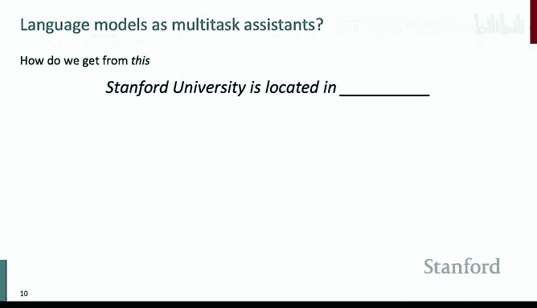
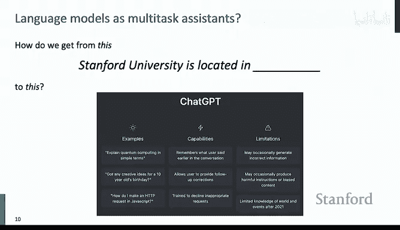
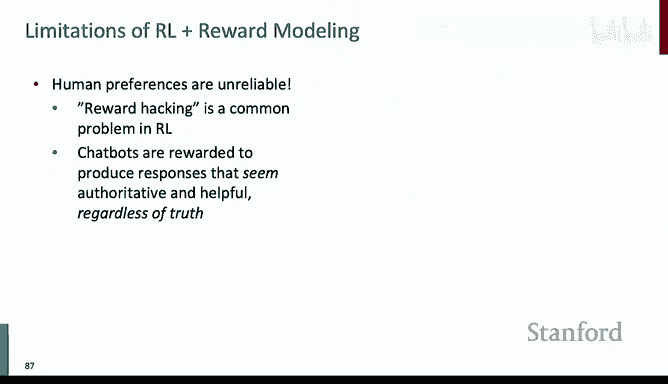
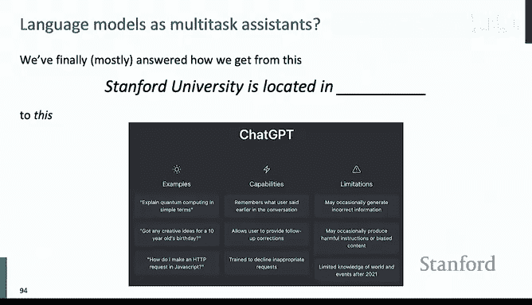

# 11：大语言模型的后训练 🚀

在本节课中，我们将要学习如何将基础的大语言模型（例如仅经过预训练的模型）转变为像ChatGPT这样能够理解并遵循用户意图的强大助手。我们将从零样本和少样本学习开始，逐步深入到指令微调，最后探讨如何通过优化人类偏好（例如RLHF和DPO）来对齐模型。

---

## 概述：从预训练到ChatGPT的旅程

近年来，随着GPT等大语言模型的兴起，机器学习领域变得异常激动人心。我们花费了数百万美元和巨大的计算资源来预训练这些模型，其核心目标仅仅是预测下一个文本标记。然而，在这个过程中，模型不仅学习了语法和事实知识，还意外地获得了对代理、信念、行动甚至代码和数学的理解能力，使其能够作为通用的多任务助手。

本节课的核心问题是：我们如何从一个简单的“预测下一个词”的模型，转变为一个能够智能响应用户指令的模型？我们将沿着这条路径，探索提示工程、指令微调以及基于人类偏好的优化方法。

---

## 零样本与少样本上下文学习 🧠

上一节我们介绍了预训练模型的基本能力。本节中，我们来看看如何不更新模型参数，仅通过巧妙的提示（Prompting）来让模型执行新任务。

### 零样本学习

零样本学习指的是模型在没有见过任何任务示例的情况下，仅根据任务描述就能执行该任务。例如，GPT-2模型展示了这种能力。

**核心思路**：由于模型是文本预测器，我们可以通过设计输入文本来“诱导”它完成任务。
*   **示例**：若要模型总结一篇新闻，可以在文章后加上“TL;DR”（Too Long; Didn‘t Read），模型就会基于其在互联网上见过的类似模式，生成总结。
*   **示例**：进行指代消解时，可以比较模型对句子不同补全方式的概率。例如，对于句子“The cat couldn‘t fit into the hat because it was too big.”，分别用“the cat”和“the hat”替换“it”，看哪个补全的概率更高。

### 少样本学习

少样本学习是指我们为模型在输入中提供少量任务示例（例如，3-5个），模型就能学会并执行类似的新任务。

**核心思路**：在输入上下文中提供任务范例，让模型通过类比进行学习。
*   **示例**：进行翻译时，在输入中先给几个“英文->法文”的例句，然后给出新的英文句子，模型就会生成法文翻译。
*   **效果**：研究表明，随着模型规模（参数和数据）的增大，少样本学习的性能可以迅速接近甚至超越专门在该任务上微调的模型。这种能力似乎是“涌现”出来的。

### 思维链提示

对于涉及多步推理的复杂任务（如数学应用题），简单的少样本提示可能不够。

**核心思路**：在提示中不仅展示输入和输出，还展示得出输出的推理过程（即“思维链”）。
*   **示例**：与其只给“问题->答案”，不如给“问题->推理步骤1， 步骤2， ... -> 答案”。
*   **效果**：这能显著提升模型在复杂推理任务上的表现。甚至，仅通过添加“让我们一步步思考”这样的指令（零样本思维链），也能诱导出推理行为，大幅提升性能。

**关键启示**：与这些模型交互时，需要思考如何在预训练数据分布中诱导出我们想要的行为模式。

---

## 指令微调 📝

上一节我们看到，通过巧妙的提示可以让模型执行任务，但这需要“诱导”，且受上下文长度限制。本节中，我们来看看如何通过微调，让模型直接学会遵循指令。

### 指令微调的目标

预训练模型的目标是预测下一个词，而不是协助用户。因此，当直接要求它“向6岁孩子解释登月”时，它可能会继续生成“6岁孩子可能还会问什么问题”，而不是直接给出解释。指令微调的目标就是让模型与用户意图“对齐”，使其能直接、可靠地遵循各种指令。

### 指令微调的方法

方法出奇地简单直接：
1.  **收集数据**：构建一个庞大的指令-输出对数据集。指令涵盖广泛的任务类型：问答、总结、翻译、代码生成、推理等。
2.  **微调模型**：使用标准的监督学习（下一个词预测损失），在这个数据集上微调预训练模型。

**公式**：损失函数仍然是标准的语言建模损失：
`L = -Σ log P(y_i | x_i, θ)`
其中 `(x_i, y_i)` 是指令-输出对。

### 效果与评估

*   **规模效应**：模型越大，指令微调带来的提升越明显。大模型能更好地吸收和泛化各种指令。
*   **评估基准**：使用如MMLU（大规模多任务语言理解）等基准来评估模型在广泛知识领域上的表现。随着模型和数据规模的扩大，模型在这些基准上的分数持续提升，现已接近或达到人类水平。
*   **高质量数据**：研究表明，使用高质量、多样化的指令数据至关重要。甚至可以利用更强的模型（如GPT-4）来为指令生成输出，从而创建训练数据。

### 指令微调的局限性

尽管强大，指令微调仍有不足：
1.  **数据收集成本高**：为复杂任务获取人类标注的答案非常昂贵。
2.  **不适合开放式任务**：对于创意写作等没有唯一正确答案的任务，难以提供标准的“正确”输出。
3.  **平等对待所有错误**：语言建模损失平等地惩罚所有词级错误，但有些错误（如将“奇幻剧”说成“音乐剧”）比另一些更严重。
4.  **受限于人类水平**：模型的答案质量可能被人类标注者的能力所限制。

---

## 基于人类偏好的优化：RLHF与DPO 🏆

上一节我们通过指令微调让模型学会了遵循指令，但其优化目标（预测下一个词）与最终目标（生成人类喜欢的输出）仍存在根本性错配。本节中，我们来看看如何直接优化人类偏好。

### 强化学习人类反馈

RLHF是ChatGPT等模型采用的核心技术，分为三步：
1.  **监督微调**：即上一节的指令微调，得到一个基础模型。
2.  **奖励模型训练**：收集人类对模型多个输出的**偏好排序**数据（例如，A输出比B输出好），训练一个奖励模型来预测人类偏好。
3.  **强化学习优化**：使用奖励模型作为信号，通过强化学习（如PPO算法）优化语言模型，使其生成高奖励的输出，同时避免偏离原始模型太远。

**核心优化目标**：
`max_θ E_(y∼p_θ(.|x)) [R_φ(x, y)] - β * KL(p_θ(.|x) || p_ref(.|x))`
其中，`R_φ`是奖励模型，`KL`散度项防止模型“放飞自我”，`β`是控制偏离程度的超参数。

**挑战**：RLHF流程复杂，对超参数敏感，实现和调试难度大。

### 直接偏好优化

DPO是一种更简单、高效的替代方案，它绕过了显式的奖励模型训练和复杂的强化学习。

**核心洞见**：对于给定的最优策略（语言模型）和参考策略（初始模型），存在一个闭式解，可以将奖励函数用策略本身表示出来：
`R(x, y) = β * log(p_θ(y|x) / p_ref(y|x)) + log Z(x)`
其中 `Z(x)` 是一个难以计算的归一化常数。

**巧妙之处**：当我们将这个奖励表达式代入基于偏好比较的Bradley-Terry损失函数时，归一化常数 `Z(x)` 被抵消了！

**DPO损失函数**：
`L_DPO = -E_(x, y_w, y_l) [log σ( β * log(p_θ(y_w|x)/p_ref(y_w|x)) - β * log(p_θ(y_l|x)/p_ref(y_l|x)) )]`
其中 `y_w` 是偏好输出，`y_l` 是非偏好输出，`σ` 是sigmoid函数。

**本质**：DPO将偏好优化问题转化为了一个简单的**分类损失**，直接优化语言模型参数 `θ`，使其对偏好输出的概率高于非偏好输出。

**优势**：实现简单，计算高效，效果与RLHF相当，已成为众多开源模型和最新生产模型（如Llama 3）的首选方法。

### 对齐后的效果

经过RLHF或DPO优化的模型，与仅进行指令微调的模型相比，表现出更符合人类偏好的特性：
*   **更有帮助且无害**：输出更详细、组织更好、更安全。
*   **减少冗余**：倾向于生成更简洁、信息密度更高的答案（尽管早期版本存在冗长问题）。
*   **泛化性更强**：能更好地处理训练数据中未明确出现的复杂或创意性指令。

---

## 总结与展望 🔮

本节课中，我们一起学习了将大语言模型从预训练状态转变为像ChatGPT这样的智能助手的关键步骤：

1.  **提示学习**：通过零样本、少样本和思维链提示，激发预训练模型已有的能力。
2.  **指令微调**：通过在海量指令数据上进行监督微调，使模型学会遵循多样化的用户指令。
3.  **偏好优化**：通过RLHF或DPO，直接根据人类偏好优化模型输出，使其不仅正确，而且有用、无害、符合期待。

我们看到了**规模**（模型参数、数据量）在整个流程中的根本性作用，以及**数据质量**和**目标设计**的重要性。尽管取得了巨大成功，该领域仍面临幻觉、奖励黑客、评估困难等挑战。

从简单的下一个词预测，到能与人类自然、有用、安全对话的助手，这是一段融合了规模法则、算法创新和人类反馈的非凡旅程。理解这些后训练技术，是理解当今最先进语言模型如何工作的关键。