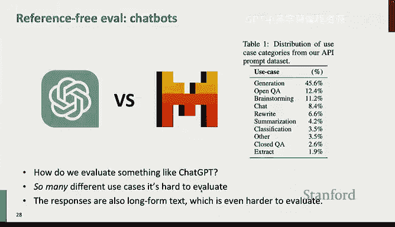
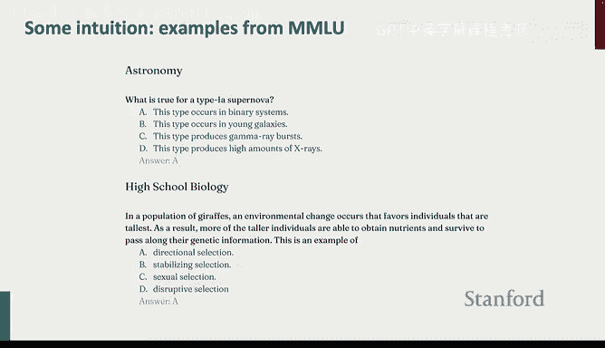
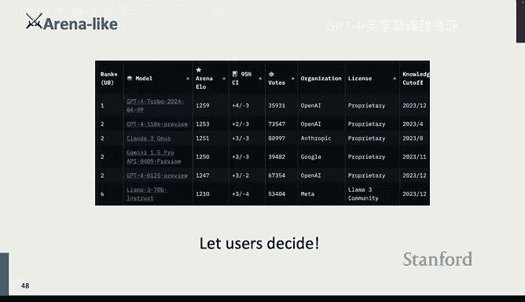

# 12：基准测试与评估 📊

在本节课中，我们将要学习机器学习模型开发流程中至关重要的环节：基准测试与评估。我们将探讨不同评估方法、其适用场景以及当前大语言模型评估面临的挑战。

## 概述：为何需要评估？

我的机器学习模型开发心智模型包含以下几个步骤：
1.  **训练模型**：需要一个可微分的损失函数来指导优化。
2.  **开发阶段**：进行超参数调优或早停，需要评估指标来指导决策。
3.  **模型选择**：为特定任务选择性能最佳的模型。
4.  **部署模型**：需要可信、任务特定的评估来确保模型足够好，可以投入生产。
5.  **发表成果**：在标准基准上评估模型，以便与同行交流模型质量。

在流程的不同阶段，评估性能的方式和侧重点各不相同。例如，训练时需要快速、廉价、可微分的评估；而部署时则需要高度可信、任务特定的绝对指标。

## 学术界的基准测试

基准测试是推动领域进步的主要驱动力。例如，MMLU基准测试的准确率在过去几年从约25%（接近随机猜测）提升到了约90%。

学术界基准测试的特点包括：
*   **可复现性与标准化**：确保多年内的研究具有可比性。
*   **易于使用**：研究者资源有限，需要快速、廉价的评估。
*   **指标不必完美**：关键在于指标能反映领域在长期内的进步趋势。
*   **难度平衡**：基准既不能太复杂（导致所有方法表现随机），也不能太简单（导致基线方法难以超越）。

## NLP任务的两大类型

NLP任务主要分为两类：封闭式任务和开放式任务。

### 封闭式任务评估 🔒

封闭式任务有有限数量的潜在答案（通常少于10个），且通常只有一个或少数几个正确答案。这本质上是标准的机器学习问题。

以下是封闭式任务的例子：
*   **情感分析**：判断文本情感是积极还是消极。典型基准：IMDB、SST。
*   **蕴含识别**：判断一个假设是否被给定文本所蕴含。典型基准：SNLI。
*   **词性标注**：典型基准：Penn Treebank。
*   **命名实体识别**：典型基准：CoNLL。
*   **共指消解**：确定代词指代哪个名词。
*   **问答**：根据给定文本回答问题。

评估这些任务通常使用标准的机器学习指标，如**准确率、精确率、召回率、F1分数**。多任务基准测试（如SuperGLUE）会汇总多个任务的性能来评估模型的通用语言能力。

**需要注意的问题：**
*   **指标选择至关重要**：例如，在垃圾邮件分类中，如果90%的邮件不是垃圾邮件，仅预测“非垃圾邮件”就能获得90%的准确率，但这毫无意义。此时应关注精确率、召回率和F1分数。
*   **指标聚合问题**：将不同任务的不同指标（如准确率、F1分数、相关系数）简单平均可能不合理。
*   **标签来源与虚假相关性**：例如，在SNLI数据集中，模型仅根据假设中是否包含否定词就能取得不错的效果，而无需理解前提。

### 开放式任务评估 🌐

开放式任务有许多可能的正确答案，且无法穷举。答案的正确性通常是一个连续谱（例如，写一本书的质量有高低之分）。

典型的开放式任务包括：
*   **文本摘要**：典型基准：CNN/DailyMail。
*   **机器翻译**。
*   **指令遵循**：这是当前最通用的任务，可以视作所有任务的母任务。

评估开放式任务更具挑战性，主要方法有三类：基于内容重叠的指标、基于模型的指标和人工评估。

## 开放式任务评估方法

### 1. 基于内容重叠的指标

这类指标通过比较模型生成文本与人工编写的参考文本在词汇上的相似度来评估。它们快速、高效。

**常用指标：**
*   **BLEU**：侧重于**精确率**，即生成的n-gram有多少出现在参考文本中。常用于机器翻译。
*   **ROUGE**：侧重于**召回率**，即参考文本中的n-gram有多少出现在生成文本中。常用于文本摘要。

这些指标的**主要问题**在于它们不考虑语义相似性。例如：
*   参考答案：`Yes.`
*   生成答案1：`Yes.` (BLEU得分高)
*   生成答案2：`Yup.` (BLEU得分为0，但语义正确)
*   生成答案3：`Heck, no.` (BLEU得分可能不低，但语义完全错误)

### 2. 基于模型的指标

为了克服词汇匹配的局限性，研究者转向使用词嵌入或上下文表示来捕捉语义相似性。

**演进过程：**
*   **词嵌入平均**：计算生成文本和参考文本的词嵌入平均值，然后比较余弦相似度。
*   **BERTScore**：使用BERT等预训练模型获取上下文相关的词表示，并进行更智能的比对。
*   **BLEURT**：在预训练模型（如BERT）的基础上，使用人类标注数据对评估任务进行微调，让模型学会评估。

**基于参考评估的局限性**：评估质量严重依赖于参考文本的质量。研究表明，如果参考文本质量不高（如新闻摘要中使用的文章要点），ROUGE等指标与人类评价的相关性会很差。

### 3. 人工评估 👥

人工评估被视为开放式任务评估的黄金标准，也是开发新自动评估方法的基础。

**人工评估的挑战：**
*   **速度慢、成本高**。
*   **标注者间不一致**：即使经过详细培训，不同标注者的意见也可能不一致。
*   **标注者自身不一致**：同一个人在不同时间可能给出不同评价。
*   **难以复现**：一项研究发现，仅5%的人工评估实验具备可复现性。
*   **仅评估精确率而非召回率**：只能评价已生成的文本，无法评估所有可能的生成。
*   **激励错位**：众包工作者可能追求速度而非质量，导致评估存在偏差（如偏好更长的答案）。

进行人工评估时，需要仔细设计任务描述、展示方式、评估维度（流畅性、连贯性、常识等），并谨慎选择和管理标注者。

## 当前大语言模型的评估

如何评估像ChatGPT这样的聊天机器人？这非常复杂，因为模型可以处理任意任务，生成任意长度的文本。

### 主流评估方法

1.  **困惑度**：查看训练或验证损失。有趣的是，预训练困惑度与下游任务性能高度相关，可作为快速评估的参考，但需注意其在不同数据集和分词器间的不可比性。
2.  **综合基准平均**：在大量自动化评估的基准测试上取平均分，以衡量通用能力。常见基准包括：
    *   **MMLU**：57个学科的多项选择题，是目前最受信赖的基准之一。
    *   **GSM8K**：小学数学题。
    *   **代码能力评估**：易于通过测试用例进行自动化评估。
    *   **智能体评估**：评估模型使用API或在沙盒环境中执行任务的能力，但构建评估环境复杂。
3.  **竞技场式评估**：让两个模型回答相同问题，由人类或另一个LLM判断哪个更好。这是当前评估聊天模型的主流方法。
    *   **Chatbot Arena**：用户在线对战，通过Elo评分排名。
    *   **使用LLM进行评估**：例如AlpacaEval和MT-Bench，使用GPT-4等强大模型作为评判员。这种方法速度更快、成本更低，且与人类评价的一致性有时甚至高于人类自身的一致性（因为LLM方差更小）。

**使用LLM评估的注意事项：**
*   **存在偏差**：LLM可能偏好更长的输出、列表形式或自身生成的答案（自我偏好），但自我偏好通常没有想象中严重。
*   **提示词敏感性**：评估结果可能对提示词细节敏感，需要通过重新加权等方式进行校准。

### 当前评估面临的挑战

1.  **一致性问题**：即使是简单的多项选择题，评估结果也可能因选项格式（ABCD vs. 随机符号）、解码方式（约束解码 vs. 最高似然）或评分方式（生成字母 vs. 计算序列对数似然）的不同而产生巨大差异。MMLU曾因不同实现方式导致分数差异显著。
2.  **数据污染**：如果测试数据被包含在模型的训练集中，评估结果将失去意义。对于闭源模型，很难检测是否存在污染。缓解方法包括使用私有测试集、动态测试集或通过检测模型对测试数据顺序的敏感性来进行估计。
3.  **评估单一化**：
    *   **语言单一**：大部分研究只关注英语，忽视了多语言能力。
    *   **指标单一**：通常只关注性能指标，忽略了计算效率、公平性、偏见等重要维度。
    *   **样本等权**：对所有测试样本平等对待，可能对少数群体不公平，也忽略了不同样本的实际价值差异。
4.  **LLM评估的偏见放大**：使用GPT-4等模型进行评估虽然高效，但如果该模型存在系统性偏见，这种偏见会被整个研究社区放大。研究表明，经过微调的模型倾向于反映特定人口统计学群体（如白人、东南亚裔、高学历者）的偏好。
5.  **缺乏改变的动力**：学术界倾向于沿用旧有基准（如BLEU）以便与历史工作比较，审稿人也常要求提供传统指标结果，这使得转向更优但不同的评估体系变得困难。

## 总结与要点

本节课我们一起学习了机器学习模型评估的各个方面：

1.  **评估目的多样**：在训练、开发、选择、部署和发表等不同阶段，评估的目标和所需属性不同。
2.  **封闭式任务评估**：本质是标准机器学习，但需谨慎选择指标并注意数据问题。
3.  **开放式任务评估**：
    *   **基于内容重叠的指标**：如BLEU、ROUGE，快速但有语义局限性。
    *   **基于模型的指标**：如BERTScore、BLEURT，能更好地捕捉语义。
    *   **人工评估**：黄金标准，但实施复杂、成本高、一致性差。
4.  **大语言模型评估**：当前主要通过综合基准平均和竞技场式比较（使用人类或LLM作为评判员）来进行。
5.  **主要挑战**：评估结果的一致性、训练数据污染、评估体系的单一性（语言、指标、价值观）以及改变现状的学术惯性。

**最重要的建议是：不要盲目相信数字。** 最好的评估方式通常是亲自检查模型的输出。在现实世界中，如果发现评估指标不佳，应该有勇气切换评估方式。