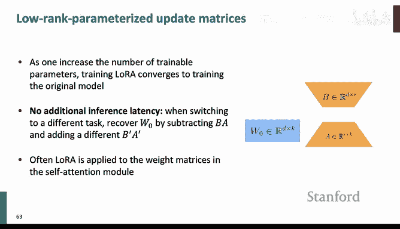
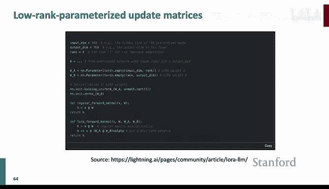
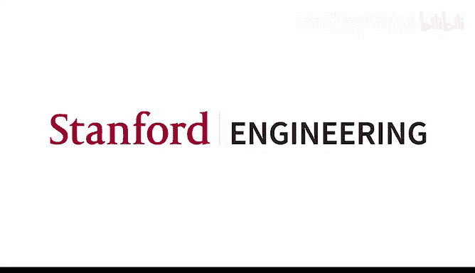

# 13：GPU训练与参数高效微调 🚀


在本节课中，我们将要学习如何利用GPU高效地训练大型深度学习模型，并了解参数高效微调技术。我们将从计算机如何表示数字开始，逐步深入到混合精度训练、多GPU并行训练策略，最后探讨如何通过LoRA等方法以更少的资源微调大模型。

---

## 计算机中的数字表示：浮点数

上一节我们介绍了课程概述，本节中我们来看看计算机如何表示数字，特别是浮点数，这对于理解后续的优化技术至关重要。

浮点数在计算机中以特定格式存储。FP32（单精度浮点数）使用32位（4字节）内存。其结构可以简化为：**1位符号位 + 8位指数位（范围） + 23位尾数位（精度）**。指数位决定了数字可表示的范围，尾数位决定了精度。

为了节省内存，我们可以使用FP16（半精度浮点数），它仅使用16位（2字节）。其结构为：**1位符号位 + 5位指数位 + 10位尾数位**。与FP32相比，FP16的动态范围更小，精度也更低。

以下是两种浮点格式关键属性的代码表示：
```python
# 在PyTorch中查看浮点属性
import torch
print(f"FP16 epsilon: {torch.finfo(torch.float16).eps}")  # 最小可加数
print(f"FP16 smallest normal: {torch.finfo(torch.float16).smallest_normal}") # 最小正规格化数
print(f"FP32 epsilon: {torch.finfo(torch.float32).eps}")
```

直接使用FP16训练神经网络会遇到两个主要问题：
1.  **下溢**：由于动态范围小，许多梯度值（通常很小）会被舍入为0。
2.  **精度损失**：更新不够精确，可能影响模型性能。

---

## 混合精度训练 🎯

为了解决FP16的问题，我们引入了混合精度训练。其核心思想是：**在内存中同时维护FP16和FP32两份模型参数副本**。

以下是混合精度训练的基本流程：
1.  维护一份FP32的“主权重”。
2.  前向传播时，将FP32权重转换为FP16进行计算。
3.  计算得到FP16的损失和梯度。
4.  将FP16梯度转换回FP32。
5.  用FP32梯度更新FP32主权重。
6.  将更新后的FP32主权重复制回FP16模型。

然而，梯度下溢问题依然存在。解决方案是**梯度缩放**：
1.  在前向传播后，将损失值乘以一个缩放因子（例如1024）。
2.  在FP16下进行反向传播，计算梯度。此时梯度也被放大了，减少了被舍入为0的可能。
3.  将FP16梯度转换为FP32后，再除以相同的缩放因子，得到真实的梯度值。
4.  用真实的梯度更新权重。

在PyTorch中，这可以通过`GradScaler`和`autocast`上下文管理器轻松实现。

但梯度缩放需要动态调整因子，较为复杂。一个更优的解决方案是使用**BFloat16**。BFloat16使用8位指数（与FP32范围相同）和7位尾数（精度更低）。其公式可表示为：**BFloat16 = 1位符号位 + 8位指数位 + 7位尾数位**。由于具有与FP32相同的动态范围，它避免了梯度下溢问题，且无需梯度缩放，在支持它的GPU（如A100）上训练更快、更省内存。

---

## 多GPU训练：从DP到FSDP ⚙️

当我们拥有多个GPU时，如何协同工作以加速训练？让我们从基础开始。

在单GPU训练中，GPU内存需要存储：模型参数（FP16）、梯度（FP16）、优化器状态（如Adam的动量和方差，FP32）。

### 分布式数据并行

分布式数据并行是最简单的多GPU训练方法。
1.  将数据集分割，每个GPU获得一部分数据。
2.  每个GPU上都有完整的模型副本。
3.  每个GPU独立进行前向和反向传播，计算本地梯度。
4.  使用**All-Reduce**通信原语在所有GPU间同步梯度（求平均）。
5.  每个GPU用同步后的梯度更新自己的模型参数，保持模型一致。

All-Reduce的通信开销是 **2字节 * 参数量**（因为梯度是FP16）。DP的主要问题是内存效率低，每个GPU都需要存储完整的模型、梯度和优化器状态。

### Zero Redundancy Optimizer

为了优化内存，微软提出了ZeRO（零冗余优化器）技术。其核心思想是**将优化器状态、梯度甚至模型参数进行分片存储**，而非在每个GPU上保存完整副本。

**ZeRO Stage 1**：分片优化器状态。
*   每个GPU只存储一部分参数的优化器状态。
*   在梯度同步时，使用 **Reduce-Scatter** 操作：每个GPU将完整梯度中属于其他GPU负责的部分发送过去。
*   每个GPU用收到的梯度更新自己负责的那部分参数。
*   更新后，使用 **All-Gather** 操作同步所有参数，使每个GPU获得更新后的完整模型。
*   关键点：**All-Reduce = Reduce-Scatter + All-Gather**。因此Stage 1在通信开销上与DP相同，但节省了优化器状态的内存。

**ZeRO Stage 2**：分片优化器状态和梯度。
*   每个GPU只存储一部分参数的梯度和优化器状态。
*   在反向传播时，每计算完一层的梯度，就立即将其发送给负责该层对应参数分片的GPU，然后释放内存。
*   这通过 **Reduce** 操作实现（将多个GPU上同一参数的梯度汇总到一个GPU）。
*   同样，最后需要All-Gather同步参数。通信开销与Stage 1基本相同，但进一步节省了梯度内存。

**ZeRO Stage 3 / FSDP**：分片优化器状态、梯度和模型参数。
*   当模型太大，单个GPU连参数都装不下时使用。
*   模型参数被分片存储在不同GPU上。
*   前向传播时，对于当前层，通过All-Gather从所有GPU收集该层完整参数，计算后释放。
*   反向传播时，再次All-Gather收集参数计算梯度，然后通过Reduce-Scatter将梯度汇总到负责对应参数分片的GPU上。
*   通信开销显著增加（两次All-Gather + 一次Reduce-Scatter），但这是训练超大模型的必要手段。

需要注意的是，FSDP的性能与如何将模型划分为“FSDP单元”的策略密切相关。

---

## 参数高效微调：LoRA 🎨

当模型过于庞大，即使使用FSDP也无法进行全参数微调时，或者我们希望以更环保、更高效的方式适配模型到新任务时，参数高效微调技术就派上了用场。

全参数微调更新模型的所有参数，存储和计算成本高昂。参数高效微调的核心思想是：**仅更新一小部分参数，或者添加一小部分可训练的新参数**。

其中，LoRA（低秩适应）是一种流行且有效的方法。它基于一个观察：大模型微调时的权重更新矩阵往往具有较低的“内在秩”。





LoRA的具体做法是：
*   对于预训练模型中的某个权重矩阵 **W** ∈ R^(d×k)，我们冻结它，不进行更新。
*   我们引入一个低秩的增量更新 **ΔW**。**ΔW** 由两个小矩阵的乘积构成：**ΔW = B A**，其中 **A** ∈ R^(r×k)， **B** ∈ R^(d×r)，秩 **r** << min(d, k)。
*   因此，前向传播公式变为：**h = Wx + (α/r) ΔW x = Wx + (α/r) BAx**。
*   其中 **α** 是一个缩放超参数，用于控制新任务知识相对于预训练知识的权重。
*   在训练过程中，只有 **A** 和 **B** 是可训练的参数，数量远少于原始参数。

LoRA的优势包括：
1.  **内存效率高**：只需存储和优化少量参数。
2.  **切换任务快**：只需替换不同的LoRA权重矩阵即可。
3.  **性能接近全微调**：即使秩r很小，也能取得很好效果。

在实践中，通常将LoRA应用于Transformer自注意力模块中的查询和值投影矩阵。超参数设置通常以秩 **r=8** 和缩放因子 **α=1** 作为良好的起点。

---

## 实践指南流程图 📋

以下是训练大模型时的决策流程图，可用于指导你的最终项目：

1.  **始终使用混合精度训练**。如果GPU支持（如A100， H100），优先使用BFloat16。
2.  **检查单卡内存**：尝试在单个GPU上运行批次大小为1的训练。
    *   **如果成功**：尝试增大批次大小，并启用ZeRO Stage 2（几乎无额外开销）来节省内存以支持更大批次。
    *   **如果失败（内存不足）**：尝试启用ZeRO Stage 3（FSDP）来分片模型参数。也可以尝试梯度检查点技术。
3.  **如果FSDP仍无法解决**：考虑使用参数高效微调技术，如LoRA。
    *   LoRA核心设置：应用于注意力层的查询和值矩阵，秩 `r=8`，缩放因子 `alpha=1`。

---

## 总结



本节课中我们一起学习了高效训练与微调大型深度学习模型的关键技术。我们从浮点表示和混合精度训练的原理出发，理解了如何节省内存和加速计算。接着，我们深入探讨了多GPU训练策略，从简单的数据并行到复杂的完全分片数据并行，了解了如何通过通信与计算重叠来扩展模型训练规模。最后，面对极致的大模型，我们介绍了参数高效微调的代表性方法LoRA，它通过低秩适配实现了以极小参数量达成任务适配的目标。掌握这些技术，将帮助你更从容地应对大规模深度学习项目的计算资源挑战。