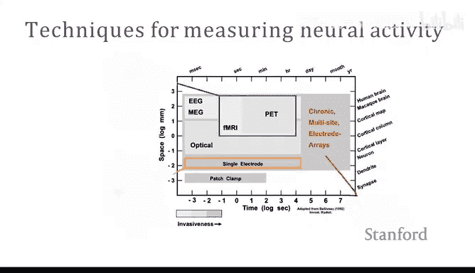
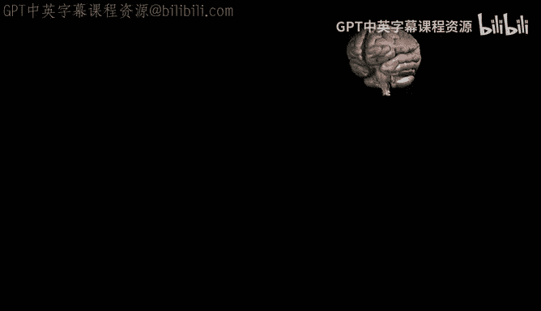
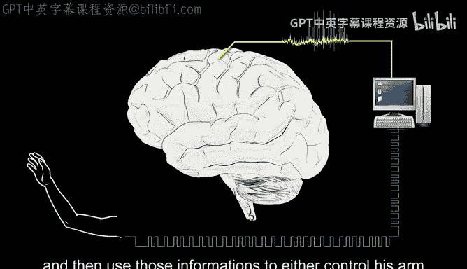
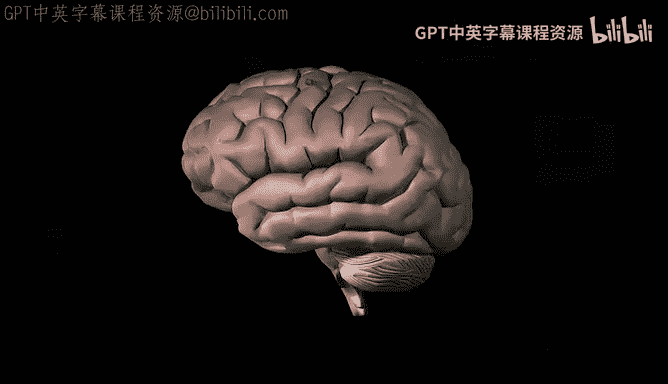
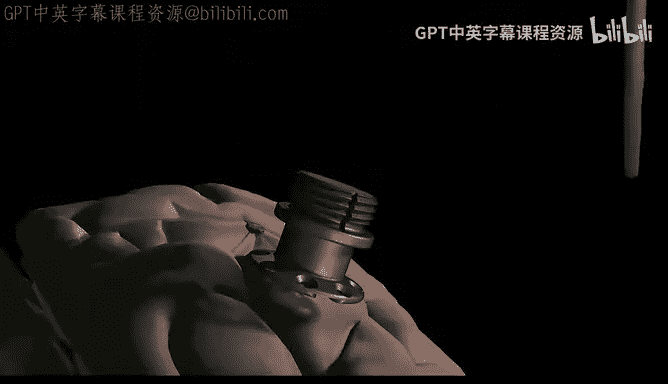
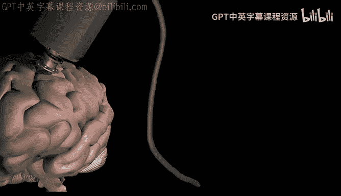
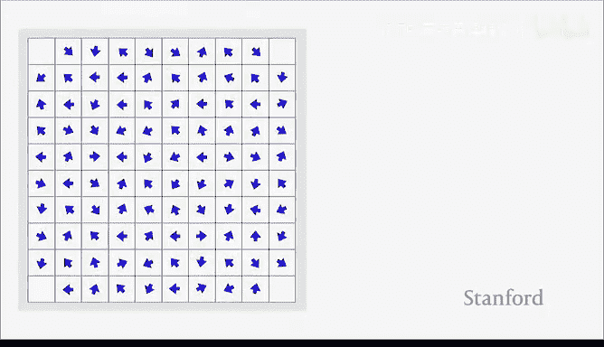
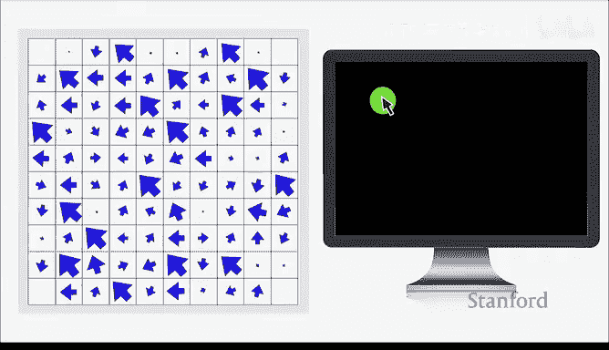

# 14：脑机接口 🧠💻

在本节课中，我们将学习脑机接口的基本原理、发展历史、技术实现以及其在帮助言语和运动功能丧失者恢复沟通方面的应用。我们将从动机出发，了解脑机接口如何工作，并探讨其未来的可能性与伦理挑战。

## 动机：为什么需要脑机接口？🎯

我们首先来看一个视频，了解为什么我们需要构建脑机接口。视频中的霍华德在21岁时因严重中风而陷入闭锁状态，他失去了所有运动能力，无法说话。他曾经喜欢外出踢足球、交朋友、表达情感，但这一切都失去了。最重要的是，他无法通过言语来表达自己，无法释放情感。

霍华德只是众多因神经系统疾病（如脑损伤、中风或肌萎缩侧索硬化症）而导致严重言语和运动障碍，甚至完全丧失言语能力的个体之一。对于他们来说，生活极具挑战性。试想一下，你无法说话，无法移动，但大脑功能却完全正常。所有的梦想都可能因此破灭。

对于像霍华德这样的人，他们与外界和亲人沟通的方式是通过辅助通信设备，例如视频中看到的字母板。字母板上有按物理方式组织的字母，对于像霍华德这样可能仍有残余眼球运动能力的人来说，他们可以用目光告诉朋友他们正在看哪里，然后朋友根据目光判断他想说的字母。想象一下，如果想说一个句子，这个过程是多么缓慢，可能需要几分钟才能表达出“你好吗？我今天感觉不舒服”这样简单的意思。

另一种替代方法是使用眼动追踪设备，这样人们就可以通过眼动在虚拟键盘上打字。但是，整天盯着电脑屏幕对他们来说非常疲劳。而且，这些人不像我们，即使他们仍有残余的眼球运动能力，移动眼睛对他们来说也非常困难，同样非常疲劳。

最近，一家名为Neuralink的公司发布了一些视频，展示了不同的可能性。该公司正在开发一种可植入头皮内部的微小设备，用于读取大脑信号。这里的希望在于，对于像霍华德这样的人，他们的大脑仍然功能完好。因此，我们希望通过这种直接与大脑交互的接口，让他们仍然能够用大脑控制电脑甚至机器人，帮助他们过上正常的生活。

这是他们的参与者纳兰的引述，他对能够使用这种最先进的脑机接口与家人联系并养活自己感到非常兴奋。对于像霍华德或许多失去身体和语言控制能力的人来说，脑机接口可以给他们带来希望。这就是我们今天要探讨的动机：我们试图利用脑机接口真正帮助这些人。

## 脑机接口简史 📜

在深入探讨脑机接口如何工作的细节之前，我们先简要回顾一下脑机接口的历史，以帮助大家理解为什么我们可以将如此微小的设备植入大脑，并突然能够解读大脑的活动。这里有很多有趣的故事。

首先，回到19世纪，一位名叫理查德·卡顿的英国科学家开始在动物身上进行实验。他发现，实际上可以从大脑中测量电活动。更重要的是，如果你让动物执行某些任务，比如移动头部，那么你可以看到它们的电活动以某种方式发生变化。我认为这是科学家们进行的早期实验，表明实际上可以从大脑中解码出一些信号。但我们仍然不知道这些电信号的确切含义。

时间快进到1924年，一位名叫汉斯·伯杰的德国科学家发明了一种叫做脑电图（EEG）的设备。基本上，它是一种可以放置在头皮外部的电极，用于测量类似波形的信号。汉斯·伯杰的发现是，首先，他是第一位发现可以从头部电极测量到这种波形信号的科学家。然后他发现，这种信号的频率根据患者的状态（功能状态）而有很大不同。例如，如果患者处于非常平静的状态，会产生大约10到20赫兹的慢速阿尔法波。如果患者睁开眼睛并执行一些认知要求高的任务，则会看到非常尖锐的贝塔波。因此，他是第一位发现可以使用这种设备测量大脑电信号的科学家。

这里还有一个有趣的故事：汉斯·伯杰曾是一名士兵。有一天他在马背上训练时摔了下来，遭受了脑震荡。他还有一个双胞胎妹妹。故事是这样的，在同一天，他的妹妹感觉有些不对劲，开始担心她的哥哥。于是，他的妹妹给他发了一封电报，询问他是否安好。这激发了汉斯·伯杰的兴趣，他认为可能存在一种叫做心灵感应的东西，可以通过这种脑波连接两个人。这就是他开始研究心理学和神经科学，并发明了至今仍在使用的脑电图（用于诊断癫痫等）的动机。

之后，人们开始使用这种脑电图设备来尝试检测大脑中的这种波状活动，并尝试控制波的频率。例如，一些音乐家开始使用脑电图设备来表演音乐。这是在20世纪50年代进行的一个非常酷的实验。你已经可以看到，人们开始有了这样的想法：实际上可以绕过你的身体，直接用大脑连接到一些外部设备并控制该设备。这里的想法是，如果我们能利用同样的想法来帮助像霍华德这样的人，也许可以帮助他们控制机械臂。

但是，这种外部测量设备（如脑电图）的问题是信号非常微弱。想象一下，你的大脑正在产生大量信号，我们知道大脑有很多神经元。神经元实际上产生大量信号。如果你只是将一些电极放在头皮上，那么你实际测量的是数百万神经元放电的平均值。打个比方，如果你试图听隔壁房间的人在说什么，但我们只能试图弄清楚这个房间里的人在说什么，我们听到的是很多声音的混合，我们可能只能分辨出他们可能处于愉快的情绪中，或者他们已经得出了结论，但无法确切知道他们想说什么。因此，这里的限制是，这种脑电图设备只能给我们提供非常低精度或低分辨率的信号。我们想要获得更好的信号。

我认为答案是尝试进入大脑内部，将电极放置在神经元旁边，直接测量这些神经元的活动。为了本次讲座的目的，我们将主要关注大脑中称为运动皮层的区域。正如你们中一些人可能已经知道的，大脑有不同的区域负责不同的任务。在大脑中心有一个称为运动皮层的区域，它基本上控制着你身体的所有肌肉。这里的希望是，如果我们能理解这里编码的神经元信息，那么也许我们可以解码这些信息，并利用这些信息帮助像霍华德这样的人控制外部手臂或再次说话。

## 基础神经科学 🧬

以下是一些非常基础的神经科学知识。我们知道有一种叫做神经元的细胞。每一个这样的东西都叫做神经元，这是神经元的胞体，这是轴突。这是另一个神经元。神经元通过称为突触的微小结构连接。如果一个神经元想要将信息传递给另一个神经元，就像在人工神经网络中一样，你有一些神经元，现在你想将信息发送到下一层，这个神经元基本上会产生一些动作电位，这只是一些电信号，用来向另一个神经元表明那里有一些信息。

如果你将电极放在这个神经元的轴突上并测量膜电位，你会得到类似这样的东西：X轴是时间，Y轴是测量的电势，然后你会看到这种非常尖锐的尖峰。如果你放大这些尖峰，你会看到神经元放电的典型特征，即电压突然上升然后下降。基本上，你在神经元处测量到的是非常尖锐的尖峰，这就是将电极放在神经元旁边会得到的结果。

那么，我们如何弄清楚在这种尖峰序列中编码了什么样的信息呢？我们可以进行一些行为任务实验。例如，假设我们仍然在监听单个神经元。这个神经元是，比如说，我们在这个实验中使用一只猴子。我们训练猴子做两件事：一件事是试图指示猴子将手向左或向右移动。然后我们测量该单个神经元放电的所有尖峰，试图了解该神经元编码了什么样的信息。

你在这里看到的是，每一行基本上是该神经元的尖峰序列，正如你在这里看到的，每条垂直线只是该神经元的一个尖峰。每一行是一次试验，一次试验意味着猴子试图朝一个方向移动它的手。然后，垂直线……你可以在这里看到，神经元在不同试验中的放电似乎略有不同。我认为这是神经元的一个基本特性：它非常嘈杂。不像在人工神经网络中，你输入一些东西，总是得到一些输出。而在真实的神经网络中，在真实的神经元中，事物非常嘈杂。因此，有时它们在相同的实验条件下放电稍快，但有时放电稍慢。

在这里，我们试图测量的是，当猴子将其肢体向左或向右移动时，这个神经元编码了什么样的信息。然后，我们还可以将这些信息编码分为两个阶段：准备阶段和执行阶段。执行阶段意味着猴子实际上正在移动它的手臂，而准备阶段意味着猴子正准备移动，但保持手臂固定。它实际上会在这个“开始”时间移动它的手臂。你可以在这里看到，这个神经元似乎在执行阶段（当猴子的手向右移动时）放电很多。当猴子准备向左移动时，它也放电稍多。这意味着也许这个神经元编码了一些运动方向。

基本上，如果你能对许多不同的神经元和许多不同的方向重复这些实验，最终科学家们发现，对于单个神经元，如果你将该神经元的放电率（即每秒产生多少尖峰）拟合到不同的运动方向，你可以拟合出一种余弦调谐曲线。这个调谐曲线的含义是，Y轴是放电率，水平轴是运动方向。这个神经元在运动方向为某个参考方向的180度时最喜欢放电，然后放电逐渐减少。

这就是科学家们发现的关于单个神经元如何编码运动信息的第一件事。然后，如果你测量多个神经元，你会发现每个神经元可能编码非常不同的信息。例如，这里的这个神经元，它的调谐曲线稍微向右偏移，幅度也向下偏移。因此，它的偏好方向可能在250度左右。现在，有了两个神经元，你实际上可以解码出更多关于预期运动方向的信息。例如，对于单个神经元，假设现在我测量的放电率约为每秒30个尖峰，那么可能有两个运动方向：120度和240度。然而，有了第二个神经元，你可以看到，假设我们测量第二个神经元每秒放电约5个尖峰，那么我们可以精确地确定实际运动方向是120度，而不是另一个。

然而，我们知道神经元有一些噪音，所以我们实际上不能仅用两个神经元来确切地判断运动方向。例如，在第三种情况下，由于噪音，实际的、真实的地面实况放电率是那些灰线，但由于噪音，放电率稍微偏移到那些虚线。你可以看到，如果我们能解码运动方向是120度，但在这种情况下，可能性变成了有四种可能性，我们不能唯一确定。

然而，你可以看到，也许猴子试图移动的方向更可能是120度左右，而不是50度左右，另一个则更像是大于240度。那么，我们如何处理这种嘈杂的神经元呢？我们如何仍然能够更准确、唯一地从这种多神经元记录中解码预期的运动呢？

我认为我们基本上可以在这里使用机器学习。我们可以将其视为一种分类问题。这里我们绘制的是，每个点基本上是两个神经元的放电组合，颜色基本上代表了预期的运动方向。然后，如果你以某种方式在这里训练一个机器学习分类器，那么你基本上可以看到我们可以绘制一些决策边界，比如说在右侧，如果我们得到的新测量值的放电率以某种方式落在这里，那么我们可能知道猴子正试图向左方向移动。

所以，我想在这里，我们知道我们可以进行这种单神经元测量。我们可以测量多个神经元的放电率。然后通过训练机器学习模型，我们可以使用这些带有神经数据的机器学习模型来推断可能的运动方向。这就是我们如何构建脑机接口的方法。

## 如何记录这些信号？📡

现在，我们基本上知道我们可以将一些电极推入大脑的运动皮层，测量一些信号。然后我们知道神经元如何编码这些信号。然后我们也可以构建一个机器学习解码器来解码这些信号。基本上，我们有一些方法能够构建脑机接口，以便我们能够解释一个仍然功能完好、完全正常的大脑试图做什么。

还有一件事是，我们如何记录这些信号。这是一张非常复杂的图，但不用担心所有细节。我想在这里展示的是，基本上有很多不同的技术可以用来记录大脑信号。但当你考虑这些技术时，你可以将其视为在这种二维空间中。Y轴是关于空间分辨率。所以，你在Y轴上走得越高，意味着你基本上可以测量大脑的非常大区域的平均大脑活动。而如果你沿着Y轴向下走，意味着你实际上可以测量到非常精细的尺度，例如单个神经元。

而这里的水平轴意味着时间分辨率。这意味着对于像这种单神经元记录这样的技术，你基本上可以测量每个时间点（例如1毫秒）该单个神经元的电势。而对于像功能磁共振成像这样的记录技术，它基本上测量的是小脑区域的血液流动，它只能测量大约5秒或1秒内该小脑区域的平均血液流动变化。这真的是很多信息的平均，因为我们知道神经元放电速度非常快，神经元的电势变化通常在1毫秒的数量级。如果你只能测量大约1秒的东西，你基本上是在平均、平滑掉很多信息。

理想情况下，我们希望同时具有高空间分辨率和高时间分辨率。目前，在我们实验室的许多临床试验中，我们将使用这种微电极阵列。每个电极就像一根微小的针，可以测量几个神经元的信号，然后将这些针插入一个像指甲大小的小方块中，你可以测量大约数百个神经元。

## 脑机接口应用示例：恢复运动与沟通 🎮

现在，我们有了这种设备来测量神经元。让我们举一个更具体的例子，看看我们如何做到这一点。

假设某人患有脊髓损伤，失去了与身体的连接。他的思维仍然完全正常。这里的问题是，我们是否仍然可以从他的运动皮层解码出什么样的信息，以便我们可以解码这些信息，然后利用这些信息控制他自己的手臂或人工手臂。

我们要做的是尝试将这种微电极阵列放入他的运动皮层，真正穿透他的运动皮层表面。每个电极，正如你在这里看到的，是这种微小的针，那些灰色三角形是神经元的大小。因此，每个电极可能测量其周围多个神经元的局部场电位。

我们可以实时将所有信息通过这种电线传输到计算机。然后，我们在计算机上得到的是，例如，这里的每个方块基本上是那个电极的测量值。如果我们进行一些行为实验，就像我们刚才展示的那样，我们也许可以找出每个电极的调谐曲线。例如，这个电极的偏好方向可能是向左。我们可以为其他通道重复行为实验，可能训练一个机器学习解码器来找出每个通道编码的偏好方向。

一旦我们训练了解码器，那么在测试时，我们基本上可以要求我们的参与者（他植入了脑机接口）尝试想象将手移动到某个方向。然后解码器试图找出他试图移动的方向。这就是基本思想。

让我展示一个演示。这是我们实验室在2017年发表的一项研究。在这里，你看到一位参与者正在用她的思维在虚拟键盘上打字。底部显示的是打字速度，以每分钟正确字符数衡量。它最高达到40，平均可能在20左右。我认为这真的很神奇，想想像霍华德这样的人，过去必须使用这种字母板来沟通。现在，有了这种脑机接口，他可以通过电脑完全自主地进行沟通。这比字母板有了巨大的改进。

在这个实验中，她仍然睁着眼睛。即使她闭上眼睛，它仍然有效，但她不会有视觉反馈，她不知道她在哪里打字。如果她想输入一个字符，不看键盘的话。好的，这是我接下来要展示的内容。

参与者是在复制一个句子，所以我们知道地面实况，然后我们可以测量错误率。点击动作或选择动作是否容易区分？或者是否有某种方式知道用户正在按下？或者她是否想象一个鼠标？实际上，这是一个非常好的问题。正如我刚才提到的，我们可以解码运动，我们也可以解码不同的手势，比如移动肘部。因此，她可以想象不同的运动，然后我们基本上可以将解码出的这些运动映射到点击信号或不同的信号。

这基本上只是展示了基于我们对大脑的了解，我们可以从像T6（她的代号）这样的人身上解码一些尝试的运动，我们真的可以通过这种脑机接口帮助这类人重新获得沟通能力。

正如我之前提到的，你也可以使用脑机接口来控制机械臂。例如，在这种情况下，参与者是加州理工学院的T6，他正在用他的思维控制这个机械臂，为他拿一杯饮料。此外，你还可以做一些事情，比如恢复工作能力。正如刚才有人提到的，也许我们可以尝试恢复不同的沟通方式。例如，刚才我们只是使用运动，然后通过恢复运动来控制电脑。但是，我们直接恢复书写能力怎么样？因为书写是一种非常自然的沟通方式。因此，我们实验室的研究员弗兰克·威利特在2021年发表了一篇论文，展示了你实际上可以实现这种书写脑机接口，并且表明它实际上比之前的方法快得多。

## 恢复言语：更高的挑战 🗣️

现在我们已经看到，有不同的方式来恢复沟通。这里只是不同沟通方式的测量结果。在最左边的是吸吹接口，非常慢。基本上，这意味着对于某些不能真正移动但还能呼吸的人来说，他们可以通过吸气和吹气来表示“是”和“否”来沟通。这非常慢，可能每分钟5个单词。对于一个正常人，我真的很惊讶平均每分钟只能写大约13或14个单词。这真的很慢，但也许这只是平均速度。

在最右边的是自然沟通，每分钟可以达到150到160个单词。把一切都放在这里来看，我刚才向你们展示的二维光标每分钟可以做8个单词，书写每分钟可以做大约18个单词。因此，与字母板或这种眼动追踪相比，我们确实取得了很大进步，但仍然远远低于自然对话的速度。

所以，下一个问题基本上是，我们如何才能达到那个水平？我们能否通过脑机接口真正恢复自然的言语？我认为这里存在一个巨大的障碍。首先，大脑中的语言处理是一个非常复杂的过程。例如，这里显示了所有涉及语言的大脑区域。我们仍然不知道这究竟是如何发生的，但这只是我们对语言在大脑中如何处理的最佳猜测。在最右边，你看到有很多与知识和推理相关的大脑区域，中心可能是涉及语义和句法的区域，最左边是关于言语感知和言语产生的区域。

语言非常复杂，所以也许这里的希望是我们可以从运动皮层开始，从语言的运动规划开始，因为刚才我向你们展示的，我们已经知道运动皮层如何编码运动，我们也知道为了产生语言，我们需要说话。然后，也许我们可以将一些电极放入运动皮层的这个部分，这个部分实际上控制我们的口面部肌肉。然后尝试在那里解码一些信息，看看我们是否真的能恢复言语。

实际上，能够恢复言语比恢复运动更复杂。我想说的是，言语的产生真的是很多复杂的运动，而且非常迅速。它不仅仅是把手移动到某个方向。因此，恢复言语比仅仅解码每个发音器官的运动要困难得多。

与其试图解码每个发音器官的运动，因为这非常困难，而且对于像霍华德这样失去言语能力的人来说，实际上很难测量他们的发音器官运动。相反，也许我们可以尝试解码这种离散的音素，而不是这种连续的言语发音器官运动，因为我们知道所有语言都可以分解为这种基本的语音单位。例如，对于英语，我们知道有不同的元音和不同的辅音。它们与你在口中放置舌头的方式以及你放置不同发音器官的方式相关。因此，这里我们试图解码的不是实际的发音器官运动，而是这种离散的音素标记。

之前有研究表明，如果你在运动皮层上放置一些电极，那么你实际上可以通过测量运动皮层中的电活动来区分不同的音素。因此，有可能仅仅通过将电极放入运动皮层来恢复言语。

事实上，在2021年，加州大学旧金山分校的研究人员证明，使用这种皮层脑电图记录技术构建这种小词汇量言语脑机接口是可行的。皮层脑电图和微电极阵列之间的区别在于，微电极阵列实际上穿透皮层，而皮层脑电图停留在皮层表面。因此，它不记录单个神经元放电，仍然记录小区域上的一些平均神经活动。因此，与微电极阵列相比，它的分辨率稍低。这就是为什么他们的原型是这种小词汇量脑机接口，只能以大约75%的准确率解码50个单词。但这仍然是非常令人兴奋的工作，展示了通过将一些电极放入运动皮层，你实际上可以实现言语解码。

## 我们实验室的研究：高性能言语神经假体 🏆

好的，现在我将介绍我们实验室进行的研究，即构建高性能言语神经假体。在2022年，我们招募了一位代号