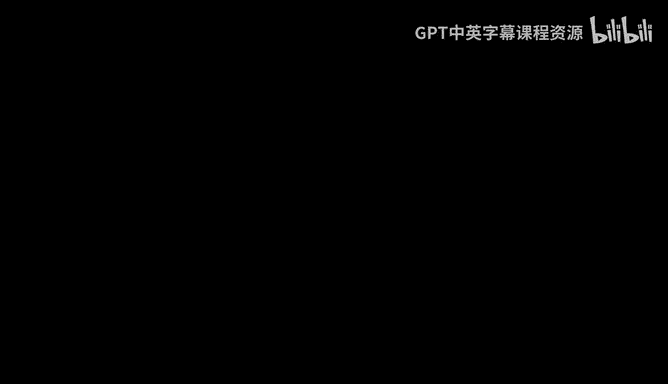
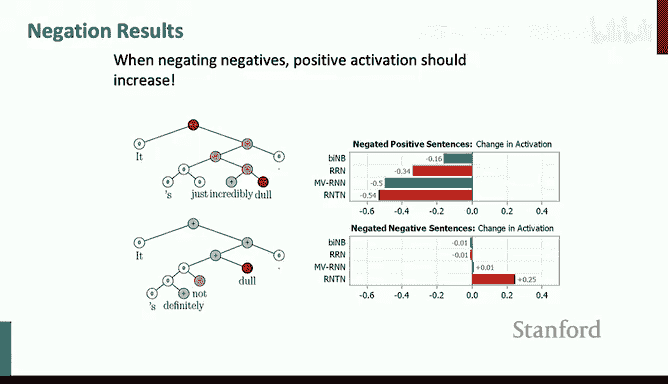
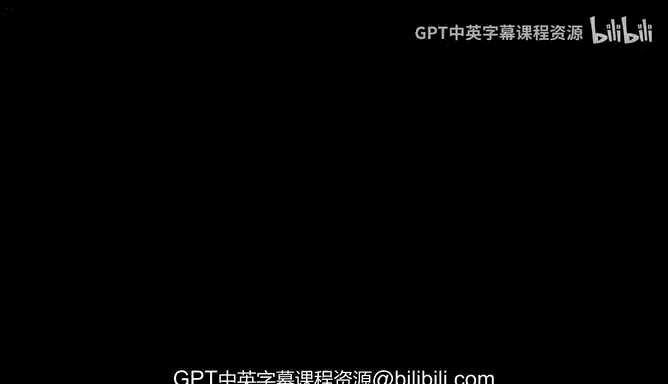

# 17：卷积神经网络和树递归神经网络 📚

## 概述
在本节课中，我们将学习两种用于自然语言处理的神经网络技术：卷积神经网络（CNNs）和树递归神经网络（Tree RNNs）。虽然这些技术如今已不如Transformer模型那样被广泛使用，但了解它们有助于我们理解NLP领域的技术演进和不同思路。

---

## 卷积神经网络（CNNs）在NLP中的应用 🧠

上一节我们介绍了课程背景，本节中我们来看看卷积神经网络如何应用于语言处理。

与循环神经网络（RNNs）按顺序处理句子不同，卷积神经网络的基本思想类似于N-gram模型。它能够处理单词的N-gram（如二元组或三元组），并为每个N-gram生成神经表示。

### 卷积操作的基本原理
在视觉领域，卷积神经网络通过滑动一个由权重定义的“掩码”（或过滤器）在图像上操作，计算每个位置的得分。对于语言，我们处理的是一维的单词序列，而非二维图像。

以下是处理一个句子“tentative deal reached to keep government open”的示例步骤：
1.  每个单词用一个词向量表示（例如，4维向量）。
2.  定义一个应用于三元组的过滤器。
3.  将该过滤器沿序列向下滑动，计算过滤器与每个三元组的点积，得到一个值。
4.  通常，我们会加上一个偏置项，并通过一个非线性函数（如Sigmoid）进行处理。

这样，我们就为每个三元组计算出了一个值。这个过程就是单过滤器的卷积操作。

### 多过滤器与池化操作
通常，我们会使用多个过滤器来捕获文本的不同特征。

以下是处理多过滤器的步骤：
1.  定义多个过滤器，每个过滤器可能关注不同的语言特征（例如，人称代词“I, my, we, our”或言语动词“think, say, told”）。
2.  为每个过滤器和每个N-gram计算一个值，从而得到一个新的向量表示。

为了汇总所有过滤器的信息，最常用的方法是**最大池化（Max Pooling）**。最大池化的思想是：每个过滤器就像一个特征检测器，我们只关心该特征是否在文本的任何位置被强烈激活。因此，我们取每个过滤器在所有位置上的最大值作为该特征的最终输出。

另一种方法是**平均池化（Average Pooling）**，它计算特征在所有位置上的平均值。虽然有时也会使用，但实践表明，对于神经网络学习到的特征类型，最大池化通常更有效。

### PyTorch实现
在PyTorch中，可以使用`Conv1d`来实现一维卷积。关键参数包括：
*   `out_channels`: 过滤器的数量。
*   `kernel_size`: 过滤器的大小（例如，对于三元组，大小为3）。
之后，可以使用最大池化操作来汇总结果。

### 其他卷积变体
除了基本的卷积和池化，还有一些其他技术：

以下是几种可选的卷积操作：
*   **步长（Stride）**: 控制过滤器滑动的步幅。例如，步长为2意味着过滤器每次移动两个位置，减少了N-gram之间的重叠。
*   **局部最大池化（Local Max Pooling）**: 不是在整个序列上进行全局最大池化，而是在局部窗口（例如，每两个元素）上进行池化，可以保留更多位置信息。
*   **K-max池化（K-max Pooling）**: 保留每个通道中前K个最大值，而不是仅保留一个最大值，可以检测特征是否在多个位置出现。
*   **扩张卷积（Dilated Convolution）**: 允许过滤器跳过一些位置来组合元素，从而在不增加参数的情况下扩大感受野。这在语音处理中比在自然语言处理中更常见。

---

## 经典CNN模型案例研究 📄

上一节我们介绍了CNN的基本工具，本节中我们来看看两个利用卷积进行自然语言处理的经典工作。

### 1. Yoon Kim的句子分类模型（2014）
这是将CNN应用于NLP最著名的早期工作之一，主要用于情感分类等句子分类任务。

该模型的核心流程如下：
1.  获取句子中每个单词的词向量。
2.  应用多种不同尺寸（如二元组、三元组、四元组）的卷积过滤器。
3.  对每个过滤器的输出进行最大池化，得到一个标量值。
4.  将所有过滤器的池化结果拼接成一个固定长度的句子向量。
5.  将该向量输入一个简单的Softmax分类器，得到最终分类（如正面/负面情感）。

该模型的一个创新点是处理了**词向量微调（Word Vector Fine-tuning）** 的难题。在小型监督数据集上微调预训练词向量时，未出现在训练集中的词其向量不会更新，可能导致语义关系混乱。Yoon Kim的解决方案是：为每个过滤器通道创建两个副本，一个使用可微调的词向量，另一个固定使用原始词向量，从而兼顾了两者的优点。

实验表明，这个简单的CNN架构在当时的情感分析等任务上取得了非常有竞争力的结果。

### 2. 深度字符级CNN（VD-CNN， 2017）
这个模型试图将视觉领域成功的“深度”和“原始信号处理”理念引入NLP。

以下是VD-CNN架构的主要特点：
*   **输入**: 原始字符，而非单词。
*   **架构**: 非常深的卷积网络（如29层），包含卷积块、残差连接和局部池化。
*   **过程**: 从字符级表示开始，通过多层卷积和池化，逐渐组合成更大的文本单元表示。
*   **输出**: 使用K-max池化保留最重要的激活，最后通过全连接层进行分类。

该模型在多个文本分类数据集上达到了当时的先进水平，证明了仅从字符开始，通过深度CNN也能有效进行文本理解。

---

## 树递归神经网络（Tree RNNs）🌳

上一节我们探讨了基于序列和N-gram的CNN模型，本节中我们来看看另一种基于语言结构的思路：树递归神经网络。

人类语言具有**递归的层次化结构**，即相同的句法结构可以嵌套在自身内部。树递归神经网络的目标就是根据句子的短语结构树，自底向上地组合词向量，为每个短语计算出一个语义表示。

### 基本原理
最简单的树递归神经网络操作如下：
给定两个子节点（词或短语）的向量表示 `c1` 和 `c2`，父节点向量 `p` 通过以下方式计算：
`p = f(W * [c1; c2] + b)`
其中，`[c1; c2]` 表示向量拼接，`W` 是权重矩阵，`b` 是偏置，`f` 是非线性激活函数。同时，还可以用另一个参数向量对 `p` 进行点积，得到一个分数，用于判断这个组合是否构成一个合理的句法成分。这个分数可以用于构建贪婪句法分析器。

### 递归神经张量网络（RNTN）
为了更灵活地处理不同的语义组合方式（例如，“红球”中形容词修饰名词，与“踢球”中动词支配宾语的方式不同），我们提出了**递归神经张量网络（RNTN）**。

RNTN的核心是引入了**神经张量层**。它不再仅仅是将子向量拼接后做线性变换，而是学习一个三维张量，允许子向量之间进行更复杂的 multiplicative interactions，从而能根据组合类型动态调整语义计算方式。

### 在情感分析中的应用
我们在**斯坦福情感树库（Stanford Sentiment Treebank）** 上应用了RNTN。这个数据集不仅标注了整个句子的情感，还标注了句子中每个短语的情感，为模型提供了更丰富的监督信号。

RNTN模型能够正确建模复杂的语义组合现象，尤其是**否定（Negation）** 的语义作用。例如：
*   它能理解“incredibly dull”（非常无聊）整体仍是负面的。
*   更重要的是，它能正确判断“definitely not dull”（绝对不无聊）是正面的，即对负面词的否定会使其转向正面。这一点是简单的N-gram模型或早期的Tree RNN难以做到的。

尽管Transformer模型在整体性能上远超Tree RNN，但在精确建模某些语义组合（如否定、量化词的作用范围）方面，基于树结构的模型在理念上仍有其优势。

---

## 总结
本节课我们一起学习了两种重要的神经网络架构在NLP中的应用。

首先，我们探讨了**卷积神经网络（CNNs）**。它通过滑动过滤器捕获局部N-gram特征，并利用池化操作（尤其是最大池化）来汇总信息，在文本分类任务上表现优异。我们分析了Yoon Kim的经典句子分类模型和深度字符级VD-CNN模型。

其次，我们介绍了**树递归神经网络（Tree RNNs）**。这种模型受语言递归结构启发，沿句法树自底向上组合语义，能够更精细地建模短语含义。递归神经张量网络（RNTN）通过引入张量操作增强了组合的灵活性，并在细粒度情感分析任务上展示了其捕捉复杂语义组合（如否定）的能力。

虽然当前Transformer模型已成为主流，但了解CNN和Tree RNN的历史贡献和独特视角，对于全面理解NLP技术的发展脉络和未来可能的融合方向仍然非常有价值。