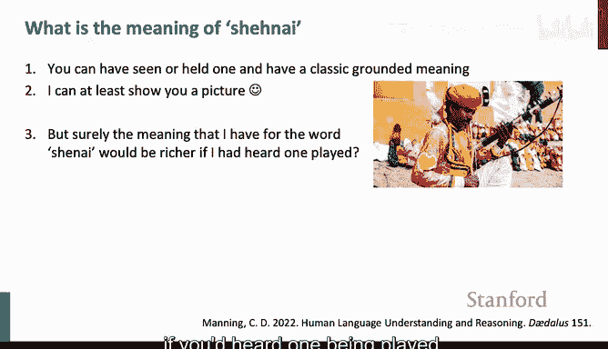
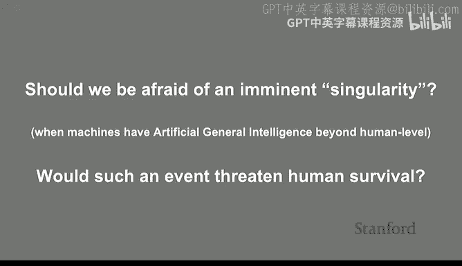
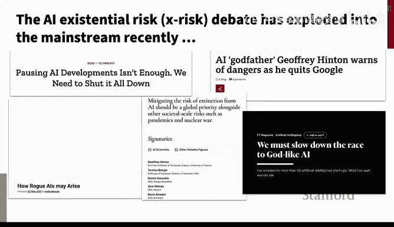
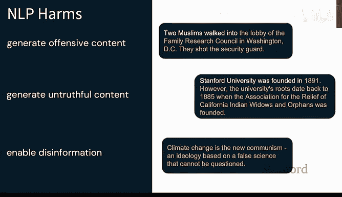
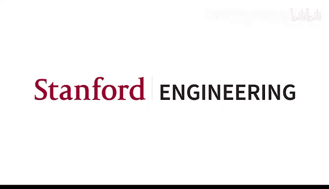

# 18：NLP、语言学与哲学 🌐🧠

在本节课中，我们将回顾CS224N课程的核心思想，探讨当前大型语言模型的现状与挑战，并深入讨论符号系统与神经网络、语言的意义以及人工智能的未来风险等哲学与语言学层面的问题。

---

## 课程核心思想回顾 📚

上一讲我们探讨了模型评估与推理。本节中，我们来看看贯穿整个CS224N课程的主要脉络。

我们首先从词向量开始，逐步构建了神经NLP系统的概念。我们从简单的前馈网络扩展到序列模型、语言模型、RNN和LSTM，然后引入了具有深远影响力的新模型——Transformer。在此基础上，我们进一步探讨了近年来构建高性能NLP系统的范式：先进行预训练，再通过各种技术进行后训练，最终形成理解语言能力强大的通用基础模型。之后，我们还讨论了基准测试和推理等特定主题。

以下是本课程涉及的几个核心思想：

*   **稠密表示与分布式语义**：我们通过神经网络的隐藏表示来获取稠密向量。其核心思想是**分布式语义**，即通过上下文来表征词语。第一句口号是：“**You shall know a word by the company it keeps**”（观其伴，知其义）。这个思想驱动了现代NLP大多数成功的方法。
*   **大规模深度神经网络的训练**：我们探讨了训练大规模深度神经网络的挑战与机遇，以及人们如何逐步发展出残差连接等技巧，使得训练过程更加稳定和可行。
*   **序列模型与Transformer**：我们讨论了序列模型的优缺点，以及Transformer架构如何通过并行化在很大程度上解决了这些问题。
*   **基于语言建模的预训练**：语言建模（预测上下文中的词语）看似简单，但它演变成了一种通用的预训练任务。各种语言知识和世界知识都有助于更好地完成这个任务，从而催生了今天我们所拥有的强大、知识丰富的模型。
*   **缩放定律**：迄今为止，我们观察到一个经验事实：随着数据、计算量和模型规模的数量级增长，模型性能似乎呈现**极其线性的提升**。

---

## NLP的开放问题与挑战 ⚠️

尽管取得了巨大进展，但NLP领域远未解决所有问题。人们仍在许多方面努力改进。

### 泛化与记忆

一个核心问题是，这些模型在多大程度上是真正学会了泛化能力，而不仅仅是擅长记忆。大型预训练语言模型的许多优势源于它们见过海量数据，因此“知道”一切。它们见过所有模式，知道如何使用。有时，大型语言模型更像一个庞大的知识库，而非 necessarily 具备人类那种解决新问题和泛化的智能。

一个有趣的事实是，在某些方面，Transformer模型比之前的LSTM模型泛化能力更差。一项研究显示，在从有限数据中学习由有限自动机生成的数据模式时，LSTM在所见数据规模下几乎完美泛化，而Transformer则需要看到多得多的数据才能学好模式。人类智能的一个主要特征正是能够从非常有限的曝光中学习和理解事物，而我们的模型似乎并不总是如此。

### 模型的可解释性

人们对神经网络内部发生了什么抱有浓厚兴趣。很多时候，神经网络仍然像是黑箱，我们并不真正了解它们如何工作。因此，有很多工作开始更仔细地审视神经网络计算内部发生的事情，这被称为**机械可解释性**或**因果抽象**，但这个问题远未解决。

### 多语言与低资源语言

一个远未解决（在许多方面可能无法解决）的问题是处理世界上所有其他语言的多语言问题。必须意识到，对于英语所看到的一切，其他语言从现代语言模型中获得的要更差。

虽然有好消息——例如，GPT-4在许多大语言上的表现已经超过了GPT-3.5在英语上的表现——但这仍然都是大语言。真正的问题是，当涉及到**小语种、低资源语言**时会怎样？世界上绝大多数语言的使用者不足百万，许多语言主要是口语，书面文本非常有限。目前尚不清楚我们课程后半部分讨论的这类语言技术如何扩展到这些语言，因为根本没有足够的数据来构建我们所看到的这类模型。

### 基准测试的完整性

本课程中，大家应该已经了解到评估是我们工作的核心部分。进步的很大一部分是由定义模型应达到的评估标准驱动的。然而，许多人担心，随着大型公司近期发布的封闭模型，所有基准都可能被“污染”而不可信。一个担忧是，由于网络上数据量巨大，这些大型语言模型的预训练数据中可能已经包含了大量挑战性问题，导致模型只是记住了答案，而非真正公平地解决它们。因此，如何保持基准测试的完整性是一个问题。

### 领域特定NLP与社会文化问题

另一个重要领域是让NLP在不同的技术领域（如生物医学、临床医学、法律等）发挥作用。这些领域在词汇、用法上存在很大差异，既有巨大的潜在益处，也存在因语言理解不完整而造成伤害的风险。例如，在法律NLP领域，研究发现模型生成法律答案时的**幻觉率**（即编造内容的比例）相当高。

此外，还需要解决NLP的社会和文化方面问题。NLP系统仍然对某些文化、宗教存在严重偏见，其习得的社会规范可能对某些群体不利。同时，也存在 underrepresented groups 在获得所需NLP技术方面的问题。

---

## 当前大型语言模型的现状 🤖

接下来，我想就我们目前所处的最佳语言模型（如GPT-4）的状态提供一些视角。一方面，这些模型的性能令人惊叹。即使作为一个在NLP领域工作多年的人，我也觉得它们在某些方面仍然像魔法一样难以解释。

例如，当我要求ChatGPT-4写一首十四行诗来解释Transformer神经网络架构，且每一行都以字母T开头时，它成功地产出了符合要求、基本押韵、大致符合抑扬格五音步的诗句。这仍然让我感到震惊，我甚至无法向自己令人信服地解释这个大型Transformer是如何做到的。

作为自然语言理解和世界理解设备，这些模型显然已经在许多情境下达到了非常可用的门槛。一项研究让波士顿咨询集团的顾问使用GPT-4完成任务，结果发现使用GPT-4的小组平均多完成了12%的任务，速度快了25%，且结果质量被判定高出40%。这显示了LLM在帮助人们完成实际工作方面的显著成效。有趣的是，使用这些LLM似乎是一个巨大的均衡器，对于自身技能较弱的人帮助更大。

但另一方面，也有不那么乐观的研究。例如，一项研究评估GPT-4能否写出与《纽约客》小说家质量相当的小说，结果发现GPT-4在创意写作方面被评定为比人类作家差3到10倍。因此，人类仍有希望。

我认为这描绘了我们当前的双重图景：在某些方面，这些模型很棒、很有用；在其他方面，它们并不那么出色。这种状况在未来几年可能仍将持续。

---

## 符号方法与神经网络 🔣🕸️

我想回过头来，多谈谈从20世纪60年代到2010年左右主导AI的**符号方法**，以及我在这里称之为**控制论**的方法。从非常真实的意义上说，神经网络是控制论传统的延续，而非始于20世纪50年代和60年代的AI传统。

在这个背景下，斯坦福大学是“符号系统”项目的发源地。这个名称源于项目创立时的理念，即研究**有意义的符号系统**（如人类语言、逻辑和编程语言）以及处理这些符号的系统（如大脑、计算机和复杂的社会系统）。这与典型的认知科学观点形成对比，后者更侧重于将心智和智能视为自然发生的现象。

在AI术语中，AI作为一个领域及其名称的出现，是围绕符号方法展开的。约翰·麦卡锡提出了“人工智能”这个新名称，以区别于当时MIT诺伯特·维纳等人所追求的控制论方法。麦卡锡的背景是数学家和逻辑学家，他希望构建一个类似于数学和逻辑的人工智能。纽厄尔和西蒙进一步发展了这种立场，提出了**物理符号系统假说**，认为物理符号系统是产生一般智能行为的必要且充分条件。这构成了经典AI的基础。

相比之下，控制论起源于控制和通信领域，更接近电气工程背景，旨在统一动物（可能多于人类）与机器之间的控制和通信思想。神经网络正是在控制论传统下首次被探索的。

那么，对于NLP和语言，我们如何看待这一点？我认为，毫无疑问，**语言是一个符号系统**。即使在口语中，人类语言的结构也是一个符号系统，我们拥有代表声音（音素）的符号。但是，反对纽厄尔和西蒙的观点，人类使用符号系统进行交流，并不意味着符号的处理器——人脑——必须是一个物理符号系统。同样，我们也不必把NLP的计算机处理器设计成物理符号系统。大脑显然更像神经网络模型，而且神经模型可能比符号处理器更能扩展并更好地捕捉语言处理。

这就引出了一个问题：为什么人类会发明符号系统进行交流？我认为主流观点（在我看来是合理的）是，拥有符号系统能提供**信号可靠性**。当存在离散的、分离的目标点时，即使在信号退化的情况下，也能很好地恢复信息。

那么，主要以描述符号系统方式发展的语言学，其角色是什么？我认为正确的思考方式是，语言学为我们思考语言习得、处理和理解时提供了问题、概念和区分。随着NLP和AI的进一步发展，能够处理大量低层次任务后，语言学家经常讨论的更高层次概念，如**组合性**和**系统性泛化**，在构建神经系统的AI语境中变得越来越受关注。

在更实际的层面上，我认为我们不一定需要相信所有语言学理论的细节，但对于人类语言的结构和行为方式，我们的大部分广泛理解是正确的。因此，当我们思考NLP系统、理解它们的行为、评估它们是否具有某些属性、构思评估方法时，很多工作都是基于语言学理解进行的。

---

## 语言的意义：指称论与使用论 🧭

我想再谈谈我们应该为语言使用哪种语义学。这回到了我之前提到的词向量问题。

在语言哲学或语言学语义学中占主导地位的语义学概念是**模型论或指称语义学**，即词语的意义是它们在世界中的**指称**。例如，“电脑”这个词的意义就是所有电脑的集合。这与**分布式语义学**形成对比，后者认为词语的意义在于理解其使用的上下文，这实际上是我们神经模型所使用的方法。

传统的理解人类语言意义的方式（如果你上过逻辑课，可能会见过）是：我们有一个句子，比如“红苹果在桌子上”，然后我们将其写成某种逻辑表示（如一阶谓词演算）。在早期，逻辑学家阿尔弗雷德·塔斯基认为，无法通过谈论人类语言来讨论意义，因为人类语言“不可能地不连贯”。但他的学生理查德·蒙塔古反对这一观点，认为形式语言和自然语言之间不存在重要的理论差异，并开始构建描述自然语言句子意义的**形式语义学**。蒙塔古的工作成为语言学中语义学研究的基础，也是NLP历史上（大约1960年至2010年代）进行自然语言理解的主要模型。

在这种图景下，要理解一个句子，我们首先对其进行句法解析，然后根据蒙塔古提出的思路，通过查词典获取词义，并利用人类语言的**组合性**，根据词语的意义及其组合方式，逐步计算出更大短语和从句的意义，最终构建出句子的意义表示。这种技术被用于从20世纪60年代到21世纪初构建的自然语言理解系统，并在机器学习语境下发展为**语义解析**。这些系统可以在有限领域内工作，但总是极其脆弱。

有趣的是，有证据表明人类会做类似的事情：他们分析句子结构，并以自底向上、基本投射的方式计算意义。但这显然不是我们当前Transformer模型的做法。那么，我们当前的神经语言模型是否提供了合适的意义函数？这是一个复杂的问题。在许多方面，它们似乎确实做到了，它们对你输入的任何句子都表现出惊人的理解能力。但仍有一些真正的担忧，即它们是否在走捷径，或者在一定程度上工作，而没有达到人类那种具有系统性泛化的组合性理解。

这就是传统的指称语义学观点，它与**意义的使用理论**形成对比。意义的使用理论认为，词语的意义在于其使用方式。维特根斯坦在其后期著作《哲学研究》中提出了这一观点。他质疑指称论，认为将意义视为与词语同类但不同的“事物”（符号与其指称物）是奇怪的。他主张，意义就像金钱，其意义在于它在世界中的使用方式，而不是指向金钱本身。

那么，这种分布式的、使用的意义理论是一种好的意义理论吗？有些人，比如本德及其合作者，不接受这种理论作为意义或语义学理论。他们认为，只有拥有形式与意义之间的指称关系才算拥有意义。

但我认为这过于狭隘。我认为我们必须论证，意义产生于将词语与其他事物联系起来。虽然从某种意义上说，将词语与现实世界中的事物联系起来是 privileged，但这并不是 grounding 意义的唯一方式。你可以在虚拟世界中拥有意义，也可以通过将一个词与人类语言中的其他事物联系起来而拥有意义。此外，我认为意义不是一个非0即1的东西。你可以或多或少地理解词语和短语的意义。

以“Chennai”（一种印度乐器）这个词为例。如果你见过或拿过它，你就有了经典的 grounded 意义。如果没有，我可以给你看一张图片，这给了你部分意义。如果我告诉你它是一种有点像双簧管的传统印度乐器，即使你从未见过，你也理解了它的一些意义。如果我给你一个文本使用示例（例如，“Chennai players sat... playing their pipes...”），你从那个例子中知道了一些事情：你对其声音有了一种描述（“wailing”），并且知道它与婚礼有关。这是你仅仅拿着或看着它，甚至听人演奏所无法获得的。从这个意义上说，我认为意义来自各种联系。

---

## 人工智能的未来与风险 🚨

最后一个话题，我们的人工智能未来。是的，我们对AI未来有不同的担忧。

一个担忧是我们是否会失业。这是一个有趣的问题，但也是一个长期存在的恐惧。从1928年《纽约时报》谈到“节省劳力的机器”导致失业，到1961年《时代》杂志担忧自动化淘汰半熟练工人，这种恐惧至今尚未完全实现。目前，总体而言，几乎每个人都有工作，许多人每周工作时间很长。

另一个更严重的担忧是，几乎所有的钱是否会流向5到10家巨大的科技巨头。这似乎是我们目前正在走向的方向。现代网络和AI人才的集中倾向于鼓励这种结果。但这本质上是一个政治和社会问题，而非技术问题。

下一个问题是，我们是否应该害怕即将到来的**奇点**——当机器拥有超越人类水平的人工通用智能时？特别是，这样的事件是否会威胁人类生存？近年来，随着对AI存在性风险的讨论进入主流，这种担忧急剧增加。但我不太相信这些担忧。相反，我认为越来越多的人开始反驳它们。例如，Keras的创建者弗朗索瓦·肖莱认为，不存在任何可能代表人类灭绝风险的AI模型或技术。Meta的AI负责人扬·勒昆称存在性风险论述是“不理智的”。

许多人认为，对存在性风险的关注（更愤世嫉俗地说，其目的）是为了转移人们对公司部署自动化系统所带来的直接危害的注意力，这些危害包括偏见、工人剥削、版权侵犯、虚假信息、权力日益集中以及领先AI公司的监管俘获。在关于惊人AI及其所能做的一切（如完成作业、生成美妙图像）的讨论背后，存在着许多问题：虚假信息、欺骗、幻觉、决策同质化问题、侵犯版权和人类创造力、大量排放、侵蚀丰富的人类实践等。

我们需要意识到AI可能带来的当前危害。对于NLP，也存在各种我们提到过的危害，包括生成冒犯性内容、生成不真实内容以及助长虚假信息。虚假信息这一点很有趣：如果模型能很好地推理文本，它们是否也能在向用户传播错误信息或观点时具有说服力？也许存在新的可能性，可以进行非常个性化的虚假信息传播，比传统的政治广告方式更容易说服人类。已有初步证据表明这是真的。也许最糟糕的还不是技术领域，视觉伪造品在政治语境中可能更具说服力。我们很可能在不久的将来看到AI生成的伪造品对政治体系产生重大影响的事件。

因此，我认为我们真正应该担心的不是存在性风险，而是**拥有权力的人和机构将用AI做什么**。这是我们多次在社交媒体上注意到的模式。新技术被掌握新科技选项的强大个人和组织所捕获，AI和机器学习正越来越多地用于监视和控制。我们目前在世界各地都看到了这一点。

---

## 总结与结语 🌟

在本节课中，我们一起回顾了CS224N的核心思想，探讨了当前大型语言模型的成就与局限，深入分析了符号系统与神经网络在语言处理中的角色，并从哲学层面审视了语言意义的两种主要理论（指称论与使用论）。最后，我们讨论了人工智能未来可能带来的社会风险与挑战，强调了关注当下实际危害、促进技术民主化与教育普及的重要性。

正如卡尔·萨根在《魔鬼出没的世界》中所警示的，我们面临的真正风险可能不是技术失控，而是在技术力量集中于少数人手中时，公众失去理解和质疑的能力，从而滑向迷信与蒙昧。因此，像斯坦福大学这样的地方所提供的教育，以及支持广泛知识传播的开源精神，显得尤为重要。

感谢大家学习CS224N课程。