# 19：多模态深度学习 🎯

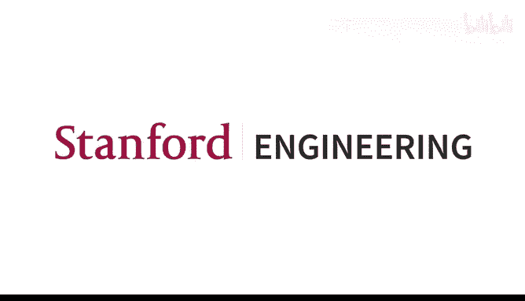

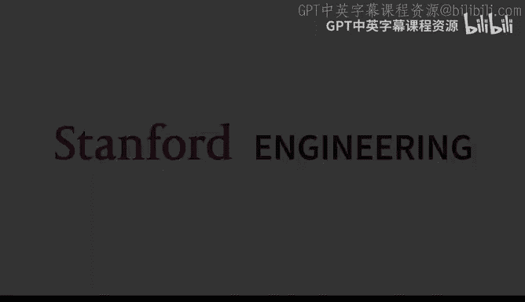

## 概述

在本节课中，我们将要学习多模态深度学习。多模态学习涉及整合来自不同类型数据（如文本、图像、音频）的信息，以构建更智能、更接近人类理解世界方式的模型。我们将从早期模型开始，深入探讨特征提取与融合的核心技术，回顾多模态基础模型的发展历程，并讨论评估方法与其他模态的应用。

---

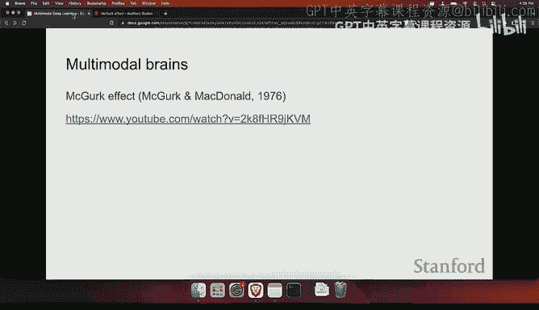

## 早期多模态模型

上一节我们介绍了课程概述，本节中我们来看看多模态深度学习的早期探索。在深度学习革命之前，已有许多相关工作。从深度学习的角度来看，早期工作始于将视觉模型与语言模型对齐。

基本思路是，我们一方面有一个视觉模型，另一方面有一个语言模型。语言模型可以是基本的词嵌入模型。我们需要在一个多模态空间中对齐它们。实现方法是使用某种相似性度量、评分函数或核函数，并通过最大间隔或间隔损失来学习如何在嵌入空间中排列这些点。

相似的点需要拉近，不相似的点需要推远。在这个多模态嵌入空间中，可以实现有趣的跨模态迁移。例如，可以获取“汽车”或“马”的词嵌入，然后在嵌入空间中找到与之接近的图像，从而解决检索问题。

以下是早期模型的一些关键特点：

*   **跨模态迁移**：可以在图像和文本之间进行迁移学习。
*   **多模态词嵌入**：通过结合图像和文本信息，可以获得更能代表人类语义理解的词向量。例如，对于“猫”这个词，我们既可以通过阅读维基百科的定义来理解，也可以通过观察猫的图片来理解。对于许多人来说，图片可能更接近“猫”这个概念的含义。
*   **视觉词袋模型**：一种早期优雅的方法，通过类似SIFT的算法找到图像关键点，获取特征描述符，然后使用K-means聚类，最终得到类似于文本词袋模型的视觉表示。

在深度学习兴起后，研究者开始将这些思想应用于深度神经网络。早期版本使用卷积神经网络（CNN）提取图像特征，并与词嵌入结合，形成多模态词向量。更高级的方法包括使用Skip-gram模型来预测图像特征。

然而，词是有限的，我们真正关心的是句子。因此，研究者开始关注句子表示，以及如何将句子表示与图像对齐。这里的损失函数与词和图片对齐时类似，但编码器换成了句子编码器（如LSTM或递归神经网络）。研究表明，通过预测图片来学习句子表示（即“接地”的句子表示），可以得到非常好的句子语义表示，并能迁移到其他NLP任务（如情感分类）中。

随着序列到序列架构的出现，研究者将用于机器翻译的文本编码器替换为CNN，从而实现了图像描述生成。在这个过程中，注意力机制发挥了关键作用，它允许模型在生成描述时对齐图像中的特定区域。

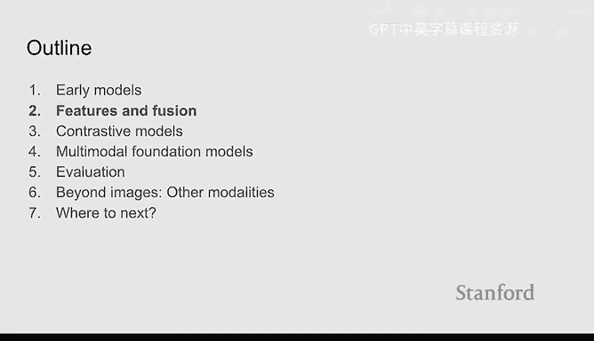

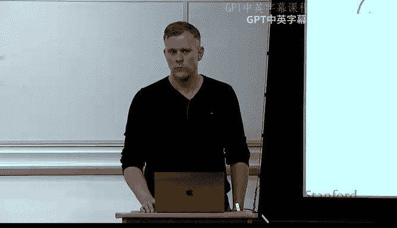

最后，生成对抗网络（GAN）也是早期重要模型之一。其基本思想是通过生成器和判别器的对抗训练，使生成器能够生成以文本为条件的逼真图像，这为后来的文本到图像生成（如Stable Diffusion）奠定了基础。

---

## 特征与融合技术 🔧

上一节我们回顾了早期模型，本节中我们将深入探讨多模态学习的两个核心构建模块：特征提取与信息融合。

首先，我们需要理解为什么并非所有任务都采用多模态方法。存在几个挑战：某些模态（尤其是文本）可能主导模型，导致其他模态被忽略；额外的模态可能引入噪声，使问题更复杂；数据可能并非总是多模态的（例如，有些帖子只有文本或只有图片）；模型设计如何有效结合不同信息也相当复杂。

### 特征提取

*   **文本特征化**：在Transformer时代，我们通常将文本编码为 `[批次大小, 序列长度, 嵌入维度]` 的三维张量。
*   **图像特征化**：更为复杂。早期常用**区域特征**，即先使用目标检测器（如YOLO、R-CNN）处理图像，获取边界框和标签，然后用CNN主干网络编码每个子图像的特征。另一种方法是使用**密集特征**，如Vision Transformer（ViT），将图像分割成块，然后使用标准的Transformer架构进行处理。

### 多模态融合

假设我们有两个向量 `U` 和 `V`，代表不同模态的特征。融合它们的方式多种多样。

以下是几种主要的融合策略：

*   **早期融合**：在处理的早期阶段就合并不同模态的特征，例如在注意力机制中同时关注所有模态的信息。
*   **中期融合**：先分别处理各模态，然后在中间层进行结合。
*   **晚期融合**：将不同模态完全分开处理，只在最后阶段（如得分或逻辑层）进行组合。

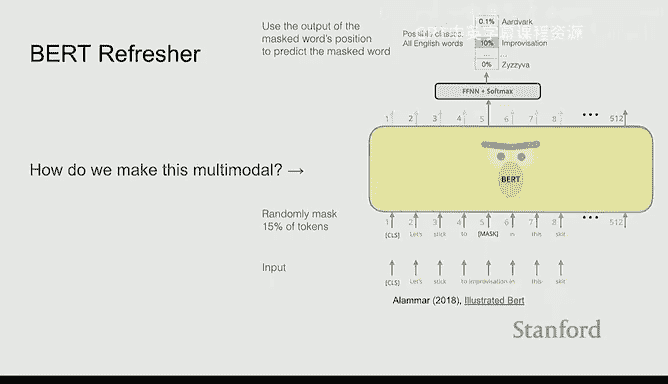

融合的具体操作可以是简单的（如内积、拼接、逐元素相乘），也可以是复杂的（如使用注意力机制、双线性池化等）。大部分多模态文献本质上都在探讨如何进行最佳融合。

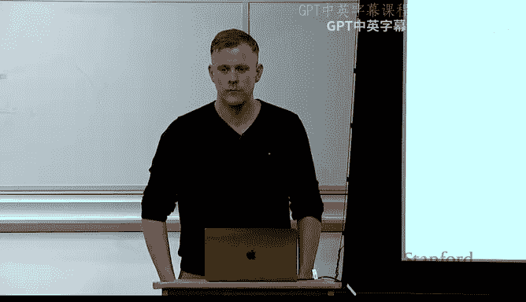

一个有趣的例子是FiLM模型，它使用一个向量（来自文本编码）来调制CNN每一层的特征图，通过乘性向量γ和加性偏置向量β来实现，从而让视觉网络根据文本信息进行自适应调整。

---

## 对比模型与晚期融合 ⚖️

上一节我们介绍了多种融合策略，本节我们重点看看晚期融合，即当前常说的**对比模型**。

其基本思想是：完全独立地处理不同模态，只在最后阶段通过一个相似性评分进行组合。最著名的实例是OpenAI的**CLIP**模型。

CLIP的核心是对比损失函数，与早期方法中的思想一致，但采用了批内负采样。其架构简单：文本编码器和图像编码器都是Transformer（图像编码器是ViT）。该模型的成功关键在于：1）完全使用Transformer；2）在大量网络数据（约3亿图像-文本对）上训练。

CLIP的强大之处在于其**零样本预测**能力。由于网络图像描述通常是“一张猫在做某事的照片”这样的句子，而非简单的“猫”标签，因此可以通过提示（如“一张{物体}的照片”）让模型进行零样本图像分类，这类似于大语言模型中的提示工程。

在CLIP之后，谷歌的ALIGN模型采用了相同思路，但使用了更大规模的数据（18亿图像-文本对），获得了更好的性能。开源组织LAION创建了高质量数据集（如包含50亿样本的多语言版本），为Stable Diffusion等模型的成功提供了数据基础。

---

## 多模态基础模型发展史 📜

上一节我们讨论了对比模型，本节我们将梳理多模态基础模型的发展脉络。许多思想层层递进，可以看到架构逐渐复杂，但核心通常离不开更多的数据和计算。

BERT的出现是一个转折点。研究者开始思考如何将BERT改造成多模态模型。直观的想法包括：将CNN特征与BERT的`[CLS]`令牌拼接后进行分类；或者使用区域特征作为输入。

随后涌现了大量论文，基本都在探索如何将BERT与视觉信息结合，主要区别在于融合方式：

*   **单流架构**：如Visual BERT，将图像区域特征与文本令牌拼接后，输入同一个Transformer。
*   **双流架构**：如ViLBERT，使用两个平行的Transformer，在每一层通过交叉注意力（或共注意力）交换信息。

这些模型通常进行**多模态预训练**，任务包括掩码语言建模、图像-文本匹配等。也有工作（如MMBT）表明，有时可以冻结BERT，仅学习将图像特征投影到BERT的令牌空间，然后在特定任务上微调，也能得到不错的效果，这避免了繁琐的多模态预训练阶段。

趋势是逐渐摆脱对预提取区域特征的依赖。VT模型首次完全使用图像块（而非区域特征）作为输入，将BERT和ViT真正集成到一个模型中。

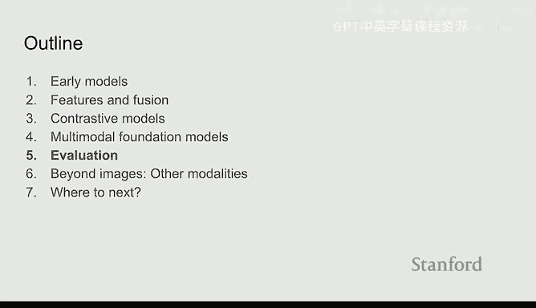

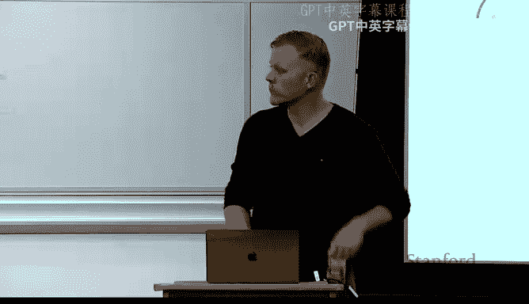

然而，一项名为“揭开多模态预训练面纱”的研究指出，当在相同数据、相同方式下训练时，许多模型创新带来的差异微乎其微，性能提升更多源于数据和算力，而非架构本身。

另一个重要趋势是构建**统一的基础模型**，例如FLAVA模型。它旨在成为一个能同时处理视觉、语言以及视觉-语言任务的单一模型，在图像分类、文本理解和多模态推理等多种任务上表现良好。

当前，生成式模型成为焦点。从对比式、判别式模型转向生成式模型（如生成文本描述或图像）能获得更丰富的表示。CoCa等模型引入了文本解码器进行生成。

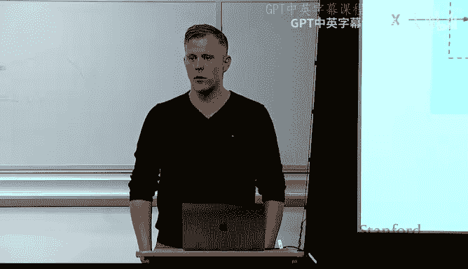

在大语言模型时代，一个流行的方法是**冻结语言模型**，仅学习如何将其他模态的特征投影到语言模型的输入空间。例如，Flamingo模型冻结了Chinchilla语言模型，通过“感知重采样器”处理多幅图像，并使用“门控交叉注意力”将视觉信息注入冻结的语言模型层之前，实现了强大的多模态对话和推理能力。

BLIP-2模型进一步推进了这一思路，仅学习图像编码器到冻结语言模型（如OPT）或编码器-解码器模型（如Flan-T5）之间的投影，就取得了令人印象深刻的效果，展示了语言模型本身的强大能力。

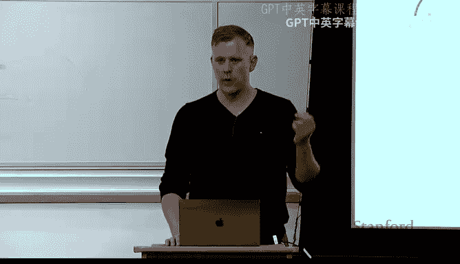

此外，**多模态思维链提示**也被证明能显著提升模型在复杂推理任务（如科学问答、瑞文矩阵）上的性能。

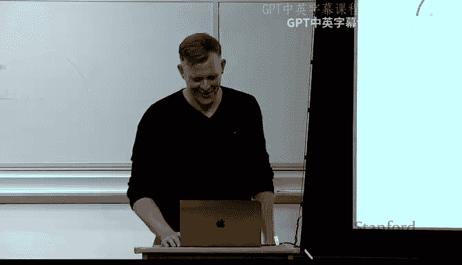

---

## 模型评估 📊

上一节我们回顾了模型的发展，本节我们来看看如何评估多模态系统。构建酷炫的模型很重要，但进行恰当的评估同样关键，尤其是在学术研究中。

评估需要精心设计的数据集。COCO数据集是里程碑式的，它提供了丰富的图像标注（分割、边界框、标签）和每个图像的五条描述，推动了图像描述、跨模态检索等任务的发展。

视觉问答（VQA）是另一个备受关注的任务。但早期版本的VQA数据集存在缺陷，模型仅通过文本问题就能获得高准确率，图像信息变得无关紧要。这警示我们基准设计必须谨慎。后续的GQA等数据集在设计上有所改进。

为了真正衡量多模态理解，需要构建那些**必须结合多模态信息才能解决**的数据集。例如，Hateful Memes数据集要求模型理解图像和文本之间的互动关系（通常是讽刺或恶意）来进行分类。通过精心构造“良性混淆样本”（即替换图像或文本中的一个模态），确保了任务的多模态必要性。有趣的是，该数据集的竞赛结果表明，当时的许多多模态预训练技术带来的提升有限，说明仍有很长的路要走。

另一个例子是Winoground数据集，它专注于评估模型的**组合性理解**能力。数据集中包含描述相同词语但顺序不同的文本对（如“植物环绕灯泡” vs “灯泡环绕植物”），对应完全不同的图像。如果模型仅依赖数据分布的偏见，而无法理解视觉-语言的组合语义，则表现不佳。研究显示，当时的先进模型在此类任务上的表现可能低于随机猜测。

即使是DALL-E 2这样的先进生成模型，在生成“勺子少于叉子”或“叉子少于勺子”的图像时，也会因为训练数据中“勺子”图片更多而产生偏差。这再次表明，模型在很大程度上是其训练数据的反映。

---

## 其他模态与应用 🌐

上一节我们讨论了评估，本节我们将视野扩展到图像和文本之外的其他模态。视觉是主导模态，但并非唯一。

*   **语音/音频**：处理方式与视觉有相似之处。例如，OpenAI的Whisper模型将音频的梅尔频谱图输入Transformer编码器-解码器架构进行转录。有趣的是，音频有时可以“视觉化”处理（如通过频谱图），然后使用CNN提取特征。
*   **视频**：可以看作是图像的序列。许多方法通过采样关键帧，然后应用标准的视觉-语言Transformer进行处理。例如，MERLOT模型同时处理视频、音频和文本，向能消费所有模态的统一基础模型迈进。
*   **具身AI与模拟环境**：这是一个有趣的方向，智能体在模拟环境中通过交互、感知和语言指令来学习，更接近人类的学习方式。虽然目前因高质量数据获取难而热度稍减，但长期来看潜力巨大。
*   **3D与点云生成**：类似于文本到图像生成，现在也可以根据文本提示生成3D模型或点云，在自动设计等领域有应用前景。
*   **嗅觉嵌入**：一个探索性的方向。通过分析代表气味的化学化合物组合，可以构建“嗅觉向量”。研究表明，对于具体物体（如“苹果”），基于化学化合物的嗅觉表示与人类相似性判断的相关性，可能高于纯语言向量。这提示，要真正理解人类语义，或许需要考虑更广泛的感知模态。

---

## 未来展望与总结 🚀

在本节课中，我们一起学习了多模态深度学习的核心概念、技术演进和评估方法。

**总结如下：**

1.  **核心思想**：多模态学习旨在整合不同数据类型，构建更全面理解世界的模型，其动力源于人类认知的多模态性、互联网数据的多模态性，以及为大型模型提供更多数据的需求。
2.  **关键技术**：包括**特征提取**（如ViT、区域特征）和**多模态融合**（早期、中期、晚期融合）。对比学习（如CLIP）和基于大语言模型的冻结调优（如Flamingo、BLIP-2）是当前重要范式。
3.  **发展历程**：从早期的跨模态对齐、多模态词嵌入，到基于BERT的视觉-语言模型，再到统一的、生成式的多模态基础模型，模型能力不断增强。
4.  **评估挑战**：需要精心设计的数据集来确保评估的是真正的多模态理解能力，避免模型利用数据集偏差或单一模态信息即可解决问题。
5.  **模态扩展**：研究已从图像-文本扩展到音频、视频、3D乃至嗅觉等领域，最终趋势是构建能处理任意模态组合的统一基础模型。

**未来趋势可能包括：**
*   **统一的基础模型**：一个模型处理所有模态和任务。
*   **缩放定律研究**：探索不同模态数据与模型性能之间的定量关系。
*   **检索增强生成（RAG）**：将检索机制与多模态生成结合。
*   **更好的评估与测量**：开发更可靠、更能反映真实理解能力的评估基准。

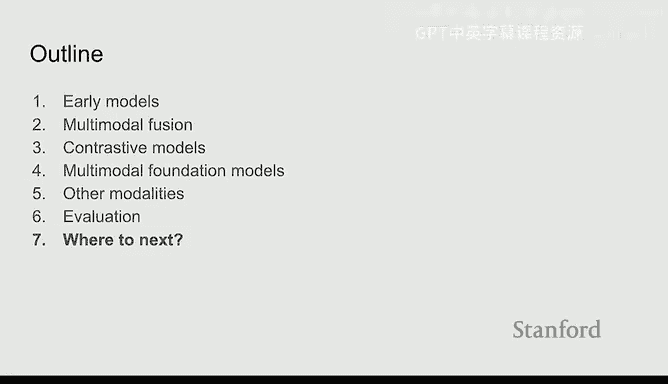

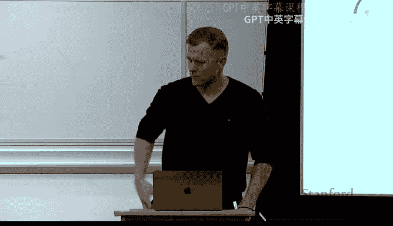

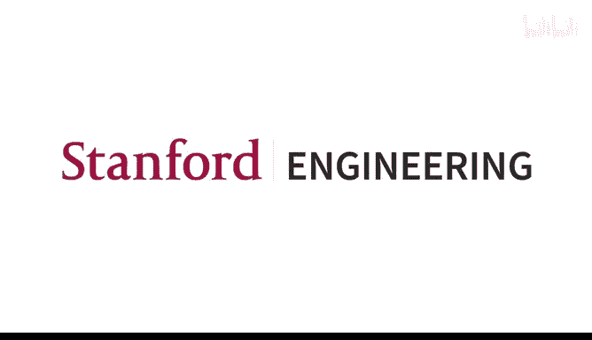

多模态深度学习是一个快速发展的前沿领域，虽然已取得显著进展，但在组合推理、减少偏见、实现真正稳健的理解等方面仍存在许多开放问题和研究机会。