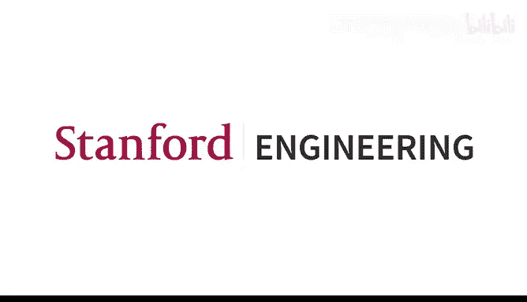
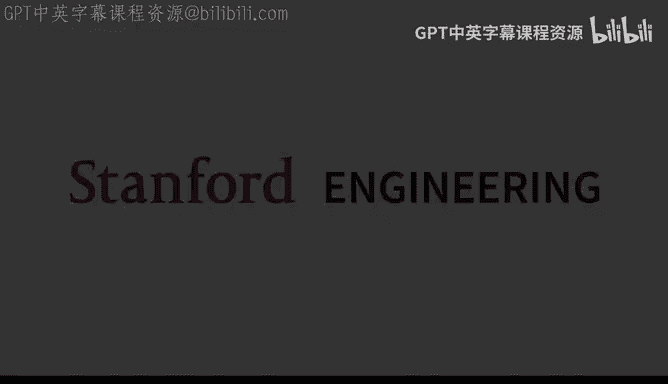
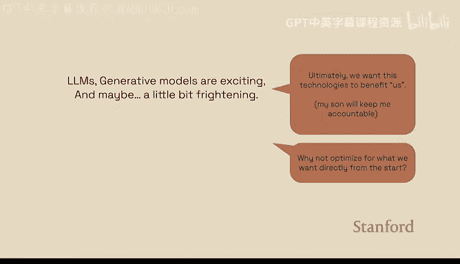
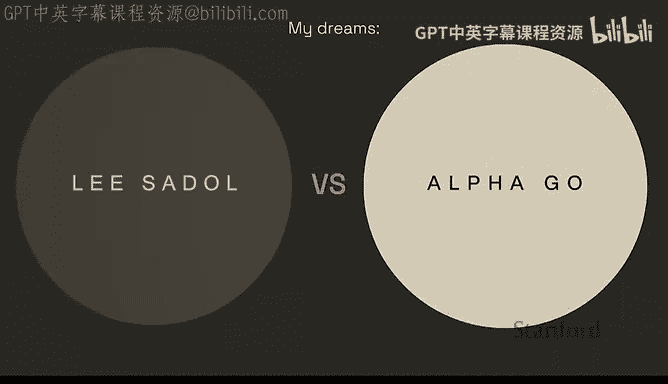
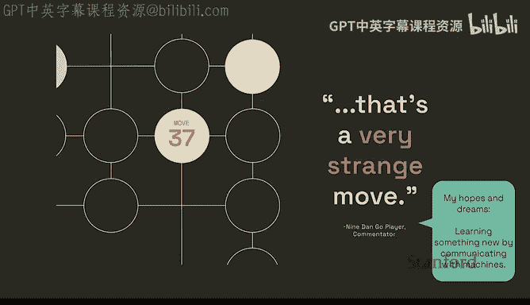
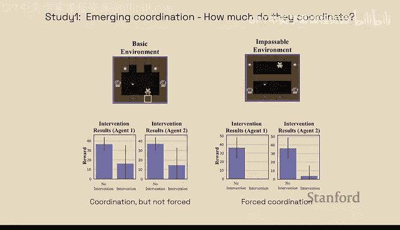
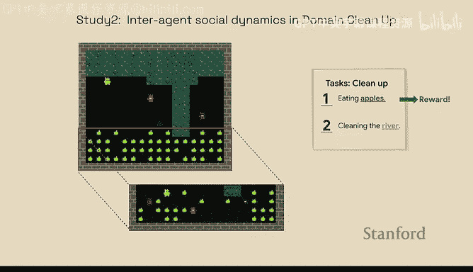
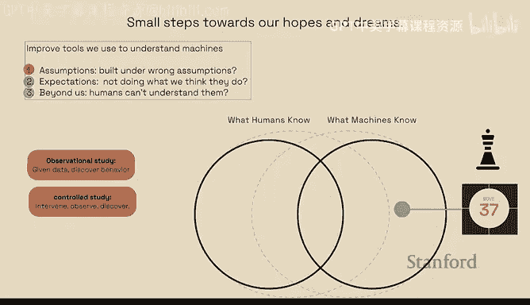
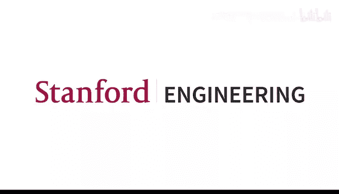

# 20：模型可解释性与编辑 🧠

在本节课中，我们将学习模型可解释性与编辑的核心概念。我们将探讨如何理解机器学习模型（尤其是大型语言模型）的内部工作机制，以及如何与这些模型进行有效的“对话”。课程内容将涵盖当前可解释性工具的局限性、知识在模型中的定位与编辑，以及通过观察和干预研究智能体行为的新方法。

---

今天，我很荣幸地介绍我们最后一位客座演讲者——Been Kim。

Been Kim是Google Brain的一名资深研究科学家。如果你对谷歌的职级体系有所了解，就会知道“资深”这个词意味着她是一位非常优秀的研究科学家。

我在今天的午餐中了解到，Been最初在首尔国立大学学习机械工程，但后来转向了计算机科学，并在麻省理工学院获得了博士学位。在那里，她开始研究机器学习模型的可解释性与可解释性。虽然她今天会谈到她工作的不同部分，但她近期工作的一个主题，尤其吸引我作为NLP研究者的，是“我们应该使用更高级、人类可解释的语言来进行人与机器之间的交流”。欢迎Been，期待你的演讲。

谢谢邀请，很荣幸来到这里。这是我见过最多雨的斯坦福。我昨晚抵达，但我住在西雅图，所以这很常见。不过我今天还是看到了蓝天，我觉得这很好，我很喜欢这里。

今天，我将分享一些我追逐与机器交流的梦想。

如果你在这门课上，你可能会同意（当然不一定）大型语言模型和生成模型非常酷，令人印象深刻。但你可能也同意，它们有点令人不安。不仅因为它们表现优异，还因为我们不太确定这项技术将走向何方。十年后，我们回顾时会说这项技术是净收益，还是会说那是灾难性的？我们不知道会发生什么。

最终，我希望做的，也许也是我们都希望做的，是让这项技术造福人类。我知道在十年后，或者二十年，甚至更早，我的孩子会问我：“妈妈，你研究过这个AI的东西吗？我看过你的一些演讲。你知道这会如何深刻地改变我们的生活吗？你为此做了什么？”我必须回答这个问题，我真的希望我能对他说些好的事情。

所以，我最初的想法，或者说当前的想法是：如果我们最终目标是造福人类，为什么不直接为此优化？为什么要等待？我们如何受益？受益的方式有很多。但一种方式是将它视为一位同事，一位在某些方面非常擅长的同事。这位同事并不完美，但足够擅长某件事，以至于你想向他们学习。不过，一个区别是，这位同事有点奇怪。它可能有非常不同的价值观，对世界有非常不同的体验，可能不像我们那样关心生存，也许死亡对它来说不是个事。所以，在我们的对话中，你必须处理好这一点。

当你第一次遇到一个如此不同的人时，你会怎么做？你会尝试进行对话，去弄清楚：你是如何做到的？你如何解决存在数十年的蛋白质折叠问题？你如何击败世界围棋冠军？看起来如此轻松。你使用的是和我们一样的科学知识语言（原子、分子），还是以完全不同的方式思考世界？更重要的是，我们如何合作？

我有一个非常想与之对话的“外星人”，那就是AlphaGo。AlphaGo在2016年击败了世界围棋冠军李世石。李世石来自韩国，我也来自韩国。我观看了每一场比赛。他在韩国乃至全世界都是个大人物。在其中一场比赛中，AlphaGo下出了被称为“第37手”的一步棋。有多少人看过AlphaGo的比赛？有多少人记得第37手？是的，有几个人记得。我记得当时的评论员，在整个比赛期间滔滔不绝，突然变得非常安静。他说：“嗯……这步棋非常奇怪。”我当时就知道，我眼前发生了一些非常有趣的事情，AlphaGo做出了我们将永远铭记的事情。果然，这步棋扭转了AlphaGo的比赛局势，并最终使其赢得其中一场比赛。直到今天，围棋棋手们仍在分析这步棋并讨论它，人们谈论说这不是人类会幻想出来的棋步。问题是：AlphaGo是如何知道这是一步好棋的？

我的梦想是通过与机器交流、对话来学习新事物，从而使人类能够获得解决重要问题（如医学和科学等）的新视角。这不仅仅是发现新事物。想想奖励黑客问题，你必须与某人进行有意义的对话，才能真正弄清楚他们的真实目标是什么。所以，在某种程度上，解决这个问题是解决AI安全问题的超集。

那么，我们如何进行这种对话呢？对话假设我们在交流中共享一些共同的词汇来交换意义，并最终交换知识。自然地，表征在这种对话中扮演着关键角色。我们可以在左边将其可视化，左边圆圈代表人类所知事物的表征空间，右边圆圈代表机器所知事物的表征空间。左边的圆圈里会有像“这只狗毛茸茸的”这样的东西，你知道那是什么意思，因为我们都有大致相似的词汇。但在右边，我们有像“第37手”这样的东西，我们人类还没有对应的表征。我们如何进行对话？我们的表征空间需要重叠，重叠越多，对话就会越好。人类都擅长学习新事物，就像这里的每个人都在学习新东西一样，所以我们可以通过学习新概念和词汇来扩展我们的所知。我相信，这样做将帮助我们构建能更好地与我们的价值观和目标对齐的机器。

这是我之前做的一个演讲。如果你对我们为实现这个目标所做的一些工作感到好奇，我强烈推荐这个YouTube视频，它是一个半小时的主题演讲，你可以快进观看。

但今天，我将更多地谈谈我的希望和梦想。希望在今天结束时，你的希望和梦想也在那里。首先，我要设定一下期望。在这次演讲结束时，我们仍然不知道第37手是如何产生的。抱歉，这需要一些时间。事实上，这次演讲的第一部分将讲述我们如何在这个进程中倒退。

在取得进展方面，我仍然只是我们理解第37手整个旅程中非常小的一部分。当然，这个旅程不会是单一的路径，会有许多不同的分支出现，就像Transformer这样的核心思想帮助了许多领域一样，这里也会类似。所以，在第二部分，我将谈谈我们在理解强化学习中涌现行为方面的一些工作。我将要讨论的所有技术原则上都适用于NLP。

回到我们的希望和梦想，第37手。首先，让我们思考一下我们如何实现这个梦想。退一步想，我们必须问：我们是否有工具来首先评估机器到底知道什么？过去十年，机器学习领域有许多发展，旨在开发工具来理解和评估这个紫色圆圈（机器所知）。那么，这准确吗？不幸的是，许多最近的研究表明，机器实际知道的和我们认为机器知道的之间存在巨大差距。识别并弥合这个差距很重要，因为这些工具将成为理解第37手的基础。

这些工具是什么？有多少人熟悉显著图？很多人，但你不必解释它是什么。显著图是流行的可解释性方法之一。简单来说，在ImageNet上，你有一张像这样的图片，一只鸟。解释将采用相同图片的形式，但每个像素都关联一个数字，这个数字应该暗示该像素对预测这张图片的重要性。其中一个重要性的定义是，该数字表示该像素周围函数的样子。例如，如果我增加像素Xj，也许在Xj附近，函数像黄色曲线那样上升，或者函数是平坦的，或者像绿色曲线那样下降。所以，如果它像蓝色或红色曲线那样平坦，也许这个特征与预测鸟无关；如果它上升，那么它可能更重要，因为x值增加，函数值上升（这里的函数值如预测值）。

让我们思考一下为什么这个差距可能存在的一些原因。有几种方式（并非详尽无遗，它们有些重叠），但有助于我们思考：也许假设是错误的。这个“外星人”，我们训练的机器，在一个完全不同的、也许是完全不同的表征空间中工作，对世界有非常不同的体验。所以，假设它像我们一样看待世界，就像拥有联觉现象一样，人类倾向于将它们联系起来。也许机器也有，也许没有。所以，也许我们对这些机器的假设是错误的。也许我们的期望不匹配。我们以为它在做X，但实际上它在做Y。也许它超出了我们的理解，也许它展示的是人类无法理解的超人类能力。

我将更深入地探讨我们的一些工作，这是更近期的工作。再次回到之前关于显著图的故事，我们将尝试使用其中一些方法。

在2018年，我们偶然发现了一个相当令人震惊的现象。当时我们实际上在尝试写一篇不同的论文，当然，Anzi也在这里。但我们正在测试一些东西，然后我们意识到，训练过的网络和未训练的网络具有非常相似的显著图。换句话说，随机预测和有意义的预测给了我相同的解释。这令人困惑。我们以为有bug，但结果发现没有。实际上，它们在定性和定量上都是无法区分的。这很令人震惊。

但随后我们想，也许这只是个别情况，也许它在实践中仍然以某种方式有效。所以我们在后续论文中测试了这一点：好吧，如果模型有错误，比如标签错误、虚假相关性，或者在测试时出现分布外数据，如果我们故意插入这些错误，解释能否告诉我们模型有问题？结果发现，这也不太正确。你可能会想，哦，也许是虚假相关性。另一项后续工作也表明情况并非如此。我们很失望。

但我们仍然说，也许没有理论证明，也许这又是一个实验室环境下的测试。我们让研究生测试了这个系统，也许还有一些希望。这是更近期的工作，我们在其中从理论上证明，其中一些非常流行的方法并不比随机猜测更好。我将稍微谈谈这个。

我漏掉了一个人，我漏掉了作者列表中的Pangwei。这也是与Pangwei合作的工作。

首先，让我们谈谈我们对这个工具的期望。开发这种方法（IG和SHAP）的原始论文讨论了IG如何用于计算每个特征的贡献。这意味着，当工具将零归因分配给像素X时，我们会说，好吧，像素X未被函数使用。这意味着，如果我扰动这个X，f将不敏感。事实上，这就是它在实践中的使用方式。这是一篇发表在《自然》杂志上的论文，它使用SHAP来确定医学试验中的资格标准。

我们在这项工作中表明，这些看似非常自然的推论都不成立。事实上，仅仅因为流行的归因方法告诉你归因是X，你无法得出关于实际模型行为的任何结论。这是如何运作的？

这里有多少人做理论证明？有几个，很好。我会告诉你，我也是从这个项目中学到理论证明的。我告诉你我们进行这项工作的方式是，首先思考这个问题，然后将其表述为我们知道如何解决的其他问题。在这种情况下，我们将其表述为假设检验，因为一旦你将其表述为假设检验（是或否），你就可以使用许多统计工具来证明这一点。

假设是什么？假设是：我是一个用户。我从其中一个工具得到了一个归因值，并且我有一个心理模型，认为这个特征是重要的，或者可能不重要。那么假设就是，这是真的还是假的。我们表明，无论你有什么假设，你都无法比随机猜测更好地证实或否定这个假设检验。这意味着，是的，有时它是正确的，但如果你无法验证是或否，你就不会做假设检验，因为如果它和随机猜测一样好，那做它有什么意义呢？结果是，是的，对于这个图，它只是我们结果的可视化。如果你绘制真阴性和真阳性，这条线是随机猜测线（因为这是最差的方法，这是最好的方法），所有等距离的点都在这条线上。我们知道的方法，如SHAP、IG，都落在这条随机猜测线以下。这是个坏消息。

但也许，也许由于某些原因，这在实践中仍然有效。也许我们有一些假设在实践中没有完全满足。那么，这种现象在实践中是否成立？答案是肯定的，我们做了测试。我们现在有更多的图像图和更大的模型，但在这里我们测试了两个具体的最终任务，这些任务在可解释性中很重要，或者人们使用这些方法来进行补救或检测虚假相关性。补救（对于那些不熟悉的人来说）是指，你被拒绝了贷款，你想知道如果我年龄更大，是否会有更高的机会获得贷款。所以我调整这个特征，看看我的值是否上升。这是一个非常合理的任务，人们一直在做，具有重要的社会意义。

对于这两个具体的最终任务，它们都归结为我刚才谈到的假设检验框架。它们都围绕随机猜测线，或者比随机猜测更差。你可能会说，哦，不。这不好。很多人都在使用这些工具，我们该怎么办？

我们对此有一个非常简单的想法。人们喜欢开发复杂的工具。我真的希望你不是那种人。因为很多时候，简单的方法有效。奥卡姆剃刀原理，而且简单的方法很优雅。也许很多时候它们有效是有原因的。它们简单，你能理解它们，它们有意义。所以让我们在这里试试这个想法。再次，你的目标是估计函数形状。你做什么？嗯，最简单的事情是，你有一个兴趣点，你在该点周围采样，并在该点周围评估函数。如果它上升，也许函数在上升；如果它下降，也许函数在下降，对吧？这是你可以蛮力解决的最简单方法。但问题是，我们需要多少样本？这里，这个方程是你在提升这条线，通过添加那个额外的项。它与样本数量成正比，你拥有的样本越多，你的估计就越好，这很合理。还有输出差异，你关心多少分辨率？你关心0.0001到0.1，还是只关心斜率0到斜率1？但这是你关心的分辨率，当然还有特征数量。所以，如果你担心基于函数形状做出某些结论，三步走。简单。

那么，我们能否使用这些流行的方法推断模型行为？答案是否定的。这在理论和实践中都成立。我们目前正在研究更大的模型，以一次又一次地展示经验证据，表明是的，它真的不起作用。请在使用这些方法之前三思而后行。此外，模型依赖的样本复杂度。如果你的函数有点疯狂，当然，你需要更多的样本。那么，我们如何描述这些函数的定义是什么？最后，我们还没有完全放弃，因为这些方法在经济学和沙普利值等方面有很好的基础。所以，也许存在更狭窄的条件，这些方法在这些条件下有效。我们相信这样的条件确实存在。我们只需要弄清楚是什么时候。

一旦我们弄清楚那个条件是什么，那么给定一个函数，我可以测试它并说，是的，我可以在这里使用SHAP；是的，我可以在这里使用IG；或者不，我不能。那仍然会非常有用。这是正在进行的工作。

在我进入下一个话题之前，有什么问题吗？是的。你的这些发现，它们只适用于计算机视觉，还是也适用于NLP？任何具有函数的模型。实际上，简单的证明可以显示它适用于任何函数。还有其他问题吗？很好。

Chris，这最后一个问题与你刚才提到的要点有关。在过去的几年里，有几十个，也许几百个人写论文使用沙普利值。你的猜测是，这些工作大部分都无效，还是其中很多可能没问题？无论什么条件下它可能是可以的。对于这个问题有两个答案。我的假设检验结果表明它是随机的，对吧？所以在乐观的情况下，也许这些论文中有50%碰巧对了。另一方面，即使SHAP不完美，也许它有点错误，但即使如此，如果它最终帮助了人类，无论那是什么，帮助医生更高效，识别错误等等，并且如果他们用正确的控制测试设置进行了正确的验证，那么我认为这是好的。你知道，你以某种方式弄清楚了如何让这些嘈杂的工具与人在回路中协同工作。这也很好。我个人真的很喜欢SHAP论文，我和Scott是好朋友，我喜欢他所有的工作。只是我认为我们需要缩小我们的期望，以便我们的期望能更好地对齐。

好的。我将谈谈另一项具有类似风格的工作。现在是NLP领域。

这是众多论文中的一篇，就像我们最终写的许多其他论文一样，是一次偶然的发现。最初，Peter作为实习生加入，我们认为我们要在大型语言模型中定位伦理知识，然后也许编辑它们，让它们更符合伦理。我们开始吧。然后我们想，哦，有David Bau等人的论文，我也很喜欢David的工作，让我们用那个。这就是这项工作的开始。

但随后我们开始深入研究并实现ROME。事情不太对劲。所以我们做了一个又一个的健全性检查实验，最终写了一篇完全不同的论文，我即将要谈到的这篇。

这篇论文，ROME，对于不熟悉的人来说（我稍后会详细说明），是关于编辑模型的。所以你首先在模型中定位知识，比如“太空针塔在西雅图”。这是一个事实，你的知识。你定位它们。因为你能够定位，所以你可以修改它来编辑那个事实。这就像是它的全部承诺。事实上，文献中的许多定位或编辑方法都是这样被激励的。

但我们表明，这个假设实际上并不成立。老实说，我仍然不太明白为什么这不相关。我会更多地谈谈这个，因为这对我们来说是一个大问题。这是相当活跃的工作。相当大比例的事实性知识存储在那些被识别为拥有知识的层之外。你可以，你可以看到，你稍后会看到更多细节。事实上，事实所在的位置与你编辑该位置的效果之间的相关性是完全不相关的，所以它们彼此毫无关系。

所以我们想，好吧，也许是编辑定义的问题。编辑可以有很多不同的含义。所以让我们想想编辑事物的不同方式。我们尝试了很多方法，但收效甚微。我们找不到一个编辑定义能真正与定位方法（特别是ROME）很好地关联起来。

让我们简要谈谈ROME的工作原理。这张幻灯片省略了很多细节，但大致上你会明白。ROME是Meng等人2022年的工作，他们有一个所谓的因果追踪算法。它的工作方式是，你将在特定的反事实数据集上运行模型，该数据集包含主语-关系-宾语三元组，比如“太空针塔位于西雅图”。所以你会进行一次“干净”运行，在“太空针塔位于西雅图”上一次运行。你存储每个模块、每个值激活。然后在第二次运行中，他们称之为“损坏”运行，你将在“太空针塔”或“太空”处添加噪声。然后，你将在每个模块进行干预，就像通过将该模块复制到损坏运行中一样，就好像那个特定模块从未被干扰过，从未被添加噪声。这是一个典型的干预案例，你假设其他条件不变，只改变这一个模块。得到正确答案的概率是多少？在这个案例中，是“西雅图”的概率，给定我知道模型并且我在其上进行了干预。最终，你会得到像这样的图，其中每个层和每个标记都有一个分数，表示如果我在该层的该标记上进行干预，我恢复正确答案的可能性有多大？因为如果我恢复了正确答案，那就是存储知识的模块。非常合理的算法，我找不到这个算法中的技术缺陷。我其实挺喜欢它的。

但是，当我们开始使用他们使用的相同模型（GPT-J）查看这个时，我们意识到很多这些事实……ROME只使用第6层进行编辑，因为据称这是整个数据集中编辑大多数事实性知识的最佳层，他们展示了编辑成功等等。但我们意识到真相看起来像右边的图。红线是第6层，他们的扩展论文（称为MEMIT）编辑了多层，那是蓝色区域。黑色条是知识实际达到峰值的层的直方图（如果你测试每一层）。正如你所看到的，没有很多事实落入那个区域。事实上，每个事实都有不同的峰值区域。所以对于很多事实来说，第6层并不是最佳层。但编辑确实有效。它真的有效，我们能够复制那个结果。所以我们想，我们该怎么做才能找到这些伦理知识？我们如何找到编辑的最佳层？这就是我们开始的地方。但随后我们想，你知道吗，退一步。我们实际上要先做一个健全性检查，以确保追踪效应（即定位）意味着更好的编辑结果。就在这时，一切都开始崩溃了。

首先让我们定义一些指标。编辑成功，这是重写分数，与ROME论文使用的分数相同。我们使用这个。追踪效应，这是定位。是概率，你可以在幻灯片上看到。

当我们绘制追踪效应和重写分数（编辑方法）之间的关系时，红线意味着完美的相关性。这是我们的假设，认为它们会完美相关，这也是我们进行定位的原因。实际的线是黄色的。它接近0，实际上是负的。在这个特定的数据集中。这甚至不是不相关，而是负相关。我们没有就此止步。我们非常困惑。我们将对每一层都这样做，并找出R