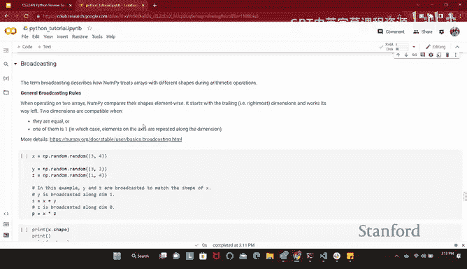

# 21：Python 教程 🐍


在本教程中，我们将学习 Python 编程语言的基础知识，特别是与 NumPy 库相关的部分。这些知识对于完成本课程的作业至关重要。我们将从 Python 的基本概念开始，逐步深入到 NumPy 的核心功能，包括数组操作和高效的数学计算。

---

## 为什么选择 Python？🤔

上一节我们介绍了本教程的目标，本节中我们来看看为什么 Python 是机器学习和自然语言处理领域的首选语言。

Python 是一种高级语言，语法接近英语，易于学习和使用。它拥有丰富的科学计算库，类似于 MATLAB。在深度学习中，许多主流框架（如 PyTorch 和 TensorFlow）都直接提供 Python 接口。因此，Python 因其易用性和强大的生态系统而被广泛采用。

---

## Python 语言基础 🏗️

本节将介绍 Python 的基本语法和概念，为后续学习 NumPy 打下基础。

### 变量与赋值

在 Python 中，变量可以存储各种类型的值。赋值操作使用等号 `=`。Python 是动态类型语言，无需预先声明变量类型，并且可以随时重新赋值。

```python
x = 10
x = "hello"  # 这是有效的
```

### 基本运算

Python 支持常见的数学运算。

```python
x = 10
y = 3
print(x + y)   # 加法
print(x / y)   # 除法
print(x ** y)  # 幂运算，x 的 y 次方
```

### 类型转换

有时需要显式转换数据类型。

```python
x = 10
y = 3
result = float(x) / float(y)  # 确保结果为浮点数
print(int(result))            # 转换为整数
print(str(x) + str(y))        # 转换为字符串并拼接
```

### 布尔值与逻辑运算

布尔值 `True` 和 `False` 首字母必须大写。Python 使用 `and`、`or`、`not` 进行逻辑运算，使用 `==` 和 `!=` 进行相等性比较。

```python
x = 3
y = 4
if x == 3 and y == 4:
    print(True)
```

### 代码块与缩进

Python 使用缩进（空格或制表符）来定义代码块，例如在函数或循环中。通常使用 2 或 4 个空格，但必须在整个代码中保持一致。

```python
if x > 0:
    print("x is positive")  # 缩进表示属于 if 语句的代码块
```

---

## 常见数据结构 📚

了解了基础语法后，我们来看看 Python 中几种核心的数据结构。

### 列表

列表是可变的有序集合，可以包含不同类型的元素。它们非常适合需要频繁增删元素的场景。

以下是列表的基本操作：

*   **创建与索引**：列表使用方括号 `[]` 创建，索引从 0 开始。
    ```python
    names = ["Zach", "Jay"]
    print(names[0])  # 输出: Zach
    ```
*   **添加元素**：使用 `append` 方法在列表末尾添加元素。
    ```python
    names.append("Richard")
    ```
*   **列表拼接**：使用 `+` 或 `+=` 运算符可以连接列表。
    ```python
    names += ["Abi", "Kevin"]
    ```
*   **列表切片**：使用切片语法 `[start:end]` 可以获取列表的一部分。`start` 包含，`end` 不包含。
    ```python
    numbers = [0, 1, 2, 3, 4, 5, 6]
    print(numbers[0:3])  # 输出: [0, 1, 2]
    print(numbers[:3])   # 同上，start 默认为 0
    print(numbers[3:])   # 输出: [3, 4, 5, 6]
    print(numbers[:])    # 复制整个列表
    ```
*   **负索引**：使用负数可以从列表末尾开始索引。
    ```python
    print(numbers[-1])   # 输出最后一个元素: 6
    print(numbers[-3:])  # 输出最后三个元素: [4, 5, 6]
    ```

### 元组

元组是不可变的有序集合。一旦创建，其元素不能被修改。元组使用圆括号 `()` 创建。

```python
names = ("Zach", "Jay")
print(names[0])  # 输出: Zach
# names[0] = "NewName"  # 这行会报错，因为元组不可变
```

创建单个元素的元组时，需要在元素后加一个逗号。

```python
single_tuple = (5,)
```

### 字典

字典是一种键值对映射，在其他语言中常被称为哈希表。它非常适合快速查找和映射关系。

以下是字典的基本操作：

*   **创建与访问**：字典使用花括号 `{}` 创建，通过键来访问值。
    ```python
    phonebook = {"Zach": "123-4567", "Jay": "987-6543"}
    print(phonebook["Zach"])  # 输出: 123-4567
    ```
*   **检查键是否存在**：使用 `in` 关键字。
    ```python
    print("Zach" in phonebook)  # 输出: True
    print("Monsie" in phonebook) # 输出: False
    ```
*   **删除条目**：使用 `del` 语句。
    ```python
    del phonebook["Jay"]
    ```

---

## 循环 🔄

循环是遍历列表、元组、字典等集合的高效方式。Python 提供了简洁的循环语法。

### `for` 循环

遍历数字序列可以使用 `range` 函数。

```python
for i in range(5):
    print(i)  # 输出 0, 1, 2, 3, 4
```

直接遍历列表元素更为简单。

```python
names = ["Zach", "Jay", "Richard"]
for name in names:
    print(name)
```

如果需要同时获取元素及其索引，可以使用 `enumerate` 函数。

```python
for index, name in enumerate(names):
    print(f"Index {index}: {name}")
```

### 遍历字典

遍历字典可以分别访问其键、值或键值对。

```python
phonebook = {"Zach": "123", "Jay": "456"}
for key in phonebook:           # 遍历键
    print(key)
for value in phonebook.values(): # 遍历值
    print(value)
for key, value in phonebook.items(): # 遍历键值对
    print(key, value)
```

---

## NumPy 简介 🧮

在掌握了 Python 基础后，我们进入本教程的核心部分：NumPy。NumPy 是 Python 中用于高效科学计算的基础库，尤其在处理多维数组和矩阵运算时表现出色。

NumPy 的核心是 `ndarray`（N维数组）对象。与 Python 原生列表不同，NumPy 数组在内存中连续存储，并且许多底层操作由优化过的 C 代码执行，这使得数值计算速度极快。在深度学习中，我们经常需要处理大量的数值数据（如词向量、权重矩阵），NumPy 为此提供了强大的支持。

### 数组创建与形状

首先，我们看看如何创建 NumPy 数组并理解其形状。

```python
import numpy as np

# 创建一维数组（向量）
x = np.array([1, 2, 3])
print(x.shape)  # 输出: (3,)

# 创建二维数组（矩阵）
z = np.array([[6, 7], [8, 9]])
print(z.shape)  # 输出: (2, 2)

# 使用 reshape 改变数组形状
a = np.arange(10)  # 创建 0 到 9 的数组
b = a.reshape((5, 2)) # 重塑为 5 行 2 列
print(b.shape)  # 输出: (5, 2)
```

形状 `(3,)` 表示一个包含 3 个元素的一维数组。形状 `(2, 2)` 表示一个 2 行 2 列的二维数组。`reshape` 操作必须保证新形状的元素总数与原数组一致。

### 数组操作

NumPy 提供了丰富的数组操作函数。

*   **聚合函数**：如 `max`, `min`, `sum`。可以通过 `axis` 参数指定沿哪个维度进行计算。
    ```python
    x = np.array([[1, 2], [3, 4], [5, 6]])
    print(np.max(x))           # 整个数组的最大值: 6
    print(np.max(x, axis=0))   # 沿行（垂直方向）求最大值: [5, 6]
    print(np.max(x, axis=1))   # 沿列（水平方向）求最大值: [2, 4, 6]
    ```
    `axis=0` 表示沿着行的方向（向下），跨行比较。`axis=1` 表示沿着列的方向（向右），跨列比较。
*   **元素级运算**：使用 `*`、`/`、`+`、`-` 等运算符会对数组中的对应元素进行运算。
    ```python
    a = np.array([1, 2, 3])
    b = np.array([4, 5, 6])
    print(a * b)  # 输出: [4, 10, 18]
    ```
*   **矩阵乘法**：使用 `np.dot`、`@` 运算符或 `np.matmul` 函数。
    ```python
    A = np.array([[1, 2], [3, 4]])
    B = np.array([[5, 6], [7, 8]])
    print(np.dot(A, B))
    # 等价于 print(A @ B)
    # 输出: [[19 22]
    #        [43 50]]
    ```
    矩阵乘法要求第一个数组的列数等于第二个数组的行数。
*   **点积**：对于一维数组，`np.dot` 计算的是向量点积（对应元素相乘后求和）。
    ```python
    v1 = np.array([1, 2, 3])
    v2 = np.array([4, 5, 6])
    print(np.dot(v1, v2))  # 输出: 32 (1*4 + 2*5 + 3*6)
    ```

### 数组索引与切片

NumPy 数组的索引和切片方式与列表类似，但功能更强大。

```python
x = np.array([[1, 2, 3, 4],
              [5, 6, 7, 8],
              [9, 10, 11, 12]])

# 选择特定的行
rows = x[[0, 2], :]  # 选择第 0 行和第 2 行，所有列
print(rows)

# 布尔索引
print(x[x > 5])  # 输出所有大于 5 的元素

# 使用 np.newaxis 增加维度
v = np.array([1, 2, 3])
v_col = v[:, np.newaxis]  # 形状从 (3,) 变为 (3, 1)，列向量
print(v_col.shape)
```

---

## 广播机制 📡

广播是 NumPy 最强大且独特的特性之一。它允许不同形状的数组进行数学运算，而无需显式复制数据，这大大提升了代码的简洁性和执行效率。

广播的核心规则是：**两个数组的形状从后向前逐元素比较。如果两个维度相等，或者其中一个为 1，则它们是“兼容”的。在运算时，形状为 1 的维度会被“拉伸”以匹配另一个数组的对应维度。**

让我们看几个例子：



```python
import numpy as np


# 示例 1: 矩阵的每一行加上一个行向量
A = np.zeros((3, 4))       # 形状 (3, 4)
row_vector = np.array([1, 2, 3, 4]) # 形状 (4,)
# row_vector 被广播为形状 (3, 4)，每一行都是 [1,2,3,4]
result = A + row_vector
print(result)
# 输出:
# [[1. 2. 3. 4.]
#  [1. 2. 3. 4.]
#  [1. 2. 3. 4.]]

# 示例 2: 矩阵的每一列加上一个列向量
A = np.zeros((3, 4))          # 形状 (3, 4)
col_vector = np.array([[1], [2], [3]]) # 形状 (3, 1)
# col_vector 被广播为形状 (3, 4)，每一列都是 [1,2,3]^T
result = A + col_vector
print(result)
# 输出:
# [[1. 1. 1. 1.]
#  [2. 2. 2. 2.]
#  [3. 3. 3. 3.]]

# 示例 3: 两个向量相加，生成一个矩阵
a = np.array([1, 2, 3])    # 形状 (3,)
b = np.array([[4], [5], [6]]) # 形状 (3, 1)
# a 被广播为 (3, 3)，每行都是 [1,2,3]
# b 被广播为 (3, 3)，每列都是 [4,5,6]^T
result = a + b
print(result)
# 输出:
# [[5 6 7]
#  [6 7 8]
#  [7 8 9]]
```

**重要提示**：如果两个数组在某个维度上既不相等，也不等于 1，则广播失败。例如，形状 `(6,)` 和 `(3,)` 的数组不能直接广播。

---

## 高效编程技巧 ⚡

在数据科学和深度学习中，效率至关重要。以下是一些利用 NumPy 进行高效编程的原则：

1.  **避免显式循环**：对大型数组使用 Python 的 `for` 或 `while` 循环会非常慢。应尽量使用 NumPy 的向量化操作和广播机制。
    ```python
    # 低效做法
    x = np.random.rand(1000, 1000)
    for i in range(1000, 2000):
        for j in range(1000):
            x[i, j] += 5

    # 高效做法
    x[1000:2000, :] += 5
    ```
2.  **利用切片和索引**：直接使用数组切片进行批量操作，而不是遍历每个元素。
3.  **理解并应用广播**：广播能自动处理许多需要复制数据的场景，写出更简洁、更快的代码。

---

## 总结 📝

本节课中我们一起学习了 Python 和 NumPy 的核心知识，为后续的深度学习与自然语言处理任务打下基础。

我们首先了解了 Python 因其简洁性和强大的科学计算库而被选为 AI 领域的主流语言。接着，我们学习了 Python 的基本语法、变量、数据结构（列表、元组、字典）以及循环控制。

然后，我们深入探讨了 NumPy 库，它是高效数值计算的基石。我们学会了如何创建和操作多维数组，理解了数组的形状、索引和切片。我们重点掌握了矩阵运算和强大的广播机制，后者允许我们对不同形状的数组进行智能的数学运算。

最后，我们强调了向量化编程的重要性，即避免使用低效的显式循环，转而利用 NumPy 的内置函数和广播来提升代码性能。


掌握这些内容将帮助你更顺利地完成课程作业，并在未来的学习和项目中有效地处理数据和实现算法。