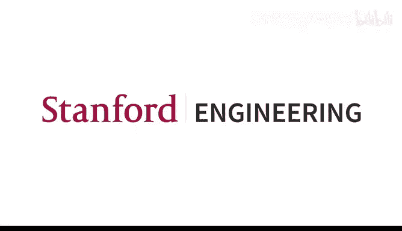
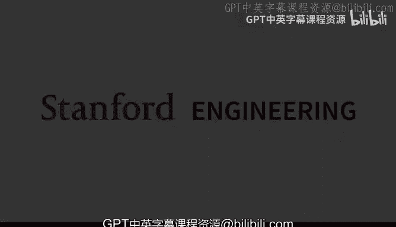
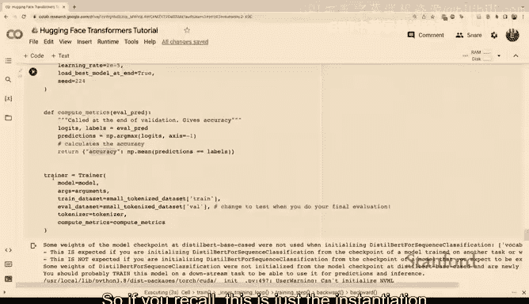

# 23：Hugging Face Transformers 库使用指南 🤗





在本教程中，我们将学习如何使用 Hugging Face Transformers 库。这是一个非常有用且高效的工具，能让你轻松使用现成的、基于 Transformer 架构的 NLP 模型。无论你是为了期末项目，还是未来的其他应用，掌握这个库都非常有帮助。它尤其与 PyTorch 配合得很好。

## 📚 概述与准备工作

上一节我们介绍了本教程的目标。本节中，我们来看看如何开始使用。

首先，Hugging Face 的官方文档非常出色，提供了大量教程、指南和可运行的 Notebook。如果你有任何疑问，那里是最好的查阅之处。

在开始编码前，我们需要安装必要的 Python 包。

```python
!pip install transformers datasets
```

`transformers` 库提供了大量预训练模型，而 `datasets` 库则提供了一些可用于各种任务的数据集。在本教程中，我们将以情感分析任务为例。我们还会导入一些辅助函数来帮助我们理解编码过程。

```python
from transformers import AutoTokenizer, AutoModelForSequenceClassification
import torch
```

## 🔍 第一步：从 Hub 获取模型

使用 Hugging Face 库的第一步，通常是从 Hugging Face Hub 上找到一个合适的模型。

Hub 上提供了海量的不同模型，例如 BERT、GPT-2、T5 等。这些预训练模型的权重都可以免费下载。你可以根据侧边栏的任务分类（如零样本分类）来寻找特定任务上表现优秀的模型。

基本上，无论你想做什么任务，很可能都能在 Hub 上找到对应的模型。

在本例中，我们将进行情感分析。选择模型后，我们需要两样东西：
1.  **分词器**：负责将原始文本分割成模型可以理解的标记（Token）。
2.  **模型本身**：用于接收分词后的输入并做出预测。

分词器将文本转换为词汇 ID（离散的数字），模型则基于这些 ID 进行预测。

## 🛠️ 初始化分词器与模型

我们可以使用 `AutoTokenizer` 和 `AutoModelForSequenceClassification` 来自动加载与所选模型对应的分词器和模型架构。

```python
model_name = "distilbert-base-uncased-finetuned-sst-2-english"
tokenizer = AutoTokenizer.from_pretrained(model_name)
model = AutoModelForSequenceClassification.from_pretrained(model_name)
```

`AutoTokenizer` 会自动为你选择与模型匹配的分词器，确保标记能正确映射到模型训练时使用的词汇表索引。`AutoModelForSequenceClassification` 则会加载一个专门用于序列分类（如情感分析）的模型头部。

## 📖 理解分词器

分词器用于对模型的输入进行预处理，将原始字符串映射为模型可以理解的数字 ID。

主要有两种分词器：Python 写的和 Rust 写的（`tokenizer fast`）。`AutoTokenizer` 默认会使用速度更快的 Fast 版本。两者功能上差异不大，主要影响推理速度。

以下是使用分词器的基本方法：

```python
input_str = "Hugging Face Transformers is great."
model_inputs = tokenizer(input_str, return_tensors="pt")
print(model_inputs)
```

分词器的输出是一个字典，主要包含：
*   `input_ids`：每个标记对应的数字 ID。
*   `attention_mask`：注意力掩码，用于 Transformer 模型。

你可以通过字典键或属性来访问它们：

```python
ids = model_inputs["input_ids"]
# 或者
ids = model_inputs.input_ids
```

分词过程内部包含多个步骤：分割文本、转换为 ID、添加模型所需的特殊标记（如 `[CLS]`, `[SEP]`）。对于 Fast 分词器，你还可以获取更详细的信息，如字符到单词的映射。

## ⚙️ 高级分词功能

在实际应用中，我们经常需要处理批量数据，并保证它们长度一致。这时就需要填充和截断。

以下是相关功能的示例：

```python
# 处理单个句子，并返回 PyTorch 张量
inputs = tokenizer("Hello, world!", return_tensors="pt")

# 处理多个句子，并自动填充到相同长度
sentences = ["I love NLP.", "Hugging Face is amazing."]
batch_inputs = tokenizer(sentences, padding=True, truncation=True, return_tensors="pt")
print(batch_inputs)
```

设置 `padding=True` 和 `truncation=True` 后，分词器会自动将短句填充、长句截断，并生成对应的注意力掩码。填充标记的 ID 通常是 0。

你还可以使用 `batch_decode` 方法将 ID 批量转换回文本，并选择是否跳过特殊标记。

```python
decoded = tokenizer.batch_decode(batch_inputs.input_ids, skip_special_tokens=True)
print(decoded)
```

## 🧠 使用模型进行预测

现在我们已经了解了分词器，接下来看看如何使用模型。

Hugging Face 的预训练模型通常具有相同的底层架构，但针对不同任务（如序列分类、掩码语言建模）配备了不同的“头部”。我们可以使用特定的类（如 `AutoModelForSequenceClassification`）来加载带有合适头部的模型。

模型主要分为三类：
1.  **编码器模型**：如 BERT，适用于理解任务（分类、问答）。
2.  **解码器模型**：如 GPT-2，适用于生成任务。
3.  **编码器-解码器模型**：如 BART、T5，适用于序列到序列任务（翻译、摘要）。

选择模型时必须与任务匹配。例如，你不能将仅含编码器的 DistilBERT 用作序列到序列模型。

将分词后的输入传递给模型有两种方式：

```python
# 方式一：显式指定参数
outputs = model(input_ids=model_inputs.input_ids, attention_mask=model_inputs.attention_mask)

# 方式二：使用 ** 解包字典（更简洁）
outputs = model(**model_inputs)
```

两种方式结果相同。模型输出包含 `logits`（未归一化的预测分数）。对于二分类任务，`logits` 的形状是 `[batch_size, 2]`。

```python
logits = outputs.logits
print(logits)
```

要得到最终的预测类别，可以对 `logits` 取 `argmax`：

```python
predicted_class_id = logits.argmax().item()
print(f"Predicted class ID: {predicted_class_id}")
```

## 📊 计算损失与训练准备

Hugging Face 模型本质上是 PyTorch 模块，因此可以像训练普通 PyTorch 模型一样训练它们。

模型输出可以直接包含损失值，前提是你传递了标签：

```python
labels = torch.tensor([1]) # 假设是正面情感
outputs = model(**model_inputs, labels=labels)
loss = outputs.loss
print(loss)
```

有了损失，你就可以调用 `loss.backward()` 进行反向传播，并使用优化器更新模型参数。这为模型微调奠定了基础。

## 🔬 探索模型内部状态

为了理解模型的运作机制，我们可以提取其内部状态，如隐藏状态和注意力权重。

在初始化模型时，通过设置参数可以要求输出这些信息：

```python
model = AutoModelForSequenceClassification.from_pretrained(model_name, output_attentions=True, output_hidden_states=True)
model.eval() # 设置为评估模式，关闭 dropout 等训练特性

with torch.no_grad():
    outputs = model(**model_inputs)

# 获取所有层的隐藏状态和注意力权重
all_hidden_states = outputs.hidden_states
all_attentions = outputs.attentions
```

`hidden_states` 是一个元组，包含模型每一层的输出表示。`attentions` 也是一个元组，包含每一层每个注意力头的注意力权重矩阵。分析这些数据有助于进行模型可解释性研究。

## 🏋️ 实战：微调模型

在实际项目中，你通常需要对预训练模型进行微调以适应特定任务。下面我们以情感分析为例，演示微调流程。

### 1. 加载数据集

我们使用 Hugging Face `datasets` 库加载 IMDB 电影评论数据集，并创建一个小的训练和验证集用于演示。

```python
from datasets import load_dataset, DatasetDict

# 加载数据集并取子集
raw_datasets = load_dataset("imdb")
small_train_dataset = raw_datasets["train"].shuffle(seed=42).select(range(128))
small_eval_dataset = raw_datasets["train"].shuffle(seed=42).select(range(128, 160))
```

### 2. 预处理数据集

使用 `map` 函数和分词器对整个数据集进行批量分词处理。

```python
def tokenize_function(examples):
    return tokenizer(examples["text"], padding="max_length", truncation=True)

tokenized_datasets = DatasetDict({
    "train": small_train_dataset.map(tokenize_function, batched=True),
    "eval": small_eval_dataset.map(tokenize_function, batched=True)
})

# 重命名列以符合模型输入要求，并设置格式为 PyTorch 张量
tokenized_datasets = tokenized_datasets.remove_columns(["text"])
tokenized_datasets = tokenized_datasets.rename_column("label", "labels")
tokenized_datasets.set_format("torch")
```

### 3. 创建 DataLoader

使用 PyTorch 的 `DataLoader` 来加载批数据。

```python
from torch.utils.data import DataLoader

train_dataloader = DataLoader(tokenized_datasets["train"], shuffle=True, batch_size=16)
eval_dataloader = DataLoader(tokenized_datasets["eval"], batch_size=16)
```

### 4. 训练循环（PyTorch 原生方式）

你可以像训练任何 PyTorch 模型一样编写训练循环。Transformers 库还提供了专门的优化器和学习率调度器。

```python
from transformers import AdamW, get_linear_schedule_with_warmup

optimizer = AdamW(model.parameters(), lr=5e-5)
num_epochs = 3
num_training_steps = num_epochs * len(train_dataloader)
lr_scheduler = get_linear_schedule_with_warmup(optimizer, num_warmup_steps=0, num_training_steps=num_training_steps)

model.train()
for epoch in range(num_epochs):
    for batch in train_dataloader:
        outputs = model(**batch)
        loss = outputs.loss
        loss.backward()
        optimizer.step()
        lr_scheduler.step()
        optimizer.zero_grad()
```

### 5. 使用 Trainer API（更简洁的方式）

Hugging Face 提供了更高级的 `Trainer` API，它封装了训练循环、评估、日志记录等复杂逻辑，使代码更简洁。

```python
from transformers import Trainer, TrainingArguments

training_args = TrainingArguments(
    output_dir="./results",
    num_train_epochs=3,
    per_device_train_batch_size=16,
    per_device_eval_batch_size=16,
    evaluation_strategy="epoch",
    logging_dir="./logs",
)

def compute_metrics(eval_pred):
    logits, labels = eval_pred
    predictions = logits.argmax(axis=-1)
    # 这里可以计算准确率等指标，需要导入 evaluate 库
    # accuracy = evaluate.load("accuracy")
    # return accuracy.compute(predictions=predictions, references=labels)
    return {"dummy_metric": (predictions == labels).mean()}

trainer = Trainer(
    model=model,
    args=training_args,
    train_dataset=tokenized_datasets["train"],
    eval_dataset=tokenized_datasets["eval"],
    compute_metrics=compute_metrics,
)

trainer.train()
```

使用 `Trainer` 可以轻松添加回调函数，例如早停（Early Stopping）或自定义日志记录。

训练完成后，可以评估模型并保存检查点：

```python
# 评估
eval_results = trainer.evaluate()
print(eval_results)

# 预测
predictions = trainer.predict(tokenized_datasets["eval"])
print(predictions.predictions.shape)

# 保存模型
trainer.save_model("./my_finetuned_model")
```



要加载微调后的模型，只需像之前一样使用 `from_pretrained` 并指定保存的路径。

## 🎯 总结

在本教程中，我们一起学习了如何使用 Hugging Face Transformers 库的核心功能：

1.  **从 Hub 选择和加载模型与分词器**。
2.  **使用分词器对文本进行预处理**，包括填充和截断。
3.  **将处理后的输入传递给模型**，并获得预测结果和损失。
4.  **探索模型的内部状态**，如隐藏层和注意力权重。
5.  **对预训练模型进行微调**，我们介绍了两种方式：原生的 PyTorch 训练循环以及更便捷的 `Trainer` API。


Hugging Face 生态系统极大地简化了 NLP 模型的实验和应用流程。通过掌握这些基础知识，你将能够高效地利用强大的预训练模型来解决各种自然语言处理任务。