#  001：课程介绍与行为建模

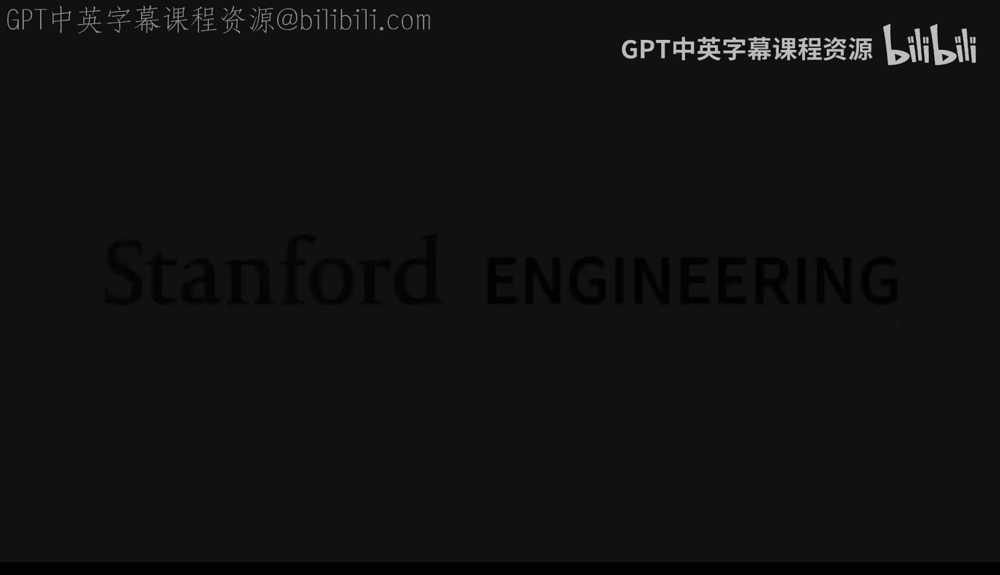

欢迎来到深度强化学习课程CS224R。我很高兴能在这个季度再次教授这门课程。我叫Chelsea，是这门课的讲师。我是斯坦福大学的助理教授。我的研究方向包括强化学习、机器人学和语言模型等。今天的计划是，我们将介绍课程目标和一些后勤信息。这部分内容会比较简短，因为所有信息都可以在线获取。之后，我们将讨论为什么要学习深度强化学习，并开始涉及一些关于行为建模和强化学习的技术内容。

今天的关键学习目标是：什么是深度强化学习？我们如何以一种可以优化的方式来表示行为？以及如何构建一个强化学习问题？

## 什么是深度强化学习？🤔

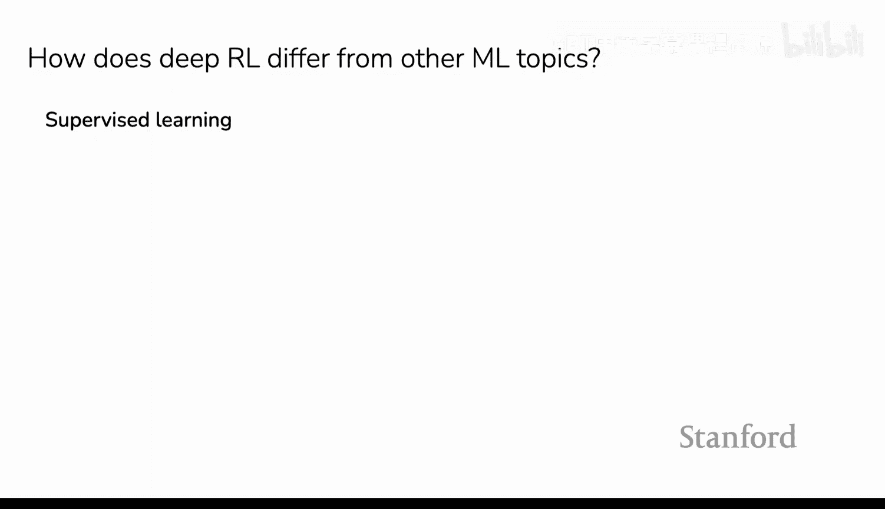

首先，对于强化学习，我们指的是决策问题。这类问题中，系统需要基于不断获得的信息做出多个决策。系统会观察，然后根据观察采取行动，接着再次观察并采取另一个行动。我们将研究这类问题及其解决方案，包括模仿学习、无模型和基于模型的强化学习、离线和在线强化学习、多任务和元强化学习，以及一些关于大语言模型和机器人的强化学习的额外内容。这是课程中强化学习部分的核心。我们将强调那些可以扩展到深度神经网络的解决方案，而较少关注那些与深度神经网络无关的解决方案。

## 强化学习与其他机器学习主题有何不同？🔄

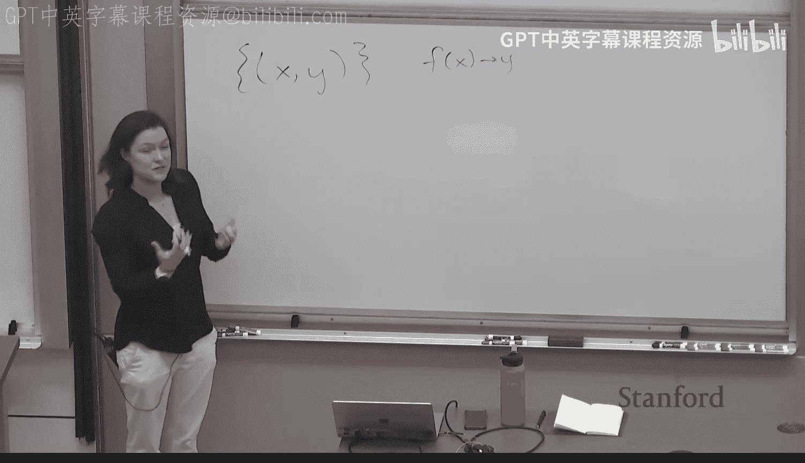

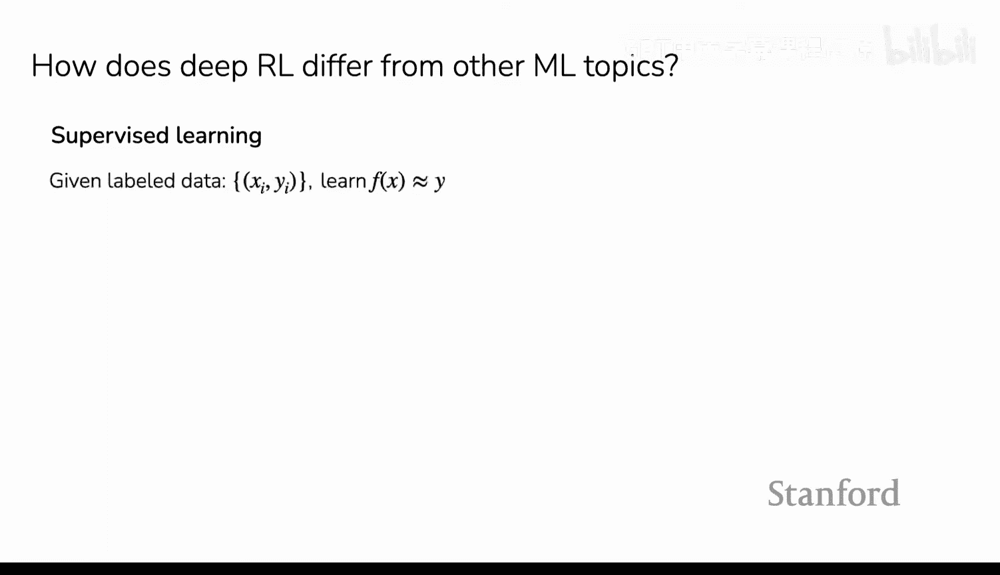

希望你们很多人对机器学习有一些经验。在机器学习中，通常会有一些输入输出对 `(x, y)`，并且在一个数据集中有很多这样的对。你的目标是学习一个可以从 `x` 映射到 `y` 的东西。另一个通常的假设是，这些数据点是从某个分布中独立同分布地采样得到的。

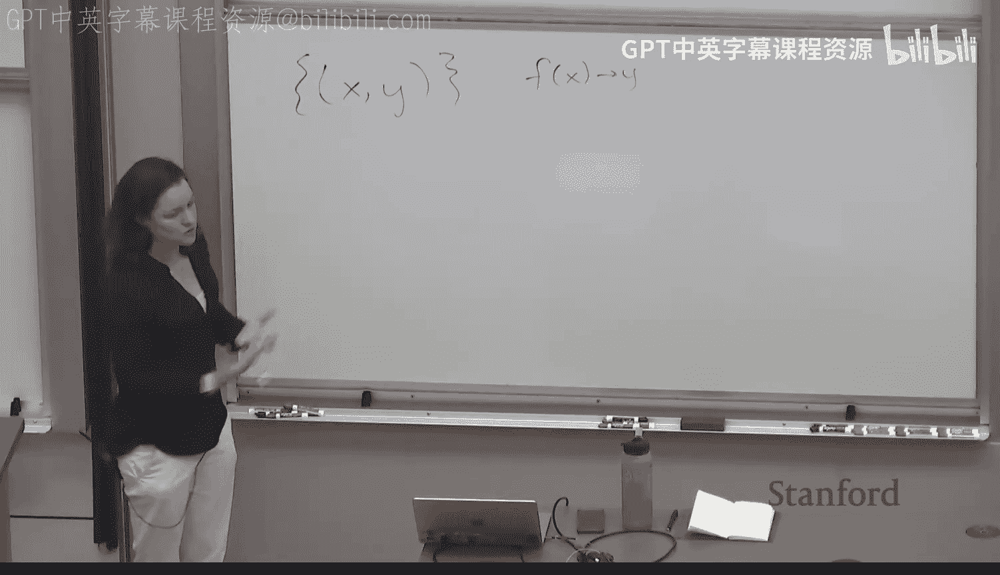

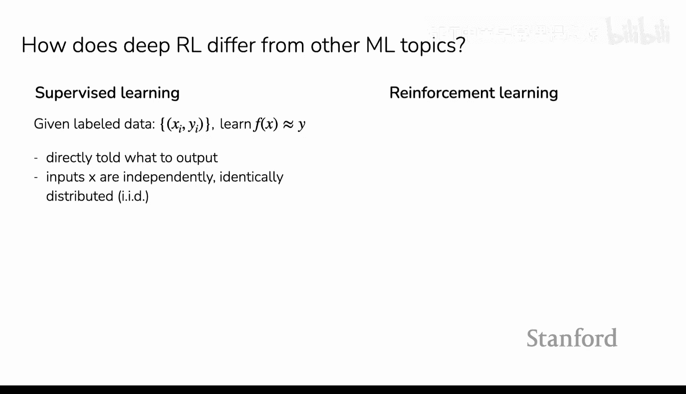

这正是强化学习有很大不同的地方。在监督学习中，我们有带标签的数据，我们学习函数，我们被直接告知给定输入应该输出什么。输入是独立同分布采样的。

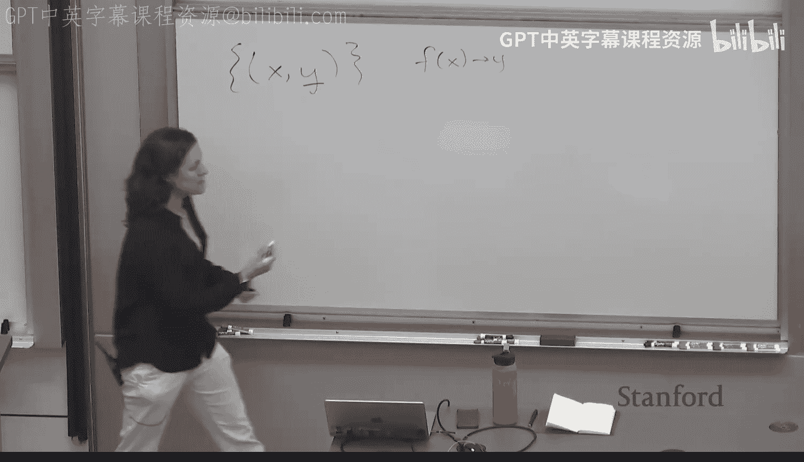

在强化学习中，情况有些不同。最终，我们的目标是学习行为。我们实际上会使用不同的术语来指代输入和输出。具体来说，我们的目标是从**状态**映射到**动作**。我们将执行这种映射的函数称为**策略** `π`。

与监督学习不同，我们不会被直接告知答案。我们的目标实际上是从更间接的反馈中学习这种行为。因此，在强化学习中，目标是从经验中学习这个策略 `π(s)`。这些经验通常来自于你正在学习的策略或函数。数据不会从单一分布中采样，而是以一种实际上取决于你当前正在学习的策略或函数的方式采样。

这是两个主要区别。我所说的“行为”可以包括像控制机器人这样的运动控制、与人类交互的聊天机器人、玩游戏、驾驶汽车、与网络交互的智能体，以及许多其他领域。

这就是强化学习与典型机器学习的区别。

## 课程目标与范围 🎯

我们无法涵盖深度强化学习的所有内容。因此，我们将尝试专注于深度强化学习方法背后的核心概念，以便你可以利用这些核心概念来理解更高级的方法，如果你选择更深入地研究这个主题。我们还将专注于算法的实现，让你能够自己实现算法。我们将在讲座和项目中给出机器人学、控制和语言模型方面的例子，但许多技术将具有更广泛的适用性。我们还将专注于我们认为最有用和最令人兴奋的主题。

如果你对更多理论和其他超出这些范围的应用感兴趣，CS234课程也是一个很好的选择。核心目标是能够理解和实现关键强化学习领域中的现有和新兴方法。

## 为什么要学习深度强化学习？🚀

我将在这里列出几个原因，然后对每个原因进行更深入的探讨。

1.  **超越监督学习**：在许多场景中，AI模型的预测会产生后果。如果我们想要考虑这些后果，就需要一个框架来思考这些后果，以及如何根据这些后果来优化行为。例如，如果你在Spotify上听音乐，Spotify算法为你推荐一首歌。这个推荐（甚至直接播放）会产生后果，比如下次推荐时，它可能不应该推荐同一首歌，并且可能希望保持在相同的流派内。因此，如果我们想要开发能够考虑这些后果的AI系统，深度强化学习使我们能够做到这一点。

2.  **直接监督不可用**：在许多场景中，直接监督是不可用的。例如，如果你有一个像Cursor或Copilot这样的编码助手，你想给它反馈说“那里做得很好”或“那里做得不好”，这种监督不是输出，而是一种更间接的监督。从这种间接监督或任何目标中学习，都可以被构建为一个强化学习问题，因此它比监督学习灵活得多。

3.  **广泛应用**：强化学习在许多高性能AI系统中被广泛使用和部署。

4.  **从经验中学习**：在我看来，从经验中学习似乎是智能的基础。因此，从构建智能机器的哲学层面来看，弄清楚如何开发能够从自身经验中学习的算法，似乎是非常基础的。这对于能够真正发现新事物而不仅仅是模仿数据也是基础。

5.  **激动人心的开放研究问题**：这个领域还存在许多令人兴奋的开放研究问题，使其成为一个进行研究的激动人心的领域。

6.  **实际激励**：上周末我告诉一个朋友我正在制作关于为什么要学习深度强化学习的幻灯片，并说我做了好几张幻灯片。他们说：“这个问题似乎不难回答，答案就是OpenAI提供的百万美元总薪酬。”所以，如果前四点不能激励你，这或许可以成为一些动力。

## 超越监督学习 🌐

决策问题无处不在，并且不能直接构建为监督学习问题。任何AI智能体都属于这个范畴。此外，如果你希望你的AI系统与人交互，比如聊天机器人或推荐系统，或者场景中决策会影响未来的结果或观察，这些反馈循环就是强化学习问题。如果你没有标签，或者你的目标不仅仅是准确性，或者是不可微分的，这些场景下强化学习就很有用。

## 深度强化学习的应用实例 🤖🎮

深度强化学习被用于各种不同的高性能系统。例如，使用强化学习（在模拟中训练然后转移到现实世界）学会了行为的腿式机器人，你可以看到像灵活的机器人和跳舞的人形机器人这样的酷炫成果，这些都是现实世界中通过深度强化学习训练的策略。

除了腿式机器人和跳舞，你还可以让机器人用机械臂操作物体完成任务，例如卸载和折叠衣物，或者折叠简单的折纸。这些都是使用这类方法可以完成的酷炫事情。

你还可以学习玩复杂的游戏。几年前，DeepMind使用深度强化学习训练了一个系统来玩围棋游戏，并击败了世界冠军李世石。这本身就令人印象深刻，另一个非常酷的事情是，它体现了AI系统的发现能力。有一手棋（第37手）让所有围棋专家都感到惊讶，它发现了一种人类以前未曾想到的策略。这表明强化学习可以成为发现新解决方案的工具，这可能不仅限于游戏。例如，如果我们想发现新药或需要实验的事物，强化学习提供了一个工具。

这不仅仅是机器人和游戏。几乎所有现代语言模型都使用某种形式的强化学习进行后训练，特别是用于更高级的推理。也有研究使用强化学习进行交通控制，寻找将自动驾驶汽车插入人类驾驶车流中的方法，以提高不同道路的通行量。还有研究使用强化学习训练叙事模型，例如，试图使生成的内容更符合特定的提示。这些例子表明，如果你要求基础标准模型生成一张海豚骑自行车的图片，它可能会给你一张不太好的图片。然后，你可以通过强化学习优化，得到一张更有效地遵循提示的图片。这同样适用于其他提示。

强化学习也被用于芯片设计，有一篇论文设计了用于谷歌生产TPU的芯片，这也非常有用。

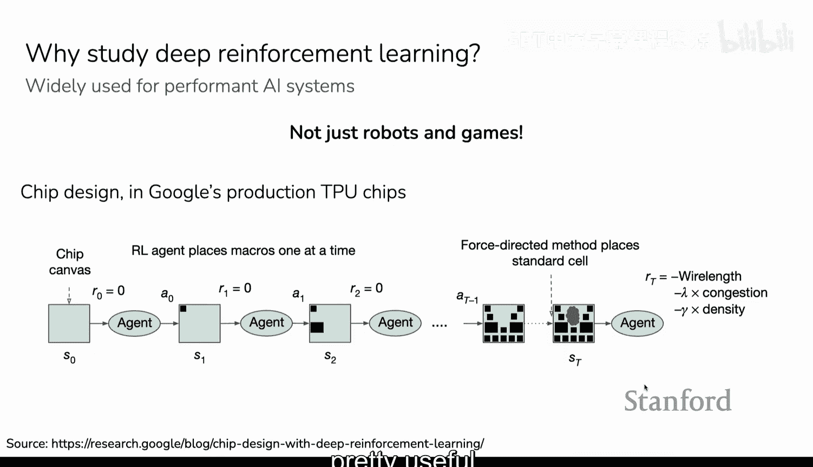

这些只是一些例子，还有很多其他例子没有涵盖。

## 从经验中学习与智能的基础 🧠

接下来，我想讲一个小故事来说明为什么深度强化学习似乎是智能的基础。当我刚开始攻读博士学位时，我加入了一个研究机器人强化学习的实验室。我坐的地方旁边就是这个机器人。实验室里经常有一位博士后用强化学习进行实验。我会看着这个机器人，它会做这样的事情。真正让我着迷的是，你可以看到它随着时间的推移在学习。开始时，它对如何组装玩具飞机的两个部件一无所知，但最后它能够相当熟练地完成。

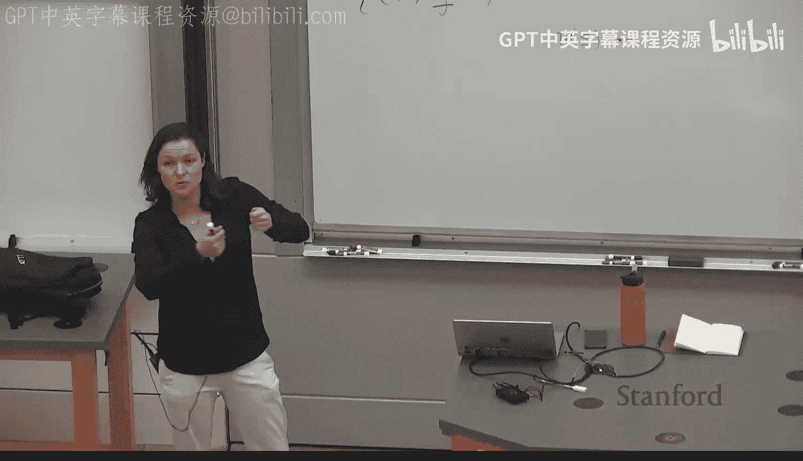

这非常酷，你可以看到它在现实世界中从自己的经验中学习。本质上，强化学习实现了这种通过练习变得更好的能力，这是其他机器学习系统所不具备的。

但这里有一个注意事项：这个特定的机器人是“闭着眼睛”的，它没有使用摄像头。这对我来说似乎是一个根本性的限制。因此，我实际上和那位博士后合作了一个后续项目，使用摄像头和视觉。在这个案例中，机器人能够在现实世界中学习如何将红色积木放入形状分类管中。同样，随着它一遍又一遍地练习任务，它变得越来越好。在学习过程之后，它仍然在学习、改进，最终成功率达到了95%或100%。然后，我可以（至少是年轻时的我）为机器人拿着积木，机器人可以将正确的积木放入正确的孔中。这些都是非常简单的任务，在某种程度上是很久以前的事了。现在我们有了可以折叠衣物和跳舞的机器人。

但我喜欢展示这些视频的原因之一是，它们真正展示了现实世界中的强化学习过程以及通过练习改进的能力。

## 激动人心的开放研究问题 🔬

同时，也存在大量开放的、令人兴奋的研究问题。如果你对做研究感到兴奋，这些挑战包括：机器人如何学习表示什么对任务有益？智能体如何将行为泛化到许多不同场景，而不仅仅是一个场景？我们能否在大规模、多样化的数据集上应用这样的系统，并从其他任务和目标中迁移？我们能否使用强化学习处理长周期任务，比如做一顿饭或解决一个非常难的数学问题？机器人能否完全自主地练习？对于最后一点，我给你们看了一些强化学习的视频，但这并不总是实际情况。有时，如果你在机器人上运行强化学习，它看起来更像这样：机器人试图将冰球击入球门，每次尝试任务后，它都需要重新开始，机器人实际上不知道如何撤销任务。这是我的朋友Yevgen，你可能会注意到Yevgen实际上比机器人做了更多的工作，这似乎不是做事的正确方式，以这种方式收集大量数据是不切实际的。

沿着所有这些主题，这些也是我们将在本课程中涵盖的一些主题。我们将讨论奖励学习以及如何表示不同的奖励，讨论离线强化学习、多任务强化学习和元强化学习，以及分层、推理和无重置强化学习。

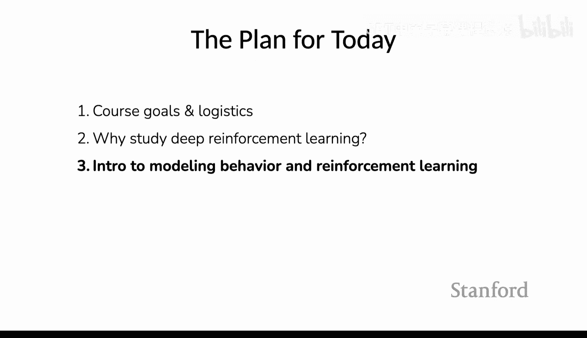

学习深度强化学习是很有趣的。

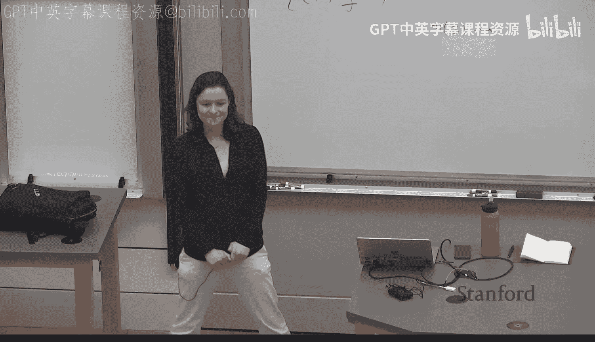

关于在现实世界中学习奖励的问题：在那个特定的例子中，我们将奖励表示为物体位置与目标位置之间的负距离。你可能已经注意到，在形状分类积木的例子中，机器人实际上拿着积木，因此我们可以使用机器人手臂的位置来测量积木的位置。在实践中，许多场景下你无法做到这一点，这特定于那个任务。在冰球例子中，冰球上实际上有一个动作捕捉标记来测量它在房间中的位置。总的来说，这非常困难，这就是为什么奖励学习对于以更通用的方式解决问题是必要的。

## 行为建模与强化学习 🧩

现在，让我们深入探讨行为建模和强化学习。我们需要弄清楚如何将经验表示为数据。就像机器人练习时，我们需要思考如何将视频中捕捉到的内容表示为可以学习的数据。这是另一个机器人在现实世界中学习的例子。我们可能还想思考如何表示来自聊天机器人的文本。在任何一种情况下，我们都需要思考智能体收集的经验，我们如何将其写成数据？

在强化学习中，我们通常这样做：首先，我们考虑世界的**状态**，用 `s` 表示世界的当前状态。例如，在机器人的情况下，世界的状态可能是手臂的位置、毛巾的位置和挂钩的位置。如果你无法直接获取关于毛巾的信息，它可能只是机器人摄像头捕捉到的图像，以及手臂关节的位置（如果你能获取的话）。

你并不总是能直接访问世界的状态。因此，有时我们会提到**观察** `o`，并使用观察而不是状态。观察和状态之间的区别在于，观察可能无法捕捉到你做决策所需的全部信息，你可能实际上需要考虑过去观察到的信息。例如，对于一个聊天机器人，如果你正在与它交互，你可以将给定时间步的观察视为你发送给聊天机器人的最新消息。这个最新消息并不包含它需要知道的关于下一个回复的所有信息。因此，你实际上需要给它过去观察的历史，而不仅仅是当前的观察，以便做出决策。

我们将在接下来的几张幻灯片中更多地讨论状态和观察的区别。

这大致捕捉了智能体正在观察的内容。现在，我们还需要捕捉它如何采取行动，如何做出决策，我们将这些决策称为**动作**，用字母 `a` 表示。

在与环境的一次交互方面，我们将其视为一个**轨迹**。这将是一系列状态和动作，或者一系列观察和动作。这是一种表示行为的方式。这将产生一个轨迹数据集，而不是一个 `(x, y)` 对的数据集。

然后我们需要思考，智能体的目标是什么？这就是**奖励函数**的作用。奖励函数本质上告诉我们一个给定的状态和动作有多好。在许多情况下，奖励函数只取决于状态。例如，它可能告诉你毛巾离被挂起有多近，或者毛巾是否被挂起。在聊天机器人的情况下，它可能是用户有多开心，或者他们是否给了你点赞或点踩。

然后，这种经验就是轨迹，并且该轨迹可能会用奖励来增强。所以，每次你运行策略时，你都会得到这种形式的数据。

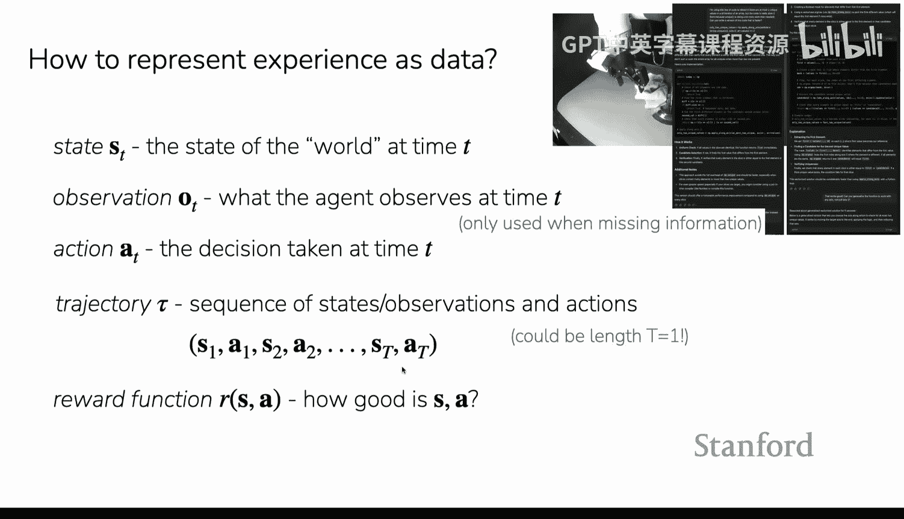

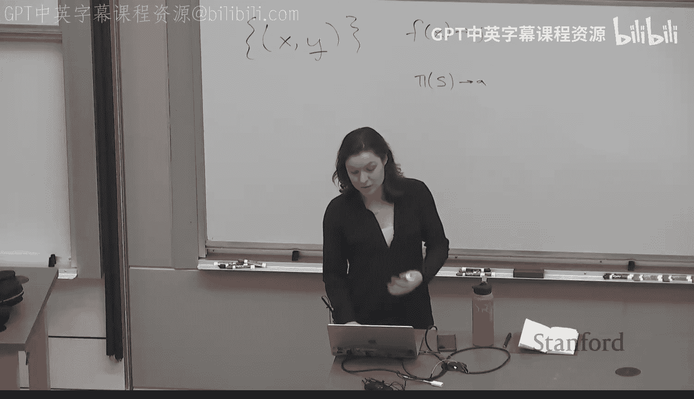

## 状态与观察 🔍

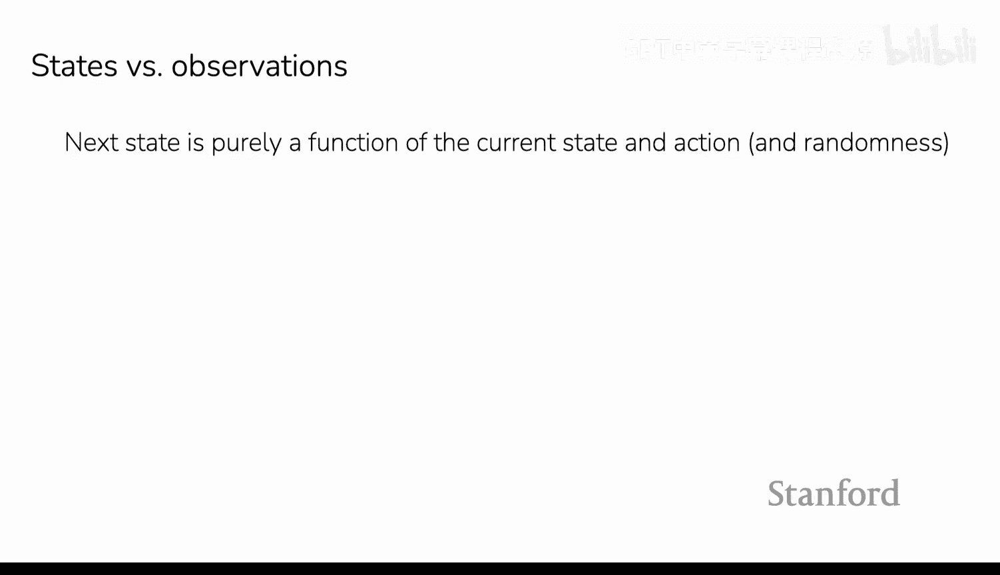

让我们先更多地讨论状态和观察。我们可以将状态和动作视为有点像马尔可夫链。假设我们有世界的第一个状态。例如，在机器人的情况下，假设毛巾在桌子上，有一个挂钩，目标是把毛巾挂在挂钩上。第一个状态是机器人处于某个中立位置，毛巾在桌子上。

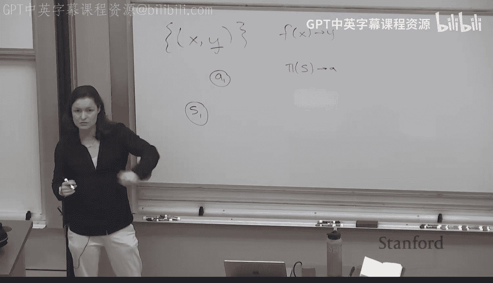

然后机器人会采取某个动作。比如将手臂移动到特定位置。

那个动作和当前状态将决定下一个状态是什么。然后从那里，如果机器人只是在自由空间中移动，毛巾可能还在同一位置，或者毛巾可能被移动了。

然后机器人将采取另一个动作，再次移动它的手臂。状态和动作将决定下一个状态。

这里一个关键点是，我们可以思考环境是如何在所谓的**动态函数**下变化的。你有 `p(s₃ | s₂, a₂)`。这基本上是世界的动态：手臂和毛巾在空间中如何移动，作为之前位置和机器人所做动作的函数。

这里需要注意的关键点是，`s₃` 只取决于 `s₂` 和 `a₂`，而不取决于 `s₁`。本质上，在给定 `s₂` 的条件下，`s₃` 将与 `s₁` 独立。这种独立性被称为**马尔可夫性**。这是强化学习中实际上非常有用的一点，因为它允许你将问题分解为这些场景，而不必担心之前的所有依赖关系。

现在，如果你有观察而不是状态，那么情况看起来就有点不同了。我们可以将观察视为状态的一个函数。它可能不包含状态的所有信息。因此，任何给定时间点的观察，如果你无法观察状态，那么 `o₃` 就不仅仅是 `o₂` 和 `a₂` 的函数，它实际上也是 `o₁` 的函数（如果你无法观察状态的话）。

在幻灯片上，我们可以思考这个模型：我们有这些动态，我们不知道世界将如何演化，我们无法直接预测未来。这些动态是未知的，并且在这些动态中，`sₜ` 独立于 `sₜ₋₁`，这被称为马尔可夫性。

关于在实践中需要多少过去的观察来推断状态的问题，这在很大程度上取决于领域。在许多机器人学例子中，通常只使用当前的传感器观察就足够了，但这很大程度上取决于传感器是什么。例如，如果你有触觉传感器，它们通常不像视觉观察那样包含那么多信息。因此，例如，当你没有接触时，你离桌子有多近是不知道的，一旦你接触了，你就知道了。这比图像更具部分可观测性。如果你有图像，那么它会给你一个更完整的表示。

关于为什么奖励函数是状态和动作的函数，而不仅仅是状态的问题，一个例子是回到机器人学的例子。假设你是一个人形机器人，正在学习如何行走。一个自然的奖励函数可能只是你前进了多少，这取决于状态。你可能希望动作也参与的一个场景是，如果你不想消耗太多能量，因为你不想让电机过度工作。那么你会希望奖励也取决于动作，你可以对通过电机施加的扭矩进行一些惩罚。在许多情况下，你可以只依赖于状态，但也有一些例子中你希望惩罚采取过多动作。

关于如果观察只是状态的一部分，为什么未来的观察不独立于过去的观察的问题，原因是我们可以回到触觉的例子。假设你接触了，然后停止接触，然后又接触了。在这种情况下，最近的过去观察实际上并不能告诉你太多关于当前状态的信息，而这个观察实际上告诉你更多关于状态的信息。因此，为了预测 `o₃`，你实际上需要使用所有过去的观察，而不仅仅是 `o₂`。对于熟悉图模型的人来说，如果你边缘化这些变量，你实际上会看到在图模型中，`o₃` 依赖于过去的观察。

## 强化学习问题构建示例 📝

让我们看几个例子，看看这可能是什么样子。

在机器人学案例中，状态可能包括三样不同的东西：机器人上任何摄像头的RGB图像、机器人所有关节的位置以及关节的速度。这是机器人系统相当常见的状态表示。图像实际上与位置具有不同的维度，你可能需要以能够接受这些不同维度的方式配置你的神经网络。

动作将是命令的下一个关节位置。所以你打算如何移动你的关节？如果你的关节当前处于90度，也许你会尝试将其移动到92度。

轨迹将是一系列状态和动作：一系列视频（本质上是一系列图像）、一系列关节位置和一系列命令的关节位置。

这个序列实际上包含什么？通常我们做的是将时间离散化。例如，这个序列将以20赫兹的频率进行，所以你的视频将是每秒20帧，你每秒将有20次关节观察，每秒也将有20次命令动作。

当我第一次学习时，我总觉得这有点不直观，因为作为一个人，我不会每秒思考20次做决定。但这通常是表示像机器人这样的物理系统上的数据和行为的最终实际方式。

对于奖励函数，这里有几样东西可以使用。一个可能是：如果毛巾在挂钩上，状态 `s` 的奖励为1，否则为0。你也可以对施加在动作上的力有一些惩罚。

这是一个机器人例子。现在让我们看一个聊天机器人的例子。这里，我们可能没有紧凑的状态表示，因此使用观察。观察可能是用户最近的消息。动作将是聊天机器人的下一条消息，这可能是一个句子或一个段落，可能非常大。然后你可以将轨迹视为对话记录。与机器人学例子不同，这不一定是固定的20赫兹频率，用户可能需要更长时间来响应。这是轨迹在时间表示上可能如何变化的一个例子。在第一种情况下，时间表示为二十分之一秒，而在第二种情况下，时间表示为用户响应时。作为一个奖励的例子，也许如果用户点赞，奖励为1；如果用户点踩，奖励为-10；如果没有用户反馈，奖励为0。

这些是我们如何建立强化学习的例子。现在我想请你构建一个强化学习问题。具体来说，我希望你为以下三个例子中的一个定义状态（或观察）、动作、轨迹和奖励，或者选择你自己的例子。

关于为什么这是观察而不是状态的问题：这实际上可以两种方式构建，具体取决于传感器测量的细节。例如，如果你的传感器只是观察你周围的当前深度（如激光雷达）和你面前的图片，那么可能就是这样。这可能会遗漏的是周围汽车移动的速度，这对于未来的情况可能非常重要。你可能会尝试包含激光雷达信息的历史记录来获取速度信息，然后将你的状态表示为例如三秒的历史记录。这将代表一个主题：通常为了处理观察，会使用一点历史记录，然后这可以形成你的状态表示。在这个特定情况下有点模糊，这取决于细节。

关于在机器人例子中，如果奖励只有在挂钩上才为1，否则为0，你如何实际学习的问题：如果你从未在任何时候做到这一点，那么你将只有非常少的监督信号，你将一直只有零奖励。因此，在那个特定的视频中，我们实际上初始化时向机器人展示了如何做几次，这有助于我们称之为探索的过程。如果你有非常稀疏的奖励（即信号很少且没有很好地朝向目标形状化），那么通常这类数据对于启动强化学习过程可能很重要。

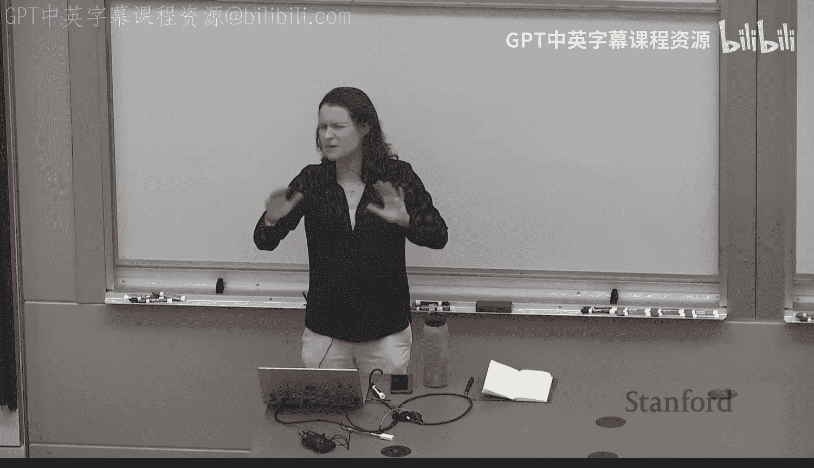

酷，所以如果大家没听到，状态可能是像HTML和URL这样的东西，关于网页和你所在位置的信息。动作将是与之交互。奖励将是某个任务是否完成。

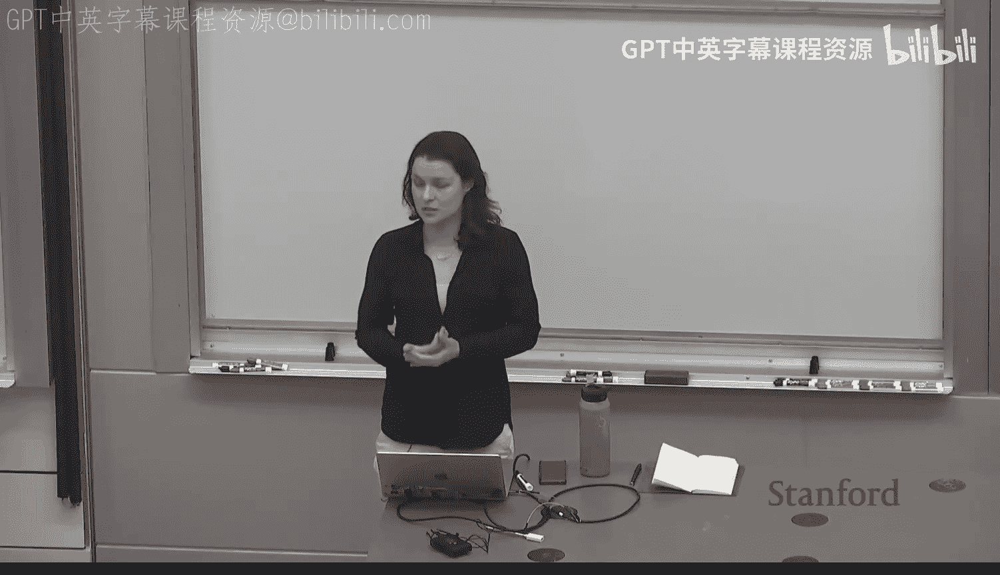

关于是否一切都是观察的问题，因为传感器可能不完美：如果你担心传感器噪声之类的问题，你总是可以选择将某些东西建模为观察。如果你需要添加大量历史记录，这在某些方面可能会有很大的缺点。因此，有时我们会近似地将某些东西视为状态，即使它可能缺乏信息。例如，也许每10000次传感器会失败一次，给你一张黑屏图像，尽管从技术上讲这属于观察情况，但由于它对算法的影响，你可能仍然会将其用作状态表示。

关于观察是否可以是当前的一切，或者是与先前观察的差值的问题：是的，这归结为不同的权衡。通常，如果你要包含大量历史记录，那么通过使用差值来压缩它可能很有意义。但随着我们深入策略，这一点可能会变得更清楚。

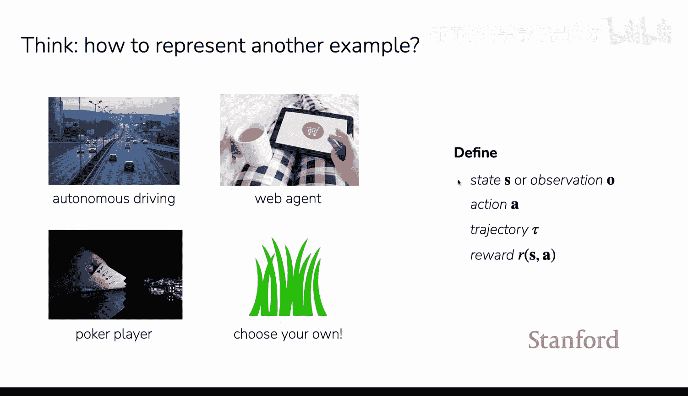

## 表示行为：策略 🧠➡️🎯

现在我们已经讨论了如何构建强化学习问题，让我们谈谈如何实际表示行为。我们通常希望从状态或观察映射到动作。为此，我们将使用所谓的**策略**。我们通常用 `π` 表示一个策略。这可以只是一个神经网络（在这种情况下是卷积神经网络），也可以是Transformer、简单的全连接神经网络或线性函数。这将从状态或观察（或观察序列）映射到动作。

我们通常用 `θ` 表示你试图学习的神经网络的参数。

因此，当你实际使用策略采取行动时，你会观察一个状态，采取一个动作，然后观察下一个状态。当我们采取行动时，我们实际上是从我们的神经网络中采样。所以我们将通过神经网络运行一个前向传播来选择动作，然后在现实世界中执行该动作并观察下一个状态。

这个过程的结果是一个轨迹。当我们使用策略生成这个轨迹时，我们通常称之为**rollout**或**episode**。你可以将其视为学习的一个片段，一次尝试，然后一次又一次地尝试。“rollout”这个术语的意思是，你顺序地进行策略、动态、策略、动态，你正在展开这个过程以创建轨迹。

如果你只有观察而没有状态，解决方案是给你的策略**记忆**。所以你可以传入多个观察，而如果你只给它一个状态，你实际上不需要给它任何记忆，你可以只输入状态。这非常方便，因为如果你有大量记忆，它将占用你计算机或GPU上的大量内存。

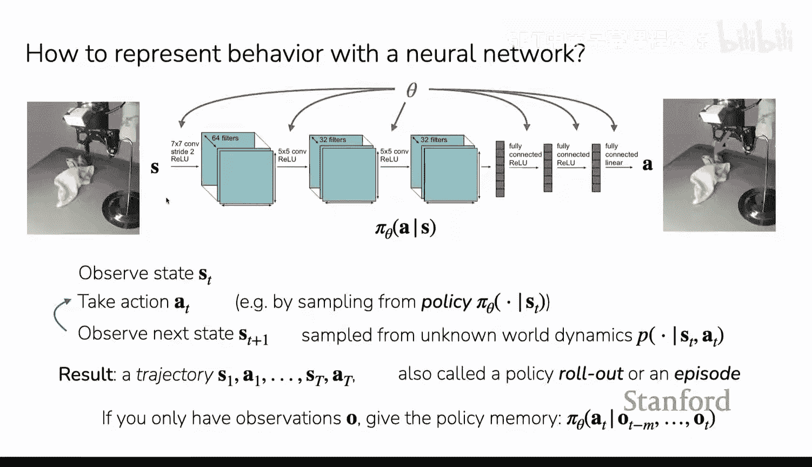

但是，如果你只有观察，那么在某些方面你别无选择，只能向策略提供该记忆。为此，你可能会使用序列模型。例如，在语言模型中，你将使用使用先前观察的序列模型。

关于 `T` 是当前时间步还是从开始到结束的一般表示的问题：这里的大写 `T` 我用来表示轨迹的结束，即轨迹中状态和动作的数量。然后小写 `t` 我指的是一个给定的时间步，并且将其一般化，以便你可以思考这发生在从小写 `t=1` 到小写 `t=T` 的所有时间步。

关于是否曾经有用同时以观察和状态为条件的问题：在这种情况下，状态严格比当前观察包含更多信息，因此如果状态确实是捕捉一切的状态，那么添加观察是没有用的。回到这个图表，如果我们有状态，那么我们只需要提供当前状态；而如果我们有观察，那么添加历史记录是有帮助的。这是状态和观察之间的区别。

为什么观察历史有帮助？基本上，过去的观察将帮助你获得更多关于 `s₁` 是什么的信息。因此，如果你只有观察而不知道世界的底层状态，例如在语言建模中，如果你正在与用户进行对话，用户说的每件事都是不同的观察，过去的观察实际上会告诉你很多关于世界当前状态的信息。如果他们的第一个问题是“你能为我写这段代码吗？”，然后你写了一些代码，他们给了你一些反馈，那么实际上包含所有这些过去的观察对于捕捉世界的完整状态非常重要。这可能并非在所有情况下都成立，但在许多情况下，先前的观察对于预测动作也是有用的。

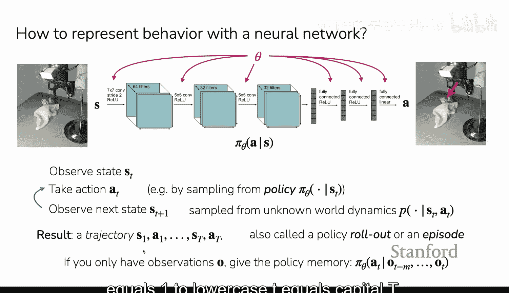

因此，也可能存在你希望有一个两阶段过程的场景：首先推断状态，然后第二个过程从该状态预测动作。如果你对底层状态的良好表示有一些想法，那么这类信息可能对尝试建模底层状态有用。在其他情况下，直接从观察堆栈出发更简单。

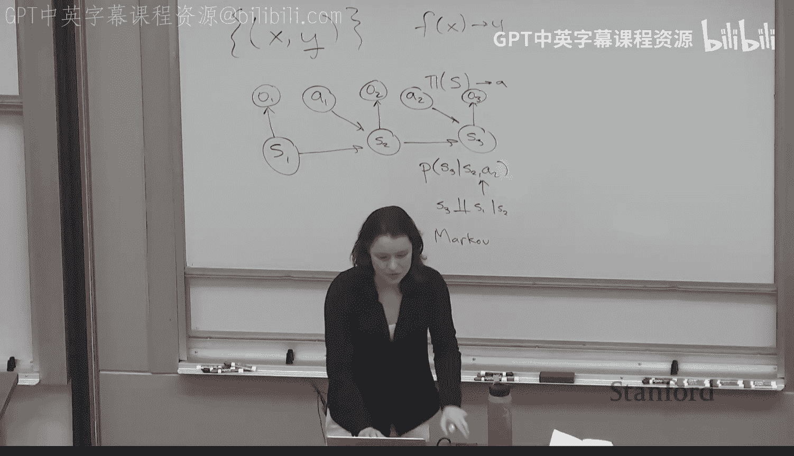

## 强化学习的目标 🏆

我们已经讨论了状态、动作、策略。强化学习的实际目标是什么？我们的目标是最大化奖励。因此，如果我们有一个轨迹，我们不想只优化一个时间步的奖励，而是希望优化整个轨迹的奖励。我们可以将其表示为最大化奖励的总和。

现在，出现的一个问题是，这实际上不是一个确定性的量。如果你有一个策略，并在世界中执行该策略，你得到的奖励并不总是每次运行策略时都相同。

那么问题来了：为什么这不是一个确定性的量？有哪些可变性来源可能导致一个轨迹与另一个轨迹的奖励总和不同？

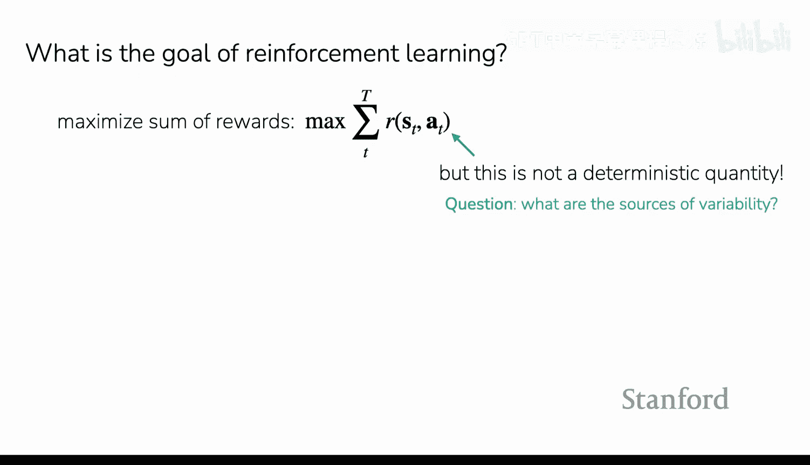

是的，一个可变性来源是，状态不仅仅取决于动作和状态，而且影响下一个状态的还有一些随机性。其他可变性来源。你的策略也可能不是确定性的。所以有两个关键来源。

关于奖励函数是否可能是随机的问题：我们通常将其建模为确定性的函数，并将随机性的来源归因于状态和动作。如果你不知道状态，那么如果你只有观察，它实际上可以被视为随机的。

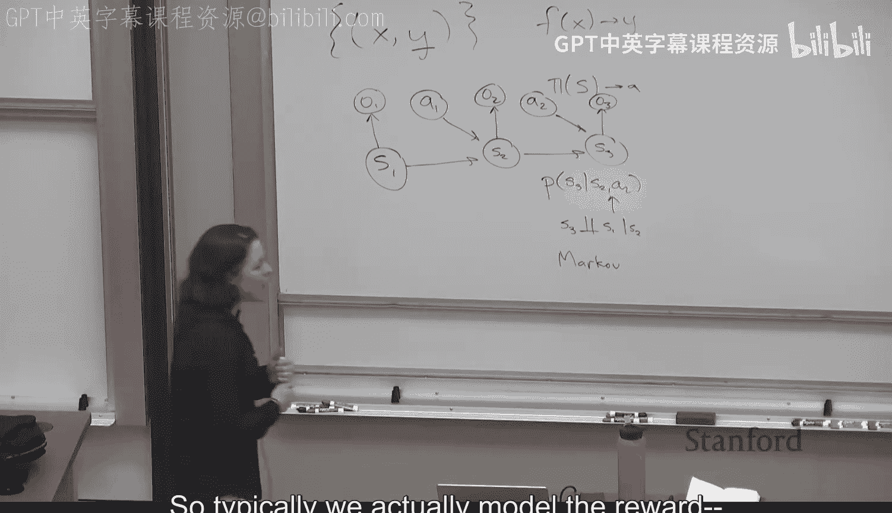

关于奖励学习中的随机性问题：通常你仍然会将其建模为一个奖励函数。你可能对奖励的确切内容没有完全的确定性，也许你想在学习过程中利用这种不确定性。这可能是离线学习的一些考虑因素。

另一个问题是，你的目标可能会随时间变化。在这种情况下，奖励函数会改变。我们实际上通常会将其建模为一个完全不同的决策过程，而不是在同一个过程中。可能存在你想要一个非平稳决策过程的场景，但通常你可以将这种随机性放入状态中，而不是放入奖励函数中。例如，可能有一个你无法观察到的底层目标在状态中，然后奖励函数保持确定性。因此，一般来说，不失一般性，你可以将其推入状态中。

所以，你必须担心的两个主要可变性来源是：世界是随机的（环境动态是一个分布，而不是一个确定性函数）；其次，策略也不是确定性的。例如，在驾驶中，其他汽车的行为方式是随机的，你的汽车可能不会每次都做出相同的决定。

## 目标函数与轨迹分布 📈

如果我们想思考最大化奖励，我们可以将策略加入这个图表中。如果你能访问状态，那么从这里到这里会有一个箭头，模拟这个分布，同样从这里到这里。

现在，如果我们想写下奖励的样子，我们需要思考轨迹的概率分布。我们需要思考未来会看到什么样的分布。

我们可以这样思考：我们会有某个初始状态。可能还有一些我们没有讨论过的随机性，比如世界的初始条件可能会变化。例如，在玩扑克牌时，发牌方式会变化。然后，在状态之后，你将用你的策略做出决策。一旦你做出决定，就会从动态中产生随机性。

如果我们想思考给定轨迹的概率，它将是第一个状态的概率，然后是采取下一个动作的概率，然后是观察到下一个状态的概率，然后是采取之后动作的概率，然后是下一个状态的概率，依此类推。然后我们可以将给定轨迹的概率视为初始状态概率加上策略和动态产生的概率的乘积。

其中 `t` 从1到大写 `T`。一旦我们构建了这个轨迹的概率分布，我们就可以将最大化奖励视为最大化在这个概率分布下采样的轨迹的期望奖励。

所以，我们将思考从这个分布中采样的轨迹的期望，即该轨迹中状态和动作的奖励之和。这是我们的目标：我们的目标是最大化这个期望，我们的目标是找到一个策略 `π`，使其最大化这个期望和。

注意，与监督学习不同，这看起来不像你可以直接优化的东西。实际上，`π` 甚至没有出现在这个方程中，但它影响轨迹的方式是，轨迹的分布是 `π` 的函数。你实际上想找到能带来最高奖励的策略。

本课程的很多内容将是弄清楚我们如何在这个特定目标下优化行为。

关于大写 `T` 是否必须固定的问题：它不必固定，可以是可变的。如果它是固定的，写下来会更容易一些，但你可以将其视为轨迹的长度。

## 折扣因子 ⏳

另一个将更深入讨论的主题是：当你思考奖励时，这是平等地权衡整个轨迹的奖励，它表示你关心即时奖励和关心未来奖励一样多。在某些情况下，你可能更关心即时奖励而不是未来奖励。例如，如果这个 `T` 是一千年，也许你不太关心一千年后的奖励，而更关心今天的奖励。因此，构建强化学习目标的另一种方式不仅仅是这种普通的奖励总和，而是通过所谓的**折扣因子**来加权你的奖励，该折扣因子实际上取决于 `t`。我们经常这样做的方法之一是添加一个折扣因子，其幂次为 `t`。这意味着，如果折扣因子通常是一个大于0且小于或等于1的值，如果它是1，则与原始公式相同。当你使其越来越低时，你会变得更贪婪，你更关心近期奖励而不是远期奖励。

我们将在接下来的课程中更多地讨论折扣因子。

## 为什么策略是随机的？🎲

顺便说一下，我们已经讨论了我们的策略是一个分布，因此它不是确定性的。我们为什么希望这样做呢？

有几个原因可能希望我们的策略不是确定性的。首先，如果你想学习，你可能需要尝试不同的事情。例如，如果你在学习打网球，你不应该一遍又一遍地尝试完全相同的技术。你需要实际探索并尝试不同的策略才能做到。这可以表示为一个尝试几种不同策略并试图找出哪种策略最好的随机策略。

另一种情况是，有些场景中你从人或不同系统收集数据，这些人正在采取不同的策略。如果你想模拟他们处理问题的方式，你可能需要你的策略也是随机的。

为此，我们还可以利用生成模型的工具，你实际上在思考的不仅仅是从 `A` 映射到 `B` 的神经网络，而是给定状态和观察的动作的生成模型。

## 评估策略：价值函数 📊

我想这是我们将要涉及并介绍的最后一件事（实际上是倒数第二件）：我们如何决定一个策略有多好？思考这一点真的很有用，因为如果你不知道你的策略有多好，那么你将无法让你的策略变得更好。

我们用来思考这一点的术语被称为**价值函数**。我们经常思考一个策略在给定状态下的价值函数，通常用 `V^π(s)` 表示。本质上，它的意思是：如果你从状态 `s` 开始，然后从那时起遵循策略 `π`，未来的期望奖励是多少？所以它基本上是这个方程，但从 `s` 开始，遵循你当前的策略。

与此类似，我们还将开始讨论（不是在本周五的讲座中，而是从下周开始）**Q价值函数**。这与价值函数非常相似，但不是从 `s` 开始，而是从 `s` 开始，然后采取动作 `a`，然后遵循 `π`，其中动作 `a` 可能不同于策略 `π` 可能采取的动作。

我今天不会深入探讨这两个函数是什么，但我想介绍它们，因为我们将大量使用它们，所以开始理解它们是什么是很好的，随着我们在未来的讲座中更多地使用它们。

## 算法类型概览 📚

我们将涵盖的算法类型：模仿学习的理念是模仿一个获得高奖励的策略。然后下周我们将开始讨论策略梯度，它试图直接对这个目标进行微分，并从实践和经验中学习。从那里，我们将讨论演员-评论家算法，它估计当前策略的价值，并用它来改进策略。我们将讨论基于价值的方法，它试图估计最优策略的价值，然后用它来推导出一个好的策略。最后，我们将讨论基于模型的方法，它实际上学习如何建模世界的动态（例如，尝试预测未来），然后用它来改进策略或进行规划。

现在你可能想知道，为什么我们有这么多不同的算法来优化这个目标？在监督学习中，我们只有梯度下降，它有效，很棒，很简单。在强化学习中，事情不那么简单。算法做出不同的权衡，并在不同的假设下表现出色。因此，这将取决于，例如，收集数据的难易程度或成本。如果你在模拟器中，收集大量数据非常便宜，而如果你手写响应或实际与人交互，那将更昂贵。此外，不同形式的监督的难易程度如何？你有演示吗？你有详细的奖励吗？稳定性和易用性与数据效率相比有多重要？也许你有更多时间来调整一些超参数，如果它不需要大量数据的话。还有一些关于你的动作是什么样的考虑：它们的维度有多高？它们是连续的还是离散的？学习动态模型容易吗？是的，这些就是我们有很多不同算法的一些原因，我们将在本课程后面的部分讨论不同的算法以及它们在哪里应用。

## 总结 📝

好了，总结一下。强化学习中有很多术语和符号，我想今天开始介绍它们，因为我们将在接下来的讲座中开始大量使用它们。我们讨论了状态、观察、动作、奖励函数，以及初始状态分布和动态。这些构成了所谓的**马尔可夫决策过程**，或者如果你只有观察，它被称为**部分可观测马尔可夫决策过程**，或MDP/POMDP。我不想直到最后才引入这个符号，因为它实际上叫什么并不重要，但从长远来看，如果人们提到MDP，你现在知道他们指的是什么，他们指的是强化学习问题的这种构建。

我们还讨论了轨迹、策略、强化学习的目标、价值函数和Q函数（简要地）。

在本节课中，我们一起学习了深度强化学习的基本概念，包括其定义、与监督学习的区别、应用实例、核心问题构建（状态、动作、奖励、策略、轨迹），以及强化学习的目标函数。我们还简要介绍了价值函数和不同类型的强化学习算法。这些基础知识为我们后续深入学习各种强化学习方法奠定了坚实的基础。