#  003：策略梯度 🎯

在本节课中，我们将要学习在线强化学习算法，特别是策略梯度方法。我们将从数学推导和直观理解两个层面，探讨如何通过试错来改进策略，使其获得更高的累积奖励。

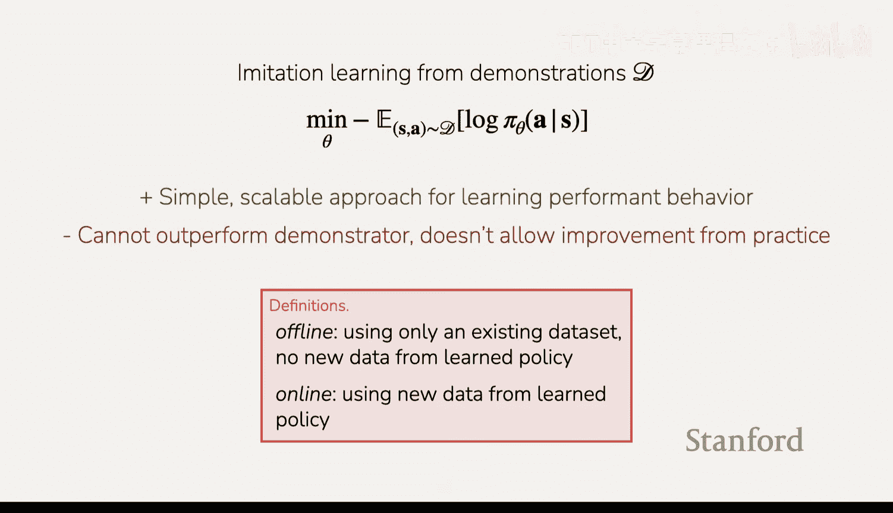

---

## 概述 📋

到目前为止，我们已经将强化学习问题形式化为一个包含状态、动作、轨迹和奖励函数的问题。我们的目标是学习一个策略，以最大化期望的累积奖励。上周我们讨论了模仿学习，它虽然简单且可扩展，但无法超越演示者，也不允许通过试错进行改进。

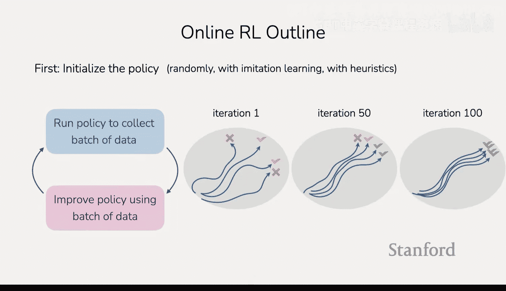

今天，我们将开始讨论在线强化学习算法，特别是策略梯度方法。策略梯度是许多流行强化学习算法的基础，包括用于训练足式机器人和语言模型的算法。我们将学习其背后的直觉、如何实现以及何时使用它。

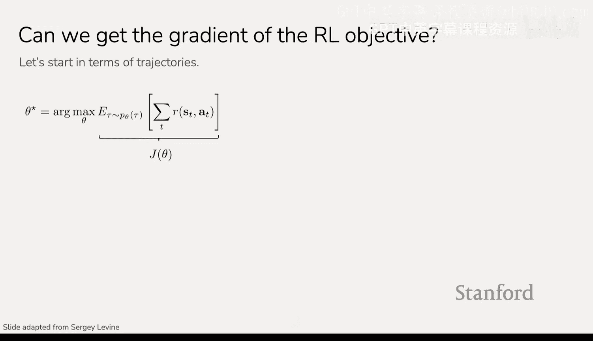

---

## 在线强化学习算法流程 🔄

在线强化学习算法的流程通常如下：

1.  **初始化策略**：就像训练神经网络需要初始化权重一样，我们可以随机初始化策略权重，或使用模仿学习、启发式方法进行初始化。
2.  **收集数据**：运行当前策略，在环境中尝试不同的动作，收集轨迹数据。
3.  **改进策略**：利用收集到的这批数据来更新和改进策略。
4.  **重复过程**：使用更新后的策略收集新的数据，并再次更新策略，如此循环。

这个过程体现了在线强化学习的核心思想：在线收集数据，并用这些数据来改进策略。

---

## 策略梯度目标与梯度推导 🧮

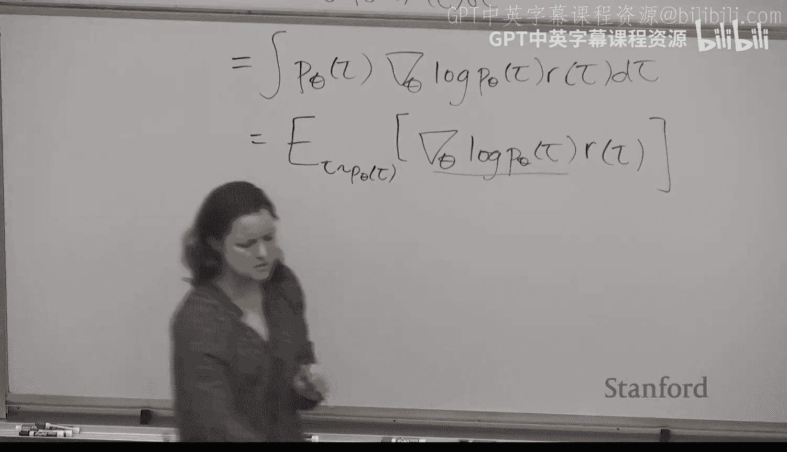

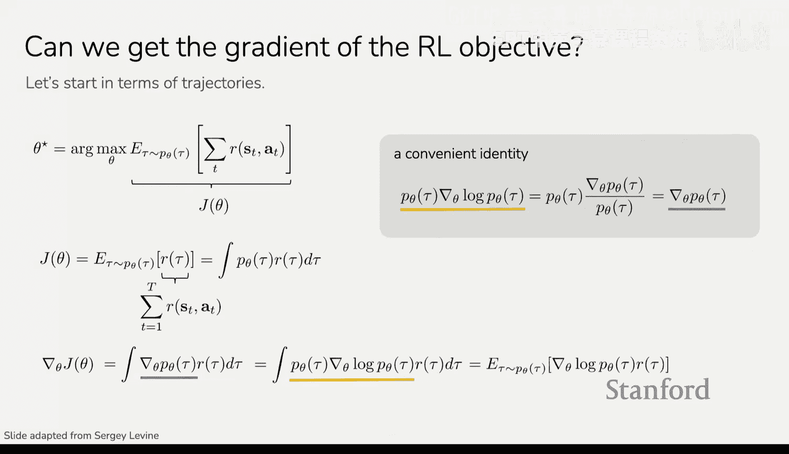

我们有一个策略 `π_θ`，目标是最大化在该策略下采样轨迹的期望累积奖励。我们将这个目标记为 `J(θ)`：

`J(θ) = E_{τ∼p_θ(τ)}[R(τ)]`

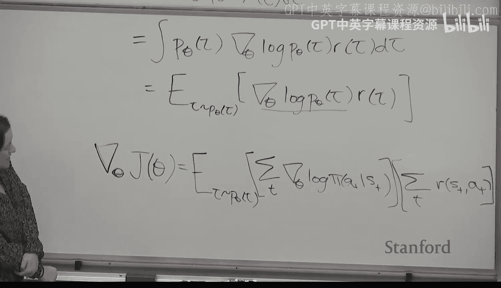

其中，`R(τ)` 是轨迹 `τ` 上奖励的总和。我们希望使用梯度下降来优化 `θ`，因此需要计算目标 `J(θ)` 关于参数 `θ` 的梯度。

直接计算这个梯度具有挑战性，因为 `θ` 的影响是通过采样轨迹的概率分布 `p_θ(τ)` 间接体现的。我们使用一个对数技巧来重写梯度：

`∇_θ J(θ) = ∇_θ ∫ p_θ(τ) R(τ) dτ = ∫ ∇_θ p_θ(τ) R(τ) dτ`

利用恒等式 `∇_θ p_θ(τ) = p_θ(τ) ∇_θ log p_θ(τ)`，我们可以将梯度改写为：

`∇_θ J(θ) = ∫ p_θ(τ) ∇_θ log p_θ(τ) R(τ) dτ = E_{τ∼p_θ(τ)}[∇_θ log p_θ(τ) R(τ)]`

现在，梯度表达式中包含了期望，我们可以通过采样来估计它。

---

## 简化梯度表达式 ✂️

轨迹的概率 `p_θ(τ)` 可以分解为初始状态分布、策略和动态模型的乘积：

`p_θ(τ) = p(s_1) ∏_{t=1}^{T} π_θ(a_t|s_t) p(s_{t+1}|s_t, a_t)`

取其对数：

`log p_θ(τ) = log p(s_1) + ∑_{t=1}^{T} [log π_θ(a_t|s_t) + log p(s_{t+1}|s_t, a_t)]`

再对其求关于 `θ` 的梯度。由于初始状态分布 `p(s_1)` 和环境动态 `p(s_{t+1}|s_t, a_t)` 与 `θ` 无关，它们的梯度为零。因此：

`∇_θ log p_θ(τ) = ∑_{t=1}^{T} ∇_θ log π_θ(a_t|s_t)`

将这个结果代回我们的梯度公式中，得到：

`∇_θ J(θ) = E_{τ∼p_θ(τ)}[ (∑_{t=1}^{T} ∇_θ log π_θ(a_t|s_t)) R(τ) ]`

这就是**原始策略梯度**或**REINFORCE算法**的梯度公式。它比最初的版本友好得多，因为我们可以从策略中采样轨迹，计算每条轨迹的奖励 `R(τ)` 以及每个时间步动作的对数概率梯度 `∇_θ log π_θ(a_t|s_t)`，然后将它们相乘并求和，从而得到一个可用于更新神经网络权重的梯度估计。

---

## 策略梯度算法实现 ⚙️

上一节我们推导了策略梯度的核心公式，本节中我们来看看如何将其转化为具体的算法。

完整的算法步骤如下：

1.  从当前策略 `π_θ` 中采样 `N` 条轨迹。
2.  使用这些样本估计梯度：`∇_θ J(θ) ≈ (1/N) ∑_{i=1}^{N} [ (∑_{t=1}^{T} ∇_θ log π_θ(a_t^i|s_t^i)) R(τ^i) ]`
3.  使用估计出的梯度对策略参数 `θ` 执行梯度上升步骤（因为我们要最大化奖励）。
4.  重复上述过程，用更新后的策略收集新数据，并再次改进。

在实际实现时，我们可以构建一个替代损失函数，其梯度与上述梯度公式相同，然后利用自动微分软件进行一次前向和反向传播，这比进行 `N×T` 次单独的反向传播要高效得多。

---

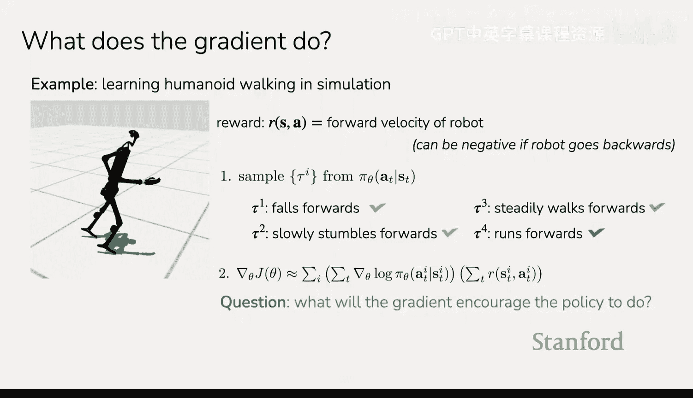

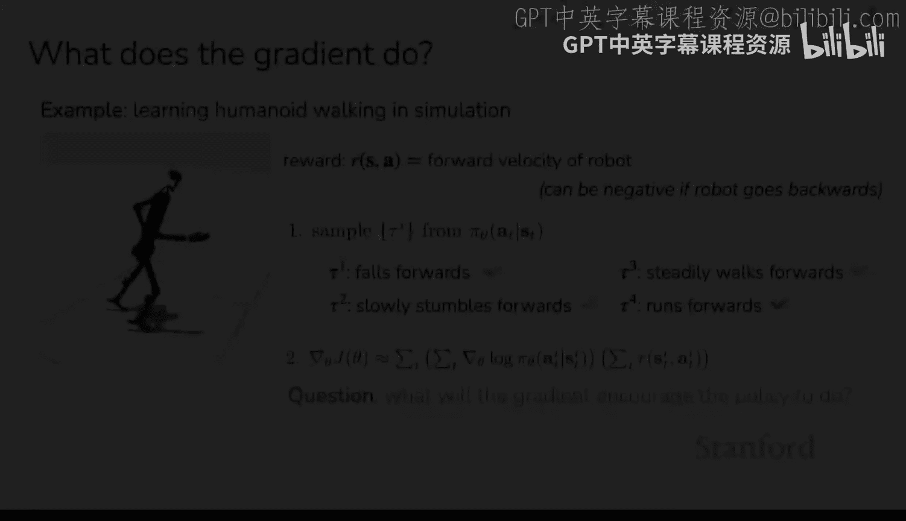

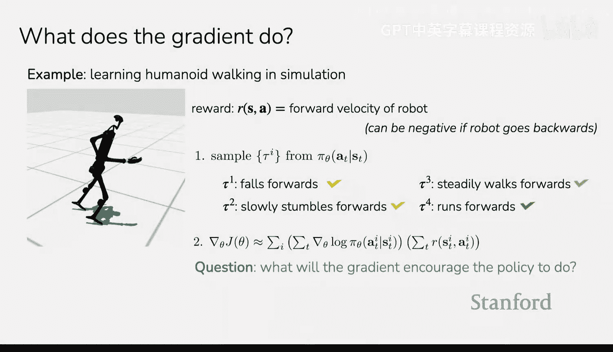

## 策略梯度的直观理解与改进 🧠

### 直观理解

观察梯度公式 `∇_θ log π_θ(a_t|s_t) R(τ)`，我们可以获得直观理解：
*   `∇_θ log π_θ(a_t|s_t)` 部分类似于模仿学习的梯度，旨在增加当前策略下已采取动作的概率。
*   `R(τ)` 作为权重，决定了这个“模仿”梯度是正向还是反向。
    *   如果轨迹奖励 `R(τ)` 高，则增加该轨迹中所有动作的概率。
    *   如果轨迹奖励 `R(τ)` 低，则减少该轨迹中所有动作的概率。

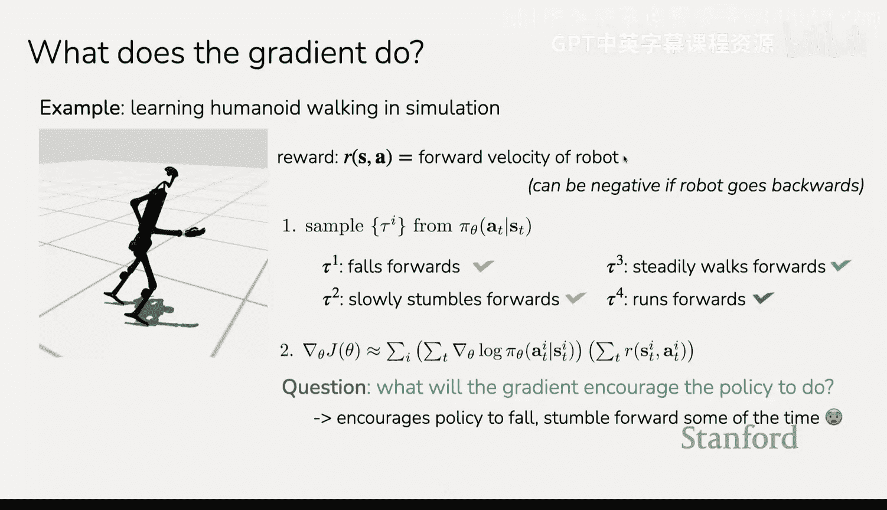

因此，策略梯度本质上是在执行“**多做高奖励的事，少做低奖励的事**”的试错学习。

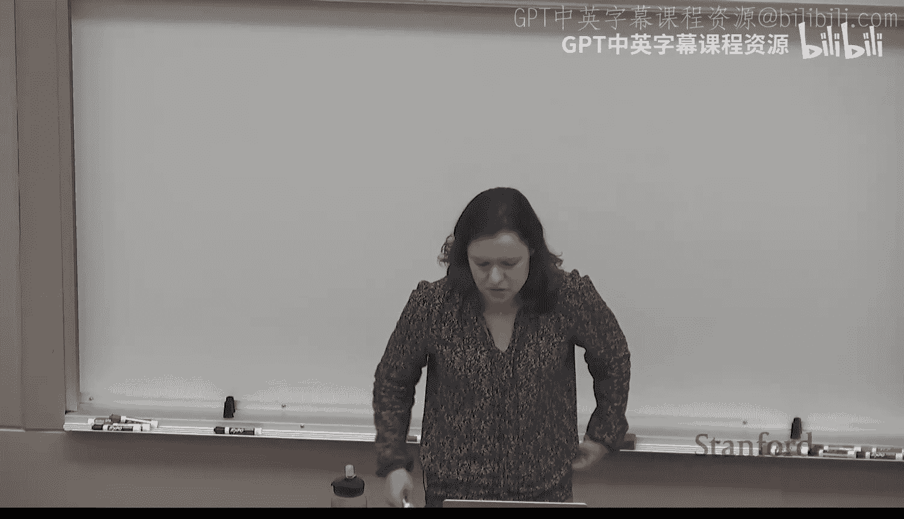

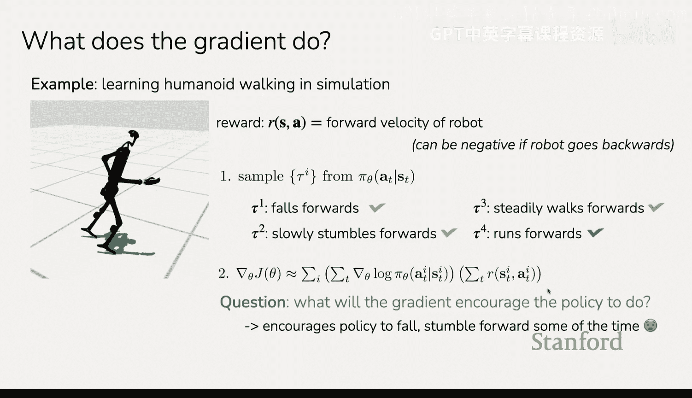

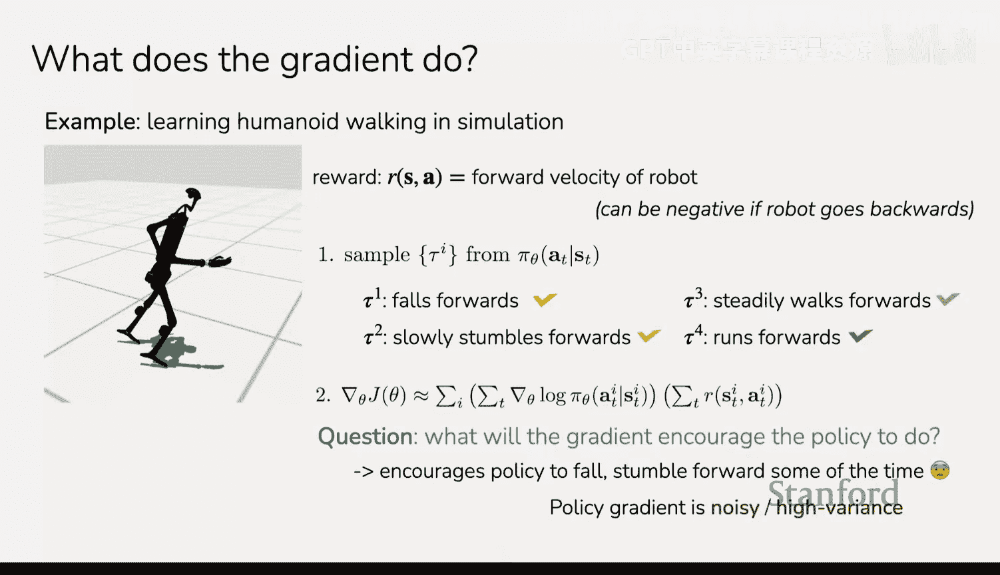

### 改进1：仅使用未来奖励

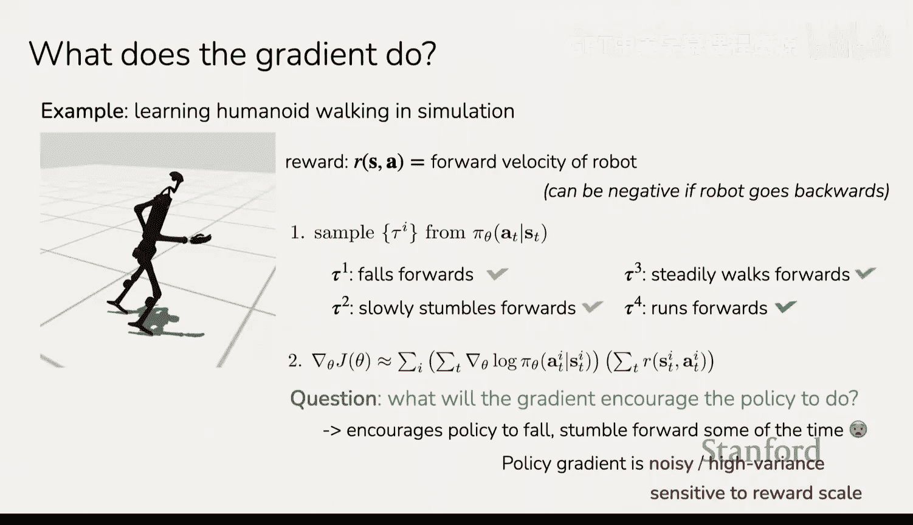

当前动作无法影响过去的奖励。在原始公式中，一个时间步的动作梯度受到整个轨迹奖励的影响，这并不合理。我们可以进行改进，只使用当前动作之后的未来奖励之和：

`∇_θ J(θ) ≈ E_{τ∼p_θ(τ)}[ ∑_{t=1}^{T} ∇_θ log π_θ(a_t|s_t) (∑_{t'=t}^{T} R(s_{t'}, a_{t'})) ]`

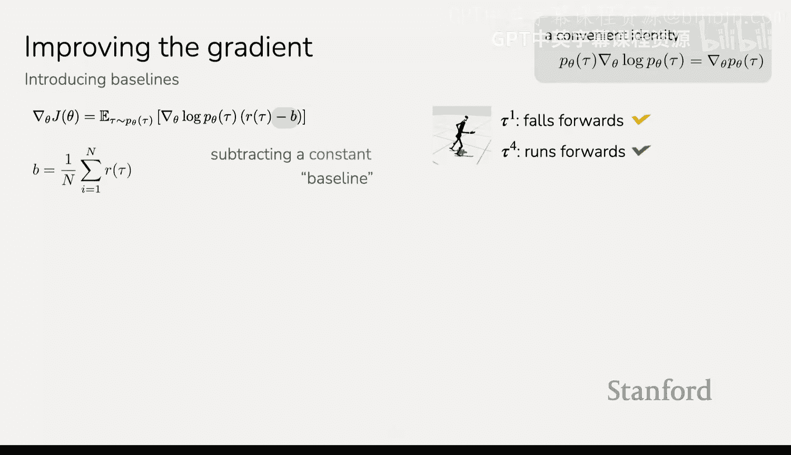

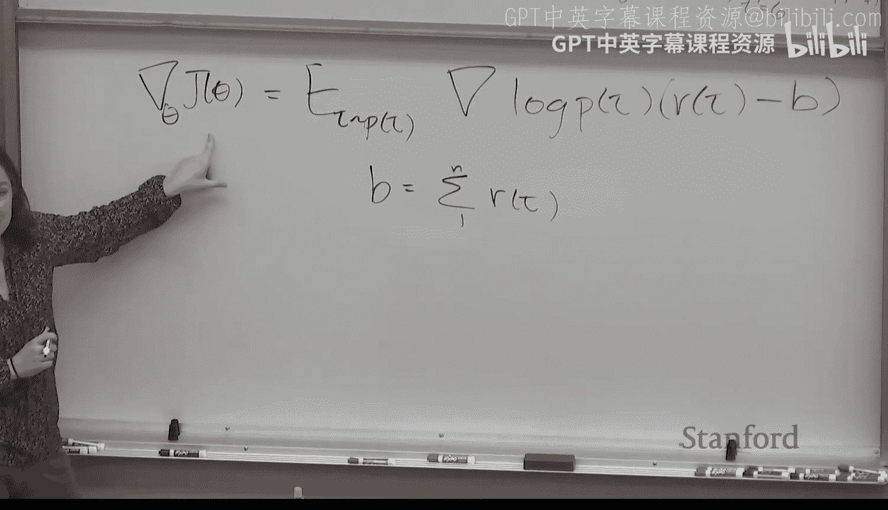

其中，`(∑_{t'=t}^{T} R(s_{t'}, a_{t'}))` 被称为“**奖励到-go**”。这样，动作的更新只依赖于它未来可能带来的后果，更符合因果关系。

### 改进2：引入基线以减少方差

策略梯度估计的方差可能很高。例如，如果所有奖励都是正数，则所有梯度更新都是正向的，这虽然仍会推动策略向好方向发展，但效率较低。我们可以通过减去一个基线（baseline）来改进：

`∇_θ J(θ) ≈ E_{τ∼p_θ(τ)}[ ∑_{t=1}^{T} ∇_θ log π_θ(a_t|s_t) ( (∑_{t'=t}^{T} R(s_{t'}, a_{t'})) - b ) ]`

一个常见且有效的选择是使用平均奖励作为基线 `b`。可以证明，只要基线 `b` 不依赖于动作，这样的操作不会改变梯度的期望值（是无偏的），但能显著降低其方差。直观上，它使更新变为“**鼓励高于平均水平的轨迹，抑制低于平均水平的轨迹**”。

---

## 离策略策略梯度 🔄

到目前为止讨论的策略梯度是**同策略**的，即用于估计梯度的数据必须来自当前待更新的策略 `π_θ`。这意味着每执行一次梯度更新，就需要重新收集数据，效率低下。

我们希望能够重用旧策略 `π_θ_old` 收集的数据来更新当前策略 `π_θ`，即实现**离策略**学习。这可以通过**重要性采样**技术来实现。

重要性采样允许我们利用从一个分布 `q(x)` 中采样的样本来估计关于另一个分布 `p(x)` 的期望：

`E_{x∼p(x)}[f(x)] = E_{x∼q(x)}[ (p(x)/q(x)) f(x) ]`

将其应用于我们的场景，假设我们有从旧策略 `π_θ_old` 采样的轨迹，我们想估计新策略 `π_θ` 的目标函数的梯度：

`∇_θ J(θ) = E_{τ∼π_θ_old}[ (p_θ(τ)/p_{θ_old}(τ)) ∑_{t=1}^{T} ∇_θ log π_θ(a_t|s_t) (∑_{t'=t}^{T} R(s_{t'}, a_{t'})) ]`

其中，重要性权重 `p_θ(τ)/p_{θ_old}(τ)` 可以分解为每个时间步策略概率的比值。在实践中，当轨迹很长时，这个乘积可能变得极不稳定（非常大或非常小）。因此，近似方法常被使用，有时会忽略状态分布的变化，只考虑动作概率的比值。

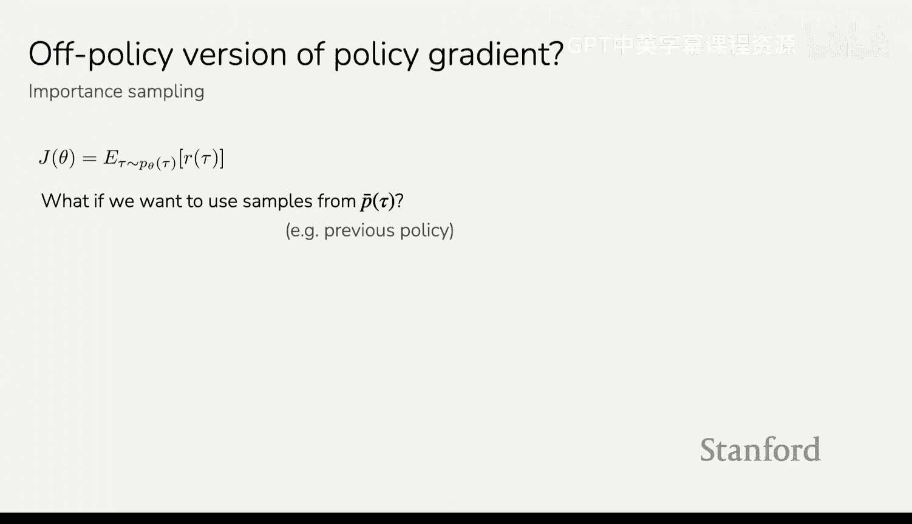

离策略策略梯度允许我们在同一批数据上执行多次梯度更新，提高了数据利用率。

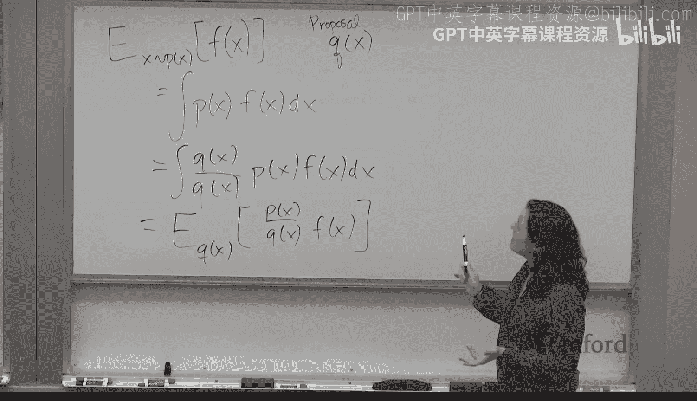

---

## 总结 📝

本节课中我们一起学习了策略梯度方法，这是我们的第一个在线强化学习算法。

*   **核心思想**：通过“多做高奖励的事，少做低奖励的事”的试错方式来优化策略。
*   **数学基础**：我们推导了策略梯度定理，得到了梯度估计公式 `∇_θ J(θ) = E[∑ ∇_θ log π_θ(a|s) * 未来奖励]`。
*   **关键改进**：
    *   **仅使用未来奖励**：使更新符合因果关系。
    *   **引入基线**：使用平均奖励等基线来减少梯度估计的方差，加速收敛。
    *   **离策略学习**：通过重要性采样重用旧数据，提高数据效率，允许在同一批数据上进行多次更新。
*   **特点与适用场景**：策略梯度方法直观且通用，但梯度估计的方差较高。它最适用于**奖励信号相对密集**且可以使用**大批量数据**进行训练的场景。

策略梯度为更高级的演员-评论员方法（如PPO）奠定了基础，我们将在接下来的课程中继续探讨。