#  005：离策略演员-评论家方法

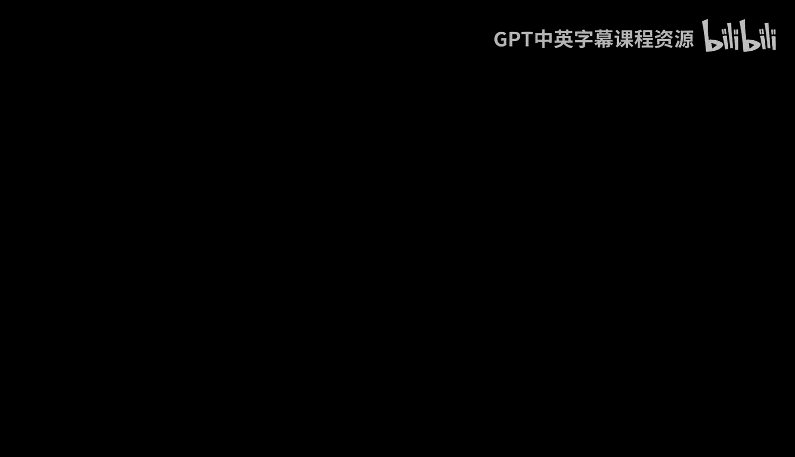

在本节课中，我们将要学习如何将演员-评论家方法从“同策略”扩展到“离策略”，从而更高效地利用数据。我们将探讨两种实用的算法：PPO和SAC，并理解它们背后的核心概念。

---

## 课程回顾与引入

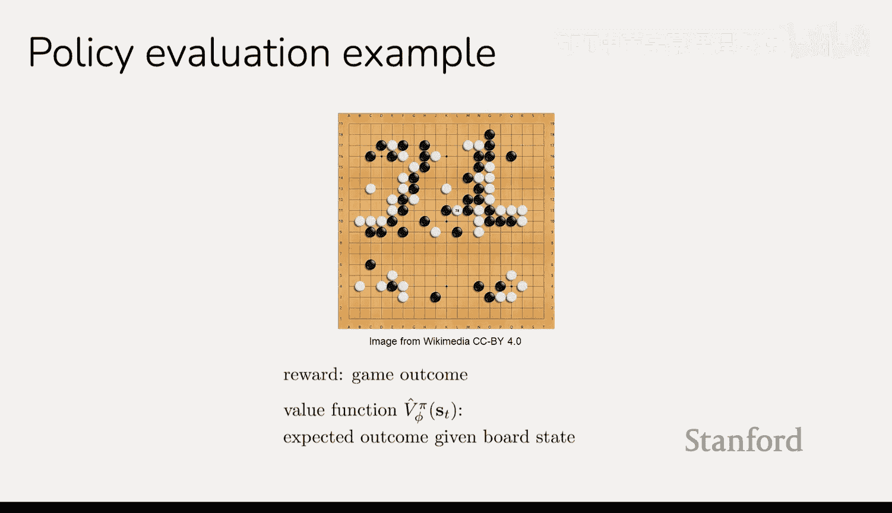

上一节我们介绍了演员-评论家方法，它结合了策略梯度和价值函数估计。本节中，我们来看看如何让这些方法变得更高效，即能够复用旧数据，进行多次梯度更新。

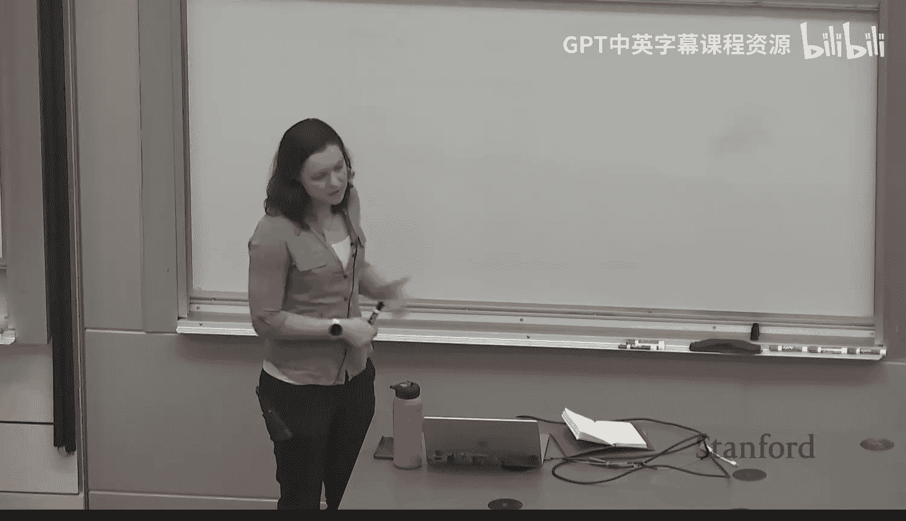

### 策略梯度回顾

在策略梯度方法中，我们的目标是运行一个策略来收集一批数据，然后利用这批数据改进策略，并重复此过程。改进策略的核心公式如下：

**公式：**
\[
\nabla_{\theta} J(\theta) \approx \frac{1}{N} \sum_{i=1}^{N} \nabla_{\theta} \log \pi_{\theta}(a_i|s_i) \hat{A}^{\pi}(s_i, a_i)
\]

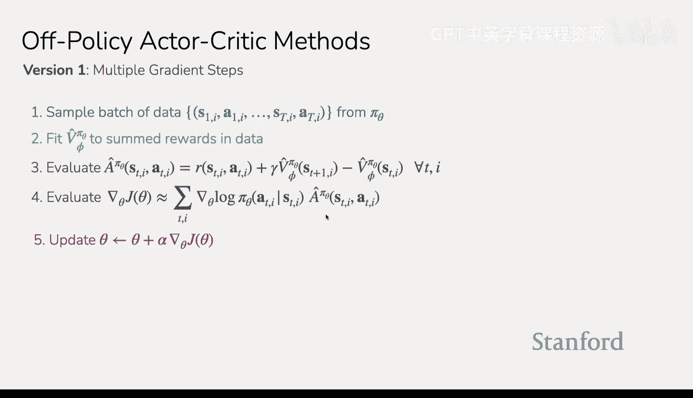

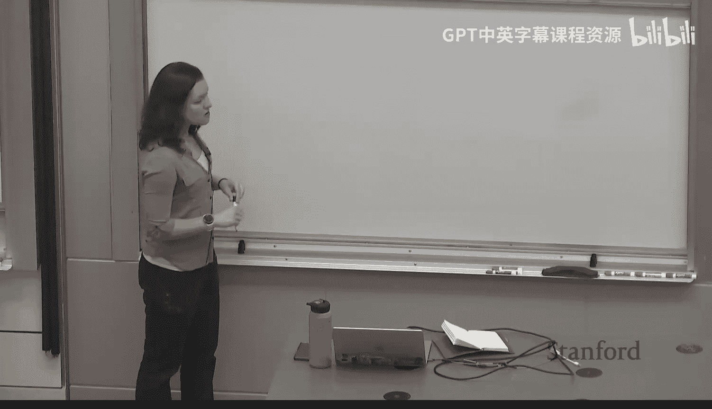

其中，优势函数估计 \(\hat{A}^{\pi}(s_i, a_i)\) 衡量了在状态 \(s_i\) 下采取动作 \(a_i\) 相对于遵循策略 \(\pi\) 的平均表现有多好。我们通过减去一个基线（通常是价值函数 \(V(s)\)）来降低方差：

**公式：**
\[
\hat{A}^{\pi}(s_i, a_i) = Q^{\pi}(s_i, a_i) - V^{\pi}(s_i)
\]

### 价值函数与Q函数

价值函数 \(V^{\pi}(s)\) 表示从状态 \(s\) 开始，遵循策略 \(\pi\) 所能获得的期望未来总回报。

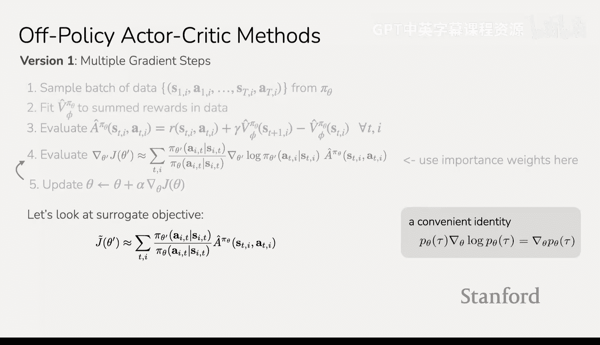

**公式：**
\[
V^{\pi}(s) = \mathbb{E}_{\tau \sim \pi} \left[ \sum_{t=0}^{\infty} \gamma^t r_t \bigg| s_0 = s \right]
\]

Q函数 \(Q^{\pi}(s, a)\) 则表示在状态 \(s\) 下先采取动作 \(a\)，然后遵循策略 \(\pi\) 所能获得的期望未来总回报。

**公式：**
\[
Q^{\pi}(s, a) = \mathbb{E}_{\tau \sim \pi} \left[ \sum_{t=0}^{\infty} \gamma^t r_t \bigg| s_0 = s, a_0 = a \right]
\]

优势函数则定义为：
**公式：**
\[
A^{\pi}(s, a) = Q^{\pi}(s, a) - V^{\pi}(s)
\]

直观上，价值函数好比在围棋棋局中，给定当前棋盘状态和策略，对最终获胜概率的估计。Q函数则是在考虑一个特定落子动作后的获胜概率估计。

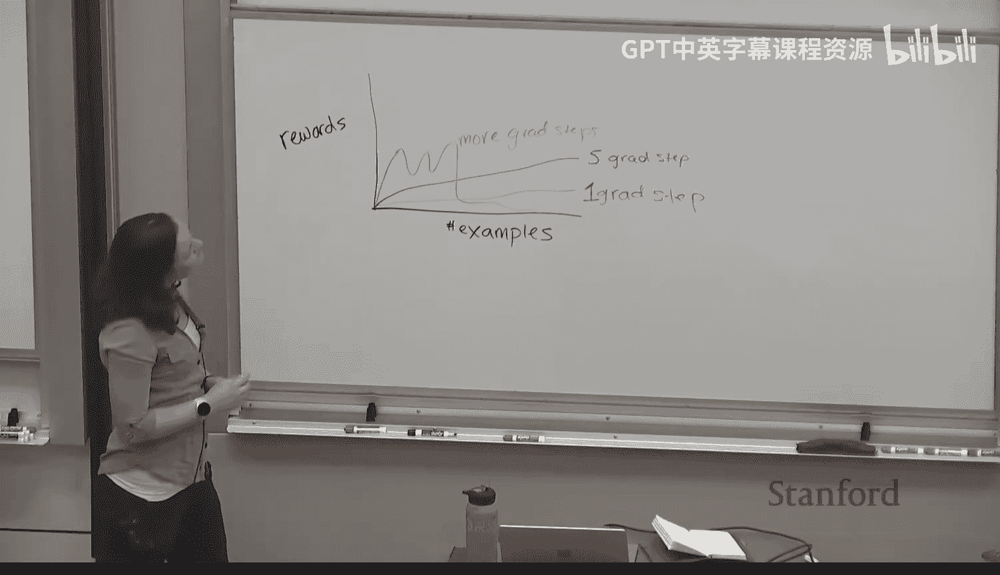

---

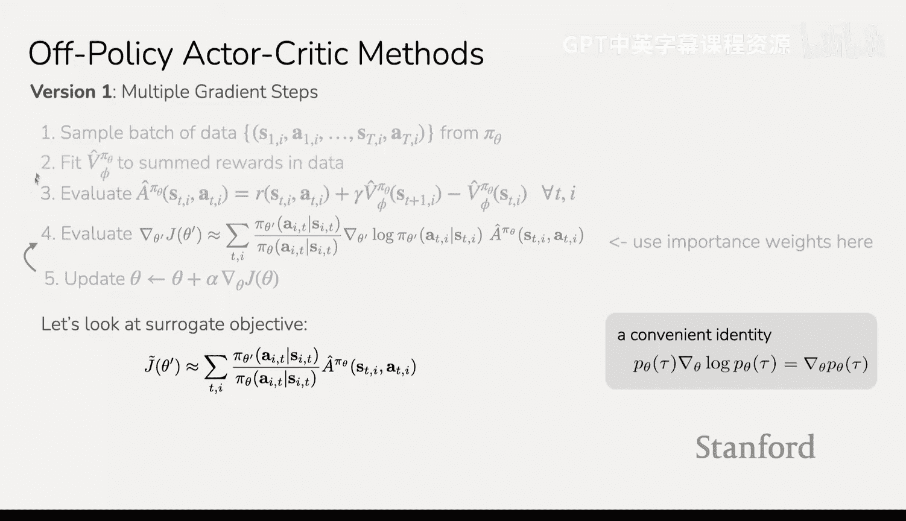

## 从同策略到离策略

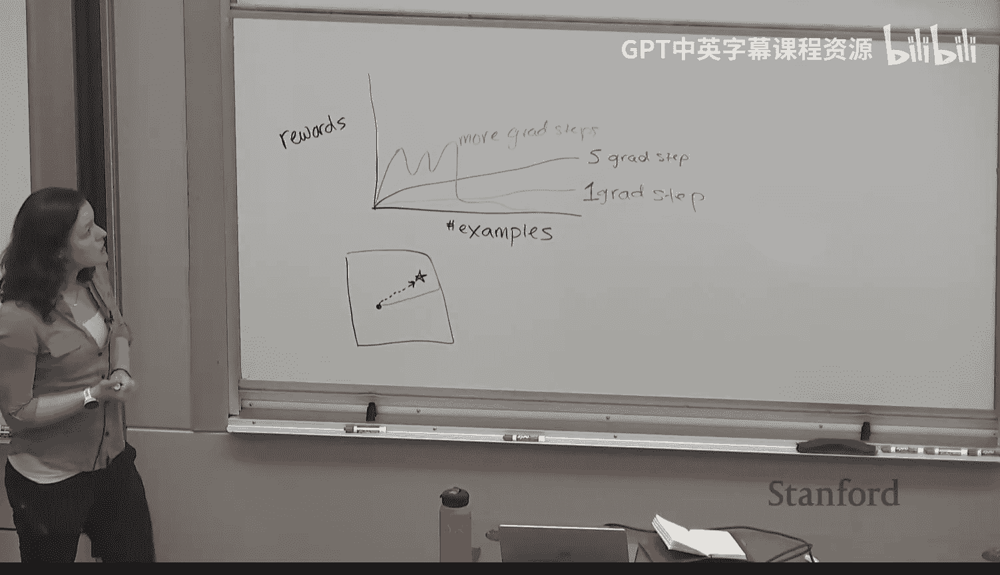

上一节我们讨论的演员-评论家方法主要是同策略的，即用于评估优势函数的数据必须来自当前待更新的策略。本节中我们来看看如何将其转变为离策略方法，从而能复用旧数据，提升数据效率。

### 重要性采样

为了实现离策略更新，我们需要使用重要性采样。假设我们使用旧策略 \(\pi_{\theta_{old}}\) 收集了一批数据，现在想用这批数据来更新新策略 \(\pi_{\theta_{new}}\)。策略梯度的估计可以修正为：

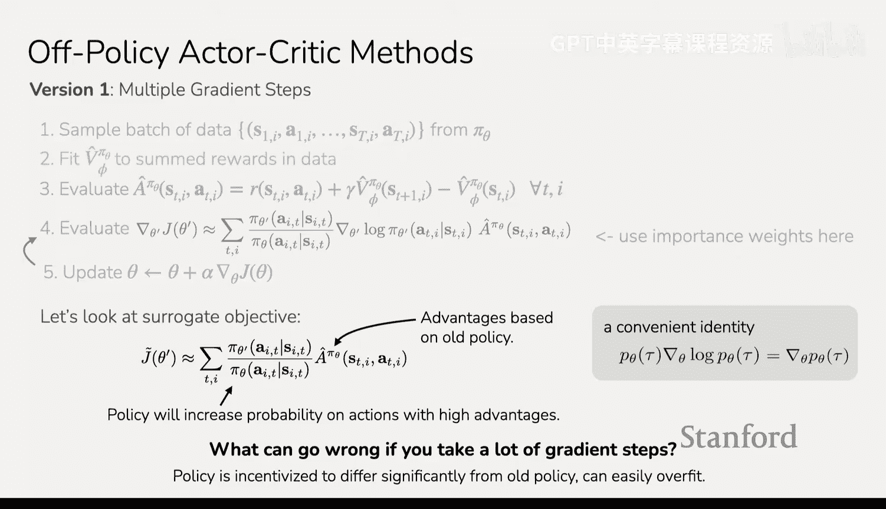

**公式：**
\[
\nabla_{\theta} J(\theta) \approx \frac{1}{N} \sum_{i=1}^{N} \frac{\pi_{\theta_{new}}(a_i|s_i)}{\pi_{\theta_{old}}(a_i|s_i)} \nabla_{\theta} \log \pi_{\theta_{new}}(a_i|s_i) \hat{A}^{\pi_{old}}(s_i, a_i)
\]

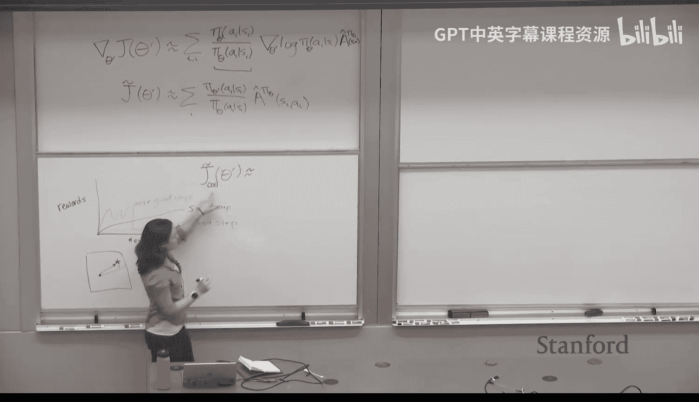

这里，重要性权重 \(\frac{\pi_{\theta_{new}}(a_i|s_i)}{\pi_{\theta_{old}}(a_i|s_i)}\) 用于纠正数据分布差异。

### 替代目标函数

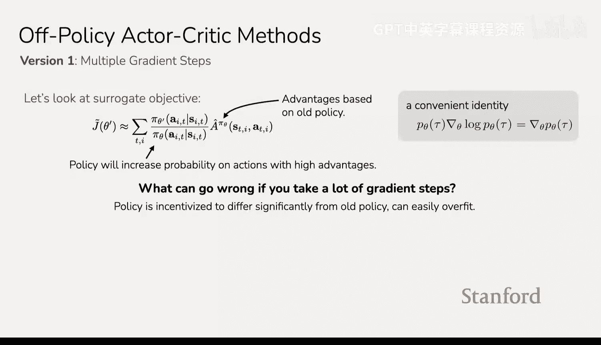

在实际实现中，我们通常优化一个替代目标函数，其梯度等于上述策略梯度。该目标函数为：

**公式：**
\[
J^{CPI}(\theta) = \mathbb{E}_{(s,a) \sim \pi_{old}} \left[ \frac{\pi_{\theta}(a|s)}{\pi_{\theta_{old}}(a|s)} \hat{A}^{\pi_{old}}(s, a) \right]
\]

其中 CPI 代表保守策略迭代。

然而，直接优化这个目标存在风险。如果新策略与旧策略差异过大，重要性权重会变得非常极端（极大或极小），导致梯度估计方差巨大，学习过程不稳定甚至崩溃。

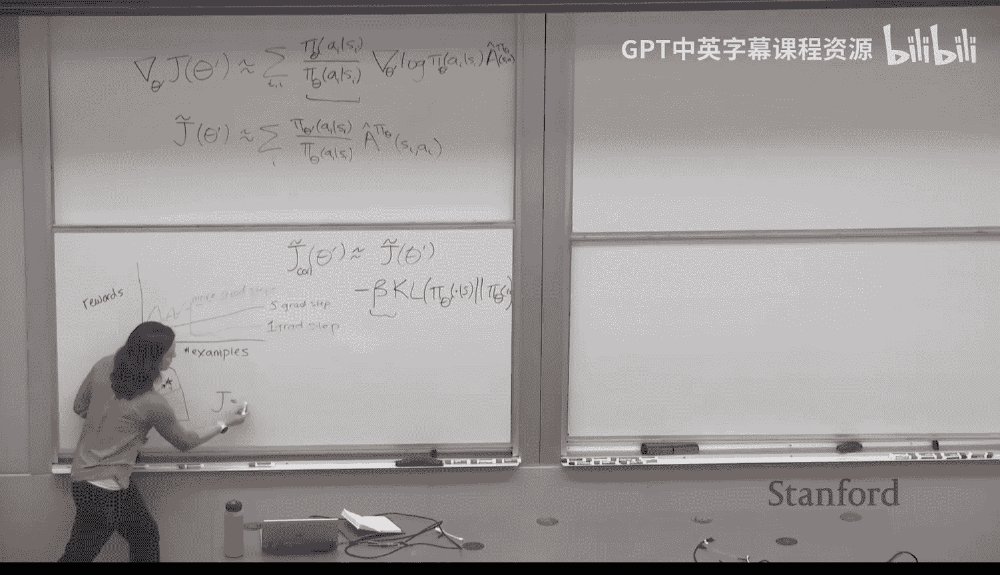

---

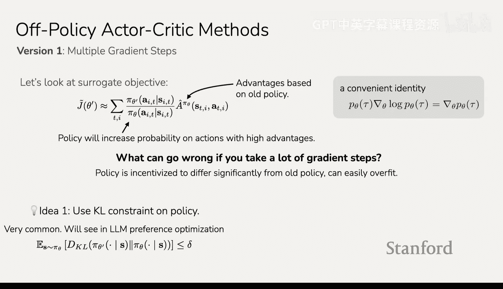

## 近端策略优化

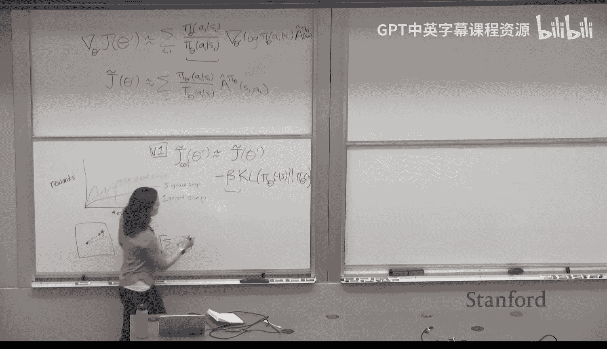

为了解决上述问题，PPO算法引入了关键技巧来约束策略更新的幅度，确保学习稳定性。

### 技巧一：裁剪重要性权重

PPO的核心思想是限制重要性权重的变化范围，防止新策略过度偏离旧策略。我们定义一个裁剪后的替代目标函数：

**公式：**
\[
J^{CLIP}(\theta) = \mathbb{E}_{(s,a) \sim \pi_{old}} \left[ \min \left( \frac{\pi_{\theta}(a|s)}{\pi_{\theta_{old}}(a|s)} \hat{A}, \text{clip}\left(\frac{\pi_{\theta}(a|s)}{\pi_{\theta_{old}}(a|s)}, 1-\epsilon, 1+\epsilon\right) \hat{A} \right) \right]
\]

其中，\(\epsilon\) 是一个超参数（例如0.2）。`clip` 函数将重要性权重限制在 \([1-\epsilon, 1+\epsilon]\) 区间内。取 `min` 操作确保了当优势函数估计为负且权重被裁剪调高时，我们不会意外地让目标函数变得更好（即不会鼓励有害的更新）。

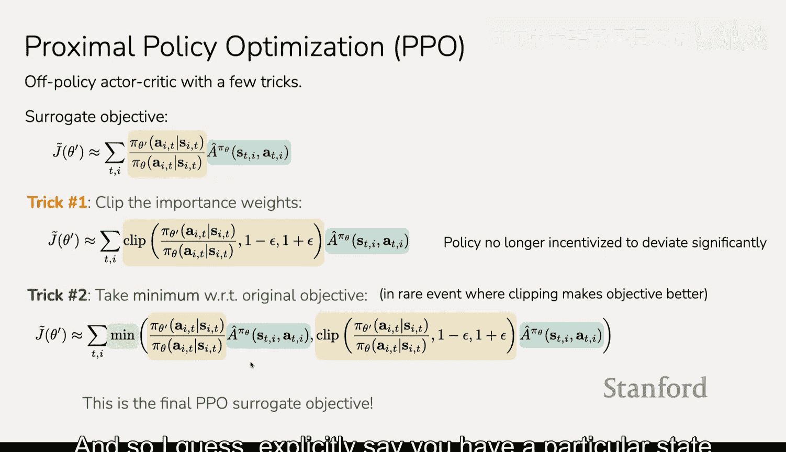

### 技巧二：广义优势估计

PPO通常结合广义优势估计来估计优势函数 \(\hat{A}\)。GAE通过混合不同步长的优势估计，在偏差和方差之间取得平衡：

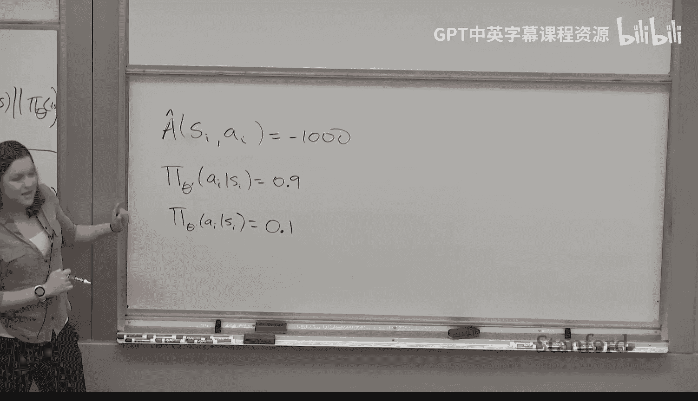

**公式：**
\[
\hat{A}^{GAE(\gamma, \lambda)}_t = \sum_{l=0}^{\infty} (\gamma \lambda)^l \delta_{t+l}
\]
其中，
\[
\delta_t = r_t + \gamma V(s_{t+1}) - V(s_t)
\]

### PPO算法流程

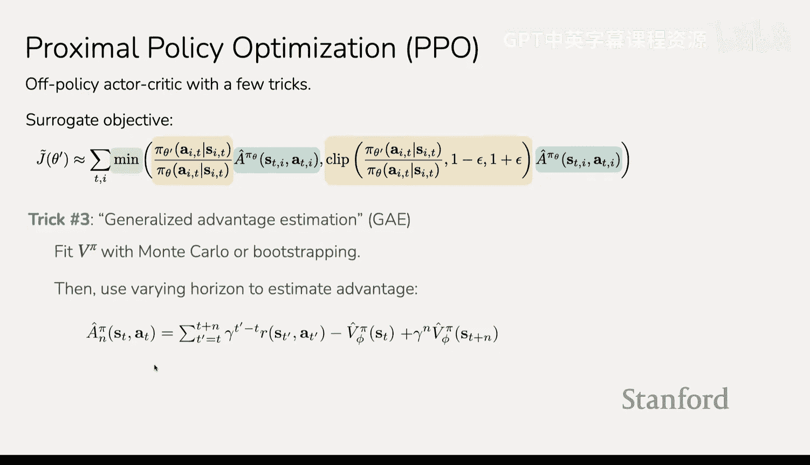

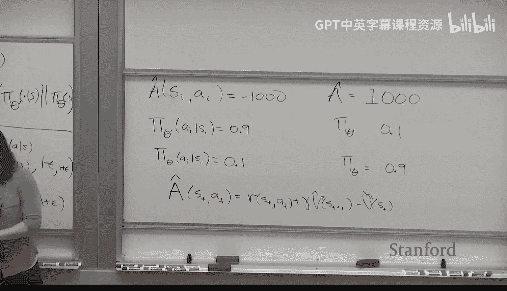

以下是PPO算法的简化步骤：

1.  使用当前策略 \(\pi_{\theta}\) 收集一批轨迹数据。
2.  使用收集的数据（通过蒙特卡洛或时序差分方法）拟合价值函数 \(V_{\phi}(s)\)。
3.  使用GAE计算每个状态-动作对的优势估计 \(\hat{A}\)。
4.  通过优化裁剪后的替代目标函数 \(J^{CLIP}(\theta)\)，对策略进行多次（例如10-15个） epochs 的更新。
5.  重复步骤1-4。

通过裁剪，PPO能够在一批数据上稳定地进行多次策略更新，相比传统策略梯度方法数据效率更高，同时保持了较好的稳定性。

---

## 更彻底的离策略：软演员-评论家算法

上一节我们通过裁剪限制了策略更新，从而可以复用一批数据多次。本节中我们来看一个更激进的离策略方法——SAC，它通过引入回放缓冲区来复用所有历史数据。

### 回放缓冲区

回放缓冲区是一个存储过去经验（状态、动作、奖励、下一个状态）的数据集。算法可以从中随机采样小批量数据来进行更新，从而打破数据间的时序相关性，并复用旧经验。

### 拟合当前策略的Q函数

使用回放缓冲区的主要挑战在于，数据来自过去的各种策略。如果我们想评估当前策略的价值，直接使用旧数据拟合的价值函数 \(V(s)\) 是不准确的，因为它对应的是旧策略的混合。

解决方案是转而拟合Q函数 \(Q(s, a)\)。Q函数的贝尔曼方程对于任何策略生成的数据都成立：

**公式：**
\[
Q^{\pi}(s, a) = r(s, a) + \gamma \mathbb{E}_{s' \sim p(s'|s,a), a' \sim \pi(\cdot|s')} [Q^{\pi}(s', a')]
\]

我们可以利用这个递归关系来学习当前策略的Q函数：
1.  从回放缓冲区采样一个转移 \((s, a, r, s')\)。
2.  从当前策略 \(\pi_{\theta}(\cdot|s')\) 中采样下一个动作 \(a'\)。
3.  构造Q函数的学习目标：\(y = r + \gamma Q_{\phi}(s', a')\)。
4.  通过最小化 \(Q_{\phi}(s, a)\) 与目标 \(y\) 之间的均方误差来更新Q网络参数 \(\phi\)。

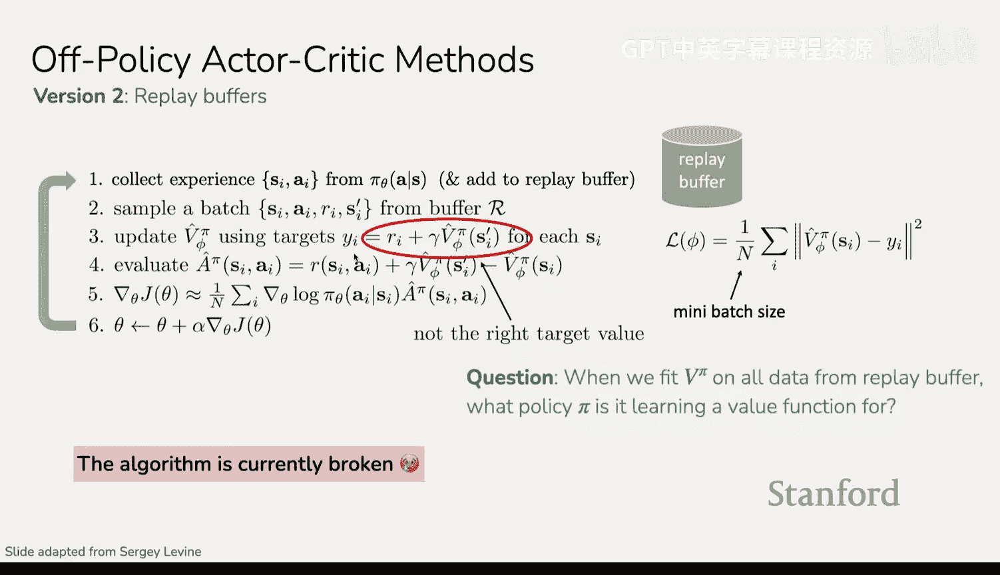

注意，这里用于计算目标 \(y\) 的动作 \(a'\) 来自当前策略，而不是缓冲区中的旧动作，这保证了我们学习的是当前策略的Q函数。

### 策略更新

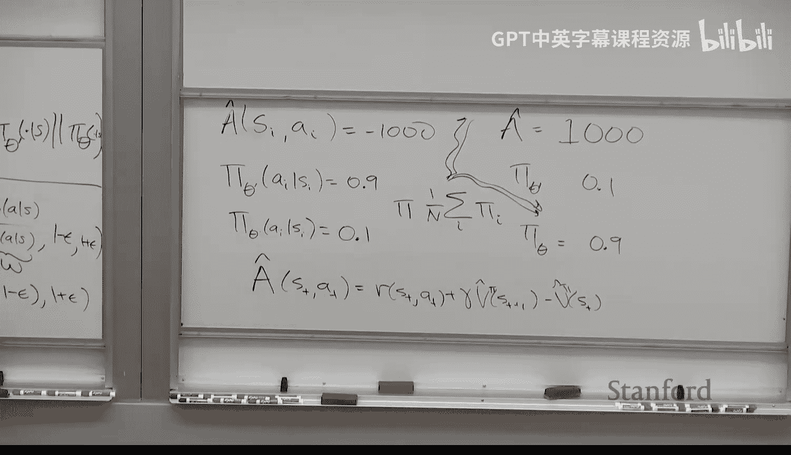

有了Q函数后，策略更新的目标是最大化期望Q值：

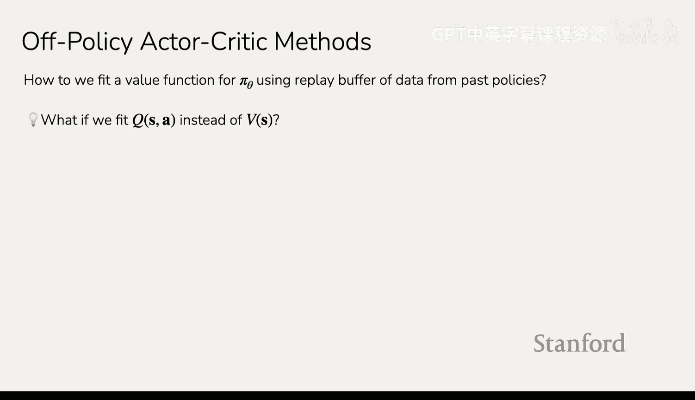

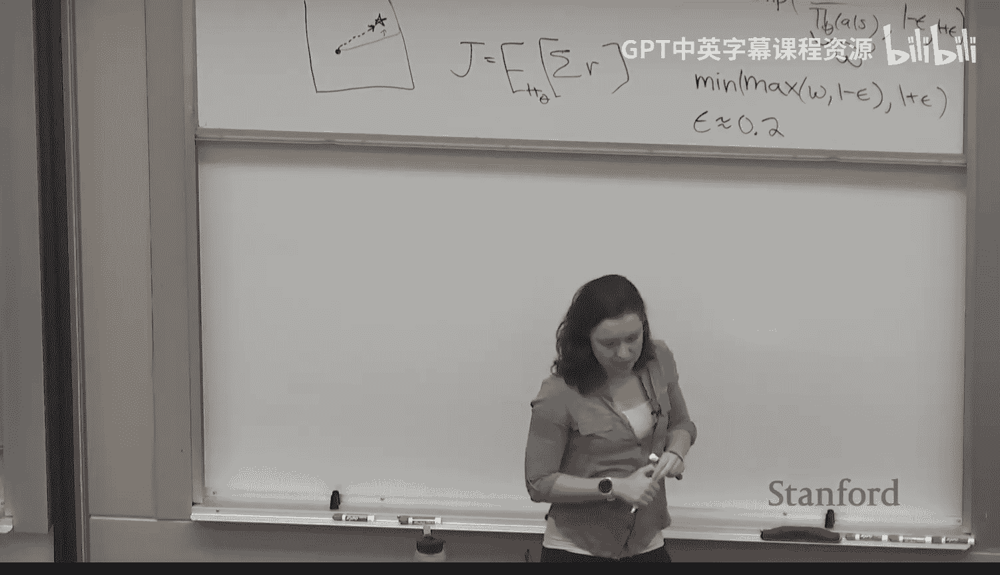

**公式：**
\[
J(\theta) = \mathbb{E}_{s \sim \mathcal{D}, a \sim \pi_{\theta}(\cdot|s)} [Q_{\phi}(s, a)]
\]

其梯度近似为：
**公式：**
\[
\nabla_{\theta} J(\theta) \approx \mathbb{E}_{s \sim \mathcal{D}} \left[ \nabla_{\theta} \log \pi_{\theta}(a|s) Q_{\phi}(s, a) \bigg|_{a \sim \pi_{\theta}(\cdot|s)} \right]
\]

同样，状态 \(s\) 来自缓冲区，但动作 \(a\) 是从当前策略中采样的。

### SAC算法流程

SAC算法（简化版）循环执行以下步骤：
1.  与环境交互，将经验 \((s, a, r, s')\) 存入回放缓冲区 \(\mathcal{D}\)。
2.  从 \(\mathcal{D}\) 中随机采样一个小批量数据。
3.  根据上述方法更新Q函数网络。
4.  根据上述策略梯度更新策略网络。
5.  （可选）更新价值函数网络作为基线（SAC实际使用熵正则化版本，此处略过）。

SAC通过完全离策略的学习和回放缓冲区，实现了极高的数据效率，常用于对样本效率要求高的场景，如机器人学习。

---

## 算法对比与应用场景

本节课我们一起学习了两种重要的离策略演员-评论家算法。最后，我们来对比一下PPO和SAC，并了解它们的典型应用。

### PPO 与 SAC 对比

*   **PPO**：通过裁剪等技巧实现“轻度”离策略。稳定性高，超参数相对鲁棒，是许多应用的首选，尤其是在模拟环境中可以大量生成数据时。它广泛用于游戏、机器人仿真到大型语言模型的微调。
*   **SAC**：基于Q函数学习和回放缓冲区的“彻底”离策略算法。数据效率极高，适合在真实机器人等数据收集成本高昂的场景中使用。但其超参数调优可能更复杂，稳定性挑战稍大。

### 应用实例

*   **SAC**：在真实机器人上，仅用约2小时的真实交互就能学会行走。在复杂操作任务上，其性能通常优于纯模仿学习。
*   **PPO**：在模拟器中训练解决魔方任务的策略，然后迁移到实体机器人上完成操作。它也常作为大语言模型强化学习微调的基础算法。

### 总结

在本节课中，我们一起学习了：
1.  如何通过重要性采样将同策略演员-评论家方法扩展到离策略设置。
2.  **近端策略优化** 如何通过**裁剪重要性权重**和**使用广义优势估计**来解决离策略学习的不稳定性，实现稳定高效的学习。
3.  **软演员-评论家** 算法如何通过**拟合Q函数**和**使用回放缓冲区**来实现更彻底的数据复用，极大提升样本效率。
4.  两种算法的核心思想、流程以及各自适用的场景。

理解这些算法背后的原理，将帮助你为不同的强化学习任务选择合适的工具。