#  006：Q-Learning 🎯

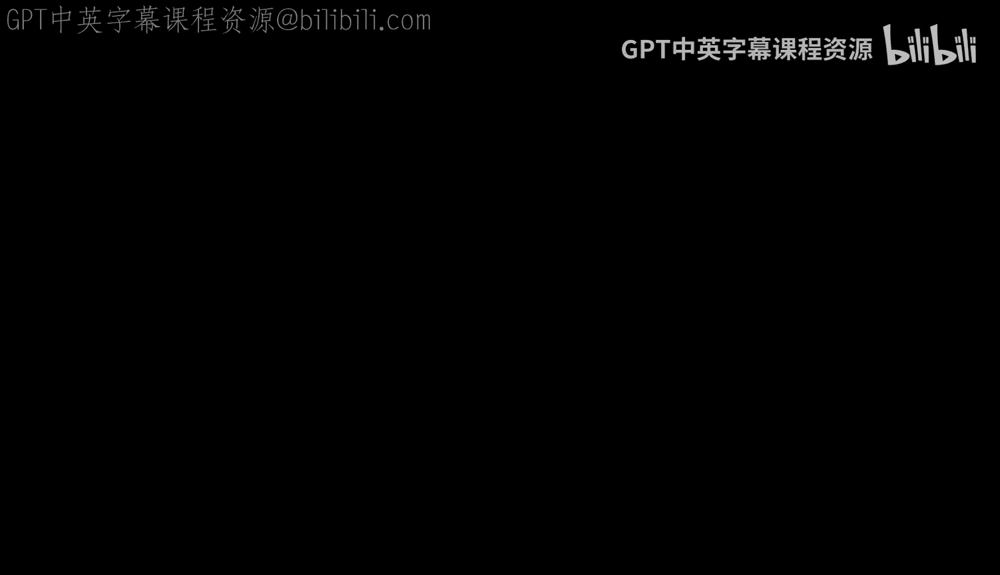

## 概述
在本节课中，我们将要学习基于价值的强化学习方法，特别是Q-Learning算法。我们将探讨Q函数如何与策略相关联，如何在不显式学习策略的情况下进行强化学习，以及如何在实际应用中稳定Q-Learning的训练过程。

---

## 价值函数与Q函数回顾
在之前的几节课中，我们详细讨论了价值函数和Q函数。作为回顾，价值函数和Q函数代表了某些特征的期望回报。具体来说，价值函数表示从某个状态开始，遵循特定策略所能获得的期望总回报。而Q函数则更进一步，表示从某个状态采取某个特定动作开始，然后遵循策略所能获得的期望总回报。

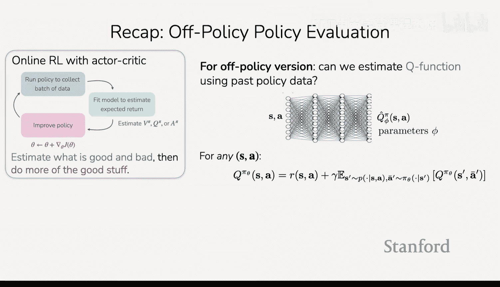

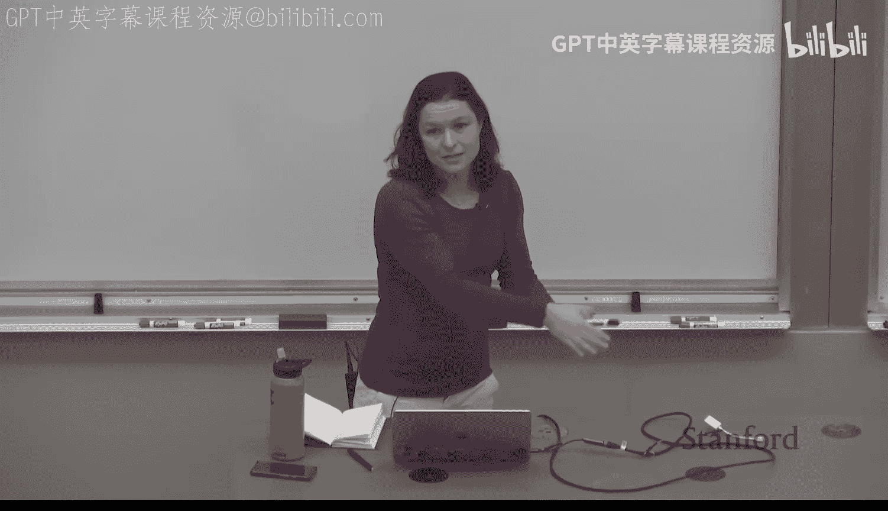

我们可以用公式来描述它们：
*   **价值函数 V^π(s)**：`V^π(s) = E[Σ γ^t * r_t | s_0 = s, π]`
*   **Q函数 Q^π(s, a)**：`Q^π(s, a) = E[Σ γ^t * r_t | s_0 = s, a_0 = a, π]`

我们已经讨论过几种方法。第一种是策略梯度方法，我们交替收集数据和改进策略。我们可以将其视为尝试评估策略，并增加那些在未来有更高回报的动作的似然，同时减少低于平均水平的动作的似然。

接着，我们开始讨论演员-评论家方法。在这个框架中，我们引入了一个额外的循环步骤：首先估计当前策略的期望未来回报（即Q函数），然后利用这个估计来改进策略。因此，策略梯度的形式被修正为：我们仍然采样，但增加我们认为好的动作的似然，减少我们认为不好的动作的似然。

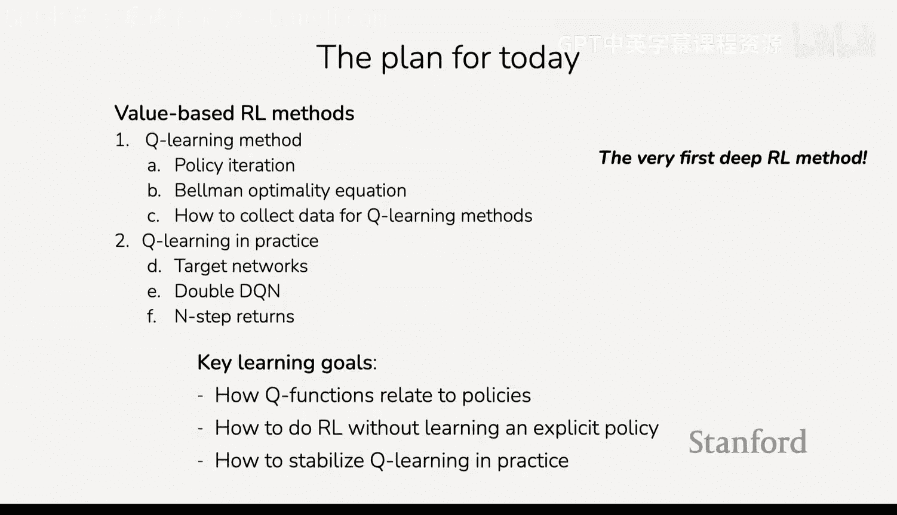

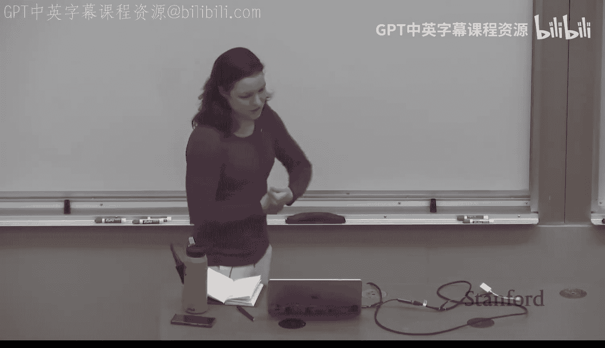

上一节我们重点讨论了如何以离策略的方式实现演员-评论家算法。这意味着我们不仅使用当前迭代的数据，还能利用所有过去迭代的历史数据。为了实现这一点，我们需要能够从过去的策略数据中估计Q函数。我们可以使用神经网络，输入状态和动作，输出Q值。我们推导出了递归定义Q函数的方程，也可以将未来回报的总和视为第一步的即时奖励加上从下一个状态开始的Q函数值。

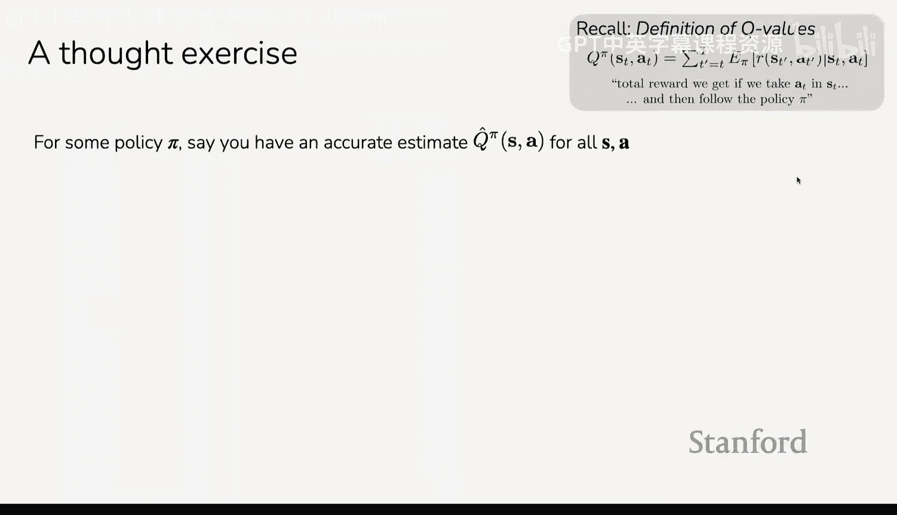

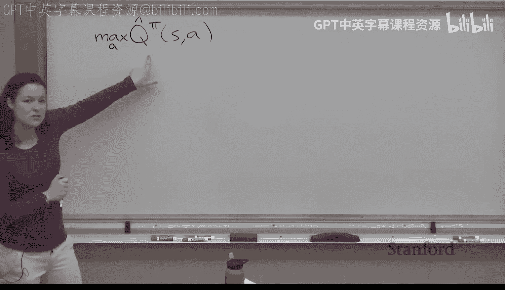

我们发现这个方程对于任何策略下的任何状态-动作对都成立。这意味着我们可以使用之前数据缓冲区中的（状态，动作，下一个状态）元组来学习Q函数。具体做法是：从历史数据缓冲区中采样一个（状态，动作，下一个状态）元组，然后从当前策略（而非过去的策略）中采样下一个动作。接着，我们尝试对这些目标进行监督学习，其中目标值使用了我们对当前策略Q函数的估计。我们将状态、动作、下一个状态和采样的下一个动作作为输入。

一旦用均方误差等损失函数制定了这个目标，就可以使用监督学习技术来拟合Q函数。我们还讨论过，为了使这些估计准确，你的数据集需要有足够的覆盖范围，以包含新策略可能采取的动作。

---

## 基于价值的强化学习方法
今天，我们将介绍基于价值的强化学习方法。具体来说，我们将讨论我认为可以说是最早的强化学习方法之一——基于Q-Learning算法。我们将探讨Q-Learning，以及如何在实践中实现它、如何使其稳定。今天的目标是思考Q函数如何与策略关联，如何在不学习显式策略的情况下进行强化学习，以及在使用函数近似器时如何稳定Q-Learning。

---

## 思想实验：从Q函数推导策略
让我们从一个思想实验开始。假设你有一个策略，并且对这个策略的Q函数有一个相当准确的估计。提醒一下，Q函数 `Q^π(s, a)` 定义为从状态 `s` 采取动作 `a` 开始，然后遵循策略 `π` 所能获得的未来回报的期望。

我们今天要思考的一个核心问题是：如果你有一个策略的Q函数估计，你可以尝试不遵循已有的策略，而是利用Q函数来构建一个新策略。具体来说，在给定状态下，你可以从多个候选动作中选择Q值最高的那个动作，而不是遵循原策略。

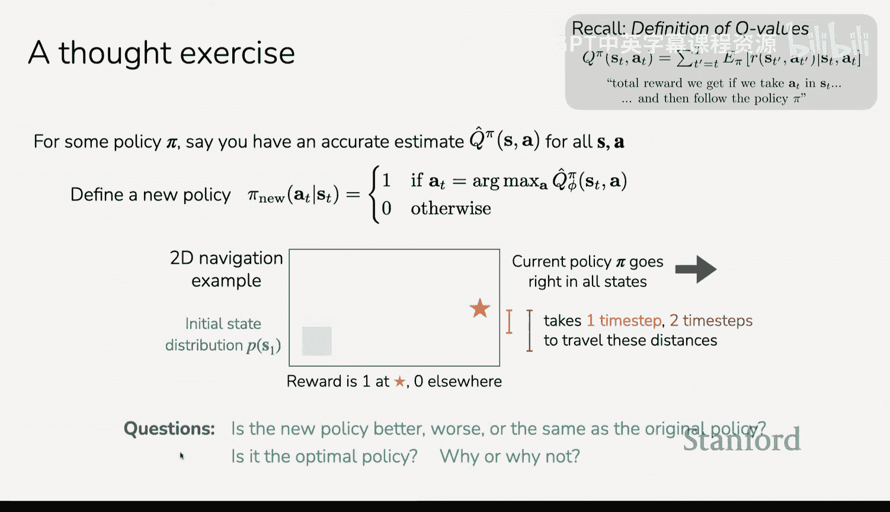

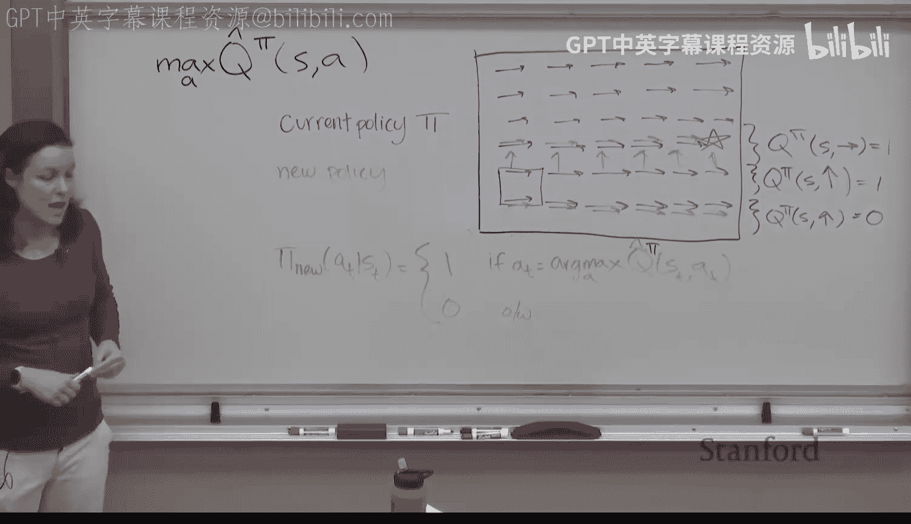

因此，我们可以定义一个恰好执行此操作的策略：该策略以概率1选择最大化Q值的动作，否则概率为0。这只是一个确定性的策略，总是遵循Q值告诉你的最佳动作。

我们在一个例子中看看这个思路。假设我们有一个3D导航问题，从蓝色框中的某个位置开始，目标是到达星星处。我们可以在2D平面内移动，到达星星处奖励为1，其他情况奖励为0。假设我们当前的策略总是向右移动。

作为一个额外的细节点，如果你向上移动，移动这段距离需要一个时间步，移动这段距离需要大约两个时间步。

我的问题是：如果你根据当前策略（总是向右）的准确Q函数估计，定义了上述新策略，那么这个新策略比当前策略更好、更差、相同，还是最优策略？为什么？

---

## 分析与讨论
让我们总结一下，然后讨论它是否是最优策略。总结一下，旧策略是向右走，这不是最优的。如果你从这里开始，实际上无法到达星星。如果你思考一下 `Q^π`（旧策略的Q函数），对于这一行的所有状态，向右动作的Q值可能是1。对于这一行，向右动作的Q值将是0。但是，如果你看这一行中向上动作的Q值是多少？如果你先向上移动，然后遵循旧策略（向右），你将获得奖励1。最后，对于这一行，如果我们向上移动，Q值是多少？可能是0。

这意味着，我们得到的新策略将执行以下操作：在这里（最上面一行）向右走。对于这一行（中间行），它将向上走，因为它会选择具有最大Q值的动作。但对于这一行（最下面一行），所有Q值都是0，因为下一行的Q值也是0，所以如果默认遵循之前的行为，它会继续向右走。

现在，有人想讨论第二个问题吗？比如，这是最优策略吗？这个新策略比旧策略好，但它不是最优策略，因为在这些状态（最下面一行）中，最优策略应该是也向上走才能到达星星。所以，如果我们从这个初始状态开始，定义新策略后，我们实际上会继续向右走，不会向上走，因此无法从所有状态获得奖励1。

问题是，如果我们迭代这个过程并执行多次，这会变成最优策略吗？是的，我们稍后会讨论迭代执行。我们可以在这里获得奖励1，这很好，但如果我们从这个初始状态开始，定义新策略后，我们实际上会继续向右走，不会向上走，因此无法从所有状态获得奖励1。

问题是，如果你离星星更近，Q值是否会更高？我实际上没有明确定义这一点，但如果你使用的折扣因子小于1，那么离得越近Q值会越高。我这里展示的所有内容都使用了折扣因子为1以简化说明。但如果你使用例如0.9的折扣因子，那么这里的Q值将是1，这里将是0.9，这里0.8，这里0.7，依此类推。对于这一整行，它仍然会是0，因为你仍然无法到达星星。

另一个需要注意的点是，如果你的奖励函数不同，例如不是星星处为1其他地方为0，而是例如到星星的负距离，那么你实际上会发现，即使在单步改进中，从这个策略出发，你也会得到一个严格优于旧策略的新策略。问题是，要获得最优策略，我需要迭代地执行此操作，并每次都基于最新策略重新计算Q函数。是的，这是正确的。

在这个例子中，新策略优于当前策略。这实际上总是成立的吗？假设 `Q^π` 是准确的，新策略总是至少和旧策略一样好，永远不会比旧策略差。如果 `π` 已经是最优策略，那么它们将相同。

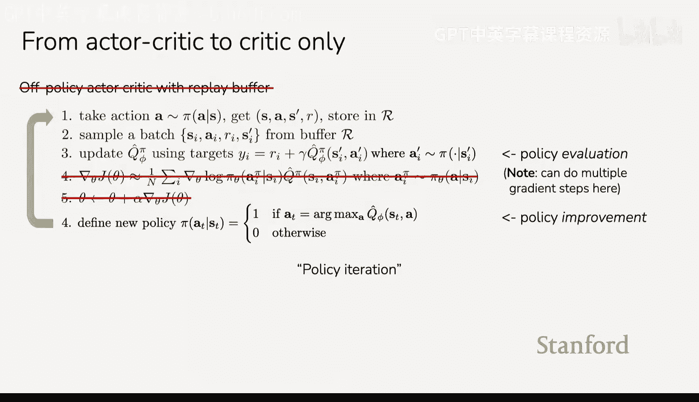

---

## 策略迭代与Q-Learning
这让我们开始思考：我们是否可以开始省略显式的策略？给定Q函数，我们将在状态 `s` 采取最大化未来期望回报的动作。这至少和策略会采取的任何动作一样好。因此，我们实际上可以忘记使用策略网络，而直接这样做，而不是显式地学习一个策略神经网络。

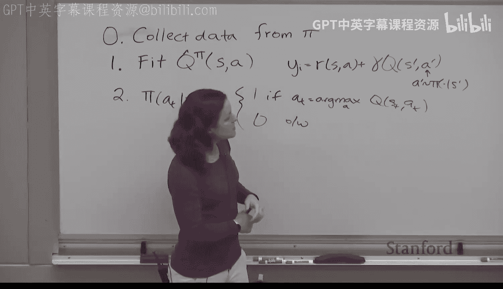

作为一个迭代算法，这看起来像是：我们运行策略收集数据，然后拟合一个模型来根据最新批次的数据估计 `Q^π`（你也可以像上一讲讨论的那样以离策略方式进行）。接着，为了改进策略，你可以直接将策略定义为最大化Q函数的策略。然后，一旦你找到这个新策略，你可以收集一些新数据，再次估计 `Q^π`，但这次是针对你的新策略 `π'`，而不是旧策略 `π`。这里，`π'` 被定义为 `argmax_a Q^π(s, a)`。我们并没有学习策略 `π'` 的神经网络，没有将其显式表示为模型。这里唯一的神经网络或模型是用于近似Q函数的。

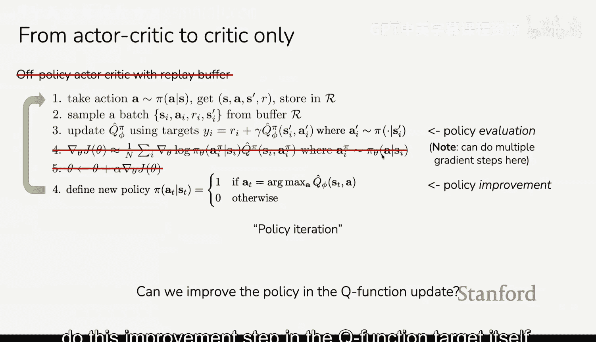

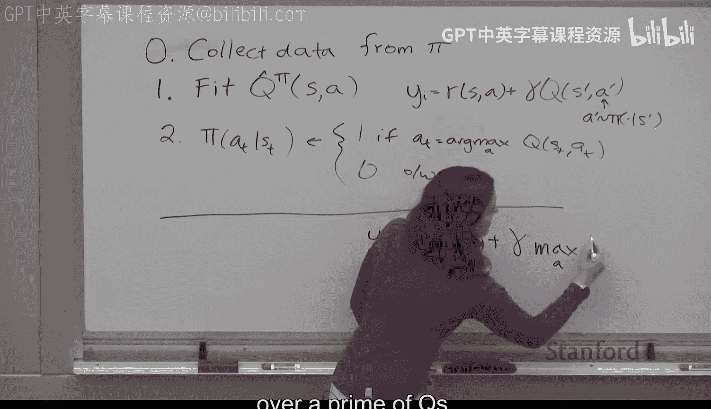

问题是如何将其推广到连续动作或更复杂的动作空间。当你有离散的动作集合（如上、右）时，这通常最容易实现。如果你有连续动作，你仍然可以使用这个算法，尽管你需要弄清楚如何执行这个最大化操作。原则上，你可以使用梯度下降之类的方法，但效果可能不佳。如果动作空间维度不高，更好的方法可能是简单地采样一堆不同的动作，然后选择Q值最高的那个。你也可以使用其他基于采样的优化算法，或者迭代地采样并优化。对于像文本这样的离散动作空间，原则上你可以进行某种离散搜索，目标是最大化Q值。

当奖励非常稀疏时，这如何工作？我们看到了一个奖励稀疏的例子，它仍然可以工作。需要注意的是，当奖励稀疏时，你可能需要多次执行这个“拟合Q函数-改进策略”的循环，因为每次你这样做，实际上都是在将奖励信息从有奖励的状态“备份”到其他状态。你需要进行足够多次的备份，覆盖问题的整个时间范围。

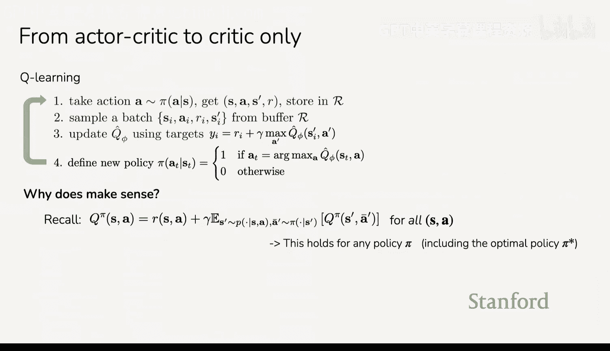

---

## Q-Learning算法
我们可以将其写成一个算法。我们可以采用离策略演员-评论家算法中拟合Q函数的部分，然后不使用策略梯度更新，而是简单地定义一个根据Q函数采取动作的新策略。

你可以将其视为两个关键步骤，通常称为**策略评估**（评估策略的价值）和**策略改进**。这种两步迭代过程通常被称为**策略迭代**。它是通向Q-Learning等算法的一种方式。

在板上写出来，这个过程如下：
1.  **收集数据**：通常从某个探索性策略收集数据，也可能包含来自其他策略的数据。
2.  **拟合Q函数**：尝试拟合对应当前策略的Q函数估计。我们可以使用之前定义的目标：`y = r + γ * Q^π(s', a')`，其中 `(s, a, r, s')` 来自缓冲区，`a'` 是从当前策略 `π` 中采样的。
3.  **改进策略**：定义新策略 `π'(s) = argmax_a Q^π(s, a)`，这是一个确定性策略。

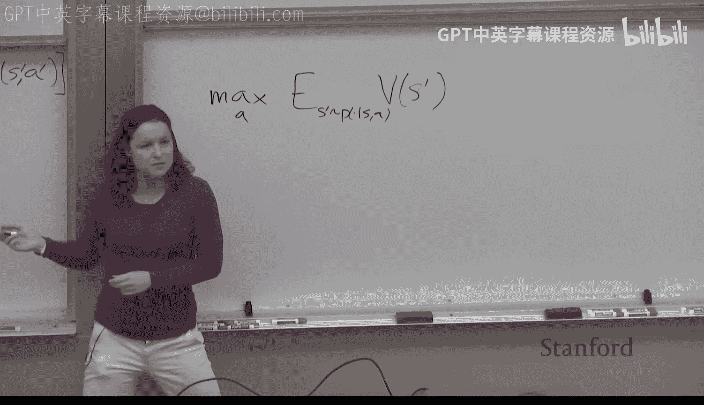

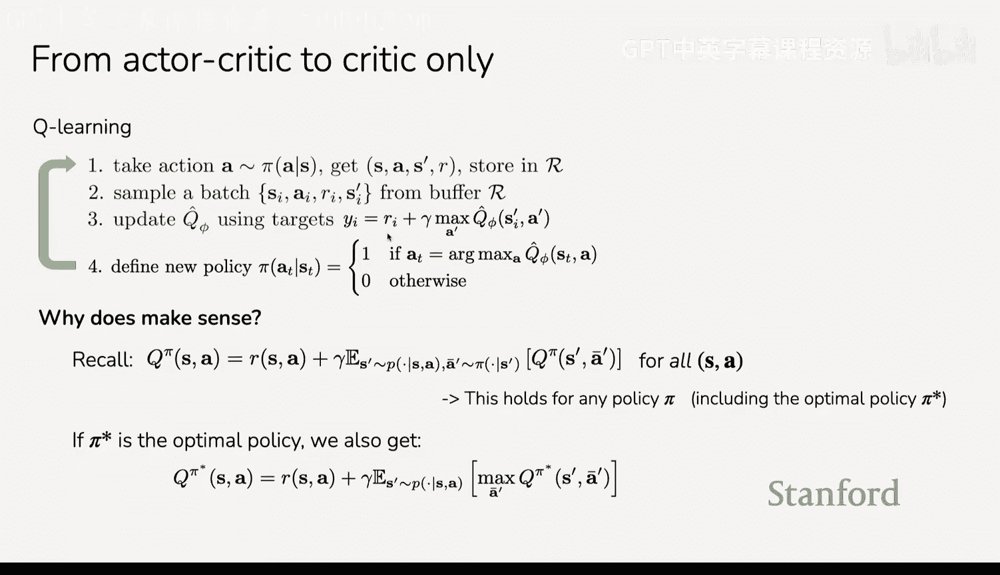

问题是，当我们拟合这些目标时，为什么我们从 `π` 中采样 `a'`，而不是对下一个动作取最大值或期望？这里有几件事：首先，你可以采样多个 `a'` 并取平均，这可以给你一个更好的目标值估计。其次，你实际上可以在Q函数目标本身中执行改进步骤。也就是说，你可以考虑将你的Q函数目标定义为：`y = r + γ * max_{a'} Q^π(s', a')`。

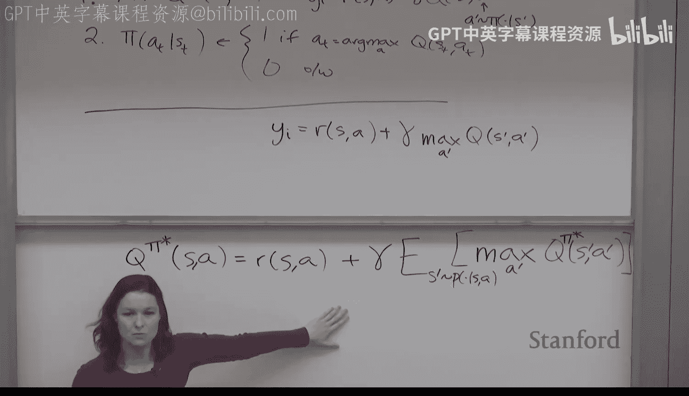

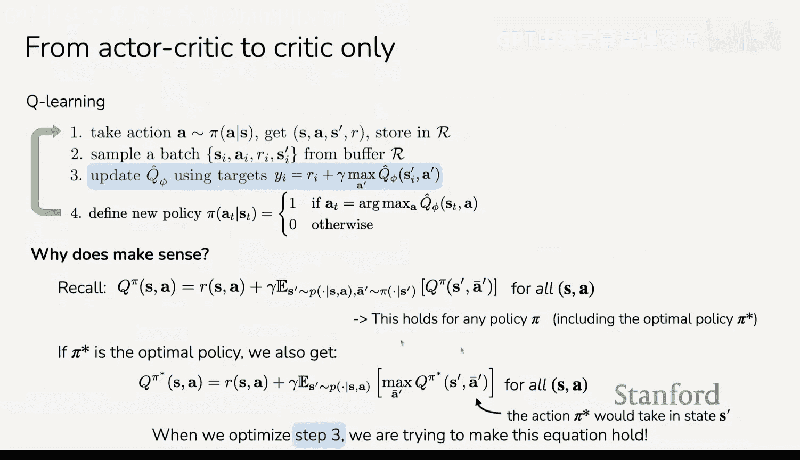

这看起来像这样：`y = r + γ * max_{a'} Q^π(s', a')`。这实际上就是Q-Learning。一种理解方式是，这些目标实际上是你即将定义的新策略的Q值。你已经在Q函数更新中加入了改进步骤，实际上你正在学习与你将要定义的新策略相关联的Q值。

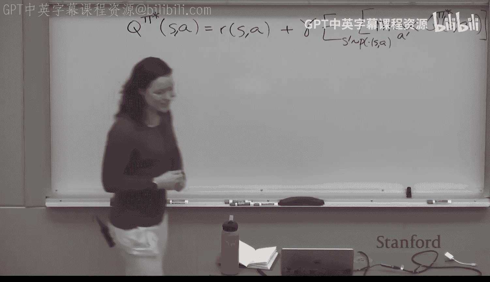

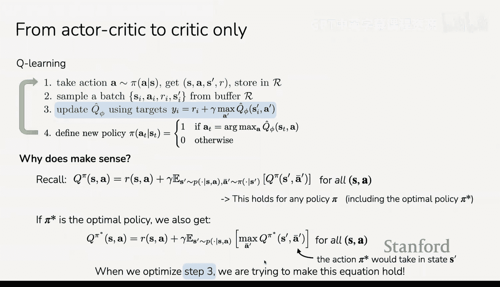

还有另一种方式来看待这个问题。我们之前定义了这个对所有策略都成立的方程：`Q^π(s, a) = r + γ * E_{a'~π}[Q^π(s', a')]`。实际上，对于最优策略，也可以写出一个特定的方程。我们知道最优策略总是采取最大化未来回报的动作。最优策略选择的动作总是最大化Q值的那个。因此，我们可以写出一个对最优策略成立的方程，它与上面的方程类似，只是对下一个动作的期望替换为了最大值。

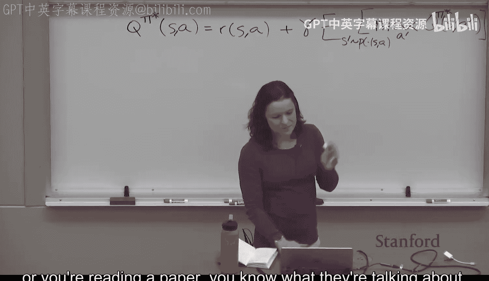

这个方程是：`Q*(s, a) = r + γ * E_{s'}[max_{a'} Q*(s', a')]`。我们定义最优Q函数为当前奖励加上未来折扣奖励的和，对于这个和，我们对下一个状态 `s'` 有一个期望，然后因为我们知道最优策略将采取最大化Q值的动作，我们可以将其写为 `max_{a'} Q*(s', a')`。

问题是我们为什么只讨论Q而不讨论V？你也可以用非常相似的方式为V写下这些方程。Q函数的好处在于，如果我们知道Q，我们可以通过对动作取 `argmax` 来得到一个比之前策略更好的策略。而如果我们只知道价值函数 `V(s)`，我们不知道哪个动作会导致更高的价值。原则上，有了价值函数，你应该尝试某种前瞻：如果你对动态模型有了解，你可以尝试预测 `s'` 并选择能最大化期望价值的动作。但这看起来像是：`argmax_a E_{s'}[r + γ * V(s')]`。然而，我们不知道这些动态模型，也不一定能预测我们的动作会导致的下一个状态。因此，一般来说，从价值函数中推导策略并改进策略要困难得多。

---

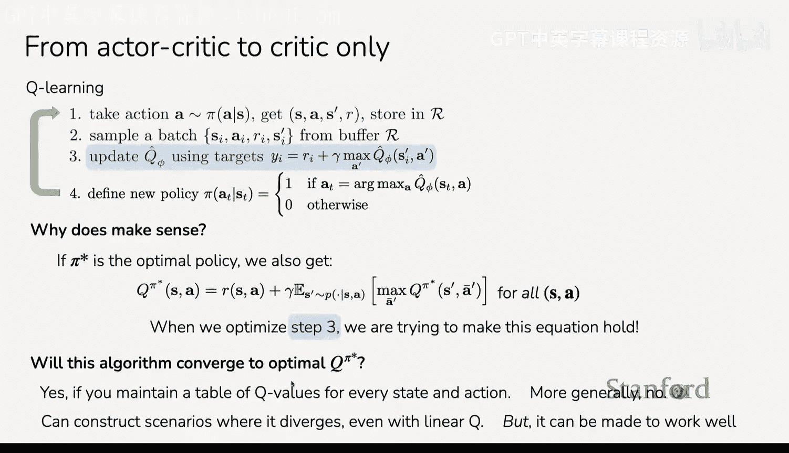

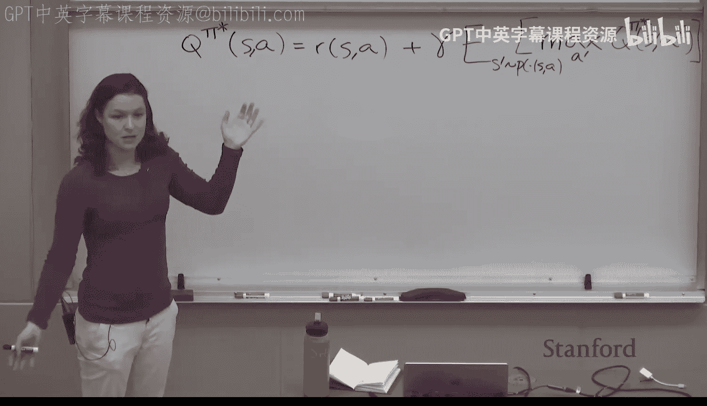

## 贝尔曼方程
回到这个方程，它对于最优策略成立。我在这里写 `π*` 表示最优策略。如果你看我们的更新目标 `y = r + γ * max_{a'} Q(s', a')`，我们试图让一个Q函数预测这个值。本质上，有了这个方程，你可以将这个更新视为试图使这个方程成立。我们试图让方程的左边等于右边。当这个方程成立时，意味着我们的策略是最优的。

因此，思考Q-Learning的一种方式是：当我们执行优化步骤时，我们试图找到一个满足此方程的Q函数，而此方程仅对最优策略成立。

问题：如果我们对Q有非常好的估计，这会收敛吗？我们稍后会讨论。首先，让我们快速讨论一些术语。不幸的是，这里有很多术语。了解其中一些是有用的，这样当有人与你讨论强化学习或你读论文时，你知道他们在说什么。

第一个方程 `Q^π(s, a) = r + γ * E_{a'~π}[Q^π(s', a')]` 通常被称为**贝尔曼方程**。它是一个非常有用的对象，是我们尝试对策略进行策略评估时使用的。

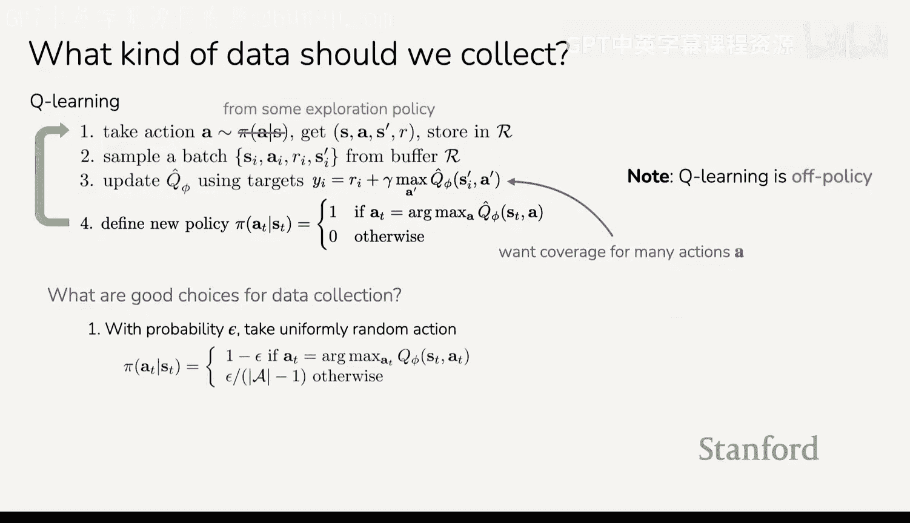

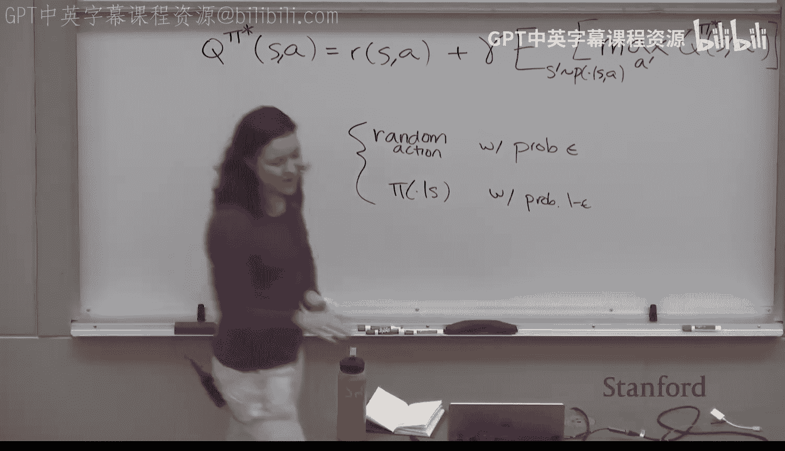

第二个方程 `Q*(s, a) = r + γ * E_{s'}[max_{a'} Q*(s', a')]` 被称为**贝尔曼最优性方程**，因为它是针对最优策略的。有时，人们非正式地也可能称第二个为贝尔曼方程，但严格来说，第一个是贝尔曼方程，第二个是贝尔曼最优性方程。你也可以为价值函数V推导类似的方程，它们也被称为贝尔曼方程和贝尔曼最优性方程。

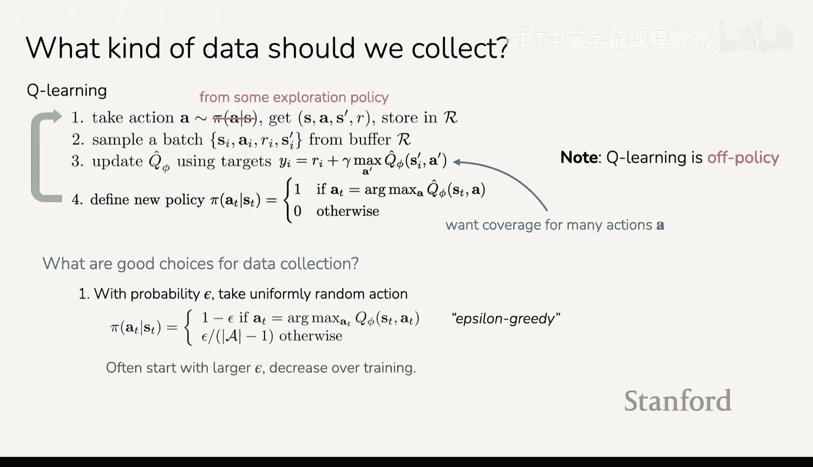

---

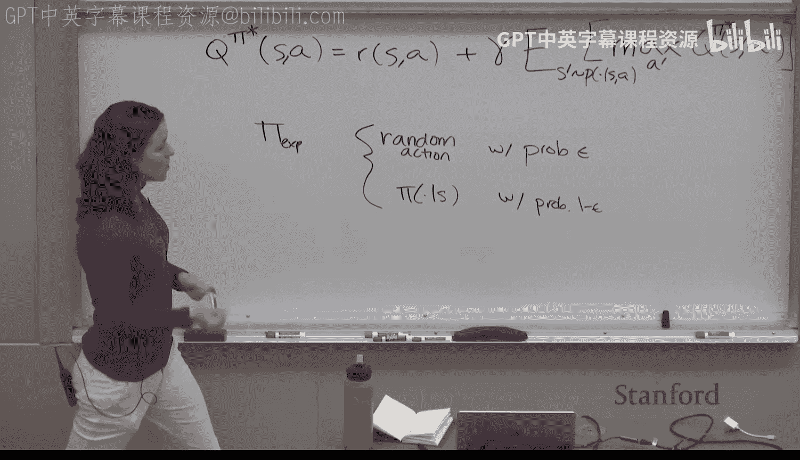

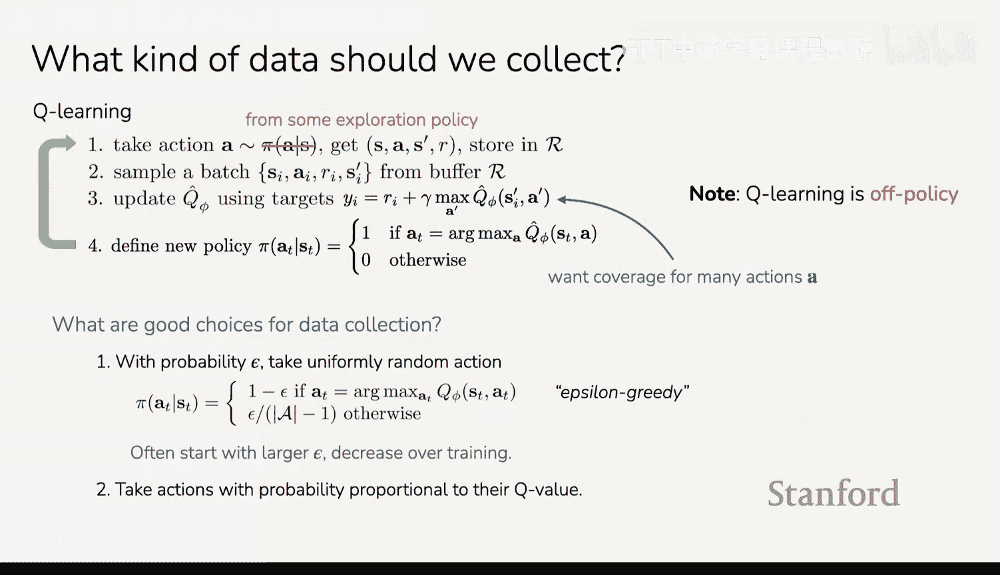

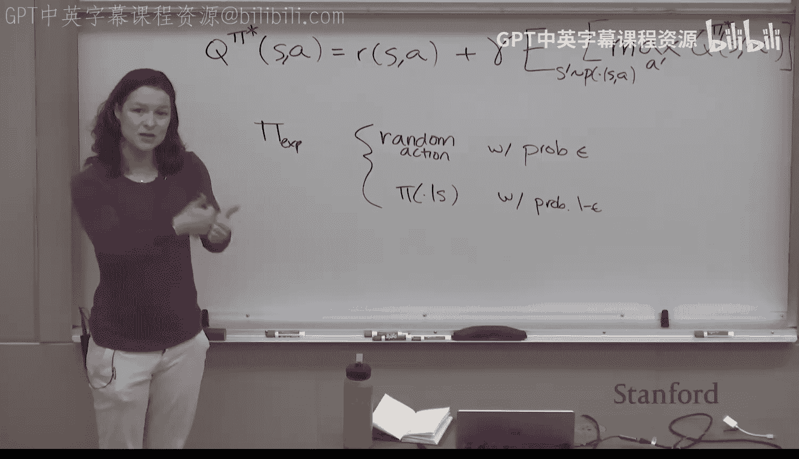

## 收敛性与探索
回到问题：如果我们迭代地这样做，会收敛到最优策略吗？这里有好消息也有坏消息。好消息是，如果你处于一个非常简单的设置中，可以实际为每个状态和动作在表格中存储所有Q值（例如非常小的离散状态和动作空间），并且有充分的探索，那么这个算法会收敛。坏消息是，基本上在任何其他情况下，都不能保证收敛，你甚至可以构造出它发散的场景，即使使用线性函数近似也是如此。这有点令人沮丧。不过，反过来看，即使在可能发散的场景中，它也可以被调整得很好用，我们将看到一些它工作得很好的例子。

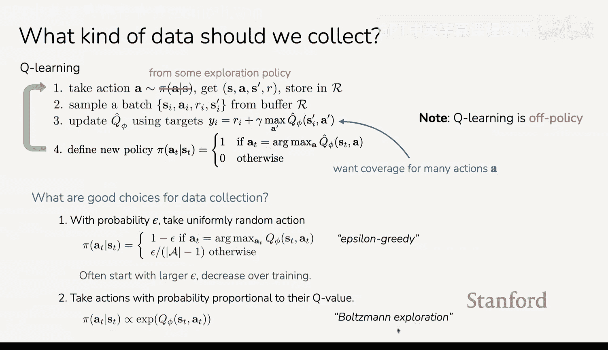

问题：这个陈述意味着什么？具体来说，这不一定与你的Q值的准确性有关，因为你实际上是通过这个过程来拟合你的Q值的。这更多是关于你的状态和动作空间大小的陈述，如果它足够小，你可以维护这个表格，并且还有一个关于探索的条件——你实际上需要在数据集中对状态和动作有充分的覆盖——那么它就会收敛。

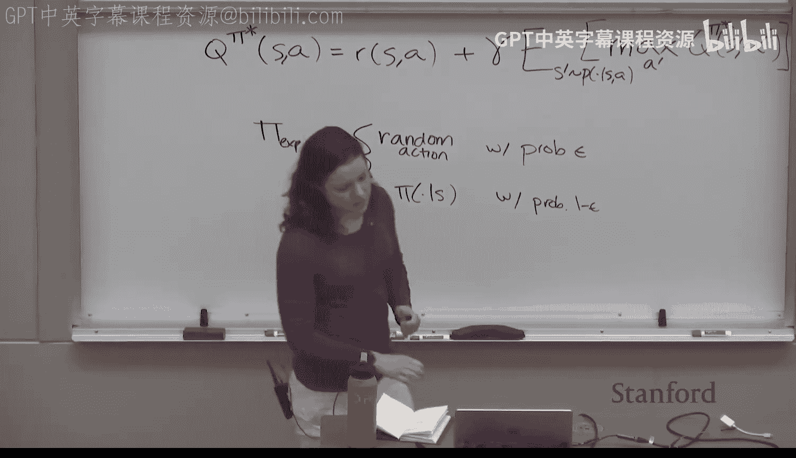

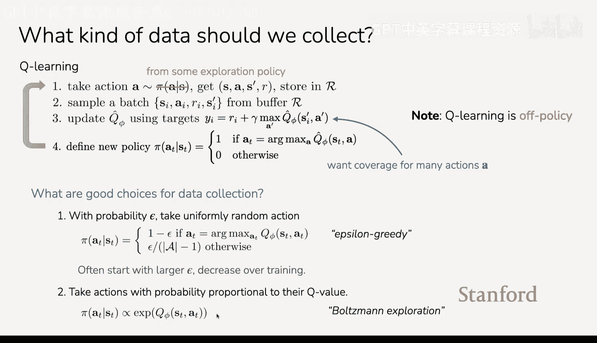

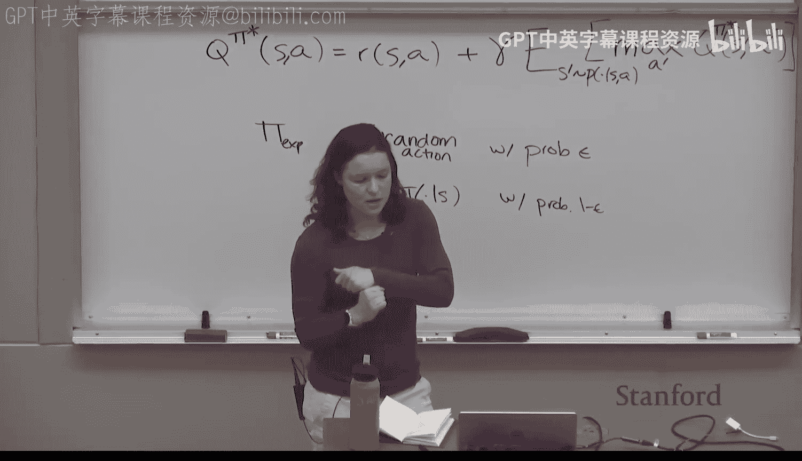

---

## 离策略与探索策略
关于Q-Learning的一个注意事项是它是离策略的。具体来说，这个方程 `Q*(s, a) = r + γ * E_{s'}[max_{a'} Q*(s', a')]` 对所有状态-动作对都成立，这意味着我们的动作不一定非要来自当前策略。实际上，让数据收集策略比当前策略更广泛可能很有意义，因为我们将对Q值进行最大化操作，会考虑许多不同的可能动作。如果我们考虑所有可能的动作，我们会希望我们的Q值对于所有这些动作都是准确的。如果有一个我们在优化中会考虑但从未收集过数据的动作，由于没有数据，它的Q值可能会被错误地估计得很高，那么当你拟合目标时就会得到一个不准确的值。

因此，与其从当前策略收集数据，不如从某个探索策略收集数据，具体来说，是一个比我们的确定性策略收集更广泛动作集的策略。我们希望数据能覆盖很多不同的动作。这里有几个选择。

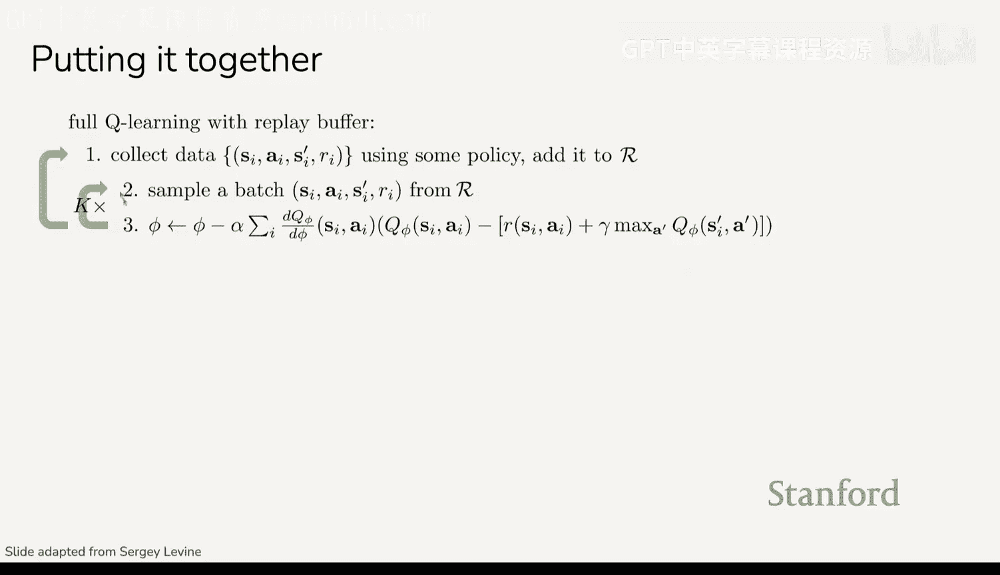

一种常见的选择是 **ε-贪婪策略**：大部分时间遵循当前策略，但以一个小概率 `ε` 采取完全随机的动作。这看起来像是一个以概率 `ε` 采取随机动作，以概率 `1-ε` 遵循当前策略的策略。这是一个不错的选择，因为当你采取随机动作时，它是均匀随机的，这意味着你将获得对你所考虑动作的很好覆盖。通常，在训练过程中，你可能会从一个较大的 `ε` 开始，以便在训练初期有更多探索，然后随着策略变得更好、Q函数估计更准确，你可以逐渐减小 `ε`，减少探索。

另一种也较为合理但稍微复杂一点的选择是，以与Q值成比例的概率采取动作。因此，如果某些动作具有较高的Q值，则更频繁地采取这些动作；如果某些动作概率较低，则较少采取这些动作。一种写法是：你可以对Q值取指数使其全为正，然后归一化以获得一个概率分布。这有时被称为 **玻尔兹曼探索**，以玻尔兹曼分布命名，其中你按指数权重进行采样。

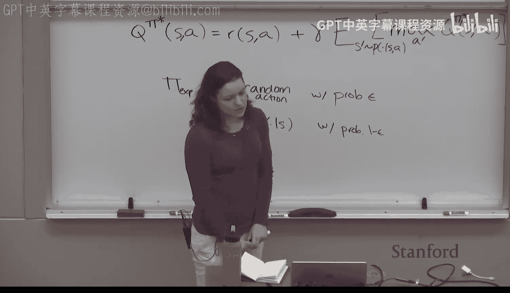

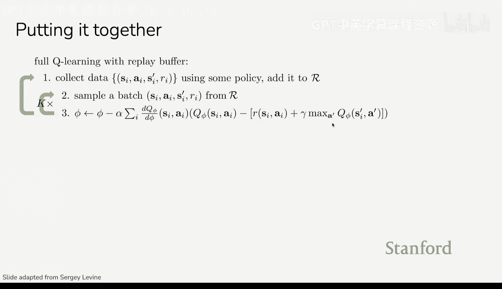

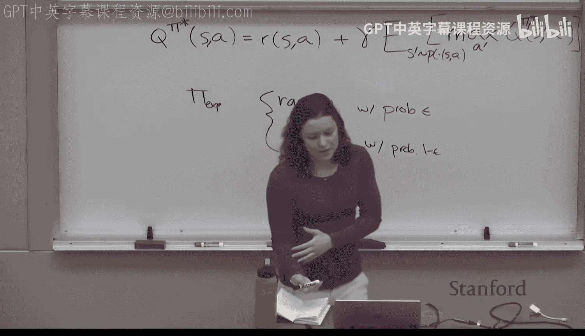

问题：对于连续动作，如何实现这些方法？第一种（ε-贪婪）在离散动作中更直接。对于连续动作，你仍然可以做类似的事情，但你需要定义在连续动作上的某种均匀分布，为此你需要一个范围。或者，原则上你也可以使用具有宽标准差的高斯分布进行采样。我认为在连续动作空间中，第二种选项（玻尔兹曼探索）在采样方面更常见一些。

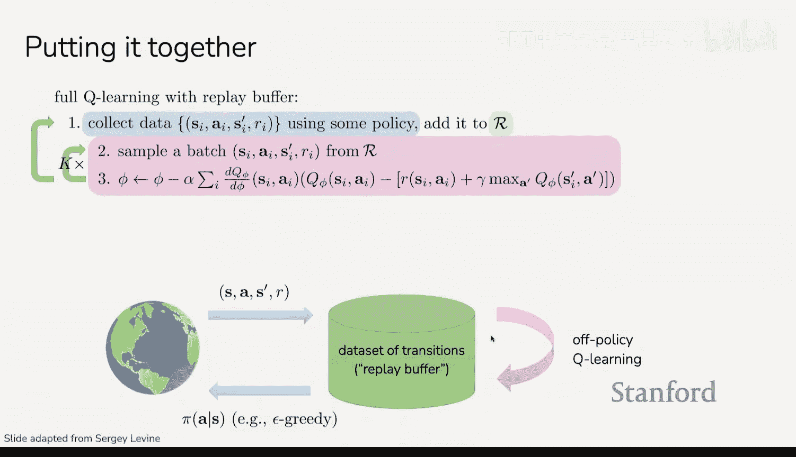

---

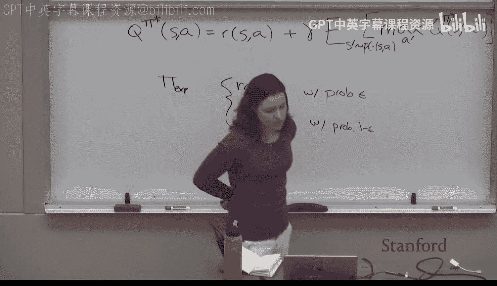

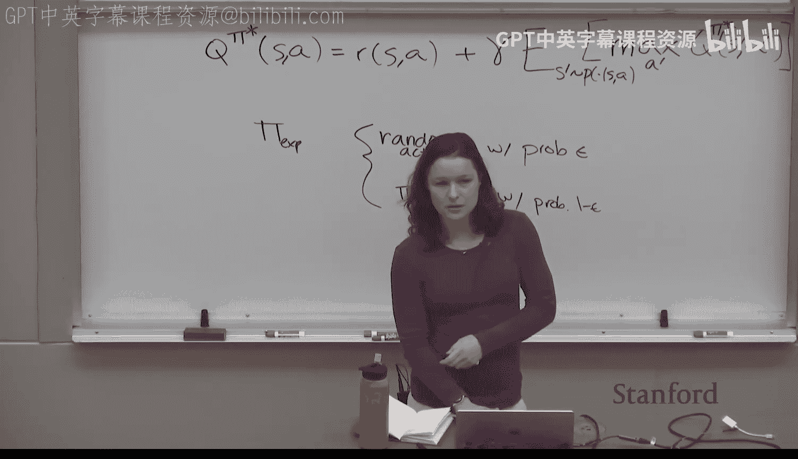

## 完整的Q-Learning算法
将各部分组合起来，一个完整的Q-Learning算法如下：
1.  使用某个策略（如ε-贪婪）收集数据。
2.  将该数据添加到经验回放缓冲区。
3.  从经验回放缓冲区中均匀采样一批数据（这有助于解相关，从缓冲区中采样IID数据）。
4.  通过取损失函数（如均方误差）的梯度来更新Q函数。梯度形式为：`∇φ (Qφ(s, a) - (r + γ * max_{a'} Qφ(s', a')))^2`。
5.  你可以重复多次梯度步骤。在实践中，`k=1` 很常见，但如果你对给定批次数据采取更多梯度步骤，效率会更高，数据利用率也更高。
6.  完成这些梯度步骤后，你可以收集更多数据并迭代此过程。

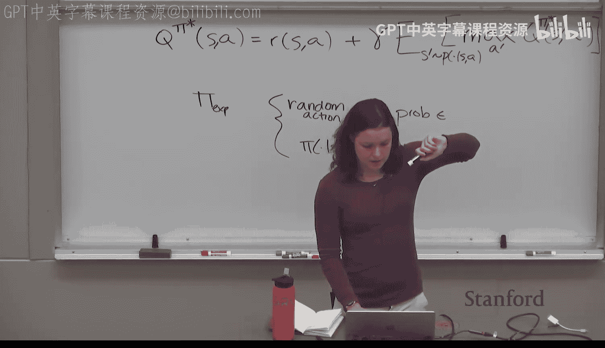

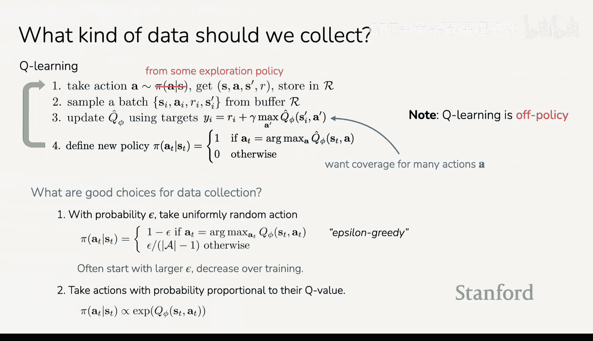

问题：如果你从任何策略收集数据，那不是比使用当前策略更不优化吗？使用不同策略的原因是为了学习更准确的Q函数，这实际上有助于你以后学习更优的策略。本质上，这里存在一个权衡：在开始时收集次优数据以帮助以后变得更好。可以这样想：如果你的强化学习代理试图帮你挑选餐厅，一开始如果你没有探索很多餐厅，不知道什么是好餐厅，你可能需要探索一些可能次优的餐厅，以获得对特定人来说什么是好餐厅的良好估计。然后，一旦你有了一个好的Q函数（即对好餐厅有了好的估计），你可能希望减少探索。

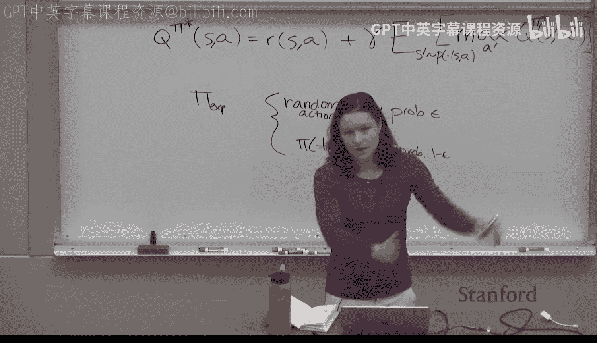

---

## 实践中的技巧：目标网络
在实践中，当我们使用Q-Learning时会发生什么？我们谈到Q-Learning可能发散，通常当你使用神经网络运行Q-Learning时，它可能不稳定。原因之一是你有一个移动的目标，即这个 `max` 操作。如果 `k=1`，优化过程可能非常不稳定。

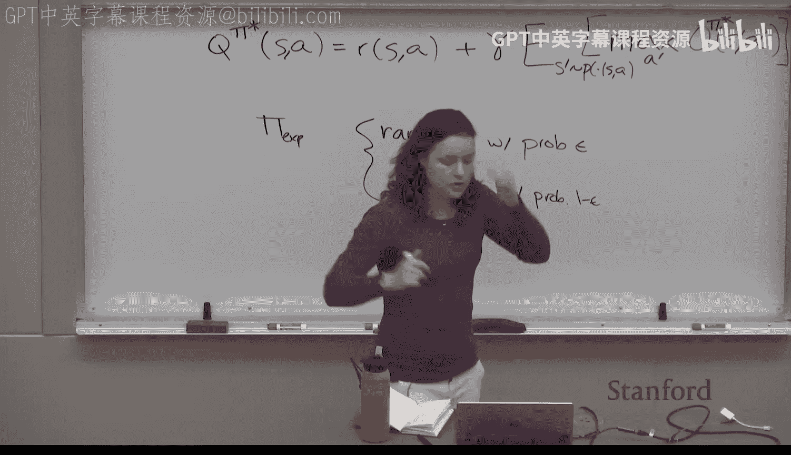

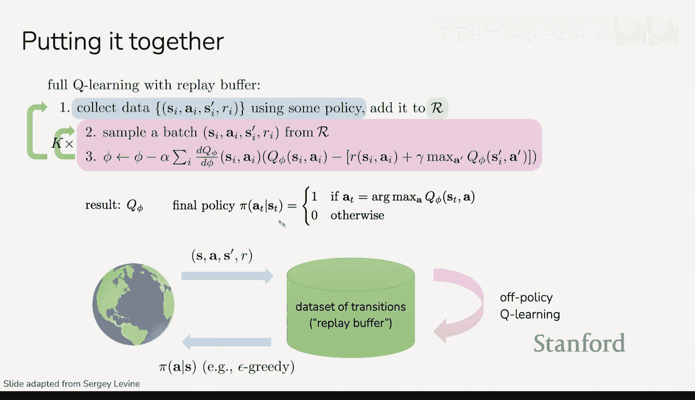

一个技巧是尝试减缓目标变化的频率。与其让目标在你每次改变参数时都变化，一个想法是冻结目标网络的参数，只定期更新它们，例如每1000个梯度步骤更新一次。具体做法是：我们保存一个单独的神经网络，它是我们Q函数参数的另一个副本，称为 `φ'`。当我们保存这个副本后，对于目标值 `r + γ * max_{a'} Qφ'(s', a')`，我们使用这些新参数 `φ'`。这些参数将被冻结，这意味着在这个内部循环中，标签不会频繁变化。因此，这个内部循环本质上是在用一些添加到缓冲区的数据进行监督学习，这通常要稳定得多。然后，只定期将目标网络参数更新为我们最新的Q函数参数。

当我们使用目标网络时，这被称为 **DQN算法**，于2013年提出，基本上可以说是第一个成功的深度强化学习方法。他们发现可以训练神经网络玩各种不同的Atari游戏，这是使用强化学习训练神经网络执行相当复杂任务的第一个例子。他们实际上直接从像素观测进行训练。在此之前，很多强化学习的例子都是在非常简单的设置或低维设置中。

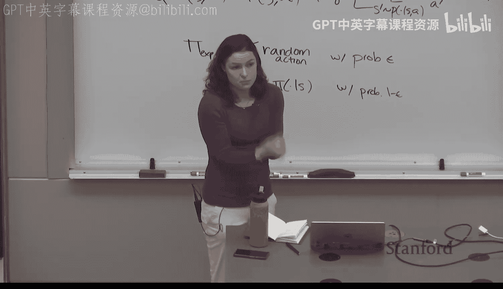

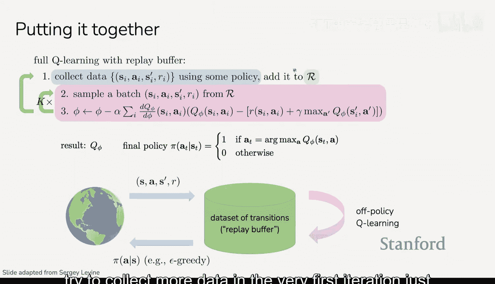

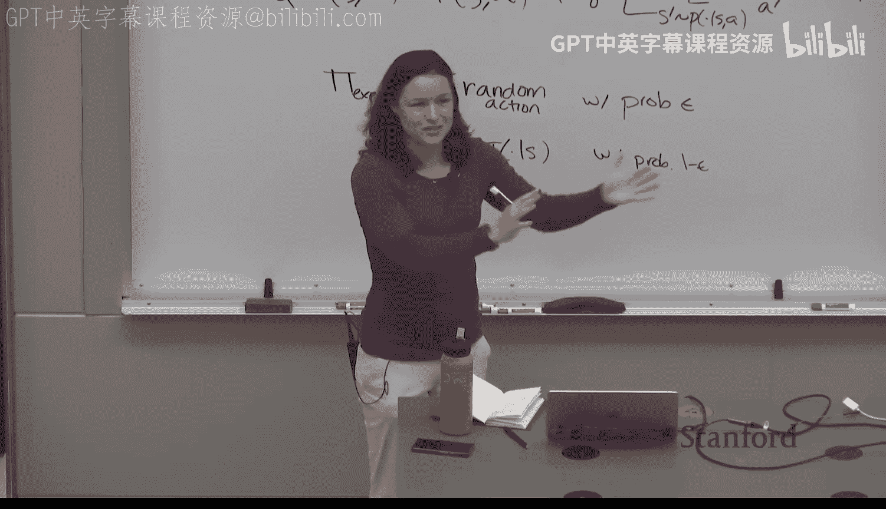

问题：如果你存储所有Q值，一个Q值表，那不一样吗？实际上不完全一样，因为你实际上会在环境中收集新数据，所以你不能只存储所有Q值，你必须存储参数，以便能够为新数据计算Q值。

---

## 实践中的技巧：双Q学习
这是你将在作业中实现的算法之一。好的，第一个技巧是使用目标网络，只定期更新。还有另外两个技巧可以让Q-Learning工作得更好。

第一个是观察反馈循环的准确性。如果你绘制训练过程中的奖励，奖励会上升，这很好。如果你也绘制训练过程中的Q值，它们也会上升，这实际上是你所期望的，因为Q值代表了你的平均奖励。一个需要注意的实用技巧是：当你在训练期间查看Q值的损失函数时，使用DQN训练时，损失值实际上经常会上升。这有时有点令人担忧，因为你习惯看到损失值下降。但原因是你在收集新数据，而新数据具有更高的Q值，因此损失函数的尺度会变化。在最初阶段，如果你到处都获得零奖励，可能很容易得到一个低损失。所以，如果你的损失函数在上升，不要惊慌，有时这意味着策略开始学习。

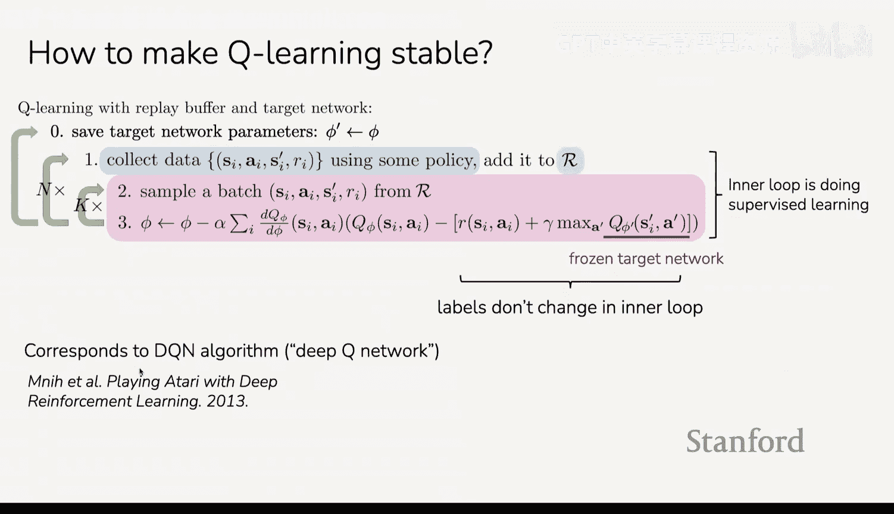

这很好。预测的Q特征看起来是合理的。你还可以查看训练过程中的价值。在第一种情况下，这里的值相当均匀，但一旦你处于一个真的需要向上的状态，向上动作的Q值就比向下或无操作高。同样在这里，向上非常重要，所以向上动作的Q值比向下或无操作高。在右边的情况下，这并不重要，因为球在对手那边，所以Q值更均匀。当你可视化这些Q值时，它们看起来相当合理。

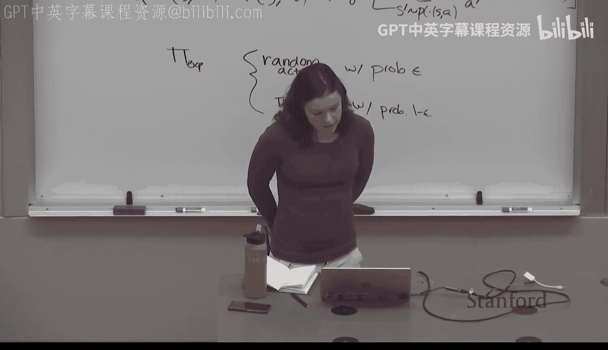

这很好。但然后你绘制了真实的回报。真实的回报在这里用红色水平线表示，而根据Q网络估计的价值显示为上方的线。你可以看到估计值总是远高于真实值，存在巨大的差距。看起来Q函数高估了我们的策略有多好。

然后有一个叫做 **双DQN** 的算法，能够获得更准确的Q函数，能够大大减少高估。让我们谈谈双DQN。一般来说，高估是因为我们的目标值是 `r + γ * max_{a'} Q(s', a')`。当我们取这个最大值时，我们选择了一个最大化其Q值的动作。另一种写法是：`r + γ * Q(s', argmax_{a'} Q(s', a'))`。因此，我们既使用了一个具有高Q值的动作，又使用同一个Q函数来评估该动作的Q值。这意味着如果我们的Q函数中存在噪声，那么很容易利用这个噪声来选择高估的动作。因此，最后一项就是高估的来源。它不完美，存在噪声，因为神经网络通常如此。由于用于选择动作和执行评估的是同一个Q函数，你真的可以利用那个噪声，选择那些由于噪声而显得比实际价值更高的动作。

如果你改为使用不同的Q函数来选择动作和评估它，那么你可以解相关噪声。如果你有两个不同的Q函数，它们自然会有不同的噪声。因此，如果你有办法使用不同的Q值，我们实际上可以通过使用一个Q函数来估计动作，另一个来评估动作，从而消除高估问题。

双Q学习的核心思想是使用两个不同的网络：网络A用于选择动作，网络B用于评估价值。如果它们以不同的方式产生噪声，那么我们就不会利用Q函数中的噪声，从而不会高估我们的价值。

问题：你能保证它们没有相同的噪声吗？你肯定不能保证，可能有一些噪声来自网络架构本身。但在实践中，这通常效果很好。如果你为此使用不同的神经网络，它通常能做得非常好。仍然存在一些高估，但相比不使用双Q学习，它有很大帮助。它并不完美，但帮助相当大。

问题：如果你使用三重DQN或更多网络的DQN呢？好问题。我认为差距可能在于噪声相关性。如果你能获得更多样本和噪声，那可能会有帮助。在实践中尝试过，如果噪声来自一个恒定的来源，比如神经网络的架构，那么可能没有帮助。在实践中，使用超过两个神经网络并没有被证明非常有帮助。

你如何确保它们不会合并？让我们谈谈我们实际做什么。我们实际上已经在使用两个神经网络：当前的神经网络和定期冻结的目标神经网络。因此，我们实际可以这样做：当我们进行Q更新时，我们可以使用目标网络进行评估，使用当前神经网络来选择动作。这就是双Q学习的样子：我们使用当前网络来选择最佳动作，然后使用目标网络来评估该动作的价值。

问题：为什么这有帮助，特别是如果之前的Q有相同的噪声？之前的Q总是你之前的Q，所以你不能设置这个。是的，问题是为什么这有帮助，特别是如果之前的Q有相同的噪声？之前的Q会过时，而新的Q自那以后已经获得了很多梯度更新，并且最近看到了新的数据点。因此，通常噪声不仅与初始化有关，还与应用了哪些梯度更新有关。所以，是的，这有帮助。

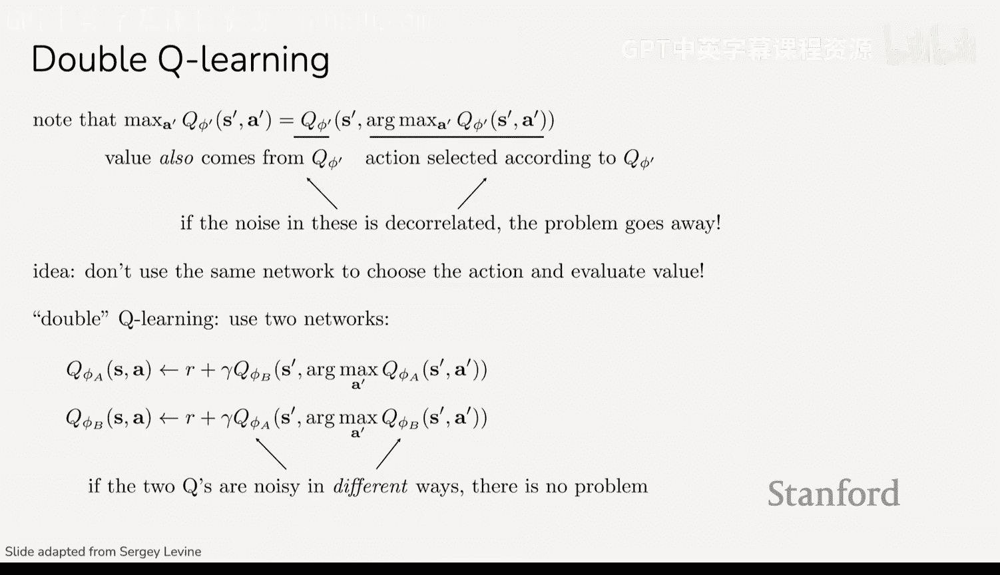

---

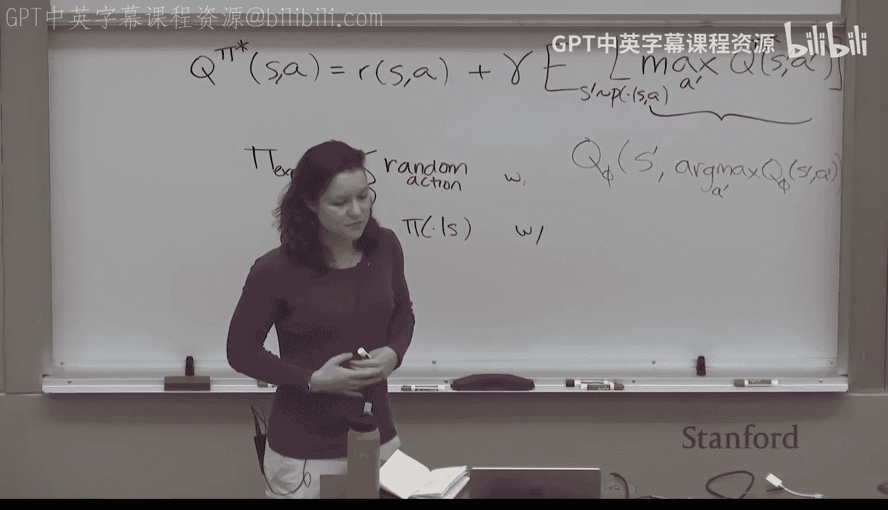

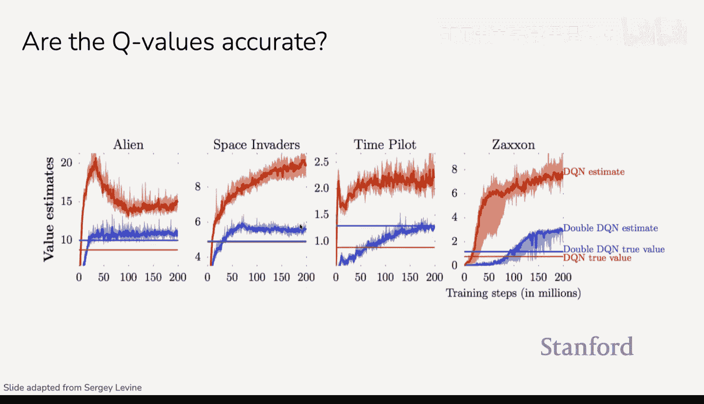

## 实践中的技巧：N步回报
我们要讨论的最后一个技巧，我们已经在演员-评论家方法中讨论过，就是 **N步回报**。我们的Q-Learning目标看起来像这样：`r + γ * max_{a'} Q(s', a')`。如果你的Q值很好，那么这一项实际上将非常重要，在Q学习更新中扮演主要角色。但如果你在训练初期Q值很差，那么这些（即时奖励 `r`）将是唯一重要的值，也是推动你学习算法的值。

如果你这里只有一个奖励函数，那可能有点问题，因为仅仅一个奖励函数可能无法告诉你太多关于你的Q值有多好的信息。

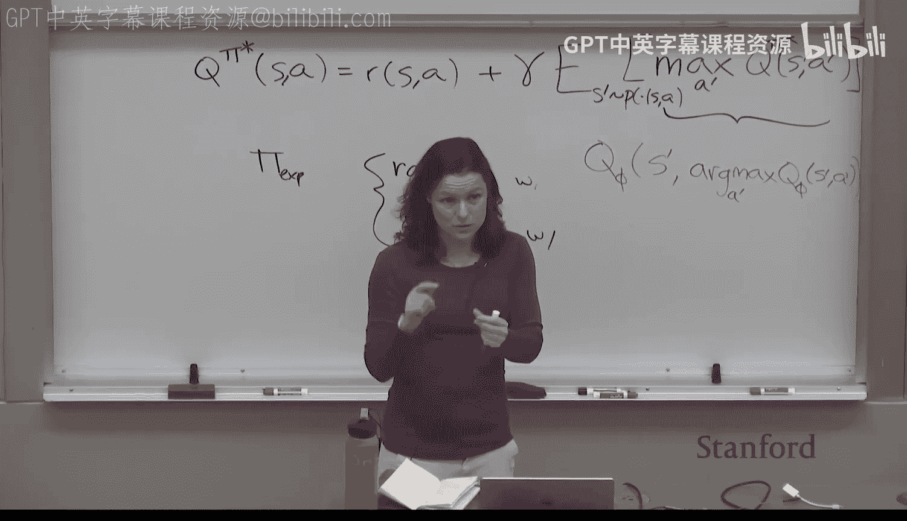

所以，如果你记得当我们讨论演员-评论家方法时，我们讨论了使用N步回报。如果我们使用蒙特卡洛回报，我们将使用奖励的总和；如果我们使用自举，我们只做 `r + γ * V`（当前时间步的奖励加上下一个时间步的价值）。相反，我们讨论了这个折中的方法：我们对接下来N个时间步的奖励求和，然后使用那之后时间步的价值。我们讨论过这如何具有更低的方差和偏差（偏差更低的意思是，如果你的目标很差，奖励函数会更准确）。

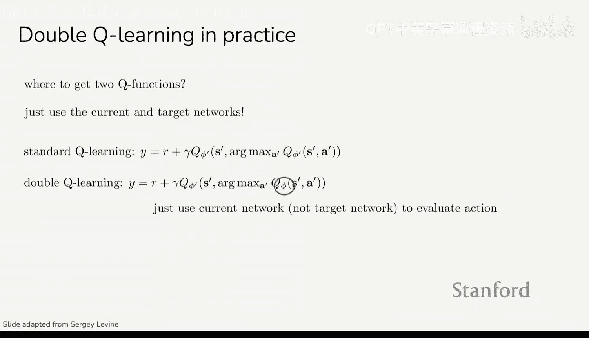

我们为Q值做这个。对于Q值，这看起来不是像 `r + γ * max_{a'} Q(s', a')` 这样，而是定义目标 `y` 为：`y = r_t + γ * r_{t+1} + ... + γ^{N-1} * r_{t+N-1} + γ^N * max_{a'} Q(s_{t+N}, a')`。这就是Q函数的N步回报的样子。

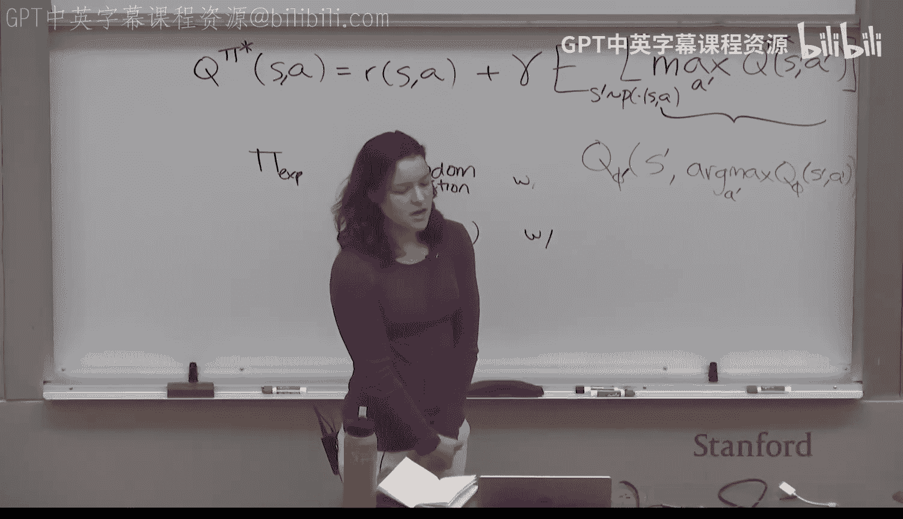

有人看到使用这个目标有什么问题吗？是的，如果你以离策略方式进行，这些 `r` 将来自你在回放缓冲区中使用的任何策略，而不是你试图估计的最优策略。所以这有一些优缺点：优点是它偏差更小，学习更快，尤其是在早期；缺点在于这些奖励是针对收集数据的策略的，而不是针对最优策略的，而我们试图估计的是最优策略的Q函数。

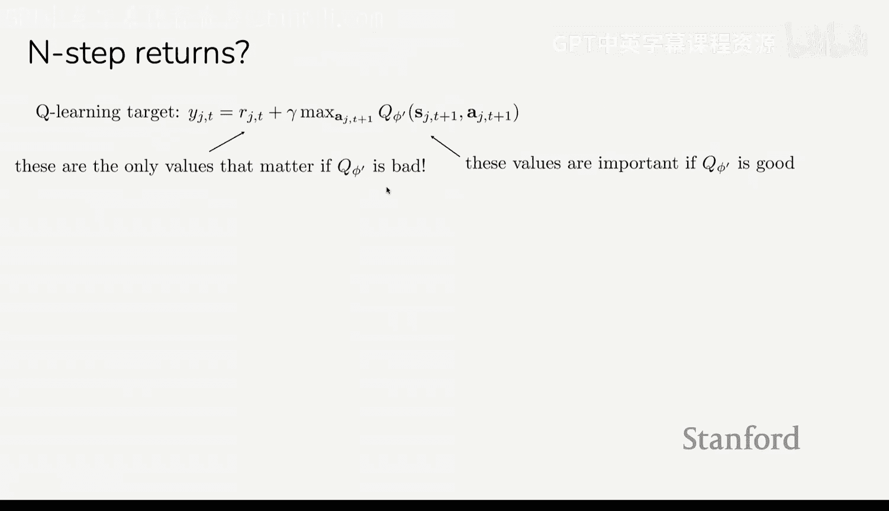

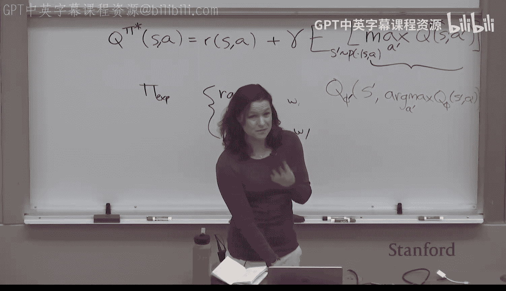

因此，在Q-Learning中使用N步回报时，这是一个缺点。当 `N=1` 时这不是问题，因为那里的奖励只是 `s` 和 `a` 的函数，我们正在估计 `Q(s, a)`。我们对此怎么办？也许最常见的、不太令人满意的答案是直接忽略这个问题，仍然使用大于1的N。N步回报通常确实能提高算法的性能，尽管存在这个问题。也就是说，你还可以做其他事情：你可以动态选择N，只使用遵循当前策略的数据（基本上查看采取了哪些动作，并检查这些动作是否与最大Q值一致）。原则上，你也可以动态选择N，在训练后期当你的Q值可能更准确时使用更小的N。你还可以使用重要性采样，用一些重要性权重来加权这些奖励。

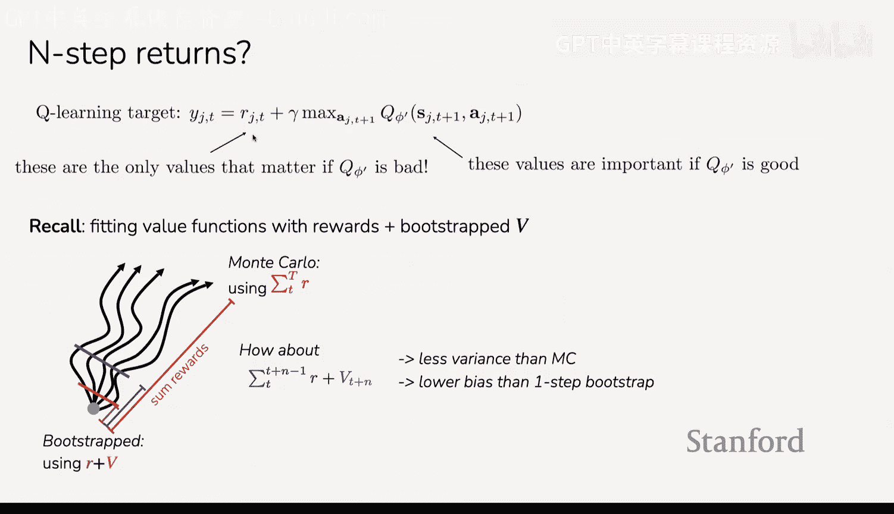

---

## 成功案例与算法选择建议
这些是实践中Q-Learning的三种技巧。有一些非常成功的Q-Learning例子。我认为还有其他例子，但最突出的例子之一是用来玩游戏。如果你想训练一个智能体玩游戏，无论是为了看你能做多好，还是为了与人类对战，Q-Learning能够在大多数Atari游戏上超越人类水平。这里的图表显示，所有在虚线上方的游戏，其性能都达到或超过了人类水平，所有在下方的则低于人类水平。

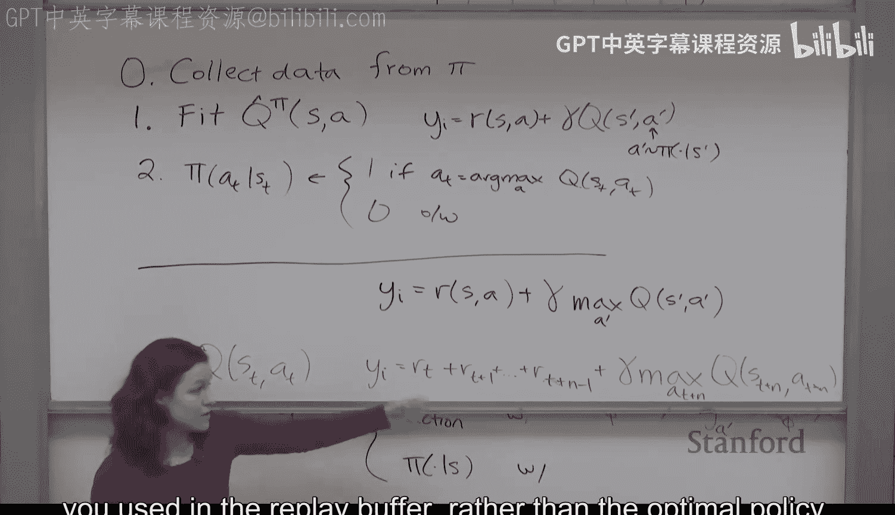

它还被用来训练机器人抓取系统。这实际上是一个连续动作的情况。右边的机器人使用通过Q-Learning训练的Q函数，然后对动作进行一种连续优化，试图找到抓取物体的好方法。

我们上次谈到，使用RL可以获得更高的成功率和更可靠的策略，这里也看到了。这个系统能够达到约96%的成功率，相当高。使用RL对这个应用的另一好处是，为了抓取，你不仅需要向下抓取东西，还需要在物体周围移动。它也能够学会如何使用强化学习来做到这一点，因为它将其视为一个序列决策问题。

---

## 在线RL算法选择建议
最后我想介绍一些关于何时使用哪种在线RL算法的建议，因为这是我们讨论的最后一个在线RL方法。我们讨论了PPO、SAC和DQN，这是我们讨论过的三种主要实用算法。

*   **PPO**：当你关心稳定性和易用性时很棒。通常不需要太多调整，但数据效率不高。因此，当你关心稳定性、易用性且不太关心数据效率时，它是很好的选择。
*   **DQN**：当你有离散动作或低维动作空间时效果很好。在这些情况下，它可以是一个很好的选择，根据你能使其离策略的程度，它可能具有相当的数据效率。
*   **SAC** 及其变体：当你最关心数据效率时很棒，但需要更多调整，并且比简单的PPO稳定性稍差。

---

## 总结
本节课中，我们一起学习了Q-Learning及其在实践中的应用，包括目标网络、双DQN和N步回报这三个技巧。我们定义了贝尔曼方程和贝尔曼最优性方程。这本质上就是如何在不学习显式策略的情况下进行强化学习。

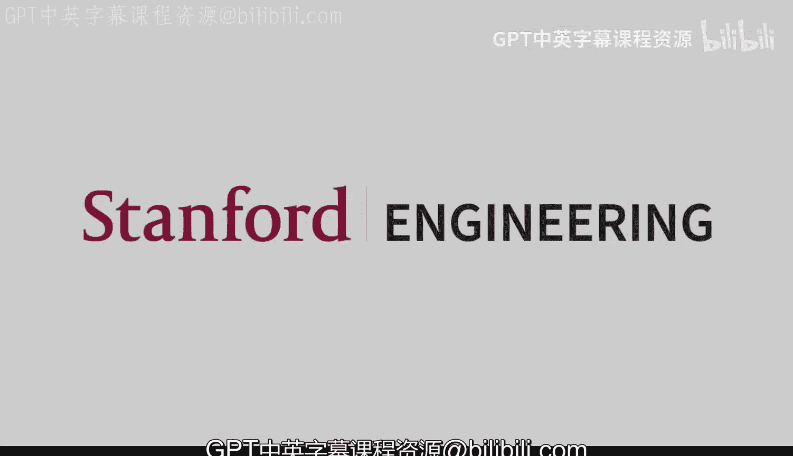

至此，我们完成了目前在线强化学习算法的学习。我们已经涵盖了许多不同在线强化学习算法的基础知识。