#  007：离线强化学习

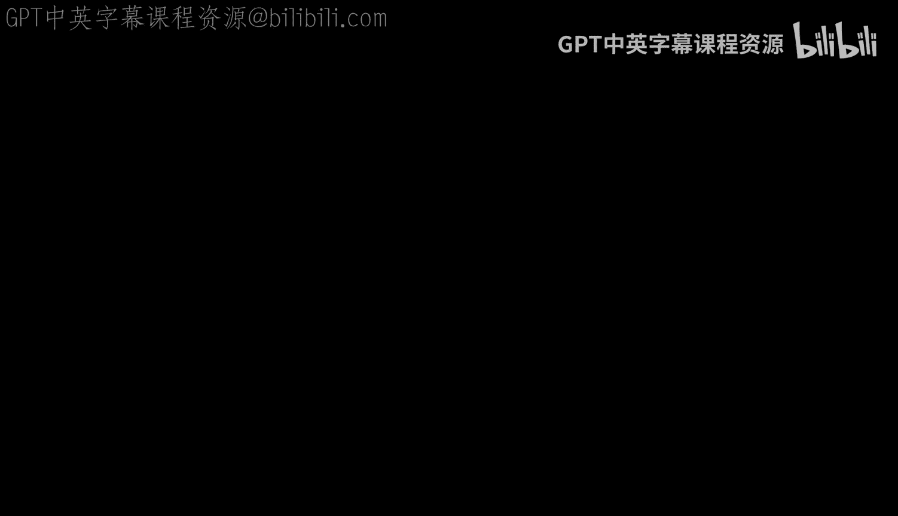

在本节课中，我们将要学习离线强化学习。我们将首先回顾在线强化学习方法，然后探讨离线强化学习的核心挑战，并介绍两种主要的离线强化学习方法：优势加权回归和隐式Q学习。我们将了解这些方法如何利用离线数据集学习策略，并克服因数据分布偏移带来的过估计问题。

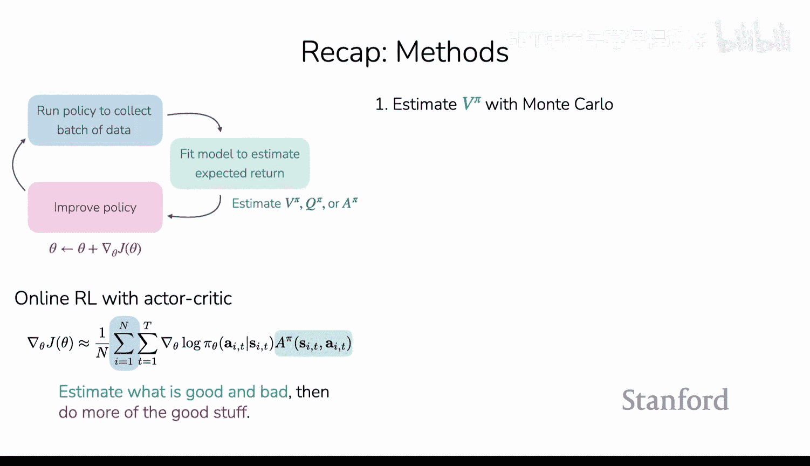

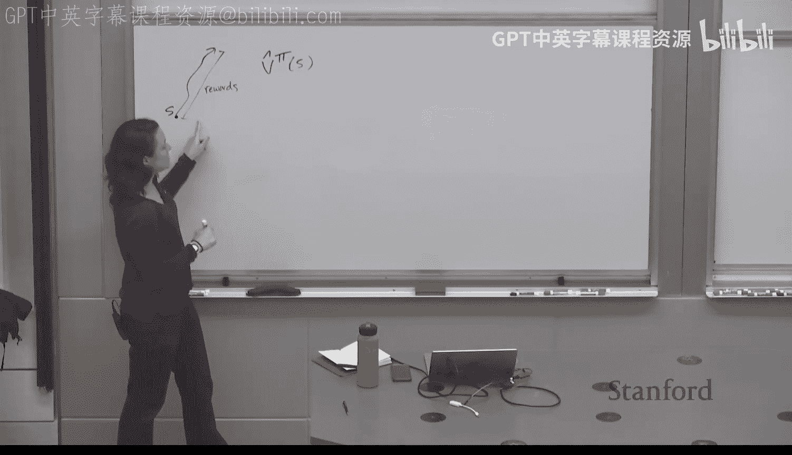

## 在线强化学习方法回顾

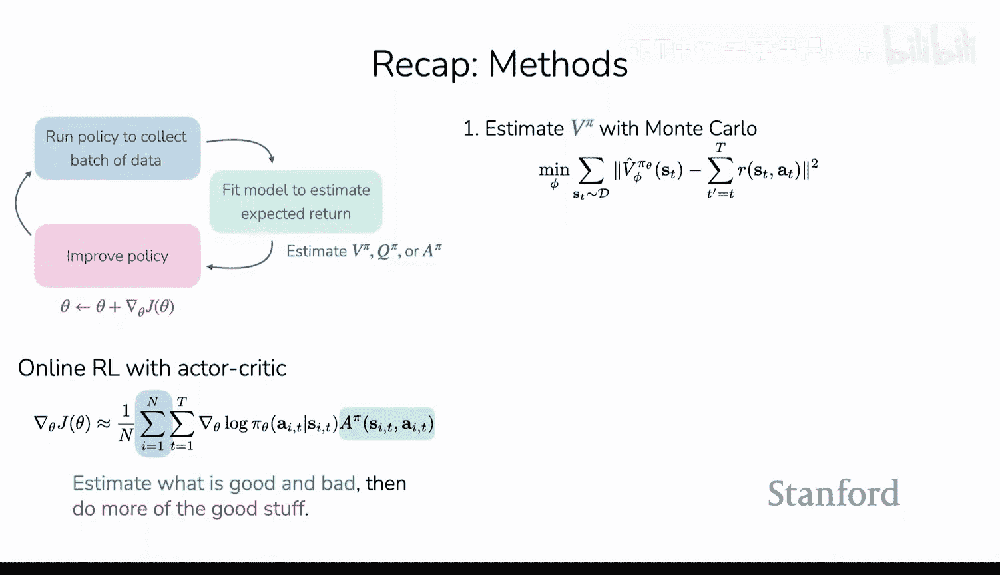

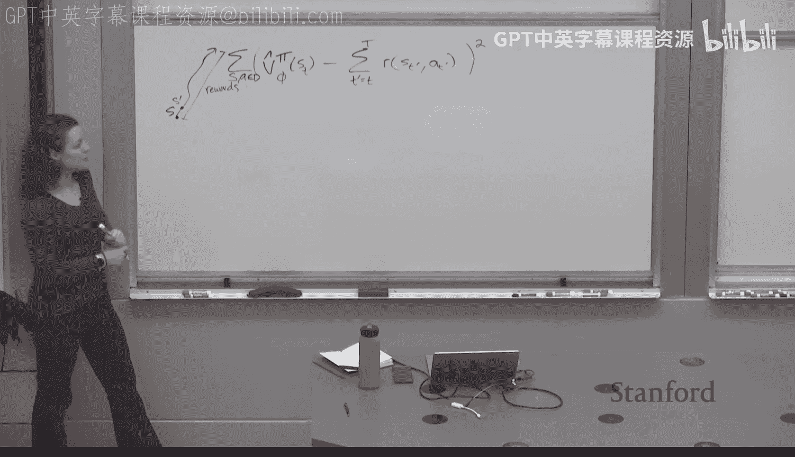

上一节我们介绍了在线强化学习的基本方法，本节中我们来看看这些方法的核心思想。

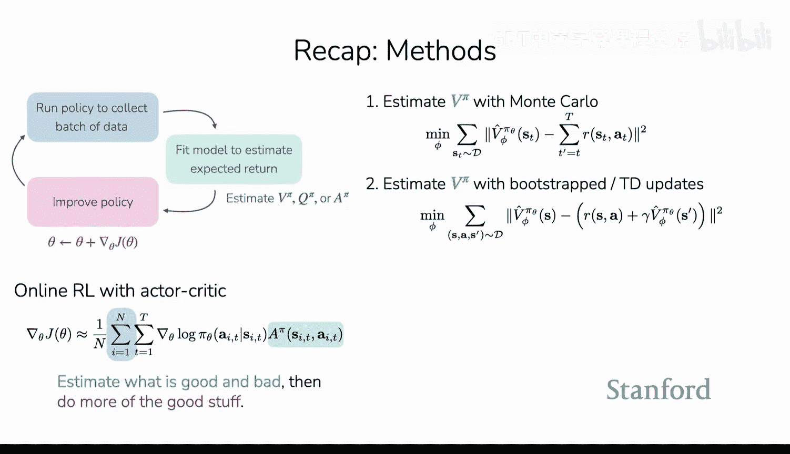

我们首先讨论了策略梯度方法。其目标是收集策略数据，然后增加那些带来高于平均回报结果的行动的概率，从而鼓励策略多做带来好结果的事情，少做带来坏结果的事情。

接着，我们引入了价值函数的概念。我们可以使用价值函数来估计一个行动的好坏。当我们拟合一个价值函数后，就可以用它来鼓励策略多做我们估计为好的事情，少做我们估计为坏的事情。我们看到了像PPO和SAC这样使用演员-评论家方法的算法。

我们还讨论了拟合价值函数的几种不同方式。这些方式将在今天的课程中扮演重要角色。

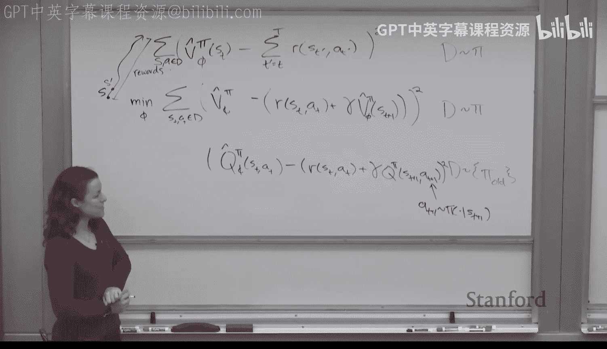

以下是拟合价值函数的几种主要方法：

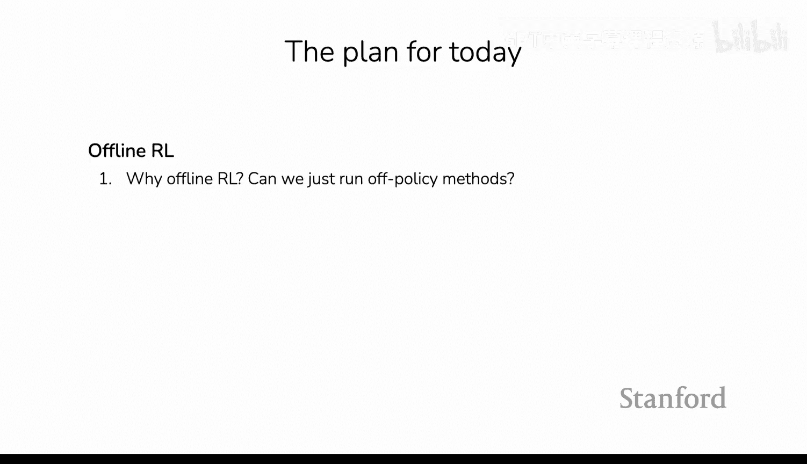

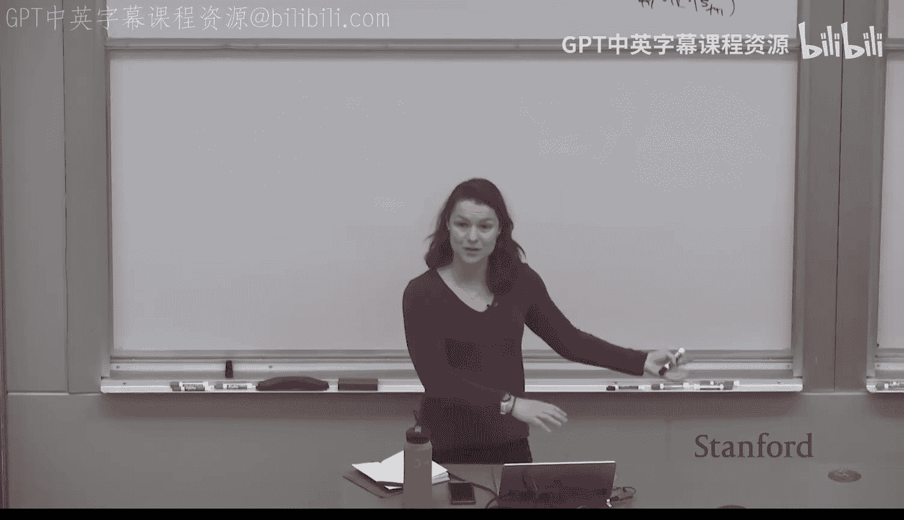

1.  **蒙特卡洛回报**：如果你有一些状态数据，并想估计该状态的价值，一种方法是取未来轨迹上的奖励之和，并以此方式估计价值。目标函数是尝试拟合某个价值函数 $V_{\pi}(s)$，其目标是该状态向后的奖励之和。其目标函数如下：
    $$
    \min_{\phi} \sum_{(s_t, a_t) \in \mathcal{D}} \left( V_{\phi}(s_t) - \sum_{t'=t}^{T} r_{t'} \right)^2
    $$
    这是估计价值函数最简单的方法。

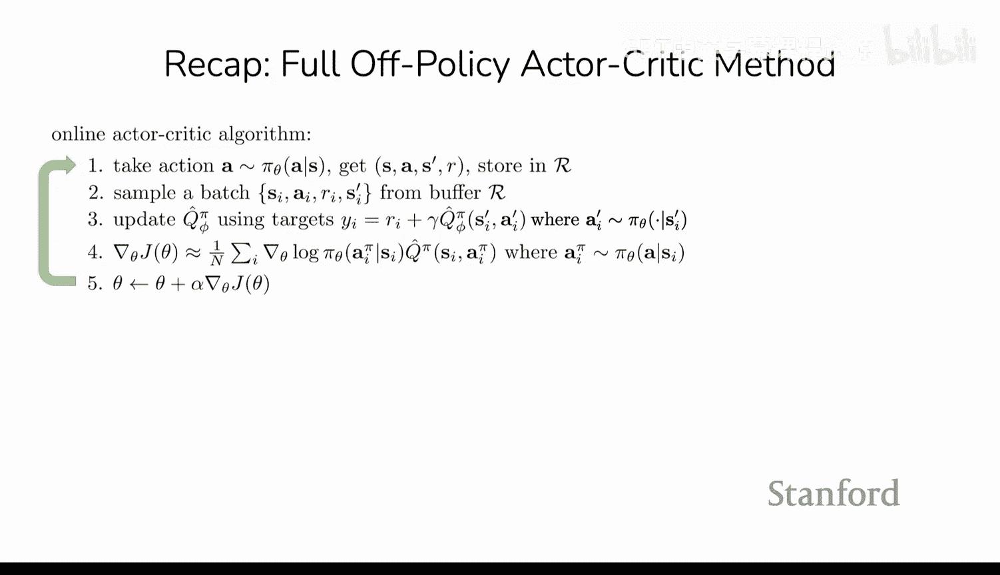

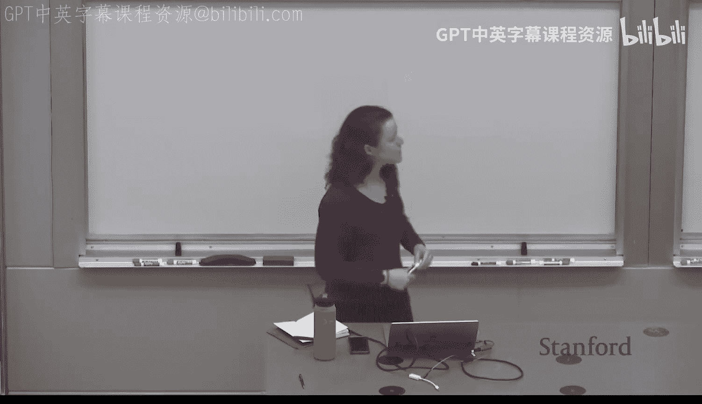

2.  **时序差分更新**：为了获得更好的估计，我们可以在中间状态查看价值估计，而不是简单地对所有奖励求和。具体来说，目标变为当前时间步的奖励加上下一时间步的估计价值。其目标函数如下：
    $$
    \min_{\phi} \sum_{(s_t, a_t, s_{t+1}) \in \mathcal{D}} \left( V_{\phi}(s_t) - (r_t + V_{\phi}(s_{t+1})) \right)^2
    $$
    我们称这种方法为自举法或时序差分更新。

3.  **离策略Q函数学习**：在上述两种场景中，数据集是从你的策略中采样的，这是用于估计策略价值的同策略方法。我们随后开始研究一种场景：如果数据集是从一些旧策略的混合中采样的，我们能否使用这些数据来拟合价值函数？为此，我们开始研究Q函数。原则上，我们可以使用类似自举的方法，但关键区别在于，这里的价值函数是针对数据中的策略，而不是我们试图学习价值函数的策略。因此，我们改变了目标，使用Q函数。目标变为 $r_t + Q_{\phi}(s_{t+1}, a_{t+1})$。关键区别在于，$s_t$、$a_t$ 和 $s_{t+1}$ 是从数据中采样的，但 $a_{t+1}$ 将从我们试图学习价值函数的策略中采样。

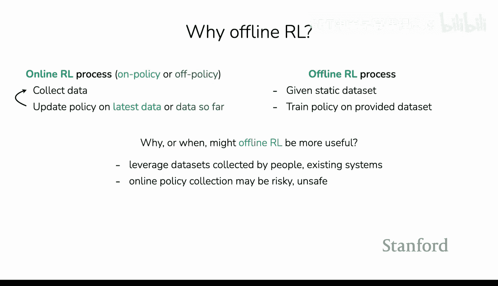

这个最后的方法的一个非常重要的方面是，因为我们使用自举法，并使用我们在给定状态下的价值函数估计作为标签，所以我们需要这个Q函数在那些与我们将在其上评估的行动相似的行动上进行训练。如果我们的策略与旧策略集非常不同，这个标签将不准确，我们就无法学习到准确的Q函数。因此，它需要对行动有良好的覆盖。

完整的离策略演员-评论家方法大致如下：我们从策略中获取数据，将其存储在包含多个过去策略数据的缓冲区中，从该缓冲区采样一些数据，用这些目标更新我们的Q函数，然后更新我们的策略以鼓励其增加具有高Q值的行动的概率。然后我们可以重复这个过程。

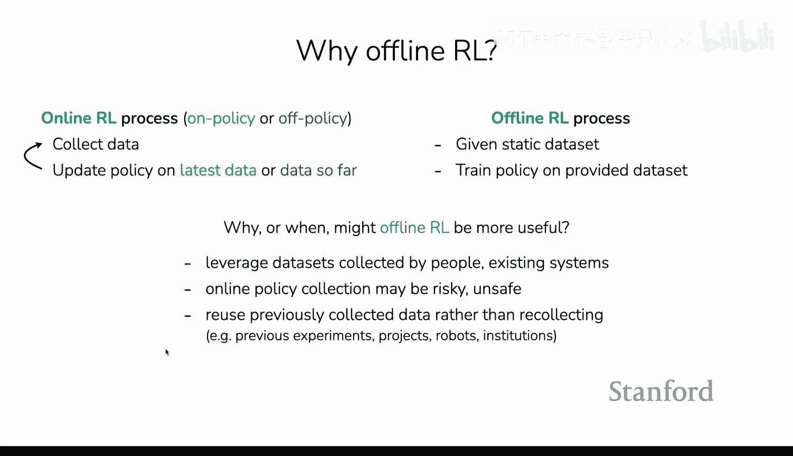

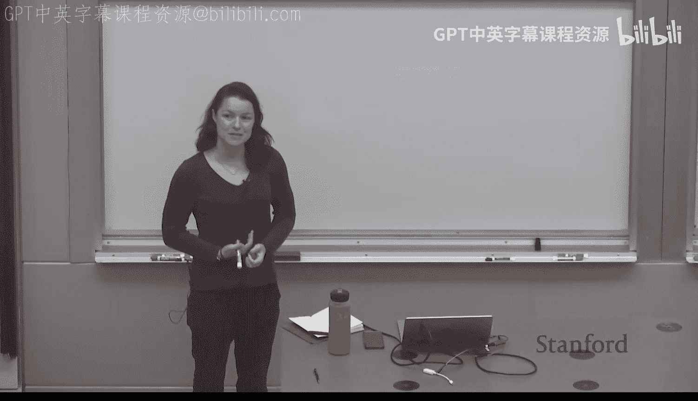

## 离线强化学习简介

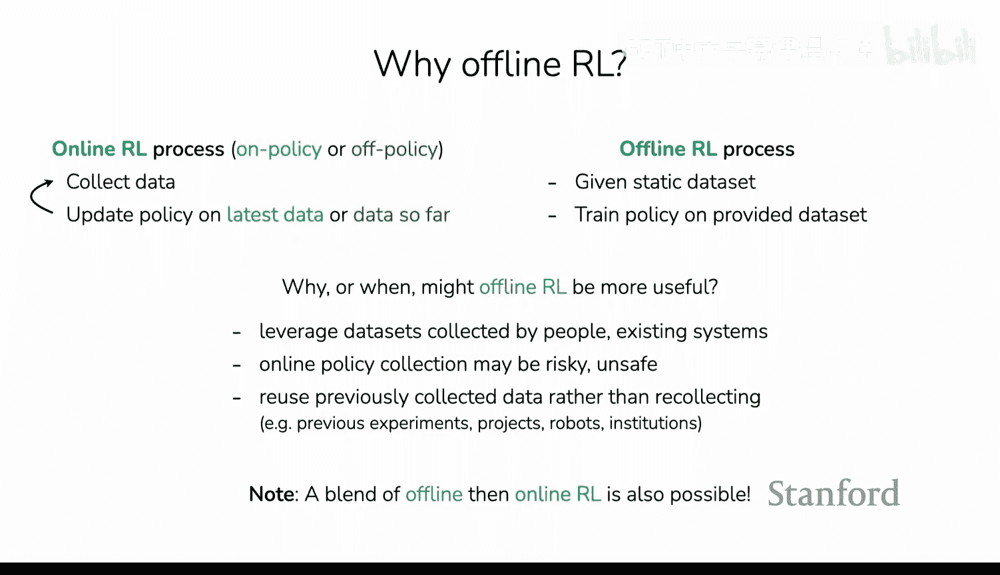

今天，我们将基于这些想法进行构建，具体讨论离线强化学习。在离线强化学习中，我们试图从一个给定的数据集中学习，而不是由我们自己的策略收集。我们将讨论两种不同的方法或两类方法来进行离线强化学习。我们将尝试看到的关键点是：首先，离线强化学习中出现的关键挑战；其次，两种不同的离线强化学习方法及其工作原理；最后，离线强化学习如何比另一种从离线数据集学习的方法——模仿学习——有所改进。

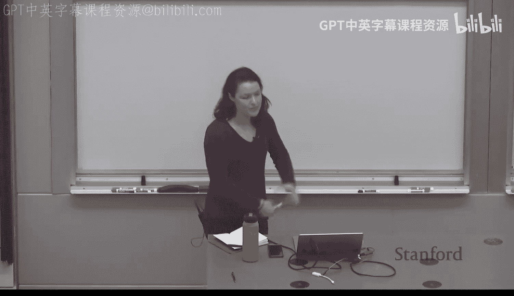

### 离线强化学习的动机

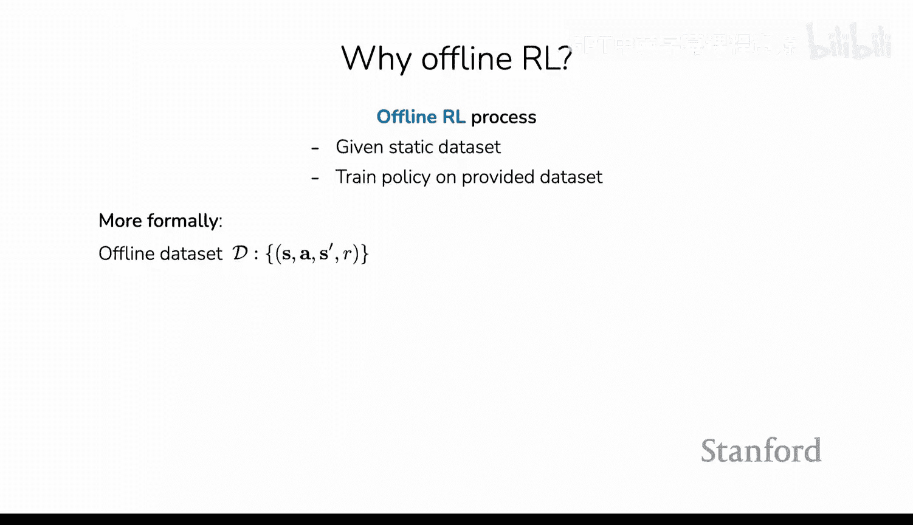

在线强化学习的过程是收集数据，然后使用最新数据或迄今为止的数据更新策略，然后重复该过程。对于离线强化学习，你实际上只是预先获得数据集，然后你想在该提供的数据集上训练一个策略。因此，你实际上不是迭代地收集数据。

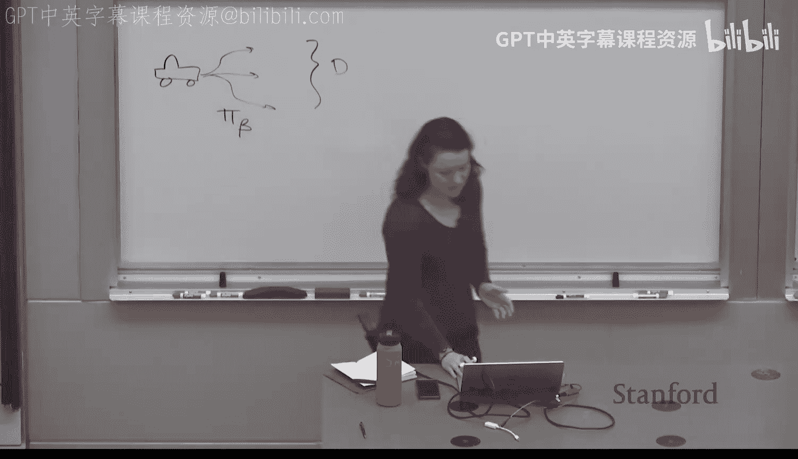

在许多情况下，离线强化学习可能比在线强化学习更有用。

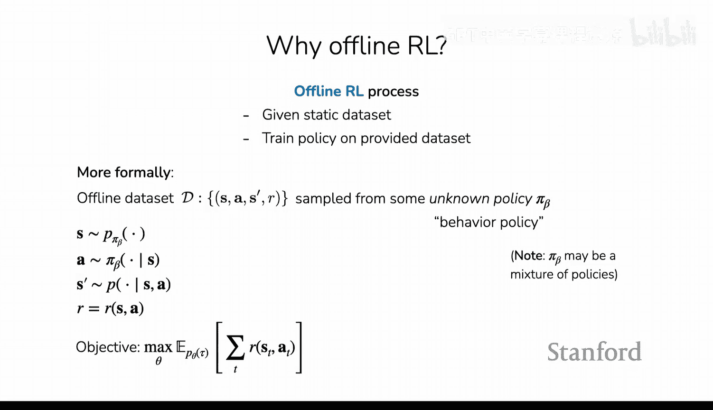

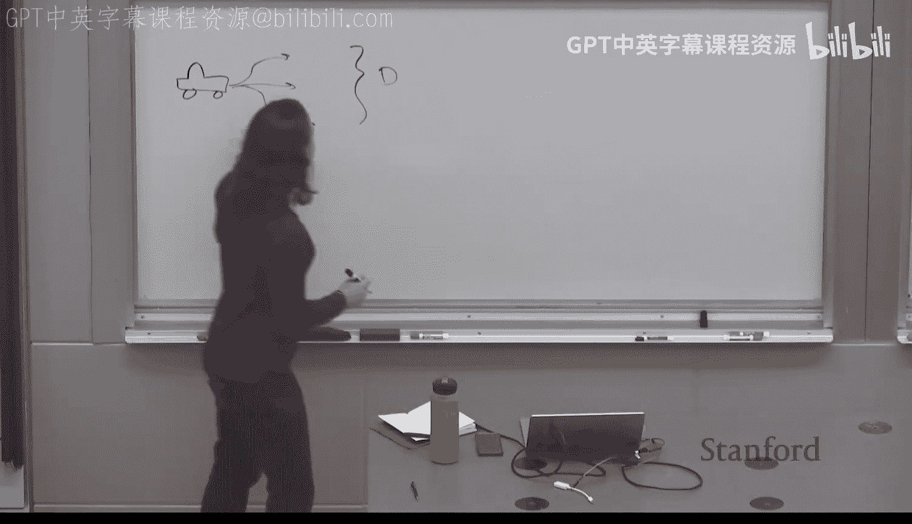

以下是离线强化学习可能更有用的几种情况：

1.  **已有数据集**：当你试图解决一个问题时，你可能已经有一个由现有系统或人员收集的数据集。
2.  **安全考虑**：从当前策略收集数据可能风险更高或可能不安全。例如，如果你试图学习一个控制汽车在道路上行驶的策略，你可能有很多人们驾驶的数据，这些数据对于学习一个好的驾驶策略非常有用。实际部署你的策略，尤其是驾驶技术不佳的策略，可能是不安全的。
3.  **数据重用**：如果你实际多次运行在线强化学习，你可能已经拥有来自策略的数据集，重用这些数据比每次尝试运行实验时重新收集数据要好得多。例如，如果你正在训练机器人做某事，并希望它学习如何抓取东西，那么如果你使用纯在线强化学习方法，意味着每次运行算法时都需要从策略中重新收集数据。这可能非常低效，因为第一次运行算法时，算法本身仍有迭代空间。通常，离线数据比在线数据更便宜，因为离线数据可以多次重用。

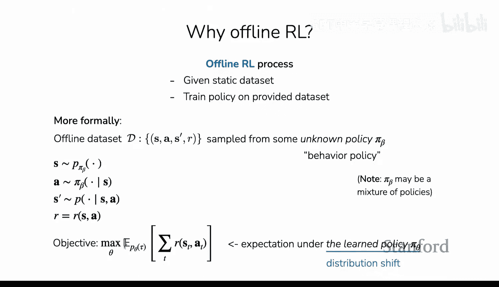

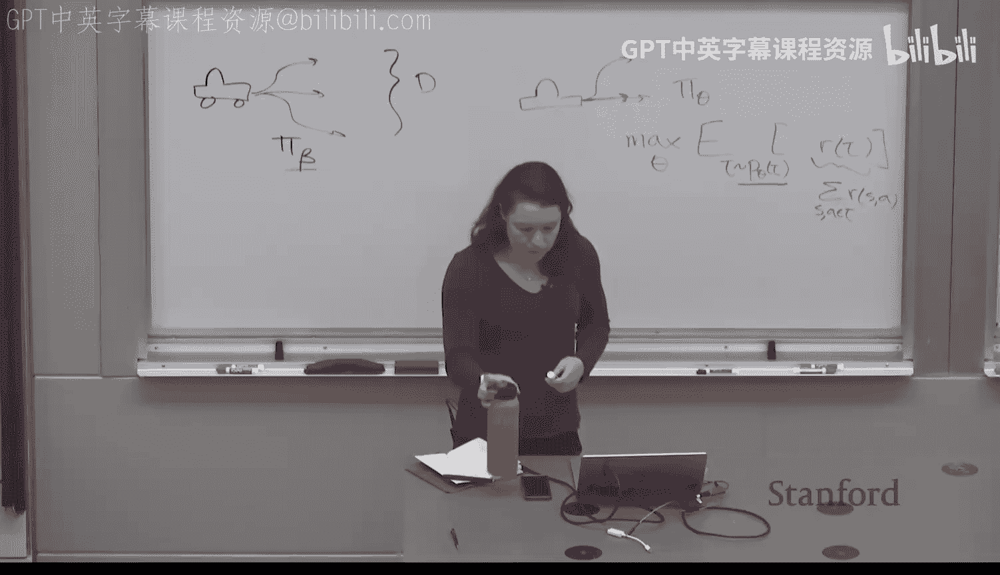

值得注意的是，你可以混合离线强化学习和在线强化学习。例如，在自动驾驶中，你有一个人们驾驶的数据集，然后你在其上训练一个策略，然后尝试用一些在线数据收集来改进它。在许多现实世界的强化学习用例中，你会希望混合使用，因为如果你实际部署了策略，那么在部署后能够改进它是很好的。

### 离线强化学习的正式定义

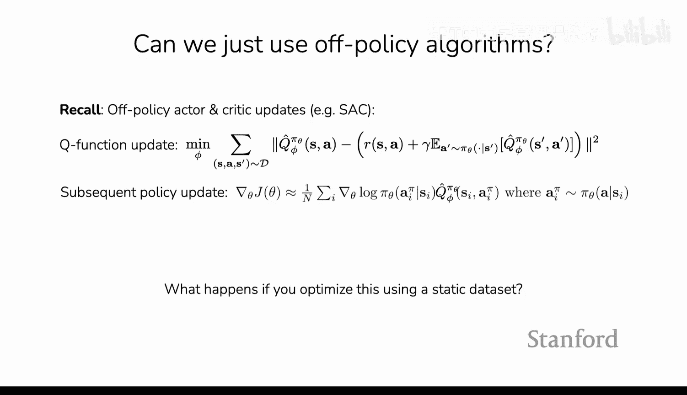

假设你被给予某个数据集。该数据集可能包含一些轨迹。例如，在驾驶场景中，你有一些汽车，并且有人们在许多不同地方、以许多不同方式、使用许多不同汽车驾驶的数据集。我们将说这构成了我们被给予的某个数据集。

从数学角度思考收集这些数据的策略是有帮助的。我们不知道底层策略。例如，如果这是由人们收集的，我们不知道具体是什么。首先，它是由多个人收集的，即多个策略。我们也没有直接访问权限。但从数学角度思考该策略是有用的。因此，我们将说该数据集是通过运行某个策略收集的，我们将其称为行为策略或 $\pi_{\beta}$。如果它是由多个策略收集的，你可以将 $\pi_{\beta}$ 视为策略的混合，并将该混合定义为某些组成策略的平均或加权和。因此，说它是由单个策略收集的不会失去一般性。

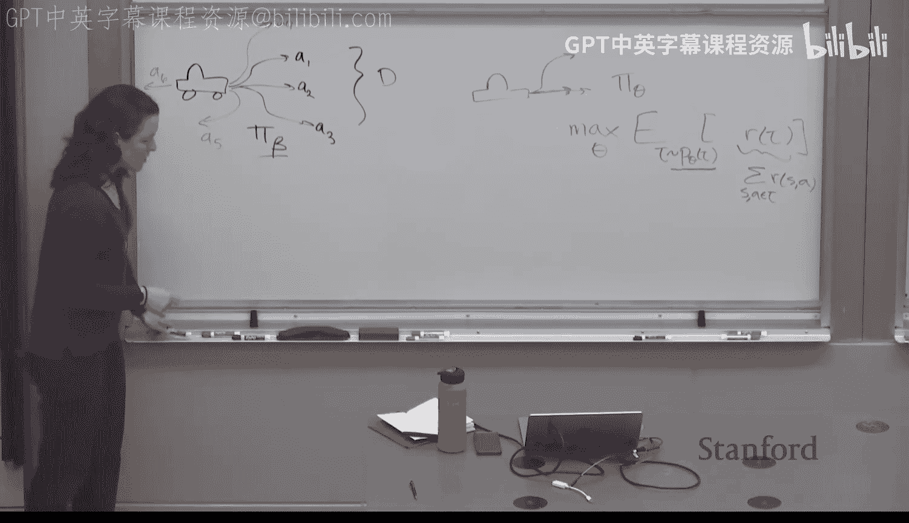

我们的目标是学习一个能最大化奖励的好策略。理想情况下，我们能够获取这个数据集并学习一些可以控制汽车的策略。我们想要一个我们称之为 $\pi_{\theta}$ 的策略，并最终最大化对应于该策略有多好的奖励之和。你可以将其视为最大化该策略的参数，并尝试最大化从该策略采样的轨迹的奖励之和。目标函数如下：
$$
\max_{\theta} \mathbb{E}_{\tau \sim \pi_{\theta}} \left[ \sum_{t} r(s_t, a_t) \right]
$$
这里需要注意的一点是，这个目标是对该策略的期望，而我们的数据是由不同策略收集的。因此，我们可以认为收集数据的策略与我们部署的策略之间存在一些分布偏移，并且我们实际上无法从该策略中采样。这是离线强化学习的一大挑战。存在一种分布偏移，因为这个期望是在学习策略下，而不是在收集数据的策略下。环境动态在数据和学习策略之间是恒定的。因此，轨迹的分布偏移仅由策略的偏移引起。

### 直接应用离策略算法的挑战

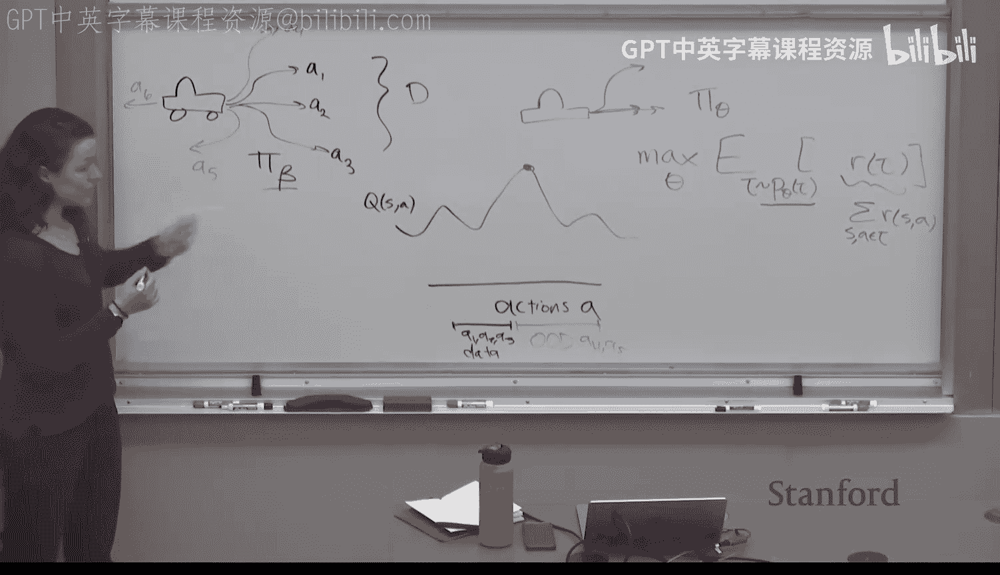

一个自然的问题是，也许我们可以直接重用离策略算法，只是使用离线数据集而不是用新策略重新收集数据来运行该离策略算法。如果你在离线数据集上使用像SAC这样的离策略算法，会发生什么？

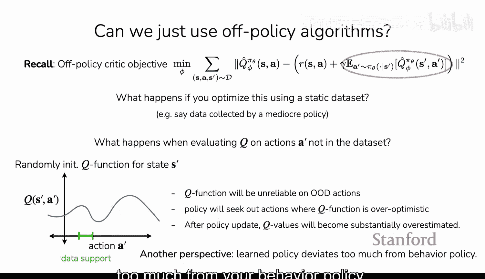

核心问题是，我们正在评估从我们策略中采样的行动上的Q估计，而我们的策略也试图增加具有高Q值的行动的概率。如果我们有离线数据，并且我们正在学习一个与收集数据的策略不同的策略，那么我们用来监督Q函数的这个Q估计可能不准确，因为它实际上不一定看到来自我们学习策略的行动。因此，我们可能最终学习到一个不准确的Q函数，如果你没有学习到准确的Q函数，那么结果可能会得到一个糟糕的策略。

更详细地解释一下：假设我们的数据集中有一些行动，比如 $a_1$、$a_2$、$a_3$。汽车可以采取数据集中没有的其他行动，例如 $a_4$、$a_5$、$a_6$。在训练开始时，我们将随机初始化我们的Q函数。对于一个给定的状态，随机初始化的Q函数可能看起来有些随机。只有其中一些行动存在于数据中。然后，当你进行策略更新时，你的策略会说，让我们尝试增加具有高Q值的行动的概率。对于这个随机初始化的Q值，也许像 $a_4$ 这样的行动看起来不错。如果那在你的数据之外，那么它将继续认为那是一个好的行动，因为它永远不会真正知道该行动的正确Q值是什么。

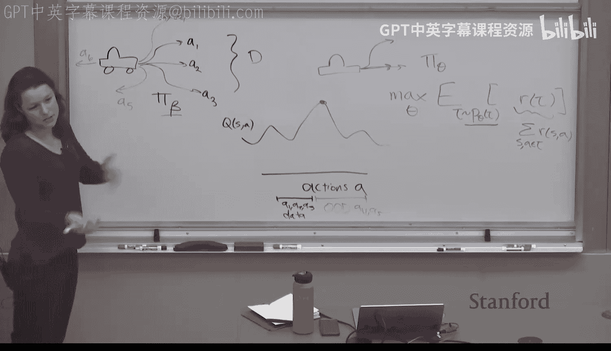

另一种思考方式是，这里有一些分布外的行动，包括 $a_4$、$a_5$，它从未见过。例如，从未见过汽车在高速公路上掉头，因此该行动的Q值是随机初始化的。一些分布外的行动将任意具有更高的Q值，一些将具有更低的Q值，因为它是随机初始化的。然后，你的策略将利用这些分布外行动上的不准确性。在策略更新之后，这些Q值将被高估，因为现在你将不断强化那是好的行为，即使它不在你的数据中。

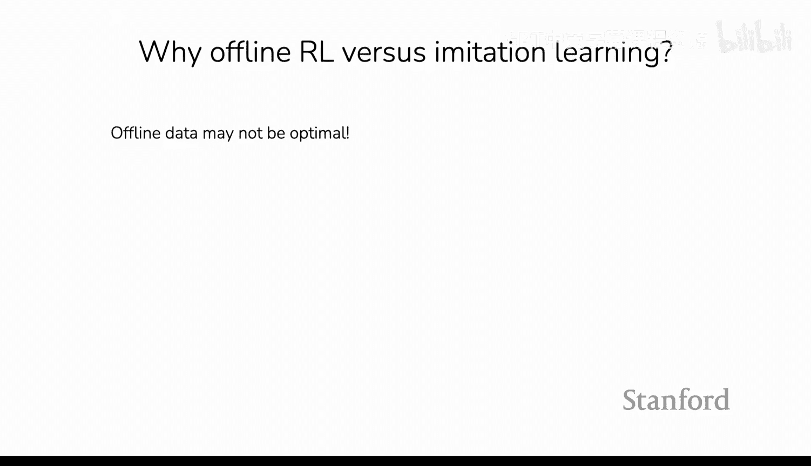

这个问题的另一个视角是，当你的学习策略与行为策略偏离太多时，就会发生这种情况，因为这些分布外行动是与行为策略所做的非常不同的事情。如果我们更接近行为策略，就不会有这个问题。

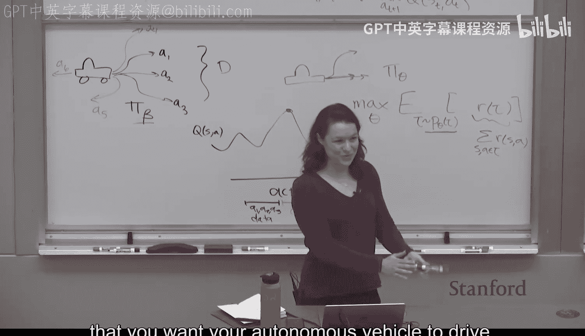

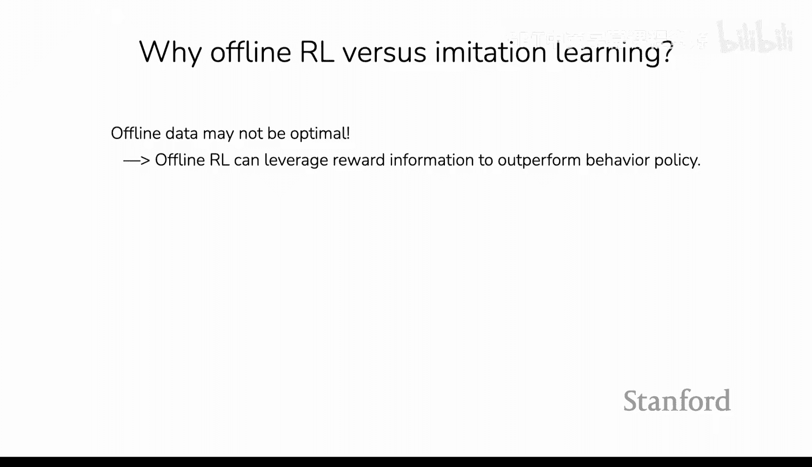

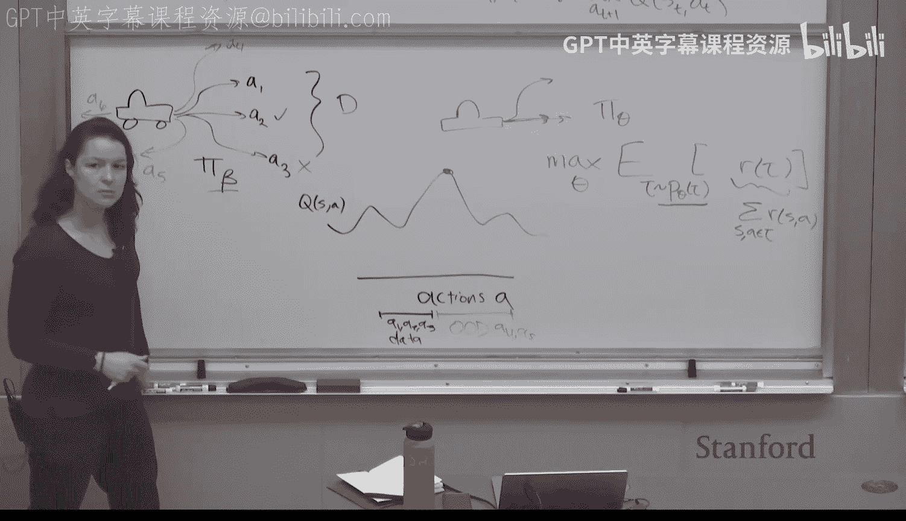

## 离线强化学习方法

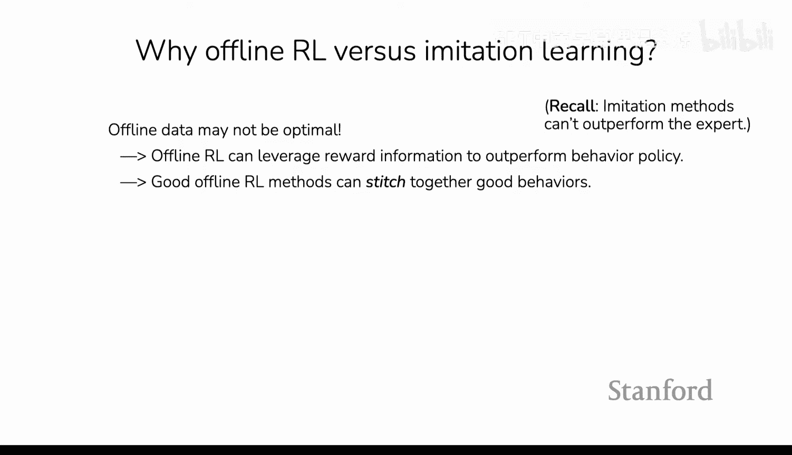

现在，让我们讨论减轻过估计的方法，这实际上是离线强化学习方法的核心目标。

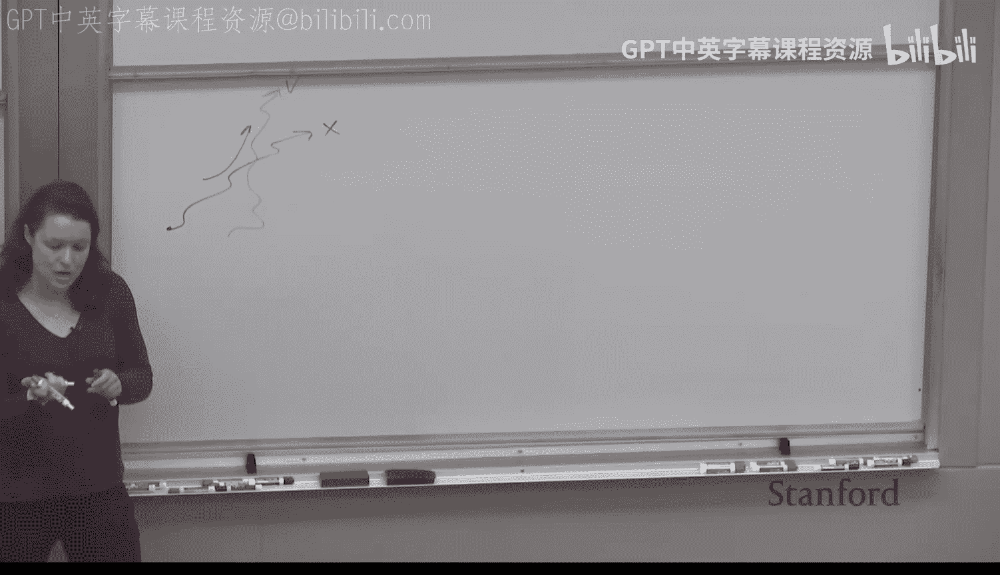

### 基线方法：过滤模仿学习

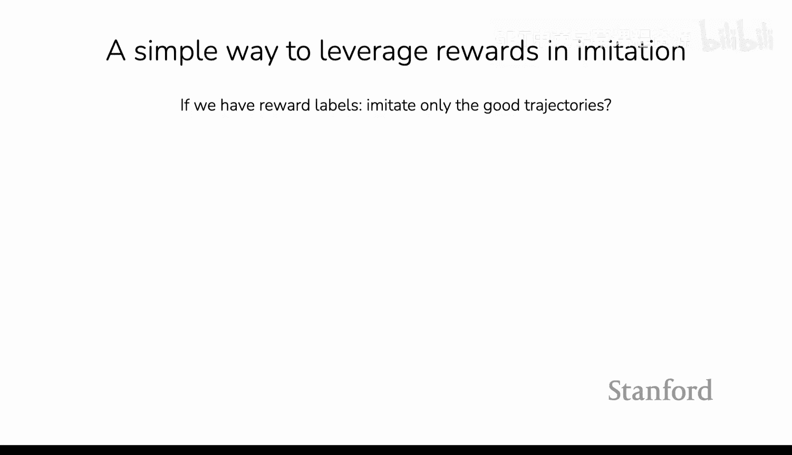

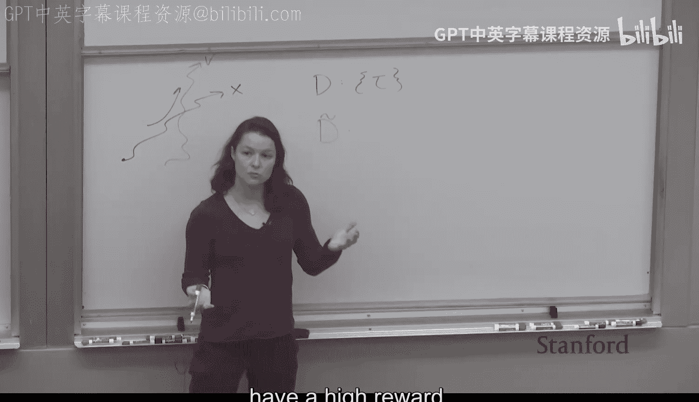

一种离线强化学习方法是进行模仿学习。模仿学习有效的原因是你只监督数据中看到的行动，因此任何使用模仿学习的方法都会在一定程度上隐式地避免分布外行动，因为你只监督数据中的行动。

然而，我们不一定想使用普通的模仿学习，因为离线数据可能不是最优的。例如，你的数据中可能有人类驾驶员，他们不以你希望自动驾驶汽车驾驶的方式驾驶。通常，强化学习方法应通过利用奖励信息提供一种比底层数据策略更好的方式。通过利用这样一个事实：也许你可以浏览数据集并说这是一个好的行为，而另一个行为不那么好。这些奖励信息可以让你获得更好的策略。普通的模仿学习无法超越数据中提供的专家。

一个好的离线强化学习方法还可以将好的行为“缝合”在一起。例如，如果你有一些轨迹，你知道从 $s_1$ 到 $s_3$ 是好的行为，从 $s_7$ 到 $s_9$ 是好的行为，那么离线强化学习方法原则上实际上可以学习如何获得一个从 $s_1$ 到 $s_9$ 的策略，而模仿学习方法将无法做到这一点。

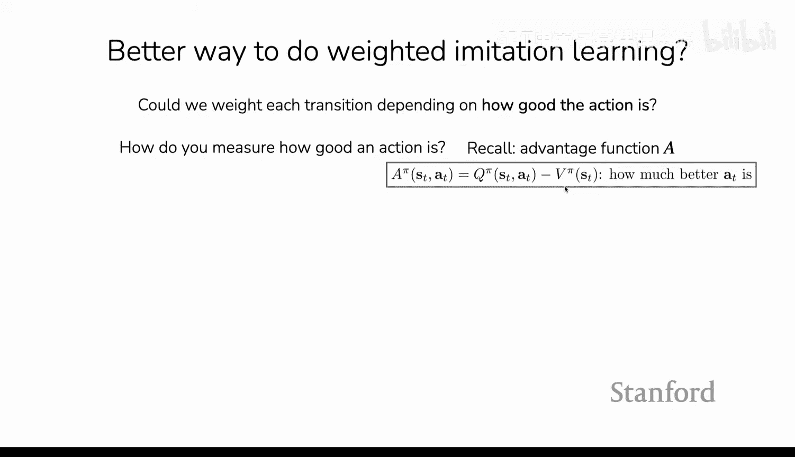

在我们深入讨论可以进行这种缝合的方法之前，让我们先讨论一个非常简单的基线方法。一个想法是，如果你有一个离线数据集，你也可以只取具有高奖励的轨迹，只模仿好的部分，不模仿坏的部分。这似乎是一个合理的方法。

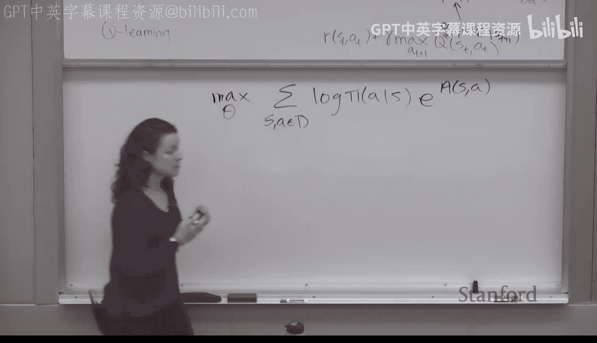

以下是该方法的步骤：

1.  你有一个包含各种轨迹的离线数据集。
2.  你可以定义一个新的数据集，该数据集只包含具有高奖励的轨迹。
3.  这个新数据看起来像是你原始数据集中的所有轨迹，但条件是这些轨迹的奖励大于某个阈值。该阈值可以是数据集中奖励的某个百分位数，例如第70百分位数，即只取前30%的轨迹。
4.  然后，你可以学习一个最大化在这个修改后的数据集中行动可能性的策略。这看起来像是在这个修改后的数据集中取状态和行动，并最大化给定状态下行动的对数概率。

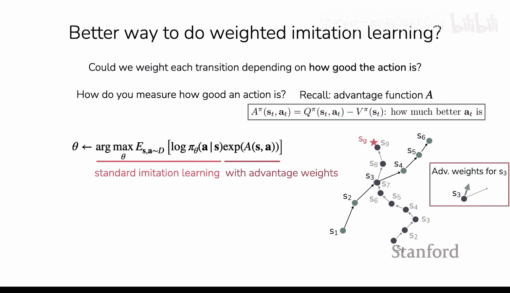

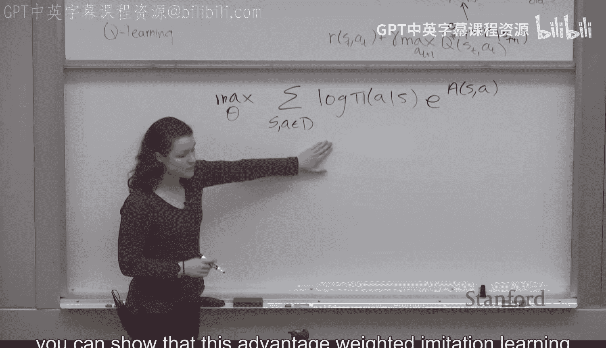

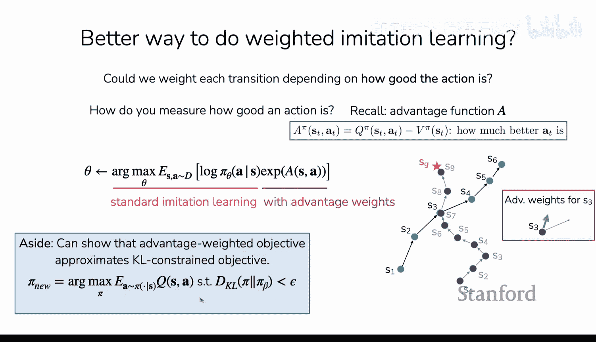

这是一个非常原始的利用奖励信息的方法。值得注意的是，它无法进行这种缝合行为，因为如果那是一个坏的轨迹，它可能会完全过滤掉该轨迹，而不会实际学习如何采取这个好的行为和那个好的行为，并弄清楚如何从这里到达那里。也就是说，这是一个好的基线。如果你要尝试任何离线强化学习方法，最好先尝试这个方法，看看它的效果如何，并将其作为基准，并确保你的离线强化学习方法比这更好。

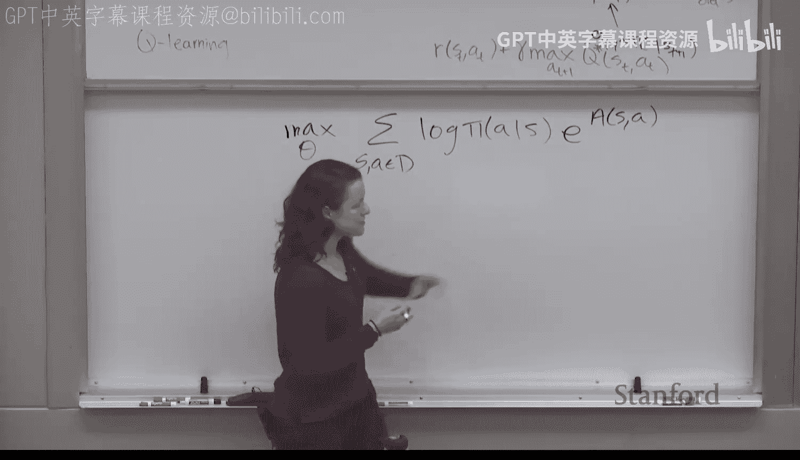

### 方法一：优势加权回归

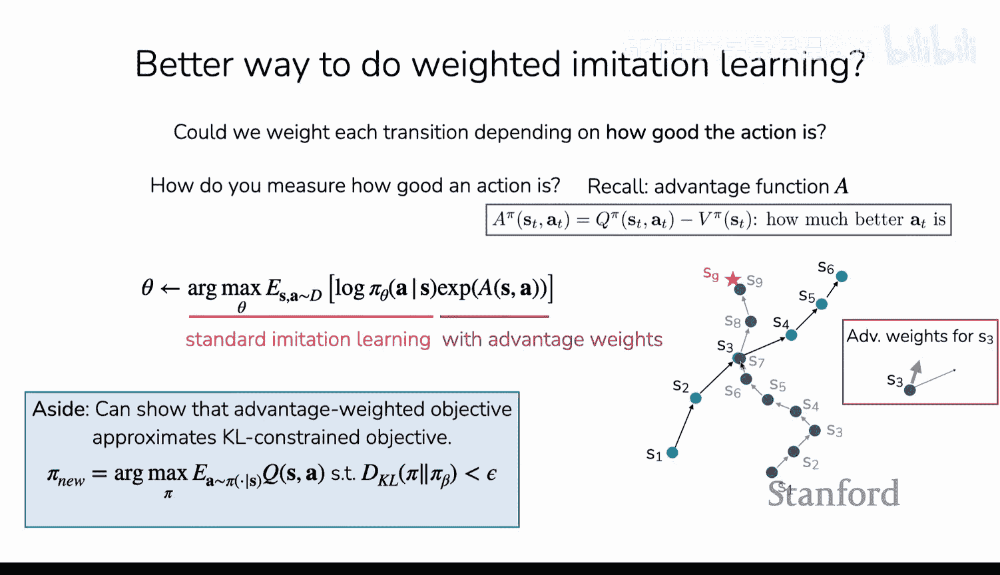

我介绍这个方法的原因之一是，可以说一些最好的离线强化学习方法实际上做的事情与此并没有太大不同，因为它们确实有一个模仿学习的组成部分。这里的想法是，我们可以模仿数据，但根据该转移中行动的好坏来加权我们的模仿学习目标。

如果你还记得我们关于价值函数和优势函数的讨论，优势函数表示 $A_t$ 比你的策略的平均表现好多少。这个优势函数表明，如果我们用优势函数加权我们的模仿学习目标，那么我们可以获得该行动有多好的度量，并获得一个能够有效学习的策略。这将形成我们第一个离线强化学习方法的目标。

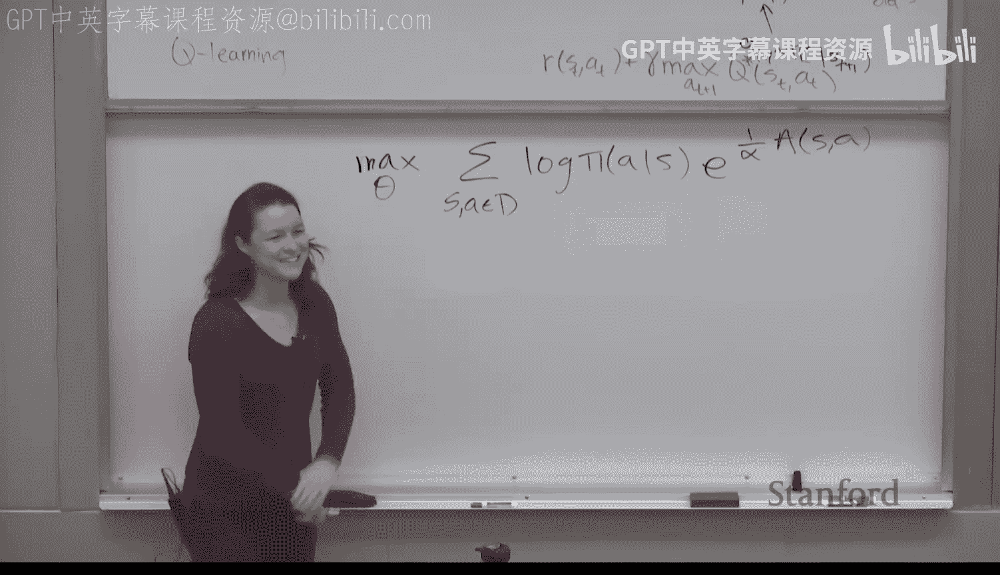

具体来说，我们将最大化一个策略的目标，该目标采用标准的模仿学习目标，但仅用指数化的优势进行加权。目标函数如下：
$$
\max_{\theta} \sum_{(s, a) \in \mathcal{D}} \log \pi_{\theta}(a|s) \exp\left( \frac{1}{\alpha} A(s, a) \right)
$$
关于指数化的选择，实际上有一种方法可以推导出这个特定的目标。如果你有一个好的优势函数估计，并且我们回到缝合的例子，对于这个特定的状态，我们知道这个行动的优势是高的。因此，当我们采用模仿学习目标并用优势加权时，我们将告诉我们的策略，在该状态下，它应该走向好的结果，而不是走向坏的结果。因此，如果你有一个好的优势估计，这个目标能够在离线数据集中缝合好的行为。

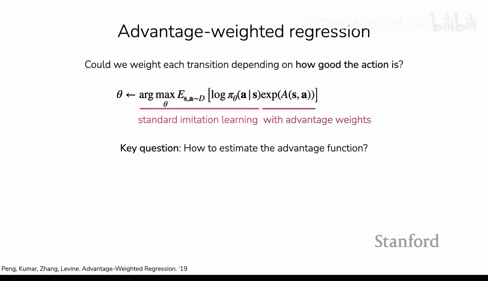

在推导方面，你可以证明这个优势加权模仿学习目标近似于一个KL约束目标，其中它在最大化由你的Q值衡量的未来奖励，同时受到你保持接近行为策略的约束。这对于离线强化学习来说是一个相当合理的目标，因为如果你离行为策略太远，那么你将无法获得关于如何改进策略的良好信息。

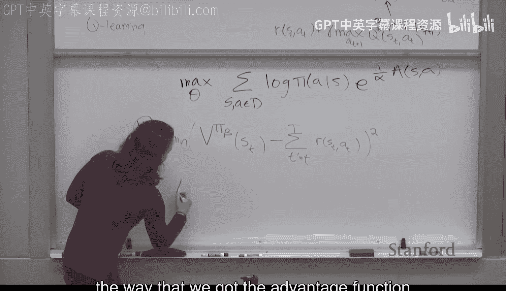

#### 优势函数估计

现在，优势实际上与某个策略相关联。它是采取状态 $s$ 下的行动 $a$ 然后遵循某个策略的优势。第一个问题是，我们试图为哪个策略估计优势？目前，我们可以尝试估计行为策略的优势。

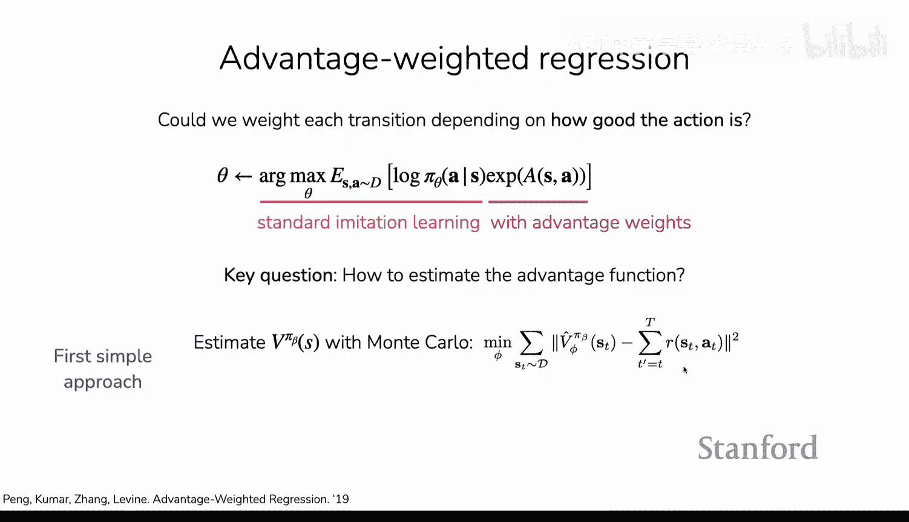

一个关键问题是如何以防止我们之前看到的过估计的方式来估计这个优势函数。

以下是估计优势函数的第一种方式：

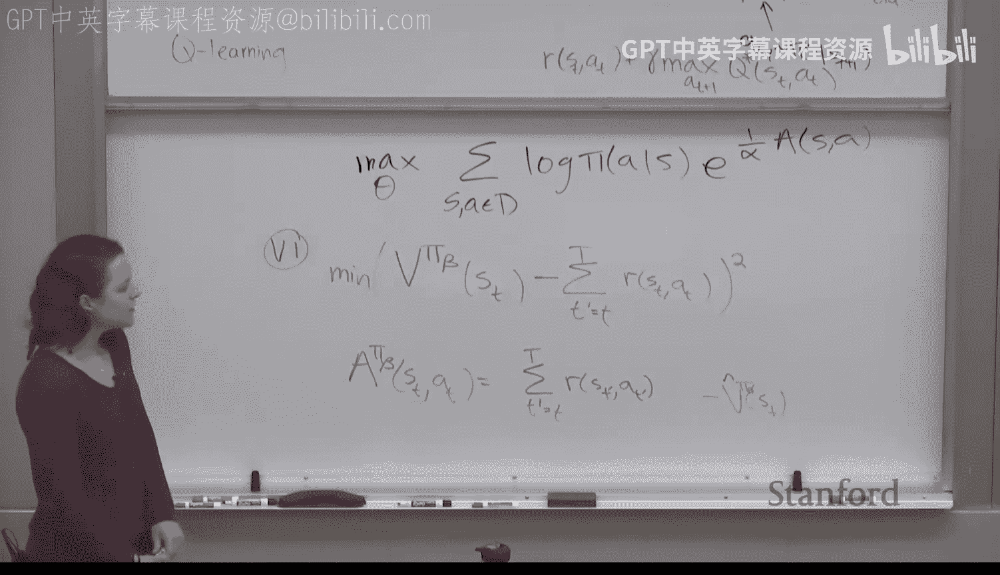

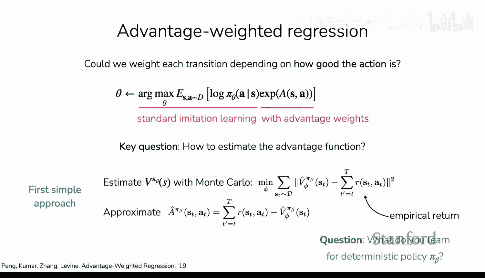

**版本1：使用蒙特卡洛回报**

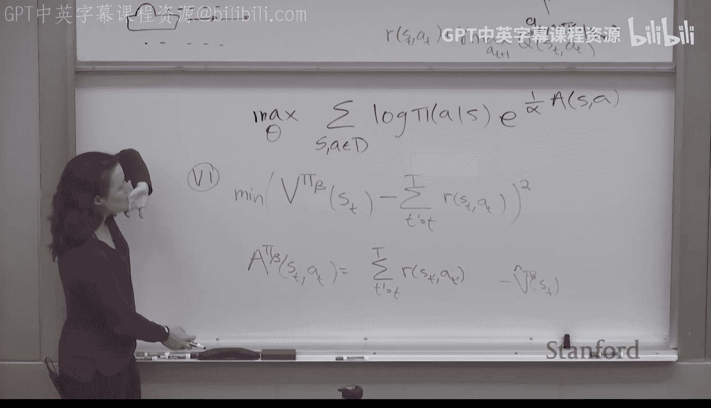

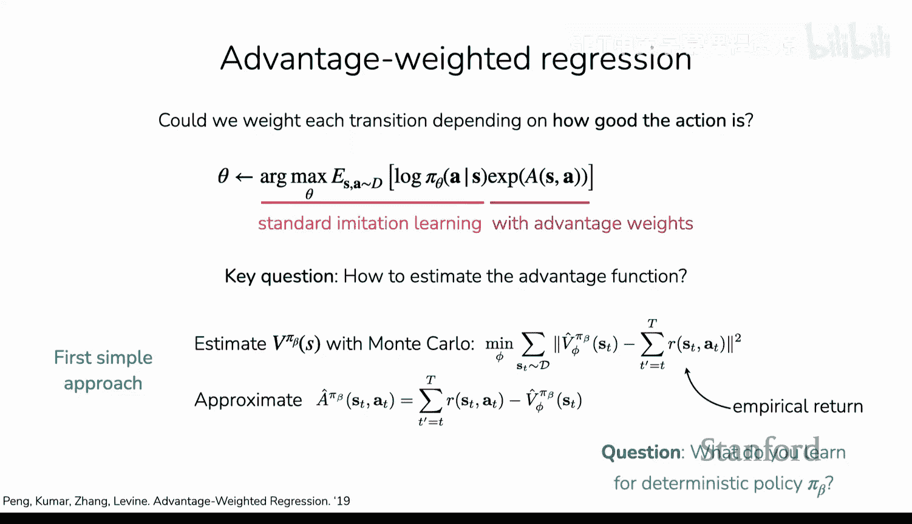

我们可以首先拟合一个价值函数。因为我们正在为行为策略拟合价值函数，数据来自我们试图评估价值函数的策略。如果我们想用蒙特卡洛回报拟合价值函数，那么我们的目标看起来像是我们试图回归到未来奖励之和。目标函数如下：
$$
\min_{\phi} \sum_{(s_t, a_t) \in \mathcal{D}} \left( V_{\phi}(s_t) - \sum_{t'=t}^{T} r_{t'} \right)^2
$$
这基本上是有监督学习，学习未来奖励。然后，一旦我们完成了这个，问题是我们如何从中获得优势？有几种方法可以做到这一点。我们第一次看到这个时，获得优势函数的方法是使用奖励加上下一时间步的价值函数减去当前时间步的价值函数。这些都是我们刚刚估计的价值函数。你可以使用这个。

一个替代方案是，你可以简单地使用未来奖励的经验和。这会更简单一些，不依赖于两个价值函数之间的良好时序差异。具体来说，我们可以首先通过尝试最小化我们的价值估计与奖励和之间的差异来估计价值函数，然后为了估计优势函数，我们可以取该轨迹的奖励和并减去价值函数。优势估计如下：
$$
\hat{A}(s_t, a_t) = \sum_{t'=t}^{T} r_{t'} - V_{\phi}(s_t)
$$
这种特定的优势估计对应于一个相当简单且相当流行的算法，称为优势加权回归。

#### 确定性数据集的考虑

为了让你思考一下，问题是，如果你在确定性数据集或底层策略是确定性的数据集上这样做，你实际上会学到什么？例如，假设汽车在某些车道上总是直行，你从未见过它左转或右转。如果你在这种数据上运行这个算法，以这种方式拟合你的优势，你会学到什么优势？

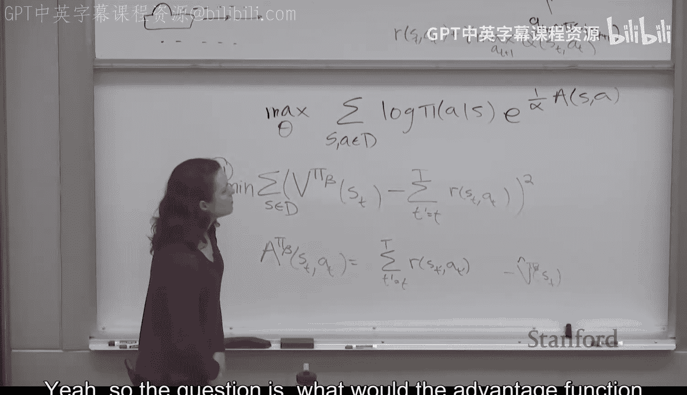

如果你总是采取相同的行动，那么奖励之和将与 $V$ 相同，因为你实际上没有看到行动中的任何可变性，这意味着你的优势估计将全部为零。然后，如果你将其代入这个方程，如果你的所有优势估计都为零，那么这个指数项将变为1，那么你实际上就回到了普通的模仿学习。这实际上很好，因为你得到了那个结果，因为这意味着对于这种策略，你实际上无法比行为策略做得更好，因为你看不到可以采取的不同行动的任何可变性，因此该算法在这种情况下退回到模仿学习。

#### 完整算法与总结

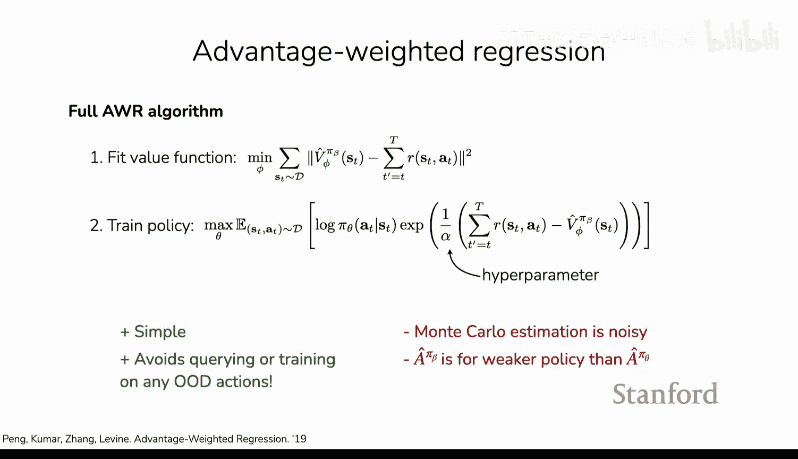

完整的算法是：我们首先使用蒙特卡洛回归拟合价值函数，然后我们训练一个策略，其中我们通过指数化的优势估计来加权采取行动的概率或似然目标，优势估计由奖励和减去价值函数给出，并且我们有一个超参数来控制温度或该分布的尖锐程度。

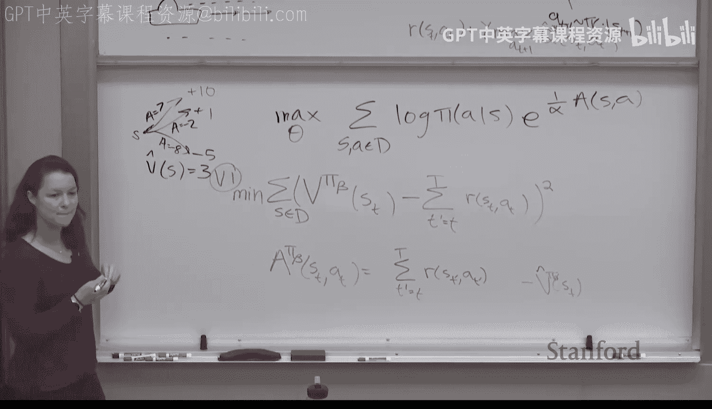

这种算法的一个优点是它非常简单，可能是你可以实现的最简单的东西，有可能比过滤模仿学习有所改进。它还避免了查询或训练任何分布外行动，这使其更加稳定。也就是说，蒙特卡洛估计可能有噪声，并且我们正在为行为策略而不是我们学习的策略学习优势估计，因此我们只能比数据集改进这么多。

### 方法二：隐式Q学习

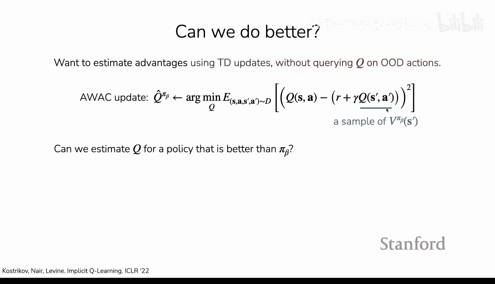

如果我们能够不使用蒙特卡洛，而是使用TD更新或自举更新，而不必查询分布外行动上的Q值，那将是非常好的。我们之前目标的问题是，我们在这里查询从我们学习的策略中采样的行动上的Q函数。

一个非常简单的事情是，我们可以不从我们学习的策略中采样 $a'$，而是直接从我们的数据集中采样 $a'$。这是一个非常简单的修改，这将确保我们看到的 $a'$ 实际上总是在数据中看到，并且我们将实际拥有对这个 $s', a'$ 的监督目标。

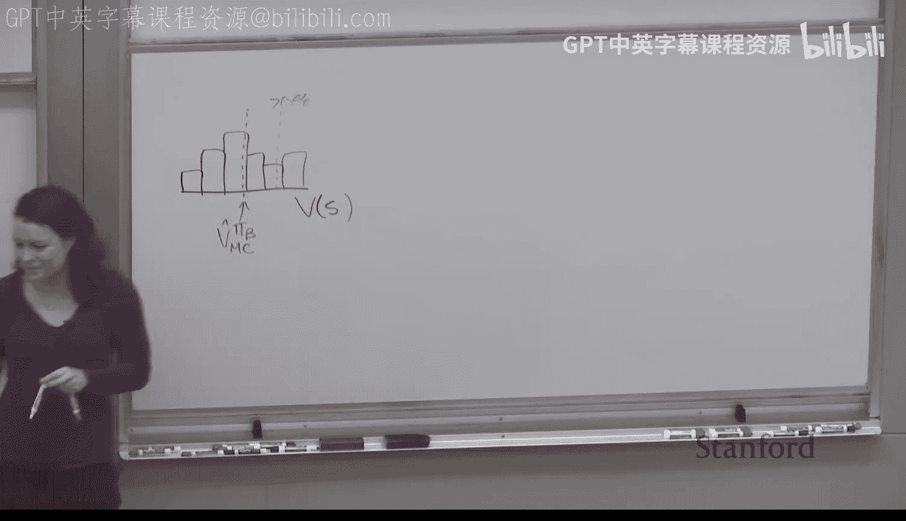

如果你以这种方式估计优势函数或估计Q函数，然后使用它来估计你的优势，你会得到一个称为优势加权演员-评论家的算法。请注意，这消除了原始优势加权回归算法的一个弱点，即我们能够使用自举，但我们仍然在为 $\pi_{\beta}$ 而不是我们学习的策略估计价值函数。这仍然是这种方法的一个缺点。

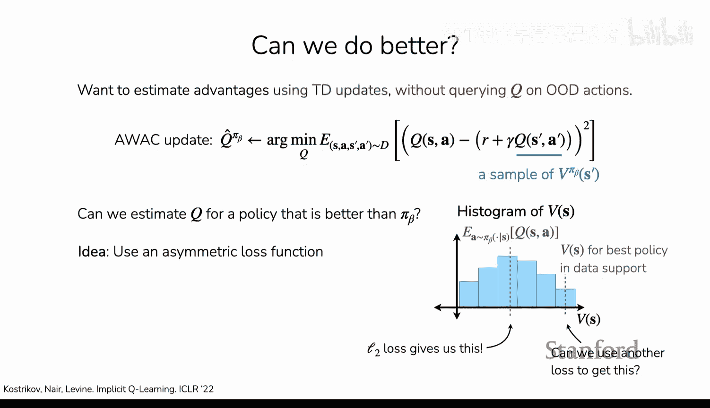

因此，从这里开始，最好考虑我们是否可以为比行为策略更好的策略估计Q值。思考这个问题的一种方式是，当我们试图最小化这个自举目标时，这个目标实际上是 $s'$ 的一个样本。我们估计的是结果的平均值，即预期未来奖励的平均值。但实际上，数据中表示的结果存在某种分布。

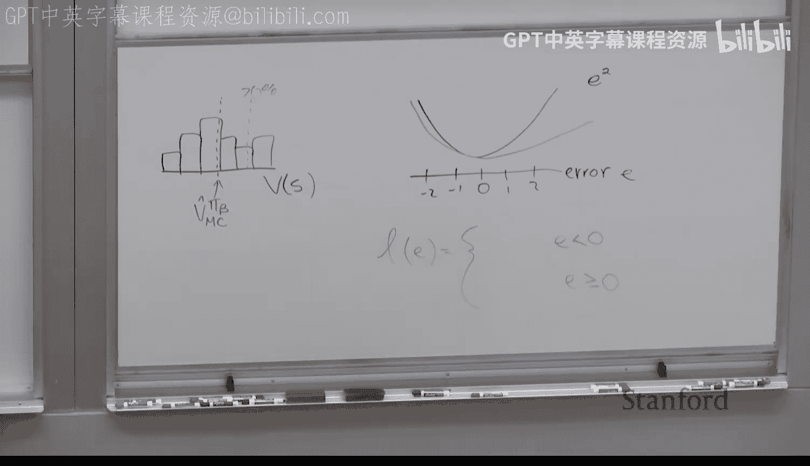

如果我们考虑那个分布，对于给定的状态，当你采取不同的行动时，你会看到不同的奖励和。因此，实际上存在某种底层分布。当我们进行蒙特卡洛回归时，如果这个分布有一个均值，那么这就是我们试图拟合的行为策略的蒙特卡洛估计的平均值。

如果我们想尝试学习一个比 $\pi_{\beta}$ 更好的策略的价值函数，我们可以考虑也许不是试图拟合我们看到的结果的均值，而是尝试拟合某个其他百分位数。例如，如果我们尝试拟合第70百分位数，那么我们实际上可能获得一个比我们行为策略更好的策略的价值函数。

我们如何做到这一点？也许我们可以考虑使用一个不同于L2损失的损失函数来获得一个更好的策略。一个想法是使用一个不对称的损失函数。这被称为期望回归。这是一个很酷的技巧，如果你考虑它，就像不是误差或某个任意随机变量 $x$，如果你定义这个 $\lambda$ 项的不同值，那么你会得到这些不对称的损失。如果 $\lambda$ 大于0.5，你会看到一个方向的不对称；如果小于0.5，你会看到另一个方向的不对称。

回到我们的算法，如果我们想拟合我们的价值函数，我们可以使用这个期望损失，并基本上拟合一个价值函数，该函数试图估计一个比行为策略更好的策略的价值函数。这将惩罚你的高估和低估，但如果你稍微高估一点，惩罚不会那么严重。

具体来说，对于这个算法，我们将使用期望损失来拟合价值函数，我们还将使用典型的均方误差损失来拟合一个Q函数，并且我们将实际使用价值函数作为目标。因此，我们将同时拟合一个价值函数和一个Q函数，并且只对拟合价值函数使用这个期望损失。一旦我们有了Q函数和价值函数，我们就可以将优势估计为 $Q - V$，并使用相同类型的AWR方法来获得一个策略，其中我们通过指数化的 $Q - V$ 来加权可能性。

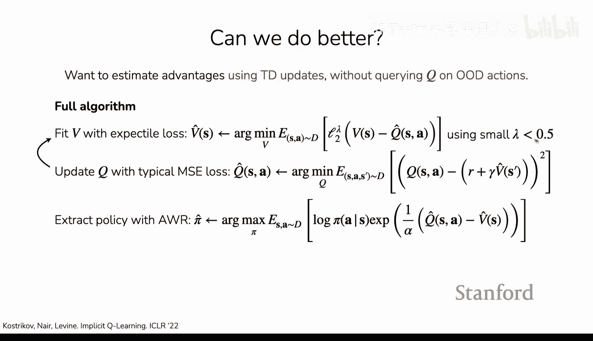

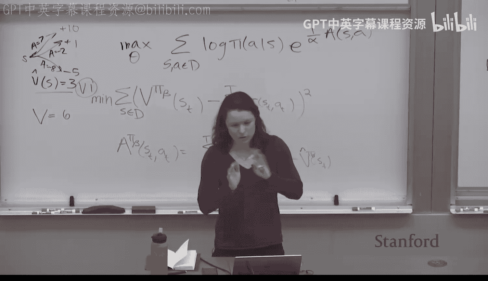

这个算法被称为隐式Q学习。这种算法的优点是，我们不需要查询分布外行动，策略仍然只在数据中的行动上进行训练，并且我们解耦了演员和评论家训练。因此，我们只进行这些评论家训练，在数据上拟合价值函数和Q函数，然后一旦完成并且已经收敛或进行了足够的训练，我们就训练我们的策略。

## 总结

在本节课中，我们一起学习了离线强化学习。我们首先回顾了在线强化学习方法，然后探讨了离线强化学习的动机和核心挑战——行为策略与学习策略之间的分布偏移。我们讨论了直接应用离策略算法会导致对分布外行动的Q值过估计问题。

接着，我们介绍了两种主要的离线强化学习方法：

1.  **优势加权回归**：一种简单的方法，通过蒙特卡洛回报拟合行为策略的价值函数，然后使用指数化的优势估计来加权模仿学习目标，从而在避免分布外行动的同时，利用奖励信息改进策略。
2.  **隐式Q学习**：一种更先进的方法，通过期望回归拟合一个优于行为策略的价值函数，并结合Q函数学习，能够进行更低方差的自举更新，从而实现更好的策略提升和轨迹“缝合”。

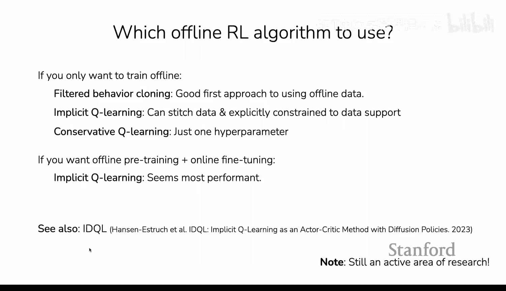

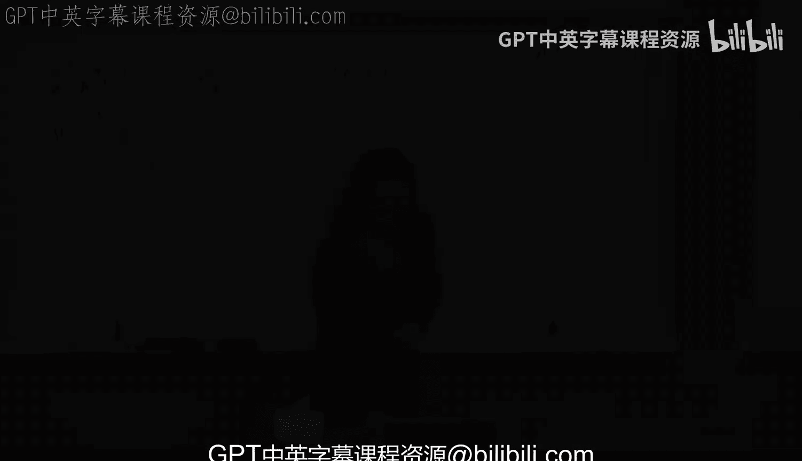

离线强化学习的核心思想是通过约束学习策略接近行为策略（例如，只对数据中的行动进行监督）来避免分布偏移问题，同时利用奖励信息来超越单纯的模仿学习。这些方法使得重用昂贵的离线数据成为可能，并为安全关键应用和从现有数据集中进行高效学习提供了强大的工具。