#  012：多任务强化学习

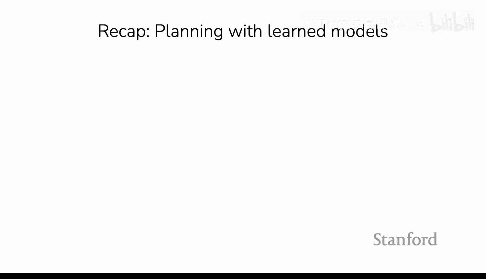

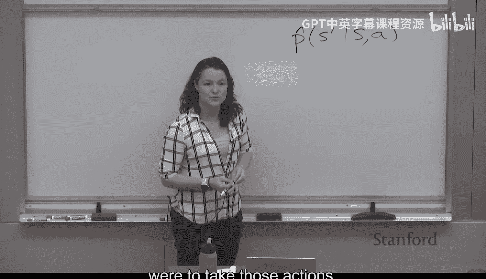

## 概述
在本节课中，我们将完成对基于模型的强化学习的讨论，具体介绍如何使用学习到的模型生成合成数据，以及何时适合使用基于模型的强化学习方法。随后，我们将探讨多任务模仿学习与强化学习，包括将不同任务视为目标达成任务的方法，以及一种名为“事后重标记”的技术。

---

## 基于模型的强化学习：使用合成数据

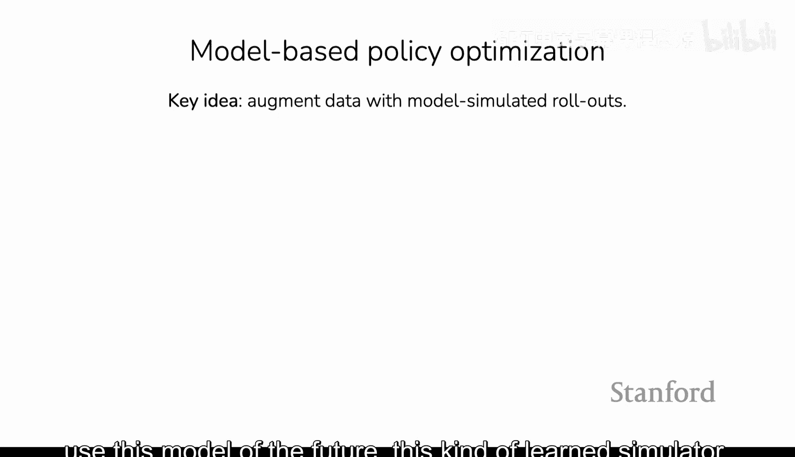

上一节我们介绍了基于模型的强化学习，本节中我们来看看如何使用学习到的模型生成合成数据来训练策略。

我们讨论了一种与学习策略截然不同的行为生成方法。我们并非显式地学习从状态到动作的映射，而是针对给定状态，实时思考应采取何种行动。这种方法被称为“规划”。我们讨论了如何通过基于梯度或基于采样的优化方法，在未来有限的时间范围内进行这种规划。同时，我们也强调了使用收集到的数据更新模型的重要性，因为这能让你在希望使用模型的领域内学习到更好的模型。此外，周期性地重新规划有助于纠正模型错误，并适应环境的变化。

这种规划方法的优点是简单，并且如果模型足够通用，可以轻松地适配不同的目标或奖励函数，甚至在测试时也能做到。其缺点在于测试时（推理时）计算密集，且仅适用于短时间范围的问题，或那些可以通过较短时间范围规划就能处理的、奖励函数设计良好的问题。

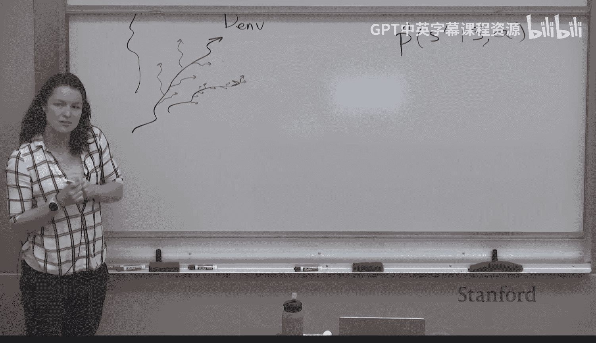

现在，我们来看看使用这类学习模型的第二种方式：学习一个策略。核心思想是利用这个对未来进行预测的模型（即学习到的模拟器）来增强我们已收集的任何数据。

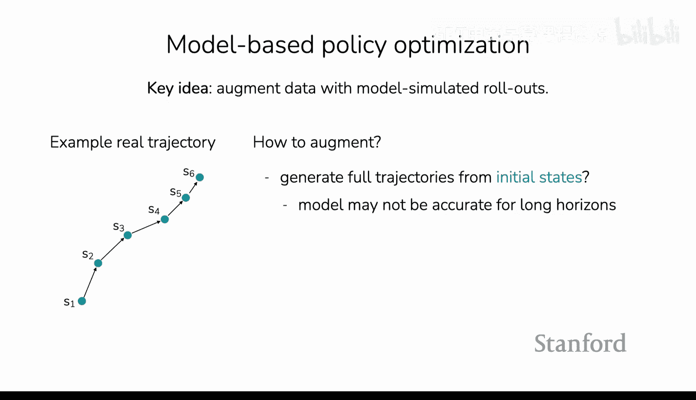

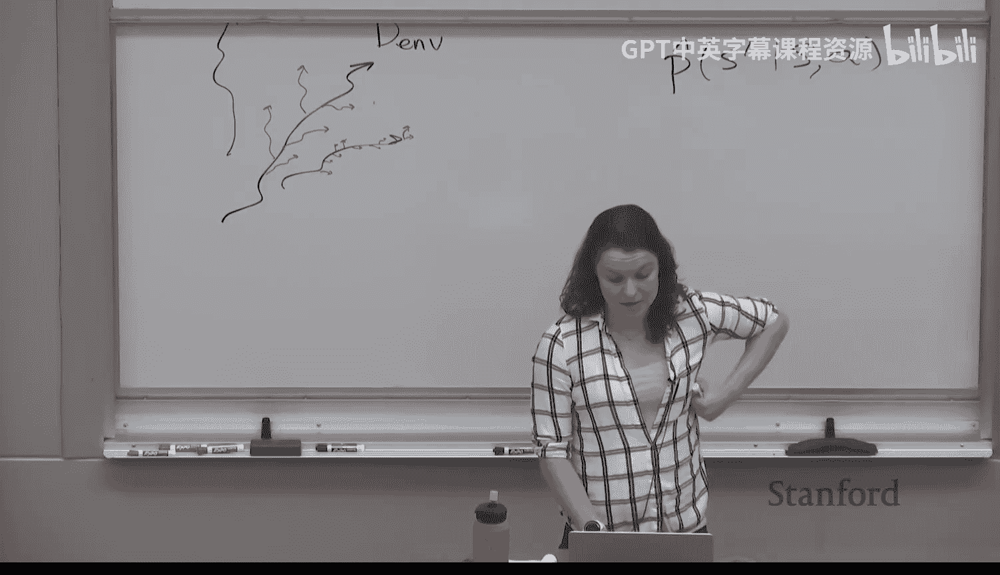

假设我们在真实世界或真实环境中收集了一些数据，即一些轨迹。这些数据也可能是离线提供给我们的。我们拥有的真实环境数据可能如下图所示。

以下是如何使用学习到的模型来增强这个数据集的一些思路：

*   可以从轨迹的最后一个状态开始，利用模型生成更多后续状态。
*   可以从轨迹中的任意状态（不一定是终点）开始生成后续轨迹。

通过这种方式，我们可以生成类似下图的数据，其中红色部分代表使用模型生成的合成数据或“想象”数据，黑色部分代表来自环境的真实数据。

然而，我们之前讨论过，模型在生成长轨迹时并不可靠。因此，一个可行的做法是保持这些生成的轨迹非常短。与其生成与原始轨迹几乎等长的轨迹，不如生成许多短的“片段”，这些片段围绕着你数据中的轨迹提供额外的覆盖范围。这在实践中通常效果更好，因为它能缓解模型不准确的问题。

具体来说，假设我们有一条真实的示例轨迹。生成数据的方法可能包括：

1.  **从初始状态生成完整轨迹**：就像在真实环境中一样。缺点是模型对于长时域可能不准确，如果只从初始状态分布开始生成，可能无法很好地覆盖后续状态。
2.  **从初始状态生成部分轨迹**：这不会给你提供对后期状态的良好覆盖。
3.  **从真实数据集中的所有状态生成部分轨迹**：这种方法结合了前两者的优点，既能获得良好的状态覆盖，又能利用短轨迹。

完整的算法流程如下：

1.  **收集真实数据**：记为 \( D_N \)。
2.  **使用真实数据更新模型**：使模型尽可能准确。
3.  **生成合成数据**：
    *   从真实数据 \( D_N \) 中采样一个状态 \( s \)。
    *   从状态 \( s \) 开始，在你学习到的模型内部（而非真实环境），使用你的策略或任何探索策略，生成一条短轨迹。
    *   将这些生成的数据存入另一个数据集，记为 \( D_{gen} \)。
4.  **更新策略**：使用真实数据 \( D_N \) 和生成数据 \( D_{gen} \) 共同更新策略参数 \( \theta \)。
5.  **重复此过程**。

关于此方法的一些要点：

*   **收敛速度**：生成短轨迹并不会显著减慢收敛到目标的速度。这些数据是对现有数据的补充。当从接近目标的状态开始生成数据时，你将更容易获得奖励并进行更新。即使数据未直接达到目标，强化学习算法也能利用这些信息。
*   **奖励获取**：如果你知道奖励函数的形式，或者已经学习了一个奖励函数（例如在逆强化学习中），你可以直接使用它。否则，你需要训练模型（或一个单独的模型）通过监督学习来预测奖励。
*   **计算开销**：与不使用模型的方法相比，这种方法在训练时计算更密集，因为你需要在模型中展开轨迹。这是一种用计算换取环境数据收集的权衡。在物理设备上收集在线数据可能不安全或非常昂贵，因此这种权衡通常是值得的。然而，与规划不同，这种方法在测试时并不增加计算开销，因为你最终运行的是训练好的策略。
*   **算法兼容性**：此方法与多种强化学习算法兼容。即使是需要从当前策略采样的同策略算法，只要用于在模型中收集合成数据的策略与待更新的策略是同一个，也可以使用。
*   **数据使用**：在最后一步更新策略时，可以同时使用环境数据和模型数据，也可以仅使用模型数据。
*   **稳定性**：算法的稳定性取决于模型的准确性。生成多少合成数据以及如何平衡这些数据是额外的超参数。如果模型训练不佳，算法性能可能会下降。

---

## 何时使用基于模型的强化学习

接下来，我们讨论一下何时适合使用基于模型的强化学习及其合成数据生成方法。

总的来说，基于模型的强化学习既有巨大的潜在优势，也有明显的缺点。

**主要优势：**

1.  **数据效率高**：如果能学习到一个相当好的模型，预测未来的能力将非常有用。通过使用生成的数据，可以大大减少对真实数据的需求。
2.  **可进行测试时规划**：模型允许在测试时进行规划。
3.  **无需奖励标签**：模型可以在没有奖励标签的数据上进行训练。如果你有大量无奖励数据和少量有奖励数据，模型可以利用比无模型强化学习方法更多的数据。
4.  **任务无关性与可迁移性**：模型在某种程度上是任务无关的。如果它在足够广泛的数据分布上训练，有时可以跨不同任务或不同奖励函数进行迁移。这对于学习多个任务非常有用。

**主要缺点：**

1.  **优化目标不匹配**：模型优化的是状态预测的准确性（例如，像素级细节），但这并不总是下游策略性能所关心的。存在优化目标的不匹配。
2.  **模型学习可能更难**：有时学习一个好的模型比学习一个好的策略更困难。在这种情况下，学习模型相当于提出了一个比下游任务本身更困难的问题。
3.  **引入额外复杂性与超参数**：需要训练模型，这引入了更多的超参数（如模型架构、学习率、训练轮数、正则化等）和计算开销。此外，生成长度和合成数据量也是超参数。

因此，是否尝试学习这种预测模型很大程度上取决于具体领域和学习此类模型的难度。

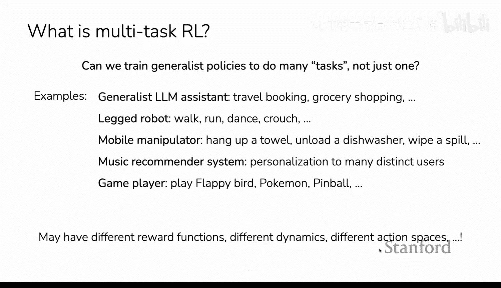

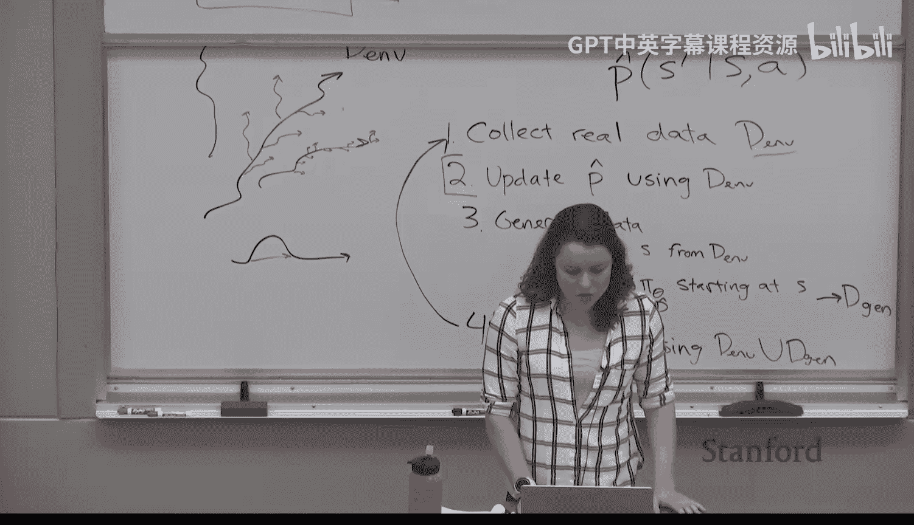

**关于模型在机器人领域的成功应用：**
*   在处理像图像这样的高维观测时，基于模型的方法 arguably 不太成功。
*   在状态空间更紧凑的领域（如关节位置、物体位置），例如足式机器人或已知物体位置的灵巧手操作，基于模型的强化学习非常成功。对于这些问题，无模型强化学习或模仿学习可能极具挑战性。
*   随着视频生成模型的进步，未来基于图像观测的模型方法也可能变得非常成功。

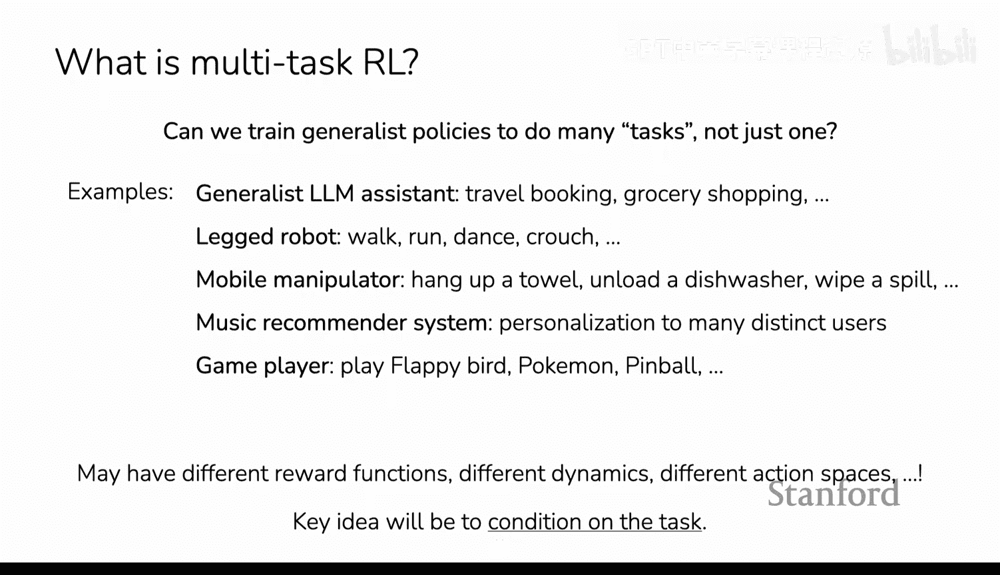

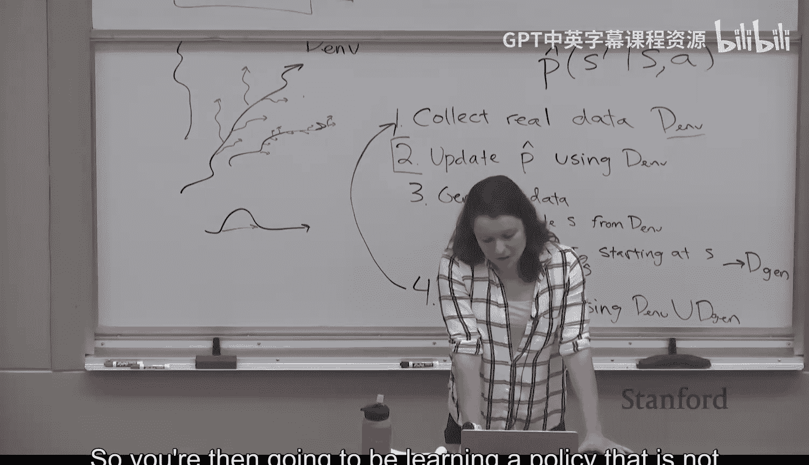

**其他类型的模型：**
除了预测未来状态的模型，还可以学习其他类型的模型：
*   **逆模型**：给定当前状态 \( s_t \) 和下一状态 \( s_{t+1} \)，预测导致该状态转移的动作 \( a_t \)。
*   **多步逆模型**：预测导致从当前状态到达未来某个状态 \( s_{t+n} \) 的动作序列。
*   **无动作的未来预测**：预测未来可能发生的事件，而不考虑采取的动作。
*   **状态插值模型**：学习状态 \( s_t \)、动作 \( a_t \) 和下一状态 \( s_{t+1} \) 之间的转移模型。

这些模型各有用途，可以在没有奖励数据的情况下学习，仅用于理解环境。

---

## 多任务强化学习简介

现在，我们开始讨论多任务学习及其相关技术，超越简单朴素的方法。

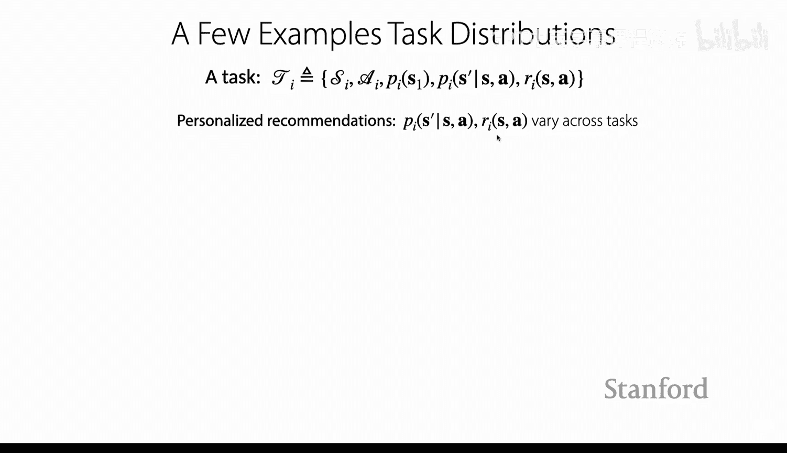

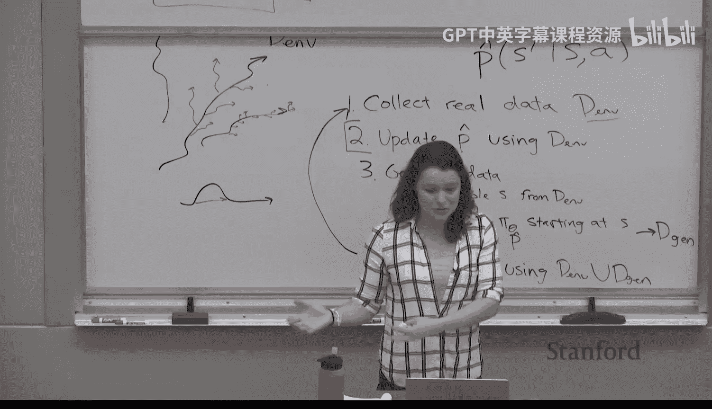

**什么是多任务强化学习？**
核心思想是学习一个通用策略，该策略不仅能完成单一任务（例如倒水），还能完成许多不同的任务。例如：
*   一个通用的语言助手，可以为我们预订旅行、在线购买杂货。
*   一个足式机器人，可以行走、奔跑、跳舞、蹲下。
*   一个移动机器人，可以挂毛巾、清空洗碗机、擦拭溢出物。
*   一个音乐推荐系统，可以为不同用户个性化推荐。
*   一个能玩多种不同游戏（如宝可梦、弹球、笨鸟先飞）的系统。

在这些场景中，每个任务都可以被视为一个独立的强化学习问题，它们可能拥有不同的奖励函数、动态特性（如不同游戏的物理规则），甚至不同的动作空间。

我们将看到，关键思想在于，在许多情况下，你可以继续进行常规的强化学习，但需要以当前要学习的任务为条件。这样，你学习的策略将不仅依赖于状态，还依赖于你希望它为该状态执行的任务。

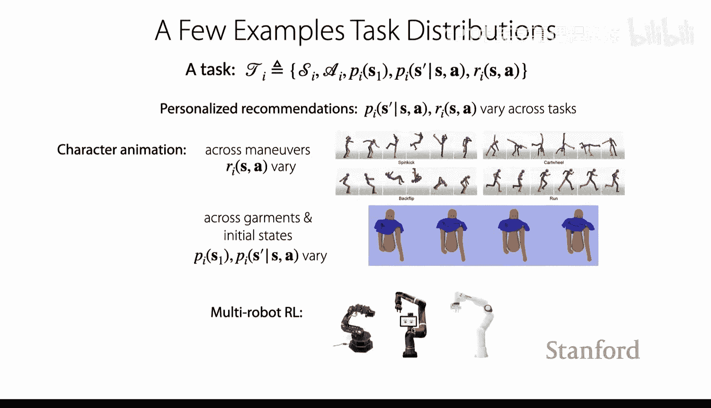

**为什么关心多任务强化学习？**
回顾本课程讨论过的许多主题（模仿学习、同策略/异策略强化学习、离线强化学习、基于模型的强化学习、奖励函数），一个反复出现的重要话题是**数据效率**。如果我们最终目标是训练一个能同时执行多项任务的系统，那么通过跨任务和跨场景训练策略，实际上可以分摊学习任何单一任务的复杂性。因此，从数据效率的角度看，当同时训练所有任务时，训练任一单个任务所需的数据效率可能会更高，因为任务之间通常存在某种共享结构。

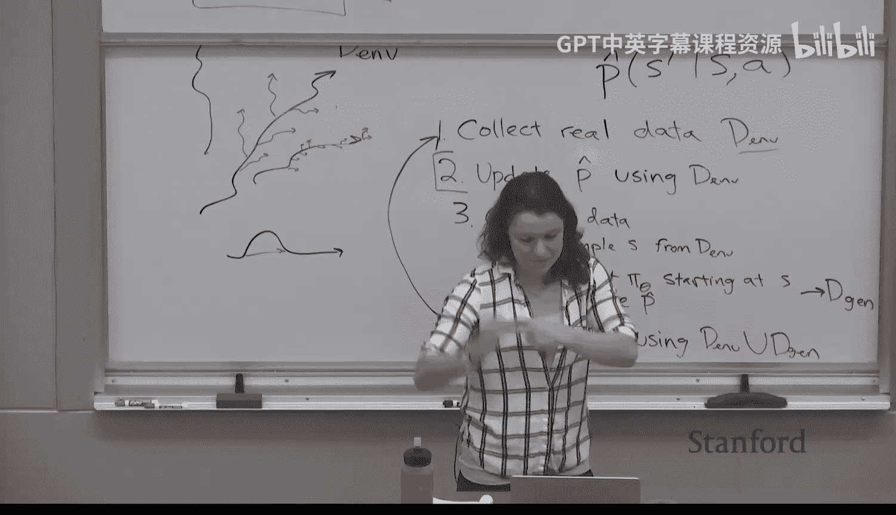

此外，还有一个更深层次的动机：当我们尝试构建这些通用系统，而非单一任务系统时，我们常常发现通用系统最终比仅针对一个任务训练的系统更可靠、性能更好。这已成为近年来人工智能领域一个经验性的重要发现。

**定义任务**
我们需要思考“任务”具体指什么。一种方式是将不同任务视为不同的强化学习问题，即不同的马尔可夫决策过程。每个任务 \( i \) 都有自己的状态空间 \( \mathcal{S}_i \)、动作空间 \( \mathcal{A}_i \)、初始状态分布 \( p_i(s_0) \)、转移模型 \( p_i(s'|s, a) \) 和奖励函数 \( r_i(s, a) \)。

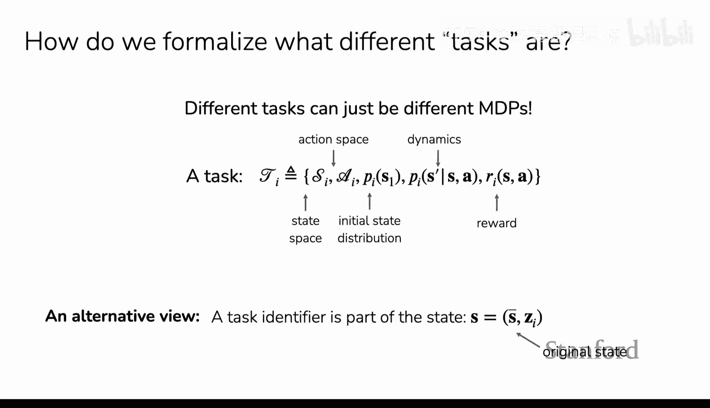

值得注意的是，这种将任务定义为 MDP 的方式，可能与“任务”一词的语义概念有所不同。例如，在草地上向前走与在平坦地面上向前走，在这个框架下可能是两个不同的任务，尽管它们都属于“向前走”这个语义任务。

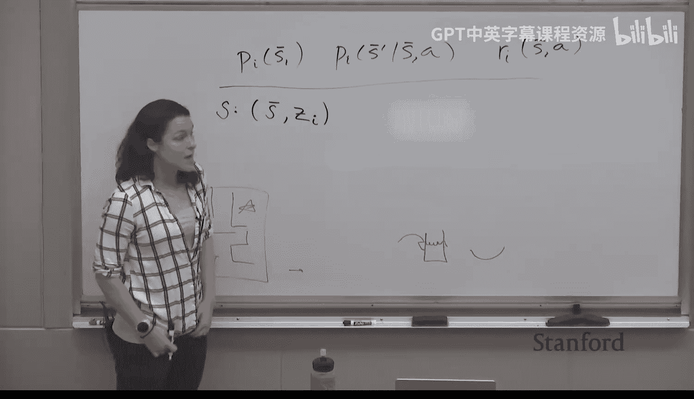

**多任务问题示例：**
1.  **个性化推荐**：不同任务是不同的用户。不同用户可能有不同的奖励函数（音乐偏好）和动态特性（听歌频率）。
2.  **角色动画**：不同任务是不同的动作（后空翻、奔跑、侧手翻）。奖励函数随任务变化，但物理模拟器的动态特性保持不变。
3.  **穿着不同服装的角色动画**：不同任务是穿着不同服装（长袖衫、短袖衫、裙子）。动态特性（服装物理）和初始状态分布（穿着不同服装的起始状态）会变化。
4.  **控制不同机器人手臂**：不同任务是控制具有不同自由度（4、6、7）的机械臂抓取物体。状态空间、动作空间（维度不同）和动态特性都会变化。

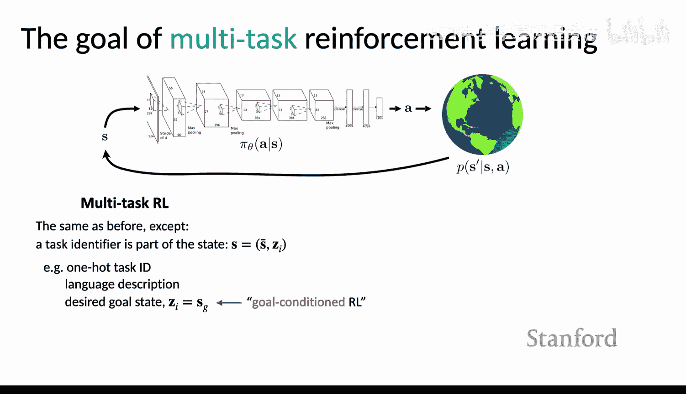

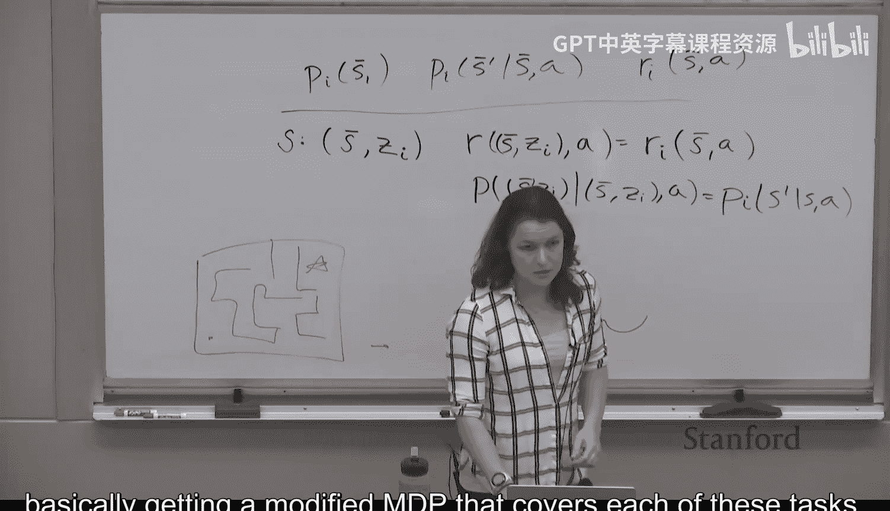

**任务标识符**
我们需要一种方法来区分不同任务，以便告知策略在给定时刻应该执行哪个任务。这可以通过任务标识符 \( z_i \) 来实现：
*   **分配索引**：例如，任务0、任务1、任务2。如果没有更好的方法，通常会采用这种。
*   **语言描述**：用自然语言描述任务。
*   **视频演示**：展示任务完成过程的视频。
*   **目标状态**：在目标条件强化学习中，目标状态本身就是任务标识符。

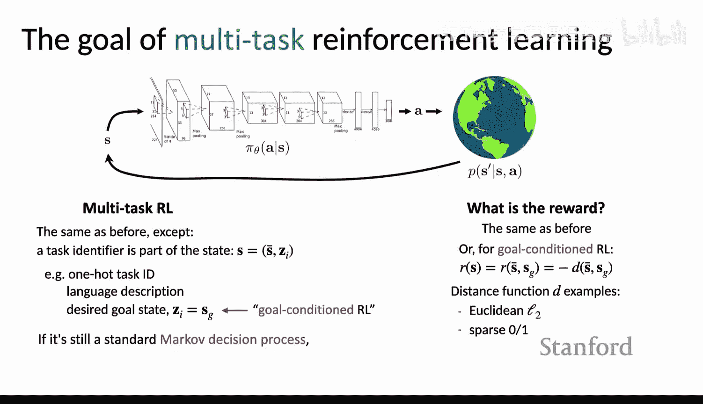

**将多任务问题视为单一 MDP**
一旦有了任务标识符，多任务强化学习问题可以重新表述为：将任务标识符作为状态的一部分。也就是说，我们构造一个单一的、聚合的 MDP，其状态是原始状态 \( \bar{s} \) 和任务标识符 \( z_i \) 的组合。这个聚合 MDP 的奖励函数和动态特性会根据任务标识符调用相应任务的函数。

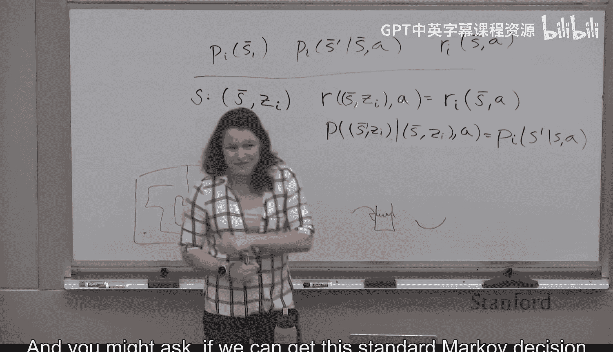

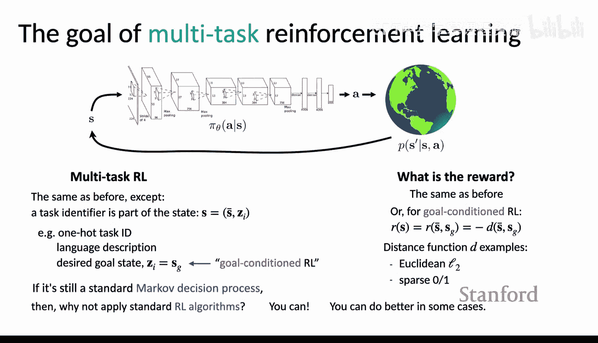

对于目标条件强化学习这种特殊情况，任务标识符通常是期望达到的目标状态 \( g \)，奖励函数通常是当前状态与目标状态之间的某种负距离（如欧几里得距离、稀疏奖励等）。

通过这种方式，我们得到了一个标准的 MDP，其状态空间包含了任务标识符。那么，为什么不直接对此应用标准的强化学习算法呢？答案是：可以，而且在许多情况下，这是一种很好的方法。然而，在某些情况下，通过利用不同任务之间的已知结构，可以做得更好。目标条件强化学习就是这样一个案例，你知道这个 MDP 由你试图完成的不同任务组成。在接下来的部分，我们将讨论一种利用这一事实来显著提升性能的特定方法。

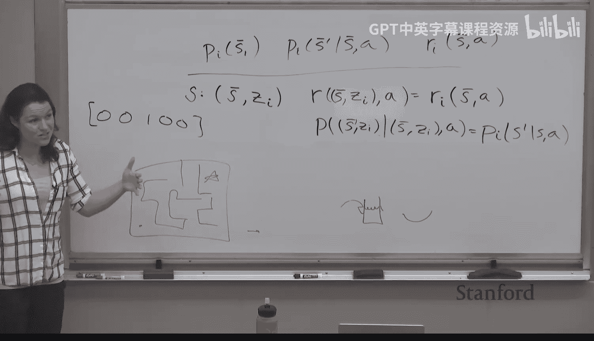

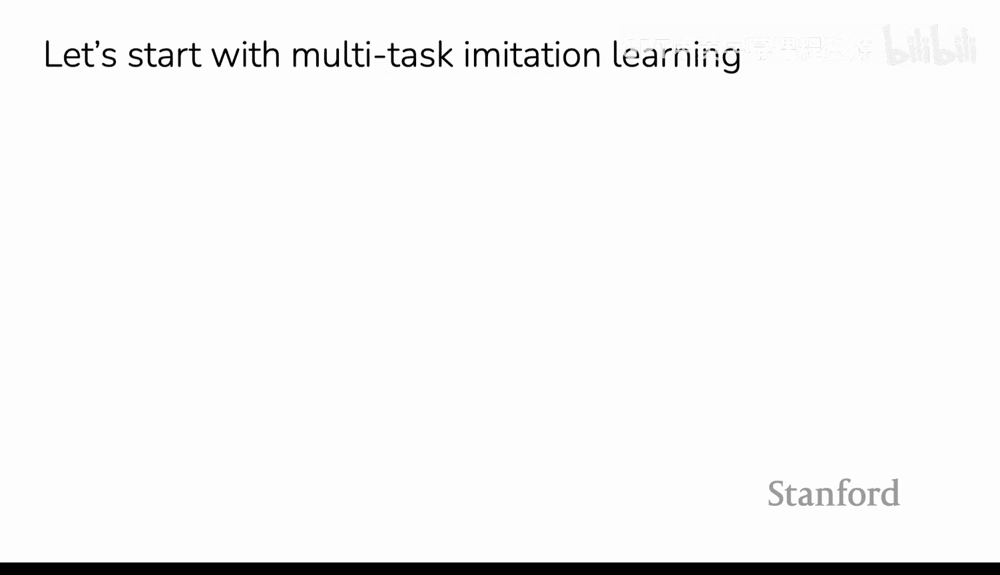

---

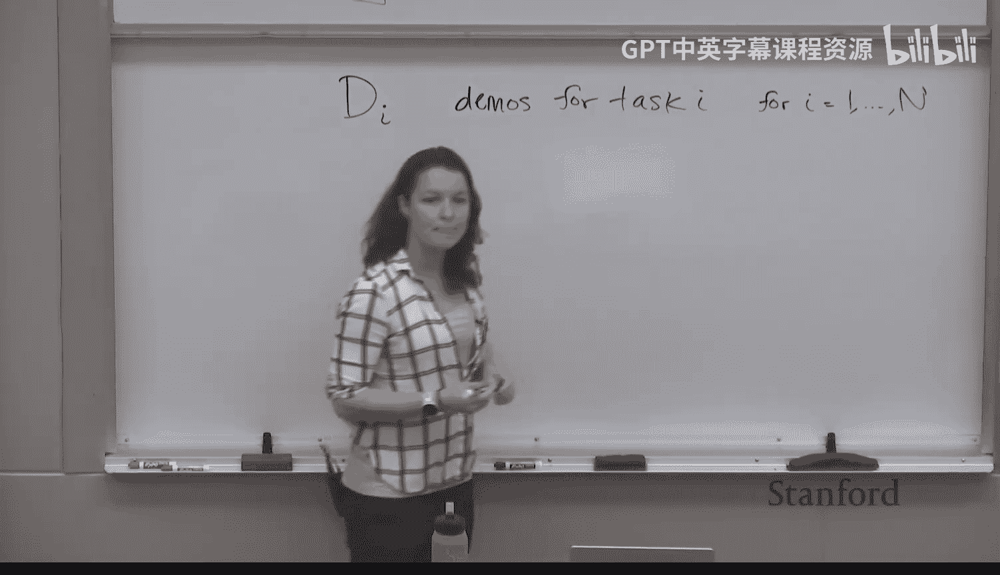

## 多任务模仿学习

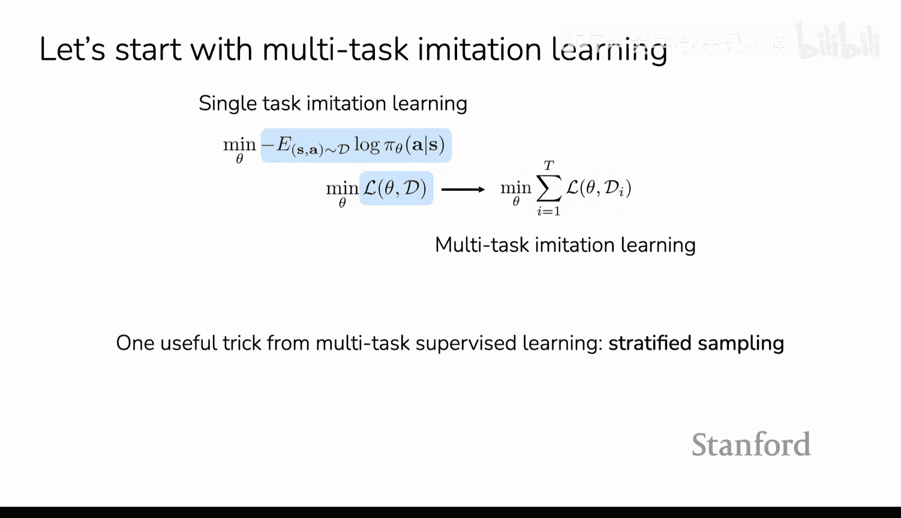

在多任务模仿学习设置中，如果我们有相对较少数量的任务 \( i \)，可以认为我们拥有每个任务的一组演示轨迹 \( \mathcal{D}_i \)，其中包含专家演示。

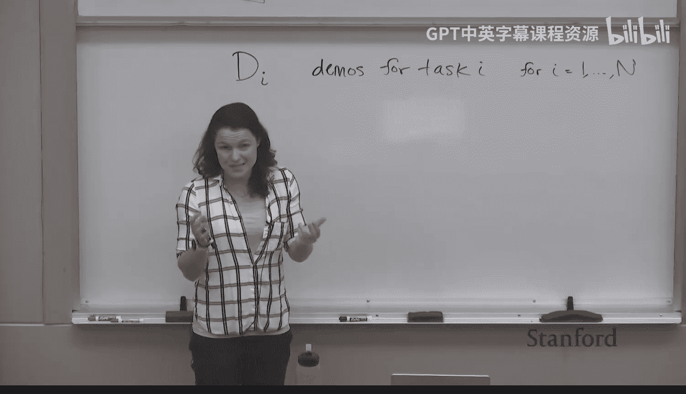

回顾最初的模仿学习，我们的目标是最小化给定状态下动作的负对数似然。如果我们将其写为关于策略参数的最小化监督损失函数，那么当转向多任务设置时，我们可以简单地尝试最小化单一策略参数集在所有任务上的平均损失函数。

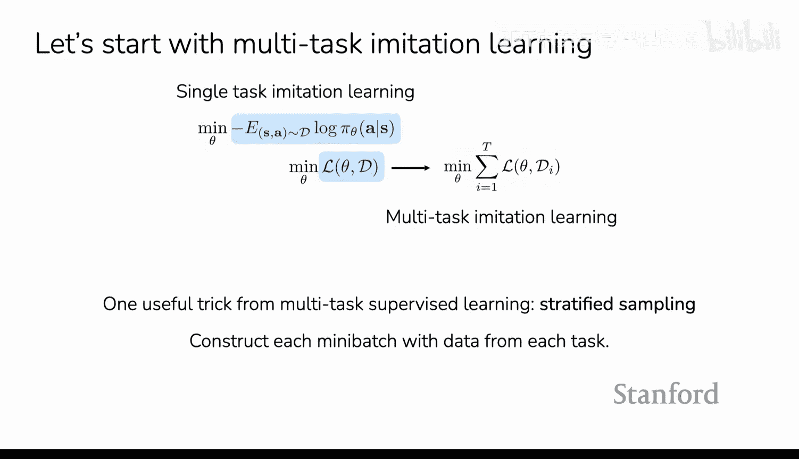

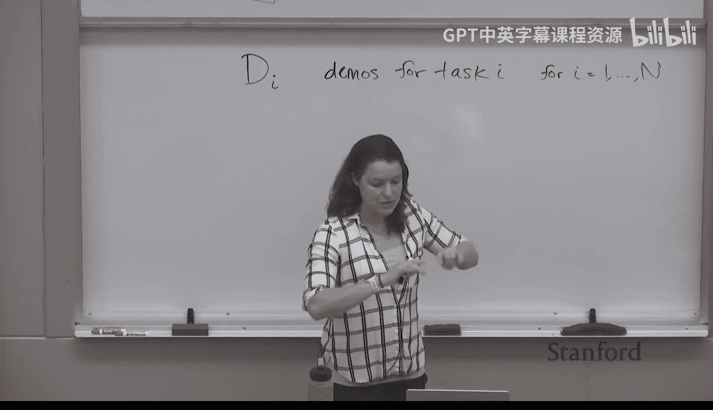

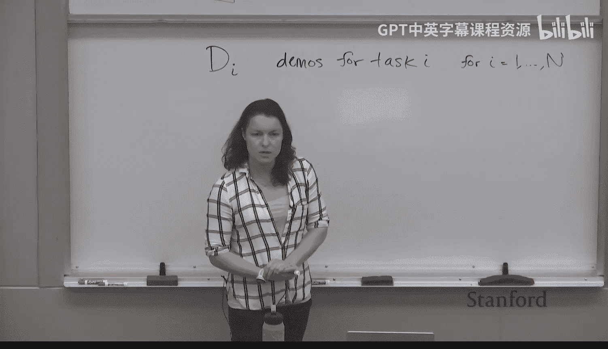

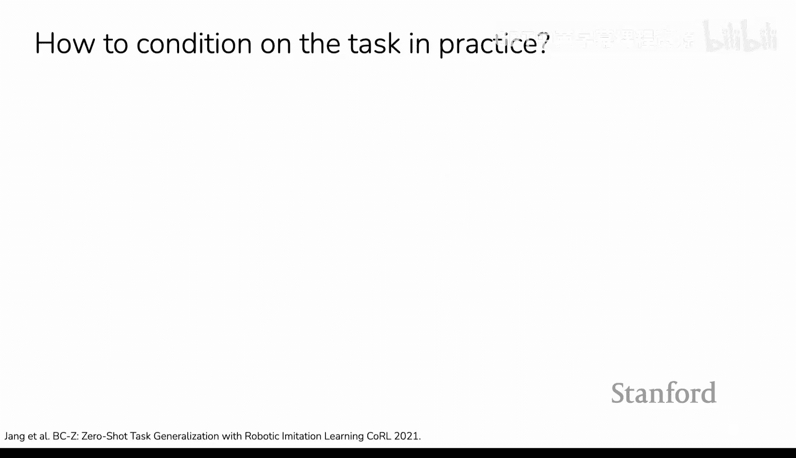

这就是多任务模仿学习，非常简单。

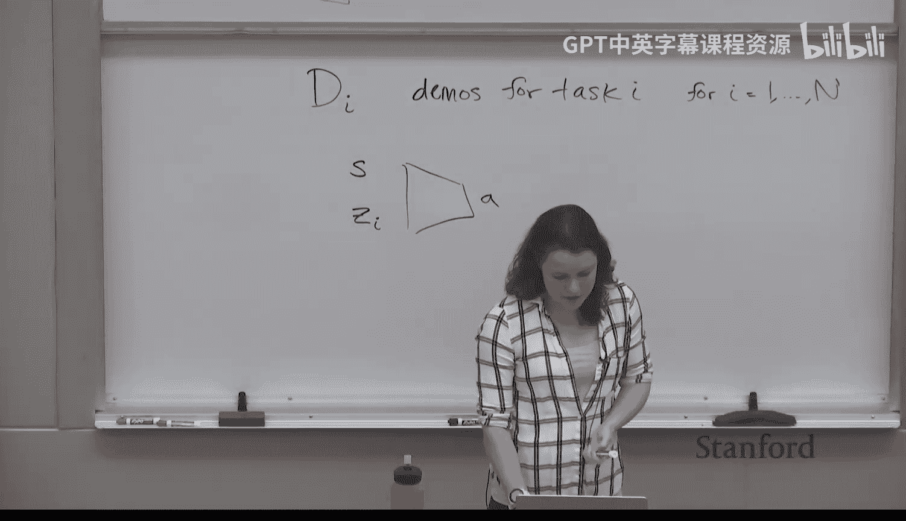

**一个实用技巧：分层小批量采样**
如果任务差异很大（例如，一个任务要求前进，另一个要求后退，第三个要求躺下），那么如果一个小批量主要包含前进数据，而下一个小批量主要包含躺下数据，从一次梯度更新到下一次，你可能会遇到很大的方差。虽然策略应该能够利用任务标识符来区分它们，但有时网络要做到这一点可能有些棘手。

一个非常有用的技巧是：在采样小批量时，进行分层采样，确保每个小批量数据都包含来自每个任务的数据。如果你试图优化任务上的均匀分布，那么你的小批量中，每个任务的数据应各占 \( 1/n \)。这将提供方差更低的梯度，在实践中非常有用。

另一个未在幻灯片上提及但同样有用的技巧是：确保不同任务间的状态和动作尺度相似。因此，按任务进行归一化也对学习过程很有帮助。

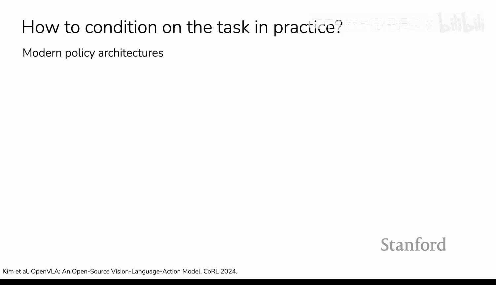

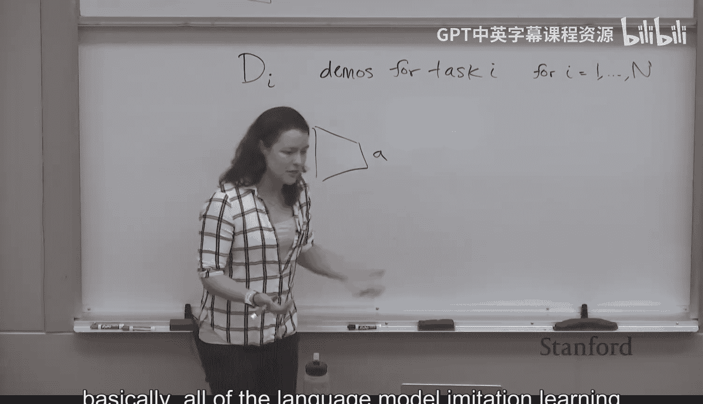

**策略架构设计**
训练多任务策略时，策略需要以某个状态和某个任务描述符作为输入，然后输出一个动作。你可能会遇到任务描述符是语言字符串或独热编码向量，而状态是图像的情况。这本质上是一个多模态问题，输入数据具有非常不同的形态和维度。

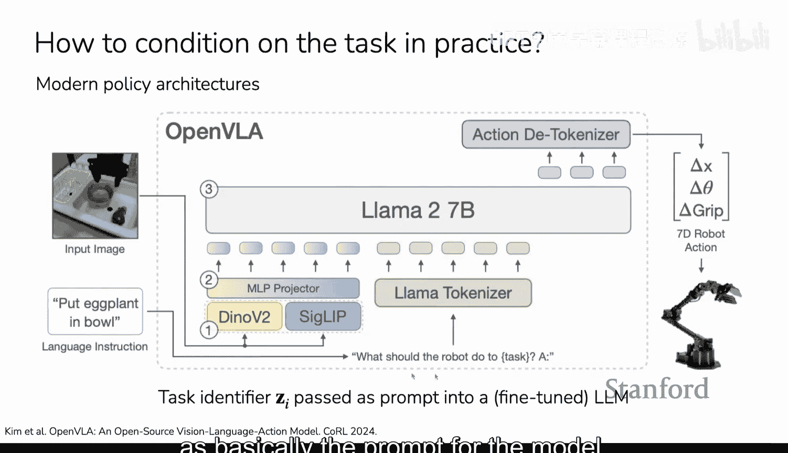

因此，在实践中，如何设计能够接受这种多模态数据输入的架构是一个问题。

**示例架构（较早期）：**
一篇论文中展示了一个用于简单机器人操作任务的多任务模仿学习系统。其架构处理当前状态（图像），并使用两种任务描述符：语言字符串（如“把瓶子放进陶瓷碗里”）和任务演示视频（如一个人放置瓶子的视频）。对于语言，使用语言编码器（如Transformer）；对于视频，使用不同的视频编码器。然后将这些嵌入乘到处理状态的主干网络的不同层中。损失函数对应于行为克隆损失，它要么从视频编码器采样任务描述符，要么从语言编码器采样，整个模型（包括这些编码器）都使用行为克隆损失进行训练。

**现代架构：**
*   **语言模型**：如果使用像语言模型这样的架构，任务描述符很自然地就是一个语言字符串，可以将其视为提示词。因此，多任务模仿学习在某种程度上可以看作是所有带有不同提示词的语言模型模仿学习或监督微调。
*   **机器人策略**：在现代机器人策略架构中，通常也使用Transformer。例如，使用预训练的图像编码器将图像投影到语言模型的输入空间，同时将任务描述符（如“机器人应该做什么来把茄子放进碗里”）作为标记输入语言模型，然后输出动作。整个模型（包括图像编码器和文本编码器）一起训练。在这里，任务标识符 \( z_i \) 基本上就是模型的提示词。

**多任务模仿学习策略示例：**
视频展示了机器人执行多个任务，例如“铺平毛巾”和“挂起毛巾”。任务标识符显示在视频左上角。机器人能够根据语言指令切换任务。另一个例子展示了机器人执行超过10个不同的语言指令任务，如“把盘子放进抽屉”、“关闭微波炉”、“底座向后行驶”、“底座左转”等。有趣的是，任务可以具有不同的抽象层次，从低层次的“向前行驶”或“右夹爪放低”，到高层次的“扔掉抹布”。

**关于单一策略与多个策略的讨论：**
*   **单一策略（带提示输入）**：可以共享权重，利用所有任务的数据，通常数据效率更高，内存占用更少，切换任务更快。
*   **多个策略（每个任务一个）**：权重仅在该任务数据上训练，数据集更小，通常性能更差，且需要更多内存来存储所有权重，切换任务可能更慢。但有时，将所有任务拟合到一个模型中会存在优化挑战，因此在某些情况下，为不同任务训练不同策略可能有用。

**关于分层与长时域任务：**
对于更高层次或更长时间范围的任务（如“清洁厨房”），单一扁平策略可能无法胜任。分层方法非常有用，我们将在后续关于分层强化学习的课程中讨论。但即使没有分层，单一策略也能为某些较高层次的任务执行合理的动作序列。

---

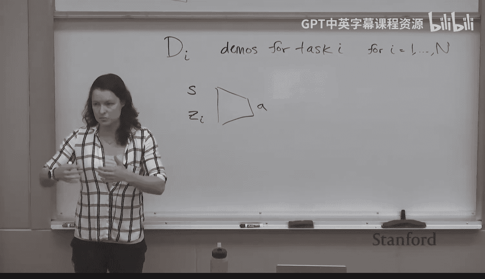

## 多任务强化学习

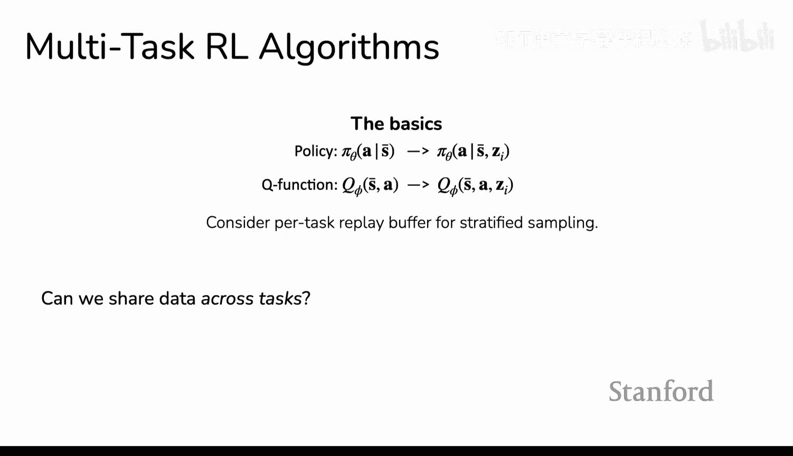

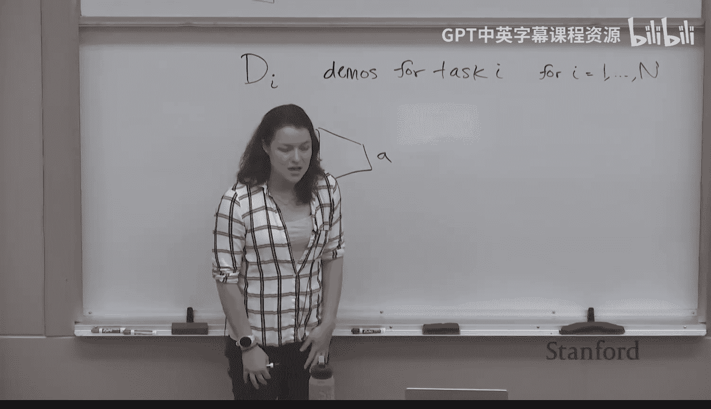

多任务强化学习的故事与模仿学习非常相似。我们可以将任务描述符作为输入传递给策略、Q函数或价值函数等模型。

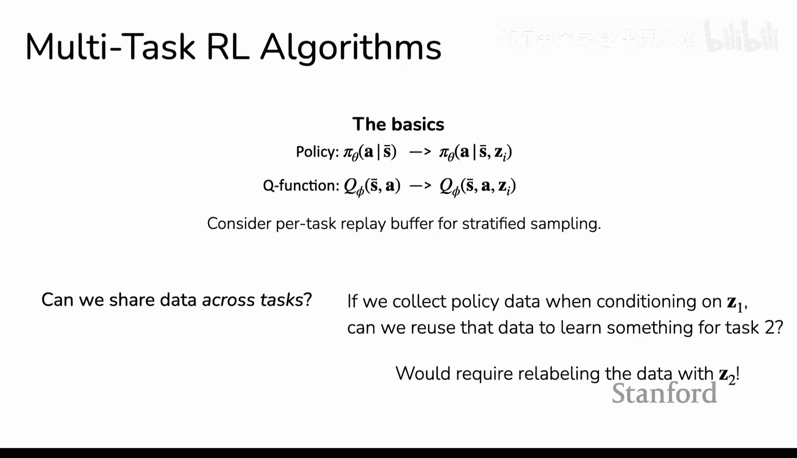

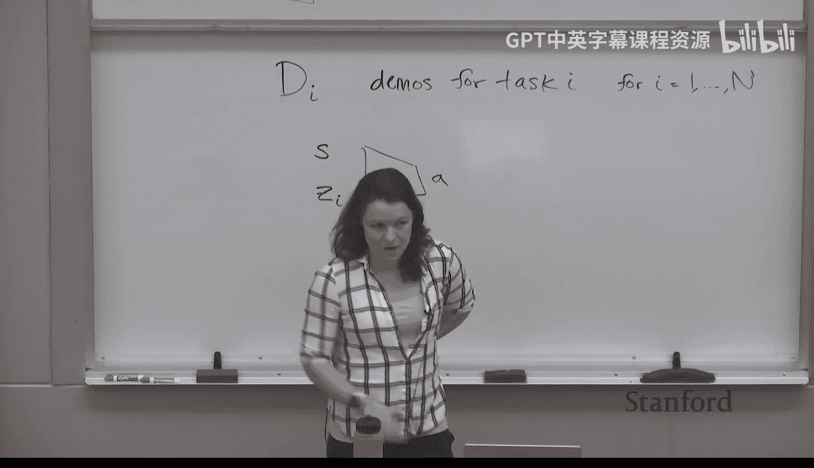

如果你有离散数量的任务，为每个任务设置不同的经验回放缓冲区可能很有用，特别是如果你想平衡每个批次的采样。

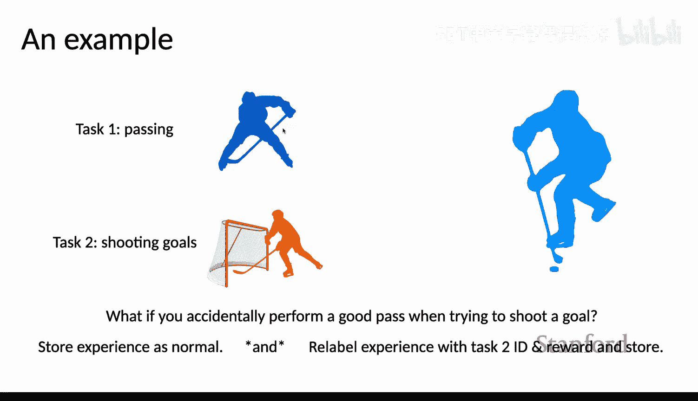

**数据共享与事后重标记**
在强化学习中，会出现数据共享的问题。具体来说，当我们为一个任务收集了一些探索性数据时（例如，策略被告知“捡起海绵”但可能犯了错误），这种经验可能对其他任务描述符也有用。如果我们为每个任务设置了单独的经验回放缓冲区，那么我们就不会使用该数据来更新其他任务的策略。

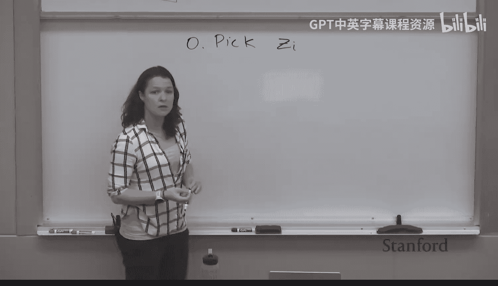

我们可以考虑一些场景，在这些场景中，我们能够更明确地重用来自一个任务的数据来帮助模型或策略学习另一个任务。要做到这一点，我们必须对数据进行重标记。具体来说，如果任务具有不同的奖励函数但动态特性相同，那么你必须将数据集中的奖励标签更改为其他任务的奖励标签。

**示例：冰球运动**
假设你正在学习打冰球。一个任务是传球，另一个任务是射门得分。也许你试图射门得分，但搞砸了，却意外地将球很好地传给了你的队友。那么，你刚刚收集的这些数据，尽管你的意图是射门，但实际上可能对学习如何更好地传球非常有用。

因此，你可以做的是：除了将这段经验以其原始任务标识符正常存储外，还可以用另一个任务标识符（这里是传球任务）重新标记这段经验，然后将其存储在该任务的经验回放缓冲区中。

**算法流程：**
1.  选择一个任务 \( i \) 及其对应的任务标识符 \( z_i \)。
2.  从以该任务标识符为条件的策略中收集数据：\( (s_t, a_t, s_{t+1}, r_t, z_i) \)。
3.  将此数据存储到任务 \( i \) 的经验回放缓冲区中。
4.  **事后重标记**：考虑将此数据用于另一个任务 \( j \)。计算任务 \( j \) 下的奖励 \( r^{(j)}(s_t, a_t) \)，并将任务标识符改为 \( z_j \)，得到新数据 \( (s_t, a_t, s_{t+1}, r^{(j)}_t, z_j) \)。
5.  将此重标记后的数据添加到共享的经验回放缓冲区，或任务 \( j \) 的缓冲区中。
6.  更新策略 \( \pi_\theta \)。
7.  重复此过程。

**关键考虑因素：**
*   **选择哪些任务 \( j \) 进行重标记？** 这是一个启发式过程。一个启发式方法是：如果任务 \( j \) 的奖励 \( r^{(j)} \) 很高，那么这段数据可能对该任务的学习有益，因为你可能意外地做了对另一个任务有益的事情。另一个启发式方法是随机均匀地对所有任务进行采样和重标记。
*   **何时可以应用重标记？** 这取决于任务 MDP 的性质和所使用的强化学习算法。
    *   **共享状态和动作空间**：状态和动作空间（及维度）需要匹配。
    *   **相似的初始状态分布**：如果初始状态分布差异巨大，共享数据可能没那么有用。
    *   **相同的动态特性**：**至关重要**。因为重标记不改变动态特性，如果动态特性不同，将其他任务的动态数据用于当前任务会产生问题。
    *   **不同的奖励函数**：如果奖励函数相同，数据已经以原始奖励函数存在于缓冲区中，重标记意义不大。
    *   **异策略算法**：重标记后的数据本质上是离策略数据（动作是在条件 \( z_i \) 下采取的，而不是 \( z_j \)）。因此，更新策略 \( \pi_\theta \) 时，需要使用异策略算法。不需要存储原始策略，因为重标记后，数据被视为仿佛是在条件 \( z_j \) 下生成的。
    *   **需要奖励函数形式**：你需要能够计算新任务 \( j \) 的奖励，或者已经学习了一个奖励函数。

**目标条件版本**
对于目标条件强化学习，情况基本相同，但奖励函数现在是状态与目标之间的负距离。对于连续状态，这可以是均方误差、嵌入空间中的距离，或在目标状态某个 \( \epsilon \) 球内的 0/1 损失。

---

## 总结

本节课中，我们一起学习了：
1.  **基于模型的强化学习中的合成数据生成**：如何利用学习到的动态模型，从真实数据中的状态出发生成短轨迹，来增强数据集并更高效地训练策略。
2.  **基于模型方法的适用场景**：分析了其高数据效率、任务可迁移性等优势，以及模型学习难度、优化目标不匹配、引入额外超参数等缺点，强调了其应用高度依赖于领域特性。
3.  **多任务强化学习框架**：将不同任务视为不同的 MDP，并通过引入任务标识符将其统一为单个聚合 MDP 进行学习。
4.  **多任务模仿学习**：通过将任务标识符作为条件，最小化所有任务上的平均行为克隆损失。介绍了分层小批量采样等实用技巧，并讨论了处理多模态输入的策略架构设计。
5.  **多任务强化学习与事后重标记**：介绍了如何通过将为一个任务收集的经验，用其他任务的奖励函数重新标记后，存入经验回放缓冲区，来实现跨任务的数据共享和经验复用。明确了该方法适用的前提条件（共享动态特性、异策略算法等）。

通过掌握这些技术，你可以构建更通用、数据效率更高的智能体，使其能够应对多种不同的任务。