#  013：元强化学习

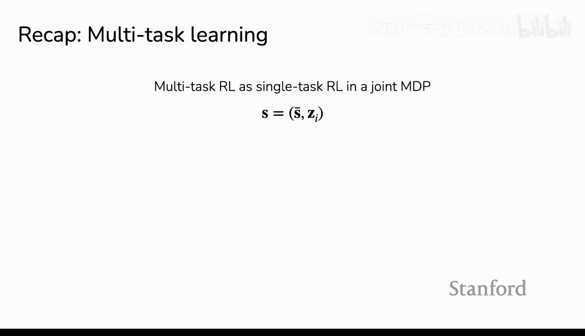

在本节课中，我们将要学习元强化学习。我们将探讨其问题定义，并介绍一类被称为“黑盒”元强化学习的方法。我们将了解这些方法的基本原理，以及它们所面临的一些挑战。

## 课程回顾

上一节我们介绍了多任务强化学习，讨论了如何让智能体学习多个任务，这些任务可能对应不同的奖励函数。我们看到，可以通过构建一个聚合的马尔可夫决策过程来封装所有不同的任务，其中通过某种任务描述符（如提示、目标或索引）来增强状态空间。

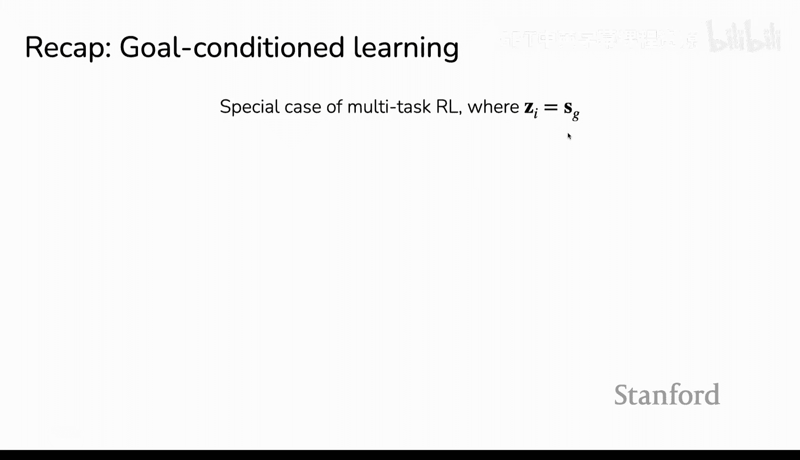

这种方法的工作原理是：采样一个任务，在该任务的MDP中运行策略，再采样另一个任务，依此类推。最终，我们得到一个能够在多个不同MDP中成功获得高奖励的策略。另一种视角是，将其视为一个具有增强状态的单一聚合MDP。这与元强化学习略有不同，我们将在本讲后续部分看到一些区别。

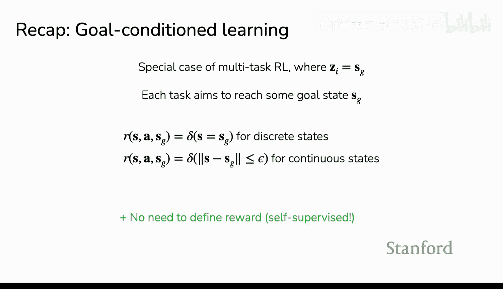

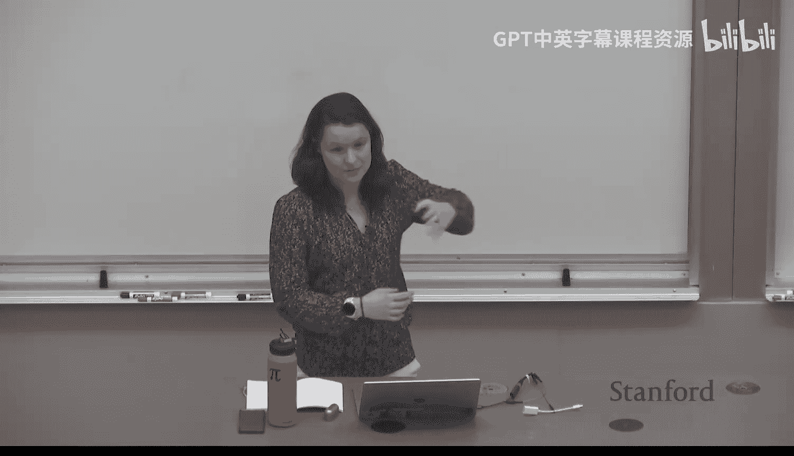

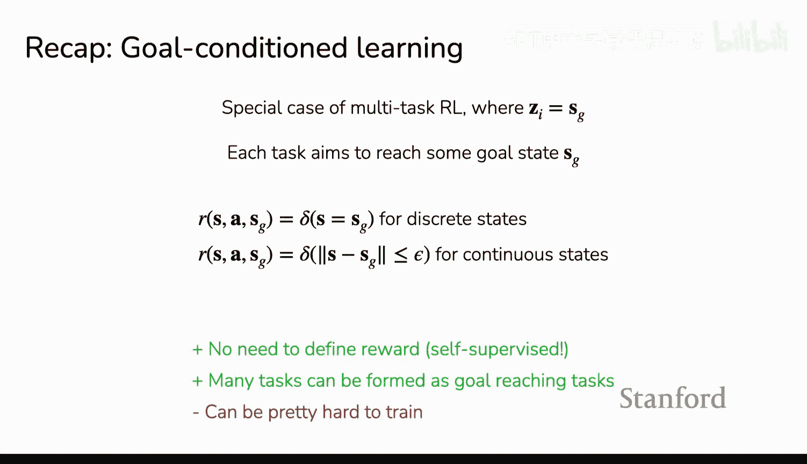

我们还简要讨论了目标条件强化学习。它可以被简单地视为多任务强化学习的一个特例，其中每个任务都试图达到一个目标状态，而任务描述符就对应那个目标状态。例如，如果状态是图像，那么输入给策略的将是当前图像和目标图像，目标是达到那个目标图像。如果状态是向量，则输入两个向量，任务是试图达到某个目标状态。你可以根据状态是离散还是连续的，构建不同的奖励函数，例如是否达到或接近目标。这种目标条件强化学习的一个优点是，它可以以一种自监督的方式进行，不需要手动定义不同的任务描述符，可以直接使用不同的状态作为任务本身。许多任务都可以被表述为目标达成任务。需要注意的是，这种方法的训练可能相当困难，你们将在作业中实验一个简单的目标条件强化学习设置。

## 元强化学习的问题定义

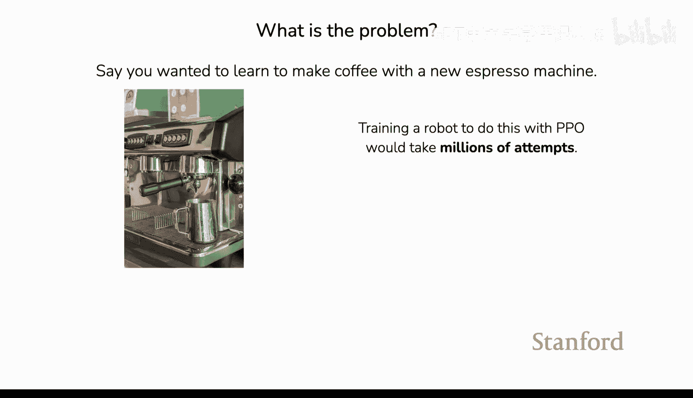

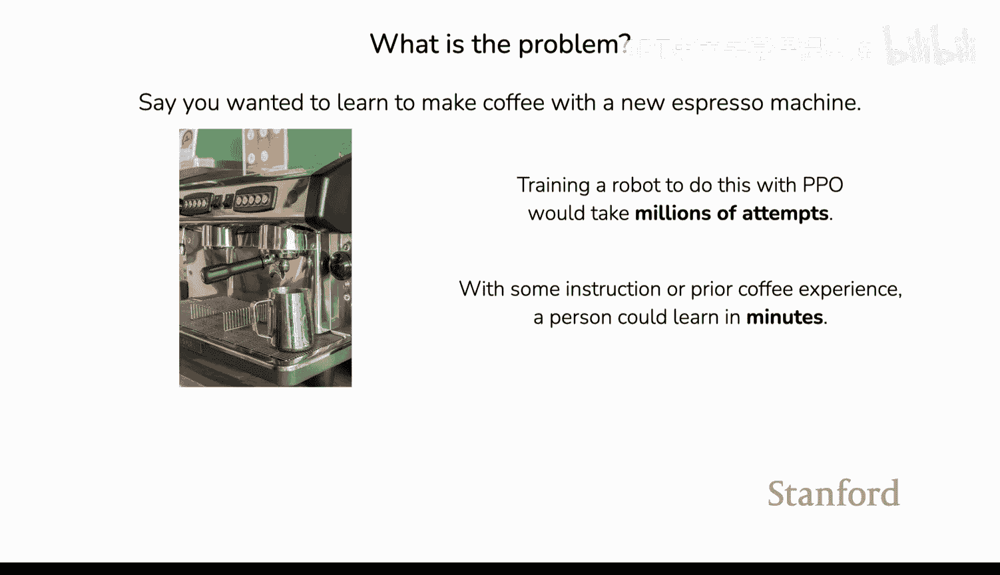

那么，为什么我们需要关心元强化学习？为什么不直接使用标准的强化学习？

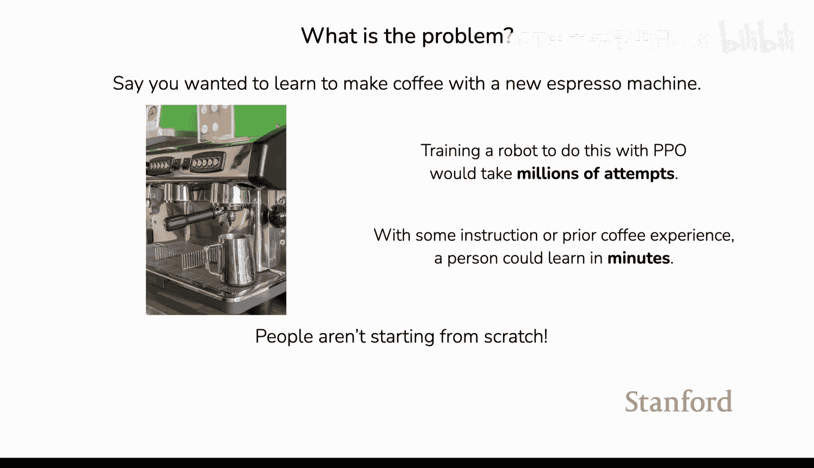

假设你试图操作一台从未使用过的意式咖啡机。如果你想让一个机器人或强化学习智能体来完成这个任务，可能需要大量的数据和尝试才能学会如何制作咖啡，因为这是一个相当复杂的任务，涉及许多步骤，并且需要按顺序执行。此外，这类任务的奖励信号可能不会非常详细。

但作为人类，如果你有一些指导或之前制作意式咖啡的经验，你可能在几分钟甚至更短的时间内就能学会。

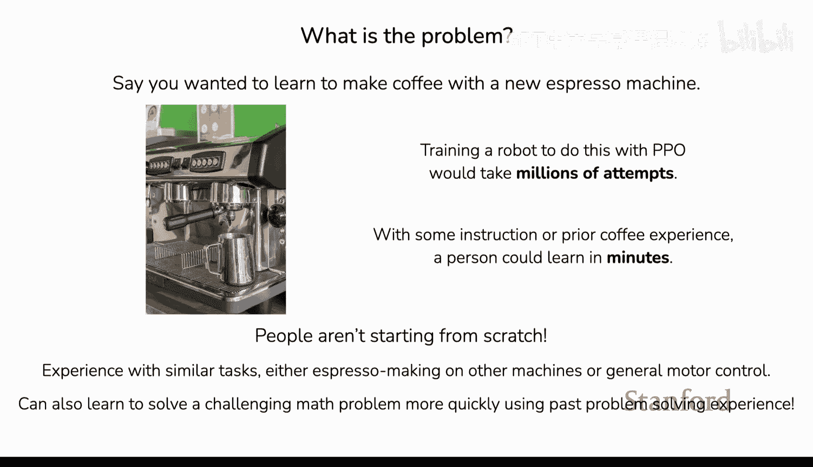

因此，在强化学习中，人类学习的速度与强化学习系统学习的速度之间存在差距。这是相当令人不满意的。如果我们思考人类和强化学习系统之间的区别，一个主要区别在于人类并非从零开始。人们已经知道如何用手移动物体，可能已经知道如何使用其他机器制作咖啡，他们可以利用这些经验以及关于“如果有人告诉你拿起杯子放在某处或转动旋钮该怎么做”的语义知识，从而能够利用先前的经验来非常快速地解决这个问题，相比之下，从头开始训练一个强化学习系统则慢得多。

因此，在解决新任务时，处理类似任务（其他意式咖啡机、其他方式的咖啡制作或一般的运动控制、遵循指令等）的经验非常有用。我以制作意式咖啡为例，但这种不从零开始的框架非常通用。它适用于机器人问题，当你面对新环境或新任务时；它也适用于许多强化学习系统。另一个例子是，假设你想解决一个从未解决过的具有挑战性的数学问题。如果你有解决先前数学问题的经验，那么你可以利用这些经验更快地解决新问题，因为你已经学会了一些可以应用于新场景的策略。

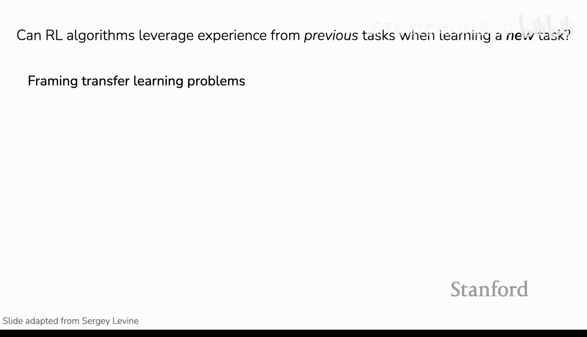

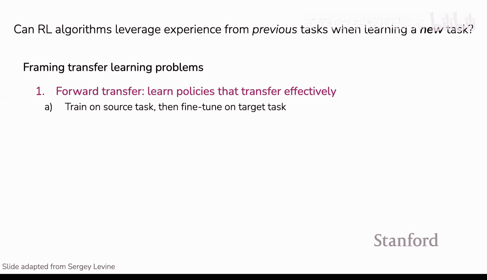

因此，我们提出的问题是：强化学习算法能否利用先前任务的经验，以更少的数据和经验来学习新任务？

在许多方面，这个问题被视为一个迁移学习问题，我们希望将知识、信息和经验从先前任务迁移到新任务。研究界已经考虑了多种不同的表述和问题设置。

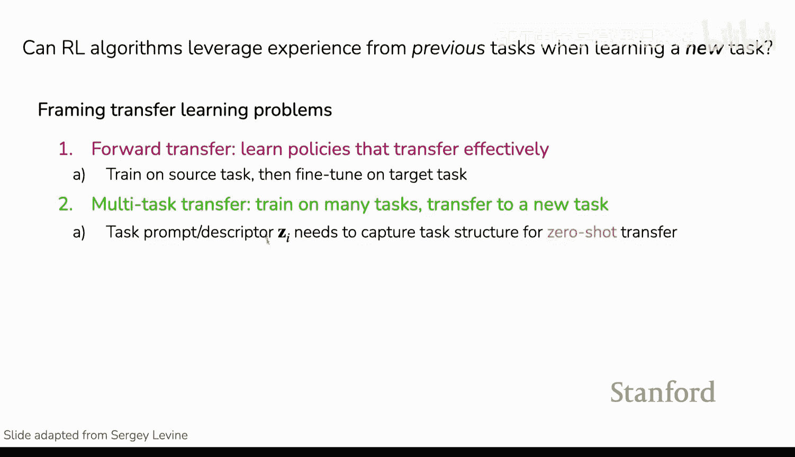

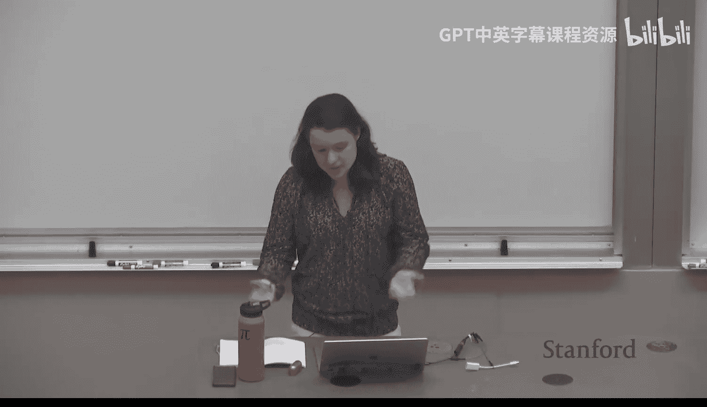

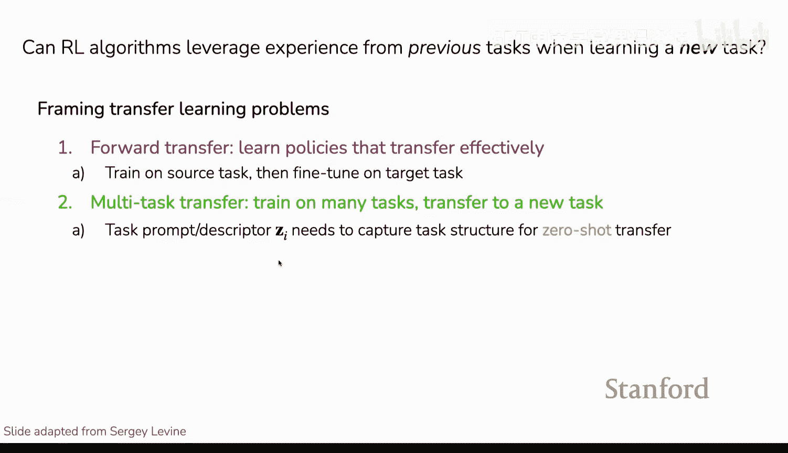

第一种是相当简单的设置：学习一个任务，然后想学习一个新任务。例如，你可以先在一个任务上训练，然后在新任务上微调。我们在监督学习中使用的微调概念也适用于强化学习设置，你可以将Q函数或策略微调到新任务。不过，要使这种方法有效，源任务和目标任务需要非常相似。

我们也讨论了多任务学习，你也可以使用多任务学习来迁移到新任务。特别是，如果你的提示具有某种结构，例如“拿起水瓶”、“拿起电话”、“拿起笔”等，那么你可能实际上能够实现所谓的“零样本”迁移，即无需任何新经验，只需将该提示传递给系统，让它根据提示行动。

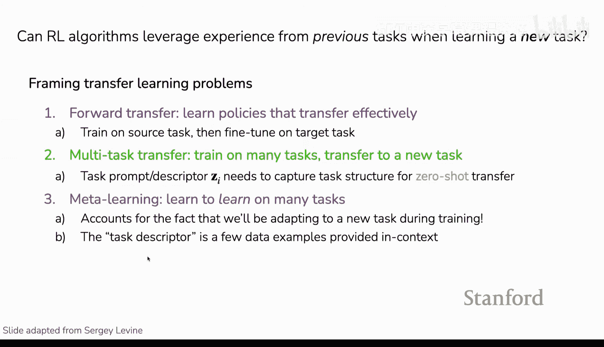

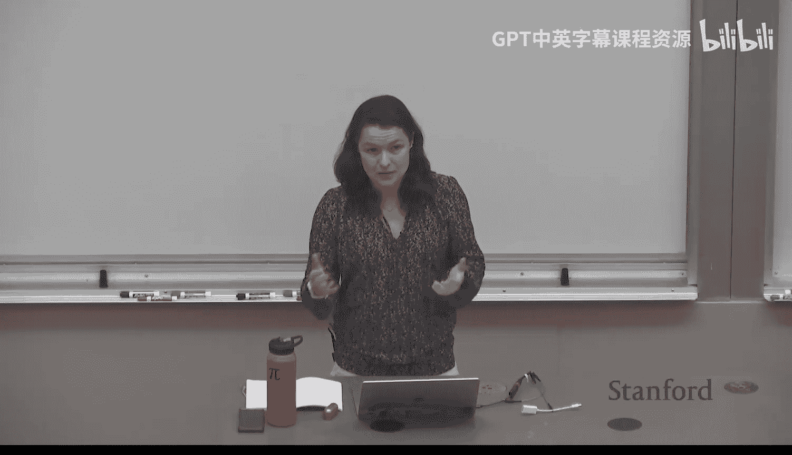

而元学习通常关注的是“少样本”迁移，即利用少量经验（几个示例或几次任务尝试）来适应新任务。本质上，多任务学习和元学习的区别在于，元学习考虑了我们将用少量数据进行适应的事实，并在原始训练过程中就为此做准备。

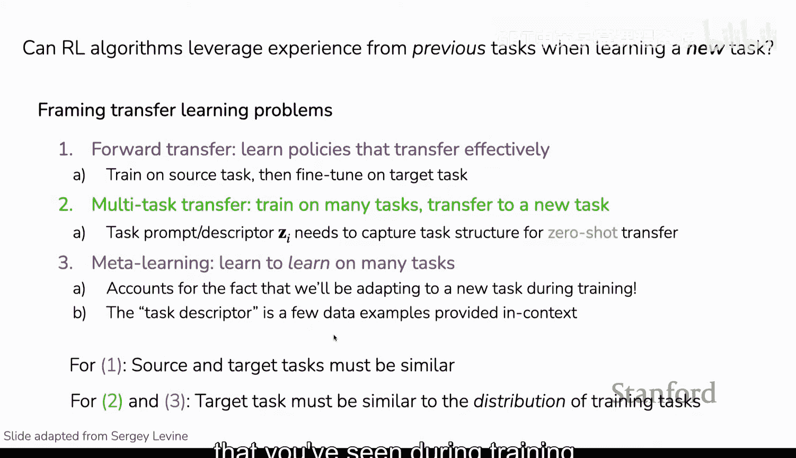

另一种思考方式是：任务描述符可能不是提示或索引，而可能是一个数据集本身，即你将在某个策略的背景下进行适应的一组尝试。这有时也被称为上下文学习或少样本学习。

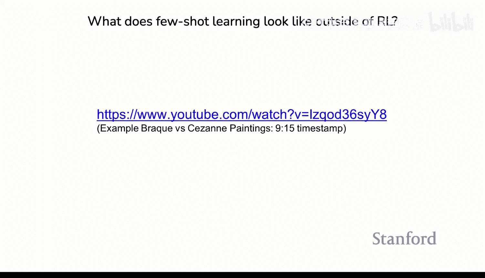

为了使第一种场景有效，源任务和目标任务必须非常相似。而对于第二种和第三种场景，在某些方面变得更容易，在某些方面变得更难。更容易的地方在于，你不再需要有一个极其相似的任务，只需要有一个任务分布，并且新任务应该在该分布内，这样新任务才有可能在你训练期间见过的任务分布之内。更难的地方在于，你实际上需要多个训练任务，而不仅仅是一个训练任务，才能获得有效的迁移。

## 少样本学习示例

在深入元强化学习之前，我们先看几个强化学习之外的少样本学习示例，然后再回到强化学习设置。

一个例子是少样本图像分类问题：你只有少量数据点，目标是对新数据点进行分类。通常，如果只基于六张图像从头开始训练，你几乎不可能学会一个分类器，尤其是在高维图像上。但元学习的工作方式是，你可以为机器学习系统构建其他具有类似结构的任务（如图像分类任务），训练它能够将训练数据集和查询图像（或测试输入）作为输入，然后预测标签，基本上将每个少样本学习问题本身视为一个数据点。

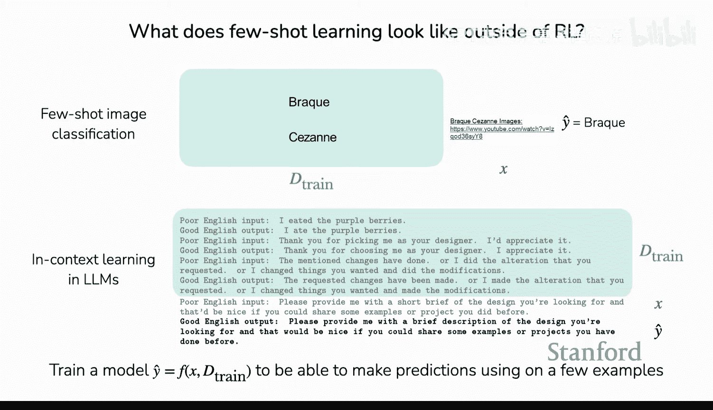

强化学习之外的另一个少样本学习示例是大语言模型中的上下文学习。例如，给定一个英语输入较差的句子（如“I eated the purple berries”），目标是输出良好的英语（如“I ate the purple berries”）。模型会给出几个输入输出示例作为训练数据集，目标是对新的输入，能够预测出良好的输出。这是另一个少样本学习问题的例子。语言模型在训练期间会接触到类似这样的数据。语言模型的一个特别之处在于，这种上下文学习并不需要你明确地设置训练数据集来完全匹配所有内容，事实证明，互联网数据的许多统计特性导致了这种有效响应少样本示例的能力。

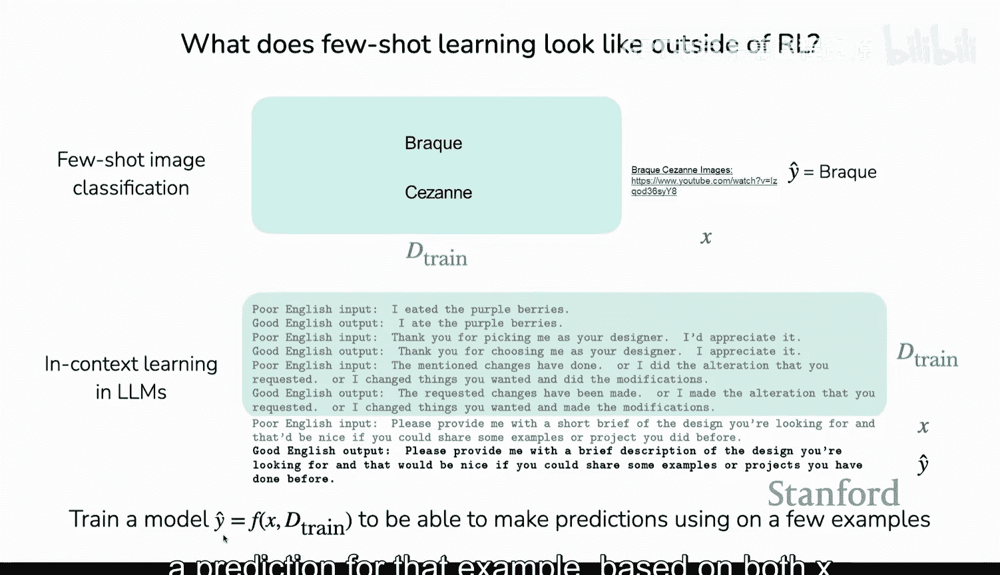

在这些示例中，你可以认为目标是训练一个模型，该模型以训练数据集和一个新示例X作为输入，并基于X和训练数据对该示例进行预测。

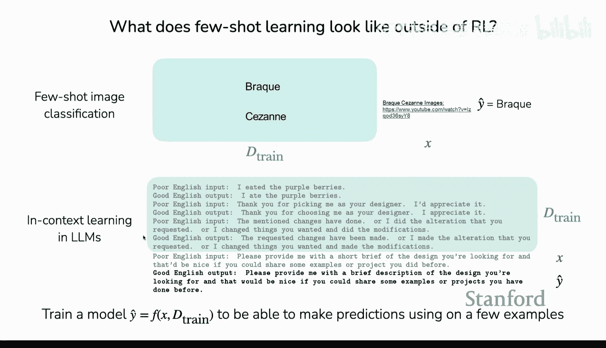

问题：在LLM的上下文学习中，通常通过将数据集作为上下文或提示的一部分放入模型来实现这种少样本学习。在元强化学习中也是如此吗？一般来说是的，我们将在元强化学习中看到这种情况。实际上还有其他方法，例如通过梯度更新或类似最近邻的方法来实现。元强化学习中最成功的方法看起来像提示，所以这就是我们今天要讨论的内容。

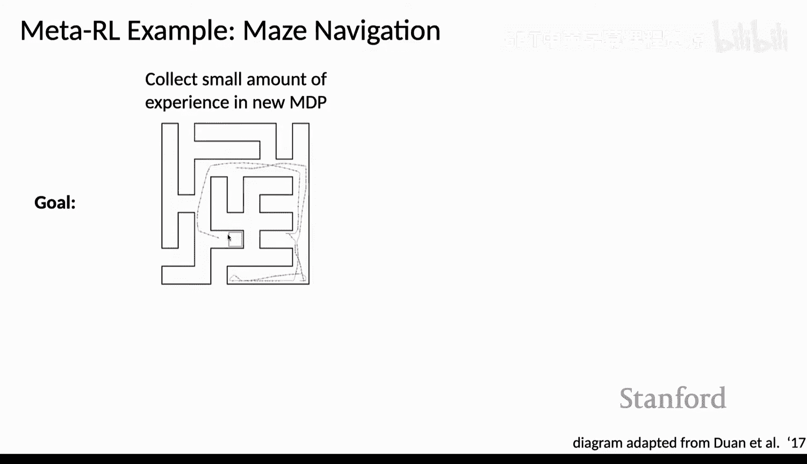

## 元强化学习示例

现在，让我们看一个元强化学习的例子。假设我们想在迷宫中导航。我们的目标是解决一个新的迷宫。我们是一个智能体，在这个迷宫中，我们甚至看不到这种俯视图，可能只有第一人称视角。因为这是一个强化学习问题，目标不仅仅是输出标签，实际上还涉及在环境中收集经验。

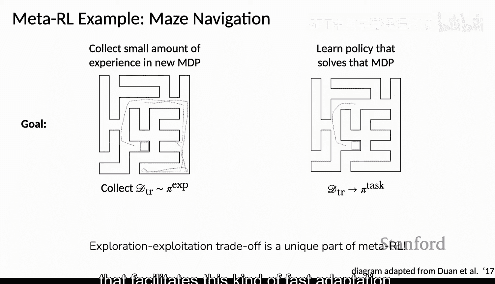

因此，我们的目标是能够非常快速地解决一个强化学习问题，我们将此框架为收集一个非常小的训练数据集，例如一个或几个回合。在这个例子中，智能体探索迷宫，试图找到目标位置。它从中间开始，探索到这里，最终到达目标。在探索之后，我们希望拥有一个能够解决迷宫的策略，在这个例子中，仅用一次回合的经验。同样，如果你试图从头开始，仅用一次回合的经验来获得一个能够解决任务的策略，这将非常非常困难。相反，元强化学习通过尝试构建示例和构建一组训练环境来促进这种快速适应。

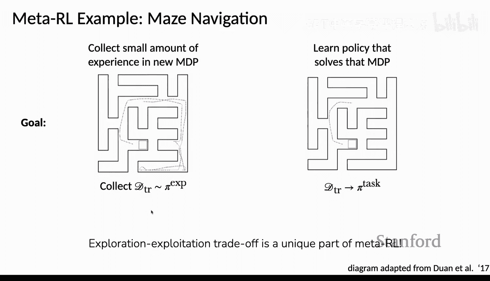

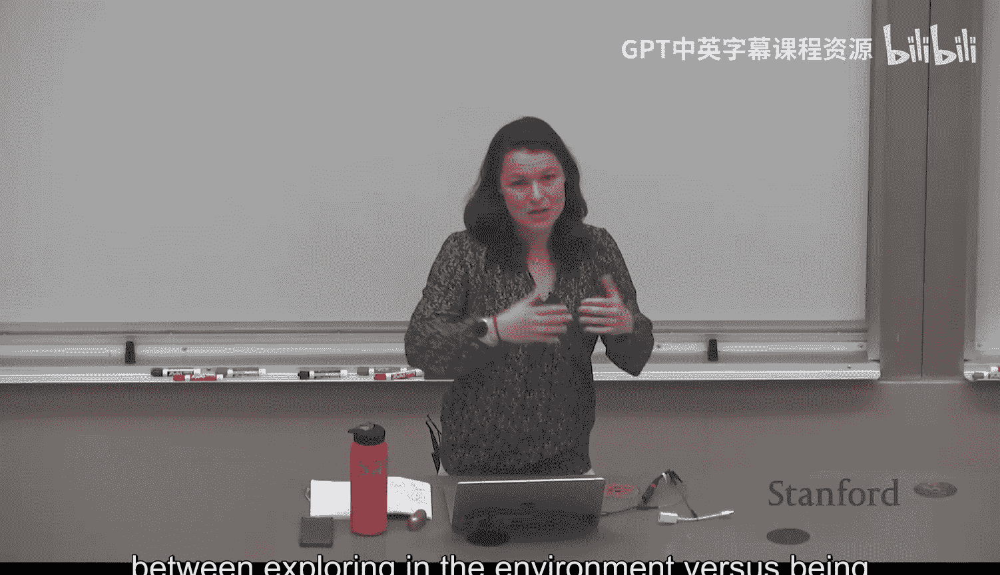

与监督学习场景相比，我们现在面临着探索问题。我们不仅仅是给定一个训练数据然后基于该数据做出预测，实际上我们是通过探索自己构建训练数据集。

我们需要弄清楚如何在环境中探索与随后解决任务之间取得最佳平衡，以及我们应该花多少时间探索与利用我们对环境的了解。

这是我们的目标，也是我们在测试时希望做到的：快速学习一个新的迷宫。为了让我们的智能体在元训练时取得成功，在我们尝试适应新迷宫之前，我们将学习如何高效地探索和解决许多其他相关的MDP（在这个例子中，可以是其他类似的迷宫等）。这些是我们为了适应新迷宫而将要训练的每个任务。

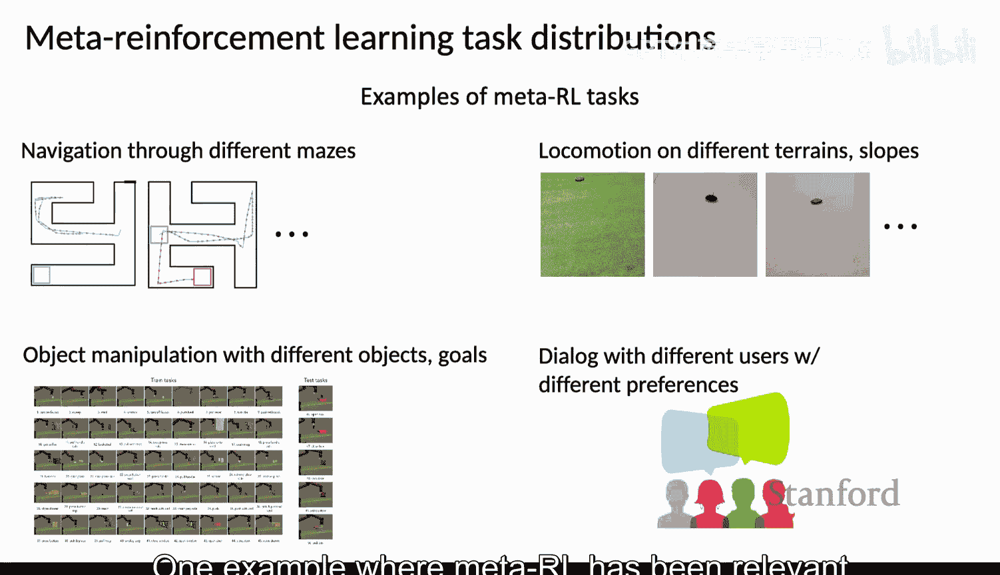

另一个关键假设是，这些新的MDP不能与之前见过的MDP完全不同。我们可以这样理解：我们应该有一个任务分布，而我们试图适应的这些新MDP应该在我们训练期间见过的任务分布之内。

迷宫导航是元强化学习任务的一个例子。还有许多其他场景。例如，在机器人学中，一个有用的场景是让腿式机器人系统能够非常快速地适应不同的地形、不同的坡度。这实际上是一个非常小的腿式机器人，但它也适用于更大的腿式机器人。有时，你可能在模拟中训练不同的环境，然后在现实世界中作为一个新环境进行适应。在操作场景中，你也可以将物体操作作为不同的任务。此外，在许多语言建模场景中，这也非常适用。元强化学习相关的一个例子是适应具有不同偏好的不同用户，你在上下文中给出他们想要的响应类型的示例，我们稍后也会在推理中看到一个例子。

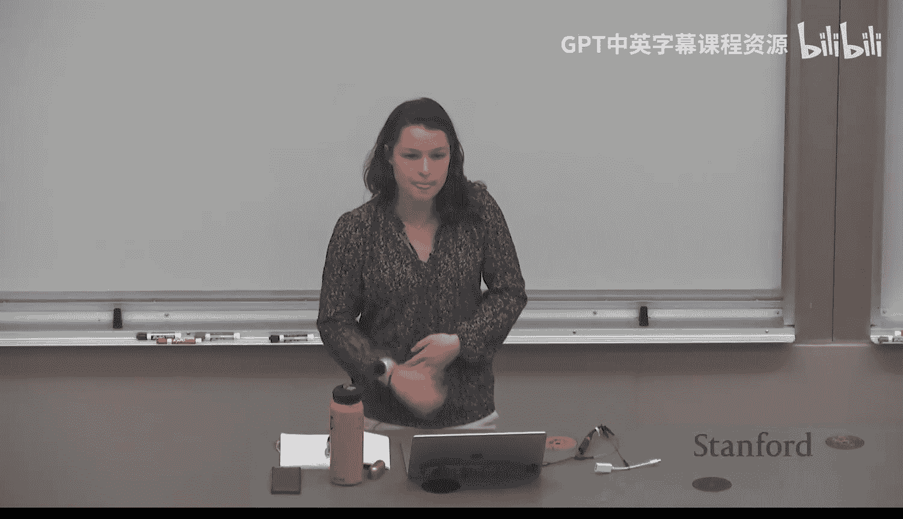

问题：这种元强化学习方法与先训练再微调的迁移学习方法之间的关键区别是什么？有几种看待方式。一种是在这种训练过程中，你实际上明确地优化了可迁移性，你优化了用小数据集进行适应的能力。因此，你可以获得更快的迁移，可以使用更少的数据。有一些例子表明，与使用微调相比，使用少样本上下文学习或少样本适应，你可以获得更高效的迁移。你获得更高效率的方式是为算法提供许多不同的训练任务，而不是仅仅依赖于一个训练任务。

## 形式化定义

稍微更正式地说，我们讨论过多任务学习，即你试图同时解决多个任务，并可能从中迁移到新任务。但对于迁移学习，你并没有优化可迁移性，你通常是在解决某个源任务后，通过微调来解决某个目标任务。

而在元学习问题中，我们拥有来自一些训练任务的经验，并且希望非常快速地解决新任务。在强化学习场景中，这些任务将是MDP，每个都有其自己的状态空间、动作空间、动态和奖励。元学习在监督学习中也有类似之处，两者之间存在一个很好的类比，元强化学习的主要区别在于探索挑战。

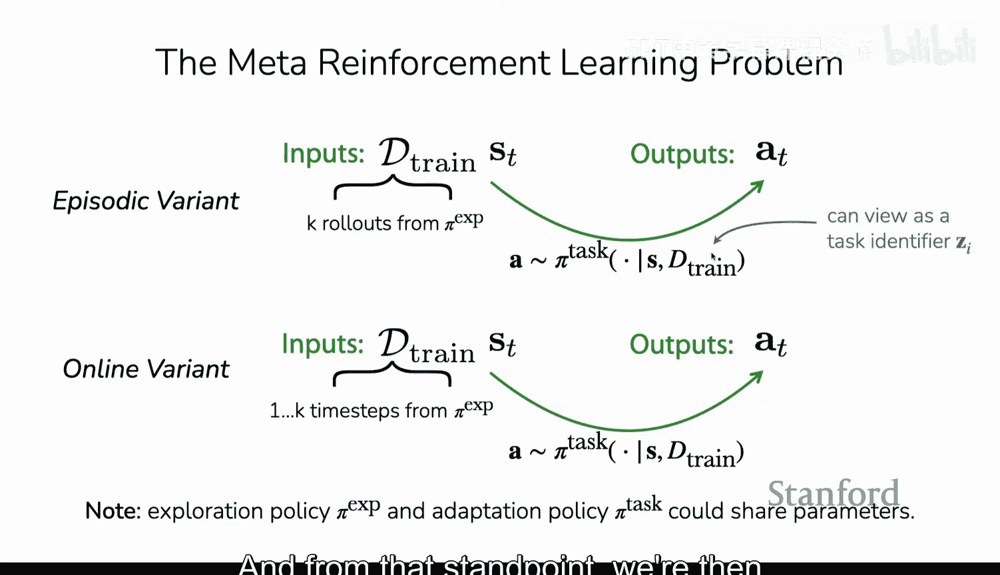

深入一些符号表示，我们可以将元强化学习问题视为能够用少量经验学习一个可以解决任务的策略，并且能够自己收集这些经验。这个训练数据，元强化学习问题有两种不同的变体：在第一种情况下，这可能对应于来自某个探索策略的多个回合；在第二种情况下，你也可以认为这只是来自探索策略的几个时间步。这两种场景之间存在一定的连续性，你可能希望能够在线适应几个时间步，也能适应越来越多的回合，基本上是一个不断增长的数据集。但在这里明确地写成两种不同的事物，是为了清楚地表明，有些问题设置中你希望在一个回合内非常快速地在线适应，而在其他场景中你更关心多次尝试的经验。

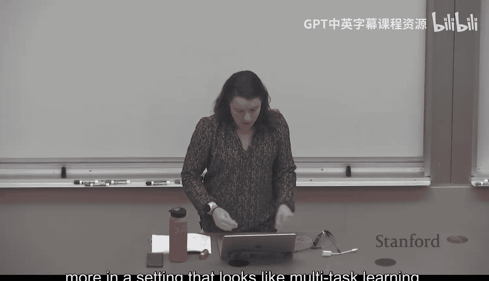

最后要提到的是，我一直将其写为探索策略和任务策略。在某些场景中，你可能会分别训练它们，它们可能是独立的网络；在其他场景中，它们可以共享参数，基本上是同一个网络。因此，它们不一定需要像本幻灯片上那样分开。最后一点是，就我们学习这个以训练数据为条件的策略而言，你可以将其视为一种任务标识符，从这个角度来看，我们更像是处于一个看起来像多任务学习的设置中。

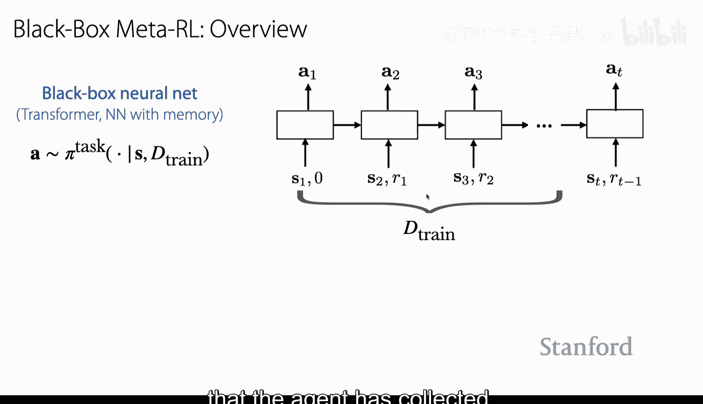

问题：当我说测试任务应该与训练任务同分布时，这是否意味着它必须与某个训练任务完全相同，还是可以略有不同？它可以略有不同，我们也会看到不同的例子。

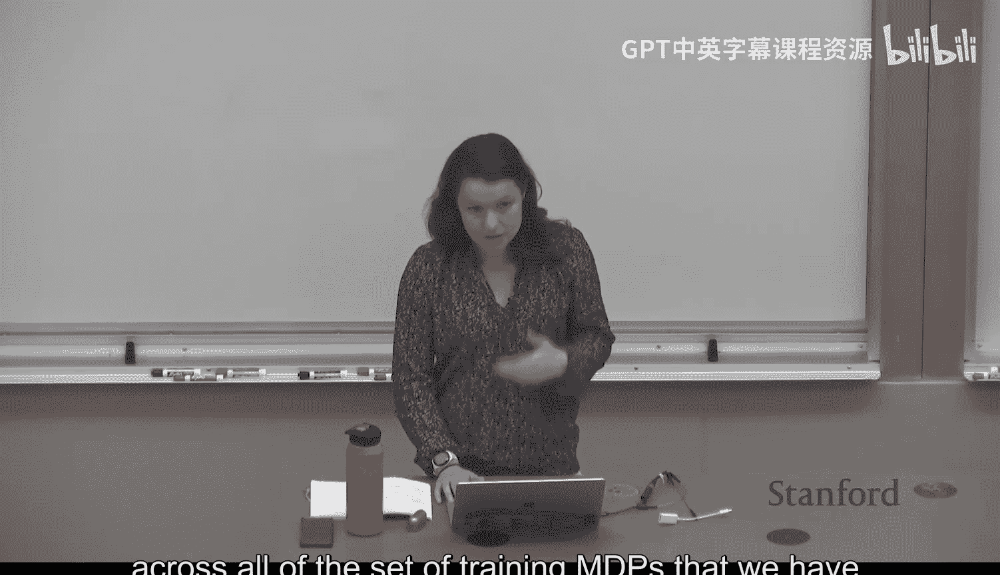

## 黑盒元强化学习方法

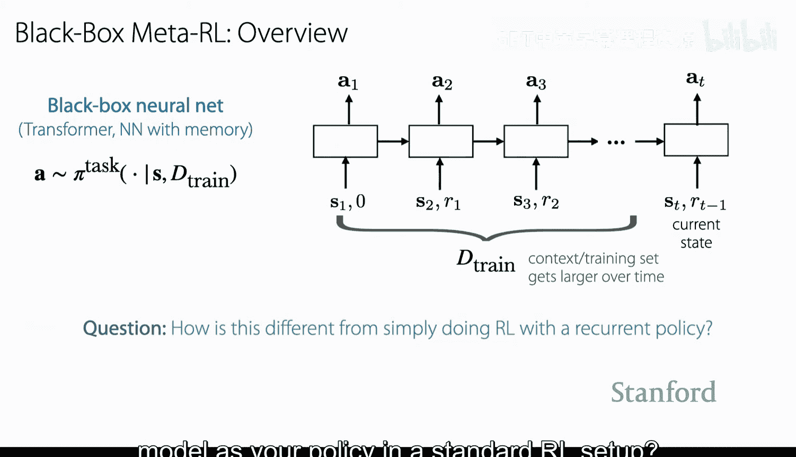

现在让我们谈谈如何解决这些问题。好消息是，有一种概念上非常简单的方法来解决这种一般性问题陈述；坏消息是，在实践中优化起来可能具有挑战性，我们稍后会讨论其中的一些挑战。但从概念上讲，我们基本上可以训练一个序列模型（可以是Transformer、任何具有记忆的神经网络或循环神经网络），并使用它，其中传递给该策略的所有内容都对应于智能体收集的经验。

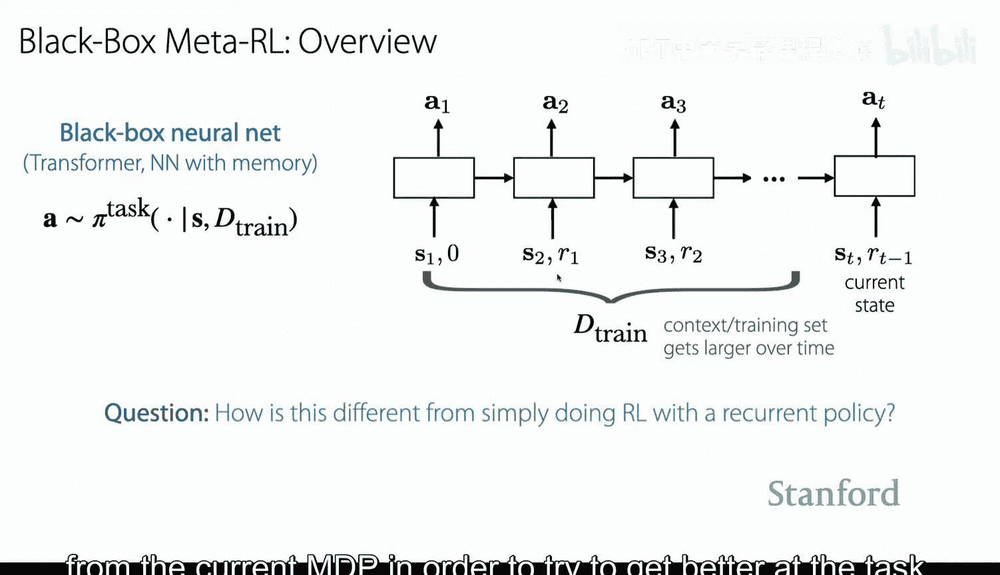

因此，你基本上是以训练数据集为条件来调整你的策略，然后让策略基于它在该MDP中迄今为止看到的数据输出动作，然后在所有训练MDP集合上训练这种序列模型策略。在这里，当前状态和上下文（或训练数据集）将随着时间的推移而变大，因为我们在给定的MDP中收集了更多的经验。

现在问你一个问题：这与在标准强化学习设置中简单地使用循环策略，或在标准强化学习中使用序列模型（如Transformer）有几个区别。有人对这里开始讨论的内容与在标准强化学习设置中简单地使用序列模型作为策略之间的区别有什么想法吗？

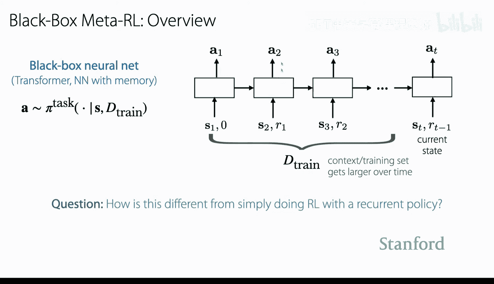

记忆，是的，通常在强化学习中我们通常不使用记忆，而这里我们使用记忆，这是一点。但与在标准强化学习设置中使用记忆相比，这里还有什么不同？是的，我们在这里做的一件事是，我们实际上将奖励作为输入传递给记忆，这在某种意义上有所不同，因为你实际上是在使用当前MDP的奖励信息来尝试更好地完成任务。这也意味着，实际上在测试时或当我们试图适应新任务时，我们也将使用奖励，而在强化学习设置中，通常我们并不一定假设在部署策略时拥有奖励。所以这是一个主要区别。还有其他区别吗？

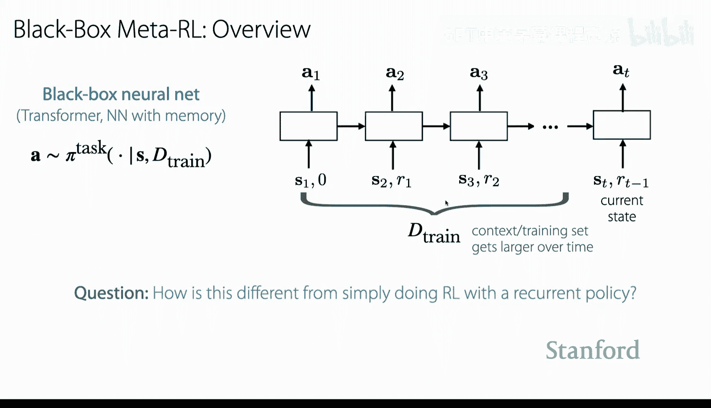

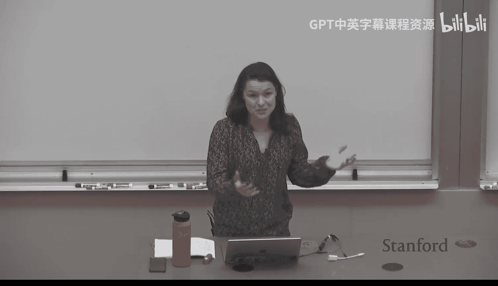

问题：为什么我们也不将动作作为输入传递？你可以将动作作为输入传递。这取决于你的策略是否主要是确定性的。如果是，那么关于过去动作的信息也可以存储在记忆中，因为你预测并生成了那些动作。因此，在这些情况下，你不需要动作。如果你的策略更具随机性，那么采样过程不一定在记忆中，在这些情况下，最好也将动作作为输入传递。

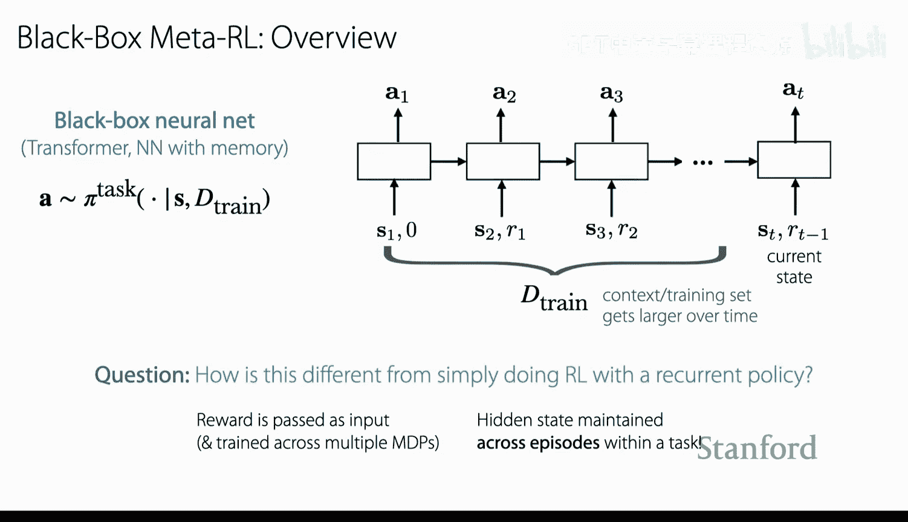

正确，所以注意点是，不同任务的状态和动作可能不同。因此，这里的一个不同之处在于，我们实际上是在跨MDP训练这个模型，因此你可能拥有不同的状态和动作空间，可能具有不同的动态。因此，与标准强化学习相比，一个很大的不同在于，我们实际上是在跨MDP训练，并且这些MDP之间的状态、动作、动态和奖励会存在差异。

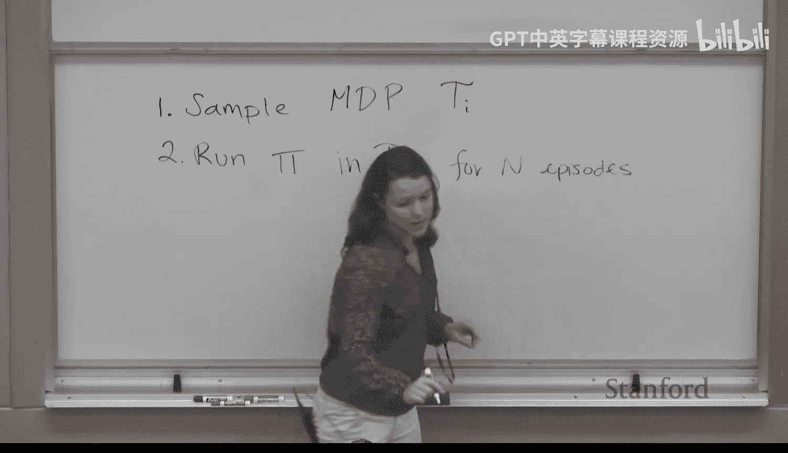

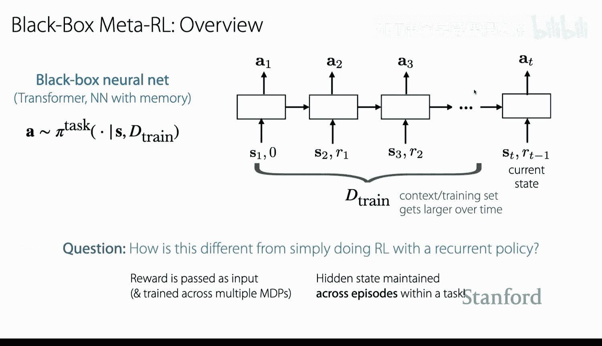

实际上还有另一个区别。我们讨论的第一点是奖励作为输入传递，你可能也会传递动作作为输入，并且这是在多个MDP上训练的，这与典型的强化学习设置有很大不同。现在，第二个不同之处在于，你的记忆也可能跨越多个回合。如果你试图不仅在一个回合内学习，而且跨回合学习，那么你的当前策略不仅会在一个回合内保持记忆，还会在多个回合之间保持任何隐藏状态或任何记忆。

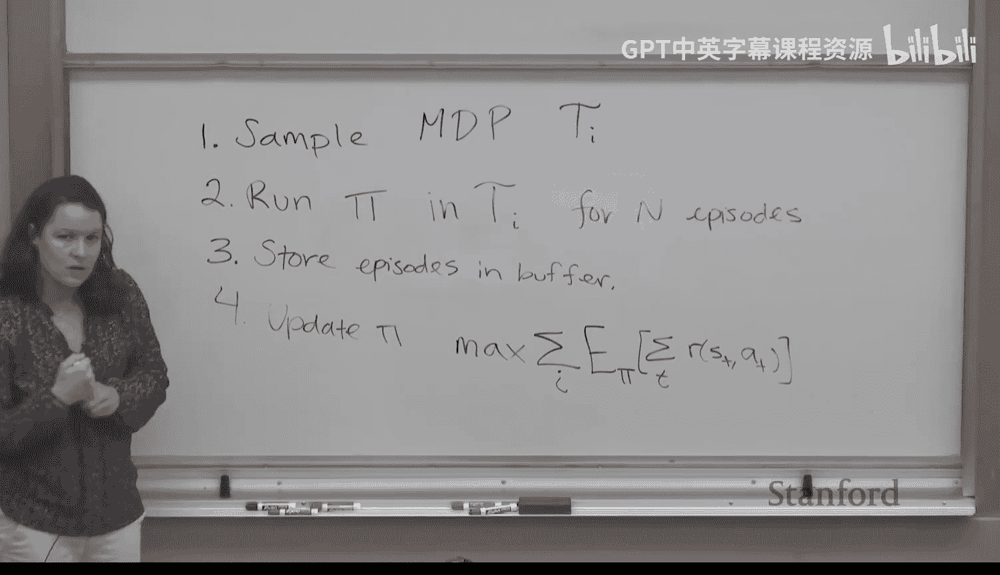

就算法而言，这看起来像是：我们将采样一个任务或一个MDP。让我们称之为MDP Ti。然后我们将在该MDP中运行我们的策略多个回合。假设在任务或MDP中运行策略π进行N个回合。这是推出这里的过程，并且它将在那些N个回合中保持记忆。然后，可选地，如果我们使用带有回放缓冲区的离策略算法，那么我们会将回合存储在回放缓冲区中。最后，我们将优化更新我们的策略以优化奖励。因此，我们将更新π，具体来说，我们将最大化奖励的总和，就像典型的强化学习目标一样。但它将跨越我们任务分布中的所有任务。因此，我们将对某个小批量中的任务I求和，然后也是对奖励总和的期望。这将是我们的策略下不同时间步奖励总和的期望。

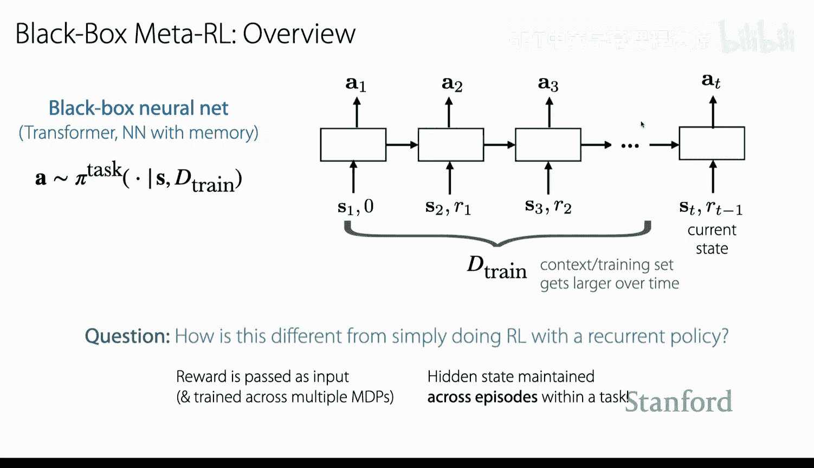

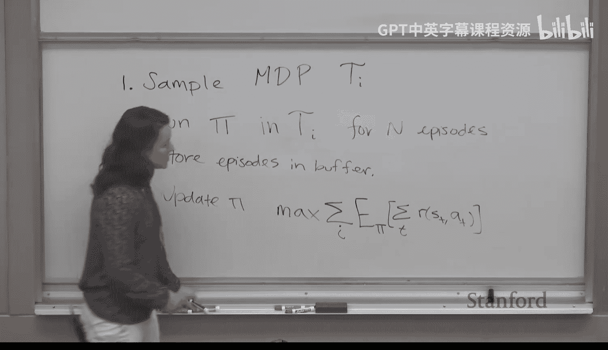

这是一个非常简单的算法，看起来很像强化学习，主要的不同之处在于，我们将在多个MDP上进行这种优化，并且我们的策略将在一组回合中保持记忆。通常，这个数字会相当小，因为如果很大，比如一千个回合，很难将其存储在模型的上下文中，因为你的内存会开始大幅增加。

它的样子是：你的神经网络有多个回合，然后你将为多个回合推出它，采取行动，然后你将开始为一个新的MDP收集数据，所以当你开始为采样的新MDP收集数据时，你会切断你的记忆。在这个图中，你采样一个任务，在该MDP的动态和奖励函数下推出策略进行N个回合（图中N=2）。然后将你的回放缓冲区存储起来，通常你会为每个任务设置不同的回放缓冲区。然后更新你的策略，以最大化你为所有任务收集的折扣回报，然后重复这个过程，以持续获得一个能更好地进行这种上下文适应的策略。

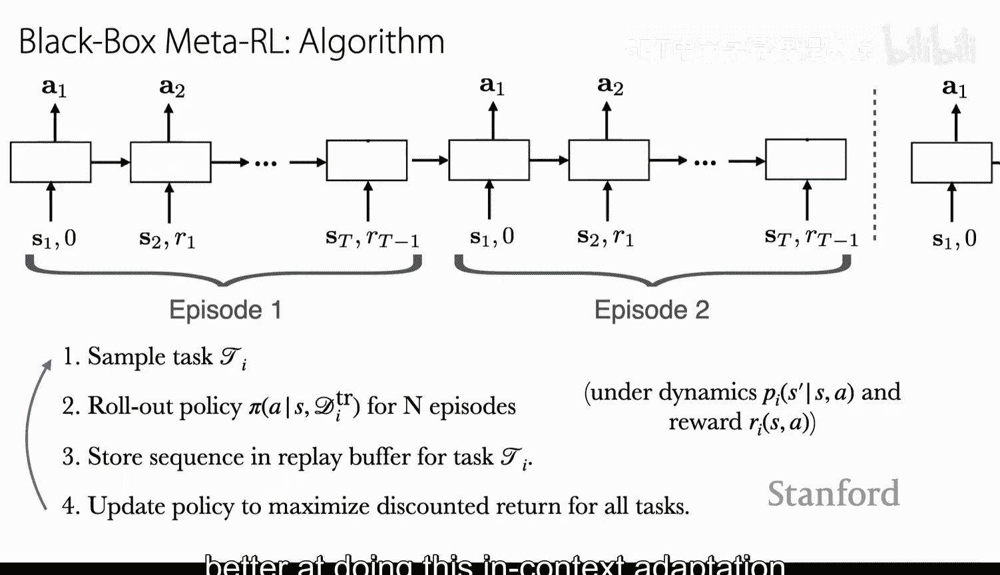

问题：它知道它正在开始一个新的回合吗？例如，在这个位置，在实践中你可以使用位置编码。此外，你的状态很可能会有很大的不连续性，所以你可能只是看到当前状态与过去状态非常不同，这也可能告诉它。是的，你也可以使用某种标记来告诉它这是一个新的回合。

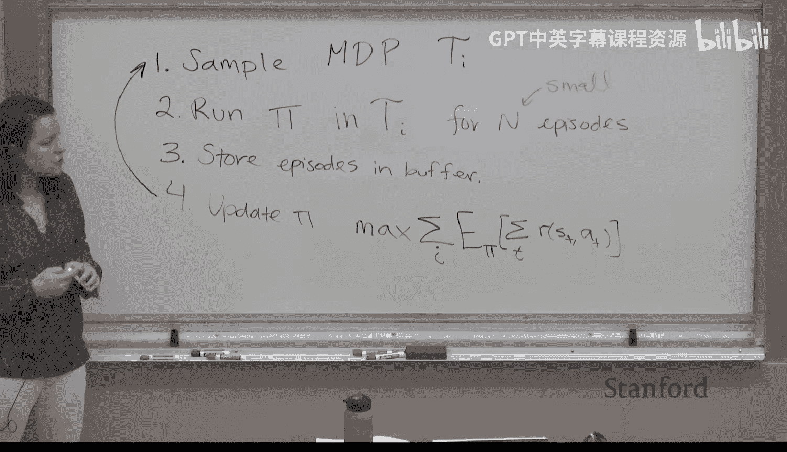

问题：当推出策略时，我们在不同的回合中随机化S1吗？当你开始一个新回合时，你会从初始状态分布中采样，所以S1在这里可能不同，S2很可能与这里的S2不同，依此类推。

这样做的结果是，你将拥有一个应该能够跨回合适应的策略，利用这些回合的经验，并且它应该能够自行决定最佳的探索-利用权衡。最佳的探索-利用权衡将取决于你给它的回合数N。如果N=2，那么它有两个回合来尽可能快地最大化奖励，如果它需要探索，它会尽快探索。如果N稍大一些，那么它仍然有更多的预算，如果可能的话，它仍然希望快速高效地探索，因为这样它可以在以后获得更高的奖励，但它可能有稍多的预算进行探索。因此，当你端到端优化整个事情时，一个很酷的地方是，它将决定是否探索或利用，并且这些决定将以能够获得最高奖励的方式做出。

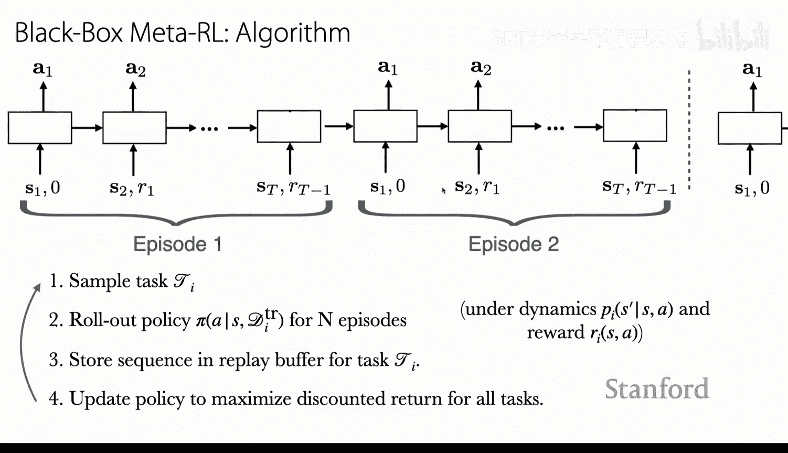

## 测试与架构

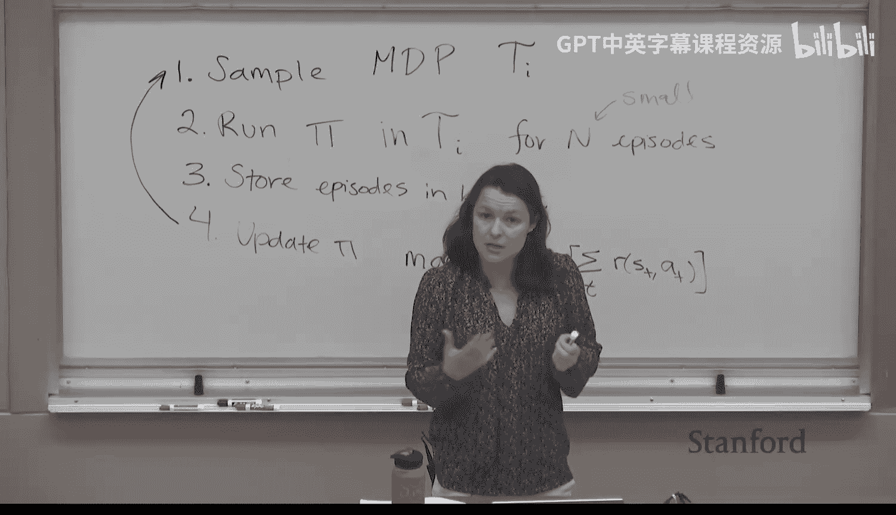

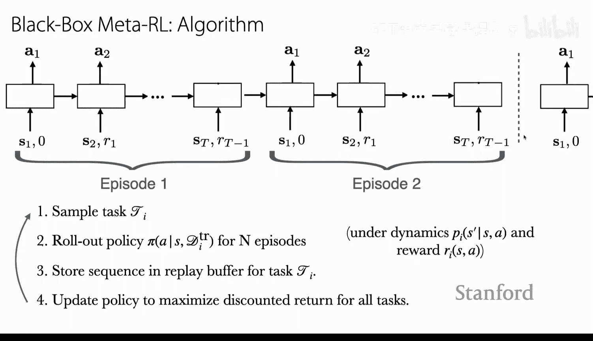

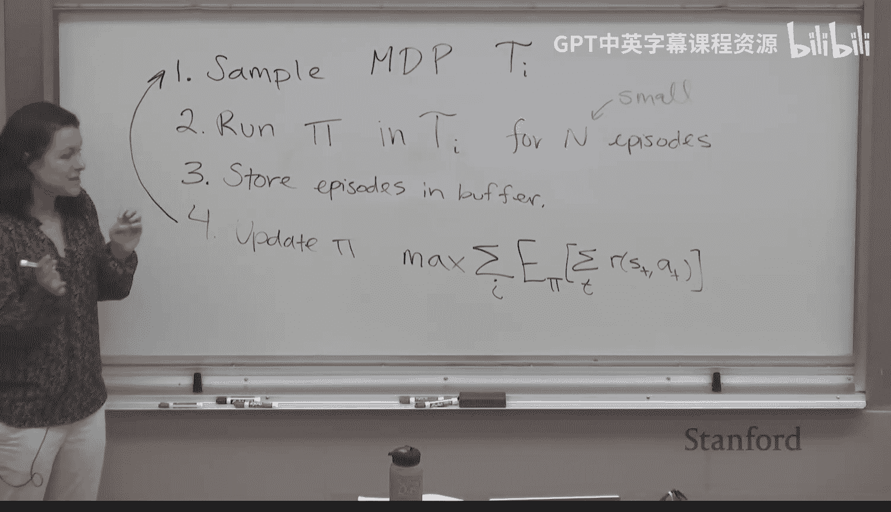

在这种训练过程之后，在你训练了多个MDP之后，你实际上可以在新任务中推出你的策略。在测试时，你将获得一个新任务，即你处于某个新的MDP Tj中。你可以取出训练好的策略，并在该MDP中推出它，包括数据、动作、奖励等。因此，采样一个新任务，推出该策略，你想推出最多N个回合，如果你推出更长时间，那么它可能会做什么就不确定了。你也可以在训练期间使用可变数量的回合，如果你想能够处理可变数量的回合，但这里大概是推出N个回合或最多N个回合。

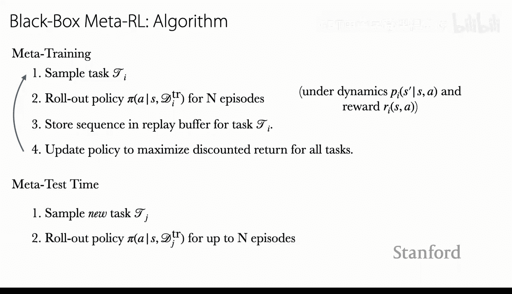

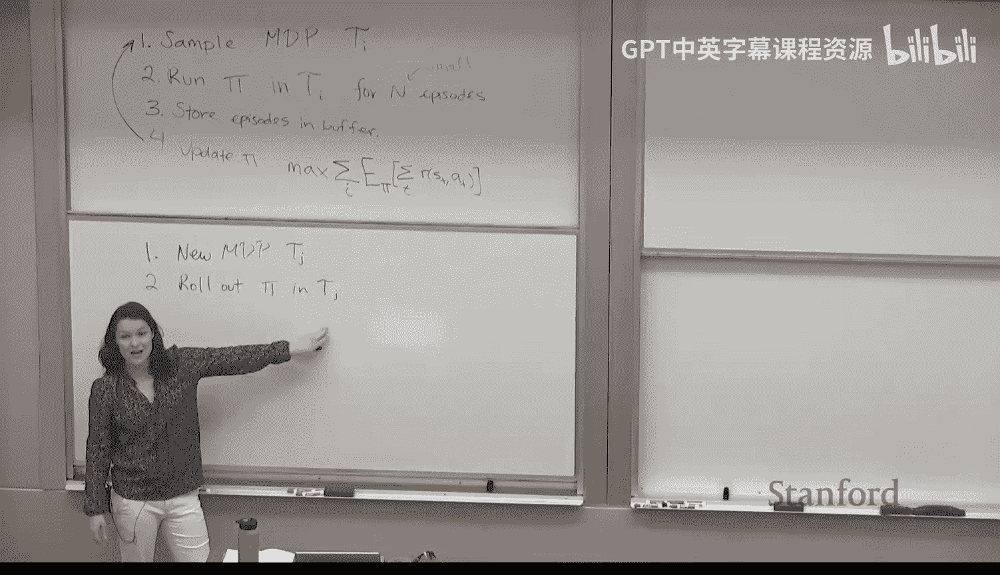

就实际实现而言，你可以使用几种不同的架构和优化器。你可以使用普通的循环神经网络，一些最早的元强化学习工作就是这样做的，他们使用的算法在本质上与PPO类似。在Transformer真正流行之前，有一篇论文使用了自注意力和一维卷积，你可以将其视为一种Transformer并进行了优化。值得注意的是，在这个特定场景中，他们也传递动作作为输入。另一件事是，我们稍后会再谈一点，你也可以不使用Transformer或RNN，而是使用前馈网络，然后对嵌入进行平均，这有时被称为深度集合，它有自己的优点，实际上计算速度相当快，因为你可以并行化所有内容，并且对于它能做什么也出人意料地富有表现力。

## 应用实例

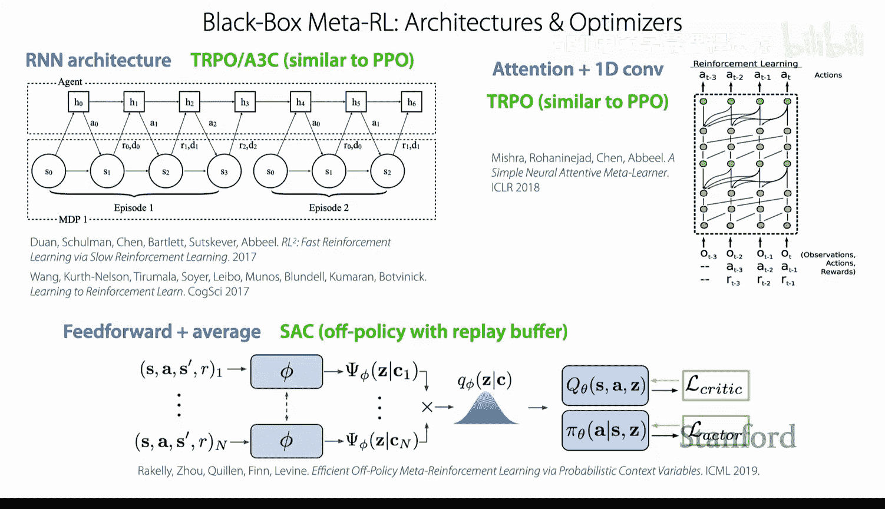

让我们看一些例子。我们将看这个使用类似Transformer的示例，他们试图学习如何视觉导航迷宫，特别是智能体从未见过的新迷宫。他们在1000个小迷宫上训练，并在未见过的保留迷宫中测试，实际上测试了小型和大型迷宫。这是一个他们能够看到一些外推到训练分布之外任务的场景。

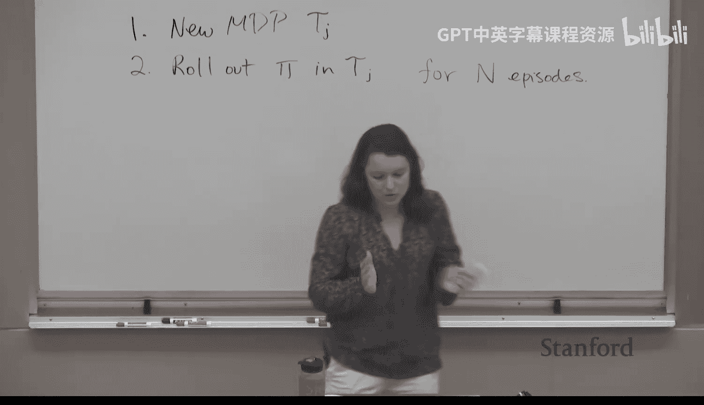

这是在测试时的样子。你可以看到智能体只是在环境中探索，寻找目标位置。它只将这些图像作为输入。在右侧，我们可以看到探索的轨迹。它从中间开始，探索到这里，探索到这里，最终找到了目标。然后，在探索回合之后，我们仍然拥有来自前一个回合的记忆，利用该记忆，它能够直接前往目标。基于在那个迷宫中的经验。再看一遍，这是第一个回合，这是推出该策略的第一个回合，它选择探索，因为它不知道目标在这个迷宫中的位置，也不知道迷宫的布局，所以我们看到它在这里探索。然后在第二个回合，它选择直接前往目标，因为它认为已经探索了迷宫的范围。

这是一个更大迷宫的例子。智能体从这里开始。它探索顶部区域，没有看到目标。意识到这是一个死胡同，不需要进一步探索，然后在这里看到了目标。之后，在第一个回合之后，它直接前往目标。在这个训练示例中，N=2，所以他们训练它能够在两个回合后探索和利用。

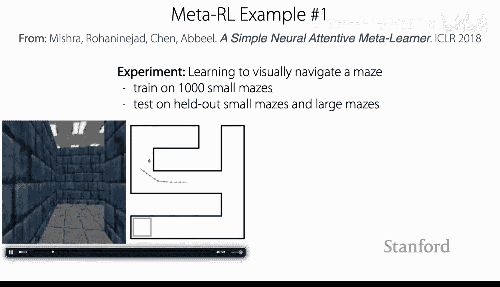

定量地，他们查看了在第一个回合和第二个回合中找到目标的平均时间。他们与使用随机策略（偶尔会碰到目标）以及使用LSTM架构和这种更类似自注意力和卷积的架构进行了比较。他们发现，对于小型迷宫，即使在第一个回合中，它们也比随机策略好得多，这意味着它们实际上是在高效探索，然后最终经常找到目标。然后，在第二个回合中，在第一个回合中学习了目标位置和迷宫布局后，它能够更快地找到目标。我们还看到，在大型迷宫中，它比随机智能体表现好得多，并且在两种情况下，使用自注意力架构都比使用LSTM架构（另一种记忆架构）更好。

问题：奖励是找到目标吗？如果是，为什么它被优化为尽快找到目标？奖励是找到目标。我不记得奖励的确切结构。它被优化为尽快找到目标。有几种方式导致它优化为尽快找到目标。在这个特定情况下，我相信他们使用的是折扣奖励，所以折扣因子不是1，可能是0.95或0.99，因此，如果你更早获得奖励，该目标值会更高。

问题：什么作为输入传递给模型？是的，正是。是来自前一个回合的视频、前一个回合的动作，以及基本上直到当前时间为止的所有内容，包括任何前一个回合和该回合迄今为止的所有内容，所以是所有视频帧，以及所有动作和所有奖励。

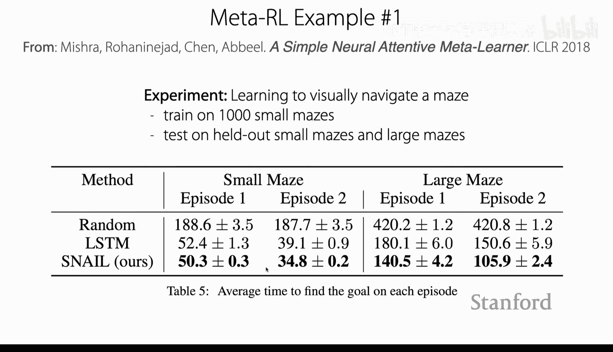

问题：在算法中，我们在哪里进行探索与利用？在这里，因为它基本上都归结为两者的这个目标。其洞察是，智能体不知道任务的具体情况。根据训练任务，它不知道自己在哪个迷宫中，不知道迷宫的结构等。因此，实际上，在开始探索并找到目标位置之前，它甚至无法获得高奖励。所以，通过端到端优化奖励，你激励它去探索，因为不探索就无法获得更高的奖励。我们很快会在接下来的课程中讨论这个问题，但确实，这里有很多问题，因为当你的策略很差且没有得到好的奖励时，很难找出一个好的策略。

问题：与其做我们正在做的事情，我们能不能只做常规的强化学习，然后在测试时进行训练？在某些方面，具有循环性的语言模型，取决于你如何看待它，已经在做类似元强化学习的事情。如果它有记忆，并且基本上有能力根据你给它的任务类型进行适应。然后，是的，另一个重要组成部分是，如果你进行测试时计算，你允许它实际思考问题。现在，测试时计算是一个非常广泛的术语。在下一张幻灯片上，我们将讨论如何实际使用元强化学习与测试时计算相关。所以现在让我们谈谈这个。

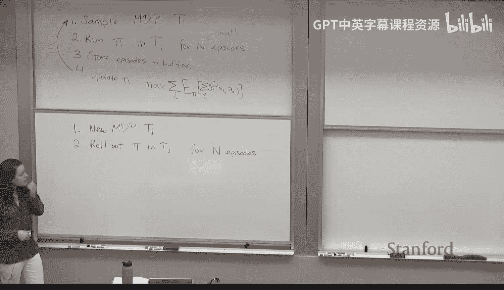

## 测试时计算与元强化学习

假设我们正在解决不同的数学问题。这是一个典型的语言模型示例，特别是对于测试时计算。一个数学问题的例子是试图证明这个不等式，我认为这可能与Orel在他的讲座中展示的是同一个数学问题。在某些方面，试图解决这个数学问题本身可以被视为一个MDP，因为你可以尝试采取不同的策略来解决这个数学问题。你事先不知道哪种策略会帮助你解决那个问题，比如从哪里开始，你是尝试猜测和检查，还是尝试消除方程中的项等等。

理想情况下，你能够探索这些不同的策略，然后基于最佳策略产生答案。事实证明，如果你给DeepSeek一个不同的数学问题来解决，如果你给它一个难题，它会思考一段时间，在某个时刻，它会切断测试时计算，因为它不想让用户等待太久，然后为用户输出一些解释。然后，如果你给它一个非常简单的问题，比如“2加2等于问号”，它实际上也会思考解决方案可能是什么，然后给出答案的逐步解释。这显然是有些浪费的，除非这本身就是一个具有挑战性的问题。

因此，你实际上可以使用元强化学习的概念来优化测试时计算。如果你知道在测试时你将进行测试时计算，那么基本上将其纳入训练过程，并鼓励模型高效地使用测试时计算，高效地探索不同的策略，这样理想情况下，在简单问题上，它会尝试尽快输出答案，而对于难题，它会根据需要思考足够多，包括可能的探索，直到它尝试利用并给出解释。

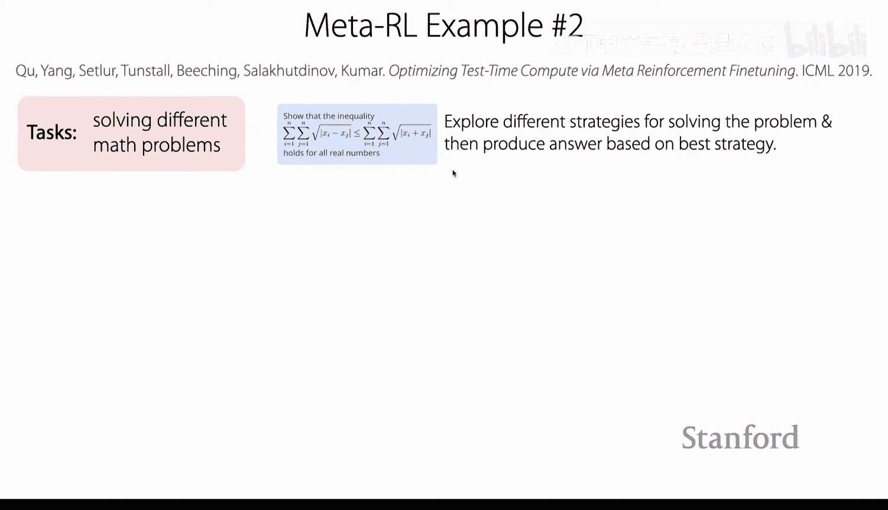

这篇论文探索了这一点。他们发现，当他们明确优化测试时计算的有效使用时，他们能够用相同数量的标记获得更高的性能，并且实际上减少了获得相同性能所需的标记数量，这样你就不会在简单问题上浪费大量标记。

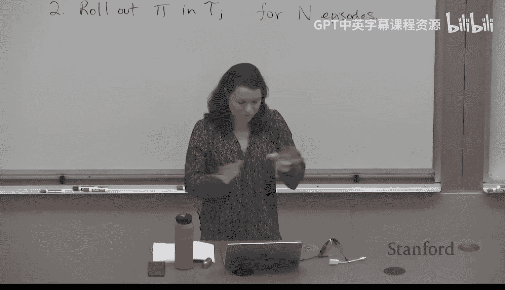

这就是元强化学习思想在语言模型中的应用案例。

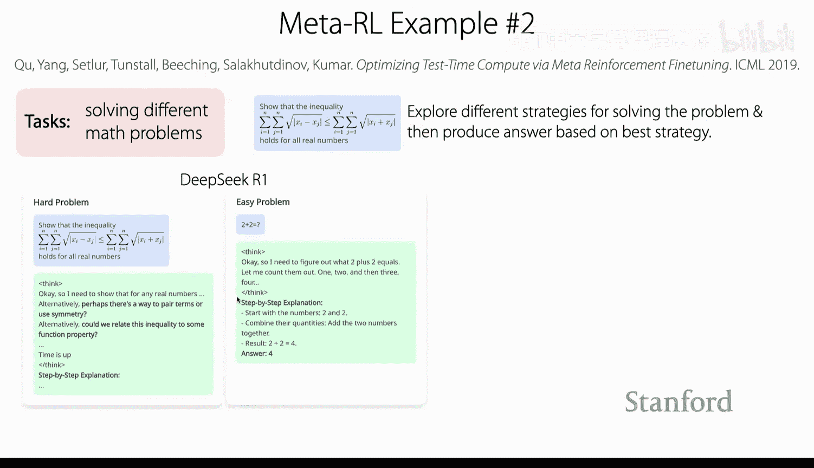

## 与其他概念的关联

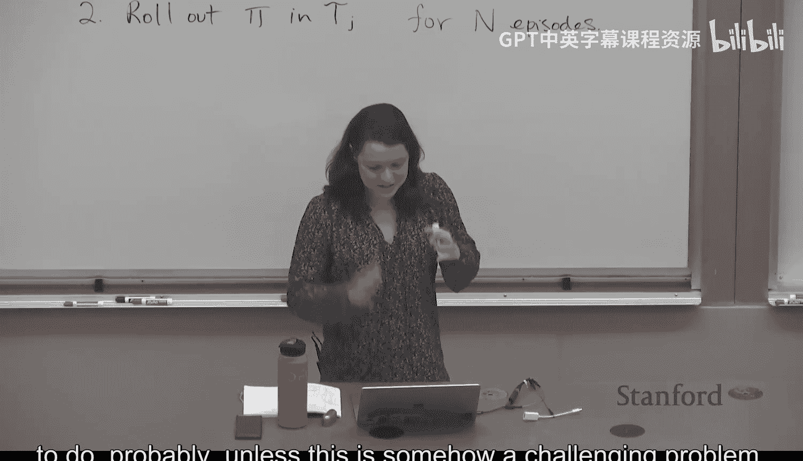

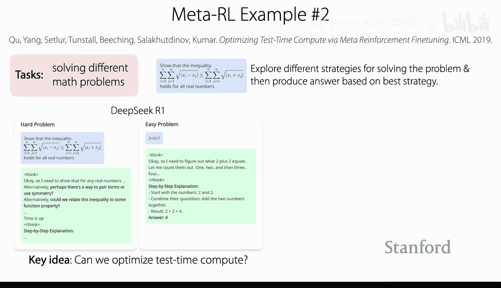

现在快速离题一下，这将引导我们以另一种方式思考元强化学习。

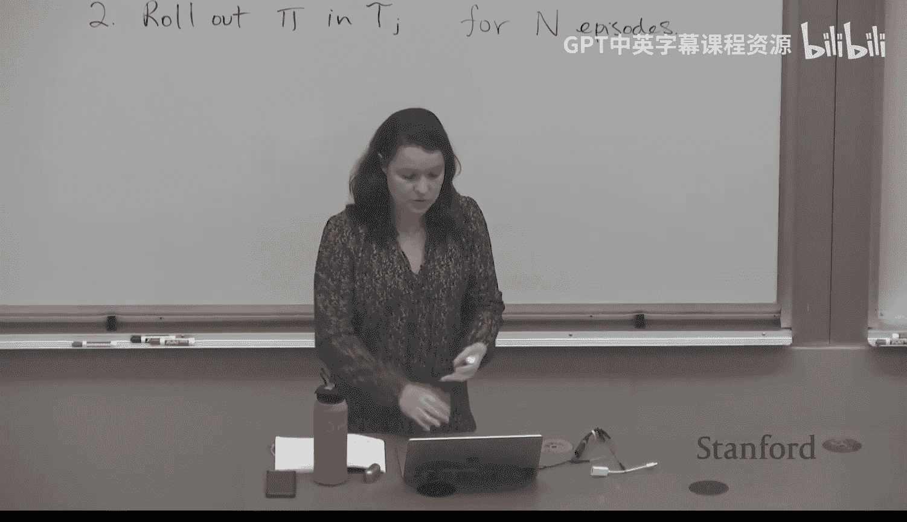

我们讨论过多任务策略，其中我们以任务描述符为条件，例如，我们可能希望机器人在不同位置堆叠或向不同方向行走。我们还讨论过以经验为输入，然后基于该数据生成动作的策略。

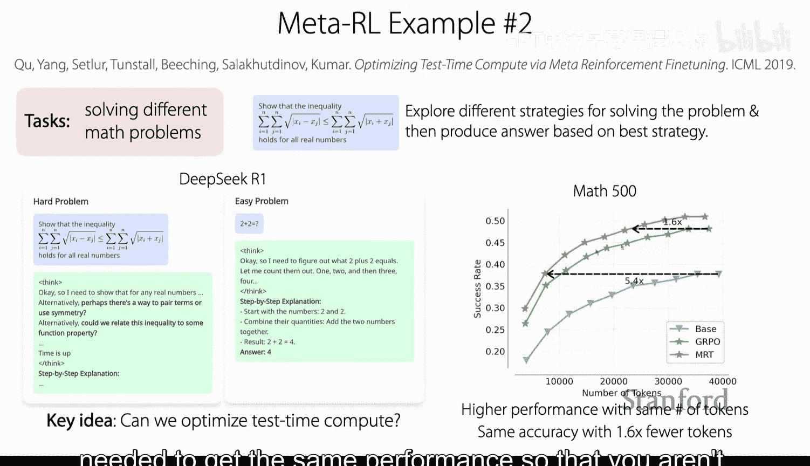

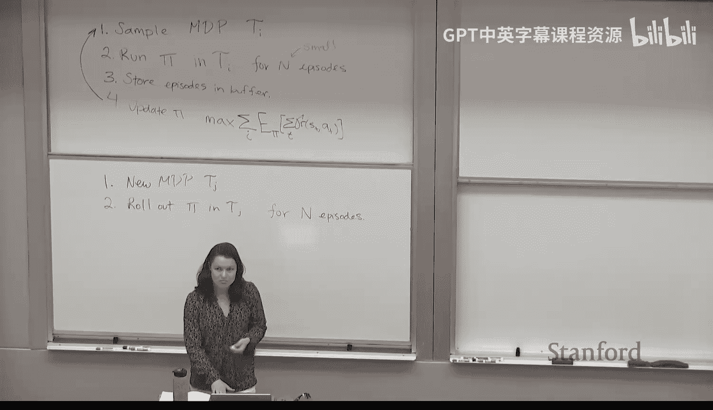

如果你思考这与多任务学习策略的关系，一种思考方式是：我们只是在做多任务学习，但现在这个数据是我们的任务标识符。它在任务内部实际上是变化的，所以这个类比并不完美，对于给定任务来说它并不是固定的，因为你可以将其视为以任务为条件，只要经验告诉你你试图做什么任务。

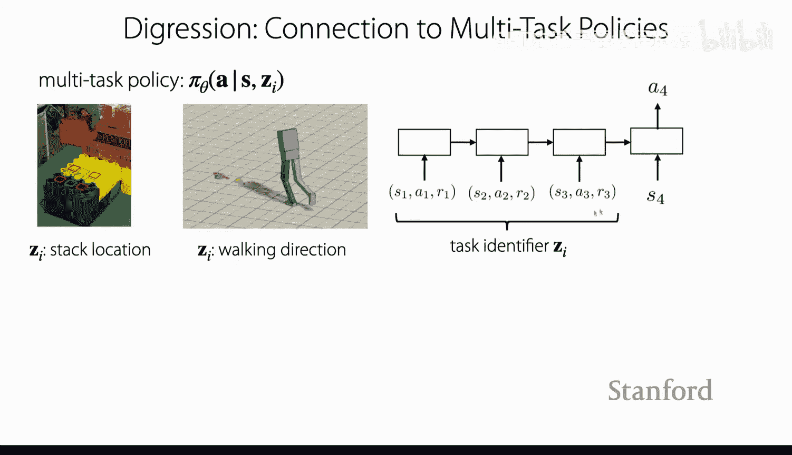

很好。如果你思考目标条件策略，奖励就像……你也可以将元强化学习视为目标条件策略的一种推广，因为有一组是目标达成的MDP，还有一组更广泛的奖励最大化的MDP。因此，另一种思考方式是：与其试图泛化到新目标，你可以将元强化学习视为试图用少量经验适应新任务，这将是目标条件情况下的零样本泛化与元强化学习情况下K个回合或K个时间步的K样本泛化之间的区别。

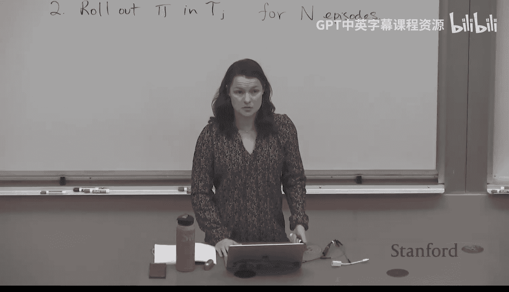

## 任务推断视角

现在，我们讨论了如何将经验视为任务描述符，即提示。但实际上还有另一种看待方式，即如果我们思考这个具有记忆的策略，它有过去的记忆，然后是我们的当前策略。

如果我们思考什么信息被传递到这里给策略，这个信息大概是关于任务的信息。具体来说，当ZI不是状态的一部分时，关于你试图解决哪个MDP存在模糊性，你正在使用该经验来尝试识别你所在的MDP。

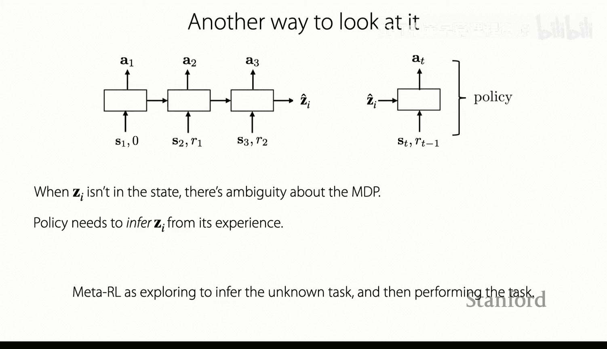

你可以将其视为策略需要推断任务，它需要从其经验中推断出某种潜在的任务描述符。因此，看待元强化学习的另一种方式是：你正在使用你的经验来推断任务是什么，然后以你对任务当前估计为条件来调整当前时间步的策略。所以你可以将其视为元强化学习试图探索以推断这个未知任务，然后执行该任务。

问题：因为我们要推断任务标识符，为什么不直接把它交给学习系统？主要原因是，如果我们没有一种紧凑的方式来描述智能体正在执行的任务，那么实际上可能具有挑战性。如果你没有好的表示方式，那么我们不确定该向策略传递什么。如果我们没有好的表示方式，我们总是可以求助于使用索引，说这是任务1，这是任务2，这是任务3。但如果你这样做，然后在测试时说这是任务100，它将无法在该场景中泛化并对该任务做任何事情。而以经验为条件则是一种可以泛化的方式，它实际上能够使用状态、奖励等更连续的空间来找出新任务。所以这归结为表示问题，你可以将其视为学习一种Z表示，即学习一个代表我们任务的连续向量。

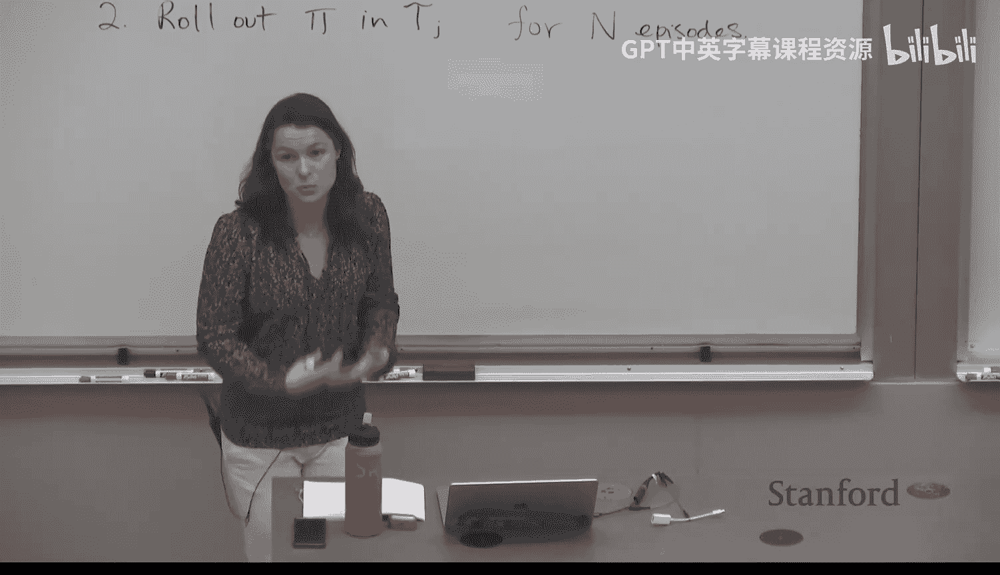

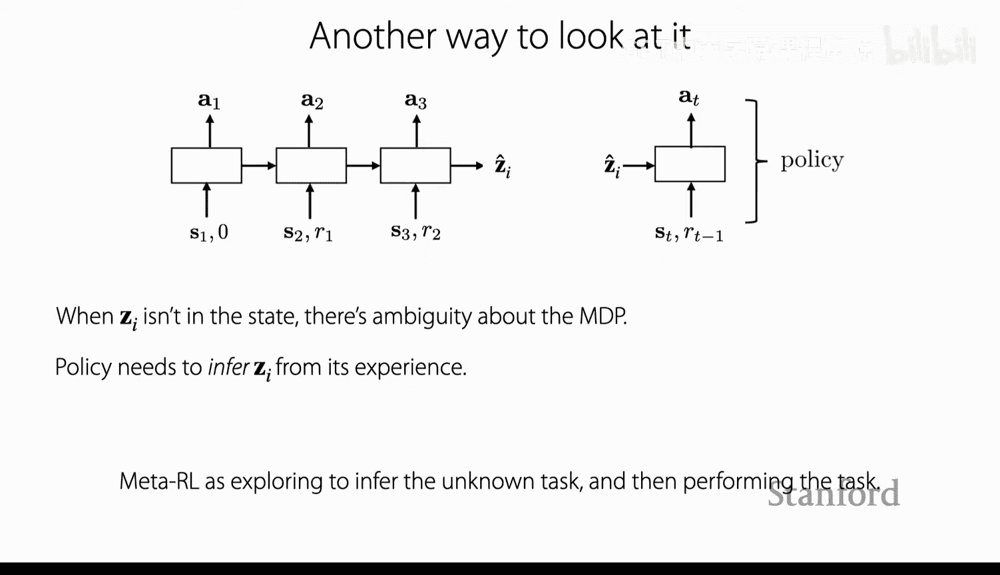

## 与POMDP的关系

在多任务强化学习中，我们讨论过如何制定一个对应于原始状态空间和Z向量的状态空间，然后你得到这个聚合MDP。因此，其结果仍然是一个MDP，只是有了新的状态空间和新的动态来解释这个新的状态空间。

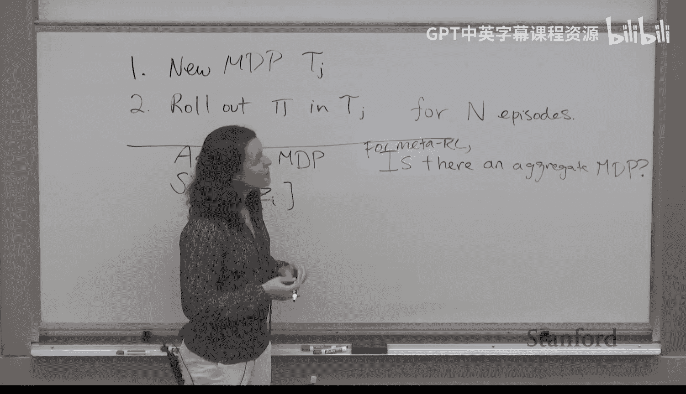

那么问题是，对于元强化学习，是否存在一个聚合MDP？在这种情况下，我们没有在状态中提供ZI。因此，实际上它本质上是部分可观察的。你实际上不知道任务是什么，你试图从经验中探索并弄清楚。因此，实际上并不存在一个你可以考虑的聚合MDP。相反，如果你想将其聚合为一个单一的决策过程，它将必须是一个部分可观察的MDP或POMDP。这实际上是一种特殊的POMDP。

我们之前讨论过，你有一个部分可观察的马尔可夫决策过程，你实际上无法观察S，你有动作，并且你不是观察S，而是观察一些作为S函数的观察值。这将是POMDP的一般情况。关于元强化学习有点特殊的是，你唯一无法观察的是任务是什么。因此，它基本上是一个POMDP，其中隐藏状态空间可以定义为观察值和任务标识符。如果你能从经验中推断出任务标识符，那么你基本上可以将其视为一种试图推断底层状态空间以解决POMDP的方式。

所以这基本上是看待元强化学习问题的另一种方式，即它基本上像一个部分可观察的马尔可夫决策过程。

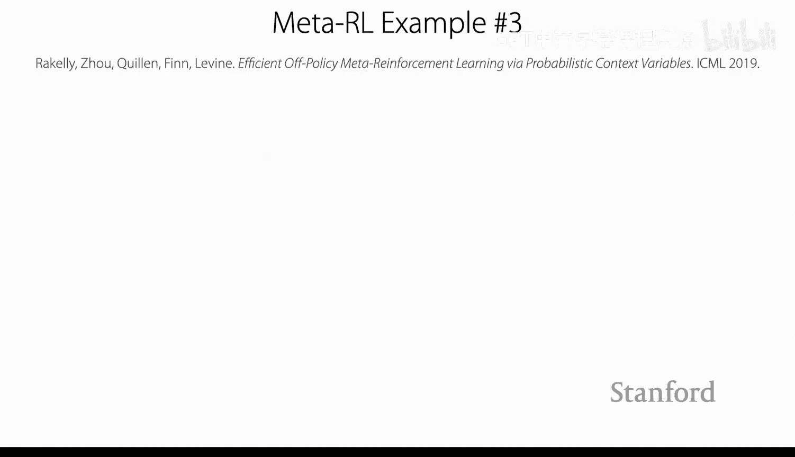

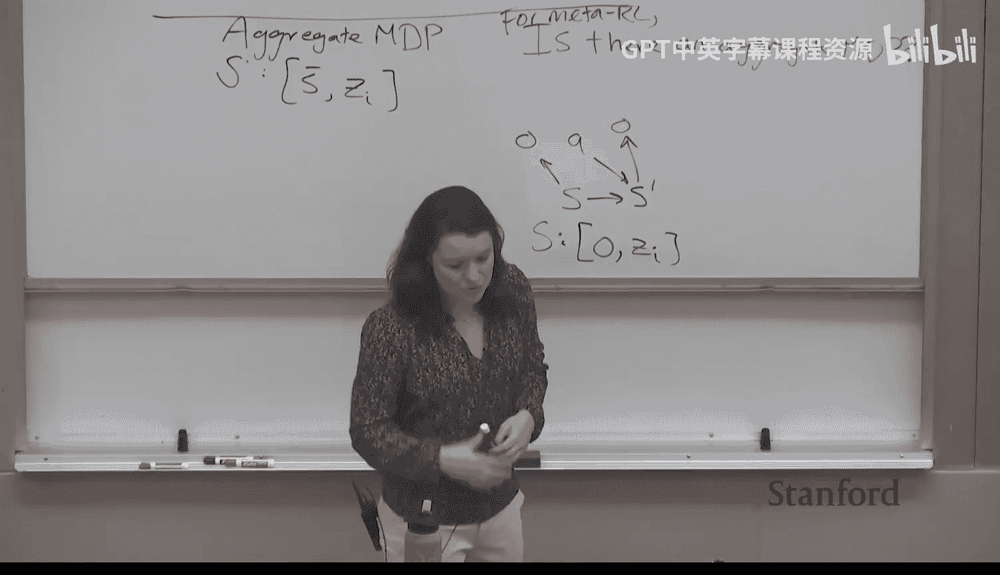

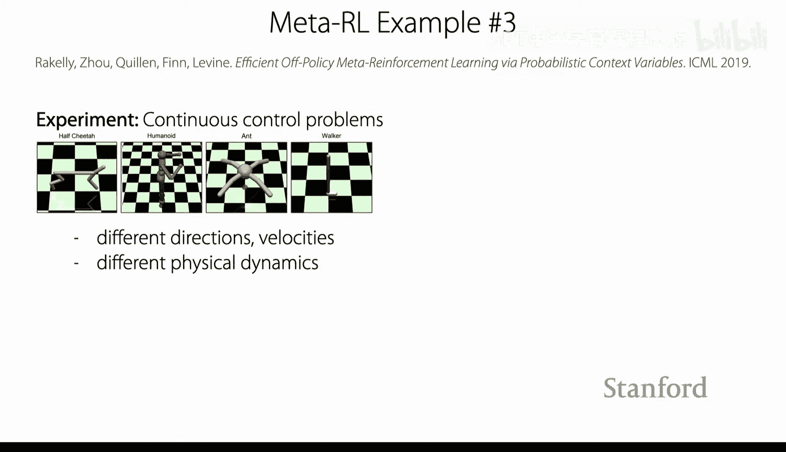

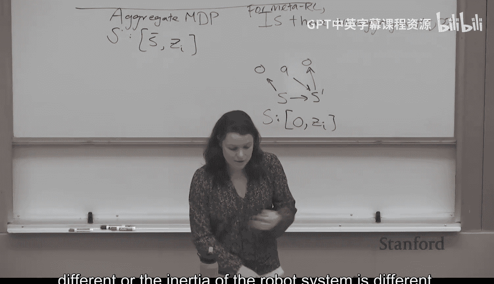

现在有一个我们实际上刚刚讨论过的元学习方法，我展示了一个架构图，它实际上明确地尝试输出Z，并且实际上输出了一些Z的分布，因为在最开始你实际上不知道Z是什么，你对Z有一些先验信念，然后随着你获得更多经验，你对Z的估计会越来越好。因此，如果你表示这种潜在任务表示的分布，那么你可以用它做一些很酷的事情，我们稍后会看到。

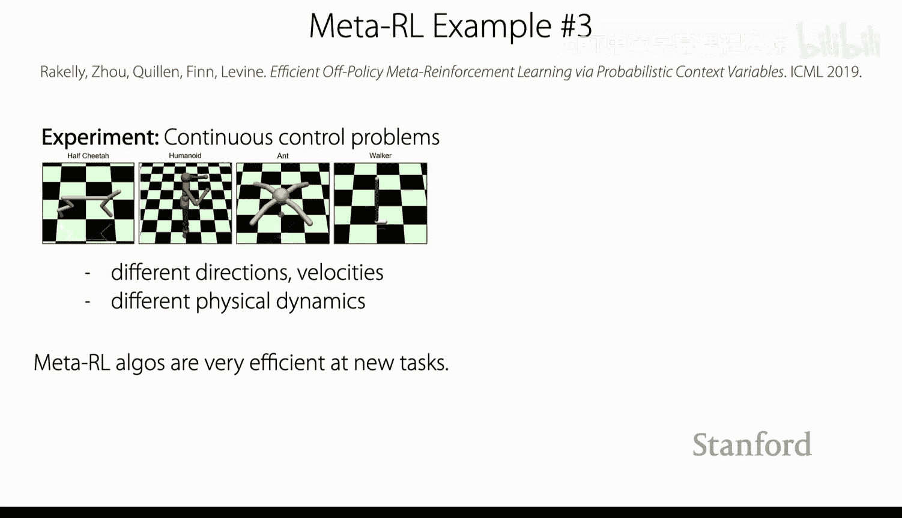

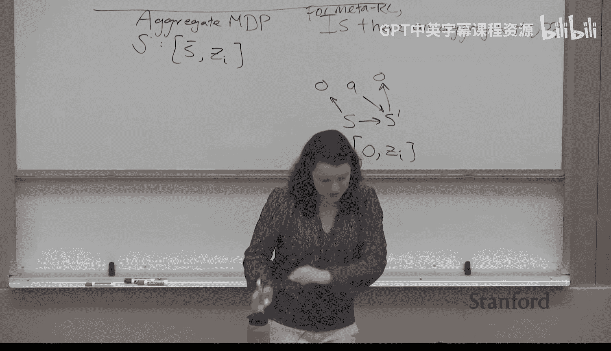

这个特定的算法着眼于连续控制问题，其中不同的任务对应于向不同方向行走、以不同速度奔跑，以及不同的物理动态，因此能够在摩擦不同或机器人系统的惯性不同时进行适应。

另一件事是，我们之前看到的一切都使用了类似PPO风格的算法，这有些离策略但不是很离策略，在某些方面它比离策略更接近在策略，因为它没有使用过去数据的回放缓冲区。

## 探索挑战

使用元学习算法，你可以非常非常快地适应。但如果你的基础算法相当接近在策略，训练过程可能会非常慢。因此，作为一个问题，希望这是一个直接的问题：如果在步骤四更新策略的基础算法是一个离策略算法，你预计这比使用在策略方法更高效还是更低效？更高效。所以，如果你使用回放缓冲区，并用该回放缓冲区更新你的记忆（具有记忆的策略），那么在元训练过程中，这应该会数据效率高得多。在测试时，当你适应时，效率将是相似的，所以这里只是讨论实际训练这种上下文学习系统的效率。

因此，如果你实际查看训练过程中的曲线，为了元学习这些系统所需的数据量，你可以看到，在蓝色中，如果我们使用带有回放缓冲区的离策略算法，它比RL²和ProMP数据效率高得多，学习速度快得多，而后两者使用的是更接近在策略的基础算法，更像PPO。

问题：能否详细说明回放缓冲区中具体有什么？通常，每个回放缓冲区将有一个回合序列，基本上回放缓冲区中的每个条目将是来自给定MDP的一系列回合，包括状态、动作、奖励。当你优化时，通常你会为每个任务设置不同的回放缓冲区，所以你可以在这里采样一个任务，然后使用来自该轨迹的记忆来优化该任务的奖励。通常，缓冲区不是只存储状态和动作，而是存储完整的轨迹在一起，因为你要训练一个具有记忆的模型，并且需要能够将该轨迹作为记忆提供给策略。

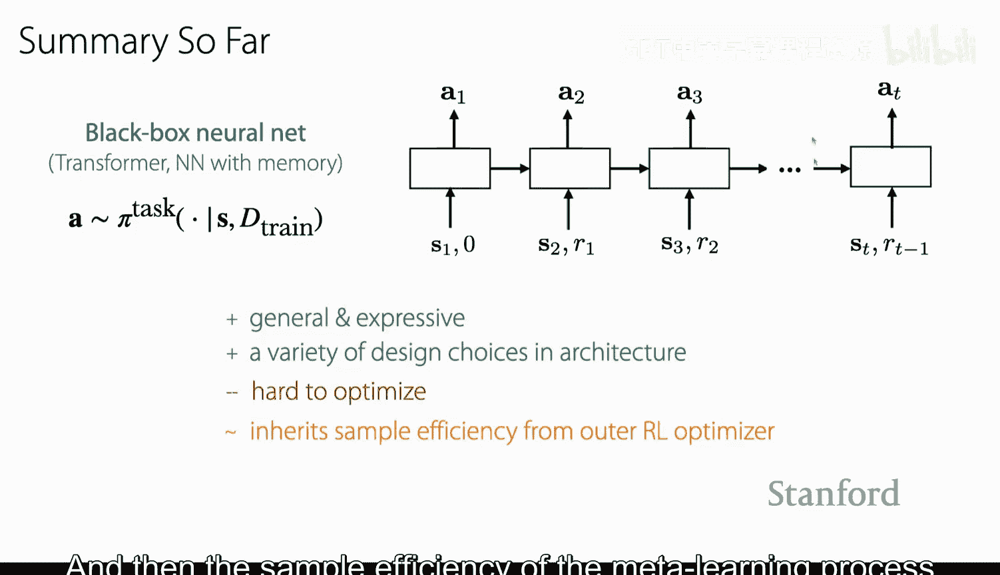

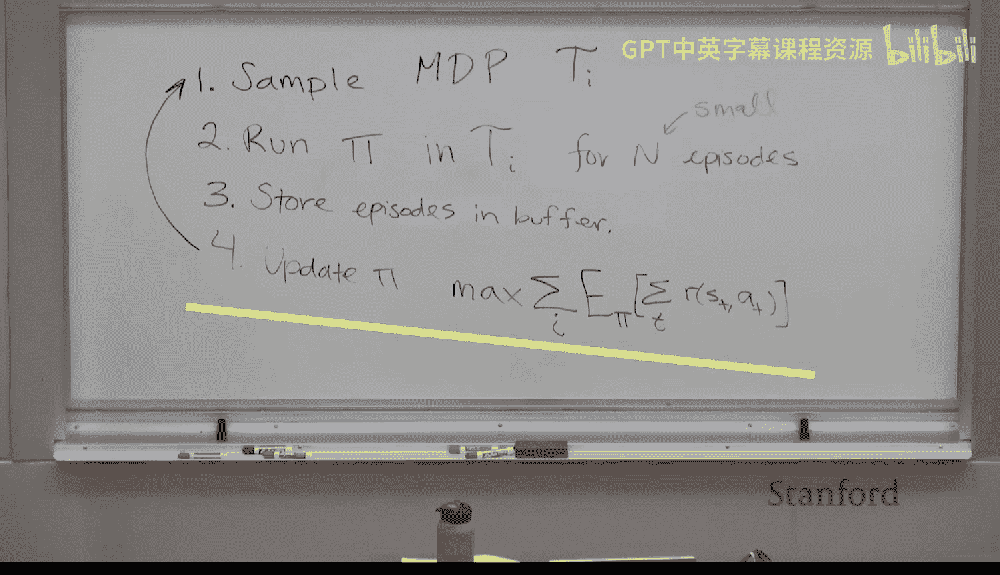

## 总结与挑战

总结到目前为止，我们讨论了使用这些模型来适应新的MDP。它们很通用，表现力很强，并且在架构选择上也有多种变化。

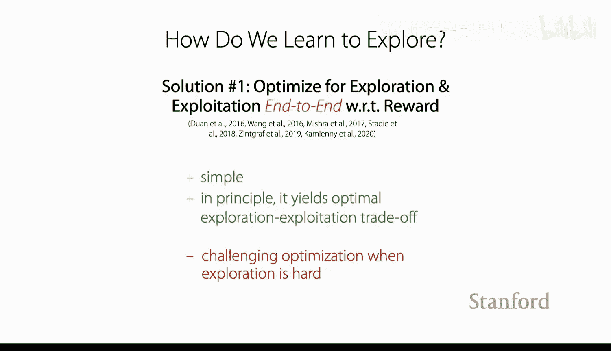

一件事是它们难以优化，因为你实际上需要从数据中找出如何适应，并且这里有很多不同的输入特征，模型必须弄清楚哪些是有用的。例如，在迷宫导航中，你作为输入传递的那些视频中，当你试图利用并学习策略时，哪些部分是有用的。因为你传递了这么多东西作为输入，模型如此之大，因此可能难以优化。从探索的角度来看，也可能难以优化，我们将在接下来讨论这一点。然后，元学习过程的样本效率将继承自你在这个最后一步中使用的任何优化器。

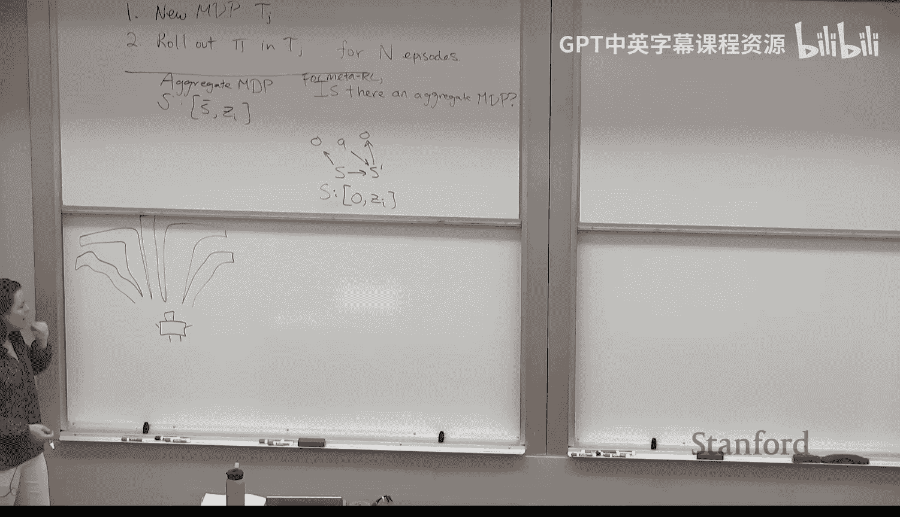

因此，如果你使用像普通策略梯度这样的方法，它将极其数据低效。如果你使用像PPO这样的方法，它会更稳定但仍然相当低效。如果你使用像SAC这样的方法，它可能会高效得多，尽管你可能需要更多地调整超参数。

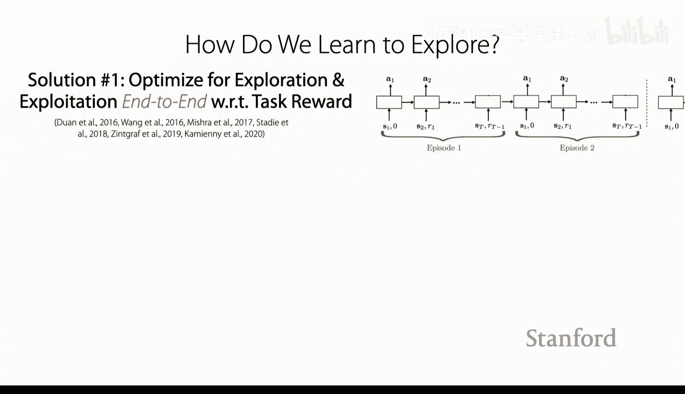

## 探索问题

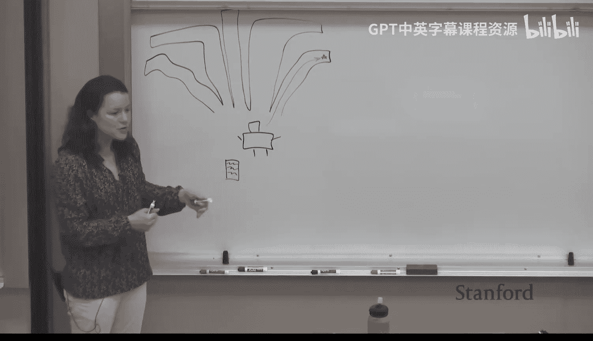

现在让我们谈谈探索。我指的是上下文中的探索，即当你试图探索一个新任务时。

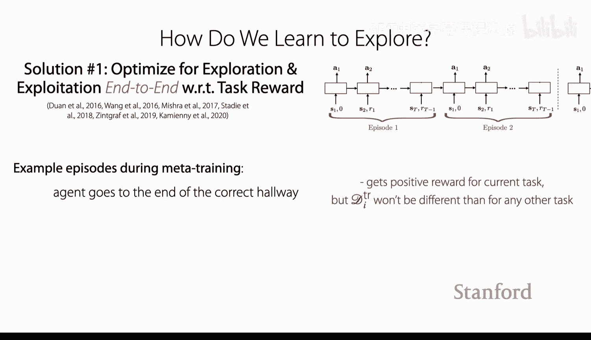

到目前为止，我们讨论的是尝试端到端优化探索和利用，以最大化最终奖励总和。原则上，这实际上可以产生最优的探索-利用权衡，因为你直接优化了奖励总和。这真的非常棒。但它可能是一个非常具有挑战性的优化问题。让我们谈谈为什么会出现这种情况。

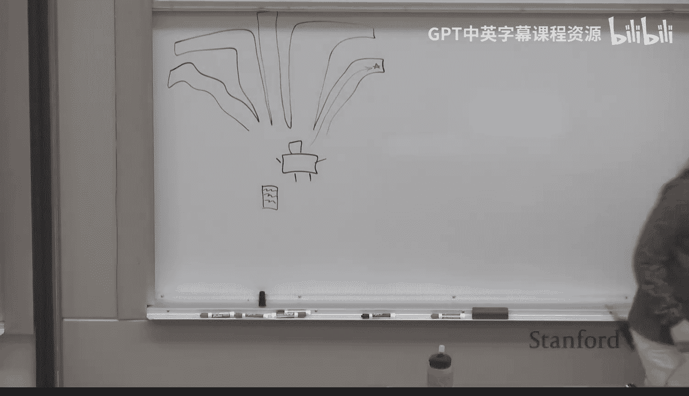

让我们看一个运行示例。假设你有一个像这样的机器人，机器人需要找到某个东西，并且有一些走廊，机器人可能需要走下去以尝试找到它试图找到的东西。不同的任务对应于它试图找到的物体的不同位置，所以在一个任务或场景中，它可能在这里，在另一个场景中，它可能在这里，等等。为了帮助机器人一点，我们将引入另一件事，即这里会有一张纸，那张纸实际上用文字说明了物体在哪里，比如它说物体可能在第四条走廊的尽头。

这是我们的机器人，这些是走廊，不同的任务对应于导航到不同走廊的尽头，并且我们有一些关于去哪里的信息，如果我们查看该信息，它将在状态中，关于这个任务的奖励在哪里。

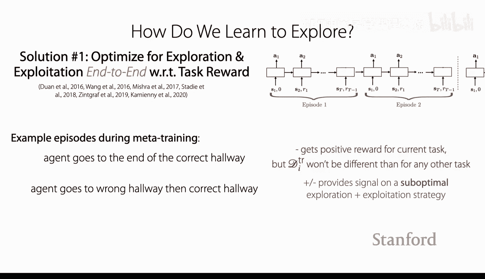

我们实际上如何学习探索？假设我们正在收集轨迹，并试图学习如何探索，以便我们能获得良好的行为。假设我们从这个场景开始，我们采样了这个任务，也许任务是去这个走廊的尽头。假设我们收集了一个轨迹，我们实际上只是很幸运，收集到了一个直接前往那个奖励的轨迹。在某些方面，这看起来不错，因为我们为此获得了奖励，这给了我们一些奖励，并且优化了我们最终关心的目标。但这件事的坏处在于，机器人很幸运，它实际上不知道如何在未来重复这一点，因为它没有实际探索任何其他选择。

因此，我们可以这样看待：它去了正确走廊的尽头，会得到正奖励，但导致获得正奖励的上下文实际上看起来与任何其他任务没有什么不同，它经过了这里，没有什么能区分它在那里做了什么（零奖励，零奖励）。例如，如果任务是去这里或去这里，结果，它实际上没有学会如何探索，也没有学会如何使用探索信息来解决问题。

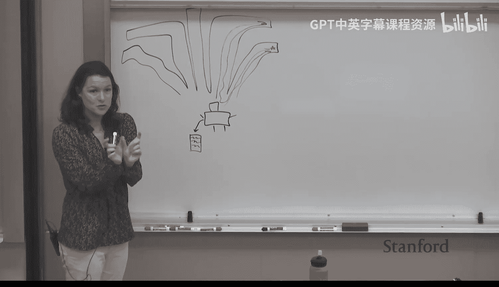

因此，这个轨迹可能对学习如何探索和学习如何利用非常有帮助。现在假设我们有一个不同的轨迹。假设智能体没有那样做，而是采样了相同的任务，它去了这个轨迹的尽头，然后继续，没有看到，然后去了这个轨迹的尽头。这将是好的，因为它实际上有经验排除了一个任务，然后因为不同的任务获得了奖励。所以它将教会它一些关于有效的探索策略的东西。缺点是，这种探索策略是相当次优的，因为首先查看说明然后去正确的位置会更高效得多。所以它有些好，也有些坏，它提供了一个次优探索和利用策略的信号，所以它可能比它做的第一个轨迹好，但仍然不理想。

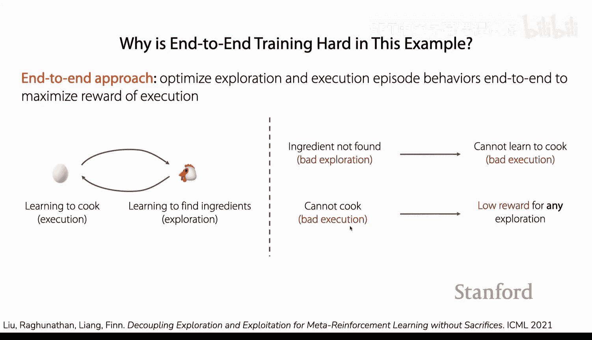

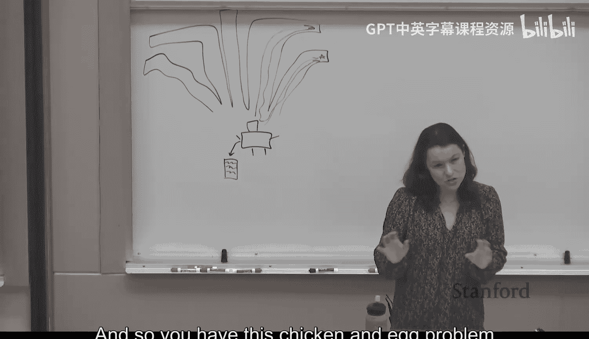

现在考虑第三个轨迹。假设我们再次为元学习过程收集数据，假设智能体决定查看说明，然后只是停留在那里看说明。有人对这对于学习过程是否有用有什么想法吗？是的，完全正确。它做了一些有用的事情，但它没有为此获得任何奖励。它只有在做了那件事然后去了这里才会获得奖励。所以这对于学习问题也不会非常有用。基本上，在这样的问题中，你只有在你成功地进行了适当的探索行为然后进行了利用行为时，才会真正学到关于如何探索和利用的有用知识。如果你在单独的回合中做它们，那么你实际上并没有获得良好的学习信号。

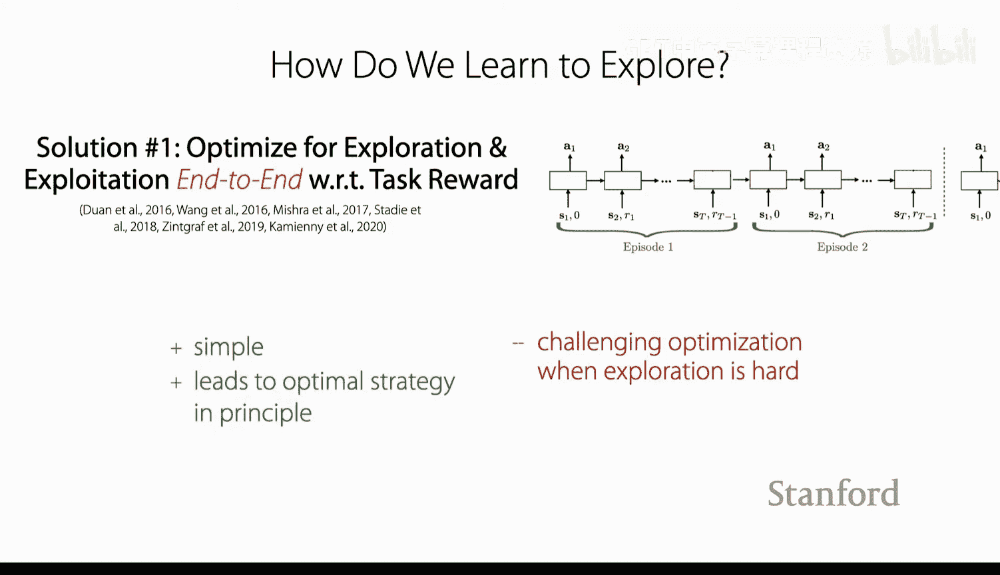

这意味着你有一种样本复杂性，你需要实际上幸运地同时做这两件事，才能获得有助于你学习问题的信号。

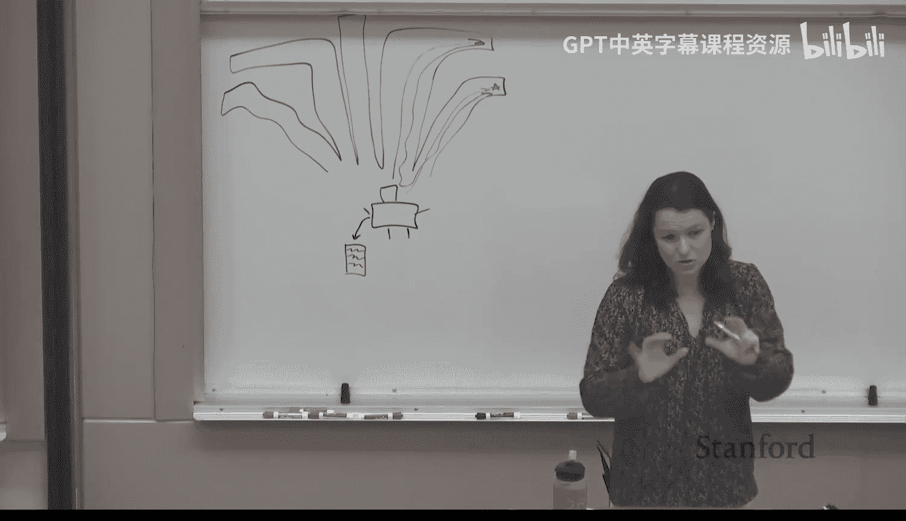

因此，基本上，同时学习如何探索和利用是困难的。另一个例子是，假设你试图学习烹饪，你在以前的厨房中有数据，你的目标是能够快速学习如何在新厨房中烹饪。现在，为了学习烹饪，你需要找到食材，如果你还没有弄清楚如何找到食材，因为你的探索能力很差，那么你就无法学习烹饪，因为你手头没有食材。然后，如果你还不知道如何烹饪，因为你没有收集过相关经验，那么无论你做什么探索，你都会得到低奖励。

所以你有一个先有鸡还是先有蛋的问题，介于学习如何探索和学习如何使用该信息解决任务之间。因此，另一种看待方式是这种耦合问题，探索和执行（或利用）相互依赖才能共同成功。

因此，端到端训练的看法是，它很棒，因为你可以学习这种最优权衡，但如果你有一个困难的探索问题，它可能极具挑战性，因为你需要弄清楚如何探索和利用，并以这种方式获得学习信号。

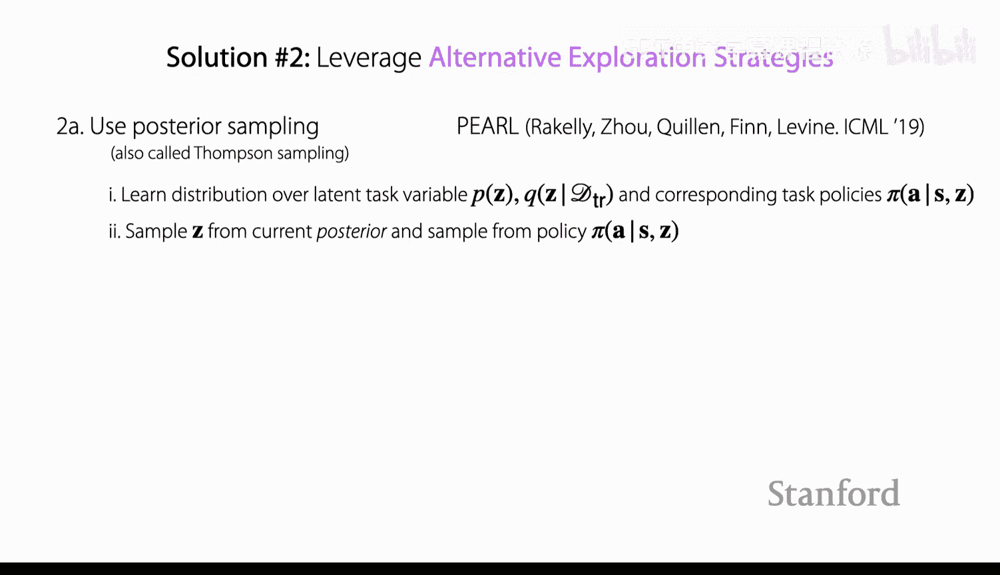

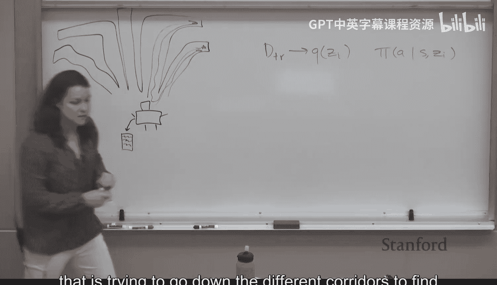

问题：这里的最终挑战是奖励稀疏吗？确实，如果你有密集奖励，你会处于一个更好的位置，因为基本上你不需要明确地进行探索。是的，你将能够……嗯，你不需要明确采取行动进行探索。这确实是在探索困难时出现的问题。如果探索很容易，这真的不是问题，因为你不再需要同时解决探索和利用，你只需要解决利用。

## 解决方案

对此有几种解决方案，我们今天将开始讨论一种解决方案，然后在周五讨论更多解决方案。我不会完全详细地介绍这些方法的工作原理。

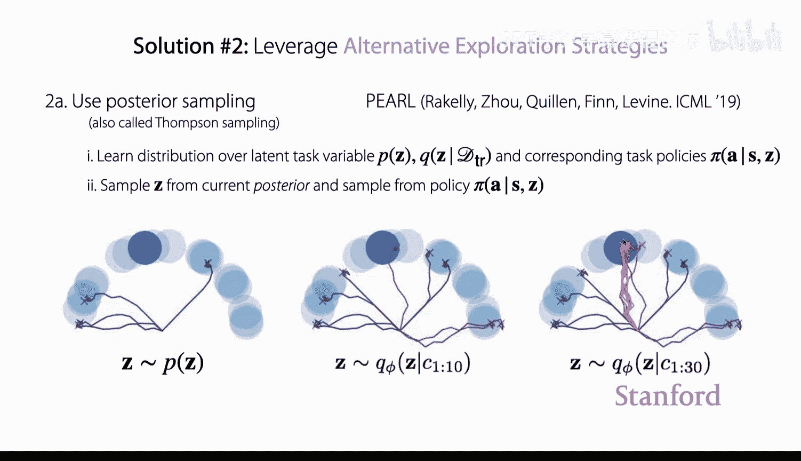

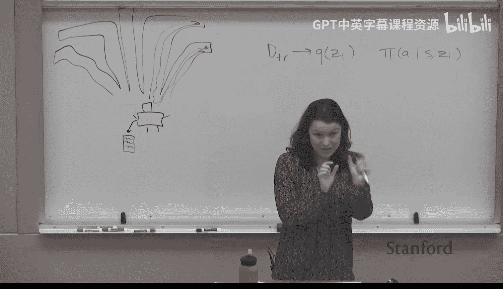

这里的第二种解决方案是，与其仅仅优化端到端奖励，你可以添加辅助探索目标，以鼓励它尝试找出关于任务的更有意义的信息。

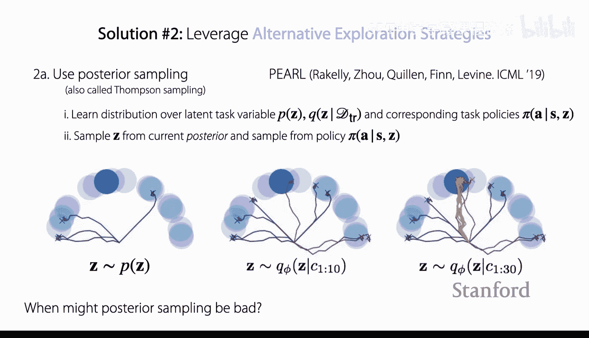

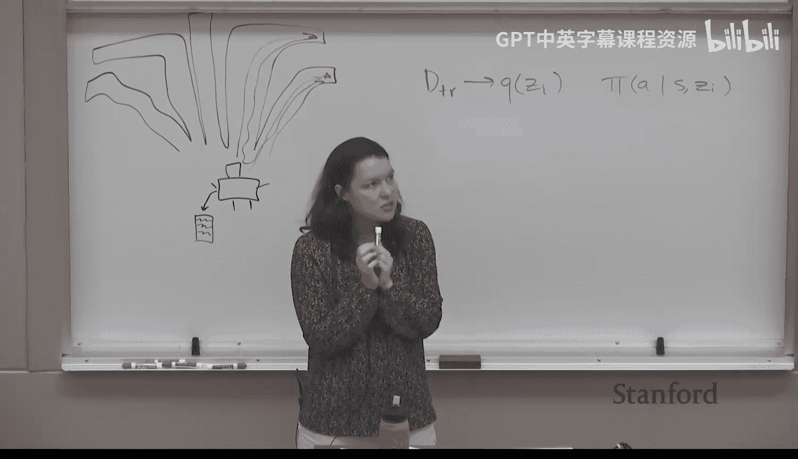

这里的一种方法是使用所谓的后验采样，也称为汤普森采样。它的工作原理是：我们讨论过一种算法，你试图推断任务是什么。如果你已经收集了一些经验，并且推断出了一些关于任务的分布（在这种情况下，ZI现在是某种潜在表示，不是已知的表示），那么你可以做的是：你可以从这个分布中采样，然后表现得好像那就是正确的任务。

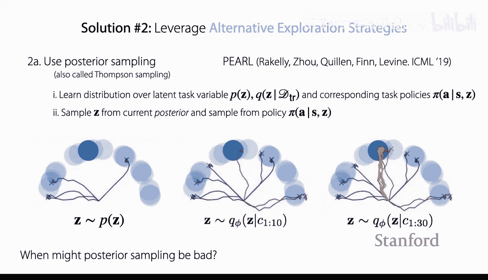

因此，如果你有这种任务推断过程，并且还有一个策略，在给定Z的估计下能够生成动作，那么你可以做的是：你可以从这个分布中采样一个Z，然后从这个策略中采样。如果你有能够这样做的策略，这开始有点解耦问题，因为如果你有对于给定Z能够执行任务的策略，那么你基本上会学习一种探索策略，试图探索不同的走廊以找到解决方案。

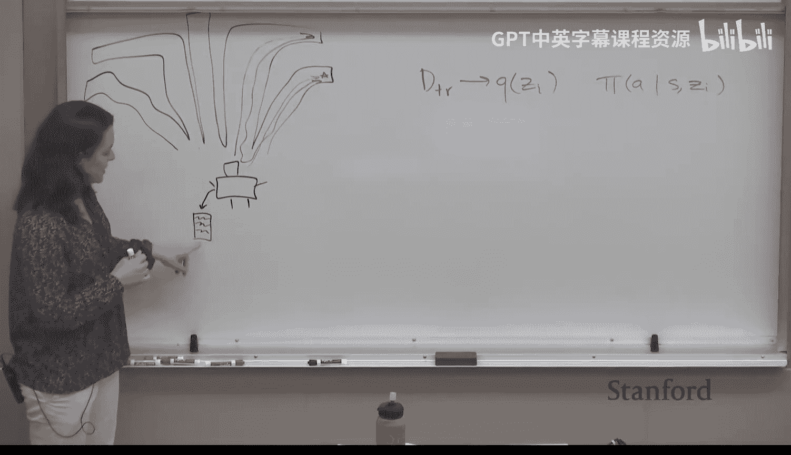

例如，这是一个看起来与走廊有些相似的问题，如果你到达这些圆圈之一，你会得到稀疏奖励，不同的圆圈对应不同的任务。在这种情况下，我们采样了这个任务。首先，我们从任务的先验中采样一个Z，没有任何数据，所以我们采样Z，然后基于这些不同的Z运行我们的策略，并根据这些进行探索。然后我们用它来推断任务可能是什么，所以现在我们知道任务可能在这里或这里。因此，现在你将收集颜色较浅的轨迹，像这个，这个，然后去这里。一旦你实际收集了这个轨迹，那么你应该对任务有一个更窄的分布，因为你在这里获得了正奖励，所以你的策略或你的Z分布将在这里变窄，你将根据那些Z执行你的策略。

因此，这是解决探索问题的一种方法，基本上是学习这种任务的潜在表示，然后从该分布中采样任务，并根据你对该任务的策略行动。

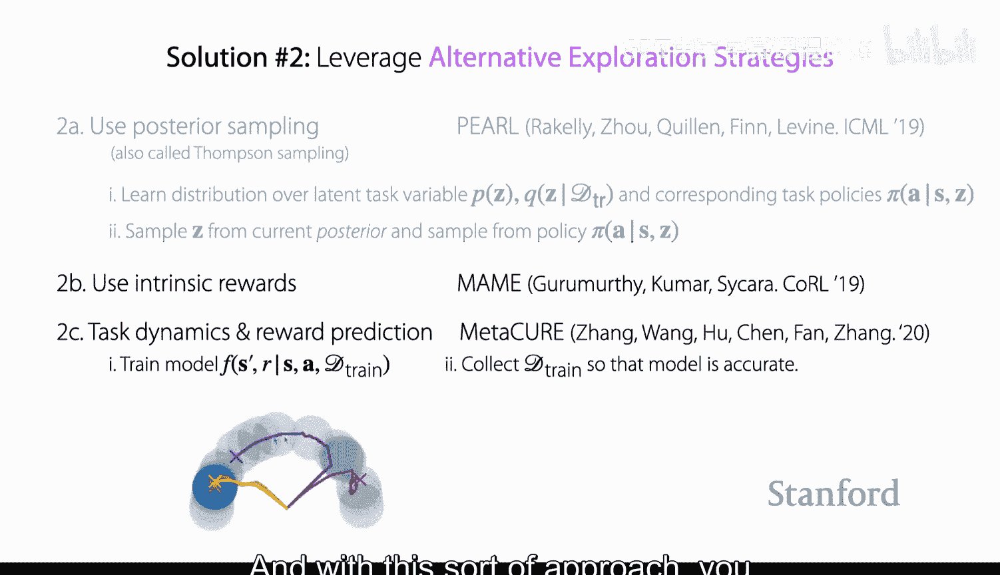

有人对这种情况很好而其他情况不好的场景有什么想法吗？这种采样可能在什么时候不好？在什么样的MDP中可能效果不佳？如果你有一个大的动作空间，那可能会造成影响，尽管这不仅仅与动作空间有关，因为如果你在大的动作空间中有密集奖励，你可能没问题。如果超出分布，当然会有问题，但即使在分布内，也有场景下这种探索策略会很糟糕。是的，所以一个可能更差的场景是，如果你开始看到一些奖励，但另一个场景中可能有更好的奖励，你可能会开始过早利用，尽管如果它知道还有其他任务可能有更高的奖励，它不会排除那些更高奖励的场景。

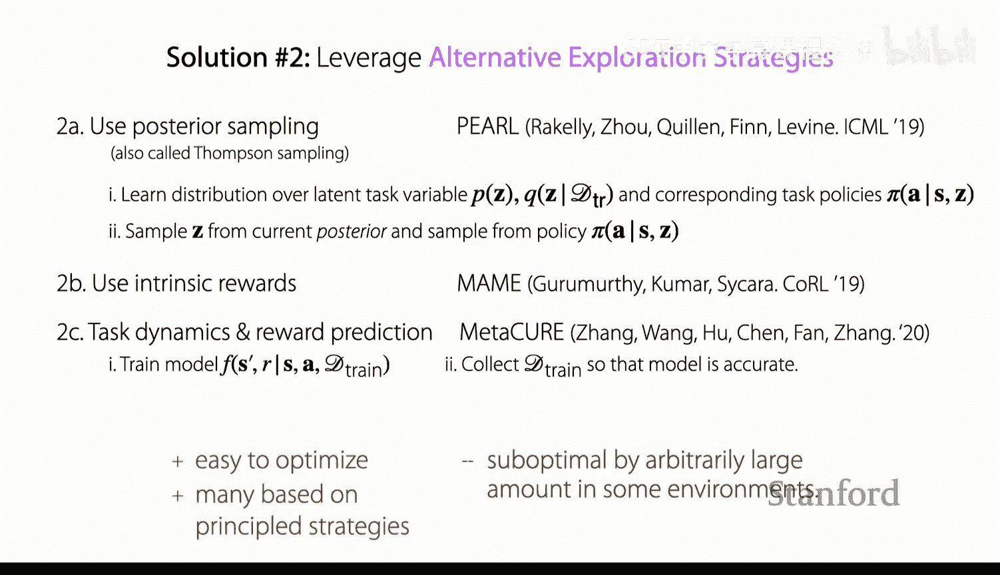

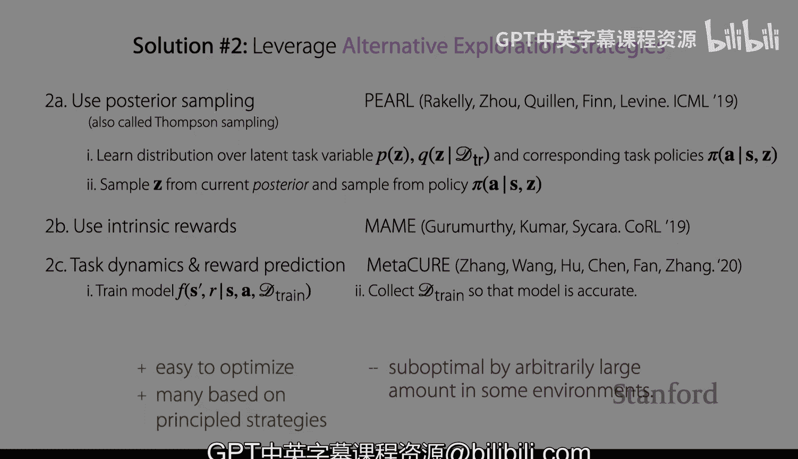

我想到的这种可能相当糟糕的场景实际上很像这里的这个场景。后验采样在这种情况下学习的策略不是查看说明，而是会走下每个走廊并试图找到奖励，因为它试图通过执行对应于不同任务的策略来明确探索。如果