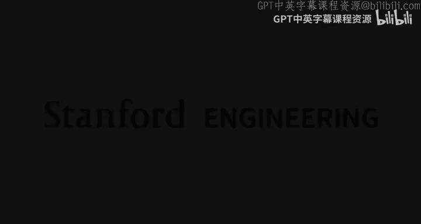
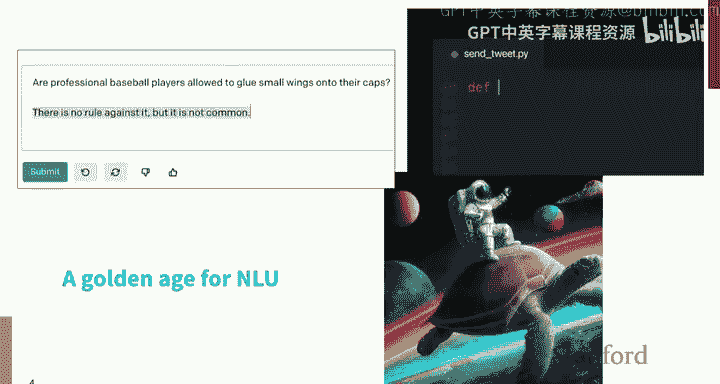
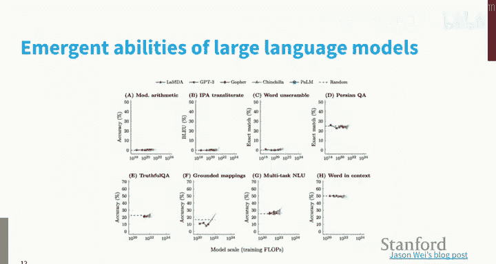
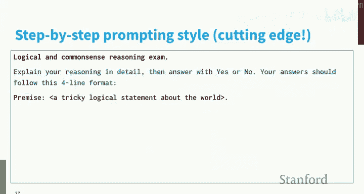
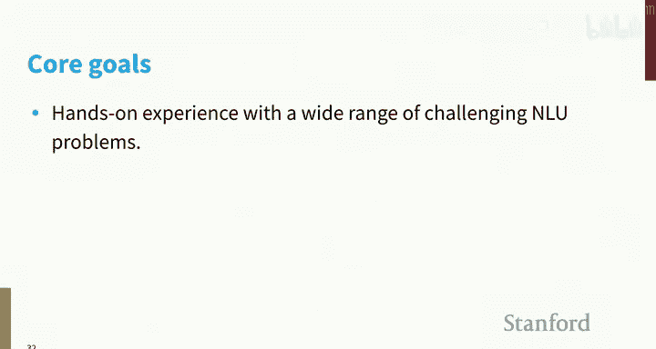
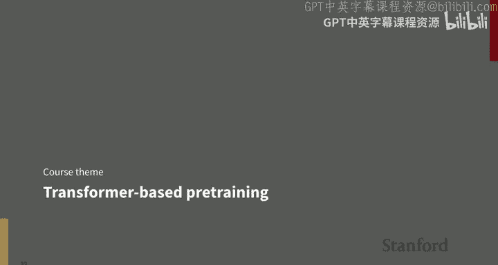
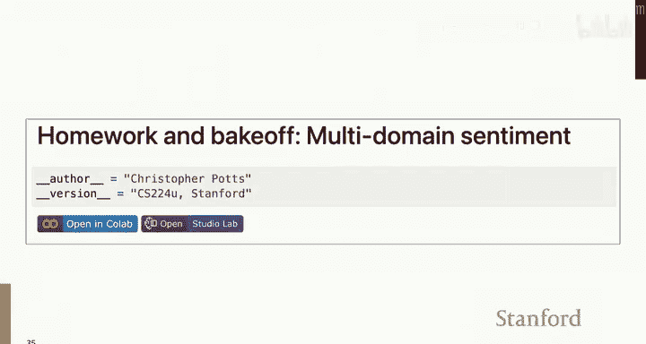
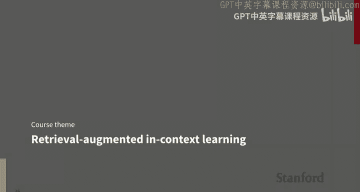

# 1：引言与自然语言理解的演进（第一部分）🚀

在本节课中，我们将要学习自然语言理解领域的概览，回顾其发展历程，并探讨当前研究的关键驱动力与核心概念。

欢迎来到自然语言理解课程。当前是进行自然语言理解研究的一个奇特、美妙，或许也令人担忧的时刻。我今天的首要目标是让我们沉浸于这个时刻，思考我们如何走到今天，以及现在进行研究是怎样的体验。这将为我们思考课程内容以及如何让你们以自己选择的方式参与当前人工智能的诸多方面奠定良好基础。这是一个尤其具有影响力的时刻。本课程以项目为导向，我相信我们可以引导你们所有人达到能够做出有意义贡献的水平，以令人兴奋且具有影响力的方式参与到这个持续发展的时刻中，这是本课程的根本目标。

现在，让我们思考当前时刻。这对我来说总是一个反思的时刻。我于2012年开始教授这门课程，现在看来那似乎是很久以前了，但在我的个人经历中感觉并不遥远。然而，就课程内容而言，2012年确实感觉像是很久以前。在2012年的第一天，我有一张幻灯片看起来是这样的。我说，这是进行自然语言理解研究的一个激动人心的时刻。我注意到，在经历了很长一段人们主要关注句法等内容的时期后，该领域重新引起了广泛兴趣。当时普遍认为自然语言理解即将取得突破并产生巨大影响，这与商业事务相关，并且斯坦福毕业生的就业市场非常火爆。这种说法的很大一部分源于当时我们正处于Siri刚刚推出、Watson在《危险边缘》节目中获胜的时刻，我们拥有所有这些家用设备，所有科技巨头都在这个新兴的自然语言理解领域展开竞争。

让我们快进到2022年。我当时确实觉得应该更新那张幻灯片，将其表述为“这是有史以来最激动人心的时刻”，而不仅仅是“一个激动人心的时刻”。但我强调了相同的事情：我们再次感受到该领域重新引起了兴趣，尽管现在这种兴趣已经极度强化；行业兴趣也是如此，此时的行业兴趣让2012年的情况看起来微不足道。系统变得非常令人印象深刻，但我在此仍然坚持认为，它们很快会暴露出弱点，自然语言理解的核心问题远未解决，因此重大突破仍在未来。我要说的是，即使自2022年以来，我们也感觉到加速，一些我们过去关注的问题感觉不那么紧迫了。我不会说它们已经解决，但随着模型变得更好，我们在这些问题上取得了很大进展。但对我来说，这意味着未来有更多令人兴奋的事情，我们可以处理甚至更雄心勃勃的问题。你们会看到，我已经尝试彻底改革这门课程，对我们可能承担的问题类型抱有更大的雄心。

但我们确实生活在这类事物的黄金时代。即使在2022年，我也不确定我会预测什么，更不用说2012年了，我们会拥有像DALL-E 2这样令人难以置信的模型，它可以将文本转换成这些令人惊叹的图像；语言模型，它们或多或少将成为我们本季度的明星；还有可以从自然语言生成代码的模型；当然，正如我们此刻所见，与网络搜索相关的整个行业正在围绕自然语言理解技术重塑。因此，当我们在2012年开始这门课程时，这感觉像是自然语言处理领域的一个小众领域，而现在感觉整个自然语言处理领域，甚至在某些方面是整个人工智能领域，都聚焦于这些自然语言理解问题，这对我们来说是令人兴奋的。

这里还有另一个反思的时刻。多年来，在这门课程中，我们使用简单的例子来突出现有模型的弱点。一个经典的例子就是这个问题：“哪些美国州不与任何美国州接壤？”这里的想法是，这是一个简单的问题，但由于其中的否定词“不”，它可能对我们的语言技术来说很难。

1980年有一个著名的系统叫做Chat-80，它是一个符号系统，代表了自然语言处理研究的第一个主要阶段。你们可以在这里看到该系统的一个片段。Chat-80是一个令人难以置信的系统，因为它可以回答诸如“哪个与地中海接壤的国家与一个被人口超过印度的国家接壤的国家接壤？”这样的问题。我在这里给出了答案：土耳其，至少根据1980年代的地理知识。但如果你问Chat-80一个简单的问题，比如“哪些美国州不与任何美国州接壤？”，它只会说“我不明白”。它是一个表达能力极强的系统，但也很僵化，正如你们从第一个问题所看到的，它可以非常深入地处理某些事情，但对于超出其能力范围的事情，它会完全失败。

那是1980年代。让我们快进到2009年左右，这门课程启动的时候，Wolfram Alpha出现了。这被认为是一种革命性的语言技术。该网站仍然存在，令我惊讶的是，如果你搜索“哪些美国州不与任何美国州接壤？”，它仍然会给出以下行为：它只是给你一个美国州的列表，这表明它没有能力理解所提出的问题。

那是2009年。所以我们从1980年走到了2009年。好吧，让我们看看2020年。这是OpenAI的第一个模型Ada：“哪些美国州不与任何美国州接壤？”答案是“没有”，然后它开始胡言乱语：“美国边境不是州边境。”它这样持续了很长时间。但关于Babbage模型，这仍然是2020年。“哪些美国州不与任何美国州接壤？美国州的名字是什么？”然后它真的开始偏离主题，同样持续了很长时间。那是Babbage模型。如果你看到这个输出，至少对我来说，可能会动摇我对这是一种可行方法的信心。但团队坚持了下来。

我想，2021年，这是Curie模型：“哪些美国州不与任何美国州接壤？”它有一个问题，它开始列举东西，但它确实说了“阿拉斯加、夏威夷和波多黎各”，这是一个比第一个答案更有趣、更令人印象深刻的答案。它仍然在理解如何回应方面有些问题，但看起来我们看到了一些信号。

DaVinci-instruct-beta，这是2022年。我认为重要的是，这是第一个名字中带有“instruct”的模型，我们稍后会讨论这一点。“哪些美国州不与任何美国州接壤？”“阿拉斯加和夏威夷。”从2020年到2022年，我们看到了这种惊人的飞跃，使得之前的一切都相形见绌。最后是text-davinci-003，这是当时最新的最佳模型之一（至少在两个月前）：“哪些美国州不与任何美国州接壤？”“阿拉斯加和夏威夷是仅有的两个不与任何其他美国州接壤的美国州。”确实是一个非常令人印象深刻的答案。如果你们思考一下我给出的这段简短历史，这是该领域正在发生的事情的一个缩影：很长一段时间没有太大进展，伴随着一些炒作，而现在在最近几年，这种快速进步正在发生。

你们知道，这只是一个例子，但这样的例子成倍增加，我们可以量化这一点。这是另一个令人印象深刻的案例：我问DaVinci-002模型：“斯坦福大学成立于哪一年？它何时招收了第一批学生？现任校长是谁？它的吉祥物是什么？”这确实是一个复杂的问题。它在所有方面都给出了流畅且事实正确的答案。这是DaVinci-003模型，它在几周前还是最佳模型，它给出了完全相同的答案，非常令人印象深刻。

在本课程中，你们会在网站上看到，我们建议课程开始时阅读的一篇经典论文是Hector Levesque的《论我们的最佳行为》。这篇文章的核心思想，本质上借鉴了Terry Winograd和Terry Winograd的图式，即我们应该提出一些例子来测试模型是否深刻理解，特别是要超越对训练数据统计信息等的简单记忆，真正探究它们是否理解世界是什么样的。Levesque和Winograd的技术是提出非常不可能的问题，而人类对此有非常自然的答案，例如Levesque提出的问题之一是：“鳄鱼能跑障碍赛吗？”也许这是你们从未想过的问题，但你们在这个群体中可能有一个相当一致的答案。“鳄鱼能跑障碍赛吗？”在这里，我问了另一个Levesque的问题：“职业棒球运动员被允许在他们的帽子上粘小翅膀吗？”你们可以思考一下。DaVinci-002模型当时说：“没有规则禁止这样做，但这并不常见。”当时这对我来说似乎是一个非常好的答案。然而，当DaVinci-003引擎出现时，这开始让我担心了：“不，职业棒球运动员不允许在他们的帽子上粘小翅膀。美国职业棒球大联盟对球员制服和帽子的外观有严格规定，任何对帽子的修改都是不允许的。”好吧，我以为我对这个感觉良好，但现在我自己甚至都不知道答案是什么了。职业棒球运动员被允许在他们的帽子上粘小翅膀吗？我们有两个非常自信但相互矛盾的答案，来自两个关系非常密切的模型。我希望这开始让我们有点担心，但仍然令人印象深刻。你们可以查一下。是的，我有几个案例，这肯定是我们进行的一个有趣实验。让我稍后展示我得到的回复。

不过，我想，如果你们看过电影《银翼杀手》，这开始感觉像是为了弄清楚我们正在交互的代理是人类还是人工智能，我们需要非常复杂的面试技巧。图灵测试早已被遗忘，现在我们进入了试图通过对我们与它们交互的事情类型非常聪明来弄清楚我们正在与哪种代理交互的模式。

这有点像是轶事证据，但我认为进步的画面也得到了该领域正在发生的事情的支持。让我从这个故事开始，谈谈我们的基准测试。这里的标题是：我们的基准测试，即我们用来探测模型的任务和数据集，正以前所未有的速度饱和。我将阐明“饱和”的含义。我们这里有一个小框架：沿着X轴是时间，可以追溯到20世纪90年代；沿着Y轴是一个标准化的度量，表示距离我们称为“人类表现”的红色零线的距离。每个基准测试都以自己特定的方式设定了所谓的人类表现估计。我认为我们应该对此持怀疑态度，但尽管如此，这将成为我们衡量进步的一个标志。

第一个数据集，MNIST，这是像数字识别这样的著名任务，于20世纪90年代在人工智能领域推出。我们花了大约20年时间才看到一个系统在这种非常宽松的意义上超越了人类表现。Switchboard语料库，这是从语音到文本的任务，故事非常相似，于90年代推出，我们花了大约20年时间才看到一个超人的系统。ImageNet，我相信是在2009年推出的，我们花了不到10年时间就看到一个系统超越了那条红线。

现在进步将真正加速。SQuAD 1.1，斯坦福问答数据集，于2016年推出，大约三年时间就在这个意义上饱和了。SQuAD 2.0是该团队尝试提出一个更难的问题，其中包含无法回答的问题。但系统超越那条红线的时间甚至更短。然后我们有了GLUE基准测试，这是自然语言理解中一个著名的多任务基准测试。当它推出时，我们很多人认为GLUE对现有系统来说太难了，看起来这可能是一个会持续很长时间的挑战。但系统超越人类表现只用了不到一年时间。回应是SuperGLUE，但它饱和得甚至更快。

现在，我们可以对这个“人类表现”的概念持尽可能的怀疑态度，我认为我们应该思考这样称呼它是否公平。但即使抛开这一点，这看起来无疑是一个进步的故事。我们在2012年拥有的系统甚至无法进入GLUE基准测试，更不用说取得这样的分数了。所以，有意义的事情已经发生。你们可能会认为，按照人工智能的标准，这些数据集有点旧了。这是Jason Wei的一篇帖子，他在其中评估了我们最新、最强大的大型语言模型在一系列主要是新任务上的表现，这些任务实际上是为了压力测试这类新型超大型语言模型而设计的。Jason的观察是，我们看到这些模型在超过100个任务上出现了涌现能力，尤其是我们最大的模型。不过，重点是我们再次认为这些任务会持续很长时间，而我们看到的却是系统一个接一个地，肯定在取得进展，在某些情况下，达到了我们为人类设定的标准。

这又是一个令人难以置信的进步故事。所以我希望这能激励你们，也许有点令人生畏，但我希望从根本上激励你们所有人。接下来我想问你们的问题是：到底发生了什么？是什么推动了所有这些突然的进步？让我们感受一下，这将作为课程本身的基础。

在我开始之前，有什么问题或评论吗？有什么我可以澄清或我遗漏的关于当前时刻的事情吗？Bard做得很好。不过，也许我们应该作为一个群体反思一下“做得很好”意味着什么。我的问题是，当你们说它做得很好时，美国职业棒球大联盟关于球员在帽子上粘东西的规则是什么？你们找到了实际的规则吗？“不”是我……你们找到了吗？我没有找到，是Bard找到了那条规则并给了我那个数字。是的，这将是我们面临的问题。我可以得到，哪个是正确的？幻觉。好吧，我将向你们展示，OpenAI模型会给我提供链接，但这些链接无处可去。你们指出的，我认为是一个日益严重的社会问题：这些模型向我们提供看似证据的东西，但很多证据都是捏造的，这比不提供任何证据更糟糕。我真正需要的是一个了解美国职业棒球大联盟的人告诉我关于球员和他们的帽子的规则是什么。我希望从一个专家人类那里得到，而不是一个专家语言模型。成立。那是什么，我们可以谷歌吗？不过要小心如何谷歌，我想这是2023年的教训。

好吧，到底发生了什么？让我们开始在这方面取得一些进展。再次，首先是一点历史背景。我有一个时间线，沿着X轴可以追溯到20世纪60年代，这大致是该领域本身的开始。在那个早期时代，本质上所有的方法都基于符号算法，就像我展示的Chat-80。事实上，你们知道，这某种程度上是在斯坦福大学开创的，由那些开创人工智能领域本身的人们开创。这种本质上对这些系统进行编程的范式一直持续到20世纪80年代。

在90年代和21世纪初，我们迎来了整个人工智能领域，进而自然语言处理领域的统计革命。那里的重大变化是，我们不再用所有这些规则来编程系统，而是要设计机器学习系统，试图从数据中学习。在底层仍然涉及大量编程，因为我们会编写许多特征函数，这些是帮助我们检测数据特征的小程序，我们希望我们的机器学习系统可以从这些特征函数的输出中学习。但最终，这是完全数据驱动的学习系统的兴起，我们只是希望某种优化过程能为我们带来新的能力。

下一个大阶段是深度学习革命，这大约始于2009-2010年。可以肯定的是，斯坦福大学处于这一领域的前沿。当时感觉这是一个巨大的变化，但回想起来，这与这里的模式并没有太大不同。只是我们现在用真正的大模型、非常深的模型取代了那个简单模型，这些模型具有从数据中学习事物的巨大能力。我们也开始看到进一步远离那些特征函数、远离编写程序，更多地转向一种模式，即我们只希望数据和优化过程能为我们完成所有工作。

然后发生的下一件大事，我想可以带我们到大约2018年，是这种模式：我们有很多预训练参数。这些可能是大型语言模型或计算机视觉模型的图片。当我们构建系统时，我们基于这些预训练组件构建，并用这些特定于任务的参数将它们拼接在一起。我们希望当它们全部组合在一起，并且我们在一些特定于任务的数据上进行一些学习时，我们能得到一些受益于所有这些预训练组件的东西。然后，我们现在似乎所处的模式，我想让我们批判性地反思，是这种模式：我们将用某种可能是一个巨大的语言模型来取代一切，并希望那个东西，那个巨大的黑盒子，能为我们完成所有工作。我们应该批判性地思考这是否真的是前进的道路，但这无疑是时代精神。

问题：是的，如果你认为值得的话，你能回到上一张幻灯片，也许用一个更全面的例子解释一下那一切意味着什么吗？我有点跟不上。我们稍后再做。不过，现在的重点真的是从这里的转变，我们主要是从零开始学习我们的任务；到这里，我们有像BERT这样的东西参与其中，我们有预训练组件，我们希望这些模型处于一个能让我们在试图解决的问题上占得先机的状态。这是发生的大事，你们会看到人们强调发布模型参数。你们知道，在这个早期阶段，比如这里，没有关于发布模型参数的讨论，因为人们训练的模型大多只适用于他们设定的任务。随着我们进入这个时代，然后肯定是这个时代，这些东西意味着像通用语言能力或通用计算机视觉能力，我们将它们拼接成一个能够做比以往任何系统都更多事情的系统。

所以，这就是现在这一切背后的感觉。当然，从这里开始的最后阶段是Transformer架构。让我了解一下房间里的情况，有多少人以前接触过Transformer？是的，如果你们在做这项研究，这几乎是不可避免的。这是它的一个示意图，但我现在不会讲解这个示意图，因为从周三开始，我们将有一整堂课专门来拆解这个东西并理解它。我现在能告诉你们的是，我期望你们经历以下旅程，这是我们所有人都经历的：Transformer到底是如何工作的？它看起来非常非常复杂。我希望我能让你们达到这样的感觉：“哦，这实际上是相当简单的组件，以一种相当直接的方式组合在一起。”这是你们旅程的第二步。真正的顿悟来自于：“等等，这到底为什么有效？”然后你们就和整个领域一起，试图理解为什么这些简单的东西以这种方式组合在一起被证明如此强大。

发生的另一件大事，这在某种程度上一直潜伏着，可以追溯到人工智能的起源，特别是与语言学相关，是自监督、分布学习的概念。因为这将为我们打开一扇门，让我们能够以最普遍的意义从世界中学习。在自监督中，你们模型的唯一目标是从其训练序列中的共现模式中学习。这些序列可以是语言，但也可以是语言加上传感器读数、计算机代码，甚至是嵌入这个空间的图像，只是符号。模型的唯一目标是从它们包含的分布模式中学习，或者对于许多这些模型来说，是为你们输入的任何数据中经过验证的序列分配高概率。对于这种学习，我们不需要做任何标注。我们只需要有大量的符号流。然后当我们从这些模型中生成时，我们是从它们中采样。这就是当我们想到提示并得到回复时都会想到的。但底层机制至少部分是这种自监督的概念。我要再次强调，因为我认为这对于为什么这些模型如此强大真的很重要：符号不一定只是语言，它们可以包含许多其他可能帮助模型拼凑出我们所生活的世界的完整图景以及语言与这些世界片段之间联系的东西，仅仅通过这种分布学习。

这被证明如此强大的结果是大规模预训练的出现，因为现在我们不再受限于对标注数据的需求。我们只需要大量非结构化格式的数据。这真正始于静态词表示的时代，如Word2Vec和GloVe。事实上，这些团队，尤其是GloVe团队，他们非常有远见，因为他们不仅发布了论文和代码，还发布了预训练参数。这对该领域来说真的是全新的：这种用模型工件赋能人们的想法。人们开始将它们用作循环神经网络等的输入，你们开始看到预训练作为在困难任务上表现出色的重要组成部分。

有一些前身我下次会谈到，但上下文表示真正重要的时刻是ELMo模型，这篇论文是《深度上下文化词表示》。我记得2018年在新奥尔良举行的北美计算语言学协会会议上，在最佳论文会议上，他们还没有宣布哪篇最佳论文将获得杰出论文奖，但我们都知道会是ELMo论文，因为他们在困难任务上微调ELMo参数所报告的提升简直令人震惊，是那种你们真的只在一代研究中看到一次的事情。或者我们当时是这么想的，因为第二年，BERT出来了，同样的事情，我想同样获得了最佳论文奖。这篇论文甚至在发表之前就已经产生了巨大影响，他们也发布了他们的模型参数。ELMo不是基于Transformer的，BERT是基于Transformer的一系列事物中的第一个，再次将所有水平提升到甚至高于ELMo带给我们的高度。

然后我们有了GPT，这是第一篇GPT论文，然后快进一点，我们有了GPT-3。那是在以前难以想象的规模上进行预训练，因为现在我们谈论的是，对于BERT模型，1亿个参数，而对于GPT-3，远超过1000亿，数量级不同。我们开始看到涌现能力。

模型大小的事情很重要。再次，这是一种进步的感觉，也许也是绝望。我想我可以稍微提振你们的精神，但我们应该思考模型大小。所以我再次沿着X轴标出年份，沿着Y轴是模型大小，从1亿到1万亿，采用对数刻度。所以