# 2：课程概览与核心概念 🧠

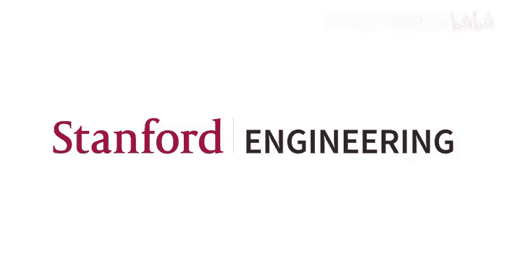

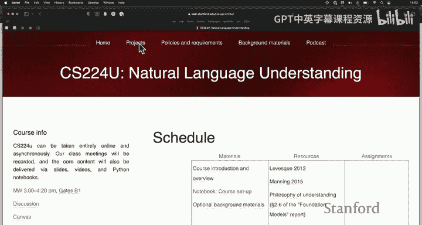

在本节课中，我们将继续学习斯坦福大学《自然语言理解》课程的核心内容。我们将回顾课程网站结构，深入探讨课程后续单元的主题，并初步了解Transformer模型背后的核心思想。

## 课程网站与资源导航 🌐

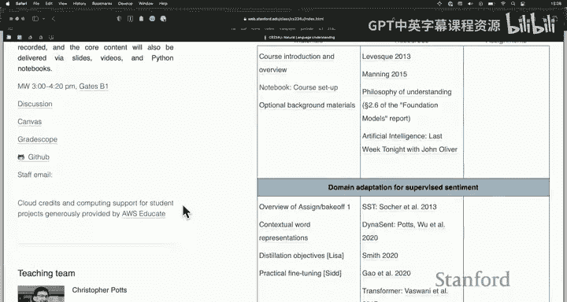

上一节我们介绍了课程的基本框架，本节中我们来看看课程的核心资源平台——课程网站。

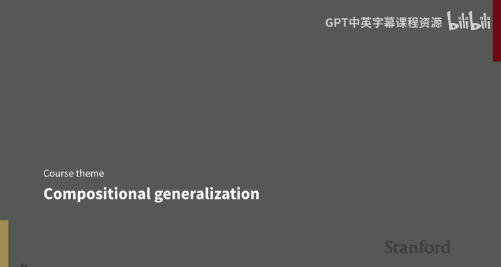

课程网站是课程所有资源的中心枢纽。网站顶部包含政策页面、项目页面、背景材料索引、YouTube录屏、幻灯片以及实践材料。此外，课程还设有一个播客，欢迎学生推荐访谈嘉宾。

网站左侧提供了访问课程所需各种系统的快捷入口：
*   **Ed论坛**：用于课程讨论。
*   **Canvas**：存放课程录屏和测验。
*   **Gradecope**：用于提交主要作业和项目，并参与“竞赛”。
*   **课程GitHub**：存放课程代码，是作业和原创工作的基础。

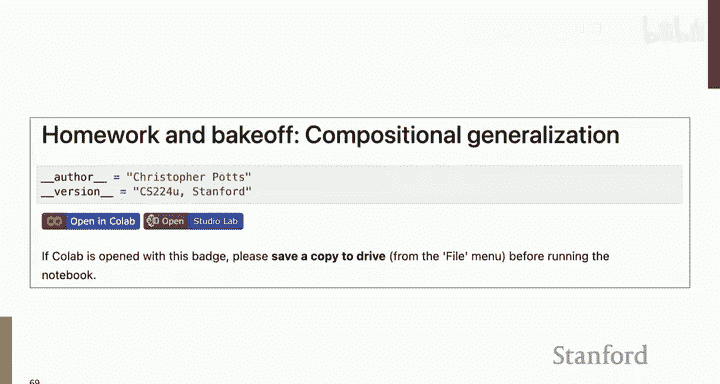

如需联系教学团队，请优先使用讨论论坛或统一的团队邮箱，这有助于高效管理工作量。

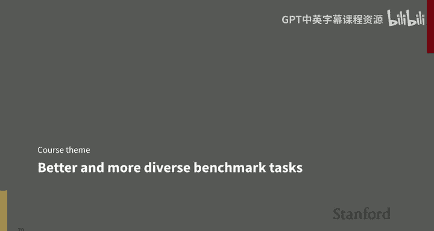

网站中间部分链接了所有课程材料：
*   **第一列**：幻灯片和Notebook等。
*   **第二列**：核心阅读材料（主要是论文）。虽然阅读量很大，但这些论文非常重要且富有启发性。
*   **第三列**：作业链接。

## 课程后续单元与前沿主题 🚀

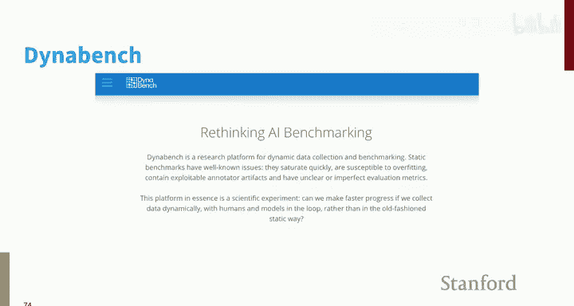

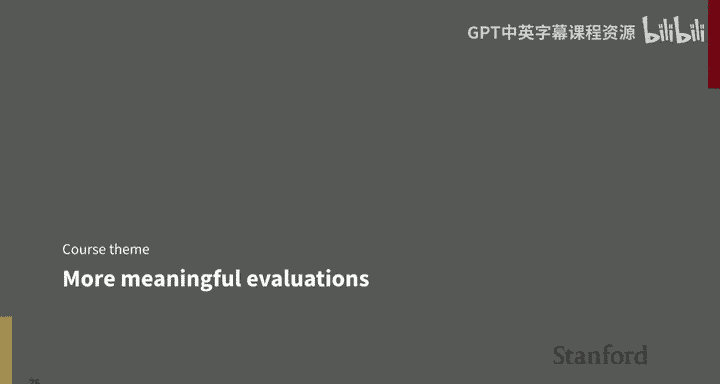

在回顾了Transformer和检索增强的上下文学习之后，课程将进入更多样化的前沿主题。

### 第三单元：组合泛化

第三单元将聚焦于组合泛化，这是一个全新的主题。我们将重点关注**COGS**基准测试。这是一个相对较新的合成数据集，旨在压力测试模型是否真正学会了解决语言问题的系统性方法。

COGS本质上是一个语义解析任务。输入是一个句子（例如“Lena gave the bottle to John”），任务是学习如何将这些句子映射到其逻辑形式。

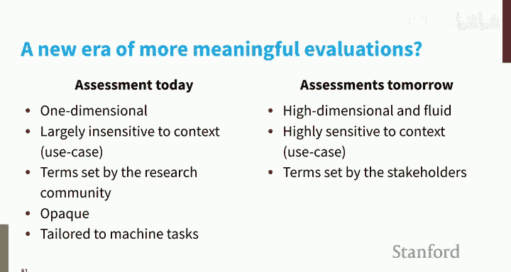

COGS的有趣之处在于它提出了困难的泛化任务。例如，在训练中模型可能看到“Lena”作为主语，而在测试时看到“Lena”作为宾语。尽管这些句子非常简单，但模型在这些泛化任务上的表现却极具挑战性。

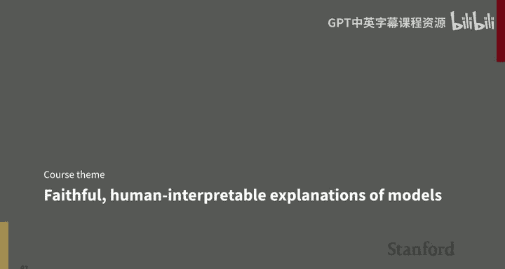

以下是COGS累积排行榜的部分数据，显示了模型在不同泛化任务上的表现：

| 模型 | 整体准确率 | 宾语介词短语到主语介词短语泛化 |
| :--- | :--- | :--- |
| 系统A | 较高 | 0% |
| 系统B | 较高 | 0% |
| ... | ... | ... |

可以看到，在“宾语介词短语到主语介词短语”这一看似简单的泛化任务上，许多新系统的得分是零。这表明即使对我们最好的系统来说，这仍然是一个极其困难的问题。

本课程将使用COGS的一个变体——**ReCOGS**。我们认为COGS在某些方面被人为地制造得过难或过易。ReCOGS对原始数据进行了系统性的、保持语义不变的转换，创建了一个我们认为更公平的新数据集。虽然模型在ReCOGS上能取得一些进展，但核心结论不变：这对我们的系统来说仍然极其困难。这个单元将以第三次作业和竞赛结束。

### 项目阶段与赋能主题

完成常规作业后，课程将进入项目阶段。我们将遵循文献回顾、实验方案（详细规划论文工作的文档）和最终论文的节奏。

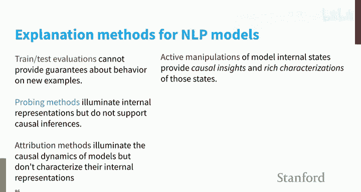

为了赋能大家的最终项目，我们将一起探讨几个关键主题。

**主题一：更好、更多样化的基准测试**

我们需要可靠的测量工具来评估系统性能，这意味着需要优秀的基准测试。数据对于我们的领域就像水和空气一样不可或缺。我们对数据集的要求很高：
*   用于优化模型（训练）。
*   用于评估模型（尤其是当前备受关注的大语言模型）。
*   用于比较模型。
*   通过训练和测试实现新能力。
*   衡量领域进展。
*   用于对语言和世界进行基础科学探究。

我鼓励大家思考数据集，特别是那些在课程背景下作为强大评估工具的数据集。我担心当前仅通过社交媒体上的有趣案例来评估大语言模型的动态。我们需要大量的评估数据集来科学地衡量系统好坏。

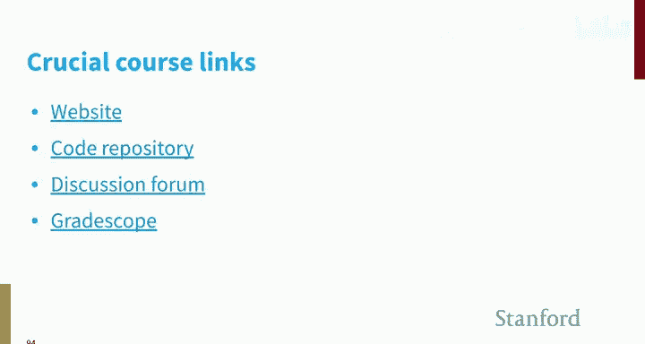

当前许多基准测试可能过于简单，导致模型性能迅速超过人类水平估计。这可能是因为过去的评估本质上是“机器任务”而非“人类任务”。我们将讨论对抗性测试和**Dynabench**等开源努力，旨在开发能真正挑战最佳模型的数据集。

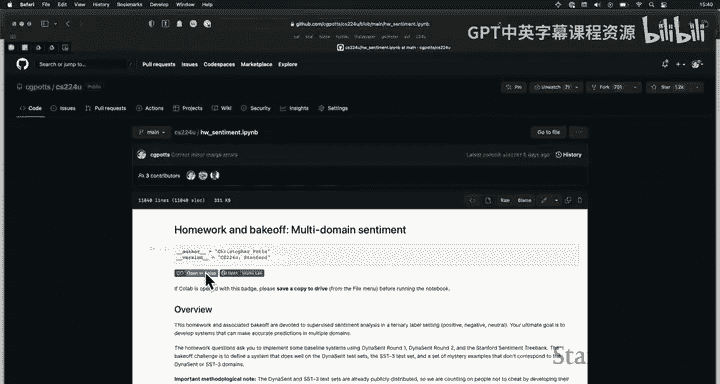

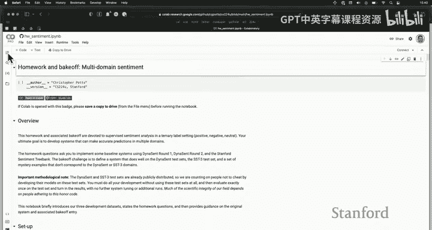

**主题二：更有意义的评估**

在人工智能领域，我们可能过于关注性能（准确率）。根据**古德哈特定律**：当一项测量成为目标时，它就不再是一个好的测量。如果我们只关心准确率，就会忽视其他重要方面。

一项关于机器学习研究价值观的调查显示，性能高居榜首，而仁慈、隐私、公平与正义等价值观几乎未被体现。随着系统更广泛地部署，这些方面变得越来越重要。我们需要提升这些原则在评估和实践中的地位。

我们可以设计包含更多维度的排行榜。例如，**Dynascore**提出了一种综合多个不同维度进行评分的方法。

设想一个评估表格，行是不同的问答系统，列是我们可以衡量的不同方面（例如性能、吞吐量、内存、公平性、鲁棒性）。通过调整不同维度的权重，我们可以得到不同的系统排名。这没有“真正的赢家”，而是反映了我们的偏好排序。我们可以设计符合我们目标的排行榜。

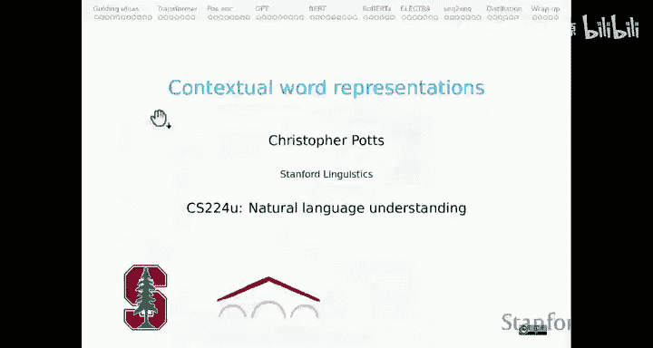

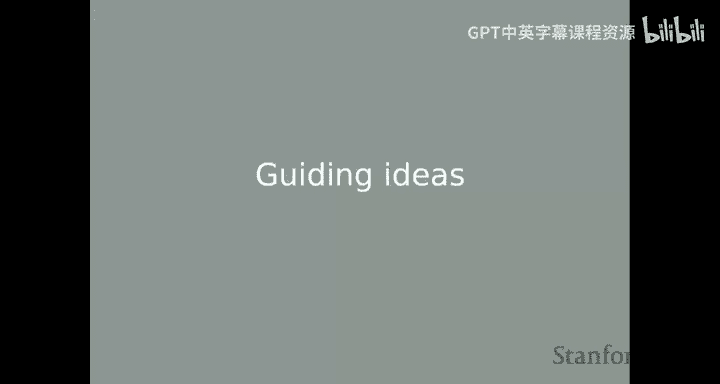

要实现这一点，我们需要可靠的测量工具。例如，公平性是一个复杂、多维的概念，需要更多工作来建立评估基准。

展望未来，我们的评估可以比以往更有意义：
*   **从一维到多维**：像Dynascore那样综合多个维度。
*   **高度情境敏感**：根据具体情境调整对不同维度的重视程度。
*   **由用户设定评估标准**：由系统的使用者，而非研究人员，来设定评估条款。
*   **由用户做出判断**：用户根据自身表达的偏好选择系统。
*   **基于人类任务**：评估系统在模糊和依赖情境下，以类人方式进行讨论和裁决的能力。

**主题三：可解释性**

随着模型部署到现实世界，理解它们变得至关重要。目前我们主要进行行为测试（设计测试用例看模型表现），但这存在归纳问题：你永远无法穷举所有情况。

可解释性研究的目标是深入一层，理解模型内部发生了什么，从而了解它们将如何泛化到新情况。虽然模型庞大且不透明，但它们是封闭的确定性系统，我们能够理解它们学到了什么。

可解释性方法应满足两个标准：
1.  **人类可解释**：用人类层面的概念表达。
2.  **忠实于底层模型**：解释需真实反映系统运作。

我们将讨论多种解释方法：
*   **训练/测试**：行为测试仍然重要。
*   **探针**：在模型内部表示上训练监督分类器，探索其编码的信息（如生命性、词性）。
*   **归因方法**：为模型表示的不同部分分配重要性分数。
*   **主动操纵方法**：主动操纵模型内部状态，以获得因果性见解并深入理解表示。

我强烈倾向于主动操纵方法，因为它能提供因果性见解并丰富地表征模型行为。我们甚至可能讨论**互换干预训练**，即使用可解释性方法来推动模型变得更好、更系统、更可靠。

## Transformer模型的核心思想 ⚙️

接下来，我们将初步了解Transformer模型背后的核心思想。这部分内容在过去需要两周讲解，现在我们将进行概述。

### 表示学习的演进

自然语言处理中表示学习的演进历程：
1.  **基于特征的稀疏表示**：手动设计特征函数，生成由0和1组成的长向量。
2.  **基于计数的分布表示**：如点互信息、TF-IDF，通过统计文本中的共现模式获得表示。
3.  **降维与主题模型**：如主成分分析、潜在语义分析、LDA主题模型，对计数数据进行降维，捕捉高阶共现概念。
4.  **学习到的降维表示**：如自编码器、Word2Vec、GloVe，使用机器学习算法从计数数据中学习稠密表示。

对于当今的任何任务，你可能会直接使用**上下文表示**。

### 为什么需要上下文表示？

静态词向量（如Word2Vec）为每个词分配一个固定向量，但这存在根本问题：词语的意义随上下文而变化。例如，动词“break”在不同句子中有多种含义（打碎、破晓、发布新闻、打破纪录、违法、闯入、打断、收支平衡）。为“break”枚举所有义项并分配静态向量是不现实的。

上下文表示模型拥抱了一个事实：每个词都可以根据其周围的一切获得不同的表示（即不同的向量）。这更符合语言运作的方式，也带来了工程上的成功。

### Transformer的关键洞见

1.  **从高偏差到低偏差模型**：领域从强加许多先验假设（如词向量简单相加、从左到右处理、树结构）的模型，转向连接一切、让数据决定重要性的最大化低偏差模型。
2.  **注意力机制**：“注意力就是你所需要的一切”。Transformer用注意力连接（本质上是点积运算）取代了RNN/LSTM中的循环连接，让序列中任何部分都能直接关注任何其他部分。
3.  **子词标记化**：不再使用固定的大词表（如ELMo的10万词），而是将词拆分为子词单元（如BPE、WordPiece）。例如，“encode”可能被拆为“en”和“##code”。这大大减少了词表大小（如BERT只有3万个子词），并依赖于丰富的上下文表示来重建完整词义。
4.  **位置编码**：除了词嵌入，还为序列中的每个标记添加位置编码，以记录其在序列中的位置。这使得同一个词在不同位置具有不同的表示。
5.  **大规模预训练**：在大量数据上训练这些包含子词、位置信息的上下文模型。模型规模和数据量越大，性能往往出现“涌现”提升。
6.  **微调**：针对特定任务，在预训练模型基础上进行微调，而不是从头开始训练。这利用了预训练阶段学到的关于语言和世界的丰富知识。微调会通过反向传播更新（部分或全部）预训练模型的参数。

## 总结与下节预告 📚

本节课中，我们一起学习了课程网站的资源结构，探讨了组合泛化、基准测试、评估方法和可解释性等后续单元的前沿主题，并初步了解了Transformer模型的核心思想，包括从静态表示到上下文表示的演进、注意力机制、子词标记化、位置编码、预训练与微调等关键概念。

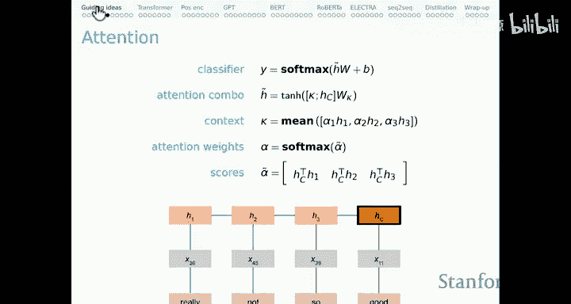

下节课，我们将正式深入Transformer模型的技术细节，详细解析其架构和工作原理。