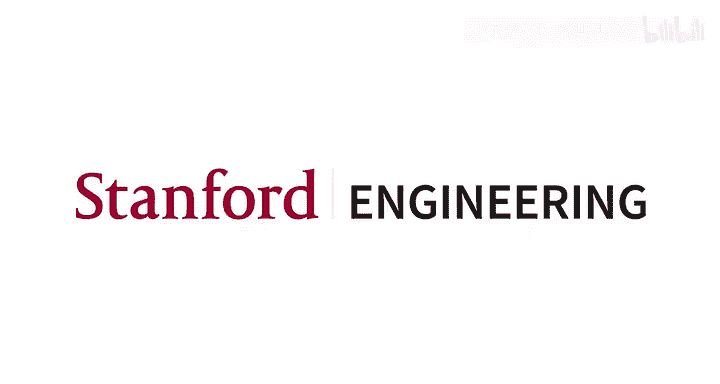
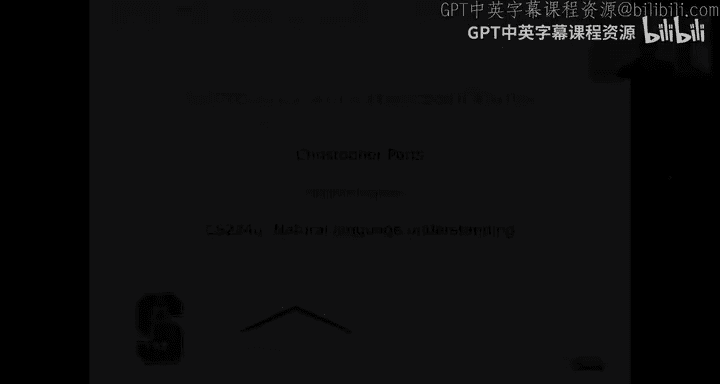
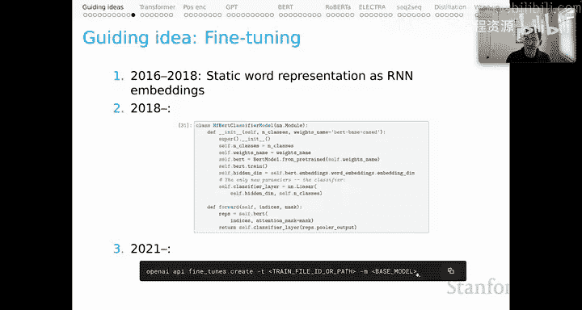

# 4：上下文词表示，第一部分：核心思想 🧠

在本节课中，我们将学习上下文词表示的核心思想。我们将回顾从静态词向量到上下文词向量的发展历程，探讨语言学现象如何驱动这一转变，并了解构建现代上下文表示模型的关键技术理念。

## 从静态表示到上下文表示 📜

上一节我们介绍了自然语言理解的基本概念，本节中我们来看看词表示方法是如何演进的。

词表示方法的发展经历了几个关键阶段：

1.  **基于特征的经典词汇表示**：其特点是表示向量是稀疏的。我们通常手动编写大量特征函数来捕捉词的属性（如情感极性、词性、后缀等），每个特征对应向量中的一个维度。大多数词不具备这些特征，因此向量中大部分是零。

2.  **基于计数的方法**：引入了分布假说。典型方法包括点互信息和词频-逆文档频率。我们从共现计数矩阵（如词-词矩阵或词-文档矩阵）出发，通过数学变换得到更好的表示。这些向量通常也比较稀疏。

3.  **经典降维方法**：引入了稠密表示。典型方法包括主成分分析、奇异值分解和潜在狄利克雷分配。我们通常将第二阶段得到的表示进行压缩，从而获得更稠密、信息量更大、能捕捉高阶分布相似性的表示。

4.  **学习式降维方法**：这是静态向量表示方法的最后阶段，同样产生稠密表示。例如自编码器、Word2Vec或GloVe。这一阶段本质上结合了基于计数的方法和降维技术，从而得到能够捕捉高阶共现关系的强大表示。

如果你想动手实践并深入理解这些方法，可以查看课程网站上链接的页面，那里提供了许多笔记和旧视频。

## 语言学的启示：词义依赖于上下文 🔤

从语言学角度看，词的意义高度依赖于其使用语境。这直接引出了对上下文词表示的需求。

以下是几个例子，展示了同一个词在不同上下文中的不同含义：

*   **动词 “break”**：
    *   `The vase broke.`（打碎）
    *   `Dawn broke.`（破晓）
    *   `The news broke.`（发布）
    *   `Sandy broke the record.`（打破）
    *   `Sandy broke the law.`（违反）
    *   `The burglar broke into the house.`（闯入）
    *   `The newscaster broke into the movie broadcast.`（打断）
    *   `We broke even.`（收支平衡）

*   **形容词 “flat”**：
    *   `flat beer`（走了气的）
    *   `flat note`（降音的）
    *   `flat tire`（瘪了的）
    *   `flat surface`（平坦的）

*   **动词 “throw”**：
    *   `throw a party`（举办）
    *   `throw a fight`（故意输掉）
    *   `throw a ball`（投掷）
    *   `throw a fit`（发脾气）

词义的歧义消解也依赖于更广泛的语境：

*   `A crane caught a fish.`（“crane” 指鸟）
*   `A crane picked up the steel beam.`（“crane” 指起重机）
*   `I saw a crane.`（没有更多上下文，无法确定是鸟还是机器）

*   `Are there any typos? I didn‘t see any.`（“any” 指 “any typos”）
*   `Are there any bookstores downtown? I didn’t see any.`（“any” 指 “any bookstores”）

这些例子表明，静态词向量方法要求一个词在所有语境下都对应同一个向量，这与语言实际运作方式不符。上下文词表示则允许我们捕捉词义的这种灵活性和语境依赖性。

## 上下文表示的发展简史 ⏳

上下文词表示的思想发展迅速，以下是一些关键里程碑：

*   **2015年**：Dai & Le 的论文展示了语言模型式预训练对下游任务的价值。
*   **2017年8月**：CoVe 论文表明，为机器翻译预训练的双向LSTM能提供可用于其他任务的序列表示。
*   **2018年2月**：ELMo 首次证明，大规模预训练的双向LSTM能产生丰富的、可通过微调轻松适配多种下游任务的多用途表示。
*   **2018年6月**：GPT 发布。
*   **2018年10月**：BERT 时代开启。BERT 模型是本单元乃至后续讨论的基石。

## 模型结构与语言结构 🏗️

模型架构中内置的结构性偏置是另一个核心思想。这关系到我们如何组合词义。

*   **简单加性模型**：将句子中每个词的静态向量（如GloVe向量）简单相加得到句子表示。这是一种高偏置模型，因为它预先假设加法是最优的组合方式。
*   **循环神经网络**：将词向量输入RNN，通过神经网络参数学习最优的组合方式。这释放了加性模型的偏置，允许模型从数据中更自由地学习。
*   **树结构神经网络**：预先确定句子的成分结构，递归地组合子节点表示来生成父节点表示。它功能强大，但同样具有高偏置，因为它预设了句法结构。
*   **双向RNN与注意力机制**：在RNN基础上添加注意力机制，允许序列中任意位置的隐藏状态相互关联。这种模型几乎不做预设，Transformer时代的经验表明，在足够数据下，“任意关联”是最强大的模式。

## 注意力机制的核心思想 💡

注意力机制是通向Transformer的关键，也是其大部分能力的来源。

在一个从左到右处理的RNN中，最终的隐藏状态可能缺乏序列早期词的信息。注意力机制通过一个评分函数（如点积）来计算目标表示与之前所有隐藏状态的相似度，经过softmax归一化后，将这些信息加权组合成一个上下文向量，并融入到目标表示中。这使得后续的分类决策能够基于融合了序列全局信息的表示。

点积注意力是Transformer架构的核心思想。

## 子词建模 🧩

子词建模是另一个被证明极其强大的思想。

*   **ELMo 的方法**：从字符级表示开始，通过不同层级的卷积和池化操作，得到包含丰富子词信息的整词表示。然而，即使ELMo拥有约10万个词的巨大词汇表，在真实文本中仍会遇到大量未登录词。
*   **Transformer 与 BPE 分词**：采用字节对编码等子词分词方法。例如，单词 “encode” 可能被分成 “en” 和 “code”。这样，词汇表可以很小（如不到3万），但遇到未登录词时，不会标记为未知，而是将其分解为已有的子词片段。在上下文模型中，模型可以内部学习这些片段如何组合成有意义的词。

## 位置编码 📍

Transformer 架构本身几乎无法跟踪词序，因此需要位置编码。

最直接的方法是除了词嵌入向量外，再添加一个位置嵌入向量，记录每个词在序列中的位置。然后将词嵌入和位置嵌入相加，作为上下文表示的基础。

这种方法被证明有效，但也存在局限，我们将在后续单元探讨如何改进。

## 大规模预训练与微调 ⚙️

大规模预训练是这一切背后的主要指导思想之一。

*   **预训练**：分布假说指出，我们无需手动编写特征函数，只需利用未标注语料库跟踪词的共现情况。在神经时代，Word2Vec和GloVe等模型使之成为可能。随后，ELMo、GPT、BERT和GPT-3等模型将大规模预训练推向了前所未有的高度。
*   **微调**：
    *   **2016-2018年**：预训练通常指将静态词向量输入RNN变体，然后对模型进行微调。
    *   **2018年（BERT时代）**：开始对上下文模型进行微调。我们可以编写代码读入BERT表示，并将其微调为一个分类器。
    *   **未来趋势**：我们可能进入一个新时代，大部分微调发生在那些我们无法直接访问的大规模语言模型上，我们只能通过API调用和部分已知的微调过程来让模型执行特定任务。尽管如此，编写自定义微调代码在分析和技术上仍然非常强大。

## 总结 📝

本节课中，我们一起学习了上下文词表示的核心思想。我们回顾了从静态稀疏向量到动态上下文表示的发展脉络，理解了词义对语境的依赖性如何推动了这一技术演进。我们还探讨了实现现代上下文表示的关键技术理念，包括注意力机制、子词建模、位置编码以及大规模预训练与微调范式。这些思想共同构成了当今自然语言处理研究和技术的基石。