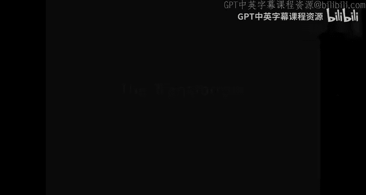
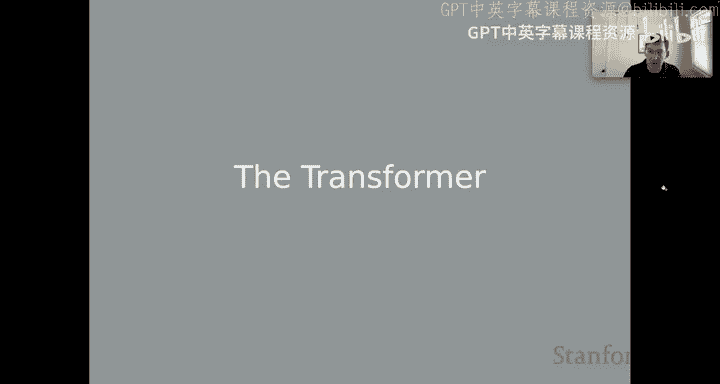
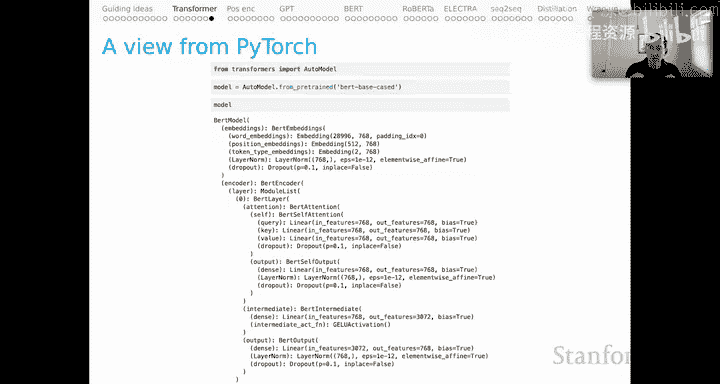
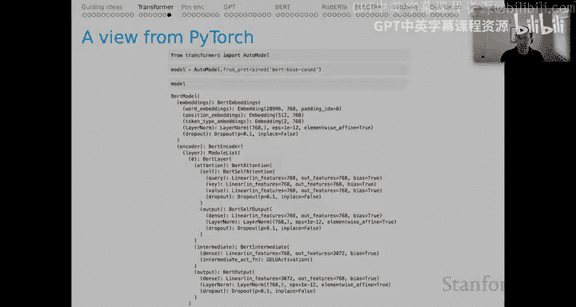
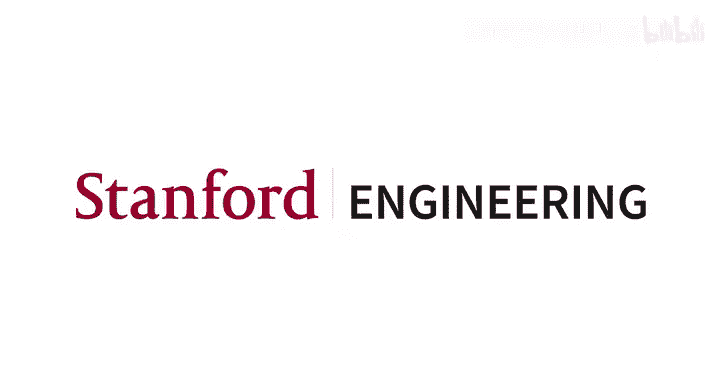

# 5：上下文词表示（第二部分）—— Transformer 架构 🧠

在本节课中，我们将深入学习 Transformer 架构的核心结构。这是理解现代上下文词表示模型的关键。我们将从简单的例子出发，逐步拆解 Transformer 的各个组成部分，包括位置编码、注意力机制、前馈网络等，并最终理解其整体工作流程。

---

## 从静态词嵌入到上下文输入

上一节我们介绍了上下文表示的基本概念，本节中我们来看看 Transformer 如何具体构建这些表示。

我们从一个简单的句子“the rock rules”开始。模型首先为每个词元（token）查找其对应的静态词嵌入向量，例如 `x47` 对应单词“the”。这与 Word2Vec 等早期模型的概念相似。

同时，模型也为每个词元在序列中的位置生成一个位置编码向量。为了将词义和位置信息结合，模型简单地将词嵌入向量和位置编码向量按维度相加，得到初始的上下文输入表示（图中绿色部分）。以序列中的“C”部分为例，其输入计算为：

`C_input = x34 + P3`

这个相加后的向量，可以被视为模型中的第一个上下文表示。

---

## 注意力层：连接一切的核心

接下来是注意力层，这也是著名论文标题“Attention Is All You Need”的由来。作者们观察到，在 Transformer 之前的循环神经网络时代，人们会在循环机制之上添加各种注意力机制来增强连接。这篇论文的核心观点是：可以完全摒弃循环连接，仅依靠注意力机制。

Transformer 使用的注意力机制本质上与上一讲介绍的、来自前 Transformer 时代的点积注意力相同。其计算可以概括为：对于目标表示（如 C_input），计算它与序列中所有其他输入表示（如 A_input, B_input）的点积相似度。

Transformer 论文引入的一个新做法是，将这些点积除以模型维度 D 的平方根进行归一化。这是因为模型中会进行大量加法组合，所有表示的维度必须保持一致（均为 D）。作者发现，通过这种启发式方法对点积进行缩放，能获得更好的模型缩放性能。

归一化后的点积经过 softmax 函数，得到注意力分数 α。要得到对应于当前块（如 C）的注意力表示，我们将 α 的每个分量乘以对应的输入表示，然后求和。例如：

`C_attention = α1 * A_input + α2 * B_input`

需要强调的是，图中显示的所有密集连接线，是模型中唯一将所有独立的表示“列”编织在一起的地方。正是这些连接赋予了 Transformer 学习序列特征的能力。

图中橙色的表示是“原始”的注意力表示，它们记录了目标表示与周围表示的相似性。为了得到 Transformer 中完整的注意力表示，我们需要将这些橙色表示与最初的绿色上下文输入表示相加，并应用 Dropout 正则化技术，最终得到黄色的 `C_A_layer` 表示。

---

## 层归一化与前馈网络

在得到注意力表示后，模型会进行层归一化操作。这有助于调整数值的尺度，使其均值为 0 并呈正态分布，为后续的机器学习计算创造一个更稳定的环境。

下一步至关重要，即 Transformer 中的前馈组件。图中用蓝色表示，但它实际上隐藏了两个前馈层。

以下是其计算过程：
1.  将层归一化后的紫色表示 `C_A_norm` 作为输入。
2.  通过第一个具有参数 `W1` 和偏置 `B1` 的稠密层。
3.  应用 ReLU 激活函数。
4.  将结果输入第二个具有参数 `W2` 和偏置 `B2` 的稠密层，得到 `C_FF`。

Transformer 的许多参数实际上就隐藏在这些前馈层中。这里也是模型中唯一可以暂时偏离维度 D 的地方：虽然输入 `C_A_norm` 的维度是 D，但我们可以让第一个前馈层输出一个更大的维度（例如 3072），以增加模型的表示能力，只要第二个前馈层再将其压缩回维度 D。许多大型 Transformer 模型都利用了这一机会来拓宽中间层。

最后，我们将前馈网络的输出 `C_FF` 与 `C_A_norm` 相加，再次应用 Dropout 和层归一化，得到本 Transformer 块的最终输出 `C_out`。

---

## 注意力计算的矩阵形式与多头注意力

由于注意力机制如此重要，我们再多花些时间深入探讨。

到目前为止，我展示的是注意力计算的分步形式。然而，在《Attention Is All You Need》论文及后续文献中，该计算通常以更高效的矩阵形式呈现。为了帮助理解这两种形式的等价性，你可以通过动手编写简单的代码来验证。

另一个重要的概念是“多头注意力”。我之前展示的实际上是单头注意力。多头注意力的思想很简单：并行进行多组独立的注意力计算，每组都有自己的可学习参数矩阵（查询 `W_Q`、键 `W_K`、值 `W_V`），下标代表第几个头。

以下是多头注意力的工作流程：
1.  对每个注意力头，使用其独有的参数矩阵，分别计算查询、键、值，并进行点积注意力计算。
2.  每个头都会产生一组注意力表示。
3.  将所有头的输出拼接或组合起来，形成最终的注意力表示。

这样，之前幻灯片中橙色的注意力表示，实际上很可能就是由多个头的输出组合而成的。多头机制为序列不同部分之间的这种关键交互层提供了丰富的多样性。

---

## 堆叠块与整体架构视图

Transformer 的核心思想之一是堆叠。一个块的输出（如 `C_out`）可以作为下一个块的输入。通常，模型会堆叠 12、24 甚至数百个这样的 Transformer 块。

现在，我们或许能更好地理解《Attention Is All You Need》论文中那个著名的架构图了。图中编码器（Encoder）部分展示的，正是对我们刚才讨论的节奏的重复：输入嵌入（红色）、多头注意力、相加与层归一化、前馈网络、再次归一化与相加。

解码器（Decoder）部分结构类似，但有一个关键区别：它使用了掩码注意力（Masked Attention）。在解码（如生成文本）时，模型不能“偷看”未来的信息，因此需要将注意力计算中未来位置的权重掩码掉。除此之外，解码器与编码器结构基本相同。图的顶部增加了输出概率层，用于任务如机器翻译或语言建模。

---

## 实战观察：使用代码探索模型结构

要更深入地感受这些模型的工作原理，可以下载模型并使用 Hugging Face 等库的代码来检查其结构。例如，观察 BERT-base 模型：

*   **嵌入层**：包含约 30,000 个词项，每个词嵌入的维度 D=768。位置编码最大支持 512 个位置，维度同样为 768。
*   **注意力层**：随处可见维度 768，因为这是模型的基础维度 D。
*   **前馈层**：这是维度变化的例外。例如，输入 768 维，中间层扩展到 3072 维以增加参数和表示能力，最后再投影回 768 维，以便堆叠。

这种结构会在所有层中重复。你可以用类似的方法查看 GPT、RoBERTa 等模型，它们虽然各有特点，但核心组件都以不同的形式重复出现。

---

本节课中我们一起学习了 Transformer 架构的核心组成部分。我们从结合位置信息的词嵌入开始，深入探讨了作为模型“粘合剂”的注意力机制（尤其是其多头形式），了解了用于增加模型容量的前馈网络，以及用于稳定训练的层归一化和 Dropout 技术。最后，我们理解了通过堆叠多个这样的块来构建强大模型的基本思想，并能初步解读经典的 Transformer 架构图。这是理解当今绝大多数前沿自然语言处理模型的基石。