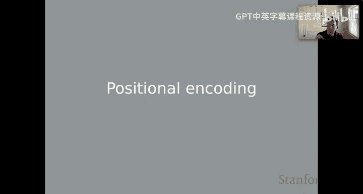
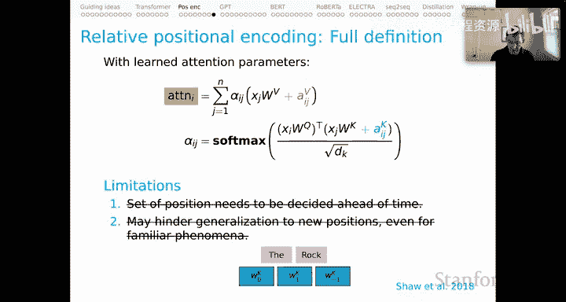

# 6：上下文词表示（三）📍 位置编码

欢迎回来。这是我们关于上下文表示系列课程的第三部分。

我们稍后会讨论一系列著名的基于Transformer的架构。但在那之前，我认为有必要暂停一下，反思一下**位置编码**这个重要的概念。我觉得这个领域曾长期将其视为理所当然，我自己也是如此。我们现在认识到，这是塑造基于Transformer模型性能的一个关键因素。

## 概述

在本节中，我们将深入探讨Transformer模型中的位置编码。我们将了解为什么需要它，并分析三种不同的位置编码方案：**绝对位置编码**、**基于频率的位置编码**和**相对位置编码**。我们将重点关注两个核心问题：位置集合是否需要预先确定，以及编码方案是否会阻碍模型向新位置的泛化能力。

## 位置编码在Transformer中的作用

首先，让我们思考位置编码在Transformer上下文中的作用。核心观察是：**Transformer本身跟踪词序的能力非常有限**。注意力机制本身是无方向性的，它只是一系列点积运算，并且各列（输入位置）之间没有其他交互。因此，我们极有可能丢失“输入序列ABC与输入序列CBA不同”这一事实。

**位置编码将确保我们保留这两个序列之间的差异**，无论我们对模型产生的表示进行何种处理。

其次，位置编码还扮演着另一个层次性的角色。例如，在自然语言推理任务中，它被用来跟踪“前提”和“假设”等信息，这是我们稍后会谈到的BERT模型的一个重要特征。

## 评估位置编码的两个关键问题

为了简化讨论，我将围绕两个关键问题展开：
1.  **位置集合是否需要预先确定？**
2.  **位置编码方案是否会阻碍向新位置的泛化？**

我想引入的另一条规则是：现代Transformer架构可能出于设计和优化的原因对序列施加最大长度限制。我想暂时抛开所有这些因素，单独探讨位置编码方案本身是否对长度泛化能力施加了限制。

## 方案一：绝对位置编码

这是我们目前讨论过的方案。在这种方案中，我们有词表示，也有我们学习到的、对应固定数量维度的位置表示。为了获得对位置敏感的词表示，我们只需将词向量与位置向量相加。

**公式表示**：`最终表示 = 词嵌入 + 位置嵌入`

这种方案在我们两个关键问题上的表现如何？并不理想。
*   **首先，位置集合显然需要预先确定**。当我们建立模型时，会设定一个嵌入空间（例如最多512个位置）。如果我们选择了512，那么当遇到第513个位置时，我们将没有对应的位置表示。
*   **其次，这种方案会阻碍向新位置的泛化**。考虑短语“the rock”，如果它出现在序列早期，其表示与出现在序列后期时完全不同。虽然由于两个位置都包含相同的词向量，它们会有一些共享特征，但我们将位置表示作为平等的伙伴加入其中。结果是，学习到的表示严重依赖于位置，这使得模型难以认识到“the rock”在某种意义上是一个相同的短语，无论它出现在序列的开头、中间还是结尾。

## 方案二：基于频率的位置编码

这种方案实际上可以追溯到原始的Transformer论文。其基本思想是：我们定义一个数学函数，给定一个位置，该函数会返回一个向量，该向量的结构以某种语义方式编码了该位置的信息。在Transformer论文中，他们选择了一种基于频率振荡的方案，本质上基于这些向量的正弦和余弦频率，其中较高的位置振荡更频繁，这些信息被编码在我们创建的位置向量中。

**核心特征**：这是一个函数 `f(position) -> vector`。给它位置1，它返回一个向量；给它5、13或一百万，它都返回一个向量。所有这些向量都明确编码了该输入位置的相对位置信息。

因此，我们**肯定克服了第一个限制**：在这种方案中，位置集合不需要预先确定，因为我们可以为任何给定的位置生成一个新的向量。

但是，我们的第二个问题仍然存在。和之前一样，这种方案**仍可能阻碍向新位置的泛化**，原因同样是我们将词表示与这些针对不同位置的位置表示作为平等伙伴相加。这使得模型难以看到同一个短语可以出现在多个位置。

## 方案三：相对位置编码

这是我们即将讨论的三种方案中最有前景的一种。我们将通过几个步骤来理解这种方案的工作原理。

首先回顾一下，这是Transformer注意力层的示意图。我们有三个对位置敏感的输入：A输入、B输入和C输入。记住它们必须对位置敏感是至关重要的，因为这些点积注意力机制中存在大量对称性。

对于位置编码，我们实际上只是添加了一些新参数。幻灯片底部描绘的计算与顶部相同，只是在两个关键位置，我添加了一些我们将学习其表示的**新向量**（用蓝色标出）：
1.  在点积计算中，我们添加了**键表示**。
2.  在最后的加权求和步骤中，我们添加了**值表示**。

这些是我们在此处添加的新的关键参数。基本思想是：由于所有这些位置敏感性都将被编码在这些新向量中，我们不再需要绿色的输入表示本身包含位置信息。因为位置信息现在被引入到注意力层中，我们可能会为每个位置组合（由这些下标表示）学习新的向量。

但这只是故事的一部分。我认为这种方法真正强大之处在于**位置编码窗口**的概念。为了说明这一点，我在顶部重复了核心计算作为提醒。现在，为了演示，我将窗口大小设置为2。

以下是我们将用作示例的输入序列，其上方是帮助我们在计算中跟踪位置的整数索引（它们不是模型的直接输入）。

让我们从聚焦位置4开始说明。
*   根据我们目前对键值的定义，我们将有一个向量 `a_44`（从位置4关注位置4）。作为创建这个基于有限窗口的模型版本的一部分，我们实际上会将其映射到键的一个单一向量 `w_0`。
*   当我们向左移动一个位置到位置3时，我们会有键向量 `a_43`。但我们要做的是将其映射到单一向量 `w_-1`（对应 3 - 4 = -1）。
*   再向左移动一个位置到位置2，我们得到 `a_42`，但我们现在将其映射到键向量 `w_-2`。
*   然后，因为我们将窗口大小设置为2，当我们到达最左边的位置1时，它再次被映射到 `w_-2`（因为 4-1=3，超过了窗口大小，所以取窗口最大值-2）。
*   当我们向右移动时，会发生类似的过程：4到5得到 `w_1`，4到6得到 `w_2`，从起点开始的第三个位置（4到7）同样由于窗口大小而“扁平化”为 `w_2`。

因此，实际上，用蓝色表示，我们只有少数几个向量：`w_0`, `w_1`, `w_-1`, `w_2`, `w_-2`。这与之前用 `a_43`, `a_42` 等做出的所有区分相反。我们正在将这些向量折叠成对应于窗口大小的更少数量的向量。

如果我们将焦点移到位置3，情况会继续：`a_33` 被映射到 `w_0`（与上面位置4的 `a_44` 映射到的向量相同）。向左移动一位得到 `w_-1`（与上面位置4向右移动一位得到的向量相同），依此类推。对于你在上面看到的紫色值参数，也有并行的计算，使用相同的相对位置和窗口大小概念。

**所以，我们实际上学习了相对较少的位置向量。我们所做的基本上是提供一个小的、基于窗口的相对位置概念，这个概念会滑动，并基于我们以前可能在这些输入的其他部分见过的组合，给我们很大的能力来泛化到新的位置。**

最后需要说明的是，这实际上是嵌入在完整的注意力理论中的，该理论可能有很多可学习参数，甚至可能是多头注意力。我在这里描绘的只是完整的计算，以便真正给你所有细节，但认知上的捷径是：**这是之前的注意力计算，加入了这些新的位置元素**。再次提醒，在这种新模式中，我们在**注意力层**引入位置相对性，而不是在嵌入层。

## 回顾关键问题

现在让我们思考我们的两个关键问题。
1.  **首先，我们不需要预先确定位置集合**。我们只需要决定窗口大小，然后对于一个可能极长的字符串，我们只是用相对较少的位置向量在其中滑动，以跟踪相对位置。
2.  **我认为我们也很大程度上克服了位置嵌入可能阻碍向新位置泛化的担忧**。毕竟，如果你考虑像“the rock”这样的短语，无论它出现在字符串的哪个位置，涉及的核心位置向量都是 `w_0`, `w_1`, `w_-1`。当然，根据它出现的位置，会有其他位置相关的事情发生，其他信息也会作为计算的一部分被引入，但我们确实有这种恒常性，这将允许模型看到“the rock”本质上是相同的，无论它出现在字符串的何处。

## 总结

本节课中，我们一起学习了Transformer中位置编码的核心概念与三种主要方案。

我的假设是：**由于我们克服了这两个关键限制，相对位置编码通常是Transformer中进行位置编码的非常好的选择**。我相信，目前Transformer领域的结果也很好地支持了这一点。相对位置编码通过引入一个滑动窗口和有限的相对位置向量，既解决了模型对长序列和未知位置的泛化问题，又让模型能够更好地识别在不同位置出现的相同语言单元，是当前最有效的位置编码策略之一。