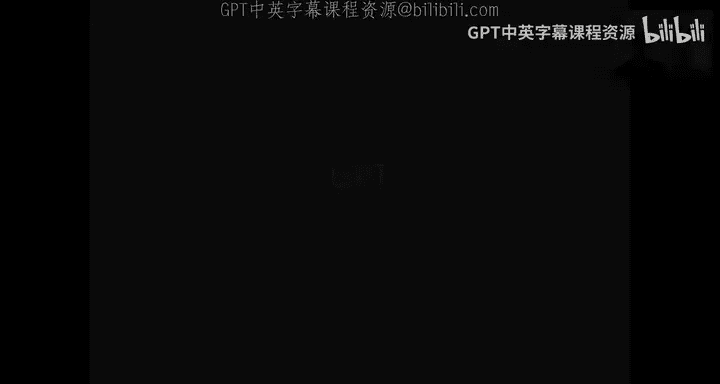
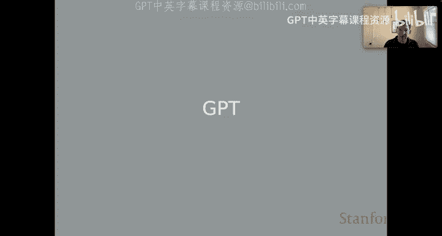
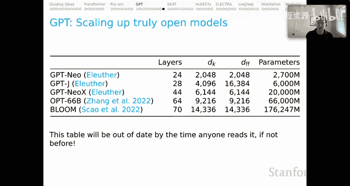

# 7：GPT 模型详解 🧠

在本节课中，我们将深入探讨 GPT（Generative Pre-trained Transformer）模型。GPT 是基于 Transformer 架构的最著名模型之一，它通过自回归语言建模进行预训练，并在各种下游任务上展现出强大的能力。我们将从技术细节出发，逐步理解其工作原理、训练过程以及生成机制。

---

## 自回归语言建模损失函数 📉

上一节我们介绍了上下文表示的基本概念，本节中我们来看看 GPT 模型的核心训练目标——自回归语言建模。其损失函数旨在根据已出现的词序列，预测下一个词的概率。

损失函数的数学表达式如下，其核心在于计算目标词嵌入向量与模型在上一时间步生成的隐藏表示之间的点积：

$$
L = -\sum_{t=1}^{T} \log P(w_t | w_{<t}) = -\sum_{t=1}^{T} \log \frac{\exp(\text{embed}(w_t) \cdot h_{t-1})}{\sum_{v \in V} \exp(\text{embed}(v) \cdot h_{t-1})}
$$

公式的分子部分 `exp(embed(w_t) · h_{t-1})` 是关键。它表示在时间步 `t`，我们查找目标词 `w_t` 的嵌入向量，并将其与模型在时间步 `t-1` 生成的隐藏表示 `h_{t-1}` 进行点积运算。整个公式通过 Softmax 归一化，并对所有词汇表 `V` 中的词进行计算，最终目标是最大化整个序列的对数似然概率。

---

## 图解语言建模过程 🖼️

为了更直观地理解，我们通过一个例子来说明。假设我们的序列是 “<start> the rock rules <end>”。

以下是语言建模的逐步过程：
1.  从起始标记 `<start>`（时间步 T1）开始，查找其嵌入表示，并形成第一个隐藏表示 `H1`。
2.  为了预测下一个词 “the”（时间步 T2），我们使用 `H1` 与词 “the” 的嵌入表示进行点积评分。
3.  将 “the” 输入模型，获取其嵌入表示，并基于 `H1` 生成第二个隐藏表示 `H2`（这里可以想象为一个从左到右处理的循环神经网络，GPT 实际使用 Transformer，稍后会详述）。
4.  为了预测 “rock”（时间步 T3），我们使用 `H2` 与词 “rock” 的嵌入表示进行点积评分。
5.  此过程持续进行，直到预测出结束标记 `<end>`。

在每个时间步，模型的核心操作都是计算目标词嵌入与前一时刻隐藏表示的点积，以此作为该词得分的依据，再通过 Softmax 得到预测概率。

---

## GPT 的 Transformer 架构与掩码注意力 🔄

GPT 的本质是在 Transformer 架构中实现上述自回归语言建模。与之前介绍的 Transformer 不同，GPT 在训练时需要确保模型在预测当前词时，只能“看到”它之前的词，而不能“看到”未来的词。这是通过**注意力掩码**实现的。

以下是注意力掩码的工作原理：
*   在位置 A，模型只能关注自身（自注意力）。
*   在位置 B，模型可以关注位置 A 和自身。
*   在位置 C，模型可以关注位置 A、B 和自身。

这种掩码形成了一个下三角矩阵，确保了信息只能从过去流向未来，防止了信息泄露。具体到模型输入，我们首先将词序列转换为独热向量，再通过嵌入层得到词向量。这些向量与位置编码相加后，输入到多层 Transformer 编码器块中。每一层的自注意力操作都遵循上述掩码规则。

---

## 训练过程：教师强制 📚

GPT 模型的训练通常采用**教师强制**策略。这意味着在训练的每个时间步，无论模型预测出什么词，我们在输入下一个时间步时，都会强制使用**真实的**下一个词（即标注数据中的词），而不是使用模型自己预测的词。

以下是详细的训练步骤：
1.  输入序列（如 “<start> the rock rules”）被转换为独热向量，并通过嵌入层得到向量表示。
2.  这些向量经过多层 Transformer 块处理，生成一系列上下文相关的输出表示（绿色部分）。
3.  在模型顶部，我们再次使用**嵌入层的参数**（与步骤1相同）作为一个线性层，将 Transformer 的输出映射到整个词汇表上，得到每个词在当前位置的得分（logits）。
4.  我们将这些预测得分与下一个时间步的真实词所对应的独热向量进行比较，计算损失（如交叉熵损失）。
5.  这个损失信号作为梯度，反向传播以更新模型所有参数（包括 Transformer 和嵌入层）。

关键点在于：输入序列和用于计算损失的目标序列是错位一格的。模型在时间步 `t` 的输入是 `w_1, ..., w_t`，而预测目标是 `w_{t+1}`。即使模型在时间步 `t` 的预测错了，在时间步 `t+1` 的输入中，我们仍然会使用真实词 `w_{t+1}`，这就是“教师强制”。它使训练过程更加稳定。

---

## 文本生成过程 🎨

当模型训练完成后，我们进入**文本生成**阶段。此时，我们不再有真实的下一个词作为输入，因此必须使用模型自身的预测结果。

以下是文本生成的步骤：
1.  用户提供一个提示序列（例如 “<start> the”）。
2.  模型处理该序列，并在顶部输出层为词汇表中的每个词生成一个得分。
3.  我们根据这些得分，通过某种**决策规则**（如选择得分最高的词，即贪婪解码）选择下一个词（例如 “rock”）。
4.  将预测出的词（“rock”）追加到输入序列末尾，形成新的输入序列（“<start> the rock”）。
5.  重复步骤 2-4，模型处理新序列，预测下一个词（例如 “rolls”），直到生成结束标记或达到指定长度。

需要强调的是，模型本身并不直接“输出一个词”，而是输出**所有词的得分分布**。生成文本的多样性和质量很大程度上取决于我们在这个分布上采用的采样策略（如贪婪搜索、束搜索、核采样等）。这是生成式任务中的一个重要设计维度。

---

## 模型微调与应用 ⚙️

预训练好的 GPT 模型可以通过**微调**来适应特定的下游任务（如文本分类、问答等）。

标准的微调方式如下：
*   将任务相关的输入文本输入 GPT 模型。
*   通常取模型对最后一个输入标记所产生的**最终输出状态**（即最后一个隐藏向量）作为整个序列的表示。
*   在这个最终输出状态之上，添加一个任务特定的小型输出层（例如一个线性分类器）。
*   在新的任务数据上，同时微调这个新增的输出层和 GPT 模型的部分或全部参数。

当然，我们也可以利用更丰富的序列信息，例如对所有时间步的输出状态进行**均值池化**或**最大值池化**，以获得更好的序列表示。但在最初的 GPT 论文中，微调主要基于最终输出状态。

---

## GPT 模型家族概览 🏛️

最后，我们来了解一下 GPT 模型的发展历程及其规模。以下是 OpenAI 发布的几个主要版本：

以下是 GPT 模型的主要参数规模：
*   **GPT-1**: 12层，模型维度768，前馈层维度3072，参数约1.17亿。
*   **GPT-2**: 48层，模型维度1600，前馈层维度1600，参数约15亿。
*   **GPT-3**: 96层，模型维度12288，参数约1750亿。

此外，开源社区也涌现了许多强大的替代模型，例如拥有1760亿参数的 **BLOOM** 模型，它们在规模和性能上都具有竞争力。这个领域正在快速发展，不断有新的模型出现。

---

本节课中我们一起学习了 GPT 模型的核心原理。我们从自回归语言建模的损失函数出发，图解了其工作流程，并深入探讨了 GPT 如何利用带掩码的 Transformer 架构实现这一目标。我们详细分析了其采用教师强制策略的训练过程，以及如何通过采样策略进行文本生成。最后，我们了解了模型微调的基本方法，并回顾了 GPT 模型家族的演进史。理解这些基础，是掌握当今大语言模型的关键第一步。