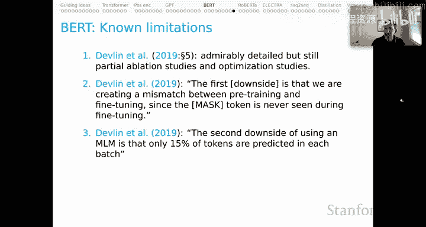

# 8：上下文词表示（五）BERT 🧠

在本节课中，我们将聚焦于BERT模型。BERT是GPT的“兄长”，虽然稍早问世，但其重要性和知名度毫不逊色。我们将深入探讨BERT的核心结构、训练目标、使用方法及其局限性。

---

## BERT的核心模型结构 🏗️

上一节我们回顾了Transformer架构，本节我们来看看BERT如何巧妙地运用这一架构。BERT本质上是对Transformer的一种有趣应用。

为了说明，我们以序列“the rock rules”为例。该序列会经过一系列BERT特有的处理。

*   首先，在序列最左侧有一个**类别标记**。这是BERT架构中的一个重要标记，每个序列都以它开始。
*   其次，我们有一个**分层位置编码**，由标记`[SEP]`给出。这对于我们当前的示例可能不那么有趣，但在处理如自然语言推理等任务时，前提和假设部分会使用不同的`[SEP]`标记，以帮助编码一个词出现在前提中与出现在假设中是略有不同的情况。这种思想可以推广到许多不同任务所需的各种分层位置编码中。

因此，我们的输入序列具有这种对位置非常敏感的编码。我们像往常一样查找所有这些部分的嵌入表示，然后将它们相加组合，得到输入序列的首次上下文敏感编码，即图中绿色的向量。

然后，与GPT类似，我们有许多Transformer块（可能多达数十个）重复堆叠，最终得到一些输出状态（图中用深绿色表示）。这些输出状态将成为我们使用该模型进行后续操作的基础。

---

## BERT的训练目标 🎯

了解了BERT的结构后，我们来看看它是如何训练的。BERT的核心训练目标是**掩码语言建模**。

其基本思想是：我们将序列中的某些词的身份掩盖或隐藏，然后让模型尝试重建缺失的部分。

对于我们的序列：
*   一种情况是，我们不对“rules”这个词进行掩码，但仍然训练模型在该时间步预测“rules”。这作为一个重建任务可能相对简单。
*   更困难的情况是进行掩码。在这种情况下，我们会在“rules”的位置插入一个特殊的指定标记`[MASK]`，然后尝试让模型能够利用该点周围完整的双向上下文来重建“rules”这个缺失的部分。
*   此外，除了掩码，我们还可以进行**随机词替换**。例如，我们简单地将“rules”替换为一个随机词如“every”，然后让模型学习预测该位置的实际标记是什么。

所有这些任务都利用模型的双向上下文来完成重建。

在训练时，我们只掩码所有标记中的一小部分，大部分标记保持不变。这样，模型就有大量的上下文信息来预测被掩码、缺失或被破坏的标记。这实际上是MLM目标的一个限制和低效之处，后续模型（如ELECTRA）会试图解决这个问题。

以下是MLM损失函数的更多细节。与之前的损失函数一样，这里有很多细节，但关键点在于：
*   **分子部分**：与我们之前看到的类似，我们将使用要预测的标记的嵌入表示，并与模型在该位置的表示进行点积。关键区别在于，这里我们可以使用**整个**周围的上下文（仅排除位置T本身的表示），而之前回顾的自回归目标只能使用**之前**的上下文来进行预测。
*   **指示函数**：公式中的 `M_t` 是一个指示函数，如果我们正在处理一个掩码标记，则其值为1，否则为0。这实质上关闭了对未掩码标记的目标计算。因此，我们只从掩码标记或被破坏的标记中获得学习信号。这再次体现了该目标的低效性，因为我们实际上对所有时间步都进行了预测计算，但损失函数的误差信号只来自我们指定为掩码的那些标记。

在BERT原始论文中，除了MLM目标，还补充了一个**下一句预测**的二分类任务。具体做法是：利用语料库资源创建带有所有特殊标记的实际句子序列。对于语料库中实际连续出现的句子对，我们将其标记为“下一句”；对于负例，我们随机配对句子并标记为“非下一句”。这部分目标的动机是帮助模型在学习如何重建序列的同时，学习一些篇章层面的信息。这是一个非常有趣的直觉，关于我们如何将更丰富的上下文概念引入Transformer表示中。

---

## BERT的迁移学习与微调 🔄

当我们考虑迁移学习或微调时，可以采取几种不同的方法。

下图描绘了Transformer架构，标准的轻量级做法是在类别标记上方的最终输出表示之上构建任务参数。这种做法效果很好，因为类别标记是BERT处理的每个序列的第一个标记，并且始终处于固定位置，因此它成为一种包含大量关于对应序列信息的恒定元素。所以，标准的做法是在其上构建几个密集层，然后可能在那里进行一些分类学习。

当然，与GPT一样，我们不应受此限制。另一种标准替代方案是**汇聚所有输出状态**，然后在这种均值汇聚、最大汇聚或任何你用来汇集所有输出状态以进行任务预测的决策之上构建任务参数。这种方法也可能非常强大，因为你引入了关于整个序列的更多信息。

---

## BERT的分词机制 🔡

我想提醒一下分词是如何工作的。请记住，BERT的词汇表很小，因此静态嵌入空间也很小。它能够做到这一点是因为采用了**WordPiece分词**。

这意味着我们有很多这样的词片段（用双井号`##`表示）。因此，模型本质上永远不会遇到未知的输入标记，而是将它们分解成熟悉的片段。其背后的直觉是，掩码语言建模的强大能力将使我们能够学习到那些对应像“encode”这样被分割成多个标记的词的内部表示。

---

## BERT的核心模型发布与规格 📦

我们来谈谈原始BERT论文的核心模型发布。我相信他们只发布了BERT Base和BERT Large，各有区分大小写和不区分大小写的变体。目前，我建议始终使用区分大小写的版本。

非常可喜的是，包括谷歌团队在内的许多团队已经致力于开发更小的模型。我们现在有Tiny、Mini、Small和Medium等版本。这非常受欢迎，因为这意味着你可以在这些微型模型上进行大量开发，然后可能扩展到更大的模型。

例如：
*   **BERT Tiny**：只有2层（即2个Transformer块），模型维度相对较小，前馈层内部的扩展也相对较小，总参数量仅为400万。虽然这确实很小，但当你针对任务对其进行微调时，你能从中获得的性能提升是惊人的。
*   **BERT Large**：原始发布中最大的版本，有24层，模型维度较大，前馈层也较大，总参数量约为3.4亿。

所有这些模型（据我所知）都使用绝对位置嵌入，因此最大序列长度为**512**。这是一个重要的限制，我们越来越感觉到它限制了我们可以用BERT这类模型完成的工作类型。

现在有许多新的模型发布。要了解最新动态，可以查看**Hugging Face**，那里有这些模型针对不同语言的变体，可能还有不同尺寸和其他类型的版本。例如，可能已经有使用相对位置编码的版本，这将会非常受欢迎。

---

## BERT的已知局限性 ⚠️

最后，我们来谈谈BERT的一些已知局限性。这将为我们后续讨论RoBERTa和ELECTRA等模型做铺垫。

1.  **训练优化研究不充分**：原始的BERT论文虽然细节详实，但在消融研究和如何有效优化模型的研究方面仍然非常不完整。这意味着，如果我们进行更广泛的探索，我们看到的可能不是可能达到的最佳BERT。
2.  **预训练与微调之间的不匹配**：Devlin等人也观察到了一个缺点。他们说第一个缺点是我们在预训练和微调之间造成了不匹配，因为掩码标记在微调期间从未出现过。这确实不寻常。请记住，掩码标记是针对MLM目标训练模型的关键元素。你在预训练阶段引入了这个外来元素，而在微调时很可能永远看不到它，这可能会拖累模型性能。
3.  **训练目标低效**：他们提到的第二个缺点也是我提到过的。我们只使用大约15%的标记来进行预测。我们完成了处理这些序列的所有工作，然后却关闭了对未掩码标记的建模目标，而我们只能掩码一小部分标记，因为我们需要双向上下文来进行重建。这显然是低效的。
4.  **假设预测标记相互独立**：最后一个局限性很有趣，我将在本系列的最后提到这一点。这来自ELECTRA论文。他们观察到，BERT假设在给定未掩码标记的情况下，被预测的标记是相互独立的，这过于简化了，因为高阶、长距离依赖在自然语言中普遍存在。这只是观察到，如果你碰巧掩码了像地名“New York”中的“New”和“York”这两个标记，模型将尝试独立地重建这两个标记，即使我们可以看到它们之间有非常清晰的统计依赖性。BERT的目标完全忽略了这一点。我稍后会提到ELECTRA如何重新引入这种依赖性，可能会产生非常强大的效果。

---

## 总结 📝

本节课中，我们一起学习了BERT模型。我们从其基于Transformer的核心结构开始，了解了它如何通过类别标记和分层位置编码处理输入。然后，我们深入探讨了其核心训练目标——掩码语言建模和下一句预测，并分析了这些目标的优缺点。接着，我们介绍了BERT的迁移学习与微调策略，以及其独特的WordPiece分词机制。我们还回顾了BERT的不同模型规格及其512序列长度的限制。最后，我们讨论了BERT的几个主要局限性，包括训练优化、预训练-微调不匹配、目标低效以及对预测标记独立性的简化假设，这些局限性为后续改进模型（如RoBERTa和ELECTRA）指明了方向。