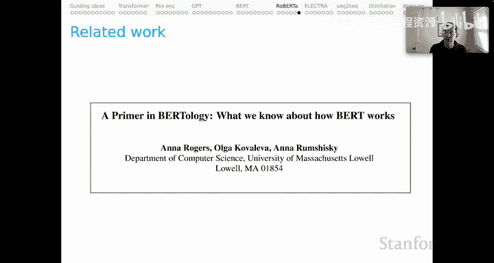

# 9：上下文词表示 Part 6 - RoBERTa 🤖

在本节课中，我们将学习RoBERTa模型。RoBERTa是“稳健优化的BERT方法”的缩写。我们将探讨RoBERTa如何通过更全面的设计空间探索，对原始的BERT模型进行了一系列关键的优化和改进。

上一节我们介绍了BERT模型的一些已知局限性，其中最主要的一点是BERT团队最初的消融研究和优化研究虽然详尽，但仍不够全面。本节中，我们来看看RoBERTa团队如何接手，并对BERT的设计空间进行了更彻底的探索。

## RoBERTa与BERT的关键区别 🔍

以下是RoBERTa与原始BERT模型之间的主要区别列表：

*   **掩码策略**：BERT使用**静态掩码**。这意味着他们将训练数据复制若干份，对每份应用不同的掩码，然后在多个训练周期中重复使用这组已掩码的数据集。RoBERTa则采用**动态掩码**，即在加载每个批次时随机应用掩码，使得包含相同示例的后续批次具有不同的掩码模式。
*   **输入格式**：BERT的输入是两个拼接的文档片段，这对“下一句预测”任务至关重要。RoBERTa的输入是句子序列，这些序列甚至可以跨越文档边界。
*   **训练目标**：BERT包含“下一句预测”目标。RoBERTa则**移除了NSP目标**，认为其贡献不大。
*   **批次大小**：BERT的训练批次包含256个示例。RoBERTa将批次大小**增加到2000个示例**。
*   **分词器**：BERT使用WordPiece分词器。RoBERTa使用**字符级字节对编码**算法。
*   **训练数据**：BERT在BookCorpus和英文维基百科上训练。RoBERTa增加了数据量，在BookCorpus、维基百科、CC新闻、开放网络文本和故事数据集上训练。
*   **训练步数**：BERT训练了100万步。RoBERTa训练了50万步。虽然步数减少，但由于批次大小大幅增加，RoBERTa实际处理的**总实例数要多得多**。
*   **序列长度**：BERT团队认为先训练短序列对优化有益。RoBERTa团队**移除了这一策略**，在整个训练过程中都使用完整长度的序列。

## 关键决策的证据支持 📊

现在，我们来看看支持上述部分决策的实验证据。

### 动态掩码 vs. 静态掩码

RoBERTa团队使用SQuAD、MultiNLI和SST-2作为基准来评估掩码策略。实验结果表明，在SQuAD和SST-2任务上，动态掩码带来了明显的性能提升。虽然在MultiNLI上略有下降，但平均来看，动态掩码效果更好。此外，动态掩码能增加训练数据的多样性，这本身就是一个有益的特性。

### 输入格式的选择：完整句子 vs. 文档句子

RoBERTa团队评估了两种输入格式：“文档句子”和“完整句子”。“文档句子”将训练实例限制为来自同一文档的句子对，这有助于模型学习语篇连贯性。“完整句子”则允许实例跨越文档边界，连贯性保证较弱。

尽管在SQuAD、MultiNLI、SST-2和RACE基准测试中，“文档句子”略微领先，但团队最终选择了“完整句子”。原因在于，除了准确率，训练效率也是重要考量。“完整句子”更容易创建高效的批次，因此被采纳。

### 更大的批次大小

RoBERTa团队通过困惑度、MultiNLI和SST-2等指标评估了不同批次大小的影响。他们发现，将批次大小增加到2000个示例能带来最佳性能。这符合深度学习中的一个常见经验：在资源允许的情况下，使用更大的批次通常是有益的。

### 更多的数据与更长的训练

实验表明，在尽可能多的数据上进行尽可能长时间的训练，能为RoBERTa带来最佳结果。最大的RoBERTa模型使用了160GB的数据，而最大的BERT模型仅使用13GB。虽然RoBERTa的训练步数（50万）少于BERT（100万），但由于批次大小大幅增加，RoBERTa模型实际处理的总训练实例要多得多。这再次印证了深度学习的经验：更多的数据和更长的训练时间，对于创建可用于下游任务微调的预训练模型至关重要。

## RoBERTa模型规格 📐

RoBERTa团队发布了两个可直接与对应BERT模型比较的版本：

*   **RoBERTa-base**：具有12层，768维隐藏层，3072维前馈层，总计约1.25亿参数，与BERT-base大致相同。
*   **RoBERTa-large**：具有24层，1024维隐藏层，4096维前馈层，总计约3.55亿参数，与BERT-large大致相同。

## 总结与延伸阅读 📚

本节课中我们一起学习了RoBERTa模型。正如开头所述，RoBERTa的探索虽然比BERT更全面，但对于BERT模型所暗示的整个设计空间而言，仍然只是非常片面的探索。

对于希望深入了解如何为各种NLP任务最佳设置BERT风格模型的研究者，我强烈推荐阅读Rogers等人撰写的论文《A Primer in BERTology》。这篇论文虽然发布较早，但其内容非常详尽，包含了大量关于BERT模型调优的深刻见解，是本节课内容的绝佳补充读物。

---

**本节课中我们一起学习了RoBERTa模型。** 我们了解了RoBERTa如何通过引入动态掩码、移除NSP目标、增大批次大小、使用更多数据和BPE分词器等优化，对BERT模型进行了改进。这些改变基于更全面的实验证据，旨在更高效地利用计算资源并提升模型在下游任务上的性能。RoBERTa的工作标志着预训练语言模型优化方法的一次重要演进。