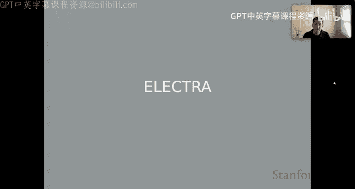
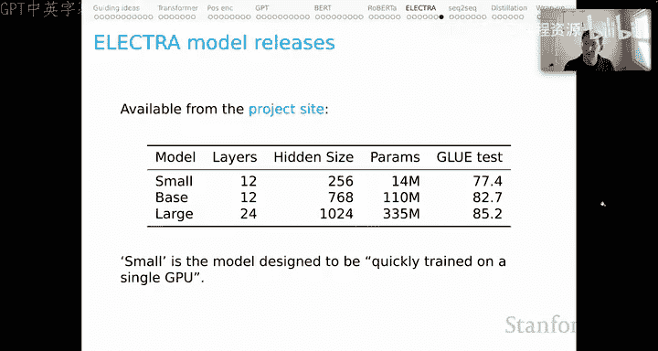

# 10：ELECTRA 模型详解 ⚡

在本节课中，我们将要学习一种名为 ELECTRA 的上下文词表示模型。ELECTRA 旨在解决 BERT 模型的两个主要局限性：预训练与微调阶段之间的词汇不匹配问题，以及掩码语言模型（MLM）目标函数的数据利用效率低下问题。我们将深入探讨 ELECTRA 的核心架构、训练目标，并通过实验证据理解其为何能取得更优的性能和更高的效率。

## 回顾 BERT 的局限性

上一节我们介绍了 BERT 模型及其后续改进。在结束 BERT 部分的讨论时，我们列出了该模型一些已知的局限性：

1.  **训练数据与时长不足**：RoBERTa 模型主要针对此项进行了改进。
2.  **掩码标记（[MASK]）的不匹配**：BERT 在预训练时使用了 `[MASK]` 标记，但在下游任务微调时该标记从未出现。这种不匹配可能降低模型的有效性。
3.  **训练效率低下**：MLM 目标函数意味着模型在训练时只利用了约 15% 的标记进行学习。虽然需要处理序列中的每一个词元，但只有少数提供了学习信号，这无疑是数据低效的。

ELECTRA 模型正是针对第 2 和第 3 点局限性进行改进的。接下来，让我们看看它的核心结构。

## ELECTRA 核心模型结构

ELECTRA 的核心思想是使用一个“生成器-判别器”框架，进行一种称为“替换标记检测”的任务。

假设我们有一个输入序列 **X**：
`厨师 烹饪 了 晚餐`

**第一步：创建掩码版本**
首先，我们像 BERT 一样，随机掩码掉输入序列中约 15% 的标记，得到 **X_masked**。
例如：`厨师 [MASK] 了 晚餐`

**第二步：生成器工作**
我们引入一个较小的、类似 BERT 的模型作为**生成器（Generator）**。它处理 **X_masked**，并预测被掩码位置的原始词元，输出一个序列 **X_corrupt**。
关键点在于：我们并非总是用生成器预测出的最可能词元进行替换，而是**根据生成器输出的概率分布进行采样替换**。
这意味着有时会用回正确的原词（如“烹饪”），有时则会替换成一个错误的词（如“八”）。
例如，**X_corrupt** 可能变为：`厨师 八 了 晚餐`

**第三步：判别器工作**
这才是 ELECTRA 模型的核心。我们引入一个**判别器（Discriminator）**，它也是一个 Transformer 模型。判别器的任务是判断 **X_corrupt** 序列中的每一个词元，是原始的（original）还是被替换过的（replaced）。
对于我们的例子，判别器需要输出：`[原始， 替换， 原始， 原始]`

**训练过程**
生成器和判别器被**联合训练**。生成器学习如何更好地预测被掩码的词（类似 MLM），而判别器学习更准确地区分原始词和替换词。训练完成后，我们可以丢弃生成器，仅保留判别器作为预训练好的模型，用于下游任务。

## 关键设计选择的实验证据

ELECTRA 论文的一个突出优点是其包含了丰富的实验，以探索模型的最佳设置。以下是部分关键发现：

**生成器与判别器的关系**
一个直观的想法是让生成器和判别器共享参数。实验发现，一定程度的共享是有益的，但**最佳结果来自于一个比判别器小的生成器**（即更少的参数共享）。

下图展示了这一证据（此处为文字描述）：
*   **X轴**：生成器大小（最大到 1024 维）。
*   **Y轴**：GLUE 分数（模型整体性能的代理指标）。
*   **趋势**：对于固定大小的判别器（例如 768 维），其性能随生成器大小变化呈**倒U型曲线**。性能峰值出现在生成器较小（如 256 维）时。当生成器变得过大，甚至超过判别器大小时，性能会下降。
*   **直觉**：一个相对“弱小”的生成器对判别器更有利，因为它产生的替换错误更具挑战性，迫使判别器进行更深入的学习。毕竟，判别器才是我们最终要使用的模型。

## 效率分析

ELECTRA 在计算效率方面也表现出色。论文进行了详细的效率对比研究。

**计算预算下的性能**
下图对比了在不同计算预算（预训练浮点运算量）下，各模型的 GLUE 分数：
*   **核心结论**：在**任何**给定的计算预算下，完整的 ELECTRA 模型（图中蓝线）性能都优于其他对比模型。
*   **有趣对比**：
    *   “对抗式 ELECTRA”（让生成器试图欺骗判别器）性能稍逊。
    *   “绿色曲线”代表先进行标准 BERT 预训练，中途切换到 ELECTRA 目标。结果显示，切换后性能立即获得提升，并始终优于持续进行 BERT 训练的策略（图中最低的线）。

**不同目标函数的对比**
论文还对比了几种变体目标函数的效率：
1.  **ELECTRA（完整版）**：判别器对所有输入词元进行分类。
2.  **ELECTRA 15%**：判别器只对被掩码（即可能被替换）的那 15% 的词元进行分类（更接近 BERT 模式）。
3.  **Replace MLM**：仅使用生成器（无判别器），这相当于 BERT 的一种变体。
4.  **All Tokens MLM**：BERT 的另一种变体，对输入序列中的所有词元（而不仅是 15%）进行 MLM 预测。

以下是它们在 GLUE 基准上的性能排序（从高到低）：
*   **ELECTRA（完整版）**
*   All Tokens MLM
*   Replace MLM
*   ELECTRA 15%
*   原始 BERT 模型

这个排序非常具有启发性：
*   它表明，即使沿用 BERT 架构，**通过让模型对所有词元进行预测（All Tokens MLM）**，也能获得比原始 BERT 更好的性能。这印证了 BERT 数据利用效率低的问题。
*   ELECTRA 15% 性能下降说明，**让判别器做更多预测（完整版）是有效的**。
*   ELECTRA 完整版综合了这些优点，取得了最佳性能。

## 模型发布

ELECTRA 团队最初发布了三个预训练模型：
*   **ELECTRA-Small**：一个非常小的模型，设计为可在单张 GPU 上快速训练，体现了对计算效率研究的重视。
*   **ELECTRA-Base**：与 BERT-Base 规模大致相当。
*   **ELECTRA-Large**：与 BERT-Large 规模大致相当。

## 总结

本节课中我们一起学习了 ELECTRA 模型。它通过创新的“替换标记检测”任务，巧妙地解决了 BERT 预训练中的两个核心问题：`[MASK]` 标记带来的预训练-微调不匹配，以及 MLM 目标的数据低效问题。ELECTRA 采用生成器-判别器架构，联合训练后仅使用判别器作为下游任务的基石。丰富的实验证据表明，ELECTRA 在相同的计算预算下能获得比 BERT 及其变体更优的性能，同时其设计（如使用较小的生成器）也充满了洞见。ELECTRA 的出现，标志着预训练语言模型在追求更高性能的同时，也越来越注重训练效率和计算资源的合理利用。