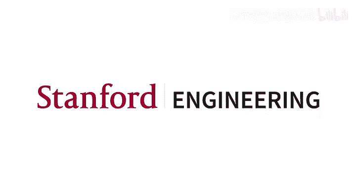
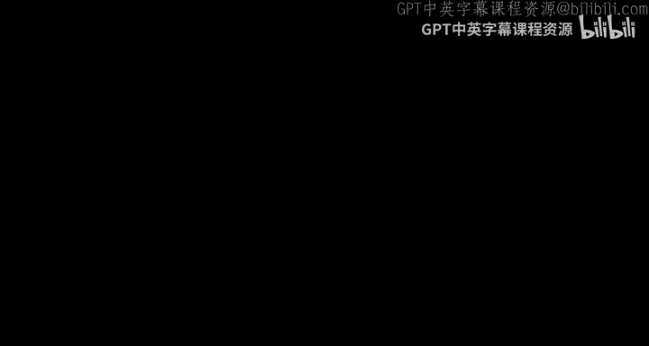
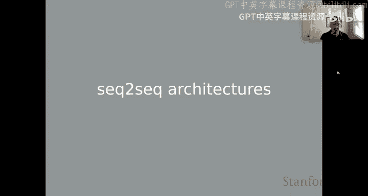
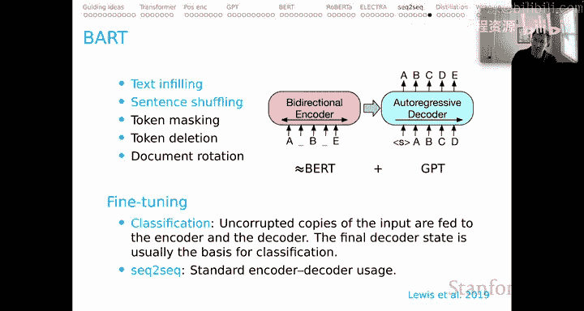

# 11：序列到序列架构 🏗️

在本节课中，我们将要学习序列到序列架构。这是一种强大的模型范式，专门用于处理输入和输出都是序列的任务，例如机器翻译和文本摘要。我们将探讨其核心思想、不同的架构变体，并重点介绍两种著名的模型：T5 和 BART。

---

## 任务概览

上一节我们介绍了上下文表示，本节中我们来看看序列到序列架构所针对的任务类型。这些任务天然具有序列到序列的结构。

以下是典型的序列到序列任务示例：
*   **机器翻译**：输入一种语言的文本，输出另一种语言的文本。
*   **文本摘要**：输入一个长文本，输出一个更短的摘要文本。
*   **自由形式问答**：输入一个问题（可能附带上下文信息），解码任务是生成一个答案。
*   **对话系统**：输入话语，输出回应话语。
*   **语义解析**：输入自然语言句子，输出其对应的逻辑形式。
*   **代码生成**：输入描述程序功能的自然语言句子，输出相应的程序代码。

这仅仅是众多序列到序列任务中的一小部分。它们甚至可以被视为更广泛的“编码器-解码器”问题的特例，这类问题不限于序列，也可以处理图像、视频、语音等。

---

## 历史背景与架构演变

在讨论Transformer之前，了解历史背景很有帮助。循环神经网络时代为我们思考序列到序列问题奠定了基础。

在经典的RNN序列到序列模型中，输入序列（如 A, B, C, D）被编码，解码过程以一个特殊符号开始，逐步生成输出序列（如 X, Y, Z）。为了帮助解码步骤记住编码部分的信息，人们在其基础上增加了各种注意力机制。

Transformer论文则完全拥抱了注意力机制作为核心，并摒弃了所有循环结构。

---

## Transformer中的序列到序列范式

在Transformer的语境下，我们有多种方式来处理序列到序列问题。T5论文中的一张图清晰地展示了这些选项。

以下是三种主要的架构思路：
1.  **编码器-解码器架构**：输入在编码器侧使用一套参数进行完全编码。解码器使用另一套参数进行解码，在每一步都可以关注编码器的所有输出。
2.  **标准语言模型架构**：使用一个基于Transformer的语言模型（如GPT）处理整个序列。其特点是使用**注意力掩码**，使得每个位置只能关注过去的信息，而不能看到未来，即使对于我们认为的“编码”部分也是如此。
3.  **前缀语言模型架构**：这是语言模型架构的一个变体。在处理输入（编码）时，允许完全的自注意力。当开始生成输出（解码）时，则切换到只能关注过去（包括所有编码部分）的掩码模式。

中间和右侧的选项（即基于语言模型的变体）随着GPT类架构的不断探索而变得越来越重要。

---

## 重点模型解析：T5

接下来，我们将聚焦于两种强大的编码器-解码器模型。首先介绍T5，它正是前述架构图的来源。

T5是一个经过广泛多任务（包括有监督和无监督）训练的编码器-解码器模型。其论文中一项非常创新的做法是使用了**任务前缀**。

例如，在输入前加上“translate English to German: ”这样的指令，然后再接上真正的待翻译文本。这个左侧的指令以自然语言的形式告诉模型在解码时应该执行什么任务（此处是翻译）。通过改变冒号前的任务描述，同一模型可以执行情感分析等不同任务。

这体现了深刻的洞察力：将所有任务都表达为自然语言，模型通过编码这些任务指令来引导自身行为，仿佛这些指令本身就是结构化的输入信息。

T5有多个不同规模的模型发布，参数从6000万到110亿不等，可供灵活选用。相关的FLAN-T5模型则是在T5基础上专门进行了指令微调的变体，这将在课程后续单元讨论。

---

## 重点模型解析：BART

另一个值得重点介绍的架构是BART。它与T5有相似之处，也有显著不同。

BART的本质是：编码器侧采用类似BERT的标准架构，解码器侧采用类似GPT的标准架构。其有趣之处在于预训练方式。

BART的预训练核心思想是：**向模型输入被破坏的序列，让它学习如何恢复原貌**。

以下是几种破坏输入序列的方法：
*   **文本填充**：将输入的部分内容完全掩码或删除。
*   **句子乱序**：重新组织输入句子的顺序。
*   **词元掩码**：随机掩码部分词元。
*   **词元删除**：随机删除部分词元。
*   **文档旋转**：旋转文档内容。

研究发现，最有效的预训练方案是结合**文本填充**和**句子乱序**。这种“去破坏”的任务能使模型理解良好序列应有的样子。

在微调阶段，方案有所不同：
*   对于**分类任务**，将未破坏的输入送入编码器和解码器，然后基于解码器的最终状态进行微调。
*   对于标准的**序列到序列任务**，则直接将输入-输出对送入模型进行微调，无需破坏输入。破坏操作主要局限于预训练阶段。

论文证据表明，这种预训练目标能使模型达到一个良好的状态，从而在多种下游任务的微调中表现出色。

---

## 总结

本节课中我们一起学习了序列到序列架构。我们首先了解了其适用的任务类型，回顾了从RNN到Transformer的演变历程。然后，我们分析了Transformer中处理序列到序列问题的三种主要范式。最后，我们深入探讨了两种重要的编码器-解码器模型：**T5**（通过自然语言任务前缀统一多任务）和**BART**（通过“去破坏”序列进行预训练）。它们不仅是强大的预训练模型，也代表了Transformer在序列到序列领域的一些关键创新。