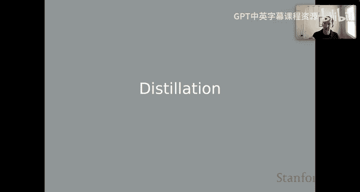
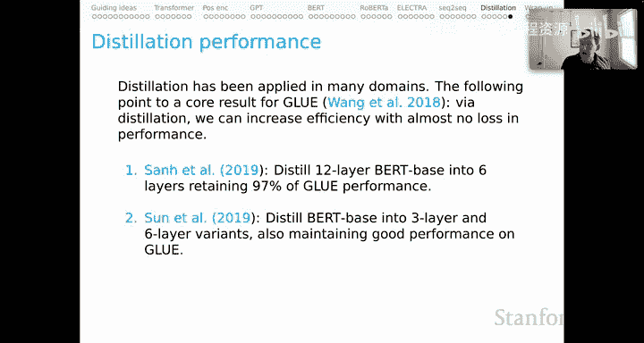
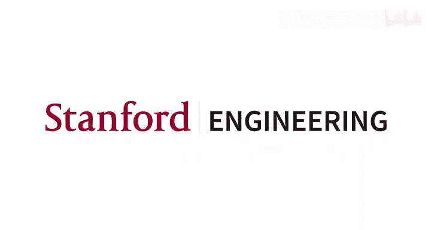

# 12：上下文词表示（第9部分）- 知识蒸馏 📚

在本节课中，我们将要学习知识蒸馏技术。这是一种旨在提升模型效率的方法，其核心目标是将庞大而性能优异的“教师模型”的知识，压缩到更小、更高效的“学生模型”中。

上一节我们介绍了上下文表示的各种应用，本节中我们来看看如何通过知识蒸馏来优化这些模型。

## 概述：追求效率的模型压缩

在课程的第一天，我曾展示过一张追踪大型语言模型规模随时间变化的幻灯片。模型参数量一路攀升，直至达到数千亿级别。然而，一个充满希望的视角是，模型可能会开始变小。模型变小的一个原因在于，我们可以将这些大型模型的精髓“蒸馏”到小型模型中，从而获得在部署时更高效的模型。

知识蒸馏的核心在于，我们拥有一个性能优异但体量庞大、使用成本高昂的教师模型。目标是训练一个学生模型，使其输入输出行为与教师模型相似，但同时使用起来要高效得多。

## 知识蒸馏的目标函数

以下是知识蒸馏的不同目标函数，我将它们从最轻量级到最重量级依次列出。在实践中，人们通常会取这个列表中不同元素的加权平均值。

*   **目标0：任务数据训练**：如果任务有可用的标注数据，学生模型的训练很可能会部分依赖于这些真实数据。我们讨论的蒸馏目标本质上是为核心训练任务补充额外的目标组件。

*   **目标1：模仿教师输出标签**：第一个也是最轻量级的蒸馏目标是，我们简单地训练学生模型，使其产生与教师模型相同的输出标签。这非常轻量，因为在蒸馏时，我们实际上不需要直接访问教师模型。我们只需在可用训练数据上运行教师模型以产生标签，然后学生模型在这些标签上进行训练。这种方法之所以有效，一个指导性的见解是：训练数据中可能存在噪声或难以学习的部分。教师模型充当了一种正则化器，学生模型从观察教师模型的输出中受益，即使其中包含一些错误，因为这最终有助于提升泛化能力。

*   **目标2：模仿教师输出分数向量**：更深一层，我们可以在完整的输出分数向量层面上，训练学生模型使其具有与教师模型相似的输出行为。这实际上是2015年一篇著名蒸馏论文的核心内容。它比仅仅模仿输出标签更重量级，因为我们需要整个分数向量，但它仍然是一种纯粹的行为蒸馏目标。

*   **目标3：对齐输出状态（如DistilBERT）**：在2019年著名的DistilBERT论文中，除了包含类似目标1和2的组件外，其蒸馏目标还有一个余弦损失组件。这里我们试图让教师模型和学生模型在Transformer意义上的输出状态彼此非常相似。这在蒸馏时需要更多地访问教师模型，因为我们需要对每个训练学生的样本在教师模型上进行前向推理以获取这些输出状态，然后应用余弦损失并更新学生模型。

*   **目标4：对齐其他隐藏状态（如嵌入层）**：你也可以考虑绑定教师和学生模型的其他状态，例如其他隐藏状态，或许最突出的是教师和学生模型的嵌入层。其背后的直觉是，如果学生模型的内部表示模仿了教师模型，那么两个模型会更相似，学生模型也会因此更强大。

*   **目标5：模仿干预下的反事实行为**：这可能是更重量级的方法，这是我参与过的工作。我们现在训练学生模型，使其模仿教师模型在干预下的反事实行为。也就是说，我们实际改变教师模型的内部状态，并对学生模型做相应的操作，确保两者具有匹配的输入输出行为。这是一种对输入输出行为更彻底的探索，目的是将模型置于反事实状态，以期使模型具有非常相似的因果内部结构。

目标3、4和5在蒸馏时需要完全访问教师模型，因此非常重量级。但在所有这些情况下，我都假设教师模型是一个冻结的模型，你只需要进行前向推理。

## 知识蒸馏的其他维度

这些蒸馏目标还有另一个值得思考的维度，它们可以相互结合，也可以与我刚才描述的不同模式结合。

*   **标准蒸馏**：如前所述，教师模型是冻结的，只更新学生模型的参数。
*   **多教师蒸馏**：在这种情况下，我们拥有多个可能具有不同能力的教师模型，我们同时尝试将它们全部蒸馏到一个单一的学生模型中，该学生模型有望执行来自这些教师的多项任务。
*   **协同蒸馏**：这种情况下的思考方式非常有趣且不同，学生和教师模型被联合训练，这有时也被称为在线蒸馏。这非常重量级，因为你同时在训练这两个模型。
*   **自蒸馏**：这甚至更难思考。在这种情况下，蒸馏目标包含一些旨在使模型的某些组件与同一模型的其他组件对齐的项。

## 性能表现与总结

就性能而言，正如我之前所说，核心目标是寻求更高效但仍保持高性能的模型。因此，我想通过总结我们在专注于GLUE的自然语言理解特定案例中所知的情况，来结束这个简短的课程。

基于现有证据，我认为可以公平地说，我们可以将BERT模型蒸馏到更小但仍然高性能的模型中。许多研究都使用GLUE基准来追踪这一点，并且都得出了相同的见解。

*   在著名的DistilBERT论文中，他们将BERT-base蒸馏到6层，保留了97%的GLUE性能。
*   Sun等人做了类似的工作。他们尝试将BERT-base蒸馏到3层和6层，也发现可以在GLUE上保持出色的性能。
*   同样，Jiao等人在2020年将BERT-base蒸馏到4层，再次在GLUE上看到了非常强劲的结果。

这组结果值得注意，因为它们都汇聚于同一个经验：我们可以通过将BERT蒸馏到一个更小但仍然在GLUE等基准测试上表现良好的学生模型中，来使其变得更小。因此，这应该能启发我们，将知识蒸馏视为工具箱中的一个强大工具，用于将非常庞大且可能昂贵的教师模型转化为在现实世界中可能更具实用价值的东西。

本节课中我们一起学习了知识蒸馏技术，了解了如何通过不同复杂度的目标函数，将大型教师模型的知识压缩到小型学生模型中，从而在保持高性能的同时显著提升模型效率。