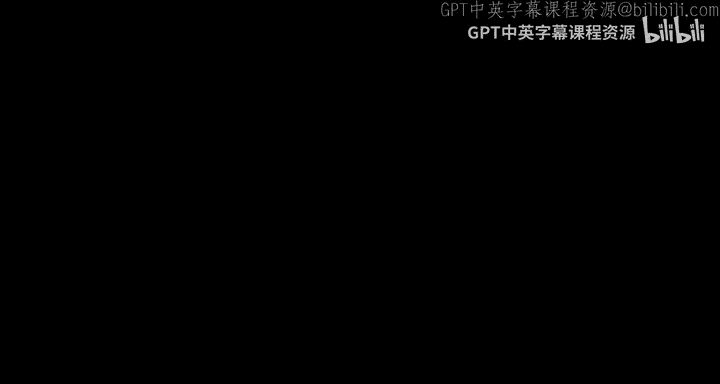
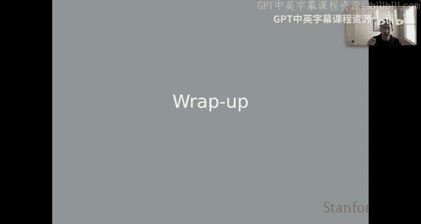
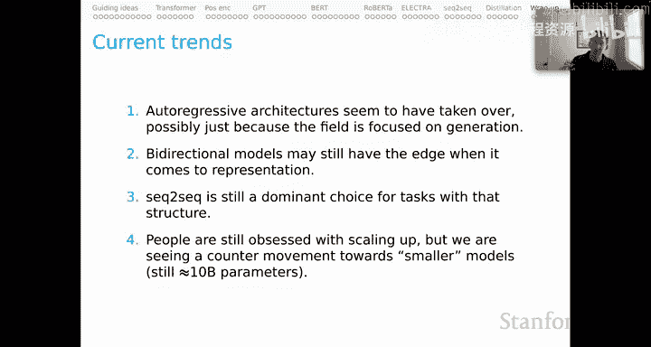

# 13：上下文词表示总结 🎬

在本节课中，我们将对上下文词表示这一系列内容进行总结。我们将回顾核心内容，补充介绍一些因时间限制未能在主系列中提及的重要架构与创新，并展望该领域及本课程的未来发展方向。

## 回顾与总结 📝

上一节我们介绍了多种上下文表示模型。本节中，我们首先对整个系列的内容进行简要回顾。

我们探讨了从传统词嵌入到基于Transformer的上下文表示（如BERT）的演进。核心在于，模型能够根据单词出现的具体上下文，动态地生成其表示，从而更精准地捕捉语义。

## 重要架构补充 🧩

在核心系列中，因时间所限，未能涵盖所有有趣的架构与创新。以下是几个值得注意的补充：

*   **Transformer-XL**：这是一个早期且极具创新性的尝试，旨在处理长上下文。其核心思想是通过缓存长序列的早期部分，并在当前状态的计算中，通过这些缓存状态创建循环连接来实现。
*   **XLNet**：XLNet的目标是在不使用自回归语言建模损失的情况下，获得双向上下文的能力。它通过一种非常有趣的方式实现：对输入序列的不同排列顺序进行采样。这样，模型在按某种顺序（如从左到右）处理时，由于采样了足够多的序列顺序，本质上获得了双向上下文的能力。
*   **DeBERTa**：从我们关于位置编码的讨论来看，DeBERTa非常有趣。我曾表达过一个担忧：在某些情况下，位置编码表示对单词表示的影响过大。DeBERTa可被视为一种将单词与位置在一定程度上解耦的尝试。它通过解耦核心表示，并对这两个部分使用不同的注意力机制来实现。其指导直觉是，DeBERTa能让单词更多地保留其“词性”，而与其在输入字符串中出现的位置相对分离，这看起来非常合理。

## BERT局限性的进一步探讨 🔍

在讨论BERT时，我列出了其一些已知局限性，共四点。我提到RoBERTa解决了第一点（关于设计决策），而ELECTRA解决了第二点和第三点（关于掩码标记的人工性以及MLM训练在BERT上下文中的低效性）。我尚未触及第四点。

第四点来自XLNet论文。XLNet确实解决了这个担忧。该担忧在于：BERT假设被预测的标记在给定未掩码标记的条件下是相互独立的，这过于简化了，因为高阶长程依赖在自然语言中普遍存在。XLNet背后的指导思想是，通过引入自回归语言建模损失，我们带入了一些条件概率，这有助于克服MLM目标这种人工统计特性。但请记住，XLNet有趣之处在于它仍然拥有双向上下文，这来自于对输入字符串所有排列顺序的采样。这是一个关于BERT本质的深刻见解。

## 预训练数据的重要性 📊

我在本系列中完全没有讨论预训练数据，对此我感到有些遗憾。因为我们现在可以看到，预训练数据是塑造这些大型语言模型行为的一个极其重要的因素。

以下是一些核心的预训练资源：
*   OpenWebText Corpus
*   The Pile
*   BigScience数据
*   Wikipedia
*   Reddit

我列出这些年份，并非真的鼓励大家去训练自己的大型语言模型，而是希望大家思考如何审计这些数据集，以此更深入地理解我们现有模型的特性，并理解它们可能在哪些方面成功，在哪些方面可能实际上存在很大问题。许多问题都可以追溯到输入数据的性质。

## 展望未来 🔮

最后，让我们展望未来。根据我的最佳估计，以下是一些当前趋势，很可能描述了我们现在所处的状况以及未来的发展方向。

首先，自回归架构似乎已经占据主导地位，这就是GPT的崛起。但这可能仅仅是因为该领域目前如此专注于生成任务。我仍然认为，如果你只是为了获得句子嵌入或理解不同表示之间的比较，那么像BERT这样的双向模型可能仍然比像GPT这样的模型更具优势。

对于具有序列到序列结构的任务，编码器-解码器模型仍然是主导选择。它们在理解任务本身方面可能具有架构偏差上的优势。不过，随着我们获得这些真正庞大的纯语言模型，我们可能会发现自己在向自回归公式转变，即使是对于具有序列到序列结构的任务。我们拭目以待。

最后，也许这是最有趣的一点。人们仍然痴迷于将语言模型扩展到更大规模。但令人高兴的是，我们也看到了向更小模型发展的反向运动。我在这里给“更小”加上了引号，因为我们谈论的仍然是具有大约100亿参数的模型，但这比那些真正庞大的语言模型要小得多。有很多激励因素将鼓励这些更小的模型变得非常好：我们可以在更多地方部署它们，可以更高效地训练它们，可以训练更多这样的模型，并且对于我们想做的事情，我们可能对它们有更多的控制权。所有的激励因素都存在。这是该领域激烈创新和巨变的时刻。我不知道一年后这些小模型能做什么。但我恳请大家思考如何参与这个激动人心的时刻，并帮助我们达到这样一个阶段：相对较小和高效的模型仍然具有令人难以置信的性能，并且对我们非常有用。

## 总结 📌

本节课中，我们一起学习了上下文词表示系列的总结。我们回顾了核心概念，补充介绍了Transformer-XL、XLNet和DeBERTa等重要架构，探讨了BERT的局限性及XLNet的解决方案，强调了预训练数据的关键作用，并展望了自然语言理解领域未来可能的发展方向，特别是自回归模型的兴起与更小、更高效模型的发展趋势。