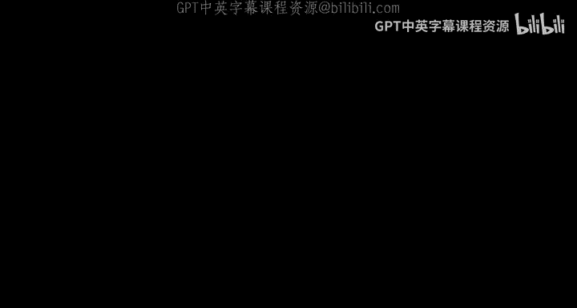
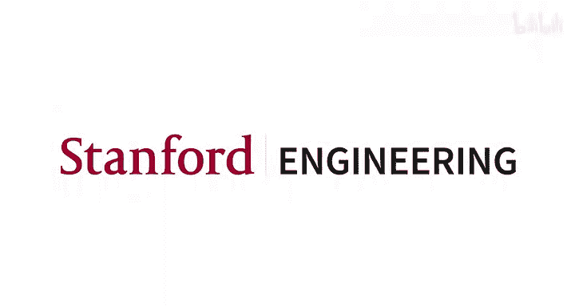

# 14：作业2与Bakeoff概览 🧠




在本节课中，我们将学习课程作业2及其关联的Bakeoff竞赛。本次任务名为“**使用DSP进行少样本开放问答**”。本概述旨在解析这个听起来复杂的标题，并为你提供完成作业所需的清晰指引。

## 任务回顾与定位

首先，我们来回顾几种不同的问答任务。本次作业和Bakeoff竞赛所面临的挑战，对应下表中的最后一行，这是一个**非常困难**的任务。

| 任务类型 | 描述 | 难度 |
| :--- | :--- | :--- |
| **标准问答** | 给定**黄金证据段落**，训练一个问答阅读器从中寻找答案。 | 基础 |
| **开放问答** | **没有**给定段落，需要先检索相关段落，再训练问答模块从中找答案。 | 较难 |
| **少样本问答** | 给定黄金段落，但**不允许**进行任何任务特定的阅读器训练，必须依赖冻结的大语言模型进行上下文学习。 | 困难 |
| **少样本开放问答** | **没有**黄金段落，且**必须**使用冻结的语言模型进行问答部分。 | **非常困难** |

你的任务正是最后一种：**少样本开放问答**。这意味着：
*   在开发阶段，你拥有黄金问答对。
*   在测试（Bakeoff）阶段，你**只有问题列表**，没有黄金段落或其他关联数据。
*   你必须全程使用**冻结的组件**（检索模型和语言模型），不能训练任何LLM，只能进行上下文学习。

这个任务在几年前几乎不可能完成，但去年的学生取得了惊人成果，相信你们也能做到。

## 核心概念：检索后阅读

在少样本开放问答中，一个标准的基线方法是 **“检索后阅读”**。

其工作流程如下：
1.  **检索**：依靠检索机制为问题找到相关的上下文段落。
2.  **构建提示**：可以添加一些少样本示例来指导模型。
3.  **阅读/生成**：使用冻结的语言模型，基于检索到的段落和示例，生成最终答案。

这些少样本示例可以从我们提供的SQuAD数据集中获取，也可以从其他地方构造。关键在于，你的系统需要学会在**没有黄金段落和答案**、只有问题的情况下进行推理。

## 工具介绍：DSP编程库

本次作业我们主要使用 **Demonstrate-Search-Predict (DSP)** 编程库。其核心理念是：**将提示工程转变为真正的软件工程**。你不再是从头开始编写文本提示，而是编写一个小程序。这为我们设计AI系统开辟了全新的思路，让我们能够组合冻结的预训练组件来完成复杂任务。

以下是DSP程序的一个简单结构示例：
```python
@dsp.transformation
def few_shot_open_qa(example: dsp.Example, k: int = 2):
    # 1. 采样示例
    example.demonstrations = dsp.sample(train_set, k=k)
    # 2. 使用模板构建生成器
    generate_answer = dsp.generate(qa_template)
    # 3. 生成答案
    completions = generate_answer(example)
    # 4. 提取答案
    example.answer = completions.answer
    return example
```

## 作业设置详解

### 环境与数据准备

在Notebook中，我们首先进行一些设置：
*   **语言模型**：连接OpenAI或Cohere等供应商提供的冻结大语言模型。你需要自行准备API密钥。
*   **检索模型**：我们为你设置了一个**ColBERT服务器**，它将提供一个强大的检索机制。
*   **数据**：我们使用**SQuAD数据集**。请注意，它在这里的角色是提供**训练和开发示例**，用于构建少样本提示和模拟测试环境，而不是用于训练模型参数。

### DSP基础操作

上一节我们介绍了DSP的理念，本节中我们来看看它的具体用法。

**直接调用语言模型**
你可以直接向语言模型发送字符串查询，并控制生成参数（如温度`temperature`）。
```python
responses = lm("Which US states border no US states?", temperature=0.9)
```

**使用模板构建提示**
更常用的方式是使用DSP模板来格式化提示，并从中提取结构化信息。
```python
# 定义模板
qa_template = dsp.Template(
    instructions="Answer the question.",
    question=dsp.Field(),
    answer=dsp.Field()
)
# 创建示例并生成
example = dsp.Example(question="Which US states border no US states?")
generate_answer = dsp.generate(qa_template)
completion = generate_answer(example)
print(completion.answer) # 例如：Alaska, Hawaii
```

**进行检索**
使用我们提供的ColBERT检索器为问题查找相关段落。
```python
retrieved_passages = dsp.retrieve("Your question here", k=3)
```

## 作业问题与要求

所有核心组件准备就绪后，我们进入作业的具体问题。

**问题一：带上下文的少样本开放问答**
这是对基础“检索后阅读”流程的一个小修改。你需要编写一个DSP程序，在生成答案前，先为问题检索相关的上下文段落，并将其加入提示中。

**问题二：使用`annotate`原语优化示例**
`annotate`是DSP中一个非常强大的原语。在本问题中，你需要利用它来**构造更有效的少样本示例**，从而更好地引导系统产生你期望的行为。

**原创系统设计**
在完成上述问题后，你需要设计自己的原创系统。我们期望它是一个**DSP程序**，因为DSP库提供了丰富的原语来构建强大的解决方案。当然，你也可以自由选择任何其他技术。

如果你想进一步探索DSP，课程提供了介绍Notebook，其中展示了解决更复杂问答问题的先进编程技巧，这些技巧在我们讨论上下文学习时会详细讲解。

## 总结与挑战

本节课我们一起深入了解了作业2——“使用DSP进行少样本开放问答”。我们明确了这是一个极具挑战性的任务，它结合了开放问答和少样本学习的难点。我们介绍了完成该任务的核心方法（检索后阅读）、主要工具（DSP编程库）以及作业的具体要求。



请记住，你的武器是**冻结的模型**和**聪明的提示设计**。虽然不能训练模型，但通过精心构建的DSP程序和提示，你完全能够在这个看似不可能的任务上取得进展。祝你好运！