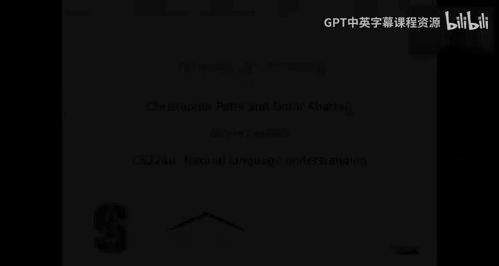
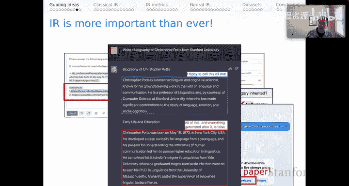
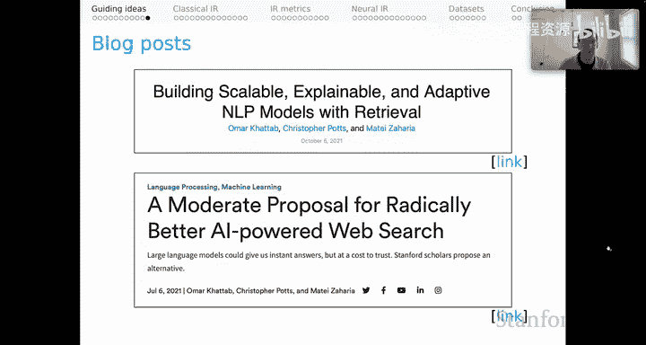

# 15：信息检索（第一部分）核心思想 🧠

## 概述

在本节课中，我们将探讨信息检索（Information Retrieval, IR）的核心思想。我们将看到自然语言处理（NLP）技术如何革新信息检索领域，同时，信息检索又如何反过来推动NLP任务变得更加开放和实用。课程将涵盖从经典检索方法到现代神经检索模型的演变，并重点介绍检索增强的上下文学习这一前沿方向。

---

## NLP如何革新信息检索

上一节我们概述了课程内容，本节中我们来看看NLP技术对信息检索领域的深刻影响。

你可能已经注意到，NLP正在彻底改变信息检索。这个故事真正始于Transformer架构，或者更准确地说，始于其最著名的衍生模型之一：**Bert**。在Bert发布后不久，谷歌就宣布将其核心搜索技术融入Bert的某些方面。微软也几乎在同一时间对Bing搜索引擎做出了类似的宣布。我有一种感觉，这两次非常公开的宣布只是各大搜索引擎开始发生变革的冰山一角。

稍晚一些，我们看到大型语言模型（LLMs）开始在搜索中扮演直接角色。我认为初创公司`u.com`在这方面极具远见。我喜欢强调`u.com`，因为其CEO Richard Socher是本课程的杰出校友。`u.com`很早就预见到大型语言模型可以成为网络搜索中非常有趣且强大的组成部分。

此后，该领域出现了大量活动。例如，微软与OpenAI合作，现在将OpenAI模型作为Bing搜索体验的一部分。你可能也从另一个角度注意到，当GPT-4发布时，其公告的一部分是与摩根士丹利的合作，旨在帮助其员工使用GPT-4在他们自己的内部文档中查找信息。这表明，虽然我们经常听到公共网络搜索，但在组织内部也存在同样强大的搜索应用，它们同样由Transformer技术驱动。

你可能会问，为什么会发生这种变革？我认为根本原因在于，信息检索本身就是一个困难的**自然语言理解**问题。因此，我们的NLU技术越强大，我们在检索方面就能做得越好。

以下是一个能说明这一点的例子。

查询是：“**what compounds protect the digestive system against viruses**”（哪些化合物保护消化系统免受病毒侵害？）。
一个相关的文档内容是：“**In the stomach, gastric acid and proteases serve as powerful chemical defenses against ingested pathogens.**”（在胃中，胃酸和蛋白酶作为对抗摄入病原体的强大化学防御。）

颜色标注显示了相关性连接。你会注意到，查询中的关键词与文档中的关键词**没有字符串重叠**。我们在这里需要建立的连接完全是**语义层面**的。这表明，我们对查询和文档的语言理解得越深入，就越能更好地根据此类查询找到相关段落。

---

## 信息检索如何革新NLP

以上主要关于信息检索，但作为一名NLP研究者，对我来说更令人兴奋的方向是，信息检索现在正在革新NLP。其方式是通过让我们的NLP问题变得更加开放，更贴近实际日常任务。

让我用**问答**（Question Answering）来强调这一点。

在NLP领域目前标准的问答任务设定中，系统会获得一个标题、一个上下文段落和一个问题。任务是回答该问题，并且保证答案将是该上下文段落中的一个**字面子字符串**。这是在诸如**SQuAD**（斯坦福问答数据集）等任务中定义的标准问答。

重申一下，在训练时，你获得标题、上下文、问题和答案。在测试时，你获得标题、上下文和问题，并且保证答案是上下文段落的一个字面子字符串。这对于我们最好的模型来说曾经是一个难题，但现在已变得相当容易。同时，你也可以看到，这与我们在现实世界中想要进行的问答任务相当脱节，因为在现实世界中，我们很少能获得如此丰富的上下文或那种子字符串保证。

因此，我们作为一个领域正在转向一种我称之为**开放问答**（Open QA）的设定。这种模式将**困难得多**。

在这种模式下，可能有一个标题、一个上下文和一个问题，任务是回答。但现在，在训练时只给出问题和答案。标题和上下文段落需要从某个地方（可能是一个大型文档语料库，比如网络）**检索**出来。当然，检索出来后，我们无法保证答案会是上下文或标题中任何内容的字面子字符串。这是一个困难得多的问题，但也**更贴近实际**，因为这模拟了实际在网络上的搜索行为：你提出一个问题，需要检索相关信息来回答问题。

但困难得多的是，训练时只有问题和答案。测试时，你只得到问题，所有相关信息都需要被检索。你在这里看到的是，只要我们拥有真正优秀的检索技术，能为我们回答这些问题找到真正好的证据，我们就能开发出有效的系统。这就是检索在这个开放问答流程中的关键作用，你们将在本单元的相关作业和竞赛中探索这一点。

😊

---

## 知识密集型任务

问答实际上只是一系列**知识密集型任务**中的一个例子。我提到了问答，但我们还有诸如**声明验证**、**常识推理**、**长篇阅读理解**和**信息寻求对话**等任务。这些任务都明显非常依赖于拥有关于世界的丰富信息，以支撑系统做出的任何预测。

这一点很清楚。但我也有兴趣将标准的、通常是封闭的NLP任务扩展为更开放的变体。例如：

*   **摘要**：标准设定只是将输入一个长段落并尝试生成一个更短的段落作为任务。但我们难道不能将其变成一个知识密集型任务，用我们检索到的大量信息来增强输入吗？我认为这是一个合理的假设，可能会改进摘要系统。
*   **自然语言推理**：通常被设定为一个封闭的分类问题：前提、假设，然后给出三个标签之一。但用关于世界的信息来增强前提，帮助系统作为分类器做出更好的预测，这不是很有趣吗？

我认为这只是两个例子，说明我们如何能够将经典问题，甚至是分类问题，重新表述为知识密集型任务，从而受益于检索，结果是它们可以变得更有效，也更易于扩展到现实世界的问题。

---

## 信息检索方法

让我们谈谈信息检索方法，我将从**经典IR**开始。

在这种情况下，我们有一个用户查询进来：“**When was Stanford University founded?**”（斯坦福大学何时成立？）

以下是经典IR流程的步骤：

1.  **术语查找**：我们离线创建了一个大型索引，将术语映射到相关的文档。这可能是一个包含该术语的文档列表，但我们可能还会根据这些查询术语对这些文档进行一些评分，以按相关性组织它们。
2.  **文档评分**：基于该索引，我们可以进行文档评分，并向用户返回一个按相关性排序的文档排名列表。
3.  **用户筛选**：然后由用户决定查看哪些文档来寻找问题的答案。

这就是我们所熟知的经典搜索体验。

---

## 纯语言模型方法

现在有一种趋势，试图用**纯语言模型**取代上述流程的许多部分。我称之为“**LLMs for everything**”（万物皆可LLM）方法。

在这种模式下，用户的查询进来：“When was Stanford University founded?”，一个对我们完全不透明的大型语言模型进行一些神秘的工作，然后直接输出答案：“Stanford University was founded in 1891.”（斯坦福大学成立于1891年。）

这对搜索体验是一个真正的改变。以前，我们必须浏览一个排好序的网页列表来找到答案；现在，答案直接给到我们。

这可能非常令人兴奋，然而，我们可能会开始担心。我们知道这些模型可以**捏造证据**。因此，我们应该批判性地看待它们的输出。由于我们不知道这个答案从何而来，我们对其产生过程一无所知。我们可能会开始怀疑我们的信息需求是否真的得到了满足，是否应该信任这个字符串。

我对这种模式深感担忧，以至于我认为我们应该推动一个不同的方向。这就是为什么**神经信息检索**模块在NLP的开放知识密集型任务中将继续扮演重要角色。

---

## 神经信息检索模型

神经IR模型的功能将很像那些经典模型，只不过是在一个**丰富得多的语义空间**中运作。

我们将从一个大型语言模型开始，就像在“LLMs for everything”方法中一样，但我们会以不同的方式使用它。

以下是神经IR的步骤：

1.  **文档编码**：我们要做的第一件事是，使用语言模型对我们文档集合中的所有文档进行表示。这样做的结果将是一些**密集的数值表示**，我们期望这些表示能捕捉到文档结构和意义的重要方面。这本质上相当于经典IR模式中的文档索引，但现在它是一堆深度学习表示。
2.  **查询编码**：然后用户的查询进来，我们对该查询做的第一件事是处理它（可能使用同一个大型语言模型），并获得该查询的密集数值表示。
3.  **评分与提取**：基于所有这些表示，我们可以像往常一样进行评分和提取。此时，我们可以复现经典搜索体验的一切，唯一的区别是评分将以不同的方式进行，因为我们现在处理的不是术语和分数，而是我们在整个深度学习中所熟悉的这些密集数值表示。

但所有这些评分的结果是，我们向用户返回一个**排好序的页面列表**。因此，就用户需要搜索这些页面并找到问题答案而言，我们为用户复现了经典体验。我们只是希望，由于我们在一个丰富得多的语义空间中操作，我们能在提供相关页面方面做得更好。

---

## 通向上下文学习的桥梁

这是通向**上下文学习**（In-Context Learning）的一个好时机，上下文学习是本单元的另一部分，它们将在作业中结合起来。

让我们想想这个桥梁将如何搭建。现在，我们将处于使用大型语言模型并对其进行**提示**的模式。在这种情况下，我们只是用问题“**who is Bert?**”来提示它，任务是以我们正在操作的模式想出一个答案。这是系统给我们的唯一东西。这是一个真正的开放问答设定。

那么，问题是如何使用检索来有效地回答这个问题？

😊

以下是可能的检索增强步骤：

*   **检索证据**：我们可以从文档存储中为该问题检索一个上下文段落，希望这将成为回答该问题的相关证据。
*   **检索演示**：我们知道大型语言模型在进行上下文学习时，受益于拥有**演示示例**。因此，也许我们有一个训练好的问题集，我们可以从该集合中检索一个问题来使用。此时，我们可以使用该问题的训练答案，或者可能检索一个答案，希望这能更接近地模拟系统实际必须做的事情。
*   **组合演示与证据**：无论如何，我们现在有了这个演示。根据训练集，我们可以进一步使用训练证据（例如来自我们问答数据集的段落），或者再次使用检索器检索一个上下文段落，作为这个小演示的证据。

指导性假设是，通过将训练实例与一些检索步骤编织在一起，为回答这个问题提供证据，我们将在生成预测答案方面做得更好。

这是一个简单的“**检索-然后-阅读**”流程，我们使用检索器来寻找证据。在上下文学习单元以及你们完成作业时，你们将看到，这只是我们可以用来有效开发使用检索来寻找相关证据的上下文学习系统的**一系列丰富选项**的开始。这就是这两个主题真正结合的方式。

---

## 当前领域的核心问题与挑战

我认为这两个主题的结合是当前NLP和IR领域的核心问题之一。因为我们确实看到，作为搜索技术一部分部署的大型语言模型出现了许多令人担忧的行为。

例如，我们都看到谷歌因其在一个演示视频中犯了一个小的事实错误而导致股价受到重创。考虑到这一切的风险有多高，也许这是恰当的，但想想也很有趣，因为与此同时，OpenAI的模型正在到处捏造证据。

这是一个有点有趣的例子，我问系统：“**Are professional baseball players allowed to glue small wings to their caps?**”（职业棒球运动员允许在他们的帽子上粘小翅膀吗？），并要求模型为其给出的答案提供一些证据。它确实尽职尽责地说“不”，然后提供了一些证据，但它提供的证据链接完全是**捏造**的。它们不是指向真实网页的链接。如果你点击它们，会得到一个404页面。我发现这非常令人沮丧，而且比根本不提供证据更糟糕，因为我们已经习惯于看到URL并假设它们确实可以作为所给答案的某种真实证据。因此，这种真实证据被完全捏造的事实，绝对比根本不提供证据更糟糕。

这是另一个有趣的案例。我们将讨论我们的“**Demonstrate-Search-Predict**”论文，该论文的图一包含一个例子，问题是：“**How many stories are in the castle David Gregory inherited?**”（大卫·格雷戈里继承的城堡有多少层？）。在Twitter上，一位用户读了我们的论文，然后用Bing搜索引擎尝试了这个例子。他们说，啊哈，你看，Bing可以回答你这个看起来非常困难的问题，没问题。但随后该用户立即注意到，Bing实际上在引用我们自己的论文作为回答这个问题的证据。我要说，这让我深感担忧。我们的论文不应该被视为关于大卫·格雷戈里继承的城堡的良好真实证据。我们纯粹是将其用作说明性例子。如果我们意图稍有不同，我们实际上可能给出这个问题的错误答案。事实上，我们的图中确实嵌入了一些错误答案。因此，一篇关于检索上下文学习的科学研究论文会被用作关于大卫·格雷戈里继承的城堡的证据，这对我来说完全无法理解。这恰恰表明，仅仅因为你有一些搜索机制，并不意味着你在进行**良好的搜索**。在这种背景下，我们真正需要的是**高质量搜索**。

为了完整说明这一点，我发现这个例子很有趣，但也可能有点令人担忧。你们都应该用自己的名字试试。我用“**write a biography of Christopher Potts from Stanford University**”（写一篇斯坦福大学Christopher Potts的传记）来提示ChatGPT。

我对第一段非常满意。它对我非常恭维，我们可以说它是真实的。但红色框中的所有内容**完全是虚假的**。那里表达的所有事实信息都是假的。这对我来说是一篇不错的传记，我对这些事实没有任何抱怨，除了它们是假的。然而，我担心的原因是，我认为并不是每个人在要求自己的传记时都会得到如此恭维的信息。如果这些语言模型继续以这种方式捏造证据，我们正处在看到真正令人担忧的行为的边缘，这些行为将对社会中的人们产生真正有意义的下游影响。这就是为什么我觉得当前单元以及你们为此所做的工作，对于解决这个日益增长的社会和技术问题**绝对极其重要且相关**。

😊

---

## 延伸阅读与愿景

这为课程奠定了基础。如果你想了解更多，Omar、Mattezaharia和我在几年前写过两篇关于这个主题的博客文章，我认为它们仍然非常相关。

*   第一篇是“**Building Scalable, Explainable, and Adaptive NLP Models with Retrieval**”（用检索构建可扩展、可解释和自适应的NLP模型）。这是一篇技术性的博客文章。
*   另一篇是更高层次、更具前瞻性的“**This Modest Proposal for Radically Better AI-Powered Web Search**”（关于彻底改进AI驱动网络搜索的温和建议）。早在2021年，我们就强调了信息的**来源**和文档中的**真实依据**作为进行网络搜索（即使使用大型、强大、花哨的语言模型）的一个重要方面。

这就是我们将在整个本单元以及我们的作业中试图向你们展示的愿景。

---

## 总结

本节课中，我们一起学习了信息检索的核心思想。我们探讨了NLP与IR之间相互革新的关系：强大的NLP技术（如Transformer和LLMs）通过深化语义理解提升了检索质量；同时，将检索引入NLP任务（如开放问答）使其变得更加开放和实用。我们回顾了从经典术语匹配检索到现代神经语义检索的演变，并重点介绍了**检索增强的上下文学习**这一前沿方向。最后，我们讨论了当前LLM在搜索中捏造证据等挑战，强调了高质量、可追溯的检索对于构建可靠、负责任的AI系统至关重要。这些概念将为我们后续的深入学习与实践奠定基础。