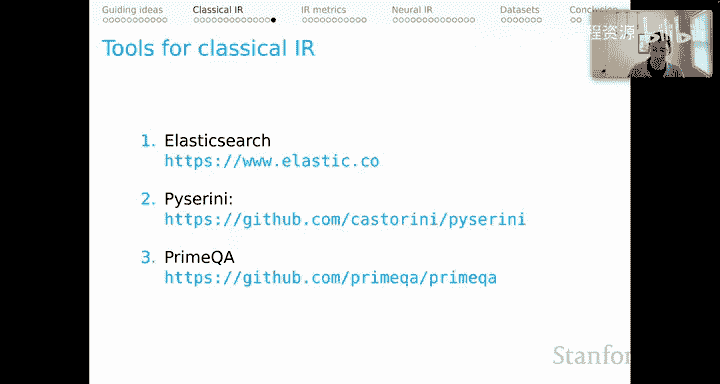

# 16：经典信息检索（第二部分）🔍

在本节课中，我们将学习经典信息检索方法的核心概念。虽然本课程的重点是神经信息检索，但理解这些经典思想至关重要，因为它们非常强大，并且很可能成为你未来构建模型的重要组成部分。

## 经典信息检索的起点：词项-文档矩阵

上一节我们介绍了信息检索的基本概念，本节中我们来看看其核心数据结构。

经典信息检索的标准起点是**词项-文档矩阵**。矩阵的行代表词项（单词），列代表文档，单元格记录每个单词在每个文档中出现的次数。这些矩阵通常非常庞大且稀疏，但它们潜在地编码了大量关于哪些文档与哪些查询词相关的信息。

为了从矩阵中获取更多相关性信息，一种常见的方法是使用 **TF-IDF** 对词项-文档矩阵中的值进行调整。

## TF-IDF：词频-逆文档频率

TF-IDF 是一种衡量词项在文档集合中重要性的经典方法。以下是其工作原理：

我们从文档集合 **D** 开始：
*   **词频** 是文档内部的度量。给定文档 **d**，词项 **t** 的 TF 计算公式为：
    `TF(t, d) = (词项 t 在文档 d 中出现的次数) / (文档 d 的总词数)`
    这是一个标准的相对频率值。
*   **文档频率** 是针对整个语料库的函数。我们简单地计算**包含目标词项 t 的文档数量**，无论该词项在每个文档中出现多少次。
*   **逆文档频率** 是语料库总大小与文档频率值的比值的对数：
    `IDF(t, D) = log( |D| / DF(t) )`
*   **TF-IDF** 就是 TF 和 IDF 值的乘积：
    `TF-IDF(t, d, D) = TF(t, d) * IDF(t, D)`

TF-IDF 的核心思想是寻找那些能真正区分特定文档的词项。其值在以下情况达到最大：词项在**极少数**文档中出现**非常频繁**。相反，其值在以下情况最低：词项在**非常多**的文档中出现**非常不频繁**。

对于一个可能包含多个词项的给定查询，计算相关性得分的标准方法是，对词项-文档矩阵中使用的权重（例如 TF-IDF）进行求和。即，将查询中每个词的 TF-IDF 值相加，从而得到整个用户查询的相关性得分。

## BM25：最佳匹配算法

BM25 可以说是最著名的经典信息检索方法。它是 TF-IDF 的一种增强版本。

BM25 的权重由两部分组成：
1.  **平滑的 IDF 值**：对标准 IDF 进行了微调，以处理词项在零个文档中出现的情况。
2.  **评分函数**：类似于 TF-IDF 中的词频，但更为复杂，包含了超参数。

其权重是调整后的 IDF 值与评分函数值的乘积。从高层次看，它与 TF-IDF 的构成非常相似。

让我们更详细地看看各个组成部分。

### BM25 的 IDF 组件

BM25 使用的 IDF 公式与标准版本略有不同，但通过设置一个标准参数（通常为 0.5），其产生的值与标准 IDF 值在整个文档频率范围内非常接近。其主要作用是处理词项在零个文档中出现时的边界情况。

### BM25 的评分函数与超参数

评分函数更为复杂，因为它引入了超参数 **K** 和 **B**。

以下是评分函数中各个部分的作用：

*   **对长文档的惩罚**：评分函数中包含一个惩罚项，旨在降低长文档的得分。直觉是，长文档仅仅因为篇幅长就可能包含更多词项，因此我们应降低对其所含词项的信任度，将其作为相关性证据的权重。
*   **超参数 B 的作用**：**B** 控制着对长文档施加的惩罚力度。**B 值越高，对长文档的惩罚越大**，从而进一步降低其得分。当文档长度等于平均长度时，B 值不产生影响。
*   **超参数 K 的作用**：**K** 出现在评分函数的分母中，其整体效果是**平滑高频词项的影响**。当 K 值设得非常低时（非标准做法），评分函数几乎变成一个指示函数：只要词项出现在文档中就得基本分，而不太关心它出现了多少次。随着 K 值增大，这种极端平滑效果减弱，系统会越来越关心词项在文档中出现的频率。标准 K 值（如 1.2）会产生适度的平滑效果，即当词项频率非常高时，得分的增长会趋于平缓。

## 高效检索：倒排索引

有了这些组件，我们可以回到信息检索中的经典**倒排索引**。之所以称为“倒排”，是因为它是从词项映射到文档列表，而不是从文档映射到词项列表。

当查询到来时，我们进行词项查找。在使用 BM25 或 TF-IDF 时，我们可以用预计算的得分、文档频率值和 IDF 值来增强这个索引。这样，对于给定的查询，我们就拥有了高效进行完整文档评分所需的所有要素。这也是经典方法具有巨大可扩展性的关键原因之一。

## 经典信息检索的扩展方向

以上涵盖了我想介绍的经典信息检索核心内容。但如果不提及其文献中深入探讨的几个明显主题，将是我的疏忽：

以下是经典信息检索可以进一步探索的几个方向：
*   **查询与文档扩展**：用额外信息或元数据来增强用户查询和语料库内容，以辅助相关性评分。
*   **短语级搜索**：可以超越单元词，考虑 N 元语法甚至更复杂的语言单位。
*   **词项依赖性**：经典方法通常假设文档中的词项相互独立，但像“New York”这样的二元词组显然不适用。应考虑词项间的统计依赖关系。
*   **不同文档字段**：文档并非同质，出现在标题中的词与正文中的词可能具有不同的内在相关性价值。优秀的检索技术应能区分这些差异。
*   **链接分析**：语料库中的文档通过超链接形成隐含的图结构。现代搜索经验表明，这是影响相关性和让最佳文档排名靠前的关键因素。
*   **学习排序**：根据查询学习什么是相关的功能，是神经信息检索模型的重要特征。在经典 IR 中，我们也可以学习排序函数，超越 TF-IDF 和 BM25 等先验计算。

## 工具与实用模式

最后，有许多工具可以帮助你进行经典信息检索：
*   **Elasticsearch**：一个广泛部署、非常健壮、成熟且高度可扩展的搜索技术，功能丰富。
*   **Pyserini** 和 **PrimeQA**：研究代码库，如果你想建立经典 IR 模型作为基线，或将它们用作更大系统的组件，这些工具会非常有用。

一种常见的实用操作模式是：使用**非常快速、健壮的经典 IR 系统**（如基于 BM25）进行初步检索，返回大量候选结果；然后让**神经模型**扮演“重排序器”的角色，对经典模型返回的核心结果进行精细化排序。这种模式既能获得高度可扩展的解决方案，又能利用神经模型的优势提升最终结果质量。

---

**本节课总结**：我们一起学习了经典信息检索的核心方法。我们从基础的**词项-文档矩阵**和 **TF-IDF** 出发，深入探讨了其增强版 **BM25** 算法，理解了其评分函数以及对长文档的惩罚机制。我们还回顾了实现高效检索的**倒排索引**结构，并简要展望了经典 IR 的扩展方向及与现代神经模型结合的实用模式。这些经典思想为理解更复杂的神经信息检索模型奠定了坚实的基础。