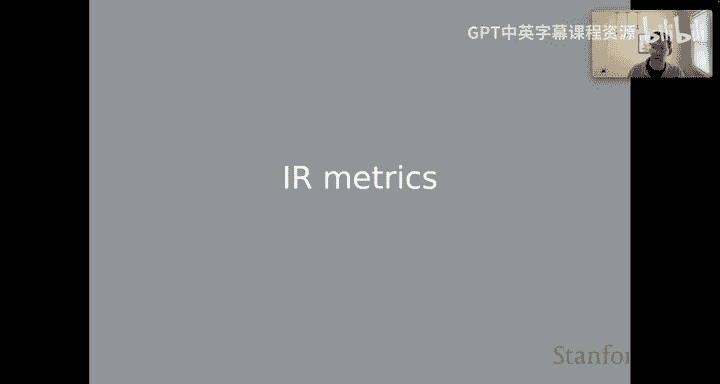
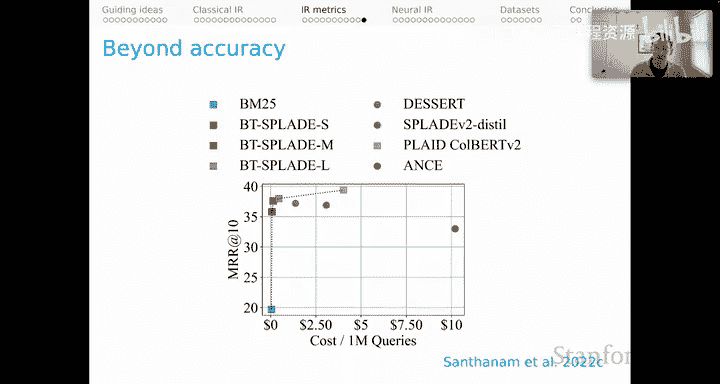

# 17：信息检索评估指标 📊

在本节课中，我们将要学习如何评估信息检索系统的质量。上一节我们介绍了经典的IR模型，本节中我们来看看用于评估这些系统的核心指标。我们将重点讨论准确性指标，但也会强调评估IR系统时需要考虑的其他重要维度。

## 系统评估的多维度视角

在深入准确性指标之前，需要强调评估IR系统质量有多种方式。准确性指标在文献中很突出，也是系统质量的一个重要方面，但部署IR系统时，特别是工业环境中，还需考虑许多其他因素。

以下是评估IR系统时需要考虑的其他关键维度：

*   **延迟**：执行单个查询所需的时间。在工业环境中，延迟限制通常非常严格，用户期望低延迟系统。
*   **吞吐量**：在固定时间内服务的总查询量，可能与延迟相关，但有时需要权衡。
*   **计算量**：作为硬件无关的总计算资源衡量标准，这是一个很好的整体衡量标准。
*   **磁盘使用量**：模型或索引的磁盘使用成本，尤其是在索引整个网络时，存储成本可能非常高。
*   **内存使用量**：模型或索引的内存使用量。为了获得低延迟系统而将整个索引保存在内存中，成本可能迅速增加。
*   **成本**：一种总结上述所有因素的方式，促使我们整体思考系统以及这些指标之间固有的权衡。

考虑到成本约束，我们开始以一种非常健康的方式思考权衡。更多的IR评估应该处于这种整体模式中，平衡所有这些考虑因素。

尽管如此，我们现在将重点讨论准确性指标。

## 信息检索的数据集类型

作为预备知识，我们应该讨论一下你可能拥有的数据集类型。它们与我们在NLP中习惯的数据集略有不同。

以下是IR中常见的数据类型：

*   **完整或部分黄金排序**：对于查询，拥有所有文档的完整或部分黄金排序。为数据集中的每个查询提供这样的排序显然非常昂贵。
*   **不完整的部分排序**：通过一些启发式方法，将部分文档呈现给人类进行排序，可能每个查询只有少数几个，并以此为基础自动推断总排序。
*   **二元相关性判断**：简单地判断语料库中的文档对于给定查询是否相关。这很常见，可以基于人工标注，也可以基于弱监督启发式方法。
*   **正负文档元组**：一个包含查询的一个正例文档和一个或多个负例文档的元组。这可以用于训练和评估IR系统。

有了这些数据类型，让我们开始思考指标本身。

## 基础评估指标：Success@K 与 Reciprocal Rank

我们将从最简单的指标开始，即Success@K和Reciprocal Rank。

两者的一个常见组成部分是“排名”。对于文档排序 **D**，查询在该排序中的 **rank** 是一个整数，表示排序中第一个相关文档的位置。

在此基础上，我们可以定义 **Success@K**。我们选择一个值 **K**，然后对于查询和排序，如果查询的 **rank** 小于或等于 **K**，则 **Success@K** 的值为 **1**，否则为 **0**。这是一个二元判断。

**Reciprocal Rank** 类似。文档排序中查询的 **RR@K** 是排序中该查询的 **rank** 的倒数（如果 **rank** 小于或等于 **K**），否则为 **0**。这与Success@K相同，只是当成功时，我们使用 **1/rank** 而不是 **1**。

然后，**MRR@K** 是文献中常见的指标，它只是多个查询的 **RR@K** 值的平均值。

## 通过示例理解指标

让我们通过一些示例来更深入地理解这些指标。我将使用以下排序作为运行示例。

**排序1**：`[*][*][ ][ ][ ][*]`
**排序2**：`[ ][*][ ][ ][*][*]`
**排序3**：`[ ][ ][*][*][*][ ]`

星号 `*` 表示文档被判定为与查询相关。

在讨论指标之前，你可能会退一步问自己，这些排序中哪一个最好？这可能并不明显，可能取决于视角。例如，排序1看起来很好，因为前两个文档是相关的，但它把第三个相关文档放在了最后。相比之下，排序3的所有相关文档都在第3、4、5位，但至少没有把它们放在最后。排序2可能看起来介于这两个极端之间。显然，不同的指标会对不同方面的质量敏感。

让我们回到Success和Reciprocal Rank。

**Success@2** 的值：
*   排序1：**1**（因为位置1或2有相关文档）
*   排序2：**1**（因为位置2有相关文档）
*   排序3：**0**（因为位置1或2没有相关文档）

**RR@2** 的值：
*   排序1：**1/1 = 1.0**（第一个相关文档在位置1）
*   排序2：**1/2 = 0.5**（第一个相关文档在位置2）
*   排序3：**0**（因为位置1或2没有相关文档）

## 更细致的指标：精确率与召回率

现在让我们转向精确率和召回率，这些是经典的IR指标，比Success和RR更细致，因为它们对多个相关文档敏感。

首先，两个初步概念：
*   排序在值 **K** 处的 **返回集** 是排序中位于 **K** 或以上的文档集合。
*   给定文档排序，查询的 **相关集** 是所有与查询相关的文档集合（即所有带星号的文档）。

然后我们可以定义 **精确率@K**。分子是返回集与相关集的交集大小，分母是 **K**。直观地说，如果我们将 **K** 或以上的值视为我们的猜测，精确率表示这些猜测中有多少是好的。

**召回率@K** 是它的对偶。分子相同（返回集与相关集的交集大小），但分母是相关文档的总数。这类似于说，如果 **K** 或以上的集合是我们的猜测，那么有多少相关文档实际上出现在 **K** 或以上？

让我们看看这些值在我们的三个排序中如何体现。

**精确率@2**：
*   排序1：`2/2 = 1.0`
*   排序2：`1/2 = 0.5`
*   排序3：`0/2 = 0.0`

**召回率@2**：
*   排序1：`2/3 ≈ 0.67`
*   排序2：`1/3 ≈ 0.33`
*   排序3：`0/3 = 0.0`

这大致重现了我们为Success和Reciprocal Rank看到的排序。

但这里有一个转折。假设我们将 **K** 值设置为 **5**，而之前是 **2**。

**精确率@5**：
*   排序1：`2/5 = 0.4`
*   排序2：`2/5 = 0.4`
*   排序3：`3/5 = 0.6`

**召回率@5**：
*   排序1：`2/3 ≈ 0.67`
*   排序2：`2/3 ≈ 0.67`
*   排序3：`3/3 = 1.0`

值得注意的是，当 **K=5** 时，排序3现在明显领先，因为它没有把任何相关文档放在第6位。这向你展示了 **K** 值对我们整体质量评估的重要性。当我们使用这些指标时，应该思考设置 **K** 值意味着什么，以及它如何影响我们对排序质量的评估。

## 平均精确率：减少对K值的依赖

**平均精确率** 是一个很好的替代方案，因为它对 **K** 值的敏感性较低。查询相对于文档排序的平均精确率直观地表述如下：分子，我们将在每个存在相关文档的位置（每个有星号的位置）获得精确率值，然后将它们求和。分母是相关文档的集合大小。

以下是使用我们之前的三个排序的计算结果：

*   **排序1**：相关文档在位置1, 2, 6。对应的精确率@1=1/1=1.0，@2=2/2=1.0，@6=3/6=0.5。求和：`1.0 + 1.0 + 0.5 = 2.5`。除以相关文档数3：`2.5 / 3 ≈ 0.833`
*   **排序2**：相关文档在位置2, 5, 6。对应的精确率@2=1/2=0.5，@5=2/5=0.4，@6=3/6=0.5。求和：`0.5 + 0.4 + 0.5 = 1.4`。除以3：`1.4 / 3 ≈ 0.467`
*   **排序3**：相关文档在位置3, 4, 5。对应的精确率@3=1/3≈0.333，@4=2/4=0.5，@5=3/5=0.6。求和：`0.333 + 0.5 + 0.6 = 1.433`。除以3：`1.433 / 3 ≈ 0.478`

这很有意义，因为排序1是明显的赢家，即使我们不再对 **K** 敏感。事实上，在这个指标中，排序3领先于排序2，这是我们之前除了将 **K** 设得很低的情况外没有真正看到的。这很好，因为我们没有对任何特定 **K** 值的敏感性，我们已经抽象了所有可能选择的不同值，并且分子仍然跟踪相关文档的数量。

## 如何选择评估指标？

这是一个常见指标的抽样。当然还有更多，但它们遵循类似的模式。让我们退一步问，你应该使用哪个指标？此时你可能预料到我的答案：没有单一的答案。

让我们思考一些权衡：

*   如果用户滚动浏览 **K** 个文档的成本很低，那么 **Success@K** 可能已经足够细致，因为你只需要在该 **K** 个文档集合中找到一个相关的。
*   如果每个查询有多个相关文档，那么Success和Reciprocal Rank可能过于粗糙，因为它们对拥有多个相关文档不敏感。
*   如果找到每个相关文档更重要，则倾向于 **召回率**。
*   如果只查看相关文档更重要（即遗漏成本高，但审查成本低），则倾向于 **精确率**。如果审查成本可能很高，但我们不太在意遗漏一些内容，只需要找到几个相关示例，那么也可以倾向于精确率。
*   **F1@K** 是 **K** 处精确率和召回率的调和平均值，可以在有多个相关文档但其在 **K** 以上的相对顺序不太重要时使用，并且你决定平衡精确率和召回率。
*   在我展示的所有指标中，**平均精确率** 将给出最细致的区分。它对排名、精确率和召回率都敏感。因此，如果你没有太多信息，并且希望在不同预测的排序之间进行细致区分，平均精确率可能是一个非常好的选择。

但正如开始时所说，我希望我们能跳出只考虑准确性的思维模式。

## 超越准确性：综合评估与帕累托前沿

为了引导我们朝这个方向思考，可以考虑所谓的“综合排行榜”，它从文献中汇集了许多不同的系统，并试图从论文中找出它们在硬件、准确性（如MRR）和延迟方面的表现。

如果只关注准确性列，你可能会选择某个性能最好的系统。然而，为了实现那个MRR值，某些系统可能需要非常强大的GPU硬件。而其他一些系统在质量上可能具有可比性，但所需的硬件资源更少。在这些系统中，你可以开始思考硬件和延迟之间的权衡。这让你以一种全新的方式思考哪个系统是最好的。

这是另一种视角，通常称为系统的 **帕累托前沿**。给定我们决定衡量的两个方面，一些系统严格主导另一些系统。当然，可能还有其他维度会导致其他系统领先。因此，我们需要再次进行整体思考。这强化了一个观念：系统质量问题没有一个固定的答案。最终需要考虑许多维度和许多权衡。

---

本节课中我们一起学习了信息检索系统的核心评估指标。我们从基础的Success@K和Reciprocal Rank开始，探讨了更细致的精确率与召回率，并介绍了对K值依赖较小的平均精确率。更重要的是，我们认识到评估IR系统不能只局限于准确性，必须综合考虑延迟、吞吐量、成本等多维度因素，并在具体应用场景中进行权衡。没有放之四海而皆准的“最佳”指标或系统，明智的选择取决于你的具体目标与约束条件。