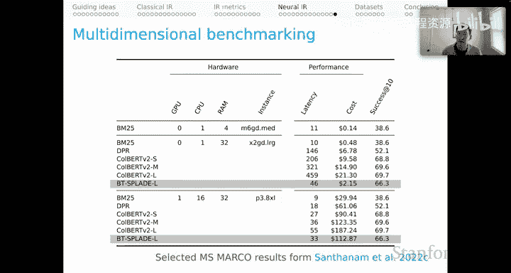

# 18：神经信息检索 🔍

在本节课中，我们将学习神经信息检索的核心模型。我们将探讨如何利用预训练的BERT模型进行微调，以实现更强大的信息检索能力。课程将涵盖从概念上最简单的交叉编码器，到高效可扩展的密集段落检索器，再到平衡了语义丰富性和效率的ColBERT模型，最后介绍创新的Splade模型。通过学习这些模型，你将理解现代神经信息检索如何将深度学习的语义理解能力与传统检索任务相结合。

---

## 交叉编码器：语义丰富但难以扩展 🤔

上一节我们介绍了传统检索模型的基础。本节中，我们来看看神经信息检索中最直观的方法——交叉编码器。

交叉编码器在概念上是最简单的方法。其核心思想是将查询文本和文档文本拼接成一个单一的文本序列，然后使用BERT模型处理这个序列，并利用模型中的表示作为信息检索微调的基础。

具体来说，其工作流程如下：
1.  将查询和文档拼接：`[CLS] 查询文本 [SEP] 文档文本 [SEP]`
2.  使用BERT编码器处理拼接后的文本。
3.  获取`[CLS]`标记上方的最终输出状态。
4.  在该状态之上添加任务特定的参数层，并针对信息检索目标对模型进行微调。

这种方法的评分函数可以表示为：
`scores = DenseLayer(BERT([CLS] query [SEP] document [SEP]))`

模型的损失函数通常是正例段落的负对数似然。假设我们有一个数据集三元组（查询，正例文档，一个或多个负例文档），损失函数公式如下：
`Loss = -log( exp(score_positive) / (exp(score_positive) + Σ exp(score_negative)) )`

这种方法在语义上极具表现力，因为它允许查询和文档在BERT模型的每一层进行丰富的词元级交互。然而，它存在一个致命缺陷：无法扩展。因为在查询时，我们需要为每一个候选文档（例如十亿个）与查询拼接后进行一次BERT前向传播，这在计算上是不可行的。

---

## 密集段落检索器：高度可扩展但交互有限 ⚡

既然交叉编码器因计算成本过高而难以应用，本节我们来看看另一个极端——密集段落检索器。

DPR采用了一种不同的架构：它分别编码查询和文档。查询和文档通过两个独立的BERT类编码器进行处理，我们同样只取`[CLS]`标记上方的最终输出状态作为其表示。

然后，评分通过这两个向量的点积来计算：
`score = dot(encode_query(query), encode_document(document))`

其损失函数与交叉编码器形式相同，依然是正例段落的负对数似然，只是内部的比较函数`Sim`换成了点积操作。

DPR的优势在于其高度的可扩展性。所有文档可以离线预先编码并存储为单个向量。在查询时，我们只需编码一次查询，然后与所有文档向量进行快速的点积运算即可。然而，这种效率的代价是失去了词元级的细粒度交互。模型必须希望查询和文档的所有信息都能被压缩到那一个单一的向量表示中，这可能导致语义表达能力的损失。

---

## ColBERT：在丰富性与效率间取得平衡 ⚖️

为了在语义丰富性和计算效率之间找到更好的平衡点，我们接下来介绍ColBERT模型。

ColBERT的工作机制如下：
1.  分别使用BERT编码查询和文档，但这次我们保留所有词元的最终输出状态，而不仅仅是`[CLS]`标记的。
2.  计算查询每个词元输出向量与文档每个词元输出向量之间的相似度矩阵。
3.  评分基于“最大相似度和”：对于查询中的每个词元，找出它与文档所有词元相似度中的最大值，然后将所有查询词元的这些最大值相加。

其评分函数`MaxSim`可以表示为：
`score = Σ_over_query_tokens( max_over_document_tokens( cosine_sim(q_i, d_j) ) )`

ColBERT兼具了可扩展性和语义丰富性。与DPR一样，文档可以预先编码并存储（此时存储的是每个词元的向量），实现了可扩展性。同时，它又保留了类似交叉编码器的词元级交互能力（尽管这种交互只发生在最终输出层，而非每一层），从而获得了语义丰富性。

这种设计带来了一个关键优势：它实现了基于语义的“词项匹配”。例如，对于查询“When did the Transformers cartoon series come out?”和文档“The animated Transformers was released in August 1986”，ColBERT不仅能匹配“Transformers”，还能在“cartoon”和“animated”、“come out”和“released”之间建立强大的语义关联。这使得模型既有效又可解释。

---

## 让神经检索走向实用：索引与优化策略 🛠️

尽管ColBERT等模型在效果上表现出色，但其计算成本仍然是实际部署的挑战。本节我们来看看如何通过系统优化使其走向实用。

一个直接的方法是将其用作重排序器。具体流程如下：
1.  **第一阶段**：使用BM25等快速、基于词项的检索模型，从海量文档中快速召回Top-K个相关文档。
2.  **第二阶段**：仅对这K个候选文档使用ColBERT进行精细的重排序和评分。

这种方法用廉价的BM25承担了从全量文档库中粗筛的重任，而让强大的ColBERT只负责小范围精排，从而在控制成本的同时大幅提升最终结果质量。

为了更进一步，我们可以构建专门的索引并进行多阶段检索：
1.  预先构建索引，存储每个文档的所有词元向量。
2.  查询时，将查询编码为词元向量序列。
3.  **第一阶段**：对查询中的每个词元向量，从索引中查找最相似的P个文档词元向量。
4.  **第二阶段**：通过这些词元向量找到其关联的文档，形成一个较小的候选文档集。
5.  **第三阶段**：仅对这个小型候选集使用完整的ColBERT模型进行评分。

为了极致优化，可以采用**基于质心的排序**：
1.  将索引中所有文档词元向量进行聚类，并用各簇的质心作为代表。
2.  查询时，将查询向量与这些质心进行比较，找到最相似的质心。
3.  通过这些质心关联到相似的文档词元，进而找到候选文档。
4.  最后仅对这批少量文档进行ColBERT全模型评分。

通过名为**Plaid**的优化工作，研究团队将ColBERT的延迟从287毫秒成功降低到了58毫秒。这启示我们，在追求模型精度的同时，对延迟、成本等系统级指标的优化同样充满创新空间，并且至关重要。

---

## Splade：基于词汇表的稀疏表示 💡

最后，我们介绍另一种强大且具有独特视角的模型——Splade。

Splade的核心思想发生了转变：它不再直接计算查询与文档之间的交互，而是分别将查询和文档表示成相对于整个词汇表的稀疏向量。
1.  对于一段文本（查询或文档），模型计算其每个词元与词汇表中每个词项的交互分数，形成一个分数网格。
2.  通过一个特定的`sparsemax`函数，为词汇表中的每个词项生成一个针对该文本的分数，得到一个长而稀疏的向量。
3.  分别得到查询和文档的稀疏向量后，它们的相似度通过点积计算：`score = dot(SparseVector(query), SparseVector(document))`。

其损失函数在标准负对数似然基础上，增加了一个促进表示稀疏性的正则化项。

Splade的强大之处在于，它以一种全新的方式回归了信息检索中“词项匹配”的核心思想，但这次匹配发生在由神经网络定义的、极其丰富的语义空间里。它生成的稀疏表示也带来了效率上的潜在优势。

---

## 总结与权衡：不仅仅是准确率 📊

本节课中，我们一起学习了神经信息检索的演进之路。

我们从语义丰富但难以扩展的**交叉编码器**开始，认识了高度可扩展但交互有限的**密集段落检索器**。然后，我们深入探讨了在两者间取得优雅平衡的**ColBERT**模型，它通过“最大相似度和”实现了高效的细粒度交互。接着，我们讨论了如何通过**重排序**、**多阶段检索**和**索引优化**（如Plaid）使这些强大模型变得实用。最后，我们了解了**Splade**模型如何利用稀疏的词汇表表示开辟新路径。

重要的是，在实际应用中，选择模型远不止看准确率这一项指标。我们需要在**准确率、延迟、计算成本和硬件需求**之间进行复杂的权衡。例如，在严格的计算预算下，BM25可能是唯一选择；而在资源允许时，则需要在ColBERT的不同配置或ColBERT与Splade等模型之间，根据对延迟和成本的承受能力来权衡准确率的得失。信息检索领域正是思考和探索这些系统级权衡的绝佳舞台。