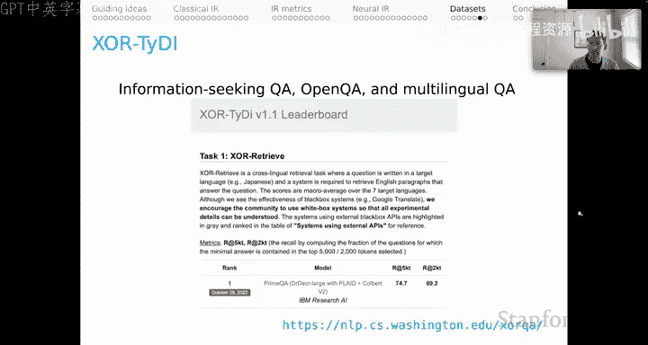
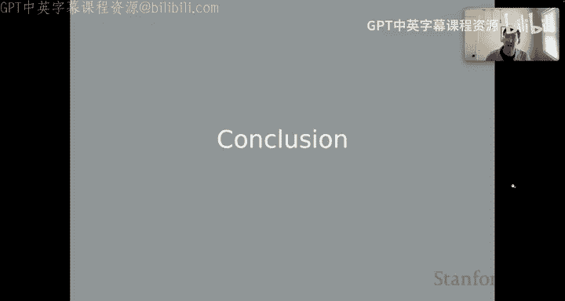
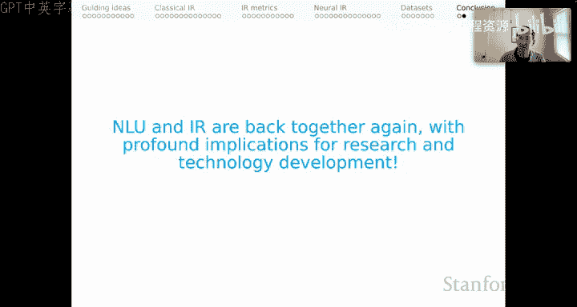

# 19：信息检索（五）—— 数据集与总结 📚

在本节课中，我们将学习信息检索领域常用的几个核心数据集，并了解一些未深入讨论的重要主题，最后对本单元内容进行总结。

---

## 数据集资源 📊

上一节我们介绍了神经信息检索模型，本节我们来看看用于训练和评估这些模型的关键数据集。以下是几个重要的公开数据集：

*   **TREC (文本检索会议)**：该会议每年举办竞赛。2023年的竞赛包含多个不同赛道，适合参与“烘焙赛”式的研究。TREC通常强调使用少量查询（例如50个）进行精细评估，每个查询约有100个已标注的相关文档。这并不意味着文档总量少，而是评估过程更为精确。

*   **MS MARCO**：这是信息检索领域极其重要的资源，也是最大的公开检索基准。它由一个问答数据集改编而来，基于超过50万个Bing搜索查询。虽然标注相对稀疏（每个查询只有一个相关性标签），但这恰好符合训练之前介绍的神经IR模型所需的环境。对于段落排序任务，它提供了900万个短段落；对于文档排序任务，它提供了300万个长文档。这是一个用于探索系统性能和创建预训练资源的绝佳平台。

*   **BEIR (信息检索基准测试)**：这是一个重要的新基准，其核心目标是在多种不同领域和任务设置下，对IR模型进行多样化的零样本评估。该基准近期在模型评估中非常有用。

*   **LOTTE (长尾主题分层评估)**：这是我们发布的一个配套数据集。其核心思想是主要利用Stack Exchange平台，来探索相当复杂和多样化的问题。它同样用于零样本评估。我们发布的数据集包含了主题对齐的开发集和测试集对，因此你可以在开发集上测试系统的零样本性能，然后尝试迁移到可比较的领域。LOTTE的另一个特点是包含两个部分：一部分侧重于网络搜索中常见的查询，另一部分则侧重于论坛（如Stack Exchange）中人们直接提出的更复杂的问题。

*   **Xor/TyDi QA**：这是一个出色的项目，旨在将信息检索推向更广泛的多语言环境，涵盖问答、开放域问答以及纯检索应用。如果你考虑开发多语言IR解决方案，这个数据集值得关注。

以上就是关于数据集的内容。当然还有其他数据集，但以上是一些最核心的资源。

---

## 未深入讨论的核心主题 💡

接下来，我想列出几个我未能深入讨论的核心主题。

首先，关于**负采样技术**有大量文献。回想一下我描述的那些三元组（查询、正例文档、负例文档）。关键问题是：负例从哪里来？你总需要在“让负例足够简单以便模型区分”和“让负例足够困难以便模型学习细微差别”之间取得平衡。把握好这个平衡可能非常具有挑战性。

其次，我也没有充分讨论**弱监督**。我提到过一种策略：检查文档是否包含查询词作为子字符串，并将其用作相关性的信号。我们在先前的工作中发现，这种简单的启发式方法可能非常强大。我认为这尤其表明，在训练系统时，我们应该更多地采用弱监督方法，因为它通常非常有效且成本低廉。

最后，我在最近的论文中多次提到 **DINOSCORE**。这是一种将许多不同指标整合为单一统一指标的方法，用于创建能够全面体现IR各个方面的排行榜。我们将在本季度晚些时候讨论DINOSCORE。我认为我会再次回到IR这个例子，因为它很好地说明了在考虑系统质量时，多种因素是如何共同作用的。

---

## 总结 🎯

本节课中我们一起学习了信息检索领域的关键数据集和一些延伸主题。

最后，我想强调一点：自然语言理解（NLU）和信息检索（IR）再次紧密地结合在了一起，这对研究和技术发展具有深远影响。我希望这一系列的课程向你展示了这个研究领域是多么活跃和令人兴奋，并促使你思考如何参与其中。无论是在学术界，还是在努力应用语言技术的工业界，你都可以产生非常大的影响。

这是一个在科学和技术上都极其激动人心的领域，也是一个关于这些领域如何重新结合以实现新的、更大目标的精彩而鼓舞人心的故事。