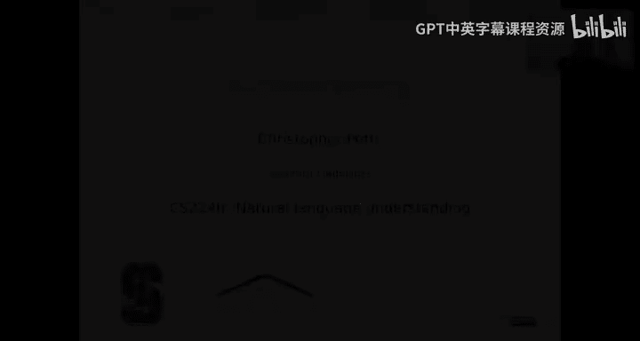
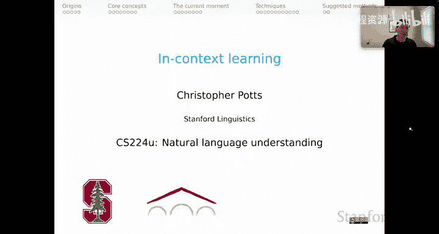
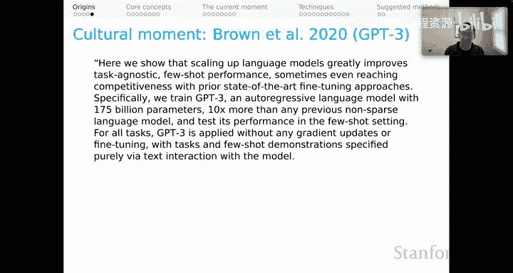

# 20：上下文学习，第一部分：起源 🧠

在本节课中，我们将要学习上下文学习这一核心概念的起源。我们将回顾从早期基于规则的语言模型到现代大型语言模型的发展历程，了解“仅通过文本提示即可让模型执行多种任务”这一革命性想法是如何诞生的。

---

欢迎各位。这是我们关于上下文学习系列的第一个视频。

这个系列与我们之前关于信息检索的系列相辅相成。

这两个系列将共同帮助你完成作业2和竞赛2，其重点是使用冻结的检索器和冻结的大型语言模型进行少样本开放域问答。

---

为了开启这个系列，我们首先反思一下上下文学习这一概念的起源。

这实际上是一个关于自然语言处理领域如何发展到当前这个既奇特、令人兴奋又有些混乱的时期的故事，或许对整个社会而言也是如此。

---

所有功劳归于“乔姆斯基机器人”将我们带到这一刻。

我是在开玩笑。“乔姆斯基机器人”是一个非常简单的基于模式的语言模型。

我相信它自90年代就已存在。通过非常简单的机制，它能生成大致模仿政治哲学家兼语言学家诺姆·乔姆斯基风格的散文。

它生成的散文令人愉悦，或许也能给我们带来启发。其底层机制非常简单。

我认为这很好地提醒了我们，即使是当今所有这些大型语言模型，其本质可能也是如此。

不过，我确实只是在开玩笑，尽管这玩笑只开了一半。

当我们思考上下文学习的先例时，值得提到的是，在深度学习时代之前，基于N-gram的语言模型——那些非常稀疏的大型语言模型——通常确实非常庞大。

例如，Brants等人在2007年使用了一个拥有3000亿参数、在2万亿文本标记上训练的语言模型来辅助机器翻译。

这是一个非常庞大且强大的机制，与当今的大型语言模型性质不同，但值得注意的是，它们在很久以前就在许多不同领域发挥了重要作用。

---

我认为，就我们所知的上下文学习而言，最早的论文，据我所知，是DaCa NLP论文。

这是McCann等人在2018年的工作。他们使用自然语言问题作为任务指令进行多任务训练，这似乎就是“通过自由形式的自然语言指令，我们最终可以得到仅由文本引导就能执行多种任务的模型”这一想法的起源。

同样值得指出的是，在GPT论文（Radford等人，2018）中，你可以发现一些关于使用该模型进行基于提示的实验的初步提议。

但这个想法真正的起源，再次据我所知，是Radford等人在2019年的GPT-2论文。

让我展示一下这篇论文的一些片段。他们所做的工作之多，确实令人鼓舞。

他们在开头写道：“我们证明语言模型可以在零样本设置下执行下游任务，而无需任何参数或架构修改。”

在这里，你看到了使用冻结模型、提示它们并观察其是否能产生有趣行为这一想法。

他们研究了许多不同的任务，例如摘要生成。

他们写道：“为了诱导摘要行为，我们在文章后添加文本‘TL;DR’，然后生成100个标记。”这非常令人震惊。

我记得当我第一次听说这个想法时，我对这类上下文学习能成功抱有强烈的认知偏见，以至于我以为他们想告诉我们的是，他们专门训练了那个标记来做摘要，然后只是给它起了一个花哨的名字。但并非如此，他们确实是认真的。他们只是用这个标记提示模型，然后观察输出结果。

对于翻译任务，他们写道：“我们测试GPT-2是否已经开始学习如何将一种语言翻译成另一种语言。为了帮助模型推断出这是期望的任务，我们以示例对的上下文为条件，格式为‘英语句子 = 法语句子’。然后，在最后的提示‘英语句子 =’之后，我们使用贪婪解码从模型中采样，并将第一个生成的句子作为翻译。”

这非常了不起。你在这里看到浮现的是“演示”这一想法，即在提示中包含一些你期望行为的示例，以此引导模型去做你想让它做的事情。

这里有一个类似的例子。他们写道：“与翻译类似，语言模型的上下文被设定为示例问答对，这有助于模型推断数据集的简短答案风格。”这是针对问答任务的。同样，他们开始发现演示可以帮助模型理解隐含的任务指令。

他们在论文中还评估了许多其他内容，如文本补全、Winograd模式、阅读理解等，可能还有其他任务。这是一次非常令人印象深刻且全面的探索，对方法的优点和局限性非常开放，是一篇极具创意和启发性的论文。

---

这就是该想法在研究意义上的开端。

而文化意义上的转折点无疑出现在GPT-3论文（Brown等人，2020）中，这篇论文本身也以多种方式令人印象深刻。

在这里，我将引用其摘要的一部分，我们可以稍作停留，思考一下它的内容。

他们开头写道：“我们表明，扩大语言模型的规模极大地改善了任务无关的少样本性能，有时甚至达到了与先前最先进的微调方法相竞争的水平。”

我们可以争论他们是否真的达到了那种竞争水平，但毫无疑问，他们在这种任务无关的少样本设置中，从他们的模型中获得了非常令人印象深刻的行为。

具体来说：“我们训练了GPT-3，这是一个拥有1750亿参数的自回归语言模型，比以往任何非稀疏语言模型多10倍，并在少样本设置中测试其性能。”

关于这部分，有两点我非常喜欢。第一，1750亿参数确实非常宏大且令人印象深刻，即使在今天也是如此，更不用说在2020年了。第二，我真的很喜欢他们提到了“非稀疏语言模型”，这是对我之前提到的那些通常非常庞大的基于N-gram模型的认可。

对于所有任务，GPT-3的应用都没有任何梯度更新或微调，任务和少样本演示纯粹通过与模型的文本交互来指定。

这很好。事后你可能会觉得他们在这里有点重复，因为他们已经确立了这些将是冻结模型。但我认为他们有必要这样做，因为这在当时是一个非常陌生的想法。我可以想象，作为这篇论文的读者，会认为他们不可能真的意味着对所有任务都只使用冻结模型，肯定在某个地方有微调。因此他们强调，事实上，模型是完全冻结的。

GPT-3在许多NLP数据集上取得了强大的性能，包括翻译、问答和完形填空任务，以及一些需要即时推理或领域适应的任务，例如在句子中使用新词来解读乱序词或执行三位数算术。

我喜欢这一点。任务的多样性非常真实。我认为你可以看到他们真正在尝试挑战在这种模式下可能达到的极限。

同时，我们也发现了一些GPT-3的少样本学习仍然存在困难的数据集，以及一些GPT-3面临与在大型网络语料库上训练相关的方法论问题的数据集。

我也很喜欢这句话。它再次对他们取得的成就和存在的局限性非常开放。他们承认发现了一些对模型来说仍然困难的任务。他们还在论文中承认，他们本意是确保没有在相关测试任务的数据上进行训练，但实际上他们并没有完全做到这一点。他们对此非常开放，并探讨了在他们所操作的规模下，要做到这一点有多困难。

因此，就像GPT-2论文一样，这是一次对思想非常开放和彻底的探索。

---

在本节课中，我们一起学习了上下文学习概念的起源。我们从简单的“乔姆斯基机器人”模式模型谈起，回顾了早期大规模N-gram模型的作用，然后重点探讨了GPT-2和GPT-3论文如何开创性地展示了仅通过文本提示和演示，就能让冻结的大型语言模型执行多种复杂任务。这些早期工作为当前自然语言处理领域激动人心的发展奠定了基础。