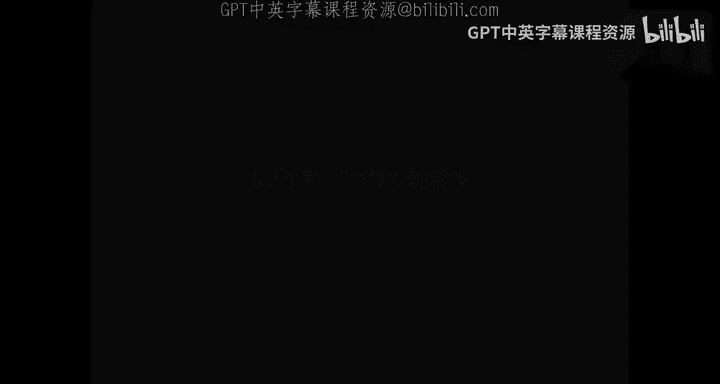
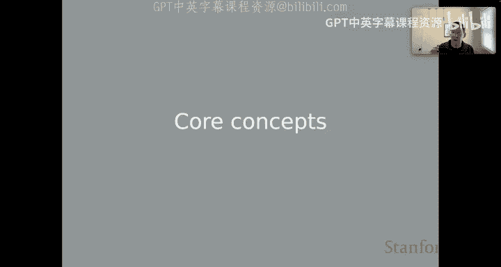
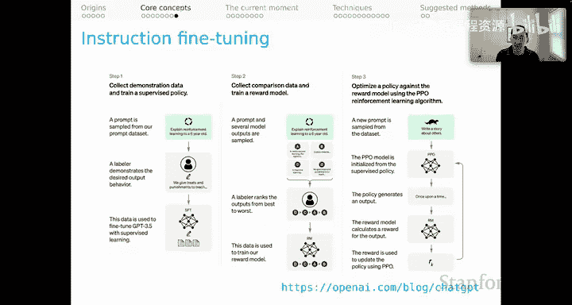

# 21：上下文学习核心概念（第二部分）🚀

在本节课中，我们将深入探讨上下文学习的几个核心概念。这些概念将帮助我们理解大型语言模型如何在不更新参数的情况下，仅通过给定的提示文本来执行任务。

---

## 术语定义 📖

首先，让我们明确一些关键术语。文献中对这些术语的使用存在差异，因此我将清晰地阐述我的定义。

**上下文学习** 指的是一个**冻结的**语言模型，仅通过**条件化**于提示文本来执行任务。模型是冻结的，意味着没有梯度更新。我们唯一的学习机制是输入一些文本，使模型进入一个临时的状态，我们希望这个状态能帮助它生成对我们任务有用的内容。

**少样本上下文学习** 是上下文学习的一个特例。其特点是提示中包含预期行为的示例，并且这些示例**未在训练中见过**。当然，在模型基于海量文本训练的时代，我们通常无法验证这一点。但这是少样本学习的理想和精神所在：即仅凭少数几个例子，模型就能完成我们期望的任务。

**零样本上下文学习** 是另一个特例。其特点是提示中**不包含**预期行为的示例，但可以包含一些指令。同样，预期行为的示例也未在训练中见过。提示中的格式说明和其他指令是一个灰色地带，但我们将允许仅包含描述的提示仍属于零样本范畴。

---

## 模型工作机制回顾 🔄

上一节我们定义了核心术语，本节中我们来看看GPT等模型的工作原理。我们在“上下文表示”单元中介绍过，这里再回顾一下，以便在思考上下文学习技术时能将其置于首要位置。

这些模型使用**自回归损失函数**。其核心在于，评分是基于两个关键要素进行的：
1.  我们想要在时间步 `T` 预测的那个词元的嵌入表示。
2.  模型在时间步 `T` 之前创建的隐藏状态。

**公式表示**：`P(w_t | w_<t) = softmax(E * h_t-1)`，其中 `E` 是嵌入矩阵，`h_t-1` 是上一个时间步的隐藏状态。

---

### 训练阶段：教师强制

下图展示了训练阶段，特别是**教师强制**的过程。

以下是训练过程的分解：
*   底部是代表训练序列中词元的**独热向量**。
*   这些向量在嵌入层（图中灰色部分）中查找，得到一系列向量。
*   这些向量作为输入，送入用于语言建模的大型Transformer模型。注意其注意力机制的模式：在自回归建模中，注意力只能关注过去，不能关注未来。
*   经过所有Transformer块处理后，在顶部再次使用嵌入层。
*   模型的“标签”是底部序列**偏移一个位置**的序列。例如，用起始词元预测“the”，用“the”预测“rock”，依此类推。
*   模型在每个时间步预测的是整个词表上的**得分向量**。学习信号来自于比较这个得分向量和真实的独热向量之间的差异，并据此进行梯度更新。

需要强调的是，模型**并不直接预测词元**，而是预测得分向量。我们通过特定的规则（如选择最高分）来决定生成哪个词元。即使在训练中，我们也可以采用不同的方式使用预测的得分向量。

---

### 推理阶段：文本生成

我们的重点在于本单元的**冻结语言模型**，因此我们真正要思考的是**生成**过程。

假设模型已被提示了起始词元和“the”，并生成了“rock”。我们将“rock”的独热向量作为下一个时间步的输入，模型处理并做出下一个预测（例如“rolls”），如此循环。

这即是生成过程。再次强调，在每个时间步，模型预测的是词表上的得分向量。我们使用自己的规则（例如**贪婪解码**，即每步选最高分）来决定实际对应哪个词元。但也可以使用其他规则，如**束搜索**，它会考虑多个时间步的整体得分来选择最佳序列。

现代大型语言模型的API提供了许多参数，本质上都是在塑造生成过程。这提醒我们，生成并非模型固有的能力，而是我们通过外部规则强加给它们的行为。

---

## 一个值得探讨的问题 💭

基于以上机制，我们可以提出一个值得探讨的问题：**自回归语言模型是否只是简单地预测下一个词元？**

初看答案似乎是肯定的。然而，从技术层面更准确的说法是：它们预测的是每个时间步上整个词表的得分，然后我们利用这些得分来“迫使”它们预测某个词元。此外，模型在其内部和输出表示中承载着数据，在NLP中，我们常常关心的是这些表示，而非特定的生成过程。这表明自回归语言模型所做的远不止“说话”。

但权衡之下，出于与公众进行科学沟通的目的，说它们“基于已生成的词元和输入的词元来预测下一个词元”可能是最好的方式。这是一个恰当的机制性解释，有助于人们理解实际发生的过程。

我们应该提醒自己，即使看到模型表现出更令人印象深刻的行为，其底层机制是统一的。例如：
*   提示“better late than”，模型回复“never”。这显然是提示序列的一个高概率延续。
*   提示“Every day, I eat breakfast, lunch, and”，模型可能回复“dinner”。这看似反映了世界知识，但对语言模型而言，这只是基于世界规律的一个高概率延续。
*   提示“The president of the US is”，模型给出一个人名。这看似存储了世界知识，但就我们所知，机制上这只是提供了序列的高概率延续。

因此，当提示“The key to happiness is”，模型给出一个看似深刻的答案时，你应该再次提醒自己：这仅仅是基于模型所有训练经验，对输入序列的一个高概率延续。机制是统一的。

---

## 指令微调：重要的背景概念 🛠️

最后，我想提及一个我们将在本系列中多次回归的核心概念：**指令微调**。

这个概念来自发布ChatGPT的博客文章，描述了如何对该模型进行指令微调。主要包含三个步骤：

以下是步骤概述：
1.  **监督微调**：使用人类精心编写的“提示-优质输出”示例对模型进行训练。这看起来是标准的监督学习。
2.  **奖励模型训练**：人类对模型针对不同提示生成的多个输出进行质量排序。模型学习预测人类偏好的输出。
3.  **强化学习**：利用上一步训练的奖励模型，通过近端策略优化等强化学习算法进一步微调语言模型。

关键点在于，步骤1和2中，**人类扮演了至关重要的角色**。我们已经离开了纯粹分布假说的版本（即仅对无结构的序列符号进行语言模型训练就能得到强大模型），重新进入了一个模式：许多最有趣的行为，无疑是因为人类直接提供了关于“给定输入，什么是好输出”的监督。

当这些模型似乎能完成非常复杂的任务时，这并非魔法，很大程度上是因为它们被非常复杂的人类**指令**去这样做。这对于理解模型为何有效至关重要，对于理解各种上下文学习技术的行为也很重要。因为 increasingly，我们正在看到一个反馈循环：我们想在提示中做的事情，正在影响监督学习阶段发生的事情，使其变得更强大。这并非关于大语言模型工作原理的神秘发现，而只是对当前非常普遍的指令微调方式的一种反映。

---

## 总结 📝

本节课我们一起学习了上下文学习的核心概念。我们首先明确了上下文学习、少样本和零样本学习的定义。接着，我们回顾了GPT等自回归语言模型的工作原理，区分了训练时的教师强制和推理时的文本生成过程，并认识到模型本质是预测得分向量。在此基础上，我们探讨了“模型是否只是预测下一个词元”这一问题，并提醒自己所有惊人输出本质上都是基于训练数据的高概率序列延续。最后，我们介绍了指令微调的概念，认识到人类提供的直接监督在塑造模型强大能力中的关键作用。理解这些概念，是深入探索上下文学习技术的基础。