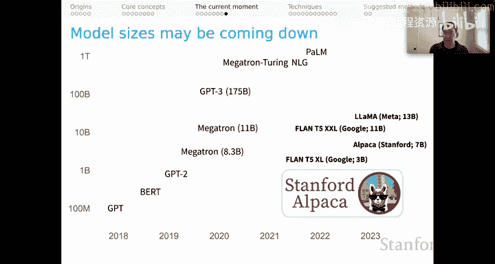
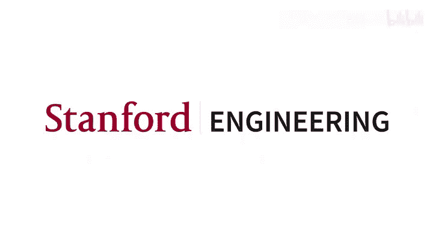

# 22：上下文学习（第三部分）：当前时刻 📚

在本节课中，我们将探讨上下文学习领域的最新动态，重点关注用于训练大型语言模型的数据，特别是从无监督预训练到指令微调的范式转变。我们将了解数据如何塑造模型行为，并介绍一种名为“自我指导”的创新方法，它展示了如何使用模型自身来生成训练数据。

---

## 数据：理解模型行为的关键 🔑

上一节我们讨论了上下文学习的基本原理。本节中，我们来看看数据，特别是用于自监督学习的数据。这是理解我们大型语言模型行为的一个极其重要的因素。

以下是一些关键的数据集和概念：

*   **C4 数据集**：这是一个为 T5 建模工作创建的大规模爬取语料库，由 Dodge 等人在 2021 年进行了审计。《华盛顿邮报》的一篇相关文章称其为“让 ChatGPT 等 AI 听起来很聪明的秘密网站列表”。尽管“秘密”一词可能并不准确，但该文章有助于我们审计此类数据集的内容。
*   **数据的重要性**：用于无监督预训练的数据是理解模型能力和局限性的关键因素。

---

## 从无监督预训练到指令微调 🚀

正如上一节末尾提到的，我们已不再处于语言模型预训练仅仅是无监督语言模型预训练的时代。我们现在已经进入了指令微调的时代。

然而，我们对指令微调的具体情况知之甚少：

*   **工业实验室的做法**：我们并不确切知道大型工业实验室在此方面的数据和协议。可以推断，他们雇佣了大量人员来生成指令数据。这些人员通常执行复杂的任务，例如根据提示编写特定类型的 Python 程序。
*   **监督的本质**：当前从语言模型中看到的复杂能力，并非以某种神奇的方式从无监督预训练中涌现，而是直接来自于标准、传统的监督学习。
*   **模型的自我改进**：我们还可以推断，这些大型工业实验室正在使用他们自己的模型来生成示例，并在示例之间进行裁决。接下来我们将回顾一种名为“自我指导”的方法。

如果你想了解指令微调的感觉，我鼓励你查看 **斯坦福人类偏好数据集**。这是一个基于 Reddit 帖子构建的新指令微调数据集。你可以使用它（或其子集）进行微调，以感受指令数据如何影响模型行为，这可能会很有启发性。

---

## 自我指导：用模型改进模型 🤖

我之前提到了“自我指导”。这是一种强大的方法，指出了我们可以使用模型来使模型变得更好的多种新途径。

以下是“自我指导”方法的工作流程：

1.  **任务池初始化**：从人类编写的 175 个任务开始，放入任务池。
2.  **指令生成**：通过上下文学习，让语言模型生成一些新的指令。
3.  **任务类型识别**：将生成的指令反馈给同一个语言模型，使用新的提示来帮助模型判断该指令是分类任务还是其他类型的任务。
4.  **输入-输出对生成**：根据第 2 步的生成结果，将生成的输出输入到下方两个提示中的一个，从而得到新的输入-输出对，可用于后续的监督式语言模型预训练。
5.  **数据过滤与迭代**：对生成的数据进行质量过滤并确保数据集的多样性，然后将这些生成的指令放回任务池，可以参与生成更多数据。

通过这种方式，我们可以使用一个语言模型来自举生成一个新的数据集，然后用这个新数据集更新同一个模型，希望它能获得更多样化的能力。

---

### 自我指导的提示词示例

这听起来有些抽象。让我们通过他们使用的提示词来逐步了解“自我指导”是如何发生的。

**步骤 1：指令生成**
模型被给予 8 个示例（最初多为人工创建，后续迭代中会加入模型生成的指令），然后被要求生成一个新指令。

**步骤 2：分类任务识别**
将步骤 1 的生成结果输入此提示，模型在上下文中学习预测它是否是一个分类任务。

**步骤 3：生成输入-输出对**
根据步骤 2 的生成结果，将其输入到分类任务提示或非分类任务提示中。这里的结果为我们提供了新的输入-输出对，可用于扩充我们的自我指导数据集。

然后，如前所述，我们以标准方式进行后续的监督式语言模型预训练，或者使用其他技术来更新用于此生成过程的模型。

---

## Alpaca：自我指导的成功案例 🦙

“自我指导”是 **Alpaca** 模型背后的主要机制。Alpaca 是该领域近期的一个重要时刻，因为它开始向人们展示，我们可以通过自我指导方法，对像 70 亿参数这样相对较小的模型进行指令微调，并获得非常强大的结果。

更详细地说，Alpaca 的工作方式如下：

1.  **基础模型**：从一个 LLaMA 模型开始（LLaMA 是 Meta AI 最近发布的一类模型）。
2.  **种子任务**：使用自我指导论文中人类编写的 175 个任务作为起点。
3.  **数据生成**：遵循自我指导流程（略有简化），使用 text-davinci-003 作为引擎来创建新的输入-输出对。
4.  **数据集**：最终得到一个包含 52,000 个示例的数据集。
5.  **模型更新**：使用这些示例更新 LLaMA 模型，从而创建出 Alpaca。

观察发现，这次相对小规模的模型更新工作，在赋予 Alpaca 新的指令遵循行为方面，效果实际上非常强大。

这里有一个关于技术的重要启示：这是一个令人兴奋的新方向，让我们思考如何使这些相对较小的模型性能越来越高。同时，这对你的上下文学习也有启示：显然，如果你能调整自己的提示词，使其与 Alpaca 等模型见过的指令微调数据保持一致，你将会更成功。这个经验可以推广到所有大型语言模型。

对于像 Alpaca 这样的模型，我们可以了解其指令微调数据，但对于最大的模型，我们则无法了解。因此，人们必须有机地发现哪些提示技术有效，我认为这实际上是一个揭示它们指令微调阶段情况的过程。

---

## 模型小型化与性能提升的趋势 📉

正如我所说，Alpaca 令人兴奋，因为它打破了模型规模不断增大的趋势。在本课程介绍讲座中使用的幻灯片显示，模型参数规模一路攀升至 5400 亿的 PaLM。GPT-4 的规模可能比这还要大得多。

由于这种指令微调，我们开始看到模型规模可能会下降，但性能依然非常强大。这极其令人兴奋，因为它必将发生。在智力、技术和财务方面，我们都有很多动力去寻找让小型模型保持高性能的方法。我认为，这将是真正实现大型语言模型及其所能实现的能力民主化访问的重要一步。

---

本节课中，我们一起学习了当前上下文学习领域的关键动态。我们探讨了数据，特别是从无监督预训练到指令微调的转变，并深入了解了“自我指导”这一利用模型自身生成训练数据的方法。最后，我们以 Alpaca 为例，看到了模型小型化与性能提升的积极趋势，这为未来更广泛地应用大型语言模型能力带来了希望。