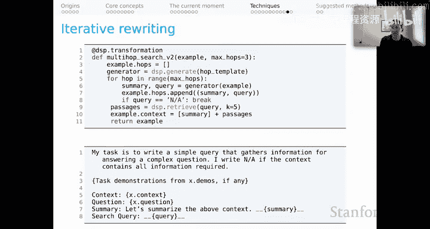
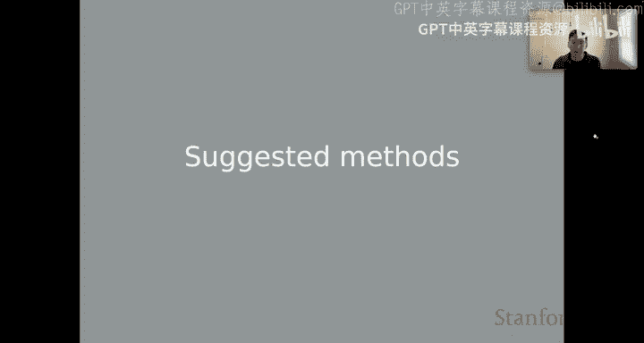
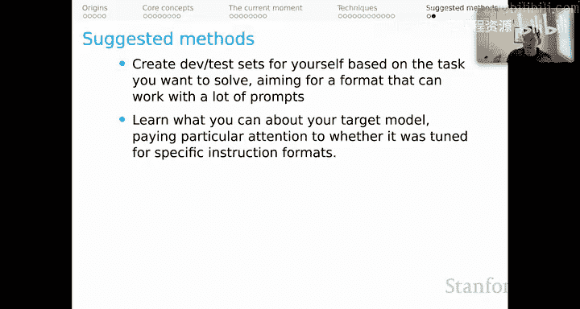
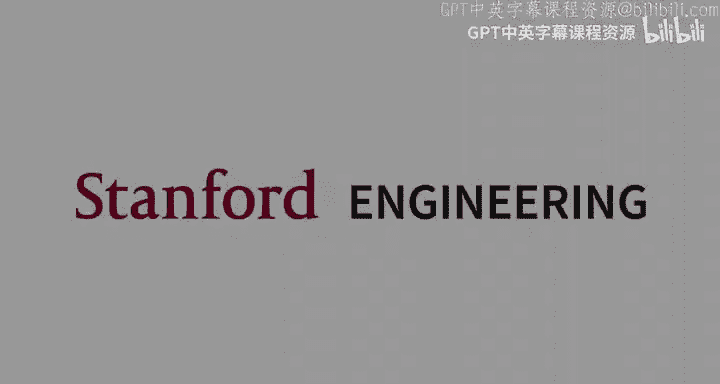

# 23：上下文学习（第四部分）技术与建议方法 🧠

在本节课中，我们将深入探讨上下文学习的具体技术，并为你未来的研究提供一些方向建议。我们将从核心概念“演示”开始，逐步介绍多种提升模型表现的技术，最后总结一些实用的研究方法。

## 概述：什么是演示？🤔

上一节我们介绍了上下文学习的基本概念，本节中我们来看看一个核心技巧：**演示**。演示的概念至少可以追溯到GPT-2论文，它在设计有效的上下文学习系统中极其强大。

让我们以“少样本开放域问答”为例进行说明。假设我们有一个问题：“Bert是谁？”。我们准备将这个提问输入给语言模型，并希望它能生成一个好答案。

现在你可能已经意识到，在提示词中插入一个相关的上下文段落会很有帮助，可以为模型提供回答问题的证据。演示背后的思想是，向模型展示我们希望它模仿的行为示例也可能很有用。

因此，我们可能有一个训练集的问答对，我们取出其中一个问答对并将其插入到提示词中。例如，我们插入问题“Kermit是谁？”以及它的答案。

## 如何选择与构建演示？🔍

以下是关于选择和构建演示的一些关键考虑点：

**选择答案的来源**
*   你可以直接使用训练集中问答对的“黄金答案”。
*   但反直觉的是，使用从某个数据存储中检索到的答案，甚至使用你正在提示的同一语言模型生成的答案，可能更有用。这可能有助于找到更符合你当前语言模型实际能力的演示。

**选择证据段落的来源**
*   当然，如果有的话，可以直接使用训练数据中的“黄金段落”。
*   但由于我们为目标问题检索了一个段落，为了更贴近模型的实际体验，使用检索到的段落而非黄金段落来构建演示，可能能更好地示范预期行为。

**选择演示的策略**
*   你可以从可用数据中随机选择演示。
*   更好的方法是根据演示与目标示例的关系来选择。例如，在生成任务中，可以根据与目标输入的某种相似性来检索示例；在分类任务中，可以选择能帮助模型隐式确定目标输入类型的演示。

**过滤演示以满足特定标准**
*   在生成任务中，可能希望确保证据段落包含输出字符串，以帮助模型理解如何处理我们提供的证据。
*   在分类任务中，一个直接的做法是确保每个提示的演示集都包含数据集中出现的每个标签，这样模型就能看到每个可能行为的示例。

**加工可用的演示**
*   我们可以对演示进行采样，然后用语言模型重写它们。
*   这样做可以综合多个初始演示，可能更高效，并允许我们包含更多演示。
*   我们还可以改变风格或格式以匹配目标，使用语言模型使演示更符合语言模型的期望或能力。

你需要习惯的一个基本点是：对于强大的上下文学习系统，你的提示词可能包含由同一个语言模型通过不同提示生成的子字符串。是的，这可以是递归的。尽管子字符串本身可能是多次调用语言模型的产物，但最终结果可以非常有效地将语言模型的行为与你希望看到的结果对齐。

## 链式思维与分步推理 🧩

让我们转向另一种技术：**链式思维**。我认为这也是一个持久有效的思想。

链式思维背后的直觉是，对于复杂的事情，要求模型在初始标记中直接生成答案可能负担过重。因此，在链式思维中，我们构建鼓励模型以逐步方式生成、暴露自身推理并最终得出答案的演示。

这再次展示了演示的力量：我们用这些可能手工构建的、详尽的提示来示范链式思维。然后，当模型执行我们的目标行为时，演示会引导它进行类似的链式思维，最终产生我们希望的正确答。

我认为存在一个更通用的版本，可以非常强大，我称之为**带指令的通用分步推理**。在这里，我们肯定在某种程度上与这些模型可能经历过的指令微调对齐，并以某种间接方式利用它。

## 自我一致性与自我提问 ✅

**自我一致性**是另一个强大的方法。这来自于Wang等人2022年的工作，与早期称为“检索增强生成”的模型密切相关。

我们将使用语言模型来采样一堆不同的生成响应，这些响应可能通过类似链式思维的推理走过不同的推理路径，并最终产生一些答案。这些答案可能因模型采取的不同生成路径而异。我们要做的是，选择在所有不同推理路径中最常产生的答案。从技术上讲，这是通过边缘化推理路径来得出的答案的一种形式，其直觉是，被最多路径得出或给定所有路径最可能的答案，很可能是可信的。

**自我提问**是另一个有趣的想法。自我提问背后的思想是，通过演示，鼓励模型将其推理分解成一系列它向自己提出并试图回答的问题。这样，模型将迭代地达到能够找到整体问题答案的程度。这对于可能是“多跳”的问题尤其强大，即可能涉及多个不同资源的问题，你可以将其分解为需要解决的多个子问题，以获得最终问题的答案。

自我提问对我们这些以检索为导向的研究者来说有一个有趣的特性：它可以与检索结合来回答中间问题。与其信任模型对这些中间问题的生成，不如使用像搜索引擎这样的工具来回答这些问题，然后将答案插入提示词中，模型继续运行。

## 迭代重写与工具整合 🔄

另一个我相信无论人们发现什么关于上下文学习的新技术都会存续的、非常强大的通用思想是：**迭代重写提示词的部分内容**可能很有用。你可以重写演示、它们包含的上下文段落、问题或答案。

特别是在提示窗口有限或信息非常复杂的情况下，迭代地让语言模型重写其自身提示词的部分内容，然后用这些重写的块来提示模型，作为一种综合信息和获得更好结果的方式，这可能很有帮助。这是一个非常强大的想法。

最后，在当前这个或许是短暂的时刻，涉及多个预训练组件和工具的提示设计，相对于其潜在价值而言，似乎尚未被充分探索。对于本单元，我们正在探索检索模型和语言模型如何协同工作以完成强大的任务。但我们显然可以引入其他预训练组件，甚至其他核心计算能力，如计算器、API等。思考如何设计能利用所有这些不同工具的提示词，是一个美妙的新途径。

## 总结与建议方法 📝

本节课中我们一起学习了多种提升上下文学习效果的技术，从演示的选择与构建，到链式思维、自我一致性和自我提问等高级推理方法，再到迭代重写和工具整合的通用思想。

基于以上内容，以下是一些建议的研究方法供你思考：

**建立评估基准**
首先，作为一种工作习惯，根据你想要解决的任务，为自己创建开发集和测试集，并采用能与许多不同提示词配合的格式。首先做这件事，这样在你探索时，你就有一个固定的目标去努力实现，这将帮助你获得更好的结果并更加科学严谨。

**了解你的目标模型**
尽可能了解你的目标模型，包括它是如何训练的等等。特别要注意它是否针对特定的指令格式进行过微调。我认为我们已经看到，只要你能与其指令微调数据对齐，你就会获得更好的结果。

**将提示词编写视为AI系统设计**
尝试编写系统化、可推广的代码来处理整个工作流程，从读取数据到提取响应和分析结果。这是DSP背后的指导哲学思想。即使超越DSP，我认为这也是一个重要的方法论说明。我们不应该以非常临时的方式敲出提示词和设计系统。我们应该将其视为我们编程AI系统的新模式，并尽可能认真地对待它。

**探索多组件与工具整合**
最后，探索如何将检索模型、语言模型乃至计算器、API等其他工具结合起来，设计强大的提示系统，这是一个充满潜力的新方向。